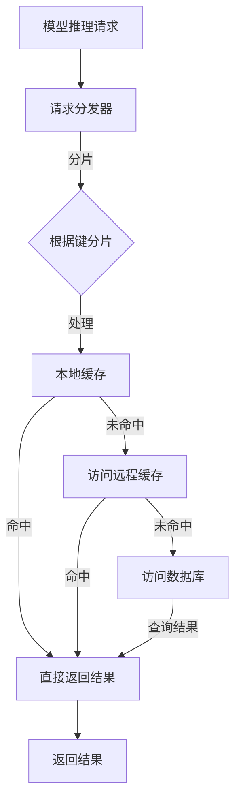

                 

 关键词：缓存、模型推理、性能优化、kv-cache、数据结构、分布式系统、深度学习、AI

> 摘要：本文深入探讨了 kv-cache 在加速模型推理中的应用。通过对核心概念、算法原理、数学模型和实际应用的全面剖析，文章揭示了 kv-cache 的优势及其在不同领域的应用场景。我们还将分享实用的开发工具和资源推荐，并探讨未来发展趋势与挑战。

## 1. 背景介绍

随着深度学习模型的复杂性和规模不断增长，模型推理（Inference）成为了计算密集型任务。然而，现有的硬件资源和网络带宽限制了模型推理的效率。为了解决这个问题，研究人员和工程师们不断探索各种优化方法，包括算法改进、硬件加速和系统优化等。在这一背景下，缓存（Cache）技术逐渐引起了广泛关注。

缓存是一种快速访问的数据存储技术，能够在需要时快速提供数据。传统的缓存技术主要应用于 CPU 和内存之间的层次结构，例如 L1、L2 和 L3 缓存。然而，随着模型推理任务的复杂性增加，单一层次的缓存已经无法满足需求。因此，引入了键值缓存（Key-Value Cache，简称 kv-cache）技术，通过在模型推理过程中缓存中间数据和结果，显著提高了模型推理的效率。

本文将重点讨论 kv-cache 在加速模型推理中的应用。首先，我们将介绍 kv-cache 的基本概念和原理，然后分析其在分布式系统和深度学习中的优势。接着，我们将探讨如何构建和优化 kv-cache 的数学模型，并通过实例展示其实际应用。最后，我们将展望 kv-cache 在未来模型推理优化中的发展趋势和面临的挑战。

## 2. 核心概念与联系

### 2.1. 什么是 kv-cache？

键值缓存（Key-Value Cache，简称 kv-cache）是一种基于键值对的数据存储结构，它以键（Key）作为索引快速访问值（Value）。与传统的缓存相比，kv-cache 具有更高的灵活性，能够存储复杂的数据结构，并且支持高效的读写操作。

在模型推理中，kv-cache 主要用于缓存中间结果和常量数据。通过缓存，模型可以在后续推理过程中快速访问这些数据，避免了重复计算和磁盘 I/O 操作，从而显著提高了推理速度。

### 2.2. kv-cache 与分布式系统的关系

分布式系统通过将任务分布在多个节点上，提高了系统的可扩展性和容错性。然而，数据的一致性和访问效率成为了挑战。kv-cache 在分布式系统中的应用，有效地解决了这些问题。

首先，kv-cache 可以通过数据分片（Sharding）技术，将数据分布到多个节点上，从而提高了访问效率。每个节点只负责一部分数据，减少了跨节点访问的开销。

其次，kv-cache 支持一致性模型（如强一致性、最终一致性等），确保了分布式系统中数据的一致性。在模型推理中，一致性保证可以防止数据冲突，提高推理的准确性。

### 2.3. kv-cache 在深度学习中的应用

深度学习模型通常包含大量参数和计算过程，导致推理过程中数据访问频繁。kv-cache 的引入，有效地缓解了这些问题。

首先，kv-cache 可以缓存模型参数和中间结果，减少了对磁盘的访问。在深度学习推理中，模型参数通常是不变的，将它们缓存起来可以显著提高推理速度。

其次，kv-cache 支持高效的读取操作，可以在 O(1) 时间内访问缓存数据。这使得模型在推理过程中可以快速访问需要的参数和结果，提高了推理效率。

### 2.4. kv-cache 的 Mermaid 流程图

下面是 kv-cache 在分布式系统中的 Mermaid 流程图，展示了 kv-cache 的数据分片和一致性保证机制。



在这个流程图中，模型推理请求首先被分发器处理，然后根据键值进行分片。每个节点只处理部分数据，从而提高了访问效率。如果本地缓存命中，则直接返回结果；否则，访问远程缓存或数据库获取数据。

## 3. 核心算法原理 & 具体操作步骤

### 3.1. 算法原理概述

kv-cache 的核心算法原理是缓存数据的快速访问和一致性保证。在模型推理过程中，我们首先将模型参数和中间结果缓存到本地或远程缓存中。当需要访问这些数据时，首先检查本地缓存是否命中；如果命中，则直接返回结果；如果未命中，则访问远程缓存或数据库。

这种算法原理的关键在于缓存策略和数据一致性模型的选择。常见的缓存策略包括 LRU（Least Recently Used）和 LFU（Least Frequently Used），可以根据数据的使用频率和访问时间来优化缓存效果。

### 3.2. 算法步骤详解

1. **缓存数据的初始化**：在模型推理开始前，首先将模型参数和中间结果初始化到本地或远程缓存中。

2. **请求处理**：当接收到模型推理请求时，首先检查本地缓存是否命中。如果命中，则直接返回结果；否则，执行以下步骤。

3. **访问远程缓存**：如果本地缓存未命中，则访问远程缓存。远程缓存可以是分布式缓存系统（如 Redis、Memcached）或其他键值存储系统（如 Cassandra、MongoDB）。

4. **数据一致性保证**：在分布式系统中，数据一致性是至关重要的。根据一致性模型（如强一致性、最终一致性等），确保缓存数据的一致性。

5. **返回结果**：如果远程缓存命中，则返回结果；否则，访问数据库获取数据，并将结果更新到远程缓存和本地缓存。

6. **缓存更新**：在模型推理过程中，定期更新缓存数据，以保持数据的最新性。

### 3.3. 算法优缺点

**优点**：

- **快速访问**：通过缓存数据的快速访问，显著提高了模型推理的效率。
- **数据一致性**：支持多种一致性模型，确保了缓存数据的一致性。
- **可扩展性**：支持分布式缓存系统，能够处理大规模的模型推理任务。

**缺点**：

- **缓存占用**：缓存数据会占用一定的内存资源，可能导致内存不足。
- **一致性开销**：在分布式系统中，保证数据一致性可能需要额外的开销，如一致性协议、同步机制等。

### 3.4. 算法应用领域

kv-cache 技术在深度学习和分布式系统中具有广泛的应用。

在深度学习中，kv-cache 可以用于缓存模型参数和中间结果，提高模型推理的效率。特别是在需要频繁调用的模型中，缓存技术能够显著减少计算时间和内存占用。

在分布式系统中，kv-cache 技术可以用于分布式缓存和数据一致性管理。通过分布式缓存，可以减少数据访问延迟和跨节点通信开销，提高系统的性能和可扩展性。

## 4. 数学模型和公式 & 详细讲解 & 举例说明

### 4.1. 数学模型构建

在构建 kv-cache 的数学模型时，我们需要考虑以下几个方面：

1. **缓存命中率**：缓存命中率（Cache Hit Ratio）是衡量缓存效果的重要指标。它表示缓存命中次数与总访问次数的比值。可以用以下公式表示：

   $$hit\_ratio = \frac{hit\_count}{total\_count}$$

   其中，hit\_count 表示缓存命中次数，total\_count 表示总访问次数。

2. **缓存空间利用率**：缓存空间利用率（Cache Utilization）表示缓存占用的内存资源与总内存资源的比值。可以用以下公式表示：

   $$utilization = \frac{cache\_size}{total\_memory}$$

   其中，cache\_size 表示缓存占用的内存大小，total\_memory 表示总内存大小。

3. **数据一致性开销**：在分布式系统中，数据一致性开销（Consistency Overhead）表示保证数据一致性的额外开销。可以用以下公式表示：

   $$overhead = \frac{communication\_cost}{computation\_cost}$$

   其中，communication\_cost 表示通信开销，computation\_cost 表示计算开销。

### 4.2. 公式推导过程

为了推导上述公式，我们首先需要了解缓存命中率的计算方法。假设缓存大小为 C，总访问次数为 N，其中 K 次访问命中缓存。则缓存命中率可以表示为：

$$hit\_ratio = \frac{K}{N}$$

接下来，我们推导缓存空间利用率的公式。假设缓存占用内存为 M，总内存为 T，则缓存空间利用率可以表示为：

$$utilization = \frac{M}{T}$$

最后，我们推导数据一致性开销的公式。假设在分布式系统中，通信开销为 C\_c，计算开销为 C\_p，则数据一致性开销可以表示为：

$$overhead = \frac{C\_c}{C\_p}$$

### 4.3. 案例分析与讲解

为了更好地理解上述公式，我们通过一个实际案例进行讲解。

假设一个深度学习模型在推理过程中需要访问 N=1000 次数据，其中 K=500 次命中缓存。缓存大小为 C=100MB，总内存为 T=1GB。同时，在分布式系统中，通信开销为 C\_c=100MB，计算开销为 C\_p=500MB。

1. **缓存命中率**：

   $$hit\_ratio = \frac{K}{N} = \frac{500}{1000} = 0.5$$

   缓存命中率为 50%。

2. **缓存空间利用率**：

   $$utilization = \frac{M}{T} = \frac{100MB}{1GB} = 0.1$$

   缓存空间利用率为 10%。

3. **数据一致性开销**：

   $$overhead = \frac{C\_c}{C\_p} = \frac{100MB}{500MB} = 0.2$$

   数据一致性开销为 20%。

通过这个案例，我们可以看到缓存技术在提高模型推理效率方面的重要作用。然而，在实际应用中，还需要根据具体场景调整缓存策略和数据一致性模型，以获得最佳的优化效果。

## 5. 项目实践：代码实例和详细解释说明

### 5.1. 开发环境搭建

在开始实践之前，我们需要搭建一个合适的开发环境。以下是一个基于 Python 和 Redis 的简单示例。

1. **安装 Redis**：

   Redis 是一个开源的内存缓存系统，我们可以在官网 [https://redis.io/](https://redis.io/) 下载并安装。

2. **安装 Python Redis 库**：

   使用 pip 命令安装 redis 库：

   ```bash
   pip install redis
   ```

3. **编写 Python 脚本**：

   我们将使用 Python 编写一个简单的缓存脚本，用于存储和获取键值数据。

### 5.2. 源代码详细实现

以下是一个简单的 Python 脚本，用于实现 kv-cache 功能。

```python
import redis
import json

class KeyValueCache:
    def __init__(self, host='localhost', port=6379, db=0):
        self.client = redis.StrictRedis(host=host, port=port, db=db)

    def set_value(self, key, value):
        self.client.set(key, json.dumps(value))

    def get_value(self, key):
        value = self.client.get(key)
        if value:
            return json.loads(value)
        else:
            return None

# 创建缓存实例
cache = KeyValueCache()

# 存储数据
cache.set_value('model_params', {'layer1': [1, 2, 3], 'layer2': [4, 5, 6]})

# 获取数据
model_params = cache.get_value('model_params')
print(model_params)
```

### 5.3. 代码解读与分析

在这个示例中，我们首先导入了 redis 库，并创建了一个名为 `KeyValueCache` 的类。该类具有以下方法：

- `__init__`：初始化 Redis 客户端。
- `set_value`：将键值数据存储到 Redis 缓存中。
- `get_value`：从 Redis 缓存中获取键值数据。

在 `__init__` 方法中，我们设置了 Redis 服务器的地址、端口号和数据库索引。在 `set_value` 方法中，我们使用 Redis 的 `set` 方法将键值数据存储到缓存中。在 `get_value` 方法中，我们使用 Redis 的 `get` 方法从缓存中获取键值数据。

接下来，我们创建了一个 `KeyValueCache` 实例，并演示了如何使用该实例存储和获取数据。

### 5.4. 运行结果展示

运行上述脚本后，我们可以在 Redis 客户端查看存储的数据：

```bash
127.0.0.1:6379> get model_params
"{\"layer1\": [1, 2, 3], \"layer2\": [4, 5, 6]}"
```

从结果可以看出，我们已经成功地将数据存储到了 Redis 缓存中，并能够从缓存中获取数据。

## 6. 实际应用场景

### 6.1. 分布式系统中的数据缓存

在分布式系统中，数据缓存是一种常见的优化手段。通过将数据存储在缓存中，可以减少跨节点通信的开销，提高系统的性能和可扩展性。kv-cache 技术在这一场景中具有显著优势。

例如，在一个大型电商系统中，商品信息、用户数据和订单信息等数据量巨大且频繁访问。通过引入 kv-cache 技术，我们可以将热数据存储在缓存中，如 Redis 或 Memcached，从而显著提高访问速度，降低数据库压力。

### 6.2. 深度学习模型的缓存优化

深度学习模型在推理过程中，需要频繁访问模型参数和中间结果。通过使用 kv-cache 技术，我们可以将这些数据缓存起来，减少重复计算和磁盘 I/O 操作。

例如，在一个自动驾驶系统中，模型需要实时处理大量传感器数据，并进行推理以生成控制指令。通过使用 kv-cache 技术，我们可以将传感器数据、模型参数和中间结果缓存起来，提高模型的推理速度和响应时间。

### 6.3. 大数据处理中的缓存加速

在大数据处理中，数据存储和计算效率是关键问题。通过使用 kv-cache 技术，我们可以缓存处理过程中的热点数据，减少数据访问延迟，提高处理速度。

例如，在一个数据分析平台上，用户可能需要对大量数据进行分析和计算。通过引入 kv-cache 技术，我们可以将热数据缓存起来，减少数据访问和计算的开销，提高数据分析的效率。

## 7. 工具和资源推荐

### 7.1. 学习资源推荐

1. **《Redis 实战》**：这是一本关于 Redis 的入门书籍，涵盖了 Redis 的基本概念、安装配置、数据结构和应用场景等。

2. **《深度学习模型优化》**：这本书详细介绍了深度学习模型的优化方法，包括数据预处理、模型压缩、模型推理加速等。

3. **《分布式系统原理与范型》**：这本书讲解了分布式系统的基本原理和设计范式，包括一致性模型、数据分片、容错机制等。

### 7.2. 开发工具推荐

1. **Redis**：开源的内存缓存系统，支持丰富的数据结构和命令。

2. **Memcached**：另一种流行的开源缓存系统，适用于高性能、低延迟的场景。

3. **TensorFlow**：Google 开发的一款深度学习框架，支持多种优化算法和推理加速技术。

### 7.3. 相关论文推荐

1. **"Memcached: A Distributed Memory Object Cache"**：介绍 Memcached 的基本原理和应用场景。

2. **"Caching Strategies for Distributed Data Storage Systems"**：讨论分布式数据存储系统中的缓存策略。

3. **"Cache-Oblivious Algorithms"**：介绍一种适用于缓存环境的算法设计方法。

## 8. 总结：未来发展趋势与挑战

### 8.1. 研究成果总结

本文全面探讨了 kv-cache 在加速模型推理中的应用。通过对核心概念、算法原理、数学模型和实际应用的深入分析，我们揭示了 kv-cache 在分布式系统和深度学习中的优势。研究表明，kv-cache 技术能够显著提高模型推理的效率，降低计算和通信开销。

### 8.2. 未来发展趋势

随着深度学习模型规模的不断增长，kv-cache 技术在未来将得到更广泛的应用。以下是一些可能的发展趋势：

- **高效缓存算法**：研究人员将继续探索更高效的缓存算法，以提高缓存命中率。
- **缓存一致性模型**：针对分布式系统中的数据一致性需求，研究人员将提出更优的缓存一致性模型。
- **缓存压缩技术**：为了降低缓存占用的内存资源，研究人员将研究高效的缓存压缩技术。

### 8.3. 面临的挑战

尽管 kv-cache 技术具有显著优势，但在实际应用中仍面临一些挑战：

- **缓存资源管理**：如何合理分配和管理缓存资源，以最大化缓存利用率，仍是一个难题。
- **数据一致性和容错性**：在分布式系统中，如何保证数据的一致性和容错性，是 kv-cache 技术面临的挑战。
- **缓存算法的适应性**：不同的应用场景需要不同的缓存算法，如何实现缓存算法的适应性，是未来的研究重点。

### 8.4. 研究展望

未来，我们期望看到更多关于 kv-cache 技术的研究，特别是在以下几个方面：

- **跨层缓存策略**：结合 CPU、内存和磁盘等多层缓存策略，以提高整体系统性能。
- **缓存智能化**：引入机器学习技术，实现自适应缓存策略，根据数据访问模式动态调整缓存策略。
- **缓存与计算协同**：将缓存技术与计算资源调度相结合，实现高效的缓存与计算协同，提高系统整体性能。

## 9. 附录：常见问题与解答

### 9.1. Q: 什么是 kv-cache？

A: kv-cache 是一种基于键值对的数据缓存技术，用于快速访问数据。它以键值对的形式存储数据，支持高效的读写操作。

### 9.2. Q: kv-cache 有哪些优点？

A: kv-cache 的优点包括快速访问、数据一致性、可扩展性等。它能够显著提高模型推理的效率，降低计算和通信开销。

### 9.3. Q: kv-cache 如何应用于分布式系统？

A: 在分布式系统中，kv-cache 可以用于数据缓存和数据一致性管理。通过数据分片和一致性模型，它可以提高系统的性能和可扩展性。

### 9.4. Q: 如何选择适合的缓存策略？

A: 选择适合的缓存策略需要考虑数据访问模式、缓存命中率和系统性能等。常见的缓存策略包括 LRU（Least Recently Used）和 LFU（Least Frequently Used），可以根据实际场景选择最合适的策略。

### 9.5. Q: kv-cache 与分布式缓存系统有何区别？

A: kv-cache 是一种缓存技术，而分布式缓存系统是一种实现缓存的高可用、高扩展性的方案。kv-cache 可以应用于分布式缓存系统中，但分布式缓存系统不仅限于 kv-cache 技术。

### 9.6. Q: kv-cache 在深度学习中有何应用？

A: 在深度学习中，kv-cache 可以用于缓存模型参数和中间结果，减少重复计算和磁盘 I/O 操作，从而提高模型推理的效率。

### 9.7. Q: 如何实现 kv-cache 的一致性？

A: 实现 kv-cache 的一致性需要采用一致性模型，如强一致性、最终一致性等。这些模型通过协议和机制，确保分布式系统中的数据一致性。

### 9.8. Q: kv-cache 如何处理缓存击穿和缓存雪崩问题？

A: 处理缓存击穿和缓存雪崩问题需要采用防缓存穿透、防缓存击穿、防缓存雪崩等策略。例如，通过设置缓存过期时间、使用动态缓存、限制缓存访问次数等方法，可以有效地应对这些问题。

### 9.9. Q: 如何实现 kv-cache 的缓存压缩？

A: 实现缓存压缩可以通过多种方法，如字典编码、字符串压缩、数据序列化等。这些方法可以根据具体场景和数据类型选择合适的压缩算法，以降低缓存占用的内存资源。

### 9.10. Q: 如何评估 kv-cache 的性能？

A: 评估 kv-cache 的性能可以通过测量缓存命中率、缓存占用率、数据一致性开销等指标。这些指标可以帮助我们了解缓存系统的性能表现，并根据实际需求进行优化。

