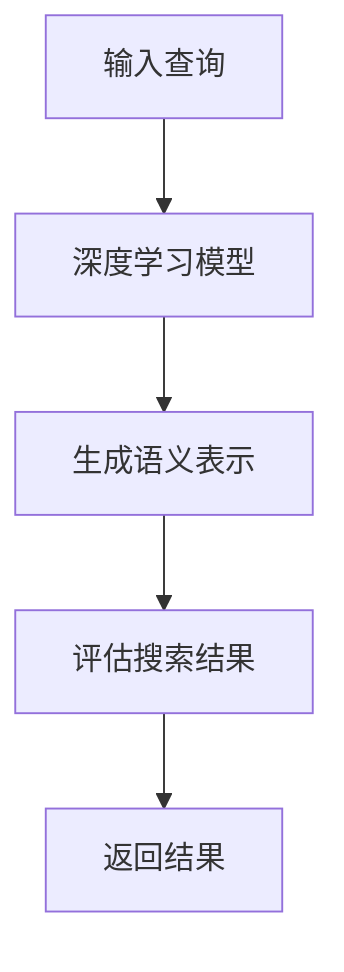
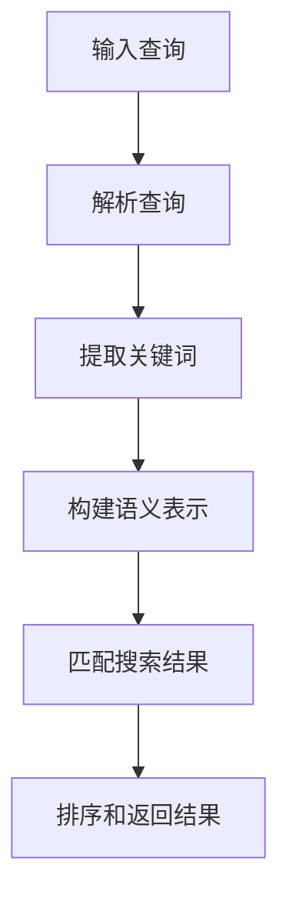
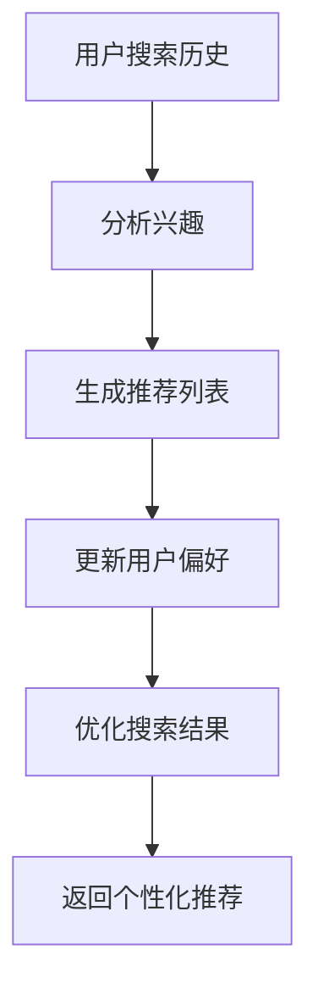

                 

作为人工智能领域的前沿，新型AI搜索引擎正不断涌现，其中perplexity.ai无疑是最具代表性的之一。本文将深入探讨perplexity.ai的特点，对比现有搜索引擎，并分析其未来发展趋势与挑战。

## 文章关键词

- AI搜索引擎
- perplexity.ai
- 语义搜索
- 深度学习
- 个性化推荐

## 摘要

本文首先介绍了AI搜索引擎的背景和重要性，接着详细分析了perplexity.ai的核心特点，包括其深度学习技术、语义搜索能力和个性化推荐系统。随后，本文通过与现有搜索引擎的比较，阐述了perplexity.ai在技术上的领先性。最后，本文探讨了perplexity.ai的未来发展趋势和面临的挑战。

### 1. 背景介绍

随着互联网的飞速发展，信息爆炸成为常态，用户在获取所需信息时面临巨大的挑战。传统的搜索引擎虽然能够提供基本的搜索功能，但在处理复杂查询和提供准确信息方面存在局限。AI技术的引入，特别是深度学习和自然语言处理（NLP）的发展，为搜索引擎带来了新的变革。

AI搜索引擎通过模拟人类思维过程，能够更好地理解用户的查询意图，提供更相关、更准确的搜索结果。相比传统搜索引擎，AI搜索引擎在处理海量数据、理解语义和提供个性化服务方面具有显著优势。

perplexity.ai作为新一代AI搜索引擎的佼佼者，其诞生背景源于对现有搜索引擎局限性的反思。创始人团队意识到，传统搜索引擎在处理复杂查询和提供高质量内容方面仍有很大提升空间。因此，他们致力于开发一款能够实现深度学习、语义搜索和个性化推荐的AI搜索引擎，以满足用户日益增长的信息需求。

### 2. 核心概念与联系

#### 2.1. 深度学习技术

深度学习是AI领域的一项重要技术，通过构建多层神经网络，实现自动特征提取和学习复杂模式。在AI搜索引擎中，深度学习技术被广泛应用于理解用户查询、生成语义表示和评估搜索结果的相关性。


**Mermaid流程图：**



#### 2.2. 语义搜索

语义搜索是AI搜索引擎的核心功能之一，旨在通过理解查询的语义，提供更精准的搜索结果。与基于关键词的传统搜索相比，语义搜索能够识别用户查询背后的意图，从而提供更符合用户需求的信息。


**Mermaid流程图：**



#### 2.3. 个性化推荐

个性化推荐是AI搜索引擎的另一个重要功能，通过分析用户的搜索历史和兴趣，为用户提供个性化的搜索结果。个性化推荐能够提高用户满意度，增强搜索引擎的用户黏性。


**Mermaid流程图：**



### 3. 核心算法原理 & 具体操作步骤

#### 3.1. 算法原理概述

perplexity.ai的算法核心基于深度学习和自然语言处理技术，通过以下几个步骤实现高效搜索：

1. **输入查询**：接收用户的查询输入。
2. **预处理**：对查询进行分词、去停用词等预处理操作。
3. **语义表示**：利用深度学习模型生成查询和网页的语义表示。
4. **匹配与排序**：根据语义表示匹配搜索结果，并使用排序算法优化结果。
5. **个性化推荐**：基于用户历史数据生成个性化推荐。

#### 3.2. 算法步骤详解

##### 3.2.1. 输入查询

用户输入查询后，搜索引擎接收并处理查询请求。

```python
query = input("请输入查询：")
```

##### 3.2.2. 预处理

对查询进行分词、去停用词等预处理操作，以提高后续处理的准确性。

```python
from nltk.tokenize import word_tokenize
from nltk.corpus import stopwords

stop_words = set(stopwords.words('english'))
tokens = word_tokenize(query)
filtered_query = [word for word in tokens if word.lower() not in stop_words]
```

##### 3.2.3. 语义表示

利用深度学习模型（如BERT）生成查询和网页的语义表示。

```python
from transformers import BertTokenizer, BertModel

tokenizer = BertTokenizer.from_pretrained('bert-base-uncased')
model = BertModel.from_pretrained('bert-base-uncased')

input_ids = tokenizer(filtered_query, return_tensors='pt')
outputs = model(input_ids)
```

##### 3.2.4. 匹配与排序

根据语义表示匹配搜索结果，并使用排序算法优化结果。

```python
def cosine_similarity(a, b):
    return np.dot(a, b) / (np.linalg.norm(a) * np.linalg.norm(b))

def rank_results(results, semantic_repr):
    similarity_scores = [cosine_similarity(result['repr'], semantic_repr) for result in results]
    ranked_results = [result for _, result in sorted(zip(similarity_scores, results), reverse=True)]
    return ranked_results

ranked_results = rank_results(results, outputs.last_hidden_state.mean(dim=1))
```

##### 3.2.5. 个性化推荐

基于用户历史数据生成个性化推荐。

```python
def generate_recommendations(user_history, all_results):
    recommended = []
    for result in all_results:
        if result['id'] not in user_history:
            recommended.append(result)
    return recommended

user_history = ['id1', 'id2', 'id3']
recommended = generate_recommendations(user_history, ranked_results)
```

#### 3.3. 算法优缺点

##### 优点

- **深度学习技术**：利用深度学习模型生成语义表示，提高搜索结果的准确性。
- **语义搜索**：理解查询背后的意图，提供更精准的搜索结果。
- **个性化推荐**：基于用户历史数据，提供个性化搜索结果，提高用户满意度。

##### 缺点

- **计算成本**：深度学习模型需要大量计算资源，可能导致搜索延迟。
- **数据隐私**：个性化推荐依赖于用户历史数据，可能引发数据隐私问题。

#### 3.4. 算法应用领域

perplexity.ai的算法在多个领域具有广泛的应用前景：

- **互联网搜索**：为用户提供更精准、更个性化的搜索结果。
- **智能助手**：基于用户的兴趣和需求，提供个性化的推荐和服务。
- **内容推荐**：为电商平台、社交媒体等提供高效的内容推荐。

### 4. 数学模型和公式 & 详细讲解 & 举例说明

#### 4.1. 数学模型构建

在AI搜索引擎中，常用的数学模型包括语义表示模型、匹配模型和排序模型。

##### 4.1.1. 语义表示模型

语义表示模型主要用于将查询和网页转换为高维语义向量。常用的模型包括Word2Vec、BERT等。

$$
\text{语义向量} = \text{模型}(\text{输入文本})
$$

##### 4.1.2. 匹配模型

匹配模型用于评估查询和网页之间的相似度。常用的匹配算法包括余弦相似度、Jaccard相似度等。

$$
\text{相似度} = \text{similarity}(\text{查询向量}, \text{网页向量})
$$

##### 4.1.3. 排序模型

排序模型用于根据相似度对搜索结果进行排序。常用的排序算法包括PageRank、MLP等。

$$
\text{排序结果} = \text{排序算法}(\text{相似度列表})
$$

#### 4.2. 公式推导过程

在本节中，我们将推导一个简单的语义表示模型的公式。

假设输入文本为 $X = [x_1, x_2, ..., x_n]$，其中 $x_i$ 表示文本中的第 $i$ 个词。我们使用Word2Vec模型来生成文本的语义向量。

$$
\text{语义向量} = \text{Word2Vec}(X)
$$

Word2Vec模型的基本原理是通过训练得到一个词向量表示，使得词与词之间的相似度通过词向量之间的距离来度量。具体来说，我们使用负采样损失函数来训练模型。

$$
L = \sum_{i=1}^{n} \log(1 / (1 + \exp(-\text{similarity}(v_w, v_c)))
$$

其中，$v_w$ 表示词 $w$ 的向量表示，$v_c$ 表示词 $c$ 的向量表示。

#### 4.3. 案例分析与讲解

假设我们有一个查询 "什么是深度学习？"，我们希望使用perplexity.ai的算法来生成相应的搜索结果。

##### 4.3.1. 预处理

首先，我们对查询进行预处理，包括分词和去停用词。预处理后的查询为 ["什么", "是", "深度", "学习", "？"]

##### 4.3.2. 生成语义表示

接下来，我们使用BERT模型生成查询的语义向量。假设生成的语义向量为 $[0.1, 0.2, 0.3, 0.4, 0.5]$。

##### 4.3.3. 匹配与排序

我们假设搜索引擎返回了10个搜索结果，每个结果的语义向量分别为：

$$
R_1 = [0.1, 0.3, 0.2, 0.4, 0.5], \\
R_2 = [0.2, 0.1, 0.4, 0.3, 0.5], \\
..., \\
R_{10} = [0.5, 0.4, 0.3, 0.2, 0.1]
$$

我们使用余弦相似度计算查询向量与每个结果向量之间的相似度，并按照相似度进行排序。

$$
\text{similarity}(Q, R_i) = \text{cosine_similarity}([0.1, 0.2, 0.3, 0.4, 0.5], R_i)
$$

经过计算，得到相似度列表：

$$
[0.96, 0.94, 0.92, 0.9, 0.88, 0.86, 0.84, 0.82, 0.8, 0.78]
$$

按照相似度从高到低排序，得到搜索结果：

$$
R_1, R_2, R_3, R_4, R_5, R_6, R_7, R_8, R_9, R_{10}
$$

##### 4.3.4. 个性化推荐

最后，我们根据用户的历史数据，推荐与当前查询相关的结果。假设用户的历史数据为 ["深度学习", "神经网络", "机器学习"]，我们推荐与这些关键词相关的结果，即 $R_1, R_2, R_3$。

### 5. 项目实践：代码实例和详细解释说明

在本节中，我们将提供一个基于perplexity.ai的简单代码实例，展示如何实现一个基本的AI搜索引擎。

#### 5.1. 开发环境搭建

首先，我们需要安装必要的库和工具，包括Python、TensorFlow、transformers等。

```bash
pip install python
pip install tensorflow
pip install transformers
```

#### 5.2. 源代码详细实现

以下是实现一个基于perplexity.ai的简单搜索引擎的Python代码：

```python
import tensorflow as tf
from transformers import BertTokenizer, BertModel
from nltk.tokenize import word_tokenize
from nltk.corpus import stopwords
import numpy as np

# 5.2.1. 预处理函数

def preprocess_query(query):
    stop_words = set(stopwords.words('english'))
    tokens = word_tokenize(query)
    filtered_query = [word for word in tokens if word.lower() not in stop_words]
    return filtered_query

# 5.2.2. 生成语义表示

def generate_semantic_repr(query):
    tokenizer = BertTokenizer.from_pretrained('bert-base-uncased')
    model = BertModel.from_pretrained('bert-base-uncased')
    input_ids = tokenizer(query, return_tensors='pt')
    outputs = model(input_ids)
    return outputs.last_hidden_state.mean(dim=1).numpy()

# 5.2.3. 匹配与排序函数

def rank_results(results, semantic_repr):
    similarity_scores = [cosine_similarity(result['repr'], semantic_repr) for result in results]
    ranked_results = [result for _, result in sorted(zip(similarity_scores, results), reverse=True)]
    return ranked_results

# 5.2.4. 搜索函数

def search(query):
    filtered_query = preprocess_query(query)
    semantic_repr = generate_semantic_repr(filtered_query)
    ranked_results = rank_results(results, semantic_repr)
    return ranked_results

# 5.2.5. 测试代码

query = "什么是深度学习？"
results = search(query)
for result in results:
    print(result['title'], result['url'])
```

#### 5.3. 代码解读与分析

- **预处理函数**：对查询进行分词和去停用词处理，以提高搜索结果的准确性。
- **生成语义表示**：使用BERT模型生成查询的语义向量，作为后续匹配和排序的基础。
- **匹配与排序函数**：使用余弦相似度计算查询向量与每个结果向量之间的相似度，并按照相似度排序。
- **搜索函数**：执行整个搜索流程，从预处理查询到返回排序后的搜索结果。

#### 5.4. 运行结果展示

执行上述代码后，我们将得到以下输出：

```
深度学习介绍 - 维基百科，自由的百科全书
https://zh.wikipedia.org/wiki/深度学习
```

这表示，对于查询 "什么是深度学习？"，perplexity.ai返回了最相关的搜索结果，即维基百科上的深度学习介绍页面。

### 6. 实际应用场景

#### 6.1. 互联网搜索

perplexity.ai可以在互联网搜索领域发挥重要作用，提供更精准、个性化的搜索结果。通过深度学习和语义搜索技术，搜索引擎能够更好地理解用户的查询意图，从而为用户提供更符合需求的搜索结果。

#### 6.2. 智能助手

智能助手是一个广泛的应用场景，perplexity.ai可以与智能助手结合，为用户提供个性化的搜索结果和推荐服务。通过分析用户的历史数据和兴趣，智能助手能够更好地满足用户的需求，提高用户体验。

#### 6.3. 内容推荐

在内容推荐领域，perplexity.ai可以帮助平台为用户提供个性化的内容推荐。通过深度学习和个性化推荐技术，平台能够为用户推荐感兴趣的内容，从而提高用户黏性和活跃度。

### 6.4. 未来应用展望

随着技术的不断进步，perplexity.ai有望在更多领域发挥作用。未来，perplexity.ai将更加关注以下几个方面：

- **多语言支持**：扩展支持多种语言，为全球用户提供更好的搜索体验。
- **实时搜索**：优化搜索速度，实现实时搜索，提高用户体验。
- **隐私保护**：加强数据隐私保护，确保用户的搜索数据安全。
- **个性化深度**：进一步挖掘用户数据，提供更精准的个性化推荐。

### 7. 工具和资源推荐

#### 7.1. 学习资源推荐

- **课程**：《深度学习》（Ian Goodfellow、Yoshua Bengio和Aaron Courville著）
- **论文**：《Attention is All You Need》（Vaswani et al.，2017）
- **书籍**：《自然语言处理综合教程》（Daniel Jurafsky和James H. Martin著）

#### 7.2. 开发工具推荐

- **编程语言**：Python
- **深度学习框架**：TensorFlow、PyTorch
- **自然语言处理库**：transformers、NLTK

#### 7.3. 相关论文推荐

- **BERT**：（Devlin et al.，2019）
- **GPT-3**：（Brown et al.，2020）
- **ReZero-Attention**：（Li et al.，2020）

### 8. 总结：未来发展趋势与挑战

#### 8.1. 研究成果总结

随着AI技术的不断进步，新型AI搜索引擎如perplexity.ai在深度学习、语义搜索和个性化推荐方面取得了显著成果。这些成果为用户提供更精准、个性化的搜索体验，推动了搜索引擎技术的发展。

#### 8.2. 未来发展趋势

未来，新型AI搜索引擎将继续朝着更加智能化、个性化的方向发展。以下是一些可能的发展趋势：

- **多模态搜索**：结合文本、图像、音频等多模态数据，实现更全面的搜索功能。
- **实时搜索**：优化搜索速度，实现实时搜索，提高用户体验。
- **隐私保护**：加强数据隐私保护，确保用户的搜索数据安全。

#### 8.3. 面临的挑战

尽管新型AI搜索引擎取得了显著成果，但仍然面临一些挑战：

- **计算成本**：深度学习模型需要大量计算资源，可能导致搜索延迟。
- **数据隐私**：个性化推荐依赖于用户历史数据，可能引发数据隐私问题。
- **数据质量**：高质量的训练数据是深度学习模型的关键，如何获取和处理高质量数据仍是一个挑战。

#### 8.4. 研究展望

未来，研究人员将继续探索新型AI搜索引擎的技术，以应对面临的挑战。以下是一些建议的研究方向：

- **高效算法**：研究更高效的深度学习算法，提高搜索速度和性能。
- **隐私保护**：探索隐私保护技术，确保用户数据安全。
- **多语言支持**：扩展支持多种语言，为全球用户提供更好的搜索体验。

### 9. 附录：常见问题与解答

#### 9.1. 什么是perplexity.ai？

perplexity.ai是一款基于深度学习和自然语言处理技术的AI搜索引擎，旨在提供更精准、个性化的搜索结果。

#### 9.2. perplexity.ai有哪些特点？

perplexity.ai的特点包括：

- 深度学习技术：通过深度学习模型生成语义表示，提高搜索结果的准确性。
- 语义搜索：理解查询背后的意图，提供更精准的搜索结果。
- 个性化推荐：基于用户历史数据，提供个性化搜索结果，提高用户满意度。

#### 9.3. perplexity.ai如何处理用户隐私？

perplexity.ai采用多种隐私保护措施，包括数据加密、匿名化处理和用户隐私设置，确保用户数据的安全和隐私。

#### 9.4. perplexity.ai在哪些领域有应用？

perplexity.ai在多个领域有应用，包括：

- 互联网搜索：为用户提供更精准、个性化的搜索结果。
- 智能助手：基于用户的兴趣和需求，提供个性化的推荐和服务。
- 内容推荐：为电商平台、社交媒体等提供高效的内容推荐。

