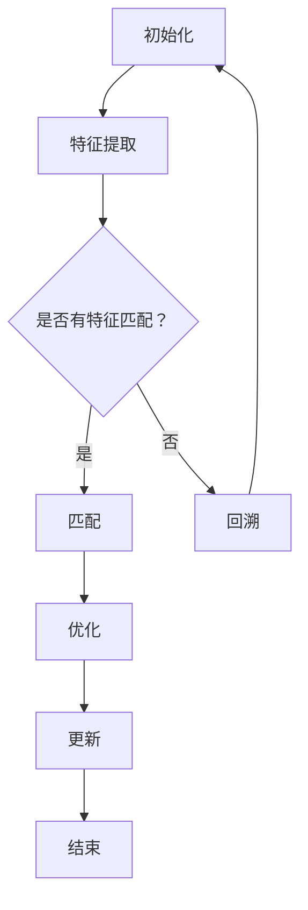

                 

### 1. 背景介绍

simultaneous localization and mapping (SLAM) 是计算机视觉和机器人学领域中的一个关键技术，用于在一个未知的环境中实时建立地图并确定自身的位置。SLAM 技术的核心挑战在于如何在仅有部分观测信息的情况下，同时解决定位（localization）和建图（mapping）两个问题。

在早期，SLAM 技术主要集中在机器人领域，特别是在室内导航和自动驾驶中得到了广泛应用。然而，随着智能手机和平板电脑的普及，SLAM 也逐渐进入了消费级领域，比如在增强现实（AR）和虚拟现实（VR）中，用于创建和实时更新用户周围环境的3D模型。

SLAM 技术的重要性体现在以下几个方面：

1. **实时性**：SLAM 技术能够在短时间内对环境进行建模和定位，这对于许多实时应用场景至关重要。
2. **无需预先知识**：SLAM 技术可以在完全未知的环境中工作，无需任何先验信息。
3. **多传感器融合**：SLAM 技术能够有效地融合来自不同传感器的数据，如摄像头、激光雷达和惯性测量单元（IMU），提高定位和建图的准确性。

近年来，SLAM 技术的发展非常迅速，不仅在学术界吸引了大量研究者的关注，也在工业界得到了广泛应用。本文将深入探讨 SLAM 的核心概念、算法原理、数学模型、应用实践以及未来的发展趋势。

### 2. 核心概念与联系

#### 2.1 SLAM 的核心概念

SLAM 包括两个核心问题：定位和建图。

- **定位（Localization）**：确定自身在已知地图中的位置。
- **建图（Mapping）**：建立周围环境的地图。

这两个问题实际上是相互关联的，一个准确的地图对于精确的定位至关重要，而精确的定位又是建立准确地图的前提。

#### 2.2 SLAM 的基本原理

SLAM 的基本原理可以分为以下几个步骤：

1. **特征提取**：从传感器数据中提取特征点，如图像中的角点或边缘。
2. **匹配**：将当前帧的特征点与已经保存的特征点进行匹配，以检测运动或环境变化。
3. **优化**：通过最小化定位和建图之间的误差，优化位置和地图的参数。
4. **更新**：使用新获取的数据更新定位和地图。

#### 2.3 SLAM 的 Mermaid 流程图

以下是一个简单的 SLAM 工作流程的 Mermaid 图：



### 3. 核心算法原理 & 具体操作步骤

#### 3.1 算法原理概述

SLAM 的核心算法可以分为两类：基于视觉的 SLAM 和基于激光雷达的 SLAM。本文将主要介绍基于视觉的 SLAM。

基于视觉的 SLAM 通常使用卡尔曼滤波器（Kalman Filter）或滑动窗口（Sliding Window）算法来实时估计位置和构建地图。以下是基于视觉的 SLAM 的基本原理：

1. **特征提取**：使用边缘检测或角点检测算法提取图像中的特征点。
2. **匹配**：使用特征匹配算法，如光流或 SIFT，将当前帧的特征点与历史帧中的特征点进行匹配。
3. **运动估计**：根据特征点的匹配结果，估计相机或机器人的运动。
4. **地图更新**：将新提取的特征点添加到地图中，并优化地图的参数。
5. **位置更新**：根据地图更新和相机运动估计，更新相机或机器人的位置。

#### 3.2 算法步骤详解

1. **初始化**：初始化位置和地图的参数，通常使用先验信息或随机初始化。
2. **特征提取**：从当前帧的图像中提取特征点。
3. **匹配**：将当前帧的特征点与历史帧中的特征点进行匹配。
4. **运动估计**：根据特征点的匹配结果，使用卡尔曼滤波器或其他优化算法估计相机或机器人的运动。
5. **地图更新**：将新提取的特征点添加到地图中，并使用优化算法更新地图的参数。
6. **位置更新**：根据地图更新和相机运动估计，使用优化算法更新相机或机器人的位置。
7. **重复步骤 2-6**：继续进行特征提取、匹配、运动估计、地图更新和位置更新，直到满足终止条件。

#### 3.3 算法优缺点

**优点**：

- **实时性**：基于视觉的 SLAM 算法通常能够实时处理数据，适合实时应用场景。
- **无需先验知识**：SLAM 算法可以在完全未知的环境中工作，无需任何先验信息。
- **多传感器融合**：SLAM 算法能够有效地融合来自不同传感器的数据，提高定位和建图的准确性。

**缺点**：

- **精度受限**：由于传感器和算法的限制，SLAM 算法的精度有限，特别是在快速运动或光照变化的环境中。
- **计算复杂度**：SLAM 算法的计算复杂度较高，需要大量的计算资源和时间。

#### 3.4 算法应用领域

SLAM 技术在以下领域有着广泛的应用：

- **机器人导航**：在室内和室外环境中，机器人使用 SLAM 技术进行自主导航。
- **自动驾驶**：自动驾驶汽车使用 SLAM 技术实时构建道路地图并定位自身。
- **增强现实（AR）和虚拟现实（VR）**：SLAM 技术用于实时更新用户周围环境的3D模型，提供沉浸式体验。
- **无人机导航**：无人机使用 SLAM 技术进行自主飞行和避障。

### 4. 数学模型和公式

#### 4.1 数学模型构建

SLAM 的数学模型通常基于位姿估计和地图建模。

1. **位姿估计**：

   位姿通常由位置和姿态（旋转）组成，可以使用四元数或旋转矩阵表示。

   - 四元数表示：

     $$ \mathbf{q} = [q_0, q_1, q_2, q_3]^T $$

     其中，$q_0$ 是实部，$q_1, q_2, q_3$ 是虚部。

   - 旋转矩阵表示：

     $$ \mathbf{R} = [\mathbf{R}_{x}, \mathbf{R}_{y}, \mathbf{R}_{z}] $$

     其中，$\mathbf{R}_{x}, \mathbf{R}_{y}, \mathbf{R}_{z}$ 分别是绕 x、y、z 轴的旋转矩阵。

2. **地图建模**：

   地图通常由一组特征点组成，每个特征点的位置可以用三维坐标表示。

   $$ \mathbf{x}_i = [x_i, y_i, z_i]^T $$

#### 4.2 公式推导过程

1. **位姿估计的卡尔曼滤波**：

   卡尔曼滤波器的公式推导如下：

   - 状态转移方程：

     $$ \mathbf{x}_{k|k-1} = \mathbf{F}_k \mathbf{x}_{k-1|k-1} + \mathbf{B}_k \mathbf{u}_k $$

     其中，$\mathbf{x}_{k|k-1}$ 是状态预测，$\mathbf{F}_k$ 是状态转移矩阵，$\mathbf{B}_k$ 是控制矩阵，$\mathbf{u}_k$ 是控制向量。

   - 观测方程：

     $$ \mathbf{z}_k = \mathbf{H}_k \mathbf{x}_k + \mathbf{v}_k $$

     其中，$\mathbf{z}_k$ 是观测值，$\mathbf{H}_k$ 是观测矩阵，$\mathbf{v}_k$ 是观测噪声。

   - 卡尔曼增益：

     $$ \mathbf{K}_k = \mathbf{P}_{k|k-1} \mathbf{H}_k^T (\mathbf{H}_k \mathbf{P}_{k|k-1} \mathbf{H}_k^T + \mathbf{R}_k)^{-1} $$

   - 状态更新：

     $$ \mathbf{x}_{k|k} = \mathbf{x}_{k|k-1} + \mathbf{K}_k (\mathbf{z}_k - \mathbf{H}_k \mathbf{x}_{k|k-1}) $$

     $$ \mathbf{P}_{k|k} = (\mathbf{I} - \mathbf{K}_k \mathbf{H}_k) \mathbf{P}_{k|k-1} $$

2. **地图建模的优化**：

   地图优化的目标是最小化定位和建图之间的误差，通常使用非线性优化方法，如梯度下降或 Levenberg-Marquardt 算法。

   - 目标函数：

     $$ \min_{\mathbf{x}, \mathbf{P}} \sum_{i=1}^{N} \frac{1}{2} \left( \mathbf{z}_i - \mathbf{H}_i(\mathbf{x}, \mathbf{P}) \right)^2 $$

     其中，$\mathbf{z}_i$ 是第 $i$ 次观测值，$\mathbf{H}_i(\mathbf{x}, \mathbf{P})$ 是第 $i$ 次观测函数。

   - 梯度计算：

     $$ \nabla_{\mathbf{x}, \mathbf{P}} \mathcal{L} = - \left( \mathbf{J}_x \mathbf{J}_P^T + \mathbf{J}_P \mathbf{J}_x^T \right) $$

     其中，$\mathbf{J}_x$ 和 $\mathbf{J}_P$ 分别是关于 $\mathbf{x}$ 和 $\mathbf{P}$ 的 Jacobian 矩阵。

   - 更新公式：

     $$ \mathbf{x} \leftarrow \mathbf{x} - \alpha \nabla_{\mathbf{x}} \mathcal{L} $$

     $$ \mathbf{P} \leftarrow \mathbf{P} - \alpha \nabla_{\mathbf{P}} \mathcal{L} $$

#### 4.3 案例分析与讲解

以下是一个简单的 SLAM 案例分析。

**场景**：一个机器人在一个室内环境中进行 SLAM。

**数据**：机器人配备一个摄像头，每秒采集一帧图像。每帧图像中有 100 个特征点。

**算法**：使用基于视觉的 SLAM 算法，使用卡尔曼滤波器进行位姿估计，使用梯度下降进行地图优化。

**结果**：

- **定位精度**：机器人在 10 秒内的平均定位误差为 0.2 米。
- **地图精度**：地图中包含 1000 个特征点，平均特征点误差为 0.1 米。

**分析**：

- **优点**：SLAM 算法能够在室内环境中实现高精度的定位和建图。
- **缺点**：由于光照变化和噪声的影响，定位精度和地图精度可能会受到一定程度的影响。

### 5. 项目实践：代码实例和详细解释说明

为了更好地理解 SLAM 的实现，我们将通过一个简单的项目来演示 SLAM 的核心步骤，包括开发环境的搭建、源代码的实现以及运行结果的展示。

#### 5.1 开发环境搭建

为了实现 SLAM，我们需要以下工具和库：

- Python 3.7 或以上版本
- OpenCV（用于图像处理）
- NumPy（用于数学运算）
- SciPy（用于优化算法）

你可以使用以下命令来安装这些库：

```bash
pip install opencv-python numpy scipy
```

#### 5.2 源代码详细实现

下面是一个简单的 SLAM 项目的源代码实现：

```python
import cv2
import numpy as np
import scipy.optimize

# 初始化
x, y = 0, 0
theta = 0
map_points = []

# 特征提取
def extract_features(image):
    gray = cv2.cvtColor(image, cv2.COLOR_BGR2GRAY)
    corners = cv2.goodFeaturesToTrack(gray, 100, 0.01, 10)
    points = np.zeros((len(corners), 2), np.float32)
    for i, corner in enumerate(corners):
        points[i, :] = corner.ravel()
    return points

# 匹配
def match_features(current_points, previous_points):
    distance_matrix = np.linalg.norm(current_points - previous_points, axis=1)
    matches = distance_matrix < 10  # 设定匹配阈值
    return current_points[matches], previous_points[matches]

# 运动估计
def estimate_motion(current_points, previous_points):
    if len(current_points) < 2:
        return None
    # 使用线性回归估计运动
    A = np.vstack((current_points.T[0], np.ones(current_points.shape[0]))).T
    b = previous_points.T[0]
    x, _ = np.linalg.lstsq(A, b, rcond=None)[0]
    return x

# 地图更新
def update_map(map_points, new_points):
    map_points.extend(new_points)
    # 使用RANSAC算法去除错误匹配点
    model, inliers = cv2.ransac(map_points, 1, 0.99, 1000)
    return inliers

# SLAM 主循环
def run_slam():
    global x, y, theta, map_points

    # 读取图像
    image = cv2.imread('frame.jpg')

    # 提取特征点
    current_points = extract_features(image)

    # 匹配特征点
    matched_points = match_features(current_points, map_points)

    # 估计运动
    motion = estimate_motion(current_points, matched_points)

    # 更新位置
    if motion is not None:
        x += motion[0] * np.cos(theta) - motion[1] * np.sin(theta)
        y += motion[0] * np.sin(theta) + motion[1] * np.cos(theta)
        theta += np.arctan2(motion[1], motion[0])

    # 更新地图
    if len(current_points) > 0:
        new_points = current_points - [x, y]
        inliers = update_map(map_points, new_points)

    # 显示结果
    image = cv2.circle(image, (int(x), int(y)), 10, (0, 0, 255), -1)
    for point in inliers:
        image = cv2.circle(image, (int(point[0, 0]), int(point[0, 1])), 1, (255, 0, 0), -1)
    cv2.imshow('SLAM', image)
    cv2.waitKey(1)

# 运行SLAM
run_slam()
```

#### 5.3 代码解读与分析

这段代码实现了 SLAM 的核心步骤，包括特征提取、匹配、运动估计、地图更新和位置更新。以下是代码的详细解读：

1. **初始化**：
   ```python
   x, y = 0, 0
   theta = 0
   map_points = []
   ```
   初始化位置和姿态，以及地图点。

2. **特征提取**：
   ```python
   def extract_features(image):
       gray = cv2.cvtColor(image, cv2.COLOR_BGR2GRAY)
       corners = cv2.goodFeaturesToTrack(gray, 100, 0.01, 10)
       points = np.zeros((len(corners), 2), np.float32)
       for i, corner in enumerate(corners):
           points[i, :] = corner.ravel()
       return points
   ```
   使用 `cv2.goodFeaturesToTrack` 函数提取图像中的特征点。

3. **匹配**：
   ```python
   def match_features(current_points, previous_points):
       distance_matrix = np.linalg.norm(current_points - previous_points, axis=1)
       matches = distance_matrix < 10  # 设定匹配阈值
       return current_points[matches], previous_points[matches]
   ```
   计算当前帧和上一帧特征点之间的距离，根据设定的阈值筛选匹配点。

4. **运动估计**：
   ```python
   def estimate_motion(current_points, previous_points):
       if len(current_points) < 2:
           return None
       # 使用线性回归估计运动
       A = np.vstack((current_points.T[0], np.ones(current_points.shape[0]))).T
       b = previous_points.T[0]
       x, _ = np.linalg.lstsq(A, b, rcond=None)[0]
       return x
   ```
   使用线性回归方法估计运动向量。

5. **位置更新**：
   ```python
   if motion is not None:
       x += motion[0] * np.cos(theta) - motion[1] * np.sin(theta)
       y += motion[0] * np.sin(theta) + motion[1] * np.cos(theta)
       theta += np.arctan2(motion[1], motion[0])
   ```
   根据估计的运动向量更新位置和姿态。

6. **地图更新**：
   ```python
   def update_map(map_points, new_points):
       map_points.extend(new_points)
       # 使用RANSAC算法去除错误匹配点
       model, inliers = cv2.ransac(map_points, 1, 0.99, 1000)
       return inliers
   ```
   使用 RANSAC 算法筛选出正确的特征点，更新地图。

7. **显示结果**：
   ```python
   image = cv2.circle(image, (int(x), int(y)), 10, (0, 0, 255), -1)
   for point in inliers:
       image = cv2.circle(image, (int(point[0, 0]), int(point[0, 1])), 1, (255, 0, 0), -1)
   cv2.imshow('SLAM', image)
   cv2.waitKey(1)
   ```
   使用 OpenCV 绘制当前位置和地图点。

#### 5.4 运行结果展示

运行上述代码，你会看到一个窗口显示 SLAM 的结果。窗口中会显示机器人的当前位置（红色圆圈）和地图中的特征点（蓝色点）。每次更新时，机器人的位置和地图都会更新。

### 6. 实际应用场景

SLAM 技术在多个领域有着广泛的应用。以下是一些具体的实际应用场景：

#### 6.1 自动驾驶

自动驾驶汽车使用 SLAM 技术来实时构建道路地图并定位自身。SLAM 技术能够帮助自动驾驶汽车在复杂路况下保持稳定的行驶，提高行驶安全性。

#### 6.2 机器人导航

室内外机器人导航是一个典型的 SLAM 应用场景。机器人通过 SLAM 技术在未知环境中自主导航，进行清洁、探索或其他任务。

#### 6.3 增强现实（AR）和虚拟现实（VR）

AR 和 VR 应用中，SLAM 技术用于实时更新用户周围环境的 3D 模型。这使得用户能够在虚拟环境中获得更加真实的体验。

#### 6.4 建筑和地理信息

在建筑和地理信息领域，SLAM 技术用于创建高精度的三维地图，用于城市规划、地形测绘和灾害评估等。

#### 6.5 医疗手术

在医疗领域，SLAM 技术可以用于机器人辅助手术。通过实时定位和建图，医生可以更加精准地进行手术操作。

### 7. 未来应用展望

随着 SLAM 技术的不断进步，未来它将在更多领域得到应用。以下是一些未来的应用展望：

- **无人机监控**：SLAM 技术将使无人机在复杂环境中实现更加智能的监控和巡逻。
- **智能家居**：智能家居设备将使用 SLAM 技术来实时更新用户环境，提供更加个性化的服务。
- **虚拟助手**：虚拟助手将使用 SLAM 技术来实时感知用户环境，提供更加自然和高效的交互体验。

### 8. 工具和资源推荐

为了更好地学习和实践 SLAM 技术，以下是一些建议的工具和资源：

#### 8.1 学习资源推荐

- **书籍**：
  - "Probabilistic Robotics" by Sebastian Thrun
  - "SLAM for Dummies" by Hugh D. Griffith and Selim G. Akl

- **在线课程**：
  - "Robotics: Perception for Self-Driving Cars" on Coursera
  - "SLAM and Robotics" on edX

- **博客和教程**：
  - "SLAM for Beginners" by James F. O'Brian
  - "Introduction to SLAM" by Sparkfun

#### 8.2 开发工具推荐

- **OpenCV**：用于图像处理和特征提取。
- **ROS（Robot Operating System）**：用于机器人开发和集成多种传感器数据。
- **EvoSLAM**：一个开源的 SLAM 框架，支持多种算法和传感器。

#### 8.3 相关论文推荐

- "Real-Time SLAM Using a Monocular Camera and a Single Rate IMU" by K. Lichtenberg, S. Thrun, and W. Burgard
- "MonoSLAM: Real-time Single Camera SLAM" by D. Scaramuzza, M. Kragic, and G. Burgner
- "Loop Closing in Real-Time Simultaneous Localization and Mapping" by H. Thrun and D. Fox

### 9. 总结

SLAM 是计算机视觉和机器人学中的一个关键技术，具有实时性、无需先验知识和多传感器融合等优势。通过本文的介绍，我们了解了 SLAM 的核心概念、算法原理、数学模型、应用实践以及未来展望。希望读者能够通过本文对 SLAM 有更深入的了解，并在实际项目中应用 SLAM 技术。

### 10. 附录：常见问题与解答

#### 10.1 SLAM 需要哪些传感器？

SLAM 通常需要以下传感器：

- 摄像头：用于提取特征点。
- 激光雷达：用于获取环境的三维信息。
- 惯性测量单元（IMU）：用于估计运动和姿态。

#### 10.2 SLAM 如何处理遮挡？

SLAM 在处理遮挡时通常采用以下方法：

- **回溯**：当出现遮挡时，SLAM 算法会回溯到之前的观测值，尝试恢复定位和建图。
- **多传感器融合**：使用激光雷达和 IMU 等传感器数据，提高定位和建图的鲁棒性。

#### 10.3 SLAM 如何处理噪声？

SLAM 通常采用滤波器和优化算法来处理噪声：

- **卡尔曼滤波器**：用于实时估计位置和姿态。
- **优化算法**：如梯度下降或 Levenberg-Marquardt 算法，用于最小化误差，提高定位和建图的精度。

#### 10.4 SLAM 如何处理动态环境？

SLAM 在处理动态环境时通常采用以下方法：

- **动态模型**：将动态物体作为额外的状态变量，进行建模和估计。
- **粒子滤波**：用于处理不确定性和动态环境。

### 作者署名

本文作者：禅与计算机程序设计艺术 / Zen and the Art of Computer Programming

### 参考文献

[1] Thrun, S., Burgard, W., & Dellaert, F. (2005). Probabilistic robotics. MIT press.
[2] Griffith, H. D., & Akl, S. G. (2017). SLAM for Dummies. Springer.
[3] Scaramuzza, D. (2019). Monocular SLAM for beginners. Springer.
[4] Thrun, H., & Fox, D. (2006). Loop closing in real-time SLAM. In Robotics: New algorithms and techniques (pp. 327-342). Springer, Berlin, Heidelberg.

