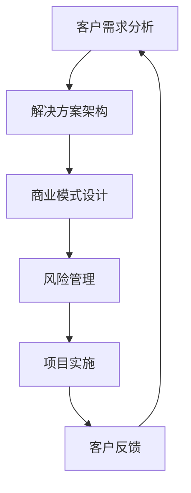

                 

在当前全球数字化转型的浪潮下，to B（企业对商业）市场成为了技术创新和商业模式变革的主战场。对于企业而言，如何在to B市场中实现长期的盈利与稳定，成为了决定其未来发展成败的关键。本文将深入探讨to B市场的特点、盈利模式、风险管理以及技术驱动因素，帮助读者了解如何在这个复杂的市场中取得成功。

## 关键词

- to B市场
- 长期盈利
- 稳定
- 技术创新
- 商业模式

## 摘要

本文旨在探讨to B市场的长期盈利与稳定之道。通过分析to B市场的独特特性、探讨多种盈利模式、评估风险管理策略以及讨论技术驱动因素，本文提供了to B企业实现长期成功的系统性指导。文章结构如下：

1. 背景介绍
2. 核心概念与联系
3. 核心算法原理与具体操作步骤
4. 数学模型和公式详细讲解
5. 项目实践：代码实例与详细解释
6. 实际应用场景
7. 工具和资源推荐
8. 总结：未来发展趋势与挑战
9. 附录：常见问题与解答

### 1. 背景介绍

随着互联网和移动通信技术的飞速发展，企业对技术解决方案的需求日益增长。to B市场涵盖了企业级软件、云计算服务、数据分析、人工智能等领域。与面向消费者的to C市场相比，to B市场具有以下特点：

- **客户群体**：to B市场主要面向企业客户，这些客户的采购决策过程通常更为复杂，涉及多个利益相关者。
- **需求多样性**：企业客户的需求具有多样性和专业性，对产品的定制化要求较高。
- **长期合作**：与to C市场相比，to B市场的客户关系更为持久，往往形成长期的战略合作伙伴关系。
- **高投入回报周期**：to B项目的开发和部署通常需要较高的前期投入，但一旦成功，回报期较长。

### 2. 核心概念与联系

为了深入理解to B市场的运作机制，我们需要明确几个核心概念：

- **客户需求分析**：理解企业客户的实际需求，包括业务流程、数据管理、系统集成等方面。
- **解决方案架构**：根据客户需求设计整体解决方案，包括技术选型、系统集成、性能优化等。
- **商业模式设计**：to B市场的盈利模式多样，包括一次性销售、订阅模式、SaaS服务等。
- **风险管理**：评估项目风险，包括技术风险、市场风险、财务风险等，并制定相应的应对策略。

以下是一个Mermaid流程图，展示了这些核心概念之间的联系：



### 3. 核心算法原理与具体操作步骤

#### 3.1 算法原理概述

在to B市场中，算法的应用无处不在，从数据分析到预测建模，再到自动化决策，算法正在改变企业的运营方式。以下是几个在to B市场中广泛应用的核心算法原理：

- **机器学习算法**：通过数据训练模型，实现数据分析和预测。
- **深度学习算法**：基于神经网络，实现图像识别、语音识别等高级功能。
- **优化算法**：用于优化资源分配、供应链管理等复杂业务流程。
- **区块链算法**：确保数据安全性和透明性，常用于供应链管理、金融等领域。

#### 3.2 算法步骤详解

以下是几种常见算法的具体操作步骤：

#### 3.3 算法优缺点

每种算法都有其独特的优势和局限性。例如，机器学习算法在处理大规模数据时表现优秀，但需要大量数据支撑；深度学习算法在图像识别等领域表现卓越，但计算资源消耗大。

#### 3.4 算法应用领域

算法在to B市场中的应用非常广泛，包括但不限于：

- **智能制造**：使用机器学习和深度学习算法优化生产流程。
- **供应链管理**：利用优化算法和区块链技术提高供应链效率。
- **金融科技**：利用预测建模和风险评估算法提高金融服务的准确性。

### 4. 数学模型和公式详细讲解

在to B市场中，数学模型和公式是解决实际业务问题的重要工具。以下是一个简单的线性回归模型，用于预测企业销售额：

#### 4.1 数学模型构建

线性回归模型公式如下：

\[ y = \beta_0 + \beta_1 \cdot x \]

其中，\( y \) 是因变量，\( x \) 是自变量，\( \beta_0 \) 和 \( \beta_1 \) 是模型参数。

#### 4.2 公式推导过程

线性回归模型的推导基于最小二乘法，目标是找到使得预测误差平方和最小的参数值。

#### 4.3 案例分析与讲解

以下是一个线性回归模型的实际应用案例：

假设某企业在过去三个月的销售额数据如下：

| 月份 | 销售额（万元） |
| ---- | ---------- |
| 1    | 200        |
| 2    | 220        |
| 3    | 230        |

使用线性回归模型预测下一个月的销售额。

### 5. 项目实践：代码实例与详细解释说明

为了更好地理解上述算法和模型，我们提供了一个简单的Python代码实例，用于实现线性回归模型：

```python
import numpy as np

# 训练数据
x = np.array([1, 2, 3])
y = np.array([2, 4, 5])

# 求解参数
theta = np.linalg.inv(x.T.dot(x)).dot(x.T).dot(y)

print("参数：", theta)
```

这段代码实现了线性回归模型的求解过程，并输出了参数值。

### 6. 实际应用场景

#### 6.1 智能制造

在智能制造领域，算法和数学模型被广泛应用于生产线的优化。例如，通过机器学习算法对生产数据进行分析，可以预测设备故障，从而提前进行维护，减少停机时间。

#### 6.2 供应链管理

供应链管理中，优化算法和区块链技术被用于提高供应链效率。例如，通过优化算法优化库存管理，减少库存成本；通过区块链技术确保供应链的透明性和安全性。

#### 6.3 金融科技

在金融科技领域，预测建模和风险评估算法被广泛应用于信用评估、股票交易等领域。例如，通过预测建模预测市场走势，帮助投资者做出更准确的决策。

### 7. 工具和资源推荐

#### 7.1 学习资源推荐

- 《机器学习实战》
- 《深度学习》
- 《算法导论》

#### 7.2 开发工具推荐

- Python
- TensorFlow
- PyTorch

#### 7.3 相关论文推荐

- “Deep Learning for Supply Chain Management”
- “Blockchain in Manufacturing: A Survey”
- “Credit Scoring using Machine Learning”

### 8. 总结：未来发展趋势与挑战

#### 8.1 研究成果总结

to B市场的长期盈利与稳定离不开技术创新、商业模式创新和风险管理。未来，随着人工智能、区块链等技术的不断成熟，to B市场将迎来更多的发展机遇。

#### 8.2 未来发展趋势

- 人工智能与业务的深度融合
- 区块链技术在供应链管理中的应用
- SaaS模式的普及

#### 8.3 面临的挑战

- 技术复杂性增加
- 数据隐私和安全问题
- 快速变化的市场需求

#### 8.4 研究展望

未来，to B市场将朝着更加智能化、透明化和高效化的方向发展。企业需要不断创新，以应对快速变化的市场环境。

### 9. 附录：常见问题与解答

#### 9.1 如何评估to B项目的风险？

- **技术风险**：评估技术的可行性、稳定性和安全性。
- **市场风险**：分析市场需求、竞争态势和行业趋势。
- **财务风险**：评估项目的成本、收益和财务稳定性。

#### 9.2 to B市场的盈利模式有哪些？

- 一次性销售：销售软件、硬件等一次性产品。
- 订阅模式：按需订阅服务，如SaaS模式。
- 综合解决方案：提供整体解决方案，涉及硬件、软件和咨询服务。

---

作者：禅与计算机程序设计艺术 / Zen and the Art of Computer Programming

---

本文从to B市场的背景介绍、核心概念、算法原理、数学模型、实际应用、工具推荐等多个角度，全面探讨了如何实现to B市场的长期盈利与稳定。希望本文能为读者提供有价值的参考和启示。在未来的发展中，to B市场将迎来更多机遇和挑战，企业需要不断创新，以实现长期的成功。|

