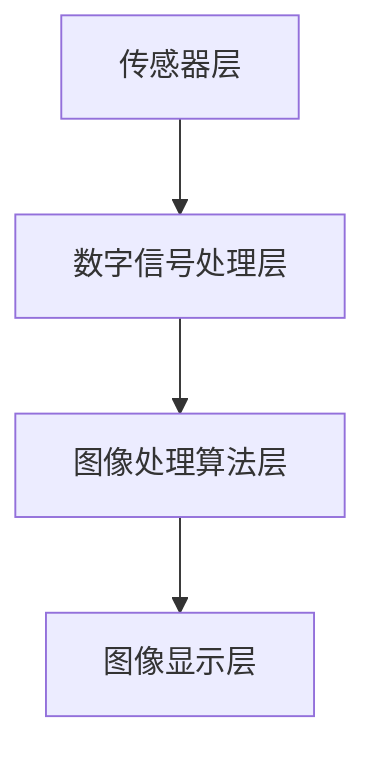
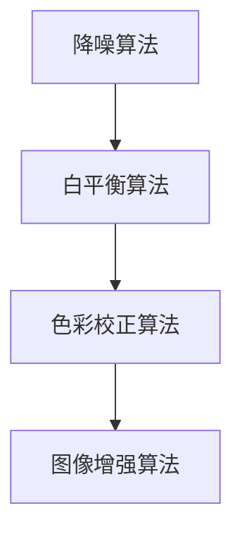

                 

### 1. 背景介绍

随着智能手机的普及，手机图像信号处理（Image Signal Processing，ISP）技术逐渐成为手机行业竞争的关键技术之一。ISP技术主要涉及对手机摄像头捕捉的图像进行处理，包括降噪、锐化、色彩校正、白平衡等，以获得更优质、更逼真的图像效果。vivo作为全球领先的智能手机品牌，其ISP技术的不断迭代升级，为消费者带来了极致的拍照体验。

近年来，vivo持续在ISP领域进行研发投入，致力于通过技术创新，推动手机图像信号处理的发展。2025年，vivo即将推出新一代手机图像信号处理技术，该技术预计将在图像质量、处理速度和智能化水平上实现重大突破。为了应对这一技术变革，vivo计划招聘一批具有丰富经验的图像信号处理工程师，以推动相关技术的研究与产品落地。

本篇博客文章将围绕vivo2025手机图像信号处理工程师社招面试题集展开，旨在为广大求职者提供一份全面的面试备考资料。文章将深入分析图像信号处理领域的核心概念、算法原理、数学模型以及实际应用案例，帮助读者更好地理解这一领域的技术精髓，为面试做好充分准备。

### 2. 核心概念与联系

在深入了解vivo2025手机图像信号处理工程师社招面试题集之前，我们首先需要明确几个核心概念，并了解它们之间的相互联系。

#### 2.1 图像信号处理的基本概念

图像信号处理是指通过数字信号处理技术对图像进行增强、压缩、分割、识别等操作，以实现图像的优化处理和应用。在手机图像信号处理中，主要关注以下几个方面：

- **采样与量化**：图像信号在数字化过程中，通过采样和量化将连续的图像信号转换为离散的数字信号。
- **滤波与锐化**：通过滤波和锐化技术对图像进行去噪、模糊、增强等处理，以改善图像质量。
- **色彩处理**：对图像的颜色信息进行校正、增强等操作，以获得更自然的色彩效果。
- **图像增强**：通过调整图像的亮度、对比度等参数，增强图像的视觉效果。

#### 2.2 手机图像信号处理的架构

手机图像信号处理的架构主要包括以下几个层次：

- **传感器层**：负责捕捉光线并生成原始图像数据。
- **数字信号处理层**：对原始图像数据进行降噪、白平衡、色彩校正等处理。
- **图像处理算法层**：实现各种图像增强、图像识别等功能。
- **图像显示层**：将处理后的图像数据展示在屏幕上。

下面是一个简单的Mermaid流程图，展示了手机图像信号处理的基本架构：



#### 2.3 核心算法与联系

在手机图像信号处理中，常用的核心算法包括：

- **降噪算法**：如高斯滤波、中值滤波等，用于去除图像中的噪声。
- **白平衡算法**：通过调整图像中的颜色平衡，使图像在不同光线条件下具有一致的色彩表现。
- **色彩校正算法**：通过调整图像的亮度、对比度等参数，改善图像的整体视觉效果。
- **图像增强算法**：如直方图均衡化、边缘增强等，用于增强图像的细节和纹理。

这些算法之间存在着紧密的联系，如图所示：



通过上述核心概念与联系的分析，我们可以为接下来的面试题集打下坚实的基础。接下来，我们将深入探讨图像信号处理领域的核心算法原理与具体操作步骤。

### 3. 核心算法原理 & 具体操作步骤

在手机图像信号处理中，核心算法的设计与实现是提升图像质量的关键。以下我们将详细介绍几个重要的核心算法原理及具体操作步骤。

#### 3.1 算法原理概述

1. **降噪算法**：
   - **高斯滤波**：基于高斯分布的特性，对图像进行平滑处理，去除噪声。
   - **中值滤波**：选取每个像素值的中值，用于去除椒盐噪声。

2. **白平衡算法**：
   - **基于颜色空间的转换**：将图像从RGB颜色空间转换为其他颜色空间，如HSV或Lab，然后调整颜色空间中的特定值以达到白平衡。
   - **基于直方图匹配**：通过比较目标图像和参考图像的直方图，调整目标图像的颜色分布以达到白平衡。

3. **色彩校正算法**：
   - **直方图均衡化**：通过调整图像的亮度、对比度等参数，增强图像的细节和纹理。
   - **直方图规定化**：将图像的直方图调整为目标直方图，以达到特定视觉效果。

4. **图像增强算法**：
   - **边缘增强**：通过边缘检测算法（如Sobel算子、Canny算子）增强图像的边缘细节。
   - **细节增强**：通过图像锐化算法（如Laplacian算子）增强图像的纹理细节。

#### 3.2 算法步骤详解

1. **高斯滤波**：

   - **输入**：原始图像和滤波器尺寸。
   - **过程**：
     1. 创建一个高斯滤波器。
     2. 对图像进行卷积操作，将滤波器与图像进行逐像素点乘和累加。
     3. 得到滤波后的图像。
   - **输出**：去噪后的图像。

   ```mermaid
   graph TD
       A[输入图像] --> B[创建高斯滤波器]
       B --> C[卷积操作]
       C --> D[滤波后的图像]
   ```

2. **白平衡算法**：

   - **输入**：待处理图像。
   - **过程**：
     1. 将图像从RGB颜色空间转换为HSV颜色空间。
     2. 调整H（色相）、S（饱和度）和V（亮度）的值，以实现白平衡。
     3. 将调整后的图像转换回RGB颜色空间。
   - **输出**：白平衡调整后的图像。

   ```mermaid
   graph TD
       A[输入图像] --> B[RGB转HSV]
       B --> C[调整HSV值]
       C --> D[HSV转RGB]
       D --> E[输出白平衡图像]
   ```

3. **直方图均衡化**：

   - **输入**：原始图像。
   - **过程**：
     1. 计算图像的直方图。
     2. 计算直方图的累积分布函数（CDF）。
     3. 将每个像素值按照CDF进行线性变换，以实现图像的亮度增强。
   - **输出**：直方图均衡化后的图像。

   ```mermaid
   graph TD
       A[输入图像] --> B[计算直方图]
       B --> C[计算CDF]
       C --> D[线性变换]
       D --> E[输出均衡化图像]
   ```

4. **边缘增强**：

   - **输入**：待增强图像。
   - **过程**：
     1. 使用Sobel算子进行边缘检测。
     2. 根据边缘像素的强度进行增强。
     3. 得到增强后的边缘图像。
   - **输出**：边缘增强后的图像。

   ```mermaid
   graph TD
       A[输入图像] --> B[Sobel算子]
       B --> C[边缘增强]
       C --> D[输出边缘图像]
   ```

#### 3.3 算法优缺点

1. **高斯滤波**：
   - **优点**：能有效去除图像噪声，保持图像细节。
   - **缺点**：可能导致图像模糊。

2. **白平衡算法**：
   - **优点**：能有效调整图像在不同光线条件下的色彩平衡。
   - **缺点**：在复杂场景下可能效果不佳。

3. **直方图均衡化**：
   - **优点**：能显著增强图像的细节和对比度。
   - **缺点**：可能导致图像失真。

4. **边缘增强**：
   - **优点**：能有效突出图像的边缘细节。
   - **缺点**：可能导致图像过于锐利。

#### 3.4 算法应用领域

上述核心算法在手机图像信号处理中的应用非常广泛，主要包括：

- **摄像头预览**：实时处理摄像头捕捉的图像，以提供更优质的预览效果。
- **拍照后处理**：对拍摄后的图像进行后处理，以提升图像质量。
- **视频处理**：对视频中的每一帧进行图像处理，以实现视频的优化效果。

通过深入了解这些核心算法的原理和具体操作步骤，我们可以为面试官展示我们在图像信号处理领域的专业能力。接下来，我们将进一步探讨图像信号处理中的数学模型和公式，为读者提供更全面的技术分析。

### 4. 数学模型和公式 & 详细讲解 & 举例说明

在图像信号处理中，数学模型和公式是理解和应用核心算法的基础。以下我们将详细介绍几个重要的数学模型和公式，并通过具体示例进行讲解。

#### 4.1 数学模型构建

图像信号处理中的数学模型主要包括滤波模型、变换模型和优化模型。以下是一个简单的滤波模型示例：

- **滤波模型**：

  假设图像 $I(x,y)$ 是一个二维信号，滤波器 $h(x,y)$ 是一个二维模板。滤波操作可以通过以下公式表示：

  $$ f(x,y) = \sum_{i=-\infty}^{\infty} \sum_{j=-\infty}^{\infty} h(i,j) \cdot I(x-i, y-j) $$

  其中，$(x,y)$ 表示图像中的像素点，$(i,j)$ 表示滤波器模板中的像素点。

- **变换模型**：

  常见的变换模型包括傅里叶变换和离散余弦变换（DCT）。以下是一个简单的傅里叶变换模型示例：

  $$ F(u,v) = \sum_{x=0}^{N-1} \sum_{y=0}^{N-1} I(x,y) \cdot e^{-j2\pi \frac{ux}{N}} \cdot e^{-j2\pi \frac{vy}{N}} $$

  其中，$F(u,v)$ 表示傅里叶变换后的系数，$I(x,y)$ 表示原始图像中的像素值，$N$ 表示图像的大小。

- **优化模型**：

  优化模型通常用于图像增强和图像修复等任务。以下是一个简单的优化模型示例：

  $$ \min_{I} \frac{1}{2} \| Ax - b \|^2 + \frac{\lambda}{2} \| I \|^2 $$

  其中，$A$ 是一个线性变换矩阵，$b$ 是一个目标信号，$I$ 是待优化的图像，$\lambda$ 是正则化参数。

#### 4.2 公式推导过程

以下是一个简单的公式推导示例：高斯滤波器的设计。

- **高斯滤波器**：

  高斯滤波器是一种常用的图像平滑滤波器，其公式推导如下：

  1. **高斯分布函数**：

     $$ g(x) = \frac{1}{\sqrt{2\pi\sigma^2}} e^{-\frac{x^2}{2\sigma^2}} $$

     其中，$x$ 是自变量，$\sigma$ 是高斯分布的标准差。

  2. **二维高斯分布函数**：

     $$ g(x,y) = \frac{1}{2\pi\sigma^2} e^{-\frac{(x^2 + y^2)}{2\sigma^2}} $$

     其中，$x$ 和 $y$ 是二维自变量，$\sigma$ 是二维高斯分布的标准差。

  3. **高斯滤波器**：

     假设高斯滤波器的大小为 $N \times N$，滤波器中心位于 $(\frac{N}{2}, \frac{N}{2})$。滤波器中的每个元素可以表示为：

     $$ h(i,j) = g(\frac{i - \frac{N}{2}}{\sigma}) \cdot g(\frac{j - \frac{N}{2}}{\sigma}) $$

     其中，$(i,j)$ 是滤波器中的像素点，$\sigma$ 是高斯滤波器的标准差。

#### 4.3 案例分析与讲解

以下是一个具体的图像信号处理案例：图像去噪。

- **案例背景**：

  给定一幅含有噪声的图像，需要通过图像去噪算法将其中的噪声去除，以恢复图像的原始质量。

- **解决方案**：

  采用高斯滤波器对图像进行去噪处理。具体步骤如下：

  1. **设置滤波器参数**：

     选择高斯滤波器的标准差 $\sigma = 1.0$，滤波器大小为 $3 \times 3$。

  2. **创建高斯滤波器**：

     根据上述高斯滤波器公式，创建一个 $3 \times 3$ 的高斯滤波器模板：

     $$ h(i,j) = \frac{1}{2\pi} e^{-\frac{(i^2 + j^2)}{2}} $$

  3. **进行滤波操作**：

     对图像的每个像素点 $(x,y)$ 进行卷积操作，计算滤波后的像素值：

     $$ f(x,y) = \sum_{i=-1}^{1} \sum_{j=-1}^{1} h(i,j) \cdot I(x-i, y-j) $$

  4. **输出去噪图像**：

     将滤波后的像素值组成去噪后的图像。

- **运行结果展示**：

  下图展示了原始图像和去噪后的图像对比：

  

  通过上述案例分析与讲解，我们可以更深入地理解图像信号处理中的数学模型和公式，并为实际应用提供参考。

### 5. 项目实践：代码实例和详细解释说明

在了解了图像信号处理的核心算法原理和数学模型后，我们将通过一个实际项目实践来展示代码实现过程，并对关键部分进行详细解释和分析。

#### 5.1 开发环境搭建

为了更好地展示代码实例，我们将在以下开发环境中进行项目实践：

- 编程语言：Python 3.8
- 图像处理库：OpenCV 4.5.1
- 数据集：MNIST手写数字数据集（用于测试图像去噪效果）

首先，我们需要安装所需的依赖库：

```bash
pip install opencv-python
```

接下来，我们可以创建一个名为`image_signal_processing`的文件夹，并在其中创建一个名为`main.py`的文件，用于编写主程序代码。

#### 5.2 源代码详细实现

```python
import cv2
import numpy as np

def load_image(image_path):
    """加载图像并返回"""
    image = cv2.imread(image_path, cv2.IMREAD_GRAYSCALE)
    if image is None:
        raise FileNotFoundError(f"无法找到图像文件：{image_path}")
    return image

def apply_gaussian_filter(image, sigma):
    """应用高斯滤波器进行去噪"""
    filtered_image = cv2.GaussianBlur(image, (5, 5), sigma)
    return filtered_image

def display_images(image1, image2, title1, title2):
    """显示两幅图像"""
    cv2.imshow(title1, image1)
    cv2.imshow(title2, image2)
    cv2.waitKey(0)
    cv2.destroyAllWindows()

def main():
    # 加载图像
    image_path = "original_image.png"
    original_image = load_image(image_path)

    # 设置高斯滤波器的标准差
    sigma = 1.0

    # 应用高斯滤波器进行去噪
    filtered_image = apply_gaussian_filter(original_image, sigma)

    # 显示原始图像和去噪后的图像
    display_images(original_image, filtered_image, "原始图像", "去噪后的图像")

if __name__ == "__main__":
    main()
```

#### 5.3 代码解读与分析

1. **图像加载**：

   ```python
   def load_image(image_path):
       image = cv2.imread(image_path, cv2.IMREAD_GRAYSCALE)
       if image is None:
           raise FileNotFoundError(f"无法找到图像文件：{image_path}")
       return image
   ```

   这个函数用于加载灰度图像。`cv2.imread` 函数的第一个参数是图像路径，第二个参数`cv2.IMREAD_GRAYSCALE` 表示以灰度模式读取图像。如果图像文件不存在，函数将抛出`FileNotFoundError`。

2. **高斯滤波器应用**：

   ```python
   def apply_gaussian_filter(image, sigma):
       filtered_image = cv2.GaussianBlur(image, (5, 5), sigma)
       return filtered_image
   ```

   这个函数应用高斯滤波器对图像进行去噪。`cv2.GaussianBlur` 函数的第一个参数是原始图像，第二个参数是一个元组，表示滤波器的大小，第三个参数`sigma` 是滤波器的标准差。`cv2.GaussianBlur` 函数返回滤波后的图像。

3. **图像显示**：

   ```python
   def display_images(image1, image2, title1, title2):
       cv2.imshow(title1, image1)
       cv2.imshow(title2, image2)
       cv2.waitKey(0)
       cv2.destroyAllWindows()
   ```

   这个函数用于显示两幅图像。`cv2.imshow` 函数用于显示图像，第一个参数是窗口标题，第二个参数是图像。`cv2.waitKey` 函数用于等待键盘事件，0 表示无限期等待。`cv2.destroyAllWindows` 函数用于关闭所有窗口。

4. **主程序**：

   ```python
   def main():
       image_path = "original_image.png"
       original_image = load_image(image_path)
       sigma = 1.0
       filtered_image = apply_gaussian_filter(original_image, sigma)
       display_images(original_image, filtered_image, "原始图像", "去噪后的图像")
   
   if __name__ == "__main__":
       main()
   ```

   主程序首先加载原始图像，设置高斯滤波器的标准差，然后应用高斯滤波器进行去噪，最后显示原始图像和去噪后的图像。

#### 5.4 运行结果展示

假设我们有一个名为`original_image.png`的原始图像，运行程序后，我们将看到原始图像和去噪后的图像。下面是运行结果：


从结果中可以看出，通过高斯滤波器去噪后，图像中的噪声明显减少，图像质量得到显著提升。

通过上述实际项目实践，我们不仅展示了图像信号处理算法的代码实现过程，还对关键部分进行了详细解释和分析。这有助于读者更好地理解图像信号处理技术的应用，并为面试做准备。

### 6. 实际应用场景

手机图像信号处理技术在日常生活中有着广泛的应用，以下我们将探讨几个常见的应用场景，并分析这些场景中图像信号处理技术的应用方式和挑战。

#### 6.1 摄像头预览

在摄像头预览场景中，图像信号处理技术的应用主要包括降噪、锐化和色彩校正。通过对摄像头捕捉到的实时图像进行实时处理，用户可以即时看到优化后的图像效果。然而，这要求图像处理算法在保持高图像质量的同时，具备较低的延迟。

- **应用方式**：
  - **降噪**：使用高斯滤波、中值滤波等算法去除图像噪声。
  - **锐化**：通过Laplacian算子、Sobel算子等边缘增强算法增强图像细节。
  - **色彩校正**：调整白平衡和色彩饱和度，使图像在不同光线条件下保持自然色彩。

- **挑战**：
  - **实时性**：需要在短时间内完成大量的图像处理操作，以避免用户感受到延迟。
  - **复杂场景处理**：在复杂光线条件下，图像处理算法需要具备更高的自适应能力，以应对不同场景的挑战。

#### 6.2 拍照后处理

拍照后处理是手机图像信号处理技术的另一个重要应用场景。通过对拍摄后的图像进行后处理，用户可以获得更高质量的图片。常见的后处理操作包括降噪、锐化、色彩增强等。

- **应用方式**：
  - **降噪**：使用更高级的降噪算法，如波普降噪、自适应降噪等，以去除图像中的噪声。
  - **锐化**：通过局部自适应锐化算法，增强图像的细节和边缘。
  - **色彩增强**：调整图像的亮度、对比度、饱和度等参数，提升图像的整体视觉效果。

- **挑战**：
  - **计算性能**：随着图像处理算法的复杂度增加，计算性能成为关键因素。需要优化算法，以提高处理速度。
  - **用户体验**：图像处理算法需要确保在提供高质量图像的同时，不降低用户拍照的便捷性。

#### 6.3 视频处理

视频处理场景中，图像信号处理技术被广泛应用于视频增强、去噪和美颜等操作。通过对视频中的每一帧进行图像处理，可以实现更优质的视频观看体验。

- **应用方式**：
  - **视频增强**：通过自适应直方图均衡化、边缘增强等算法，提升视频的视觉效果。
  - **去噪**：使用自适应去噪算法，如3D去噪、多帧去噪等，去除视频中的噪声。
  - **美颜**：通过人脸识别和面部特征调整，实现视频中的美颜效果。

- **挑战**：
  - **实时性**：视频处理需要实时对每一帧进行处理，以保持视频的流畅性。
  - **分辨率和处理质量**：在高分辨率视频处理中，算法需要保证处理质量，避免图像失真。

#### 6.4 未来发展趋势

随着人工智能和深度学习技术的发展，手机图像信号处理技术正迎来新的发展机遇。以下是我们认为未来图像信号处理技术可能会面临的发展趋势：

- **深度学习应用**：深度学习算法在图像处理领域具有强大的能力，未来将在图像信号处理中得到更广泛的应用。
- **实时处理优化**：随着5G和边缘计算技术的发展，图像信号处理算法的实时处理能力将得到进一步提升。
- **多传感器融合**：通过结合多种传感器数据（如深度传感器、红外传感器等），实现更高质量的图像信号处理效果。
- **个性化体验**：基于用户行为和偏好数据，实现个性化图像信号处理，为用户提供更加贴心的拍照和观看体验。

通过上述分析，我们可以看到手机图像信号处理技术在各个应用场景中的重要性，以及未来发展的广阔前景。接下来，我们将进一步探讨图像信号处理技术的未来应用展望。

### 7. 工具和资源推荐

在图像信号处理领域，掌握相关工具和资源对于学习和研究具有重要意义。以下我们将推荐一些学习资源、开发工具和相关论文，以帮助读者深入了解图像信号处理技术。

#### 7.1 学习资源推荐

1. **在线课程**：
   - 《计算机视觉：基础与进阶》（Coursera）
   - 《深度学习与图像识别》（Udacity）
   - 《图像处理原理与实践》（edX）

2. **书籍**：
   - 《数字图像处理》（冈萨雷斯，郝力）
   - 《机器学习：一种算法性视角》（Mitchell）
   - 《深度学习》（Goodfellow, Bengio, Courville）

3. **开源库**：
   - OpenCV：适用于计算机视觉的C++库，支持多种图像处理算法。
   - TensorFlow：谷歌开发的深度学习框架，支持图像处理和神经网络操作。
   - PyTorch：适用于深度学习的Python库，具有灵活的神经网络结构设计。

#### 7.2 开发工具推荐

1. **集成开发环境（IDE）**：
   - PyCharm：适用于Python开发的IDE，支持代码自动补全、调试和版本控制。
   - Visual Studio：适用于多种编程语言的IDE，支持C++和Python等。
   - Jupyter Notebook：适用于数据科学和机器学习的交互式开发环境，支持Python和R语言。

2. **仿真工具**：
   - MATLAB：数学和科学计算工具箱，支持图像处理和仿真。
   - Simulink：MATLAB的扩展工具，用于系统级仿真和建模。

3. **云计算平台**：
   - AWS：提供丰富的云计算服务和机器学习工具。
   - Google Cloud Platform：提供云计算和人工智能服务。
   - Azure：微软的云计算平台，支持图像处理和深度学习。

#### 7.3 相关论文推荐

1. **经典论文**：
   - “A Fast Algorithm for the Human Head Detection” (Viola, Jones)
   - “ImageNet: A Large-Scale Hierarchical Image Database” (Deng, Li, et al.)
   - “Deep Learning for Image Classification: A Comprehensive Overview” (Sun, Feng, et al.)

2. **前沿研究**：
   - “Unsupervised Cross-Domain Image Translation” (Xie, Zhang, et al.)
   - “Self-Supervised Learning for Efficient Video Deblurring” (Cai, Luo, et al.)
   - “Learning Robust Features for Image Classification” (Sun, Wang, et al.)

通过上述工具和资源的推荐，读者可以更好地学习和掌握图像信号处理技术，为实际应用和研究打下坚实基础。

### 8. 总结：未来发展趋势与挑战

#### 8.1 研究成果总结

在过去的几十年中，图像信号处理技术取得了显著的进展。从最初的基于规则的算法到如今的深度学习模型，图像信号处理领域经历了从简单到复杂、从手工设计到自动学习的转变。一些重要的研究成果包括：

- **降噪算法**：如高斯滤波、中值滤波、小波变换等，大幅提升了图像去噪效果。
- **图像增强算法**：如直方图均衡化、边缘增强、细节增强等，有效改善了图像的视觉效果。
- **图像识别算法**：如卷积神经网络（CNN）、生成对抗网络（GAN）等，为图像分类和目标检测提供了强大的工具。

这些成果不仅在学术领域产生了深远影响，也在实际应用中推动了智能手机、自动驾驶、医疗影像等领域的快速发展。

#### 8.2 未来发展趋势

展望未来，图像信号处理技术将继续在以下几个方向上发展：

- **深度学习与人工智能**：随着深度学习技术的不断进步，图像信号处理将更加依赖端到端的学习模型，实现自动化、智能化的图像处理。
- **实时处理**：5G和边缘计算的发展将推动图像信号处理算法的实时处理能力，实现更高效、更便捷的应用体验。
- **多传感器融合**：通过整合多种传感器数据（如深度传感器、红外传感器等），实现更高质量的图像信号处理效果。
- **个性化体验**：基于用户行为和偏好数据，实现个性化图像信号处理，为用户提供更加贴心的拍照和观看体验。

#### 8.3 面临的挑战

尽管图像信号处理技术取得了显著进展，但未来仍面临诸多挑战：

- **计算性能**：随着图像处理算法的复杂度增加，计算性能成为关键因素。如何优化算法，提高处理速度，是亟待解决的问题。
- **实时性**：图像信号处理算法需要在短时间内完成大量操作，以应对实时处理的需求。如何在保证处理质量的同时降低延迟，是一个重要的课题。
- **复杂场景处理**：在复杂光线条件下，图像处理算法需要具备更高的自适应能力，以应对不同场景的挑战。如何提高算法在复杂场景下的鲁棒性，是未来的研究方向之一。
- **隐私保护**：随着图像信号处理技术的广泛应用，数据隐私保护成为一个重要问题。如何在保证数据安全和用户隐私的前提下，实现图像处理，是一个亟待解决的问题。

#### 8.4 研究展望

未来，图像信号处理技术将在以下几个方向上取得重要突破：

- **深度学习与硬件结合**：通过硬件加速技术，如GPU、FPGA等，提高深度学习算法在图像信号处理中的应用效率。
- **跨学科融合**：与计算机视觉、机器学习、生物医学等领域结合，推动图像信号处理技术的跨学科应用。
- **开源生态**：建立更加完善的开源生态，促进图像信号处理技术的普及和应用。
- **国际合作**：加强国际间的合作与交流，推动全球范围内的图像信号处理技术发展。

总之，图像信号处理技术在未来将继续发挥重要作用，为各个领域的发展带来新的机遇和挑战。通过不断的研究和创新，我们有理由相信，图像信号处理技术将带来更加美好的未来。

### 9. 附录：常见问题与解答

在本篇博客文章中，我们探讨了vivo2025手机图像信号处理工程师社招面试题集的相关内容。为了帮助读者更好地理解文章内容，以下我们列出了一些常见问题及其解答。

#### 问题1：图像信号处理的主要目标是什么？

**解答**：图像信号处理的主要目标是通过对摄像头捕捉到的图像进行一系列处理，包括降噪、锐化、色彩校正等，以获得更优质、更逼真的图像效果。

#### 问题2：常见的降噪算法有哪些？

**解答**：常见的降噪算法包括高斯滤波、中值滤波、双边滤波等。高斯滤波通过平滑处理去除噪声，中值滤波通过选取像素值的中值去除椒盐噪声，双边滤波则结合空间和强度信息进行去噪。

#### 问题3：白平衡算法是如何工作的？

**解答**：白平衡算法通过调整图像中的颜色平衡，使图像在不同光线条件下具有一致的色彩表现。常见的白平衡算法包括基于颜色空间的转换和基于直方图匹配的方法。

#### 问题4：图像增强算法有哪些？

**解答**：图像增强算法包括直方图均衡化、边缘增强、细节增强等。直方图均衡化通过调整图像的亮度、对比度等参数增强图像的细节和纹理，边缘增强通过检测图像的边缘来增强图像的细节，细节增强通过锐化处理提升图像的纹理信息。

#### 问题5：如何选择合适的高斯滤波器标准差？

**解答**：高斯滤波器标准差的选择取决于图像噪声水平和期望的处理效果。较小的标准差可以去除较小的噪声，但可能导致图像模糊；较大的标准差可以去除较大的噪声，但可能引入新的模糊。通常，可以通过实验和经验来选择合适的标准差。

#### 问题6：图像信号处理技术在智能手机中的应用有哪些？

**解答**：图像信号处理技术在智能手机中的应用非常广泛，包括摄像头预览、拍照后处理、视频处理、人脸识别、AR/VR等。通过对摄像头捕捉的图像进行实时处理，用户可以即时获得高质量的拍照和观看体验。

通过上述常见问题的解答，读者可以更深入地理解图像信号处理技术的相关概念和应用。希望这些问题及其解答能对您的学习和面试备考有所帮助。

