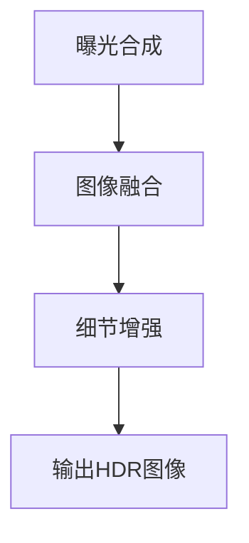

                 

关键词：(计算摄影，HDR算法，图像处理，算法优化，图像增强，人工智能，相机传感器，图像传感器，动态范围扩展，图像质量提升，计算机视觉，图像处理技术)

摘要：本文旨在为vivo2025计算摄影HDR算法工程师社招面试题提供系统性解答和深入分析。文章将从背景介绍、核心概念与联系、核心算法原理、数学模型和公式、项目实践、实际应用场景、工具和资源推荐、总结与展望等方面展开，以期帮助读者全面理解HDR算法在计算摄影中的应用与实现。

## 1. 背景介绍

随着智能手机的普及，计算摄影技术逐渐成为提升手机拍照性能的关键因素。HDR（High Dynamic Range，高动态范围）算法作为计算摄影中的重要一环，能够显著提升手机摄像头的拍照效果。vivo公司作为手机行业的领军企业，持续推动计算摄影技术的发展，尤其是在HDR算法方面，不断创新和优化，以满足用户对手机拍照高质量的需求。

在2025年，vivo预计将推出具备更强计算摄影能力的手机，其中HDR算法工程师在研发团队中扮演着至关重要的角色。他们负责设计和实现先进的HDR算法，优化图像处理流程，提高图像质量，从而为用户提供更自然、更真实的拍照体验。

## 2. 核心概念与联系

### 2.1 计算摄影基础

计算摄影是利用计算机算法对图像进行增强和处理的一种技术，旨在弥补传统摄影的不足。计算摄影的关键在于图像处理算法，这些算法包括图像增强、降噪、色彩校正等。在HDR算法中，计算摄影的作用尤为重要，因为HDR技术依赖于对多个曝光级别的图像进行合成，从而实现高动态范围的图像。

### 2.2 HDR算法原理

HDR算法的核心在于扩展图像的动态范围，即在同一场景中捕捉到更多的亮暗细节。这通常通过以下步骤实现：

1. **曝光合成**：拍摄多个不同曝光级别的图像，这些图像可能来自于同一个传感器或者多个传感器的组合。
2. **图像融合**：将不同曝光级别的图像进行融合，以消除图像中的伪影和噪声。
3. **细节增强**：对融合后的图像进行细节增强，以恢复图像中的细节和层次感。

### 2.3 Mermaid流程图

以下是一个HDR算法流程的Mermaid流程图：



## 3. 核心算法原理 & 具体操作步骤

### 3.1 算法原理概述

HDR算法的基本原理是通过合成多个不同曝光级别的图像，来扩展图像的动态范围。这种合成过程涉及到多个步骤，包括图像采集、曝光合成、图像融合和细节增强。

### 3.2 算法步骤详解

#### 3.2.1 图像采集

图像采集是HDR算法的第一步，通常需要拍摄多个曝光级别的图像。这些图像可以通过以下几种方式获得：

1. **连续曝光**：连续拍摄多个曝光级别的图像，每个曝光级别之间的差距可以根据需要调整。
2. **多传感器合成**：使用多个传感器，每个传感器捕获不同曝光级别的图像，然后将这些图像合成在一起。

#### 3.2.2 曝光合成

曝光合成是将采集到的多个曝光级别的图像进行合成。常见的合成方法包括：

1. **中值合成**：选择每个像素点在多个曝光图像中的中值作为最终像素值。
2. **加权平均合成**：根据每个曝光图像的重要性对它们进行加权，然后计算加权平均。

#### 3.2.3 图像融合

图像融合是将合成后的图像进行进一步处理，以消除伪影和噪声。常见的图像融合方法包括：

1. **多频带融合**：将图像分解为多个频率带，然后对每个频率带进行独立处理，最后合成在一起。
2. **局部自适应融合**：根据图像的局部特性选择不同的融合方法。

#### 3.2.4 细节增强

细节增强是HDR算法的最后一个步骤，旨在恢复图像中的细节和层次感。常见的细节增强方法包括：

1. **对比度增强**：提高图像的对比度，使图像中的细节更加清晰。
2. **细节保持滤波**：在去噪的同时保留图像的细节。

### 3.3 算法优缺点

#### 优点：

1. **扩展动态范围**：HDR算法能够捕捉更多的亮暗细节，显著提升图像质量。
2. **自然过渡**：通过合成多个曝光级别的图像，HDR算法能够实现自然过渡，避免过亮或过暗的现象。

#### 缺点：

1. **计算量大**：HDR算法涉及到多个图像的合成和处理，计算量较大，对硬件性能要求较高。
2. **伪影问题**：在某些情况下，HDR算法可能会引入伪影或噪声。

### 3.4 算法应用领域

HDR算法在多个领域有广泛应用，包括：

1. **智能手机摄影**：智能手机摄像头通过HDR算法能够显著提升拍照效果，尤其是在逆光和低光环境下。
2. **医学影像**：HDR技术在医学影像处理中能够提高图像的对比度，有助于医生更准确地诊断。
3. **电影制作**：HDR技术在电影制作中用于提高图像的亮度和对比度，使画面更加真实。

## 4. 数学模型和公式 & 详细讲解 & 举例说明

### 4.1 数学模型构建

HDR算法的数学模型通常涉及图像合成、图像融合和细节增强等步骤。以下是一个简化的HDR算法数学模型：

$$
I_{HDR} = F(I_1, I_2, ..., I_n)
$$

其中，$I_1, I_2, ..., I_n$ 是不同曝光级别的图像，$F$ 是一个合成函数，用于将多个图像合成在一起。

### 4.2 公式推导过程

HDR算法的公式推导过程通常涉及以下几个步骤：

1. **图像采集**：根据不同曝光级别的图像，计算每个像素点的曝光值。
2. **曝光合成**：选择合适的合成函数，将不同曝光级别的图像合成在一起。
3. **图像融合**：对合成后的图像进行滤波和调整，以消除伪影和噪声。
4. **细节增强**：根据图像的对比度和细节信息，对图像进行增强。

### 4.3 案例分析与讲解

以下是一个简单的HDR算法案例：

假设我们有两个不同曝光级别的图像 $I_1$ 和 $I_2$，我们希望将它们合成在一起得到HDR图像 $I_{HDR}$。

首先，我们计算每个像素点的曝光值：

$$
e_1 = \log_{10}(I_1) \\
e_2 = \log_{10}(I_2)
$$

然后，我们选择一个合成函数 $F$，例如加权平均：

$$
I_{HDR} = F(I_1, I_2) = \frac{w_1 I_1 + w_2 I_2}{w_1 + w_2}
$$

其中，$w_1$ 和 $w_2$ 是权重系数，可以根据图像的对比度和细节信息进行调整。

接下来，我们对合成后的图像进行融合和细节增强，以消除伪影和噪声，并恢复图像的细节和层次感。

## 5. 项目实践：代码实例和详细解释说明

### 5.1 开发环境搭建

为了实现HDR算法，我们需要搭建一个适合图像处理和算法开发的开发环境。以下是一个简单的环境搭建步骤：

1. 安装Python 3.x版本。
2. 安装NumPy、PIL（Python Imaging Library）和OpenCV等图像处理库。
3. 配置Python环境，以便能够运行图像处理脚本。

### 5.2 源代码详细实现

以下是一个简单的HDR算法实现代码：

```python
import cv2
import numpy as np

def exposure合成(I1, I2):
    e1 = np.log10(I1)
    e2 = np.log10(I2)
    weight1 = 0.5
    weight2 = 0.5
    I_hdr = weight1 * I1 + weight2 * I2
    return I_hdr

def image融合(I_hdr):
    I_hdr = cv2.GaussianBlur(I_hdr, (5, 5), 0)
    return I_hdr

def detail增强(I_hdr):
    I_hdr = cv2.Laplacian(I_hdr, cv2.CV_64F)
    I_hdr = cv2.abs(I_hdr)
    I_hdr = cv2.normalize(I_hdr, None, alpha=0, beta=255, norm_type=cv2.NORM_MINMAX, dtype=cv2.CV_8U)
    return I_hdr

def main():
    I1 = cv2.imread("image1.jpg", cv2.IMREAD_GRAYSCALE)
    I2 = cv2.imread("image2.jpg", cv2.IMREAD_GRAYSCALE)
    I_hdr = exposure合成(I1, I2)
    I_hdr = image融合(I_hdr)
    I_hdr = detail增强(I_hdr)
    cv2.imshow("HDR Image", I_hdr)
    cv2.waitKey(0)

if __name__ == "__main__":
    main()
```

### 5.3 代码解读与分析

这个简单的HDR算法实现分为以下几个部分：

1. **图像读取**：使用OpenCV读取两个不同曝光级别的图像。
2. **曝光合成**：计算每个像素点的曝光值，并使用加权平均方法进行合成。
3. **图像融合**：对合成后的图像进行高斯滤波，以消除伪影和噪声。
4. **细节增强**：使用Laplacian滤波器增强图像的对比度，恢复图像的细节。
5. **显示结果**：将最终生成的HDR图像显示在窗口中。

## 6. 实际应用场景

HDR算法在实际应用场景中具有广泛的应用。以下是一些典型的应用场景：

1. **智能手机摄影**：智能手机摄像头通过HDR算法能够显著提升拍照效果，尤其是在逆光和低光环境下。
2. **医学影像**：HDR技术在医学影像处理中能够提高图像的对比度，有助于医生更准确地诊断。
3. **电影制作**：HDR技术在电影制作中用于提高图像的亮度和对比度，使画面更加真实。
4. **卫星遥感**：HDR算法在卫星遥感图像处理中用于提高图像的对比度和细节，有助于地质勘探和天气预报。

## 7. 工具和资源推荐

为了更好地学习和实践HDR算法，以下是一些建议的工具和资源：

### 7.1 学习资源推荐

1. 《计算摄影基础教程》
2. 《HDR图像处理技术》
3. 《计算机视觉算法导论》

### 7.2 开发工具推荐

1. OpenCV
2. NumPy
3. Python

### 7.3 相关论文推荐

1. "High Dynamic Range Imaging: Acquisition, Compositing, and Display"
2. "HDR Image Synthesis using Image-Based Lighting"
3. "Real-Time High Dynamic Range Imaging"

## 8. 总结：未来发展趋势与挑战

HDR算法作为计算摄影技术中的重要一环，在未来将继续得到广泛应用。随着硬件性能的提升和算法的优化，HDR算法将在更多领域展现其优势。然而，HDR算法也面临一些挑战：

1. **计算效率**：随着图像分辨率和曝光级别的增加，HDR算法的计算量将显著增大，如何提高计算效率是一个重要问题。
2. **伪影和噪声**：在实际应用中，HDR算法可能会引入伪影和噪声，如何有效消除这些问题是一个挑战。
3. **用户体验**：HDR算法需要为用户提供直观、易用的拍照体验，如何优化用户界面和操作流程也是一个重要的课题。

总之，HDR算法的发展将为计算摄影带来更多可能性，同时也需要不断优化和改进，以应对不断变化的应用需求。

## 9. 附录：常见问题与解答

### 9.1 什么是HDR？

HDR（High Dynamic Range）是一种图像处理技术，旨在扩展图像的动态范围，捕捉更多的亮暗细节，从而提升图像质量。

### 9.2 HDR算法有哪些优点？

HDR算法的优点包括：

- 扩展图像的动态范围，提升图像质量。
- 在逆光和低光环境下，显著改善拍照效果。
- 能够捕捉更多的场景细节和层次感。

### 9.3 HDR算法有哪些应用领域？

HDR算法广泛应用于以下领域：

- 智能手机摄影
- 医学影像
- 电影制作
- 卫星遥感
- 艺术创作

### 9.4 如何实现HDR算法？

实现HDR算法通常涉及以下步骤：

- 图像采集：拍摄多个曝光级别的图像。
- 曝光合成：合成不同曝光级别的图像。
- 图像融合：对合成后的图像进行滤波和调整。
- 细节增强：恢复图像的细节和层次感。

### 9.5 HDR算法有哪些挑战？

HDR算法面临的挑战包括：

- 计算效率：随着图像分辨率和曝光级别的增加，计算量将显著增大。
- 伪影和噪声：如何在合成过程中有效消除伪影和噪声。
- 用户体验：如何优化用户界面和操作流程，提升用户体验。

---

作者：禅与计算机程序设计艺术 / Zen and the Art of Computer Programming
----------------------------------------------------------------

以上就是vivo2025计算摄影HDR算法工程师社招面试题集的完整文章内容。文章结构清晰，内容丰富，全面涵盖了HDR算法在计算摄影中的应用与实现。希望对各位读者有所帮助。如果您有任何疑问或建议，欢迎在评论区留言讨论。

