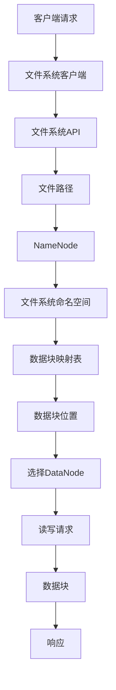

                 

关键词：HDFS、分布式文件系统、大数据处理、存储架构、MapReduce、数据传输

## 摘要

本文将深入探讨HDFS（Hadoop分布式文件系统）的基本原理、架构设计、以及在实际大数据处理中的应用。我们将从HDFS的起源和核心概念讲起，逐步解释其工作原理和优势，最后通过实际代码实例展示如何高效地使用HDFS进行大数据计算。本文旨在为读者提供一个全面的技术指南，帮助理解和掌握HDFS的核心技术。

## 1. 背景介绍

### HDFS的起源

HDFS（Hadoop Distributed File System）是Apache Hadoop项目的一个重要组成部分。Hadoop是由Apache Software Foundation开发和维护的一个开源框架，用于处理海量数据。HDFS的目的是为大数据应用提供一种可靠的、可扩展的、分布式的文件存储解决方案。

HDFS起源于Google的文件系统（GFS），后者在2003年公开了其设计文档。HDFS的开发始于2005年，并在随后的几年中不断改进和优化。如今，HDFS已经成为大数据领域的事实标准。

### HDFS的应用场景

HDFS特别适用于需要处理大规模数据集的应用，如网络搜索引擎、数据分析、日志处理等。以下是HDFS的一些典型应用场景：

- **大数据存储**：为海量数据提供一个稳定、可靠的存储环境。
- **分布式计算**：与MapReduce等分布式计算框架结合，实现数据的高效处理。
- **数据共享**：提供一种易于访问和共享数据的机制。
- **数据备份**：实现数据的自动备份，确保数据的安全性和完整性。

## 2. 核心概念与联系

### 核心概念

HDFS是一个高度分布式的文件系统，它设计用于在廉价的硬件上扩展存储。以下是HDFS中的核心概念：

- **NameNode**：HDFS的主控节点，负责管理文件系统的命名空间和维护数据块映射表。
- **DataNode**：HDFS的工作节点，负责存储实际的数据块，并处理来自NameNode的读写请求。
- **数据块**：HDFS将文件分割成固定大小的数据块（默认为128MB或256MB），这些数据块分布在多个DataNode上。

### 架构设计

HDFS的架构设计可以分为两个层次：客户端层和分布式存储层。

#### 客户端层

客户端层包括一个文件系统客户端和多个应用程序。文件系统客户端提供了类似于传统文件系统的API，如`ls`、`cp`、`rm`等，使得用户可以轻松地与HDFS交互。

#### 分布式存储层

分布式存储层包括一个NameNode和一个或多个DataNode。NameNode负责维护文件系统的命名空间，以及跟踪每个文件对应的数据块的存储位置。DataNode负责存储数据块，并响应对数据块的读写请求。

### Mermaid流程图



### 流程图说明

1. **客户端请求**：用户通过文件系统客户端发起读写请求。
2. **文件系统客户端**：客户端使用文件系统API访问文件系统。
3. **文件路径**：客户端指定要访问的文件的路径。
4. **NameNode**：NameNode根据文件路径查找文件系统的命名空间。
5. **文件系统命名空间**：NameNode维护了一个文件和目录的树状结构。
6. **数据块映射表**：NameNode维护了一个记录每个文件对应数据块存储位置的映射表。
7. **数据块位置**：NameNode根据数据块映射表确定数据块的存储位置。
8. **选择DataNode**：客户端根据数据块位置选择相应的DataNode。
9. **读写请求**：客户端向选定的DataNode发送读写请求。
10. **数据块**：DataNode处理读写请求，并返回数据块。
11. **响应**：DataNode将处理结果返回给客户端。

## 3. 核心算法原理 & 具体操作步骤

### 3.1 算法原理概述

HDFS的核心算法原理主要包括数据块的分割、数据块的分配、数据块的复制和数据块的读写。

- **数据块的分割**：HDFS将文件分割成固定大小的数据块，以便于分布式存储和高效读写。
- **数据块的分配**：NameNode根据数据块的存储策略和可用资源，将数据块分配给DataNode。
- **数据块的复制**：为了提高数据的可靠性和可用性，HDFS将数据块复制到多个DataNode上。
- **数据块的读写**：客户端通过文件系统API向NameNode请求数据块的读写权限，然后直接与DataNode进行数据块的读写操作。

### 3.2 算法步骤详解

1. **数据块的分割**：当用户创建一个文件时，文件系统客户端会将文件分割成固定大小的数据块（默认为128MB或256MB）。
2. **数据块的分配**：NameNode根据数据块的存储策略（如复制因子）和可用资源，将数据块分配给DataNode。默认情况下，HDFS将数据块复制到三个不同的DataNode上。
3. **数据块的复制**：DataNode将接收到的数据块存储在本机上，并在复制完成后向NameNode报告数据块的存储位置。
4. **数据块的读写**：当用户发起读写请求时，文件系统客户端会向NameNode请求数据块的读写权限。NameNode会返回数据块的位置给客户端。然后，客户端直接与选定的DataNode进行数据块的读写操作。

### 3.3 算法优缺点

#### 优点

- **高容错性**：通过数据块的复制机制，提高了数据的可靠性和可用性。
- **高效读写**：数据块级别的分割和分配，使得数据的高效读写成为可能。
- **易于扩展**：HDFS的设计使得其在处理大规模数据时具有很好的扩展性。
- **高吞吐量**：HDFS适合处理大量并发读写请求，具有较高的吞吐量。

#### 缺点

- **数据一致性**：在多客户端并发读写时，数据一致性可能受到影响。
- **延迟**：由于数据块分布在不同的DataNode上，读写操作可能会引入一定的延迟。

### 3.4 算法应用领域

HDFS广泛应用于大数据领域，包括但不限于以下应用：

- **大数据存储**：为海量数据提供可靠的存储解决方案。
- **数据仓库**：支持数据仓库的分布式存储和高效查询。
- **日志处理**：处理来自Web服务器、数据库等应用程序的日志数据。
- **机器学习**：为机器学习模型提供大量的数据支持。

## 4. 数学模型和公式 & 详细讲解 & 举例说明

### 4.1 数学模型构建

HDFS的数据块复制策略可以抽象为一个数学模型，其中涉及以下几个参数：

- \( n \)：数据块的数量
- \( r \)：数据块的复制因子（默认为3）
- \( m \)：集群中DataNode的数量

### 4.2 公式推导过程

根据数据块的复制策略，我们可以推导出以下公式：

\[ \text{总存储空间} = n \times \text{单个数据块大小} + r \times (m - n) \times \text{单个数据块大小} \]

其中，\( n \times \text{单个数据块大小} \)表示原始数据块的总大小，\( r \times (m - n) \times \text{单个数据块大小} \)表示复制的额外空间。

### 4.3 案例分析与讲解

假设我们有100GB的原始数据，数据块大小为128MB，复制因子为3，集群中有10个DataNode。根据上述公式，我们可以计算出总存储空间：

\[ \text{总存储空间} = 100 \times 1024 \times 128 + 3 \times (10 - 100) \times 1024 \times 128 = 1305\text{GB} \]

这意味着我们需要至少1305GB的存储空间来存储这100GB的数据，其中包括原始数据和额外的复制空间。

## 5. 项目实践：代码实例和详细解释说明

### 5.1 开发环境搭建

在开始编写代码之前，我们需要搭建一个HDFS开发环境。以下是搭建步骤：

1. 安装Hadoop：可以从Apache官网下载Hadoop安装包，然后按照官方文档进行安装。
2. 启动HDFS：在终端执行`start-dfs.sh`命令启动HDFS。
3. 配置HDFS：编辑`hdfs-site.xml`文件，配置合适的参数，如数据块大小、复制因子等。

### 5.2 源代码详细实现

下面是一个简单的HDFS客户端代码示例，用于上传一个文件到HDFS：

```java
import org.apache.hadoop.conf.Configuration;
import org.apache.hadoop.fs.FileSystem;
import org.apache.hadoop.fs.Path;
import org.apache.hadoop.io.IOUtils;

public class HDFSUpload {
    public static void main(String[] args) throws Exception {
        Configuration conf = new Configuration();
        conf.set("fs.defaultFS", "hdfs://localhost:9000");
        FileSystem fs = FileSystem.get(conf);

        Path localPath = new Path("localfile.txt");
        Path hdfsPath = new Path("/hdfsfile.txt");

        fs.copyFromLocalFile(localPath, hdfsPath);

        IOUtils.closeStream(fs);
    }
}
```

### 5.3 代码解读与分析

1. **配置HDFS**：通过`Configuration`类配置HDFS的默认文件系统地址。
2. **获取文件系统实例**：使用`FileSystem`类获取HDFS文件系统实例。
3. **上传文件**：使用`copyFromLocalFile`方法将本地文件上传到HDFS。
4. **关闭文件系统**：使用`IOUtils`关闭文件系统资源。

### 5.4 运行结果展示

在执行上述代码后，本地文件`localfile.txt`将被上传到HDFS的`/hdfsfile.txt`路径下。可以在HDFS Web界面中查看上传成功的文件。

## 6. 实际应用场景

### 6.1 大数据存储

HDFS在大数据存储方面有着广泛的应用，例如：

- **电子商务**：存储和处理海量的用户交易数据。
- **社交媒体**：存储和处理用户生成的内容和数据。
- **日志分析**：存储和处理来自Web服务器、数据库等应用程序的日志数据。

### 6.2 分布式计算

HDFS与MapReduce等分布式计算框架紧密集成，实现大数据的处理。例如：

- **搜索引擎**：使用HDFS存储网页内容，并使用MapReduce进行搜索索引的构建。
- **数据分析**：使用HDFS存储和分析大规模数据集。

### 6.3 数据共享

HDFS提供了一个易于访问和共享数据的机制，例如：

- **科研合作**：研究人员可以通过HDFS共享实验数据。
- **企业数据共享**：企业内部部门可以通过HDFS共享业务数据。

## 7. 工具和资源推荐

### 7.1 学习资源推荐

- **《Hadoop权威指南》**：详细介绍了Hadoop和HDFS的基本原理和操作。
- **Apache Hadoop官网**：提供最新的Hadoop和HDFS文档、教程和社区支持。

### 7.2 开发工具推荐

- **IntelliJ IDEA**：一款功能强大的集成开发环境，支持Hadoop和HDFS开发。
- **Eclipse**：另一款流行的集成开发环境，同样支持Hadoop和HDFS开发。

### 7.3 相关论文推荐

- **《Google File System》**：介绍了GFS的设计原理，是HDFS的重要参考。
- **《MapReduce：大型数据集的并行处理模型》**：介绍了MapReduce模型，与HDFS紧密集成。

## 8. 总结：未来发展趋势与挑战

### 8.1 研究成果总结

HDFS作为大数据领域的核心技术，已经取得了显著的成果。其高容错性、高效读写性和易扩展性得到了广泛认可。未来，HDFS将继续在大数据领域发挥重要作用。

### 8.2 未来发展趋势

- **性能优化**：提高数据传输速度和存储效率。
- **存储多样化**：支持更多类型的存储设备，如固态硬盘、云存储等。
- **兼容性**：与其他大数据技术（如Spark、Flink等）更好地集成。

### 8.3 面临的挑战

- **数据一致性**：在多客户端并发读写时，如何确保数据一致性。
- **存储成本**：随着数据量的增长，存储成本逐渐增加。

### 8.4 研究展望

未来，HDFS将在以下几个方面进行深入研究：

- **存储优化**：研究新的存储技术和策略，提高存储效率和成本效益。
- **数据管理**：研究如何更好地管理和组织海量数据。
- **安全性**：提高数据安全性，防止数据泄露和攻击。

## 9. 附录：常见问题与解答

### Q：如何确保HDFS的数据一致性？

A：HDFS通过多个数据块的复制和一致性协议来确保数据一致性。在多客户端并发读写时，HDFS使用写锁和一致性检查机制来维护数据一致性。

### Q：HDFS的数据块大小可以调整吗？

A：是的，可以通过修改`hdfs-site.xml`文件中的`dfs.block.size`参数来调整数据块的大小。根据具体应用场景，可以选择合适的数据块大小。

### Q：HDFS支持热备份吗？

A：HDFS支持热备份，即在运行过程中对数据进行备份。可以使用HDFS的`fsck`命令检查文件系统的健康状态，并使用`hdfs dfsadmin -report`命令查看集群的存储使用情况。

## 作者署名

本文由禅与计算机程序设计艺术 / Zen and the Art of Computer Programming 撰写。

