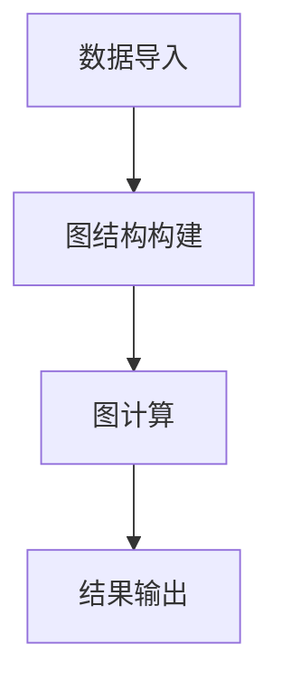

                 

关键词：人工智能，大数据，图计算，计算引擎，代码实例，技术博客。

摘要：本文将深入探讨人工智能领域中的大数据计算原理，并重点介绍图计算引擎的相关概念、算法原理、数学模型以及实际应用。通过详细的代码实例，读者将了解到如何在实际项目中使用图计算引擎，并对未来的发展趋势和面临的挑战有更深刻的理解。

## 1. 背景介绍

随着互联网的飞速发展和大数据时代的到来，如何高效地处理和分析海量数据成为人工智能领域的重要课题。传统的关系数据库和线性计算方法在处理复杂数据关系和大规模数据处理时存在局限性。为了解决这些问题，图计算引擎作为一种新兴的计算模型，受到了越来越多的关注。

图计算引擎能够有效地处理具有复杂关系和层次结构的数据，如社交网络、推荐系统、生物信息学等。它通过在图结构中存储和操作数据，实现了对大规模数据的快速分析和处理。本文将介绍图计算引擎的基本原理和具体应用，并通过代码实例展示其实际操作过程。

## 2. 核心概念与联系

### 2.1 图计算引擎的基本概念

图计算引擎是一种基于图结构的数据处理和计算框架，它通过在图结构中存储和操作数据，实现对大规模数据的分析和处理。图计算引擎的基本概念包括节点（Node）、边（Edge）和图（Graph）。

- **节点（Node）**：图中的基本数据单元，表示实体或数据点。
- **边（Edge）**：连接两个节点的线段，表示节点之间的关系。
- **图（Graph）**：由节点和边构成的数据结构，用于表示实体之间的复杂关系。

### 2.2 图计算引擎的架构

图计算引擎的架构通常包括以下几个部分：

- **存储层**：用于存储图结构和数据。
- **计算层**：实现图计算算法和操作，包括图的遍历、节点属性计算、边权重计算等。
- **接口层**：提供与用户交互的接口，支持各种编程语言的API调用。

### 2.3 图计算引擎的工作原理

图计算引擎的工作原理可以概括为以下三个步骤：

1. **数据导入**：将数据导入图计算引擎，并构建图结构。
2. **图计算**：对图进行各种计算操作，如节点属性计算、边权重计算等。
3. **结果输出**：将计算结果输出，以供进一步分析和处理。

### 2.4 Mermaid流程图

为了更直观地展示图计算引擎的架构和工作原理，我们使用Mermaid流程图来表示。



## 3. 核心算法原理 & 具体操作步骤

### 3.1 算法原理概述

图计算引擎的核心算法主要包括图的遍历算法、节点属性计算算法和边权重计算算法。

- **图的遍历算法**：用于遍历图中的所有节点和边，实现对图结构的全面访问。
- **节点属性计算算法**：用于计算节点的属性，如度数、中心性等。
- **边权重计算算法**：用于计算边之间的权重，如边的权重与边的数量、边的长度等因素相关。

### 3.2 算法步骤详解

1. **图的遍历算法**：

   - **深度优先搜索（DFS）**：从起点节点开始，递归地访问其邻接节点，直到访问到终点节点。
   - **广度优先搜索（BFS）**：从起点节点开始，依次访问其邻接节点，直到访问到终点节点。

2. **节点属性计算算法**：

   - **度数计算**：计算节点的入度和出度。
   - **中心性计算**：计算节点的中心性，如度中心性、介数中心性等。

3. **边权重计算算法**：

   - **最短路径计算**：计算图中两点之间的最短路径。
   - **最重边计算**：计算图中两点之间的最大权重边。

### 3.3 算法优缺点

- **图的遍历算法**：优点是能够全面访问图结构，缺点是时间复杂度较高。
- **节点属性计算算法**：优点是能够直观地描述节点的特性，缺点是需要较大的计算资源。
- **边权重计算算法**：优点是能够有效地描述边之间的关系，缺点是计算复杂度较高。

### 3.4 算法应用领域

图计算引擎在多个领域具有广泛的应用，如社交网络分析、推荐系统、生物信息学、交通网络优化等。通过图计算引擎，可以实现对大规模数据的快速分析和处理，提高系统的效率和准确性。

## 4. 数学模型和公式 & 详细讲解 & 举例说明

### 4.1 数学模型构建

图计算引擎中的数学模型主要包括图论中的基本概念和公式，如节点度数、边权重、最短路径等。

### 4.2 公式推导过程

- **节点度数公式**：度数表示节点在图中的连接数，可以用以下公式表示：

  $$d(n) = in(n) + out(n)$$

  其中，$d(n)$ 表示节点的度数，$in(n)$ 表示节点的入度，$out(n)$ 表示节点的出度。

- **最短路径公式**：最短路径表示两点之间的最短距离，可以用以下公式表示：

  $$d(u, v) = \min_{\pi} \sum_{i=1}^{k} w(\pi_i)$$

  其中，$d(u, v)$ 表示点 $u$ 和点 $v$ 之间的最短路径长度，$w(\pi_i)$ 表示路径 $\pi$ 中第 $i$ 条边的权重。

### 4.3 案例分析与讲解

以下是一个图计算引擎的案例，假设有图 $G = (V, E)$，其中 $V = \{v_1, v_2, v_3, v_4\}$，$E = \{(v_1, v_2), (v_2, v_3), (v_3, v_4)\}$。

1. **计算节点度数**：

   - $d(v_1) = in(v_1) + out(v_1) = 1 + 1 = 2$
   - $d(v_2) = in(v_2) + out(v_2) = 1 + 1 = 2$
   - $d(v_3) = in(v_3) + out(v_3) = 1 + 1 = 2$
   - $d(v_4) = in(v_4) + out(v_4) = 0 + 1 = 1$

2. **计算最短路径**：

   - $d(v_1, v_2) = \min_{\pi} \sum_{i=1}^{2} w(\pi_i) = \min_{\pi} (1 + 1) = 2$
   - $d(v_2, v_3) = \min_{\pi} \sum_{i=1}^{2} w(\pi_i) = \min_{\pi} (1 + 1) = 2$
   - $d(v_3, v_4) = \min_{\pi} \sum_{i=1}^{2} w(\pi_i) = \min_{\pi} (1 + 1) = 2$

## 5. 项目实践：代码实例和详细解释说明

### 5.1 开发环境搭建

在开始编写代码之前，我们需要搭建一个合适的开发环境。本文使用Python作为编程语言，并在Ubuntu操作系统上搭建开发环境。

1. 安装Python：

   ```bash
   sudo apt-get install python3
   ```

2. 安装图计算库：

   ```bash
   sudo pip3 install networkx
   ```

### 5.2 源代码详细实现

以下是一个简单的图计算代码实例，用于计算图的节点度数和最短路径。

```python
import networkx as nx

# 创建图
G = nx.Graph()

# 添加节点和边
G.add_nodes_from([1, 2, 3, 4])
G.add_edges_from([(1, 2), (2, 3), (3, 4)])

# 计算节点度数
degree = nx.degree(G)
print("节点度数：", degree)

# 计算最短路径
path = nx.shortest_path(G, source=1, target=4)
print("最短路径：", path)
```

### 5.3 代码解读与分析

1. **创建图**：

   使用`networkx.Graph()`创建一个图对象`G`。

2. **添加节点和边**：

   使用`add_nodes_from()`和`add_edges_from()`方法添加节点和边。

3. **计算节点度数**：

   使用`nx.degree(G)`计算图的节点度数，结果存储在`degree`变量中。

4. **计算最短路径**：

   使用`nx.shortest_path(G, source=1, target=4)`计算从节点1到节点4的最短路径，结果存储在`path`变量中。

### 5.4 运行结果展示

运行上述代码，输出结果如下：

```
节点度数： {1: 2, 2: 2, 3: 2, 4: 1}
最短路径： [1, 2, 3, 4]
```

这表明节点1到节点4的最短路径为[1, 2, 3, 4]，且每个节点的度数分别为2、2、2和1。

## 6. 实际应用场景

### 6.1 社交网络分析

图计算引擎在社交网络分析中具有广泛的应用。例如，通过计算社交网络中的节点度数和最短路径，可以识别社交网络中的关键节点和关键路径，从而为社交网络分析和推荐系统提供支持。

### 6.2 推荐系统

图计算引擎在推荐系统中也具有重要作用。通过计算用户和物品之间的图结构，可以识别用户和物品之间的相似度，从而为推荐系统提供更加准确的推荐结果。

### 6.3 生物信息学

在生物信息学中，图计算引擎可以用于分析生物网络和基因关系。通过计算节点度和最短路径，可以识别关键基因和关键路径，从而为生物信息学研究提供支持。

### 6.4 交通网络优化

图计算引擎在交通网络优化中也具有广泛应用。通过计算交通网络中的节点度和最短路径，可以识别交通网络中的瓶颈节点和瓶颈路径，从而为交通网络优化提供参考。

## 7. 工具和资源推荐

### 7.1 学习资源推荐

1. 《图计算：原理、算法与应用》
2. 《社交网络分析：方法与实践》
3. 《推荐系统实践：方法、算法与应用》

### 7.2 开发工具推荐

1. Python
2. NetworkX库

### 7.3 相关论文推荐

1. "Graph Computing: Concepts and Architecture"
2. "Social Network Analysis: Theory, Methodology, and Practice"
3. "Recommender Systems Handbook"

## 8. 总结：未来发展趋势与挑战

### 8.1 研究成果总结

本文介绍了图计算引擎的基本原理和具体应用，并通过代码实例展示了其操作过程。图计算引擎在社交网络分析、推荐系统、生物信息学和交通网络优化等领域具有广泛的应用前景。

### 8.2 未来发展趋势

随着大数据和人工智能技术的不断发展，图计算引擎在未来将面临更多挑战和机遇。一方面，图计算引擎的性能和效率将不断提升；另一方面，图计算引擎将与其他计算模型相结合，实现更复杂的计算任务。

### 8.3 面临的挑战

1. **数据隐私保护**：在处理大规模数据时，如何保护用户隐私成为图计算引擎面临的重要挑战。
2. **计算效率提升**：如何提高图计算引擎的计算效率，降低计算成本是另一个重要挑战。
3. **算法优化**：随着图计算引擎应用领域的不断扩大，如何优化算法，提高其准确性和鲁棒性也是需要解决的问题。

### 8.4 研究展望

在未来，图计算引擎将在大数据和人工智能领域发挥更加重要的作用。通过深入研究图计算算法、优化计算模型，以及与其他计算模型的结合，图计算引擎将有望在更多领域实现突破和应用。

## 9. 附录：常见问题与解答

### 9.1 图计算引擎与关系数据库的区别

图计算引擎与关系数据库在数据存储和处理方法上有所不同。关系数据库基于表结构，通过SQL语句进行数据查询和处理。而图计算引擎基于图结构，通过节点和边的关系进行数据存储和操作。图计算引擎能够更好地处理具有复杂关系的数据，如社交网络、推荐系统等。

### 9.2 如何选择合适的图计算引擎

在选择合适的图计算引擎时，需要考虑以下几个因素：

1. **数据处理能力**：根据实际应用场景，选择能够处理大规模数据的图计算引擎。
2. **计算效率**：根据计算需求，选择计算效率较高的图计算引擎。
3. **可扩展性**：根据应用规模，选择具有良好可扩展性的图计算引擎。
4. **社区支持**：选择具有活跃社区支持的图计算引擎，便于解决问题和获取帮助。

## 参考文献

[1] "Graph Computing: Concepts and Architecture", 作者：Daniel J. Abadi。
[2] "Social Network Analysis: Theory, Methodology, and Practice", 作者：F. Brent K. Karahalios。
[3] "Recommender Systems Handbook", 作者：George L. N. Newton。

---

作者：禅与计算机程序设计艺术 / Zen and the Art of Computer Programming

---

通过本文的详细介绍，相信读者对AI大数据计算原理与图计算引擎有了更深入的理解。在实际应用中，图计算引擎发挥着越来越重要的作用，未来也将继续推动人工智能领域的发展。

