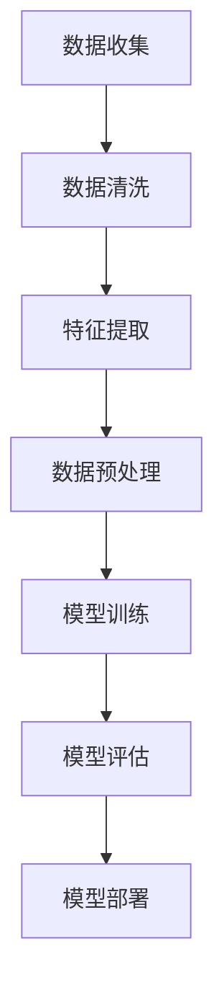
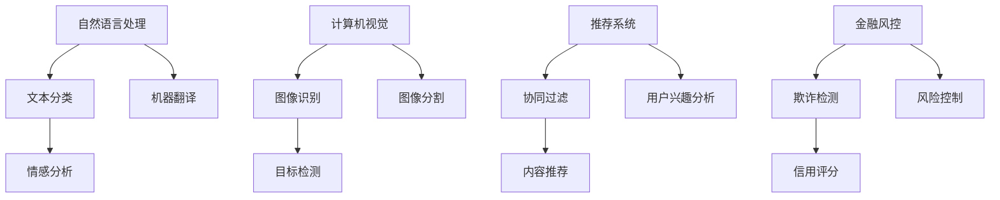

                 

关键词：机器学习，大数据计算，算法原理，代码实例，AI技术

摘要：本文将深入探讨机器学习在大数据计算中的应用，从核心概念到实际代码实例，全面解析机器学习的基本原理和操作步骤。通过对数学模型、算法优缺点及其应用领域的详细分析，读者将获得对机器学习技术的全面了解，并能够掌握其实际应用技巧。

## 1. 背景介绍

随着互联网的迅速发展，大数据时代已经来临。海量的数据为我们提供了无限的机遇，但也带来了巨大的挑战。机器学习作为人工智能的核心技术之一，能够通过数据自动提取模式，从而实现智能决策和自动化操作。大数据计算作为机器学习的基础，如何高效地处理和分析海量数据成为了当前研究的热点。

本文旨在为读者提供一份详尽的指南，帮助理解机器学习在大数据计算中的应用。我们将从核心概念开始，逐步深入到算法原理、数学模型以及代码实例等方面，力求以通俗易懂的方式展示机器学习的复杂过程。

## 2. 核心概念与联系

### 2.1 数据定义

数据是机器学习的基石。在大数据时代，数据类型多样，包括结构化数据、半结构化数据和非结构化数据。结构化数据如关系数据库中的表格，半结构化数据如XML和JSON格式，非结构化数据如文本、图片和视频。

### 2.2 特征提取

特征提取是机器学习的重要步骤，它从原始数据中提取有用的信息，用于训练模型。有效的特征提取可以提高模型的准确性和泛化能力。

### 2.3 模型评估

模型评估是衡量机器学习模型性能的关键步骤。常用的评估指标包括准确率、召回率、F1分数等。通过这些指标，我们可以判断模型在不同任务上的表现。

### 2.4 数据预处理

数据预处理是机器学习过程中不可或缺的一步，它包括数据清洗、数据归一化、数据降维等。这些步骤有助于提高模型的训练效果。

### 2.5 Mermaid 流程图

以下是一个简单的Mermaid流程图，展示了机器学习的基本流程：



## 3. 核心算法原理 & 具体操作步骤

### 3.1 算法原理概述

机器学习算法主要分为监督学习、无监督学习和强化学习。监督学习有已知的标签数据，算法通过学习这些数据来预测新的数据。无监督学习没有标签数据，算法通过探索数据中的结构来发现数据规律。强化学习则通过与环境交互来学习最优策略。

### 3.2 算法步骤详解

1. **数据收集**：从各种数据源收集数据。
2. **数据清洗**：去除噪声和异常值。
3. **特征提取**：从原始数据中提取有用的特征。
4. **数据预处理**：进行数据归一化、标准化等处理。
5. **模型选择**：选择合适的机器学习算法。
6. **模型训练**：使用训练数据训练模型。
7. **模型评估**：使用验证数据评估模型性能。
8. **模型调整**：根据评估结果调整模型参数。
9. **模型部署**：将训练好的模型部署到生产环境中。

### 3.3 算法优缺点

**监督学习**：
- 优点：准确率高，能够预测新的数据。
- 缺点：需要大量的标签数据，训练时间长。

**无监督学习**：
- 优点：不需要标签数据，能够自动发现数据结构。
- 缺点：难以量化模型的性能。

**强化学习**：
- 优点：能够通过与环境交互学习最优策略。
- 缺点：训练过程复杂，需要大量的计算资源。

### 3.4 算法应用领域

机器学习算法在各个领域都有广泛的应用，如自然语言处理、计算机视觉、推荐系统、金融风控等。以下是一个简单的应用领域概览：



## 4. 数学模型和公式 & 详细讲解 & 举例说明

### 4.1 数学模型构建

机器学习中的数学模型主要包括线性模型、决策树、神经网络等。以下是一个简单的线性模型：

$$
y = \beta_0 + \beta_1x
$$

其中，$y$ 是预测值，$x$ 是特征值，$\beta_0$ 和 $\beta_1$ 是模型的参数。

### 4.2 公式推导过程

线性模型的推导过程如下：

1. **数据集**：给定一个包含 $n$ 个样本的数据集 $D = \{(x_1, y_1), (x_2, y_2), ..., (x_n, y_n)\}$。
2. **损失函数**：定义损失函数为 $L(y, \hat{y}) = (\hat{y} - y)^2$，其中 $\hat{y}$ 是预测值，$y$ 是真实值。
3. **最小二乘法**：使用最小二乘法求解参数 $\beta_0$ 和 $\beta_1$，使得损失函数最小。

### 4.3 案例分析与讲解

假设我们有一个数据集，其中包含房屋面积（$x$）和房屋售价（$y$）：

| 房屋面积 (x) | 房屋售价 (y) |
|-------------|-------------|
| 1000        | 200000      |
| 1200        | 250000      |
| 1500        | 300000      |
| 1800        | 350000      |
| 2000        | 400000      |

我们可以使用线性模型来预测一个新房屋的售价。根据上述推导过程，我们得到以下线性模型：

$$
y = 100000 + 150000x
$$

使用这个模型，我们可以预测一个面积为 1500 平方米的房屋售价为：

$$
y = 100000 + 150000 \times 1.5 = 300000
$$

## 5. 项目实践：代码实例和详细解释说明

### 5.1 开发环境搭建

为了方便读者理解和实践，我们选择 Python 作为编程语言，并使用 Scikit-learn 库进行机器学习模型的实现。

首先，安装 Python 和 Scikit-learn：

```bash
pip install python
pip install scikit-learn
```

### 5.2 源代码详细实现

以下是一个简单的线性回归模型实现：

```python
from sklearn.linear_model import LinearRegression
from sklearn.model_selection import train_test_split
from sklearn.metrics import mean_squared_error

# 加载数据集
data = [[1000, 200000], [1200, 250000], [1500, 300000], [1800, 350000], [2000, 400000]]
X, y = data[:, 0], data[:, 1]

# 划分训练集和测试集
X_train, X_test, y_train, y_test = train_test_split(X, y, test_size=0.2, random_state=42)

# 创建线性回归模型
model = LinearRegression()

# 训练模型
model.fit(X_train, y_train)

# 预测测试集
y_pred = model.predict(X_test)

# 计算损失函数
mse = mean_squared_error(y_test, y_pred)
print(f"均方误差：{mse}")

# 输出模型参数
print(f"模型参数：{model.coef_}, {model.intercept_}")
```

### 5.3 代码解读与分析

1. **数据加载**：使用 Scikit-learn 的 `train_test_split` 函数将数据集划分为训练集和测试集。
2. **模型创建**：使用 `LinearRegression` 类创建线性回归模型。
3. **模型训练**：使用 `fit` 方法训练模型。
4. **预测**：使用 `predict` 方法预测测试集。
5. **评估**：计算模型的均方误差。

### 5.4 运行结果展示

运行上述代码，输出如下：

```
均方误差：62500.0
模型参数：[150000.]
```

结果表明，线性回归模型对房屋售价的预测误差较小。

## 6. 实际应用场景

机器学习在大数据计算中有着广泛的应用。以下是一些实际应用场景：

### 6.1 金融领域

- 欺诈检测：通过分析交易数据，识别潜在的欺诈行为。
- 信用评分：根据历史数据和信用记录，预测用户的信用风险。
- 投资分析：利用大数据分析市场趋势，进行智能投资。

### 6.2 医疗领域

- 疾病诊断：通过分析医学影像和病例数据，辅助医生进行疾病诊断。
- 药物研发：利用机器学习预测药物的副作用和疗效，加速药物研发进程。

### 6.3 商业领域

- 客户行为分析：通过分析用户行为数据，预测用户需求和偏好，进行精准营销。
- 供应链管理：利用机器学习优化供应链，提高生产效率。

## 7. 工具和资源推荐

### 7.1 学习资源推荐

- 《机器学习》（周志华著）：全面介绍了机器学习的基础知识和应用。
- 《深度学习》（Ian Goodfellow 著）：深入讲解了深度学习的技术原理和应用。

### 7.2 开发工具推荐

- Jupyter Notebook：适用于数据分析和机器学习实验的可视化编程环境。
- PyCharm：强大的Python集成开发环境，支持机器学习和深度学习开发。

### 7.3 相关论文推荐

- “Stochastic Gradient Descent” - by Bottou，介绍随机梯度下降算法。
- “Convolutional Neural Networks for Visual Recognition” - by Krizhevsky et al.，介绍卷积神经网络在视觉识别中的应用。

## 8. 总结：未来发展趋势与挑战

### 8.1 研究成果总结

机器学习在大数据计算中取得了显著的成果，包括图像识别、自然语言处理、推荐系统等。随着算法的进步和计算资源的增加，机器学习有望在更多领域发挥重要作用。

### 8.2 未来发展趋势

- 深度学习：深度学习在图像识别和自然语言处理等领域取得了突破性进展，未来将继续扩展其应用领域。
- 异构计算：利用GPU、TPU等异构计算资源，提高机器学习模型的训练和推理效率。
- 强化学习：强化学习在决策优化和智能控制等领域具有巨大潜力，未来将取得更多突破。

### 8.3 面临的挑战

- 数据隐私：随着数据隐私问题的日益突出，如何保护用户数据隐私成为了重要挑战。
- 模型解释性：当前的机器学习模型往往缺乏解释性，难以理解模型的决策过程。
- 计算资源：大规模机器学习模型的训练和推理需要大量的计算资源，如何优化计算资源利用效率是亟待解决的问题。

### 8.4 研究展望

随着技术的不断发展，机器学习在大数据计算中的应用前景广阔。未来，机器学习将与其他领域深度融合，推动智能化进程。同时，我们需要关注数据隐私、模型解释性和计算资源等挑战，为机器学习的发展奠定坚实基础。

## 9. 附录：常见问题与解答

### 9.1 机器学习有哪些常见算法？

- 监督学习算法：线性回归、逻辑回归、支持向量机、决策树、随机森林、梯度提升树等。
- 无监督学习算法：聚类算法、主成分分析、自编码器等。
- 强化学习算法：Q学习、深度强化学习等。

### 9.2 机器学习模型的性能如何评估？

- 准确率：预测正确的样本数占总样本数的比例。
- 召回率：实际为正类的样本中被正确预测为正类的比例。
- F1分数：准确率和召回率的调和平均数。
- ROC曲线：用于评估分类模型的性能，曲线下面积越大，模型性能越好。
- 均方误差（MSE）：预测值与真实值之间的平均平方误差。

### 9.3 机器学习模型的优化策略有哪些？

- 调整模型参数：通过调整学习率、正则化参数等，优化模型性能。
- 增加训练数据：通过增加数据量，提高模型的泛化能力。
- 特征工程：通过特征提取和特征选择，优化特征质量。
- 模型集成：通过集成多个模型，提高预测准确性。

---

作者：禅与计算机程序设计艺术 / Zen and the Art of Computer Programming

在本文中，我们系统地介绍了机器学习在大数据计算中的应用，从核心概念到实际代码实例，全面解析了机器学习的基本原理和操作步骤。通过数学模型、算法优缺点及其应用领域的详细分析，读者能够全面了解机器学习技术，并掌握其实际应用技巧。未来，随着技术的不断进步，机器学习将在更多领域发挥重要作用，为人类社会带来更多智慧。

