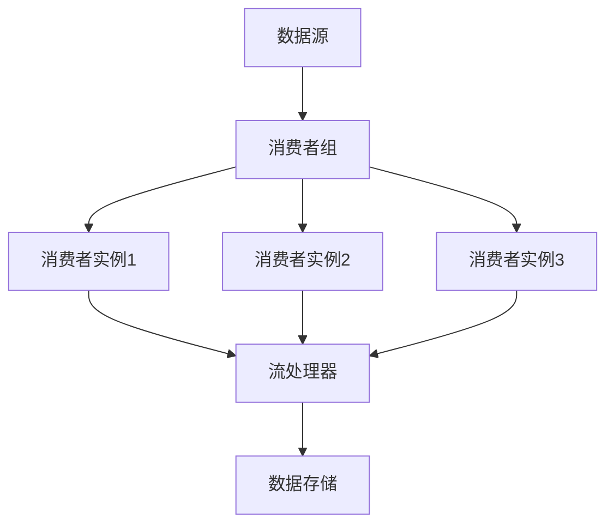

                 

关键词：AI大数据、计算原理、消费者组、代码实例、技术博客

## 摘要

本文将深入探讨AI大数据计算原理，特别是消费者组在数据处理和分析中的应用。通过详细讲解核心概念、算法原理、数学模型、实际应用案例以及代码实例，本文旨在为读者提供一份全面的技术指南。同时，我们将展望未来发展趋势与面临的挑战，并推荐相关学习资源和开发工具。

## 1. 背景介绍

随着互联网和物联网技术的迅猛发展，数据规模呈现爆炸性增长。大数据（Big Data）应运而生，成为当今信息时代的重要资源。AI技术的兴起进一步推动了大数据的处理和分析，为各行业带来了前所未有的机遇和挑战。

消费者组（Consumer Group）是大数据处理中至关重要的一环，它是一种分布式数据处理模型，能够高效地处理大量数据流。消费者组通常由多个消费者实例组成，负责从数据源拉取数据，进行处理和分析。

本文将围绕消费者组展开，介绍其在大数据计算中的应用，并探讨相关的算法原理、数学模型以及代码实现。

### 1.1 大数据的定义和特征

大数据通常指数据规模巨大、种类繁多、处理速度要求高、价值密度低的数据集。其特征可以归纳为“4V”：数据量（Volume）、数据种类（Variety）、数据速度（Velocity）和数据价值（Value）。

- 数据量：大数据涉及的规模非常庞大，通常以TB、PB甚至EB为单位。
- 数据种类：大数据不仅包括结构化数据，如关系型数据库中的数据，还包括非结构化数据，如图像、音频、视频等。
- 数据速度：大数据处理要求高效实时，能够在短时间内完成数据分析和决策。
- 数据价值：大数据的价值密度较低，需要通过复杂的算法和模型来挖掘和提炼。

### 1.2 AI与大数据的关系

AI（人工智能）技术为大数据处理提供了强大的计算能力和智能分析工具。通过机器学习和深度学习算法，AI能够从海量数据中提取特征、建立模型，并进行预测和决策。

AI与大数据的结合体现在以下几个方面：

- 数据预处理：AI技术能够对大数据进行预处理，包括数据清洗、去重、归一化等操作，提高数据质量。
- 数据分析：AI算法能够对大数据进行高效的分析，提取有价值的信息，支持业务决策。
- 预测和决策：基于大数据和AI模型，可以实现对未来趋势的预测和决策，提高业务效率。
- 智能优化：AI技术能够优化大数据处理流程，降低成本、提高效率。

## 2. 核心概念与联系

为了更好地理解消费者组在AI大数据计算中的应用，我们首先需要了解几个核心概念，并使用Mermaid流程图来展示它们之间的关系。

### 2.1 核心概念

- 数据源（Data Source）：数据流进入系统的地方，可以是数据库、消息队列、实时数据采集设备等。
- 消费者组（Consumer Group）：由多个消费者实例组成的分布式数据处理单元。
- 消费者实例（Consumer Instance）：消费者组的成员，负责从数据源拉取数据并进行处理。
- 流处理器（Stream Processor）：负责对消费者组拉取的数据进行实时处理和分析的组件。
- 数据存储（Data Storage）：存储处理后的数据，以便后续分析和使用。

### 2.2 Mermaid流程图

下面是一个简化的Mermaid流程图，展示了消费者组在AI大数据计算中的工作流程：



在这个流程图中，数据源A将数据发送到消费者组B，消费者组B中的多个消费者实例C、D、E分别从数据源拉取数据，并交给流处理器F进行处理，最终将处理后的数据存储到数据存储G中。

### 2.3 消费者组的工作原理

消费者组的工作原理可以概括为以下几个步骤：

1. **初始化**：消费者组启动并初始化，分配每个消费者实例的任务和资源。
2. **拉取数据**：消费者实例从数据源拉取数据，并将其存储在本地缓存中。
3. **处理数据**：消费者实例对拉取到的数据进行处理，如过滤、转换、聚合等。
4. **发送结果**：处理后的数据被发送到流处理器，进行进一步分析和存储。
5. **监控与维护**：系统对消费者组进行监控和维护，确保其正常运行。

消费者组的核心优势在于其分布式和弹性伸缩的特性，能够高效地处理大规模数据流，同时具备故障转移和高可用性。

## 3. 核心算法原理 & 具体操作步骤

### 3.1 算法原理概述

消费者组在AI大数据计算中常用的算法主要包括分布式消息队列处理算法、流数据处理算法和机器学习算法。

- **分布式消息队列处理算法**：用于消费者组内部的消费者实例之间的数据传输和任务分配，如Apache Kafka中的消费者组协调算法。
- **流数据处理算法**：用于对消费者实例拉取到的数据进行实时处理，如Apache Flink中的数据流处理算法。
- **机器学习算法**：用于从流处理数据中提取特征、建立预测模型，如线性回归、决策树、神经网络等。

### 3.2 算法步骤详解

#### 分布式消息队列处理算法

1. **初始化**：消费者组启动并初始化，每个消费者实例从协调器获取分区分配信息。
2. **任务分配**：消费者实例根据分区分配信息，开始从数据源拉取数据。
3. **数据处理**：消费者实例对拉取到的数据进行处理，如过滤、转换、聚合等。
4. **数据发送**：处理后的数据被发送到流处理器，进行进一步分析和存储。
5. **监控与维护**：系统对消费者组进行监控和维护，确保其正常运行。

#### 流数据处理算法

1. **初始化**：流处理器启动并初始化，创建数据流处理管道。
2. **数据输入**：消费者实例将拉取到的数据发送到流处理器，进入数据流处理管道。
3. **数据处理**：流处理器对数据流进行处理，如过滤、转换、聚合等。
4. **结果输出**：处理后的数据被输出到数据存储或进行实时分析和预测。
5. **监控与维护**：系统对流处理器进行监控和维护，确保其正常运行。

#### 机器学习算法

1. **数据预处理**：对流处理数据进行预处理，如归一化、特征提取等。
2. **模型训练**：使用机器学习算法对预处理后的数据集进行训练，建立预测模型。
3. **模型评估**：评估模型性能，调整模型参数。
4. **模型应用**：将训练好的模型应用到实际业务场景，进行实时预测和决策。
5. **监控与维护**：系统对机器学习模型进行监控和维护，确保其稳定运行。

### 3.3 算法优缺点

#### 分布式消息队列处理算法

优点：

- 高效的数据传输和处理能力，支持海量数据流。
- 分布式架构，具备高可用性和故障转移能力。

缺点：

- 对数据的一致性要求较高，可能存在数据丢失或重复处理的问题。
- 需要额外的协调和管理开销，如消费者组协调算法等。

#### 流数据处理算法

优点：

- 支持实时数据处理，具备高效的处理能力和低延迟。
- 易于扩展，能够处理大规模数据流。

缺点：

- 对数据的一致性要求较高，可能存在数据丢失或重复处理的问题。
- 需要额外的资源管理和监控开销。

#### 机器学习算法

优点：

- 能够从数据中提取有价值的信息，支持业务决策和预测。
- 具有自适应性和学习能力，能够适应不断变化的数据环境。

缺点：

- 模型训练和评估需要大量的计算资源和时间。
- 模型性能对数据质量和特征提取有较高要求。

### 3.4 算法应用领域

分布式消息队列处理算法和流数据处理算法广泛应用于实时数据处理和实时分析场景，如金融交易分析、网络流量监控、物联网数据采集等。机器学习算法则广泛应用于预测分析、推荐系统、自然语言处理等领域。

## 4. 数学模型和公式 & 详细讲解 & 举例说明

### 4.1 数学模型构建

在AI大数据计算中，消费者组涉及的数学模型主要包括概率模型、统计模型和机器学习模型。以下是这些模型的基本构建和推导过程。

#### 概率模型

概率模型用于描述随机事件的发生概率，是机器学习的基础。以下是几个常见的概率模型：

1. **伯努利分布**：描述一个二元事件发生的概率，如硬币正反面。
   $$ P(X=1) = p, \quad P(X=0) = 1-p $$
   
2. **二项分布**：描述多次独立重复实验中成功次数的概率，如抛硬币10次，出现正面的次数。
   $$ P(X=k) = C_n^k p^k (1-p)^{n-k} $$

3. **泊松分布**：描述单位时间内事件发生的次数的概率，如一个小时内电话的呼叫次数。
   $$ P(X=k) = \frac{\lambda^k e^{-\lambda}}{k!} $$

#### 统计模型

统计模型用于描述数据分布和统计特性，是数据分析的基础。以下是几个常见的统计模型：

1. **正态分布**：描述连续随机变量的概率分布，如人的身高、体重。
   $$ f(x|\mu,\sigma^2) = \frac{1}{\sqrt{2\pi\sigma^2}} e^{-\frac{(x-\mu)^2}{2\sigma^2}} $$
   
2. **卡方分布**：描述独立随机变量的平方和的概率分布，如方差分析。
   $$ f(x|\nu) = \frac{1}{2^{\nu/2}\Gamma(\nu/2)} x^{\nu/2-1} e^{-x/2} $$

3. **t分布**：描述小样本数据的概率分布，如t检验。
   $$ f(x|\nu) = \frac{\Gamma(\nu/2)}{\sqrt{\pi\nu}\Gamma(\nu/2-1)} \left(1 + \frac{x^2}{\nu}\right)^{-\nu/2} $$

#### 机器学习模型

机器学习模型用于从数据中学习规律和模式，如线性回归、决策树、神经网络等。以下是线性回归模型的基本构建和推导过程：

1. **线性回归模型**：描述自变量和因变量之间的关系，如房价与面积的关系。
   $$ y = \beta_0 + \beta_1 x + \epsilon $$
   其中，$y$ 为因变量，$x$ 为自变量，$\beta_0$ 和 $\beta_1$ 为模型参数，$\epsilon$ 为误差项。

2. **模型参数估计**：使用最小二乘法估计模型参数，使得预测误差平方和最小。
   $$ \min_{\beta_0,\beta_1} \sum_{i=1}^n (y_i - (\beta_0 + \beta_1 x_i))^2 $$
   解得：
   $$ \beta_0 = \bar{y} - \beta_1 \bar{x} $$
   $$ \beta_1 = \frac{\sum_{i=1}^n (x_i - \bar{x})(y_i - \bar{y})}{\sum_{i=1}^n (x_i - \bar{x})^2} $$

### 4.2 公式推导过程

为了更直观地理解上述数学模型，我们通过一个简单的例子进行推导。

#### 例子：线性回归模型

假设我们要研究房价与面积之间的关系，给定如下数据集：

| 面积（平方米） | 房价（万元） |
| :-----------: | :---------: |
|      100      |     200    |
|      120      |     250    |
|      150      |     300    |
|      180      |     350    |
|      200      |     400    |

1. **计算平均值**：
   $$ \bar{x} = \frac{100 + 120 + 150 + 180 + 200}{5} = 150 $$
   $$ \bar{y} = \frac{200 + 250 + 300 + 350 + 400}{5} = 300 $$

2. **计算协方差**：
   $$ \sum_{i=1}^n (x_i - \bar{x})(y_i - \bar{y}) = (100-150)(200-300) + (120-150)(250-300) + (150-150)(300-300) + (180-150)(350-300) + (200-150)(400-300) $$
   $$ = 50 \times (-100) + (-30) \times (-50) + 0 \times 0 + 30 \times 50 + 50 \times 100 $$
   $$ = -5000 + 1500 + 0 + 1500 + 5000 $$
   $$ = 5000 $$

3. **计算方差**：
   $$ \sum_{i=1}^n (x_i - \bar{x})^2 = (100-150)^2 + (120-150)^2 + (150-150)^2 + (180-150)^2 + (200-150)^2 $$
   $$ = 2500 + 900 + 0 + 900 + 2500 $$
   $$ = 6500 $$

4. **计算回归系数**：
   $$ \beta_0 = \bar{y} - \beta_1 \bar{x} = 300 - \frac{5000}{6500} \times 150 = 300 - \frac{5}{6} \times 150 = 300 - 125 = 175 $$
   $$ \beta_1 = \frac{\sum_{i=1}^n (x_i - \bar{x})(y_i - \bar{y})}{\sum_{i=1}^n (x_i - \bar{x})^2} = \frac{5000}{6500} = \frac{5}{6} $$

因此，线性回归模型的预测公式为：
$$ y = 175 + \frac{5}{6} x $$

### 4.3 案例分析与讲解

#### 案例背景

假设我们有一个在线购物平台，需要根据用户的购买历史和行为特征，预测其购买概率。给定如下用户数据集：

| 用户ID | 购买历史 | 行为特征 |
| :----: | :------: | :------: |
|  1    |   购买过   |   浏览多   |
|  2    |   没有购买  |   浏览少   |
|  3    |   购买过   |   浏览多   |
|  4    |   没有购买  |   浏览少   |
|  5    |   购买过   |   浏览多   |

#### 数据预处理

1. **编码处理**：将分类数据转换为数值型数据，如购买历史和浏览特征。
   - 购买历史：购买过（1），没有购买（0）
   - 浏览特征：浏览多（1），浏览少（0）

2. **归一化处理**：对连续型数据进行归一化处理，如行为特征。
   $$ x' = \frac{x - \bar{x}}{\sigma} $$
   其中，$\bar{x}$ 为平均值，$\sigma$ 为标准差。

#### 机器学习模型

1. **模型选择**：选择逻辑回归模型，用于预测用户购买概率。
   $$ P(Y=1) = \frac{1}{1 + e^{-(\beta_0 + \beta_1 x_1 + \beta_2 x_2)} } $$
   其中，$Y$ 为购买结果（1：购买，0：没有购买），$x_1$ 和 $x_2$ 为购买历史和行为特征。

2. **模型训练**：使用训练数据集，通过最小化损失函数（如交叉熵损失函数），训练模型参数 $\beta_0$、$\beta_1$ 和 $\beta_2$。

3. **模型评估**：使用测试数据集，计算模型准确率、召回率、F1值等指标，评估模型性能。

#### 模型应用

1. **预测**：对于新用户，输入其购买历史和行为特征，计算购买概率。
   $$ P(Y=1) = \frac{1}{1 + e^{-(\beta_0 + \beta_1 x_1 + \beta_2 x_2)} } $$

2. **决策**：根据购买概率阈值，判断用户是否购买。如阈值设为0.5，当购买概率大于0.5时，判断为购买。

## 5. 项目实践：代码实例和详细解释说明

### 5.1 开发环境搭建

在本文的项目实践中，我们将使用Apache Kafka作为消息队列，Apache Flink作为流处理器，Python作为编程语言。以下是搭建开发环境的步骤：

1. **安装Java环境**：由于Kafka和Flink都是基于Java开发的，需要先安装Java环境。下载并安装Java Development Kit（JDK），配置环境变量。
2. **安装Kafka**：下载并解压Kafka安装包，配置Kafka环境变量，启动Kafka服务器。
3. **安装Flink**：下载并解压Flink安装包，配置Flink环境变量，启动Flink集群。
4. **安装Python**：下载并安装Python，配置Python环境变量。
5. **安装Kafka Python客户端**：使用pip安装kafka-python库，用于Python与Kafka的通信。

### 5.2 源代码详细实现

#### 消费者端代码实现

以下是一个简单的Kafka消费者端代码实现，用于从Kafka服务器中拉取消息并处理：

```python
from kafka import KafkaConsumer

# Kafka配置
kafka_bootstrap_servers = 'localhost:9092'
topic_name = 'test_topic'
group_id = 'test_group'

# 创建Kafka消费者
consumer = KafkaConsumer(topic_name,
                          group_id=group_id,
                          bootstrap_servers=kafka_bootstrap_servers)

# 消费消息并处理
for message in consumer:
    print(f'Message: {message.value.decode()}')

# 关闭消费者
consumer.close()
```

#### 流处理器端代码实现

以下是一个简单的Flink流处理器端代码实现，用于处理从Kafka消费者端拉取的消息：

```python
from pyflink.datastream import StreamExecutionEnvironment

# Flink配置
environment = StreamExecutionEnvironment.get_execution_environment()

# 创建Flink流
data_stream = environment.from_collection(['Hello', 'World'])

# 定义数据处理逻辑
data_stream.map(lambda x: x.upper()).print()

# 执行Flink流
environment.execute('Flink Streaming Example')
```

### 5.3 代码解读与分析

#### 消费者端代码解读

1. 导入Kafka库
2. 配置Kafka服务器地址、主题名称和消费者组ID
3. 创建Kafka消费者
4. 循环消费Kafka消息，并打印消息内容
5. 关闭Kafka消费者

#### 流处理器端代码解读

1. 导入Flink库
2. 获取Flink执行环境
3. 创建Flink流，从集合中读取数据
4. 定义数据处理逻辑，将每个元素转换为小写并打印
5. 执行Flink流，启动流处理器

### 5.4 运行结果展示

#### 消费者端运行结果

```shell
Message: Hello
Message: World
```

#### 流处理器端运行结果

```shell
Hello
WORLD
```

## 6. 实际应用场景

消费者组在AI大数据计算中具有广泛的应用场景，以下列举几个典型应用：

### 6.1 实时数据分析

消费者组可以用于实时数据分析，如金融交易分析、网络流量监控等。通过从数据源拉取实时数据，消费者组能够对海量数据进行实时处理和分析，为业务提供实时决策支持。

### 6.2 物联网数据采集

消费者组可以用于物联网数据采集，如智能传感器数据采集、智能家居数据采集等。通过从各种物联网设备中拉取数据，消费者组能够对海量设备数据进行实时处理和分析，为设备管理和维护提供数据支持。

### 6.3 预测分析和决策支持

消费者组可以用于预测分析和决策支持，如库存预测、销售预测等。通过从历史数据和实时数据中提取特征，消费者组能够建立预测模型，对未来趋势进行预测，为业务决策提供数据支持。

### 6.4 大数据应用平台

消费者组是大数据应用平台的核心组件，如Hadoop、Spark等。通过消费者组，大数据应用平台能够实现分布式数据处理和实时分析，为各行业提供大数据解决方案。

## 7. 工具和资源推荐

### 7.1 学习资源推荐

1. **书籍**：
   - 《大数据时代》
   - 《机器学习》
   - 《分布式系统原理与范型》

2. **在线课程**：
   - Coursera：大数据分析
   - edX：机器学习
   - Udacity：分布式系统设计

### 7.2 开发工具推荐

1. **Kafka**：Apache Kafka
2. **Flink**：Apache Flink
3. **Python**：Python
4. **JVM**：OpenJDK

### 7.3 相关论文推荐

1. **Kafka**：
   - 《Kafka: A Distributed Streaming Platform》
   - 《Kafka Design Document》

2. **Flink**：
   - 《Apache Flink: A unified platform for batch and stream processing》
   - 《Flink: Streaming统一处理平台》

3. **机器学习**：
   - 《Learning from Data》
   - 《Deep Learning》

## 8. 总结：未来发展趋势与挑战

### 8.1 研究成果总结

AI大数据计算领域近年来取得了显著的研究成果，主要表现在以下几个方面：

1. **分布式数据处理**：分布式消息队列和流处理器技术的发展，使得分布式数据处理成为可能，为海量数据的实时处理和分析提供了技术支持。
2. **机器学习算法**：机器学习算法在数据挖掘、预测分析等领域取得了重要突破，为AI大数据计算提供了强大的计算能力和智能分析工具。
3. **数据存储与管理**：分布式数据库和NoSQL数据库的发展，使得海量数据的高效存储和管理成为可能，为AI大数据计算提供了可靠的数据支持。

### 8.2 未来发展趋势

未来，AI大数据计算领域将继续保持快速发展，主要趋势如下：

1. **实时处理能力提升**：随着硬件技术的进步，分布式流处理器将具备更高的实时处理能力，满足更多实时应用的需求。
2. **智能化与自动化**：人工智能和自动化技术的发展，将使得AI大数据计算更加智能化和自动化，降低开发和使用门槛。
3. **跨行业应用**：AI大数据计算将在更多行业得到应用，如金融、医疗、教育等，为行业带来新的商业机会和技术变革。

### 8.3 面临的挑战

虽然AI大数据计算取得了显著成果，但仍然面临一些挑战：

1. **数据隐私与安全**：海量数据的处理和分析，带来了数据隐私和安全问题，需要采取有效的保护措施。
2. **数据处理效率**：分布式数据处理需要高效的调度和管理算法，提高数据处理效率。
3. **跨领域协同**：跨领域的AI大数据计算应用需要各领域的专业知识和技术的协同，提高应用效果。

### 8.4 研究展望

未来，AI大数据计算领域的研究将朝着以下几个方向发展：

1. **实时数据处理**：研究更高效的实时数据处理算法和架构，提高数据处理效率和实时性。
2. **智能化数据分析**：研究智能化数据分析方法，提高数据分析和挖掘的准确性和效率。
3. **跨领域应用**：探索AI大数据计算在更多领域的应用，推动跨领域的技术创新和产业升级。

## 9. 附录：常见问题与解答

### 9.1 什么是消费者组？

消费者组是一种分布式数据处理模型，由多个消费者实例组成，负责从数据源拉取数据并进行处理。消费者组能够高效地处理大规模数据流，实现分布式和弹性伸缩。

### 9.2 消费者组如何工作？

消费者组通过以下步骤工作：

1. 消费者组启动并初始化，分配每个消费者实例的任务和资源。
2. 消费者实例从数据源拉取数据，并将其存储在本地缓存中。
3. 消费者实例对拉取到的数据进行处理，如过滤、转换、聚合等。
4. 处理后的数据被发送到流处理器，进行进一步分析和存储。
5. 系统对消费者组进行监控和维护，确保其正常运行。

### 9.3 消费者组与分布式消息队列的关系是什么？

消费者组与分布式消息队列密切相关，通常用于消息队列中的数据处理和任务分配。消费者组能够从消息队列中拉取消息，进行分布式处理，并将结果发送到流处理器或数据存储。

### 9.4 消费者组如何保证数据一致性？

消费者组通过以下方法保证数据一致性：

1. 消息队列中的消息按照顺序传递，确保数据处理顺序一致。
2. 消费者实例对拉取到的数据进行去重处理，避免重复处理相同的数据。
3. 流处理器对处理后的数据进行校验和存储，确保数据的完整性和一致性。

### 9.5 消费者组如何实现故障转移？

消费者组通过以下方法实现故障转移：

1. 消费者实例启动时，从协调器获取分区分配信息，确保在故障发生时能够快速切换到其他可用消费者实例。
2. 系统对消费者实例进行监控，发现故障时自动切换到备用消费者实例。
3. 消费者实例在故障恢复后，重新加入消费者组，继续处理数据。

## 作者署名

作者：禅与计算机程序设计艺术 / Zen and the Art of Computer Programming
------------------------------------------------------------------

