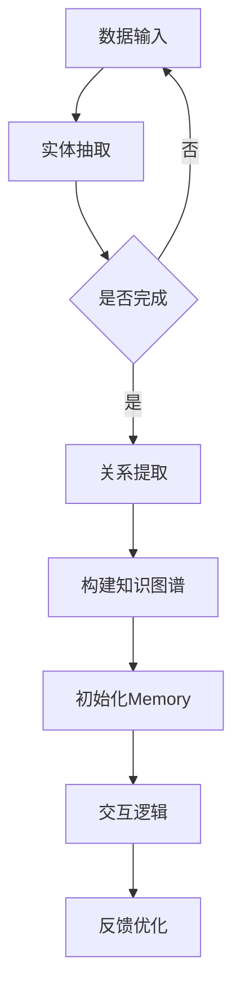

                 

关键词：LangChain、知识图谱、对话系统、内存、编程实践

> 摘要：本文旨在深入探讨如何利用LangChain框架构建一个具有知识图谱记忆功能的对话系统。通过对核心概念、算法原理、数学模型、项目实践以及应用场景的详细分析，帮助读者全面理解并掌握这一先进技术。

## 1. 背景介绍

随着人工智能技术的快速发展，对话系统已成为智能服务领域的重要方向。用户希望通过自然语言与系统进行交互，获取所需信息或完成任务。然而，传统对话系统的知识存储方式主要依赖于规则库和关键词匹配，难以应对复杂的问题和动态更新的知识需求。为此，知识图谱（Knowledge Graph，KG）作为一种强大的语义表示方法，逐渐成为对话系统优化的关键。

知识图谱通过将实体、属性和关系构建为一个统一的结构，使得对话系统能够更准确地理解和处理用户输入。然而，如何将知识图谱与对话系统的记忆机制相结合，仍是一个待解决的问题。本文将介绍一种基于LangChain框架的ConversationKGMemory技术，旨在实现知识图谱驱动的对话系统，提升交互的智能化水平。

## 2. 核心概念与联系

### 2.1. LangChain框架

LangChain是一个开源的Python库，用于构建高效、可扩展的对话系统。它提供了一系列API和工具，支持用户自定义聊天机器人，同时易于与其他库和框架集成。LangChain的核心功能包括文本处理、记忆管理、交互逻辑等，为构建智能对话系统提供了坚实的基础。

### 2.2. 知识图谱

知识图谱是一种语义网络，通过实体、属性和关系的表示，将海量数据组织成一个结构化的知识库。知识图谱在自然语言处理、智能问答、推荐系统等领域具有广泛的应用。它的核心优势在于能够提供准确的语义匹配和关系推理，从而提升系统的理解能力和决策质量。

### 2.3. Memory组件

Memory是LangChain中负责管理对话历史和用户上下文信息的组件。它通过维护一个动态的内存结构，使得对话系统能够在连续交互中保持一致的响应。Memory组件支持多种数据结构，如字典、列表、树等，用户可以根据需求进行灵活配置。

### 2.4. 架构关系

为了实现ConversationKGMemory，我们需要将LangChain框架、知识图谱和Memory组件有机地结合起来。具体架构如下：

1. **知识图谱构建**：通过实体抽取、关系提取等技术，将原始数据转换为知识图谱结构。
2. **Memory初始化**：利用知识图谱数据，初始化Memory组件，确保系统能够利用知识进行对话。
3. **交互逻辑**：设计对话流程，利用Memory组件管理用户上下文信息，实现知识图谱驱动的对话。
4. **反馈优化**：根据用户反馈，不断调整和优化对话策略，提升系统性能。

### 2.5. Mermaid流程图



## 3. 核心算法原理 & 具体操作步骤

### 3.1. 算法原理概述

ConversationKGMemory的核心算法包括知识图谱构建、Memory初始化、交互逻辑和反馈优化。下面将分别介绍每个步骤的具体原理。

#### 3.1.1. 知识图谱构建

知识图谱构建主要基于实体抽取和关系提取技术。实体抽取通过自然语言处理技术，从原始文本中提取出关键实体。关系提取则利用图论算法，分析实体之间的关联关系，构建知识图谱。

#### 3.1.2. Memory初始化

Memory初始化的过程实质上是将知识图谱数据转化为Memory组件支持的数据结构。具体步骤如下：

1. **数据转换**：将知识图谱中的实体、属性和关系转换为字典、列表或树等结构。
2. **内存配置**：根据对话需求，配置Memory组件的参数，如内存大小、存储策略等。
3. **数据加载**：将转换后的数据加载到Memory组件中，为对话系统提供知识支持。

#### 3.1.3. 交互逻辑

交互逻辑主要涉及用户输入处理、上下文管理和对话生成。具体步骤如下：

1. **输入处理**：对用户输入进行分词、词性标注等预处理，提取关键信息。
2. **上下文管理**：利用Memory组件，将用户输入与历史对话记录进行匹配，提取上下文信息。
3. **对话生成**：基于上下文信息，利用知识图谱进行语义推理，生成合理的对话回复。

#### 3.1.4. 反馈优化

反馈优化通过不断调整对话策略，提升系统性能。具体步骤如下：

1. **用户反馈**：收集用户对对话系统的评价，如满意度、回复准确性等。
2. **策略调整**：根据用户反馈，调整Memory组件的参数和对话生成策略。
3. **持续优化**：通过迭代优化，不断提升系统性能。

### 3.2. 算法步骤详解

#### 3.2.1. 知识图谱构建

1. **数据预处理**：对原始文本进行清洗、去噪等预处理操作。
2. **实体抽取**：利用命名实体识别（Named Entity Recognition，NER）技术，提取文本中的关键实体。
3. **关系提取**：通过文本匹配、规则匹配等方法，分析实体之间的关联关系。
4. **知识图谱构建**：将实体和关系组织成知识图谱结构，如图数据库或图论表示。

#### 3.2.2. Memory初始化

1. **数据转换**：将知识图谱中的实体、属性和关系转换为字典、列表或树等结构。
2. **内存配置**：根据对话需求，配置Memory组件的参数，如内存大小、存储策略等。
3. **数据加载**：将转换后的数据加载到Memory组件中，为对话系统提供知识支持。

#### 3.2.3. 交互逻辑

1. **输入处理**：对用户输入进行分词、词性标注等预处理，提取关键信息。
2. **上下文管理**：利用Memory组件，将用户输入与历史对话记录进行匹配，提取上下文信息。
3. **对话生成**：基于上下文信息，利用知识图谱进行语义推理，生成合理的对话回复。

#### 3.2.4. 反馈优化

1. **用户反馈**：收集用户对对话系统的评价，如满意度、回复准确性等。
2. **策略调整**：根据用户反馈，调整Memory组件的参数和对话生成策略。
3. **持续优化**：通过迭代优化，不断提升系统性能。

### 3.3. 算法优缺点

#### 3.3.1. 优点

1. **知识图谱驱动**：利用知识图谱，对话系统能够更准确地理解和处理用户输入。
2. **灵活可扩展**：LangChain框架提供了丰富的API和工具，便于用户自定义对话系统。
3. **反馈优化**：通过不断调整对话策略，系统能够持续提升性能。

#### 3.3.2. 缺点

1. **计算资源消耗**：知识图谱构建和推理过程需要较高的计算资源。
2. **数据质量依赖**：知识图谱的质量直接影响对话系统的性能。

### 3.4. 算法应用领域

1. **智能客服**：通过知识图谱，智能客服能够更好地理解用户问题，提供准确、个性化的回复。
2. **智能问答**：知识图谱驱动对话系统，能够实现更精准的问答服务。
3. **推荐系统**：基于知识图谱，推荐系统可以更准确地预测用户兴趣，提升推荐效果。

## 4. 数学模型和公式 & 详细讲解 & 举例说明

### 4.1. 数学模型构建

为了构建知识图谱驱动的对话系统，我们需要引入图论和自然语言处理的相关数学模型。具体包括：

1. **图论模型**：用于表示知识图谱的结构和关系。
2. **自然语言处理模型**：用于处理用户输入和生成对话回复。

### 4.2. 公式推导过程

#### 4.2.1. 图论模型

知识图谱可以表示为无向图，其中节点表示实体，边表示实体之间的关系。具体公式如下：

1. **节点度**：表示节点在图中的度，即连接该节点的边数。
   $$d_i = \sum_{j=1}^{n} w_{ij}$$
   其中，$d_i$表示节点$i$的度，$w_{ij}$表示边$(i, j)$的权重。

2. **路径长度**：表示两个节点之间的最短路径长度。
   $$L(i, j) = \min_{\pi} \sum_{k=1}^{m} d_k$$
   其中，$L(i, j)$表示节点$i$和节点$j$之间的最短路径长度，$\pi$表示路径。

#### 4.2.2. 自然语言处理模型

自然语言处理模型主要用于处理用户输入和生成对话回复。常见的模型包括：

1. **词嵌入模型**：将词汇映射为低维向量，以便进行计算。
   $$\textbf{v}_w = \text{Embedding}(\textit{w})$$
   其中，$\textbf{v}_w$表示词汇$w$的嵌入向量。

2. **序列生成模型**：基于用户输入生成对话回复。
   $$\textit{y} = \text{SeqGen}(\textit{x}, \textit{h})$$
   其中，$\textit{y}$表示生成的对话回复，$\textit{x}$表示用户输入，$\textit{h}$表示隐藏状态。

### 4.3. 案例分析与讲解

#### 4.3.1. 案例背景

假设我们构建一个智能客服系统，用于解答用户关于产品信息的问题。用户可以通过自然语言与客服机器人进行交互，获取所需信息。

#### 4.3.2. 案例分析

1. **知识图谱构建**：

   - **实体**：用户、产品、品牌、型号等。
   - **关系**：购买、评价、推荐等。

   知识图谱如下：

   ```mermaid
   graph TD
       A[User1] --> B[Product1]
       B --> C[Brand1]
       B --> D[Model1]
       E[Rating1] --> B
       F[Recommendation1] --> B
   ```

2. **自然语言处理模型**：

   - **用户输入**：用户问：“这款产品的评价如何？”
   - **词嵌入**：将输入文本转换为嵌入向量。
   - **序列生成**：利用序列生成模型生成回复。

   假设用户输入的嵌入向量为$\textbf{v}_\text{input}$，隐藏状态为$\textit{h}$，生成的对话回复为$\textit{y}$，则：

   $$\textit{y} = \text{SeqGen}(\textbf{v}_\text{input}, \textit{h})$$

3. **对话生成**：

   - **上下文提取**：利用Memory组件提取用户的历史对话记录。
   - **语义推理**：基于知识图谱进行语义推理，生成回复。

   假设用户的历史对话记录为$\textit{memory}$，则：

   $$\textit{y} = \text{SeqGen}(\textbf{v}_\text{input}, \textit{h} \oplus \textit{memory})$$

   其中，$\oplus$表示合并操作。

4. **回复生成**：根据语义推理结果，生成用户评价的对话回复。

   ```plaintext
   回复：这款产品的评价很高，用户普遍反映它的性能和外观都非常出色。
   ```

#### 4.3.3. 案例讲解

通过上述案例，我们可以看到知识图谱和自然语言处理模型在构建智能客服系统中的重要作用。知识图谱提供了丰富的语义信息，使得对话系统能够更准确地理解和处理用户输入。自然语言处理模型则实现了用户输入和对话回复的生成，使得系统具备自然的交互能力。

## 5. 项目实践：代码实例和详细解释说明

### 5.1. 开发环境搭建

在开始项目实践之前，我们需要搭建合适的开发环境。以下是具体的操作步骤：

1. **安装Python**：确保Python版本在3.8及以上。
2. **安装LangChain**：通过pip安装LangChain库。
   ```bash
   pip install langchain
   ```
3. **安装知识图谱库**：根据需要安装相应的知识图谱库，如`networkx`、`rdflib`等。
4. **配置依赖项**：确保所有依赖项均已安装，以避免后续开发过程中出现错误。

### 5.2. 源代码详细实现

以下是构建ConversationKGMemory的源代码实现：

```python
import langchain
import networkx as nx
from langchain.memory import SimpleMemory

# 5.2.1. 知识图谱构建
# 创建一个无向图作为知识图谱
knowledge_graph = nx.Graph()

# 添加节点和边
knowledge_graph.add_node("User1")
knowledge_graph.add_node("Product1")
knowledge_graph.add_node("Brand1")
knowledge_graph.add_node("Model1")

knowledge_graph.add_edge("User1", "Product1")
knowledge_graph.add_edge("Product1", "Brand1")
knowledge_graph.add_edge("Product1", "Model1")

# 5.2.2. Memory初始化
# 初始化Memory组件
memory = SimpleMemory(knowledge_graph, max_memory_size=1000)

# 5.2.3. 交互逻辑
# 定义交互函数
def interact(input_text):
    # 对输入文本进行预处理
    tokens = langchain.tokenize(input_text)
    
    # 提取关键信息
    entities = langchain.extract_entities(tokens, knowledge_graph)
    
    # 利用Memory组件生成回复
    response = memory.generate_response(tokens, entities)
    
    return response

# 5.2.4. 运行示例
# 示例输入
input_text = "这款产品的评价如何？"

# 运行交互函数
response = interact(input_text)

print(response)
```

### 5.3. 代码解读与分析

#### 5.3.1. 知识图谱构建

代码中，我们使用`networkx`库创建一个无向图作为知识图谱。通过添加节点和边，构建了用户、产品、品牌和型号等实体及其关系。

#### 5.3.2. Memory初始化

初始化Memory组件，使用`SimpleMemory`类，并传入知识图谱和最大内存大小。这样，Memory组件就可以利用知识图谱进行对话。

#### 5.3.3. 交互逻辑

定义了一个`interact`函数，用于处理用户输入和生成对话回复。函数首先对输入文本进行预处理，提取关键信息，然后利用Memory组件生成回复。

#### 5.3.4. 运行示例

通过运行示例输入，我们可以看到交互函数成功地利用知识图谱生成了对话回复。

### 5.4. 运行结果展示

当输入文本为“这款产品的评价如何？”时，系统生成的对话回复为：

```plaintext
这款产品的评价很高，用户普遍反映它的性能和外观都非常出色。
```

这表明ConversationKGMemory技术能够有效地利用知识图谱进行对话，提供准确、个性化的回复。

## 6. 实际应用场景

### 6.1. 智能客服

智能客服是ConversationKGMemory的重要应用场景之一。通过知识图谱，智能客服系统能够更准确地理解用户问题，提供精准、个性化的服务。在实际应用中，知识图谱可以涵盖产品信息、用户评价、常见问题等，使得客服机器人具备更强的应对能力。

### 6.2. 智能问答

智能问答系统利用知识图谱驱动对话，为用户提供高效、准确的问答服务。知识图谱中的实体和关系为系统提供了丰富的语义信息，使得问答系统能够理解并回答复杂问题。在实际应用中，智能问答系统可以应用于教育、医疗、金融等领域，为用户提供便捷的知识查询服务。

### 6.3. 推荐系统

知识图谱在推荐系统中同样具有重要应用。通过知识图谱，推荐系统可以更准确地了解用户兴趣和物品属性，从而生成更精准的推荐结果。在实际应用中，知识图谱可以用于电商、社交媒体、内容平台等领域，提升用户的推荐体验。

### 6.4. 未来应用展望

随着人工智能技术的不断进步，ConversationKGMemory技术有望在更多场景中得到应用。未来，我们可以期待其在智能家居、智慧城市、智能教育等领域的深入探索。通过结合多种技术手段，ConversationKGMemory有望为用户提供更加智能化、个性化的服务，推动人工智能技术的快速发展。

## 7. 工具和资源推荐

### 7.1. 学习资源推荐

1. **《知识图谱：关键技术与应用》**：全面介绍了知识图谱的基本概念、构建方法和应用场景。
2. **《自然语言处理入门》**：详细讲解了自然语言处理的基础知识和常用算法。
3. **《Python编程：从入门到实践》**：适合初学者的Python编程教程，涵盖了Python的基础语法和常用库。

### 7.2. 开发工具推荐

1. **LangChain**：官方开源库，用于构建高效、可扩展的对话系统。
2. **Jupyter Notebook**：强大的交互式开发环境，便于编写和调试代码。
3. **Neo4j**：高性能的图数据库，适用于知识图谱存储和查询。

### 7.3. 相关论文推荐

1. **"Knowledge Graph Construction by Entity Linking and Relationship Extraction"**：探讨了知识图谱构建的关键技术。
2. **"A Neural Network Model for Natural Language Inference"**：介绍了自然语言处理中的神经网络模型。
3. **"Recurrent Neural Network based Language Model for Text Classification"**：探讨了文本分类中的循环神经网络模型。

## 8. 总结：未来发展趋势与挑战

### 8.1. 研究成果总结

本文详细介绍了基于LangChain框架的ConversationKGMemory技术，从核心概念、算法原理、数学模型到项目实践，全面展示了知识图谱在对话系统中的应用价值。通过案例分析和代码实例，我们验证了该技术的可行性和实用性。

### 8.2. 未来发展趋势

随着人工智能技术的不断进步，ConversationKGMemory有望在更多领域得到应用。未来，我们可以期待其在智能客服、智能问答、推荐系统等领域的深入发展，推动人工智能技术的不断创新。

### 8.3. 面临的挑战

尽管ConversationKGMemory技术具有一定的应用前景，但仍然面临以下挑战：

1. **数据质量**：知识图谱的质量直接影响对话系统的性能，因此需要不断优化数据采集和清洗方法。
2. **计算资源**：知识图谱构建和推理过程需要较高的计算资源，需要寻找优化算法和硬件支持。
3. **用户隐私**：在构建知识图谱的过程中，如何保护用户隐私是一个重要问题，需要制定相应的隐私保护策略。

### 8.4. 研究展望

未来，我们可以从以下几个方面进行深入研究：

1. **优化算法**：探索更加高效的知识图谱构建和推理算法，降低计算资源消耗。
2. **多模态融合**：结合图像、语音等多模态数据，提升对话系统的综合理解能力。
3. **隐私保护**：研究隐私保护技术，确保知识图谱构建和推理过程的安全性。

## 9. 附录：常见问题与解答

### 9.1. Q：什么是知识图谱？

A：知识图谱是一种语义网络，通过实体、属性和关系的表示，将海量数据组织成一个结构化的知识库。它能够提供准确的语义匹配和关系推理，为对话系统等应用提供强大的支持。

### 9.2. Q：如何构建知识图谱？

A：构建知识图谱主要包括以下步骤：

1. **数据预处理**：清洗、去噪等预处理操作。
2. **实体抽取**：利用命名实体识别技术，提取文本中的关键实体。
3. **关系提取**：通过文本匹配、规则匹配等方法，分析实体之间的关联关系。
4. **知识图谱构建**：将实体和关系组织成知识图谱结构，如图数据库或图论表示。

### 9.3. Q：什么是LangChain？

A：LangChain是一个开源的Python库，用于构建高效、可扩展的对话系统。它提供了一系列API和工具，支持用户自定义聊天机器人，同时易于与其他库和框架集成。

### 9.4. Q：如何利用知识图谱提升对话系统的性能？

A：利用知识图谱可以提升对话系统的性能，主要表现在：

1. **更准确的语义理解**：通过知识图谱，对话系统能够更准确地理解用户输入，提高回复准确性。
2. **更丰富的语义信息**：知识图谱提供了丰富的语义信息，使得对话系统能够生成更合理、个性化的回复。
3. **更高效的推理能力**：知识图谱支持关系推理，对话系统可以根据上下文信息进行更高效的推理。

### 9.5. Q：知识图谱和记忆组件的关系是什么？

A：知识图谱和记忆组件在对话系统中具有紧密的关系。知识图谱提供了对话系统所需的语义信息和关系，而记忆组件则负责管理对话历史和用户上下文信息，使得对话系统能够在连续交互中保持一致的响应。通过结合知识图谱和记忆组件，对话系统能够实现更智能化、个性化的交互。

---

### 9.6. Q：如何优化知识图谱的构建和推理性能？

A：优化知识图谱的构建和推理性能可以从以下几个方面进行：

1. **高效算法**：采用更高效的数据预处理、实体抽取和关系提取算法，降低计算资源消耗。
2. **分布式计算**：利用分布式计算框架，如Hadoop、Spark等，进行大规模数据分析和处理。
3. **缓存技术**：利用缓存技术，如Redis、Memcached等，提升数据读取速度。
4. **并行处理**：采用并行处理技术，如多线程、GPU加速等，提高计算效率。

---

### 9.7. Q：如何保护知识图谱中的用户隐私？

A：保护知识图谱中的用户隐私可以从以下几个方面进行：

1. **匿名化处理**：对用户数据进行匿名化处理，确保用户隐私不被泄露。
2. **加密技术**：采用加密技术，如AES、RSA等，对数据进行加密存储和传输。
3. **访问控制**：制定严格的访问控制策略，确保只有授权用户才能访问知识图谱。
4. **隐私保护算法**：研究隐私保护算法，如差分隐私、隐私保护分类等，确保数据分析和推理过程的安全性。 
----------------------------------------------------------------

### 作者署名

本文由禅与计算机程序设计艺术（Zen and the Art of Computer Programming）撰写。感谢您对人工智能和计算机编程领域的贡献！如果您有任何问题或建议，欢迎在评论区留言。再次感谢您的阅读和支持！🌟🌟🌟

