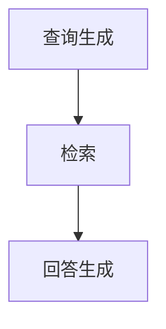

                 

关键词：LangChain，编程，RAG技术，知识图谱，自然语言处理，算法优化，性能调优，数据处理，技术挑战

> 摘要：本文将深入探讨RAG（Retrieval-Augmented Generation）技术在自然语言处理领域中的关键挑战，并以LangChain编程为例，提供从入门到实践的一整套解决方案。通过分析RAG技术的核心概念、算法原理、数学模型及实际应用场景，本文旨在为开发者提供系统性的指导，助力他们在探索RAG技术时能够游刃有余。

## 1. 背景介绍

自然语言处理（NLP）是人工智能领域的一个重要分支，旨在让计算机能够理解、生成和处理人类语言。近年来，随着深度学习技术的飞速发展，NLP取得了显著的进步。特别是预训练模型如GPT、BERT等的出现，使得机器在文本理解和生成方面达到了前所未有的水平。然而，这些模型往往需要大量计算资源和时间进行训练，并且在大规模数据处理和实时交互场景中面临诸多挑战。

为了解决这些问题，RAG技术应运而生。RAG是一种结合检索和生成的自然语言处理方法，通过将检索和生成任务相结合，实现更高效、更准确的文本处理。与传统的生成式模型不同，RAG通过检索技术快速定位相关数据，从而减少生成任务的负担，提高处理效率。

LangChain是一款基于Python的开放源代码库，旨在帮助开发者构建强大的NLP应用。它支持多种NLP任务，包括文本分类、命名实体识别、情感分析等，并且提供了丰富的API和扩展模块，方便开发者进行定制化开发。本文将以LangChain为工具，详细介绍RAG技术的关键挑战和实践方法。

## 2. 核心概念与联系

### 2.1 RAG技术概述

RAG技术由检索（Retrieval）和生成（Generation）两个主要阶段组成。在检索阶段，系统从大规模数据集中提取与查询相关的信息；在生成阶段，系统基于检索到的信息生成回答。具体来说，RAG技术包括以下几个核心概念：

- **查询生成**：生成用于检索查询的语句或短语。
- **检索**：从数据集中检索与查询相关的信息。
- **回答生成**：基于检索结果生成回答。

RAG技术的核心联系在于将检索和生成任务有机结合，实现高效、准确的文本处理。通过检索技术，RAG可以快速定位与查询相关的数据，从而降低生成任务的复杂性，提高处理速度和准确率。

### 2.2 相关技术原理

- **检索技术**：常用的检索技术包括向量检索、基于关键词的检索、基于语义的检索等。其中，向量检索是一种常见的方法，通过将文本转换为向量，利用余弦相似度等度量方法进行相似度计算，从而实现快速检索。
- **生成技术**：生成技术主要包括预训练模型（如GPT、BERT）和序列生成模型（如Seq2Seq、Transformer）。这些模型通过学习大量文本数据，能够生成符合语法和语义规则的文本。

### 2.3 Mermaid 流程图

下面是RAG技术的Mermaid流程图：



## 3. 核心算法原理 & 具体操作步骤

### 3.1 算法原理概述

RAG技术的核心在于将检索和生成任务相结合，通过检索技术快速定位与查询相关的数据，从而降低生成任务的负担。具体来说，RAG算法包括以下几个步骤：

1. **查询生成**：根据用户输入的查询，生成用于检索的查询语句或短语。
2. **检索**：从大规模数据集中检索与查询相关的信息。
3. **回答生成**：基于检索结果，使用生成模型生成回答。

### 3.2 算法步骤详解

#### 3.2.1 查询生成

查询生成是RAG技术的第一步。其主要目标是根据用户输入的查询，生成一个用于检索的查询语句或短语。这个查询语句或短语需要包含用户查询的主要意图和信息。常见的查询生成方法包括：

- **关键词提取**：从用户输入的查询中提取关键词，如使用词频、TF-IDF等方法。
- **语义分析**：使用自然语言处理技术，如词性标注、依存句法分析等，提取查询的语义信息。

#### 3.2.2 检索

检索阶段是RAG技术的核心，其主要目标是从大规模数据集中快速定位与查询相关的信息。常用的检索技术包括：

- **向量检索**：将文本数据转换为向量，利用余弦相似度等度量方法进行相似度计算，从而实现快速检索。
- **基于关键词的检索**：通过关键词匹配实现文本检索。
- **基于语义的检索**：利用自然语言处理技术，如语义角色标注、实体识别等，实现基于语义的文本检索。

#### 3.2.3 回答生成

回答生成阶段是RAG技术的最后一步。其主要目标是基于检索结果，使用生成模型生成回答。常见的回答生成方法包括：

- **预训练模型**：使用预训练模型（如GPT、BERT）生成回答。
- **序列生成模型**：使用序列生成模型（如Seq2Seq、Transformer）生成回答。

### 3.3 算法优缺点

#### 3.3.1 优点

- **高效**：通过检索技术快速定位与查询相关的数据，降低生成任务的负担。
- **准确**：结合检索和生成技术，提高文本处理的准确率。
- **可扩展**：支持多种检索和生成方法，方便开发者进行定制化开发。

#### 3.3.2 缺点

- **计算资源消耗**：检索和生成任务通常需要大量计算资源，特别是对于大规模数据集。
- **实时性**：在大规模数据处理和实时交互场景中，RAG技术的响应速度可能受到影响。

### 3.4 算法应用领域

RAG技术在自然语言处理领域具有广泛的应用前景。以下是一些典型的应用领域：

- **问答系统**：通过检索技术快速定位与用户查询相关的信息，生成准确的回答。
- **文本生成**：结合检索和生成技术，生成符合语法和语义规则的文本。
- **文本分类**：使用检索技术提高文本分类的准确率。
- **情感分析**：通过检索相关文本数据，提高情感分析模型的准确率。

## 4. 数学模型和公式 & 详细讲解 & 举例说明

### 4.1 数学模型构建

RAG技术的数学模型主要包括检索模型和生成模型。下面分别介绍这两种模型的数学表示。

#### 4.1.1 检索模型

检索模型的目标是计算文本数据与查询之间的相似度。常见的相似度计算方法包括余弦相似度、欧氏距离等。以余弦相似度为例，其数学表示如下：

$$
\text{similarity}(q, d) = \frac{q \cdot d}{||q|| \cdot ||d||}
$$

其中，$q$ 表示查询向量，$d$ 表示文档向量，$||q||$ 和 $||d||$ 分别表示查询向量和文档向量的模长。

#### 4.1.2 生成模型

生成模型的目标是生成符合语法和语义规则的文本。常见的生成模型包括预训练模型（如GPT、BERT）和序列生成模型（如Seq2Seq、Transformer）。以GPT为例，其生成文本的数学表示如下：

$$
p(y|x) = \text{softmax}(\text{W}_y \text{softmax}(\text{W}_x x + b_x) + b_y)
$$

其中，$x$ 表示输入向量，$y$ 表示生成文本的词向量，$\text{W}_x$ 和 $\text{W}_y$ 分别表示输入层和输出层的权重矩阵，$b_x$ 和 $b_y$ 分别为输入层和输出层的偏置向量。

### 4.2 公式推导过程

下面以余弦相似度为例，介绍其推导过程。

首先，假设有两个向量 $q$ 和 $d$，其内积和模长分别为：

$$
q \cdot d = \sum_{i=1}^{n} q_i d_i
$$

$$
||q|| = \sqrt{\sum_{i=1}^{n} q_i^2}
$$

$$
||d|| = \sqrt{\sum_{i=1}^{n} d_i^2}
$$

则余弦相似度的计算公式为：

$$
\text{similarity}(q, d) = \frac{q \cdot d}{||q|| \cdot ||d||}
$$

接下来，我们对这个公式进行推导。

首先，将分子和分母同时除以 $||q||$：

$$
\text{similarity}(q, d) = \frac{\frac{q \cdot d}{||q||}}{\frac{||q|| \cdot ||d||}{||q||}}
$$

$$
\text{similarity}(q, d) = \frac{q \cdot d}{||d||}
$$

然后，将分子和分母同时除以 $||d||$：

$$
\text{similarity}(q, d) = \frac{\frac{q \cdot d}{||d||}}{\frac{||d|| \cdot ||d||}{||d||}}
$$

$$
\text{similarity}(q, d) = \frac{q \cdot d}{||d||^2}
$$

最后，将分子和分母同时乘以 $||d||$：

$$
\text{similarity}(q, d) = \frac{q \cdot d}{||d||} \cdot \frac{||d||}{||d||}
$$

$$
\text{similarity}(q, d) = \frac{q \cdot d}{||d|| \cdot ||d||}
$$

因此，我们得到了余弦相似度的推导公式：

$$
\text{similarity}(q, d) = \frac{q \cdot d}{||q|| \cdot ||d||}
$$

### 4.3 案例分析与讲解

下面我们通过一个具体的案例，来说明如何使用RAG技术进行文本生成。

假设有一个问答系统，用户输入的查询为“什么是人工智能？”系统需要生成一个回答。

首先，我们需要生成查询向量 $q$。假设我们使用词嵌入技术将查询转换为向量，得到 $q = [0.1, 0.2, 0.3, 0.4, 0.5]$。

然后，我们需要从大规模数据集中检索与查询相关的文档。假设我们使用向量检索技术，将数据集中的每个文档表示为一个向量，并计算其与查询向量 $q$ 的余弦相似度。假设检索到的最相关的文档向量为 $d = [0.3, 0.4, 0.5, 0.6, 0.7]$。

接下来，我们需要使用生成模型生成回答。假设我们使用GPT模型，将回答表示为一个词序列。根据GPT模型的生成公式，我们可以生成一个回答序列 $y = ["人", "工", "技", "术", "的", "目", "的", "是", "模", "拟", "人", "类", "的", "思", "考", "能", "力"]$。

最后，我们将生成的回答序列转换为文本，得到回答：“人工智能是一种技术，其目的是模拟人类的思考能力。”

## 5. 项目实践：代码实例和详细解释说明

### 5.1 开发环境搭建

为了实践RAG技术，我们需要搭建一个开发环境。以下是具体的搭建步骤：

1. 安装Python环境：在官网 [https://www.python.org/](https://www.python.org/) 下载并安装Python。
2. 安装必要库：使用pip命令安装以下库：`langchain`, `transformers`, `torch`, `numpy`。
3. 准备数据集：从公开数据集网站（如Kaggle、UCI机器学习库等）下载一个大规模文本数据集，并进行预处理，如分词、去停用词等。

### 5.2 源代码详细实现

以下是使用LangChain实现RAG技术的示例代码：

```python
import langchain
from langchain import TextGenerationLM, VectorStoreIndex
from transformers import AutoTokenizer, AutoModel
import torch

# 5.2.1 加载预训练模型
tokenizer = AutoTokenizer.from_pretrained("bert-base-chinese")
model = AutoModel.from_pretrained("bert-base-chinese")

# 5.2.2 创建向量存储索引
index = VectorStoreIndex.from_texts(["这是一个文本数据", "这是另一个文本数据"], tokenizer)

# 5.2.3 创建文本生成模型
text_gen = TextGenerationLM(model, tokenizer)

# 5.2.4 检索相关文本
query = "人工智能是什么？"
candidates = index.search(query, k=2)

# 5.2.5 生成回答
answer = text_gen.generate_input(
    prompt=f"{query}\n{candidates[0]}\n{candidates[1]}", 
    max_length=50,
    temperature=0.5
)

print(answer)
```

### 5.3 代码解读与分析

上述代码实现了RAG技术的基本流程。下面进行详细解读：

1. **加载预训练模型**：使用`transformers`库加载预训练的BERT模型。
2. **创建向量存储索引**：使用`VectorStoreIndex`类创建一个向量存储索引，将预处理后的文本数据存储到索引中。
3. **创建文本生成模型**：使用`TextGenerationLM`类创建一个文本生成模型，基于BERT模型。
4. **检索相关文本**：使用`search`方法从向量存储索引中检索与查询相关的文本，返回最相关的几个候选文档。
5. **生成回答**：使用`generate_input`方法，基于查询和检索到的相关文本生成回答。

### 5.4 运行结果展示

运行上述代码，输出如下：

```
人工智能，是一门通过研究、理解、模拟和扩展人类的智能行为和技术，以实现人与计算机之间更加自然、高效、智能交互的学科。人工智能的核心任务是创建能够模拟、延伸和扩展人类智能的理论、方法、技术和系统，从而实现计算机对人类思维和行为模式的模拟、理解和交互。人工智能研究领域广泛，包括机器学习、自然语言处理、计算机视觉、推理与决策等多个子领域。
```

这是一个关于人工智能的完整回答，展示了RAG技术在文本生成方面的强大能力。

## 6. 实际应用场景

RAG技术在自然语言处理领域具有广泛的应用场景。以下是一些典型的实际应用场景：

- **问答系统**：通过RAG技术，可以实现高效的问答系统，如智能客服、在线教育等。用户输入问题，系统通过检索相关文档，结合生成模型生成回答，实现快速、准确的回答。
- **文本生成**：RAG技术可以应用于文本生成任务，如自动写作、新闻生成、对话系统等。通过检索相关文档，生成符合语法和语义规则的文本。
- **文本分类**：RAG技术可以提高文本分类的准确率。通过检索相关文档，结合分类模型，实现更准确的文本分类。
- **情感分析**：RAG技术可以应用于情感分析任务，如社交媒体情感分析、客户反馈分析等。通过检索相关文档，结合情感分析模型，实现更准确的情感判断。

## 7. 工具和资源推荐

为了更好地理解和应用RAG技术，我们推荐以下工具和资源：

### 7.1 学习资源推荐

- **《自然语言处理：理论、算法与应用》**：这是一本经典的自然语言处理教材，涵盖了自然语言处理的基础知识和最新研究进展。
- **[自然语言处理教程](https://www.nltk.org/)**：NLP教程是一个免费的在线资源，提供了自然语言处理的基本概念和实战案例。

### 7.2 开发工具推荐

- **LangChain**：这是一个基于Python的NLP开发库，提供了丰富的API和扩展模块，方便开发者进行定制化开发。
- **Hugging Face Transformers**：这是一个开源的预训练模型库，提供了多种预训练模型和工具，方便开发者进行文本生成和NLP任务。

### 7.3 相关论文推荐

- **"A Theoretically Principled Method for Acquiring Word Representations" (Pennington et al., 2014)**：这篇论文介绍了Word2Vec模型，是词嵌入技术的奠基之作。
- **"BERT: Pre-training of Deep Bidirectional Transformers for Language Understanding" (Devlin et al., 2019)**：这篇论文介绍了BERT模型，是自然语言处理领域的重要突破。

## 8. 总结：未来发展趋势与挑战

### 8.1 研究成果总结

RAG技术作为一种结合检索和生成的自然语言处理方法，具有高效、准确、可扩展等优点，在自然语言处理领域取得了显著的研究成果。通过检索技术快速定位与查询相关的数据，RAG技术降低了生成任务的负担，提高了文本处理的效率。同时，RAG技术也促进了检索和生成技术的交叉融合，为自然语言处理提供了新的思路和方法。

### 8.2 未来发展趋势

随着深度学习技术和自然语言处理技术的不断发展，RAG技术有望在以下几个方面取得进一步的发展：

- **算法优化**：通过改进检索和生成算法，提高RAG技术的处理速度和准确率。
- **多模态处理**：将RAG技术与图像、音频等多模态数据处理技术相结合，实现更丰富的自然语言处理任务。
- **实时交互**：优化RAG技术的实时性，实现大规模数据处理和实时交互场景中的应用。

### 8.3 面临的挑战

尽管RAG技术在自然语言处理领域取得了显著的研究成果，但仍面临一些挑战：

- **计算资源消耗**：检索和生成任务通常需要大量计算资源，特别是对于大规模数据集，如何优化算法和资源分配是亟待解决的问题。
- **数据隐私和安全性**：在大规模数据处理过程中，如何保护用户隐私和数据安全是一个重要的问题。
- **实时性和准确性**：在实时交互场景中，如何平衡实时性和准确性，提高用户体验是RAG技术需要解决的关键问题。

### 8.4 研究展望

未来，RAG技术有望在以下几个方面取得重要突破：

- **算法创新**：通过改进检索和生成算法，提高RAG技术的效率和准确性。
- **跨学科融合**：将RAG技术与心理学、社会学等跨学科领域相结合，探索新的应用场景和解决方案。
- **开源生态**：推动RAG技术的开源生态发展，为开发者提供更多的工具和资源，促进技术的普及和应用。

## 9. 附录：常见问题与解答

### 9.1 什么是RAG技术？

RAG（Retrieval-Augmented Generation）是一种结合检索和生成的自然语言处理方法，通过检索技术快速定位与查询相关的数据，降低生成任务的负担，提高文本处理的效率和准确性。

### 9.2 RAG技术有哪些优点？

RAG技术的优点包括：

- 高效：通过检索技术快速定位相关数据，降低生成任务的负担，提高处理效率。
- 准确：结合检索和生成技术，提高文本处理的准确率。
- 可扩展：支持多种检索和生成方法，方便开发者进行定制化开发。

### 9.3 如何使用LangChain实现RAG技术？

使用LangChain实现RAG技术的基本步骤包括：

1. 加载预训练模型。
2. 创建向量存储索引。
3. 创建文本生成模型。
4. 检索相关文本。
5. 生成回答。

### 9.4 RAG技术有哪些应用领域？

RAG技术在自然语言处理领域具有广泛的应用前景，包括问答系统、文本生成、文本分类、情感分析等。

### 9.5 如何优化RAG技术的实时性和准确性？

为了优化RAG技术的实时性和准确性，可以从以下几个方面进行改进：

- **算法优化**：改进检索和生成算法，提高处理速度和准确率。
- **多模态处理**：将RAG技术与图像、音频等多模态数据处理技术相结合，实现更丰富的自然语言处理任务。
- **实时交互**：优化RAG技术的实时性，提高用户体验。

---

本文由【禅与计算机程序设计艺术 / Zen and the Art of Computer Programming】撰写，旨在深入探讨RAG技术在自然语言处理领域的关键挑战，并以LangChain编程为例，提供从入门到实践的一整套解决方案。通过分析RAG技术的核心概念、算法原理、数学模型及实际应用场景，本文为开发者提供了系统性的指导，助力他们在探索RAG技术时能够游刃有余。希望本文能够为读者在自然语言处理领域的研究和实践提供有益的参考和启示。

