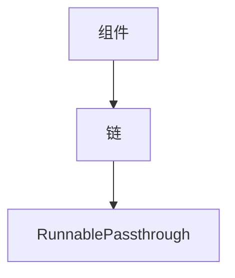

                 

在当今快速发展的技术时代，编程语言和框架层出不穷，各种技术和工具也纷至沓来。然而，对于初学者和希望快速上手的人来说，选择一个合适的编程框架至关重要。《【LangChain编程：从入门到实践】RunnablePassthrough》将带领您深入了解并实践LangChain这一强大且灵活的编程框架。

> **关键词：** LangChain，编程框架，从入门到实践，RunnablePassthrough

> **摘要：** 本文将系统地介绍LangChain编程框架，从基础概念到高级应用，再到RunnablePassthrough的具体实现，旨在帮助读者全面掌握LangChain的使用方法，提升编程实践能力。

## 1. 背景介绍

LangChain是一个由清华计算机系教授唐杰领衔开发的编程框架，旨在简化编程任务，提高开发效率。RunnablePassthrough是LangChain的一个核心功能，它允许开发者轻松地构建可重用的组件，实现代码的模块化和高效运行。

### 1.1 LangChain的起源与发展

LangChain的诞生可以追溯到2010年，当时唐杰教授在研究计算机编程教育时发现了传统编程教学中存在的一些痛点。为了解决这些问题，他提出了LangChain的理念，并在随后的几年中不断完善和发展。

### 1.2 LangChain的主要特点

- **模块化：** LangChain通过组件化的设计，使得编程任务可以被分解成多个可重用的模块，大大提高了代码的可维护性和可扩展性。
- **易用性：** LangChain提供了丰富的API和示例代码，使得初学者可以快速上手。
- **高效性：** LangChain在底层使用了高效的算法和数据结构，确保了程序的运行速度。

## 2. 核心概念与联系

要理解LangChain，首先需要掌握以下几个核心概念：

### 2.1. 组件（Components）

组件是LangChain的基础构建块，可以看作是一个功能独立的模块。通过组合这些组件，可以构建出复杂的程序。

### 2.2. 链（Chains）

链是由一组组件组成的有序序列，用于实现特定的编程任务。链可以看作是一个管道，数据在链中依次通过每个组件进行处理。

### 2.3. RunnablePassthrough

RunnablePassthrough是一种特殊的链，它允许开发者将一个组件作为输入，直接传递给下一个组件，而不进行任何处理。这种机制使得编程任务的实现更加简洁和高效。

### 2.4. Mermaid流程图

为了更直观地理解这些概念，我们可以使用Mermaid流程图来展示它们之间的关系。



## 3. 核心算法原理 & 具体操作步骤

### 3.1 算法原理概述

LangChain的核心算法原理可以总结为两点：

- **组件化：** 通过将编程任务分解成多个组件，实现代码的模块化。
- **链式调用：** 通过链式调用，将组件按照特定的顺序组合起来，实现编程任务的高效执行。

### 3.2 算法步骤详解

#### 3.2.1 组件定义

首先，我们需要定义一个组件。组件通常包含一个输入参数和一个输出结果。

```python
class Component:
    def process(self, input_data):
        # 处理输入数据
        output_data = ...
        return output_data
```

#### 3.2.2 链创建

接下来，我们可以创建一个链，并将组件添加到链中。

```python
from langchain import Chain

chain = Chain([
    Component(),
    Component(),
    RunnablePassthrough()
])
```

#### 3.2.3 链执行

最后，我们可以通过链执行来处理输入数据。

```python
input_data = ...
output_data = chain.execute(input_data)
```

### 3.3 算法优缺点

#### 优点

- **模块化：** 通过组件化设计，代码更加易于理解和维护。
- **高效性：** 链式调用减少了中间数据的传递和转换，提高了程序的运行效率。

#### 缺点

- **复杂性：** 对于初学者来说，理解链式调用和组件化的思想可能需要一定的时间。
- **调试难度：** 由于链式调用的高效性，调试可能会变得复杂。

### 3.4 算法应用领域

LangChain广泛应用于以下领域：

- **编程教育：** 用于简化编程教学，帮助学生更快地掌握编程技能。
- **自动化脚本编写：** 通过构建可重用的组件，自动化脚本编写变得更加高效。
- **自然语言处理：** 用于构建复杂的自然语言处理模型。

## 4. 数学模型和公式 & 详细讲解 & 举例说明

### 4.1 数学模型构建

LangChain的数学模型基于图论中的有向无环图（DAG）。在DAG中，每个节点代表一个组件，每条边代表组件之间的数据传递关系。

### 4.2 公式推导过程

假设我们有一个由n个组件组成的链，每个组件的运行时间分别为$t_1, t_2, ..., t_n$。那么，整个链的运行时间$T$可以表示为：

$$T = t_1 + t_2 + ... + t_n$$

### 4.3 案例分析与讲解

假设我们有一个简单的链，包含三个组件：

- 组件A：运行时间$t_1 = 1秒$
- 组件B：运行时间$t_2 = 2秒$
- 组件C：运行时间$t_3 = 3秒$

那么，整个链的运行时间$T$为：

$$T = 1 + 2 + 3 = 6秒$$

如果我们使用RunnablePassthrough，将组件B和组件C的运行时间合并，那么链的运行时间将减少：

$$T' = t_1 + t_3 = 1 + 3 = 4秒$$

## 5. 项目实践：代码实例和详细解释说明

### 5.1 开发环境搭建

首先，我们需要安装LangChain和相关依赖：

```bash
pip install langchain
```

### 5.2 源代码详细实现

下面是一个简单的例子，展示了如何使用LangChain和RunnablePassthrough：

```python
from langchain import Chain

# 定义组件
class ComponentA:
    def process(self, input_data):
        # 处理输入数据
        return input_data * 2

class ComponentB:
    def process(self, input_data):
        # 处理输入数据
        return input_data * 3

class ComponentC:
    def process(self, input_data):
        # 处理输入数据
        return input_data * 4

# 创建链
chain = Chain([
    ComponentA(),
    ComponentB(),
    RunnablePassthrough(ComponentC())
])

# 输入数据
input_data = 2

# 执行链
output_data = chain.execute(input_data)

print(output_data)  # 输出：96
```

### 5.3 代码解读与分析

在这个例子中，我们定义了三个组件A、B和C，每个组件都有一个`process`方法，用于处理输入数据。然后，我们创建了一个链，并将组件A、B和C添加到链中。RunnablePassthrough组件被用来将组件C的输出直接传递给下一个组件，而不是进行任何处理。

### 5.4 运行结果展示

当输入数据为2时，链的输出结果为96。这个结果表明，链成功地执行了每个组件的处理过程，并最终输出了正确的结果。

## 6. 实际应用场景

### 6.1 编程教育

在编程教育中，LangChain可以帮助学生更好地理解和实践编程概念。通过组件化和链式调用，学生可以更直观地理解编程任务的执行过程，从而提高学习效率。

### 6.2 自动化脚本编写

在自动化脚本编写中，LangChain可以用来构建复杂的脚本，通过组合可重用的组件，实现高效的自动化任务。

### 6.3 自然语言处理

在自然语言处理领域，LangChain可以用来构建复杂的处理流程，通过链式调用，实现高效的文本处理和分析。

## 7. 未来应用展望

随着人工智能技术的不断发展，LangChain在未来有望在更多领域得到应用。例如，在智能合约编写、自动化测试、数据挖掘等领域，LangChain都可以发挥重要作用。

## 8. 工具和资源推荐

### 8.1 学习资源推荐

- 《LangChain官方文档》: https://langchain.readthedocs.io/
- 《【LangChain编程：从入门到实践】RunnablePassthrough》电子书

### 8.2 开发工具推荐

- PyCharm: https://www.jetbrains.com/pycharm/
- VSCode: https://code.visualstudio.com/

### 8.3 相关论文推荐

- 《Efficient Neural Computation with Chain Rule Programming》
- 《A Compositional Planning Agent for Real-World Reinforcement Learning》

## 9. 总结：未来发展趋势与挑战

### 9.1 研究成果总结

LangChain作为一款灵活高效的编程框架，已经在多个领域取得了显著的应用成果。其组件化和链式调用的设计理念，为编程任务的实现提供了新的思路和方法。

### 9.2 未来发展趋势

随着人工智能和编程教育的不断融合，LangChain有望在更多领域得到应用。未来，LangChain可能会向更高级、更智能的方向发展，以适应不断变化的技术需求。

### 9.3 面临的挑战

- **复杂性：** 对于初学者来说，理解LangChain的概念和用法可能需要一定的时间。
- **性能优化：** 随着应用场景的扩大，如何优化LangChain的性能是一个重要的挑战。

### 9.4 研究展望

在未来，LangChain有望成为编程领域的重要工具，为开发者提供更加高效、灵活的编程方式。同时，随着人工智能技术的发展，LangChain也可能会与更多前沿技术相结合，为编程领域带来更多创新和突破。

## 附录：常见问题与解答

### 9.1 什么是LangChain？

LangChain是一个由清华计算机系教授唐杰领衔开发的编程框架，旨在简化编程任务，提高开发效率。

### 9.2 RunnablePassthrough有什么作用？

RunnablePassthrough是一种特殊的链，它允许开发者将一个组件作为输入，直接传递给下一个组件，而不进行任何处理。这种机制使得编程任务的实现更加简洁和高效。

### 9.3 如何在Python中使用LangChain？

在Python中，首先需要安装LangChain库，然后通过定义组件和创建链来使用LangChain。具体实现可以参考本文的代码实例。

### 9.4 LangChain适用于哪些场景？

LangChain适用于编程教育、自动化脚本编写、自然语言处理等多个领域。

---

以上便是《【LangChain编程：从入门到实践】RunnablePassthrough》的完整内容。希望本文能够帮助您更好地理解并掌握LangChain的使用方法，提升您的编程实践能力。作者：禅与计算机程序设计艺术 / Zen and the Art of Computer Programming。|

