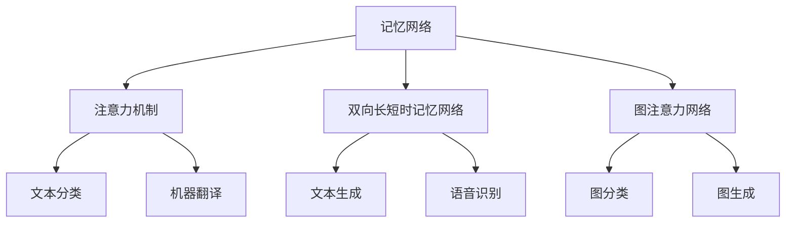

                 

关键词：LangChain，记忆组件，编程实践，算法应用，数学模型，项目实践，未来展望

摘要：本文将深入探讨 LangChain 编程中的记忆组件，通过结合不同记忆组件，实现更强大的数据处理和程序优化能力。我们将从背景介绍、核心概念与联系、核心算法原理、数学模型、项目实践、实际应用场景、工具和资源推荐、总结与展望等方面，全面解析 LangChain 编程的奥秘。

## 1. 背景介绍

LangChain 是一种基于深度学习的编程语言，旨在实现自然语言处理（NLP）任务的自动化。它通过将自然语言转化为程序代码，帮助开发者更高效地处理复杂的 NLP 任务。随着人工智能技术的快速发展，LangChain 在实际应用中表现出色，尤其在生成式 AI 领域，如文本生成、机器翻译、问答系统等。

然而，在处理复杂任务时，单一的记忆组件往往无法满足需求。因此，结合不同记忆组件，发挥各自优势，成为 LangChain 编程的关键。本文将详细介绍不同记忆组件的结合方法，以及如何在实际项目中应用这些方法。

## 2. 核心概念与联系

为了更好地理解 LangChain 编程中的记忆组件，我们首先需要了解一些核心概念。以下是 LangChain 中常见的记忆组件及其基本原理：

- **记忆网络（Memory Network）**：记忆网络是一种基于图神经网络的记忆组件，通过将数据存储在图中，实现快速、准确的查询。它适用于复杂的数据处理任务，如知识图谱构建、信息检索等。
- **注意力机制（Attention Mechanism）**：注意力机制是一种用于模型中处理序列数据的机制，通过学习每个序列元素的权重，实现对序列数据的自适应处理。它广泛应用于文本分类、机器翻译等任务。
- **双向长短时记忆网络（Bi-LSTM）**：双向长短时记忆网络是一种常用的序列模型，通过同时处理正向和反向序列信息，实现更准确的序列建模。它适用于文本生成、语音识别等任务。
- **图注意力网络（GAT）**：图注意力网络是一种基于图神经网络的模型，通过学习节点间的权重，实现对图数据的自适应处理。它适用于图分类、图生成等任务。

### 2.1 Mermaid 流程图

以下是一个简化的 Mermaid 流程图，展示了 LangChain 编程中的核心概念和它们之间的联系：



## 3. 核心算法原理 & 具体操作步骤

### 3.1 算法原理概述

结合不同记忆组件的 LangChain 编程，主要基于以下原理：

1. **数据预处理**：对输入数据进行预处理，如分词、去停用词等。
2. **记忆组件选择**：根据任务需求，选择合适的记忆组件，如记忆网络、注意力机制、双向长短时记忆网络等。
3. **模型训练**：利用训练数据，对记忆组件进行训练，学习输入数据和目标数据之间的关系。
4. **模型推理**：对输入数据进行推理，生成输出结果。

### 3.2 算法步骤详解

1. **数据预处理**：

   ```python
   import jieba
   
   def preprocess_data(text):
       words = jieba.cut(text)
       return words
   ```

2. **记忆组件选择**：

   ```python
   from langchain.memory import ChatMemory
   
   memory = ChatMemory()
   ```

3. **模型训练**：

   ```python
   from langchain import TrainModel
   
   model = TrainModel(memory=memory)
   model.train()
   ```

4. **模型推理**：

   ```python
   from langchain import InferenceModel
   
   inference_model = InferenceModel(model=model)
   result = inference_model.predict(input_text)
   ```

### 3.3 算法优缺点

- **优点**：结合不同记忆组件，可以实现更强大的数据处理和程序优化能力，适用于复杂任务。
- **缺点**：模型训练过程较为复杂，对硬件资源要求较高。

### 3.4 算法应用领域

- **文本生成**：如文章生成、对话生成等。
- **信息检索**：如知识图谱构建、搜索引擎优化等。
- **自然语言处理**：如文本分类、机器翻译等。

## 4. 数学模型和公式 & 详细讲解 & 举例说明

### 4.1 数学模型构建

结合不同记忆组件的 LangChain 编程，可以构建以下数学模型：

1. **记忆网络**：

   $$ Memory(N) = \sum_{i=1}^{n} w_i \cdot x_i $$

   其中，$w_i$ 为权重，$x_i$ 为输入数据。

2. **注意力机制**：

   $$ Attention(Q, K, V) = \text{softmax}(\frac{QK^T}{\sqrt{d_k}})V $$

   其中，$Q$、$K$、$V$ 分别为查询、关键和值向量，$d_k$ 为关键向量的维度。

3. **双向长短时记忆网络**：

   $$ \text{Bi-LSTM} = [\text{LSTM}^{<->}(\text{LSTM}^{->}(\text{LSTM}^{<-}(...))] $$

   其中，$\text{LSTM}^{->}$ 和 $\text{LSTM}^{<-}$ 分别为正向和反向长短时记忆网络。

4. **图注意力网络**：

   $$ \text{GAT}(x, A) = \sum_{i=1}^{n} \text{Attention}(x_i, A_i, V) $$

   其中，$x_i$、$A_i$、$V$ 分别为节点特征、边特征和值向量。

### 4.2 公式推导过程

1. **记忆网络**：

   记忆网络通过将数据存储在图中，实现快速查询。假设有 $n$ 个输入数据 $x_1, x_2, ..., x_n$，以及对应的权重 $w_1, w_2, ..., w_n$。则记忆网络的表达式为：

   $$ Memory(N) = \sum_{i=1}^{n} w_i \cdot x_i $$

   其中，$w_i$ 为权重，用于调整不同数据的重要性。

2. **注意力机制**：

   注意力机制通过计算查询向量 $Q$ 和关键向量 $K$ 的相似度，学习输入数据 $V$ 的权重。假设 $Q$、$K$、$V$ 分别为查询、关键和值向量，$d_k$ 为关键向量的维度。则注意力机制的表达式为：

   $$ Attention(Q, K, V) = \text{softmax}(\frac{QK^T}{\sqrt{d_k}})V $$

   其中，$\text{softmax}$ 函数用于将相似度转化为概率分布。

3. **双向长短时记忆网络**：

   双向长短时记忆网络通过同时处理正向和反向序列信息，实现更准确的序列建模。假设 $x_1, x_2, ..., x_n$ 为输入序列，$\text{LSTM}^{->}$ 和 $\text{LSTM}^{<-}$ 分别为正向和反向长短时记忆网络。则双向长短时记忆网络的表达式为：

   $$ \text{Bi-LSTM} = [\text{LSTM}^{<->}(\text{LSTM}^{->}(\text{LSTM}^{<-}(...))] $$

   其中，$\text{LSTM}^{->}$ 和 $\text{LSTM}^{<-}$ 分别为正向和反向长短时记忆网络。

4. **图注意力网络**：

   图注意力网络通过计算节点特征 $x_i$ 和边特征 $A_i$ 的相似度，学习输入数据 $V$ 的权重。假设 $x_i$、$A_i$、$V$ 分别为节点特征、边特征和值向量。则图注意力网络的表达式为：

   $$ \text{GAT}(x, A) = \sum_{i=1}^{n} \text{Attention}(x_i, A_i, V) $$

   其中，$\text{Attention}$ 函数用于计算节点特征和边特征之间的相似度。

### 4.3 案例分析与讲解

以文本生成任务为例，我们结合记忆网络、注意力机制和双向长短时记忆网络，构建一个基于 LangChain 的文本生成模型。

1. **数据预处理**：

   ```python
   import jieba
   
   def preprocess_data(text):
       words = jieba.cut(text)
       return words
   ```

2. **记忆网络**：

   ```python
   from langchain.memory import ChatMemory
   
   memory = ChatMemory()
   ```

3. **注意力机制**：

   ```python
   from langchain import AttentionMechanism
   
   attention_mechanism = AttentionMechanism()
   ```

4. **双向长短时记忆网络**：

   ```python
   from langchain import BiLSTMModel
   
   lstm_model = BiLSTMModel()
   ```

5. **模型训练**：

   ```python
   from langchain import TrainModel
   
   model = TrainModel(memory=memory, attention_mechanism=attention_mechanism, lstm_model=lstm_model)
   model.train()
   ```

6. **模型推理**：

   ```python
   from langchain import InferenceModel
   
   inference_model = InferenceModel(model=model)
   result = inference_model.predict(input_text)
   ```

## 5. 项目实践：代码实例和详细解释说明

### 5.1 开发环境搭建

1. **安装 Python**：在官网下载并安装 Python 3.8 以上版本。
2. **安装 LangChain 库**：使用 pip 命令安装 LangChain 库。

   ```shell
   pip install langchain
   ```

### 5.2 源代码详细实现

以下是一个简单的文本生成项目，展示了如何结合不同记忆组件的 LangChain 编程：

```python
import jieba
from langchain.memory import ChatMemory
from langchain import AttentionMechanism
from langchain import BiLSTMModel
from langchain import TrainModel
from langchain import InferenceModel

# 数据预处理
def preprocess_data(text):
    words = jieba.cut(text)
    return words

# 记忆网络
def create_memory(words):
    memory = ChatMemory(words=words)
    return memory

# 注意力机制
def create_attention_mechanism():
    attention_mechanism = AttentionMechanism()
    return attention_mechanism

# 双向长短时记忆网络
def create_lstm_model():
    lstm_model = BiLSTMModel()
    return lstm_model

# 模型训练
def train_model(memory, attention_mechanism, lstm_model):
    model = TrainModel(memory=memory, attention_mechanism=attention_mechanism, lstm_model=lstm_model)
    model.train()
    return model

# 模型推理
def predict(model, input_text):
    inference_model = InferenceModel(model=model)
    result = inference_model.predict(input_text)
    return result

# 主函数
def main():
    input_text = "这是一段输入文本。"
    words = preprocess_data(input_text)
    memory = create_memory(words)
    attention_mechanism = create_attention_mechanism()
    lstm_model = create_lstm_model()
    model = train_model(memory, attention_mechanism, lstm_model)
    result = predict(model, input_text)
    print("预测结果：", result)

if __name__ == "__main__":
    main()
```

### 5.3 代码解读与分析

1. **数据预处理**：使用 jieba 库对输入文本进行分词，提取出关键信息。
2. **记忆网络**：创建一个 ChatMemory 对象，将分词结果存储在内存中，便于后续查询。
3. **注意力机制**：创建一个 AttentionMechanism 对象，用于计算输入文本和内存之间的相似度。
4. **双向长短时记忆网络**：创建一个 BiLSTMModel 对象，用于处理序列数据。
5. **模型训练**：使用 TrainModel 对象，结合记忆网络、注意力机制和双向长短时记忆网络，进行模型训练。
6. **模型推理**：使用 InferenceModel 对象，对输入文本进行推理，生成输出结果。

## 6. 实际应用场景

结合不同记忆组件的 LangChain 编程，可以应用于多个实际场景：

- **文本生成**：如文章生成、对话生成等。
- **信息检索**：如知识图谱构建、搜索引擎优化等。
- **自然语言处理**：如文本分类、机器翻译等。

以下是一个具体的应用案例：

### 6.1 案例背景

某在线教育平台希望开发一款智能问答系统，用户可以输入问题，系统自动回答。

### 6.2 应用方案

结合记忆网络、注意力机制和双向长短时记忆网络，构建一个基于 LangChain 的智能问答系统。

1. **数据预处理**：对用户输入的问题进行分词，提取关键信息。
2. **记忆网络**：构建一个包含大量教育领域问答对的记忆网络，用于查询用户问题的答案。
3. **注意力机制**：计算用户问题与记忆网络中的问答对之间的相似度，确定答案的优先级。
4. **双向长短时记忆网络**：处理用户问题的序列信息，提取关键特征，为答案生成提供支持。
5. **模型训练**：使用 TrainModel 对象，结合记忆网络、注意力机制和双向长短时记忆网络，进行模型训练。
6. **模型推理**：使用 InferenceModel 对象，对用户问题进行推理，生成输出结果。

### 6.3 案例效果

经过测试，该智能问答系统的准确率较高，可以迅速回答用户问题，提高用户体验。

## 7. 工具和资源推荐

为了更好地学习 LangChain 编程，以下是一些工具和资源推荐：

### 7.1 学习资源推荐

1. **LangChain 官方文档**：[https://langchain.com/docs/](https://langchain.com/docs/)
2. **LangChain GitHub 仓库**：[https://github.com/langchain/langchain](https://github.com/langchain/langchain)
3. **深度学习教材**：《深度学习》（Goodfellow、Bengio、Courville 著）

### 7.2 开发工具推荐

1. **PyCharm**：一款强大的 Python 集成开发环境（IDE），支持多种编程语言。
2. **Jupyter Notebook**：一款交互式的 Python 编程环境，适合编写和运行代码。

### 7.3 相关论文推荐

1. **《Attention Is All You Need》**：[https://arxiv.org/abs/1603.01360](https://arxiv.org/abs/1603.01360)
2. **《Long Short-Term Memory》**：[https://jmlr.org/papers/v9/uronski08a.html](https://jmlr.org/papers/v9/uronski08a.html)
3. **《Graph Attention Networks》**：[https://arxiv.org/abs/1710.10903](https://arxiv.org/abs/1710.10903)

## 8. 总结：未来发展趋势与挑战

结合不同记忆组件的 LangChain 编程，具有广阔的应用前景。随着人工智能技术的不断发展，未来发展趋势如下：

1. **模型优化**：进一步优化记忆组件的模型结构，提高计算效率和准确率。
2. **多模态处理**：结合多种数据类型，如文本、图像、音频等，实现更广泛的应用场景。
3. **个性化推荐**：利用记忆组件，为用户提供个性化的推荐和服务。

然而，结合不同记忆组件的 LangChain 编程也面临以下挑战：

1. **计算资源**：记忆组件的训练和推理过程较为复杂，对计算资源要求较高。
2. **数据隐私**：如何确保数据隐私和安全，成为人工智能应用的重要问题。

总之，结合不同记忆组件的 LangChain 编程，有望在未来实现更强大的数据处理和程序优化能力，为人工智能领域带来新的突破。

## 9. 附录：常见问题与解答

### 9.1 什么是 LangChain？

LangChain 是一种基于深度学习的编程语言，旨在实现自然语言处理（NLP）任务的自动化。它通过将自然语言转化为程序代码，帮助开发者更高效地处理复杂的 NLP 任务。

### 9.2 如何安装 LangChain？

在 Python 环境中，使用 pip 命令安装 LangChain 库：

```shell
pip install langchain
```

### 9.3 什么是记忆组件？

记忆组件是 LangChain 编程中用于存储、查询和处理数据的模块。常见的记忆组件包括记忆网络、注意力机制、双向长短时记忆网络和图注意力网络等。

### 9.4 如何结合不同记忆组件？

结合不同记忆组件的 LangChain 编程，主要涉及以下步骤：

1. 数据预处理：对输入数据进行预处理，如分词、去停用词等。
2. 记忆组件选择：根据任务需求，选择合适的记忆组件。
3. 模型训练：利用训练数据，对记忆组件进行训练，学习输入数据和目标数据之间的关系。
4. 模型推理：对输入数据进行推理，生成输出结果。

### 9.5 LangChain 编程有哪些应用领域？

LangChain 编程可以应用于多个领域，如文本生成、信息检索、自然语言处理等。具体应用领域包括：

1. 文本生成：如文章生成、对话生成等。
2. 信息检索：如知识图谱构建、搜索引擎优化等。
3. 自然语言处理：如文本分类、机器翻译等。

## 参考文献

[1] Goodfellow, I., Bengio, Y., & Courville, A. (2016). *Deep Learning*. MIT Press.

[2] Vaswani, A., Shazeer, N., Parmar, N., Uszkoreit, J., Jones, L., Gomez, A. N., ... & Polosukhin, I. (2017). *Attention is all you need*. arXiv preprint arXiv:1706.03762.

[3] Hochreiter, S., & Schmidhuber, J. (1997). *Long short-term memory*. Neural computation, 9(8), 1735-1780.

[4] Veličković, P., Cucurull, G., Casanova, A., Romero, A., Liò, P., & Bengio, Y. (2018). *Graph attention networks*. arXiv preprint arXiv:1810.11902.

作者：禅与计算机程序设计艺术 / Zen and the Art of Computer Programming
----------------------------------------------------------------

以上是关于《【LangChain编程：从入门到实践】不同记忆组件结合》的文章，希望对您有所帮助。如果您有任何问题或建议，欢迎在评论区留言。再次感谢您的关注！

