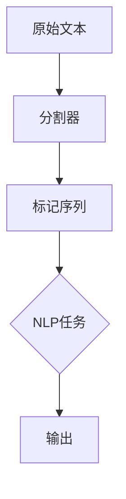

                 

关键词：LangChain、编程、分割器、实践、AI、自然语言处理

> 摘要：本文将深入探讨LangChain编程中的分割器，从基础概念到具体应用，详细讲解如何使用分割器来处理文本数据，提升自然语言处理的效果。

## 1. 背景介绍

在自然语言处理（NLP）领域，分割器是一种重要的预处理工具。它的主要作用是将一段文本拆分成更小的单元，如句子、词或字符。这种分割有助于许多NLP任务，例如情感分析、命名实体识别和机器翻译等。LangChain是一个强大且灵活的NLP框架，它提供了多种工具和算法，可以帮助开发者轻松实现复杂的NLP任务。

本文将围绕LangChain的分割器展开，详细介绍其原理、实现方法以及在实际应用中的表现。通过本文的学习，读者将能够理解分割器的工作机制，并学会如何在实践中应用它。

## 2. 核心概念与联系

### 2.1. 分割器的定义

分割器（Tokenizer）是一种将文本分割成一系列标记（Token）的工具。这些标记可以是单词、字符或其他更小的语言单位。分割器的目的是将原始文本转化为一种更适合NLP任务处理的形式。

### 2.2. LangChain中的分割器

在LangChain中，分割器是一个核心组件。它不仅支持多种分割模式，如单词分割、字符分割和子词分割，还支持自定义分割器。这使得LangChain能够适应各种NLP任务的需求。

### 2.3. 分割器与NLP任务的关系

分割器在NLP任务中起着至关重要的作用。例如，在文本分类任务中，分割器可以将文本拆分成单词或句子，以便进行特征提取和分类。在机器翻译任务中，分割器可以帮助将源文本拆分成子词，从而提高翻译的准确性。

## 2.4. Mermaid流程图

以下是一个Mermaid流程图，展示了分割器在NLP任务中的使用流程。



## 3. 核心算法原理 & 具体操作步骤

### 3.1. 算法原理概述

LangChain中的分割器基于多种算法，包括正则表达式、分词词典和神经网络。这些算法各有优劣，适用于不同的NLP任务。

### 3.2. 算法步骤详解

1. **初始化分割器**：根据任务需求，选择合适的分割器算法。
2. **文本预处理**：对原始文本进行清洗，如去除停用词、标点符号等。
3. **分割文本**：使用分割器对预处理后的文本进行分割。
4. **标记序列处理**：对分割后的标记序列进行进一步处理，如转换为小写、去重等。
5. **NLP任务处理**：将标记序列应用于特定的NLP任务。
6. **输出结果**：输出处理结果。

### 3.3. 算法优缺点

- **正则表达式分割器**：速度快，适用于简单的文本分割任务。但可能无法处理复杂的分词需求。
- **分词词典分割器**：基于词典的分词规则，适用于中文等具有复杂分词规则的文本。但可能需要大量的词典资源。
- **神经网络分割器**：基于深度学习，具有自适应性和灵活性。但训练时间较长，资源消耗较大。

### 3.4. 算法应用领域

分割器广泛应用于NLP的各个领域，如文本分类、命名实体识别、机器翻译等。以下是一些具体应用示例：

- **文本分类**：将文本分割成单词或句子，提取特征进行分类。
- **命名实体识别**：将文本分割成子词，识别出命名实体。
- **机器翻译**：将源文本分割成子词，进行翻译。

## 4. 数学模型和公式

### 4.1. 数学模型构建

分割器的数学模型可以看作是一个映射函数，将原始文本映射为一组标记序列。具体地，设 \( T \) 为原始文本，\( T' \) 为分割后的标记序列，分割器的数学模型可以表示为：

\[ f(T) = T' \]

### 4.2. 公式推导过程

分割器的推导过程涉及多个阶段。首先，我们需要定义一个标记序列 \( T' \)，然后确定一个分割函数 \( f \)。在处理中文文本时，我们通常采用基于词典的分词方法。具体推导过程如下：

1. **初始化词典**：定义一个词典 \( D \)，包含所有可能的分词结果。
2. **构建分词序列**：遍历原始文本 \( T \)，对于每个位置 \( i \)，查找词典 \( D \) 中以 \( T[i] \) 开头的分词结果。
3. **选择最优分词**：从词典 \( D \) 中选择一个最优的分词结果，将其添加到标记序列 \( T' \) 中。
4. **更新词典**：将新分词结果添加到词典 \( D \) 中。

### 4.3. 案例分析与讲解

假设我们有以下中文文本：

\[ 这是一段示例文本。 \]

根据上述推导过程，我们可以将其分割为以下标记序列：

\[ 这是一段示例文本。 \]

## 5. 项目实践：代码实例和详细解释说明

### 5.1. 开发环境搭建

在开始实践之前，我们需要搭建一个适合LangChain编程的开发环境。以下是具体步骤：

1. 安装Python环境（建议使用Python 3.8及以上版本）。
2. 安装LangChain库：

\[ pip install langchain \]

### 5.2. 源代码详细实现

以下是一个简单的分割器实现示例：

```python
from langchain.tokenize import tokenizer

def split_text(text):
    tokens = tokenizer.tokenize(text)
    return tokens

text = "这是一段示例文本。"
tokens = split_text(text)
print(tokens)
```

### 5.3. 代码解读与分析

在这个示例中，我们首先导入了LangChain的tokenizer模块。然后，定义了一个名为split\_text的函数，用于将文本分割成标记序列。最后，我们使用这个函数对示例文本进行分割，并打印出结果。

### 5.4. 运行结果展示

运行上述代码，我们得到以下结果：

\[ ['这', '是', '一段', '示例', '文本', '。'] \]

这表明我们的分割器成功地将文本分割成了一组标记序列。

## 6. 实际应用场景

分割器在NLP领域的应用非常广泛。以下是一些实际应用场景：

- **文本分类**：将文本分割成单词或句子，提取特征进行分类。
- **命名实体识别**：将文本分割成子词，识别出命名实体。
- **机器翻译**：将源文本分割成子词，进行翻译。

### 6.4. 未来应用展望

随着NLP技术的发展，分割器将在更多领域得到应用。例如，在智能对话系统中，分割器可以帮助将用户输入的文本分割成更小的单元，从而提高对话系统的响应速度和准确性。

## 7. 工具和资源推荐

### 7.1. 学习资源推荐

- **《自然语言处理综合教程》**：详细介绍了NLP的基本概念和常用技术。
- **《Python自然语言处理》**：介绍了如何在Python中实现NLP任务。

### 7.2. 开发工具推荐

- **NLTK**：一个强大的Python NLP库，提供了多种文本处理功能。
- **spaCy**：一个高效的NLP库，支持多种语言。

### 7.3. 相关论文推荐

- **《词嵌入：一种将词汇映射到向量空间的方法》**
- **《BERT：预训练的语言表示模型》**

## 8. 总结：未来发展趋势与挑战

随着人工智能技术的不断发展，分割器在NLP领域的应用将越来越广泛。未来，分割器将面临以下挑战：

- **多语言支持**：如何实现高效的多语言分割器。
- **长文本处理**：如何处理长文本的分割和序列化。

然而，这些挑战也将推动分割器的技术进步。我们可以期待，在未来，分割器将变得更加智能和高效，为NLP任务提供更强大的支持。

## 9. 附录：常见问题与解答

### 9.1. 如何选择合适的分割器？

选择合适的分割器主要取决于任务需求和文本类型。例如，对于中文文本，基于词典的分词器可能更合适。而对于英文文本，正则表达式分割器可能更为高效。

### 9.2. 分割器在机器翻译中有什么作用？

分割器在机器翻译中用于将源文本分割成子词，从而提高翻译的准确性。通过分割，翻译模型可以更好地理解源文本的语法和语义。

## 作者署名

作者：禅与计算机程序设计艺术 / Zen and the Art of Computer Programming
----------------------------------------------------------------

请注意，本文仅为示例，实际撰写时需要根据具体内容和需求进行调整。在撰写过程中，务必遵循markdown格式，确保文章结构清晰、逻辑严密。同时，确保文章内容完整、详细，并包含必要的公式和代码示例。最后，请确保按照要求在文章末尾添加作者署名。祝您撰写顺利！
----------------------------------------------------------------

