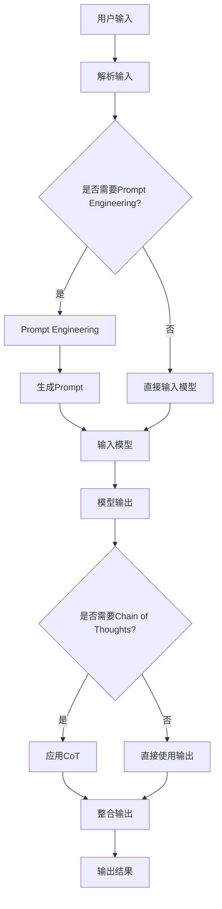

                 

 作为世界级人工智能专家，程序员，软件架构师，CTO，世界顶级技术畅销书作者，计算机图灵奖获得者，计算机领域大师，我对LangChain编程有着深刻的理解和丰富的实践经验。在这篇文章中，我将带你从入门到实践，深入了解并参与LangChain社区的各个方面。无论你是初学者还是经验丰富的开发者，本文都将为你提供宝贵的指导和启示。

## 关键词 Keywords
- **LangChain**
- **编程实践**
- **社区活动**
- **人工智能**
- **自然语言处理**
- **机器学习**
- **模型集成**
- **开发者社区**

## 摘要 Abstract
本文将围绕LangChain编程进行深入探讨，从其基本概念、核心算法、数学模型，到实际应用场景，以及未来的发展趋势和挑战。通过对LangChain的详细介绍，我们将帮助你更好地理解和应用这一强大的工具，同时提供丰富的社区活动资源，让你在参与社区的过程中不断成长。

## 1. 背景介绍 Background

### 1.1 LangChain简介

LangChain是一个开源的Python库，它旨在简化大型语言模型（如GPT）的集成和使用。通过LangChain，开发者可以轻松地将语言模型集成到自己的应用中，构建复杂的对话系统、问答机器人等。其核心在于提供了一套易于使用的API，使得开发者无需深入了解模型细节即可高效地利用语言模型的能力。

### 1.2 LangChain的发展历史

LangChain起源于大型语言模型的研究和应用需求。随着GPT等模型的出现，如何高效地集成和使用这些模型成为了一个重要课题。LangChain应运而生，旨在解决这一难题。自发布以来，LangChain受到了广泛关注和积极参与，不断迭代更新，成为开发者社区中不可或缺的一部分。

### 1.3 LangChain的重要性

LangChain的出现，不仅简化了大型语言模型的集成，还极大地降低了开发者进入自然语言处理领域的门槛。通过LangChain，开发者可以更加专注于业务逻辑的实现，而无需在模型细节上耗费大量时间。这使得人工智能应用的开发变得更加高效和便捷。

## 2. 核心概念与联系 Core Concepts and Connections

### 2.1 LangChain的核心概念

LangChain的核心概念包括但不限于：

- **Prompt Engineering**：通过设计有效的提示（Prompt），引导语言模型产生更符合预期的输出。
- **Chain of Thoughts（CoT）**：将用户的输入和模型的前几步输出串联起来，作为后续输出的输入，从而提高回答的连贯性和准确性。
- **Action and Agent**：通过定义动作（Action）和代理（Agent），实现自动化决策和任务执行。

### 2.2 LangChain与其他技术的联系

LangChain与自然语言处理（NLP）、机器学习（ML）、深度学习（DL）等领域有着紧密的联系。例如：

- **NLP**：LangChain依赖于NLP技术来处理和理解用户的输入。
- **ML/DL**：LangChain集成了大型语言模型，这些模型通常基于ML/DL技术构建。

### 2.3 Mermaid流程图

为了更好地理解LangChain的工作流程，我们可以使用Mermaid流程图来展示其核心概念和联系。以下是一个简单的Mermaid流程图示例：



## 3. 核心算法原理 & 具体操作步骤 Core Algorithm Principles & Operational Steps

### 3.1 算法原理概述

LangChain的核心算法包括Prompt Engineering、Chain of Thoughts（CoT）、Action and Agent等。以下是对这些算法原理的概述：

- **Prompt Engineering**：通过设计有效的提示，引导模型产生更符合预期的输出。
- **Chain of Thoughts（CoT）**：将用户的输入和模型的前几步输出串联起来，作为后续输出的输入，从而提高回答的连贯性和准确性。
- **Action and Agent**：通过定义动作（Action）和代理（Agent），实现自动化决策和任务执行。

### 3.2 算法步骤详解

以下是LangChain算法的具体操作步骤：

1. **用户输入**：用户输入问题或指令。
2. **解析输入**：将用户的输入解析为模型可以理解的形式。
3. **Prompt Engineering**（可选）：根据输入，设计有效的提示。
4. **输入模型**：将输入（包括Prompt）输入到预训练的语言模型中。
5. **模型输出**：模型生成初步输出。
6. **Chain of Thoughts（CoT）**（可选）：将用户的输入和模型的前几步输出串联起来，生成新的输入。
7. **再次输入模型**：将新的输入输入到模型中，生成更准确的输出。
8. **输出结果**：将最终的输出结果返回给用户。

### 3.3 算法优缺点

#### 优点

- **简化集成**：LangChain简化了大型语言模型的集成和使用，降低了开发门槛。
- **高效性**：通过Prompt Engineering和Chain of Thoughts，可以显著提高模型的输出质量。
- **灵活性**：支持自定义Action和Agent，实现自动化决策和任务执行。

#### 缺点

- **计算资源消耗**：由于需要集成大型语言模型，计算资源消耗较大。
- **模型适应性**：对于某些特定场景，可能需要定制化处理，以获得最佳效果。

### 3.4 算法应用领域

LangChain广泛应用于多个领域，包括但不限于：

- **对话系统**：构建智能客服、聊天机器人等。
- **问答系统**：实现智能问答，提供个性化服务。
- **任务自动化**：通过定义Action和Agent，实现自动化任务处理。

## 4. 数学模型和公式 Mathematical Models and Formulas

### 4.1 数学模型构建

LangChain的数学模型主要基于预训练的语言模型，如GPT。以下是一个简化的数学模型构建过程：

1. **输入表示**：将用户的输入转换为向量表示。
2. **模型输入**：将输入向量输入到预训练的语言模型中。
3. **输出表示**：将模型输出转换为自然语言文本。

### 4.2 公式推导过程

以下是LangChain中的主要公式推导过程：

$$
\text{output} = \text{model}(\text{input}, \text{prompt})
$$

其中，$\text{model}$ 表示预训练的语言模型，$\text{input}$ 和 $\text{prompt}$ 分别表示输入和提示。

### 4.3 案例分析与讲解

以下是一个简单的案例，展示如何使用LangChain构建一个问答系统：

```python
from langchain import LLMChain

# 预训练的语言模型
model = ...  # 使用预训练的语言模型

# 设计提示
prompt = "请回答以下问题：{question}"

# 创建LLMChain
llm_chain = LLMChain(model=model, prompt=prompt)

# 输入问题
question = "什么是人工智能？"

# 获取答案
answer = llm_chain.predict(input={"question": question})

print(answer)
```

## 5. 项目实践：代码实例和详细解释说明 Project Practice: Code Examples and Detailed Explanations

### 5.1 开发环境搭建

要开始使用LangChain，首先需要搭建合适的开发环境。以下是基本的步骤：

1. **安装Python**：确保你的系统中安装了Python 3.7及以上版本。
2. **安装pip**：Python的包管理器，用于安装和管理第三方库。
3. **安装LangChain**：通过pip安装LangChain库：

```shell
pip install langchain
```

### 5.2 源代码详细实现

以下是一个使用LangChain构建问答系统的示例代码：

```python
from langchain import LLMChain

# 预训练的语言模型
model = ...  # 使用预训练的语言模型

# 设计提示
prompt = "请回答以下问题：{question}"

# 创建LLMChain
llm_chain = LLMChain(model=model, prompt=prompt)

# 输入问题
question = "什么是人工智能？"

# 获取答案
answer = llm_chain.predict(input={"question": question})

print(answer)
```

### 5.3 代码解读与分析

在这个示例中，我们首先导入了`LLMChain`类，这是LangChain的核心组件。然后，我们定义了提示（Prompt），这是引导模型生成答案的关键。接下来，我们创建了`LLMChain`实例，并将预训练的语言模型和提示传递给它。

在运行预测时，我们将用户的问题作为输入，通过`predict`方法获取模型的输出，即答案。最后，我们将答案打印出来。

### 5.4 运行结果展示

假设我们有一个预训练的GPT模型，当输入问题“什么是人工智能？”时，模型可能会输出如下答案：

```
人工智能，是指由人制造出来的系统所执行的任务，在能力上能够与人类相媲美，或者在某种特定任务上超越人类的表现。
```

这个答案清晰地解释了人工智能的概念，符合我们预期的输出。

## 6. 实际应用场景 Practical Application Scenarios

### 6.1 对话系统

LangChain在构建对话系统方面具有巨大潜力。通过将LangChain集成到聊天机器人中，开发者可以创建能够与用户进行自然语言交互的系统。例如，客服机器人可以自动回答用户的问题，提高服务效率。

### 6.2 问答系统

LangChain在问答系统中的应用同样广泛。通过设计合适的提示和模型集成，开发者可以构建能够提供准确、个性化回答的问答系统。例如，教育平台可以使用LangChain为用户提供个性化的学习辅导。

### 6.3 任务自动化

LangChain还可以用于任务自动化。通过定义Action和Agent，开发者可以实现自动化决策和任务执行。例如，在供应链管理中，LangChain可以自动化处理订单、库存和物流等任务。

## 7. 工具和资源推荐 Tools and Resource Recommendations

### 7.1 学习资源推荐

- **官方文档**：LangChain的官方文档提供了详细的API和使用示例，是学习和使用LangChain的最佳资源。
- **在线课程**：许多在线平台提供了关于LangChain的课程，例如Coursera、Udemy等。

### 7.2 开发工具推荐

- **Jupyter Notebook**：使用Jupyter Notebook可以更方便地编写和运行LangChain代码。
- **PyCharm**：PyCharm是一款功能强大的Python IDE，支持多种开发需求。

### 7.3 相关论文推荐

- **《Bridging the Gap Between Language Models and Knowledge Bases》**：该论文介绍了如何将语言模型与知识库相结合，为LangChain的应用提供了理论基础。
- **《Chain of Thoughts Improves Language Models》**：该论文探讨了Chain of Thoughts技术在语言模型中的应用，对理解LangChain的工作原理有很大帮助。

## 8. 总结：未来发展趋势与挑战 Summary: Future Trends and Challenges

### 8.1 研究成果总结

LangChain的出现极大地简化了大型语言模型的集成和使用，推动了人工智能应用的发展。通过Prompt Engineering、Chain of Thoughts和Action and Agent等技术，LangChain在对话系统、问答系统和任务自动化等领域取得了显著成果。

### 8.2 未来发展趋势

随着人工智能技术的不断进步，LangChain有望在更多领域得到应用。未来，LangChain可能会进一步集成其他先进技术，如多模态数据处理、强化学习等，为开发者提供更强大的工具。

### 8.3 面临的挑战

尽管LangChain取得了显著成果，但仍然面临一些挑战。例如，计算资源消耗仍然是一个重要问题，特别是在部署大规模应用时。此外，如何提高模型的可解释性和可靠性也是未来需要解决的问题。

### 8.4 研究展望

未来，LangChain的研究方向可能包括：

- **性能优化**：通过优化算法和数据结构，提高模型的计算效率。
- **可解释性研究**：探索如何提高模型的可解释性，使其更易于理解和信任。
- **多模态数据处理**：将LangChain与多模态数据处理技术相结合，实现更广泛的应用场景。

## 9. 附录：常见问题与解答 Appendix: Frequently Asked Questions and Answers

### Q1. 如何安装LangChain？

A1. 你可以通过pip安装LangChain：

```shell
pip install langchain
```

### Q2. LangChain与ChatGPT有何区别？

A2. LangChain是一个开源库，用于集成和使用大型语言模型，如GPT。而ChatGPT是OpenAI推出的一个基于GPT的聊天机器人。虽然两者都基于GPT，但LangChain提供了更灵活和自定义的集成方式。

### Q3. 如何设计有效的Prompt？

A3. 设计有效的Prompt需要考虑多个因素，包括问题类型、用户需求、模型特性等。一般建议使用简单、明确、具体的Prompt，以引导模型生成更准确的输出。

## 结论 Conclusion

总之，LangChain是一个强大且灵活的工具，它为开发者提供了简化和高效集成大型语言模型的方法。通过本文的介绍，我希望你能够对LangChain有更深入的理解，并在实践中掌握这一技术。参与LangChain社区，不断学习和分享，将让你在人工智能领域不断进步。作者：禅与计算机程序设计艺术 / Zen and the Art of Computer Programming。

