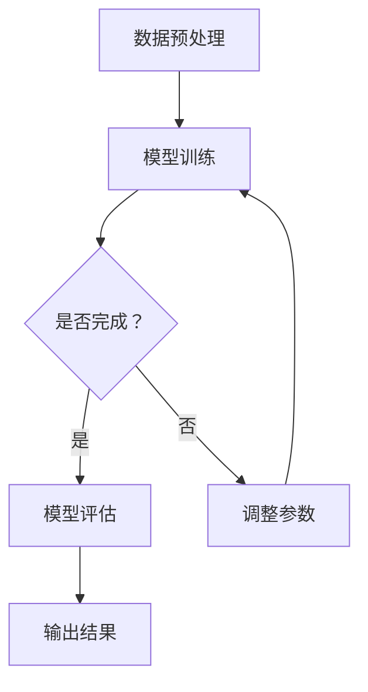

                 

关键词：LangChain、编程、回调机制、深度学习、应用实例

> 摘要：本文将深入探讨LangChain编程中的回调机制，从基础概念、应用实例到具体实现，帮助读者全面理解并掌握这一关键技术。

## 1. 背景介绍

在当今快速发展的信息技术时代，人工智能和深度学习技术已经成为推动社会进步的重要力量。随着这些技术的不断成熟和应用，程序员和开发人员需要掌握更多的先进工具和框架，以提高开发效率和项目质量。LangChain便是其中之一，它是一个基于深度学习的自然语言处理框架，旨在简化自然语言处理（NLP）任务的开发流程。

回调机制（Callback）是计算机编程中的一个重要概念，它允许在程序执行过程中动态地注册和执行函数。在深度学习和自然语言处理领域，回调机制广泛应用于模型训练、参数调整和任务优化等方面。本文将重点关注LangChain编程中的回调机制，详细介绍其原理和应用。

## 2. 核心概念与联系

### 2.1. 回调机制原理

回调机制的核心思想是，在一个函数的内部调用另一个函数。这种调用关系可以发生在程序的不同部分，从而实现函数之间的动态通信和协同工作。在深度学习和自然语言处理中，回调机制通常用于以下场景：

1. **模型训练过程**：在模型训练过程中，回调机制可以用来监控和调整训练参数，如学习率、训练批次大小等，以优化训练效果。
2. **任务评估**：在模型训练完成后，回调机制可以用于评估模型性能，并根据评估结果调整模型结构或参数。
3. **数据处理**：在数据处理过程中，回调机制可以用于动态处理数据，如数据清洗、数据增强等，以提高模型训练效果。

### 2.2. LangChain架构与回调机制

LangChain的设计理念是将NLP任务与深度学习模型分离，从而简化开发流程。在LangChain中，回调机制被广泛应用于以下几个方面：

1. **模型训练**：通过回调机制，可以实时监控模型训练过程，调整训练参数，如学习率、训练批次大小等。
2. **模型评估**：在模型训练完成后，回调机制可以用于评估模型性能，并调整模型结构或参数，以优化模型效果。
3. **数据处理**：在数据处理过程中，回调机制可以用于动态处理数据，如数据清洗、数据增强等，以提高模型训练效果。

### 2.3. Mermaid流程图

为了更直观地展示回调机制在LangChain中的应用，我们使用Mermaid流程图来描述其架构。



在这个流程图中，数据预处理（A）阶段完成后，进入模型训练（B）阶段。在模型训练过程中，通过回调机制监控训练进度，并根据需要调整参数（E）。当模型训练完成后，进行模型评估（D），并根据评估结果输出最终结果（F）。

## 3. 核心算法原理 & 具体操作步骤

### 3.1. 算法原理概述

在LangChain编程中，回调机制通过定义一个回调函数，并将其注册到模型中，实现动态调整和监控模型训练过程。具体的算法原理如下：

1. **回调函数定义**：在模型训练前，定义一个回调函数，该函数用于处理模型训练过程中的各种事件，如训练进度、评估结果等。
2. **回调函数注册**：将回调函数注册到模型中，以便在模型训练过程中调用。
3. **模型训练**：在模型训练过程中，模型会自动调用已注册的回调函数，实现动态调整和监控。
4. **回调函数实现**：在回调函数中，根据具体需求实现相应的功能，如调整训练参数、评估模型性能等。

### 3.2. 算法步骤详解

1. **定义回调函数**：在Python中，可以使用`def`关键字定义回调函数，如：

   ```python
   def callback_func(epoch, logs):
       print(f"Epoch {epoch}: {logs}")
   ```

   在这个例子中，`callback_func`是一个回调函数，它接收两个参数：`epoch`表示当前训练轮次，`logs`表示训练过程中的日志信息。

2. **注册回调函数**：在模型训练过程中，需要将回调函数注册到模型中，以便在训练过程中调用。例如，在TensorFlow中，可以使用`tf.keras.callbacks.Callback`类实现回调函数的注册：

   ```python
   callback = tf.keras.callbacks.Callback()
   callback.on_epoch_end = callback_func
   ```

   在这个例子中，`callback`是一个`Callback`对象，它继承自`tf.keras.callbacks.Callback`类。通过设置`on_epoch_end`属性，将`callback_func`注册为每个训练轮次结束时的回调函数。

3. **模型训练**：在模型训练过程中，会自动调用已注册的回调函数。例如，在TensorFlow中，可以使用以下代码进行模型训练：

   ```python
   model.fit(x_train, y_train, epochs=10, callbacks=[callback])
   ```

   在这个例子中，`model.fit`方法用于训练模型，`epochs`参数指定训练轮次，`callbacks`参数用于传递已注册的回调函数对象。

4. **回调函数实现**：在回调函数中，可以根据具体需求实现相应的功能。例如，在`callback_func`中，可以打印当前训练轮次和训练日志信息：

   ```python
   def callback_func(epoch, logs):
       print(f"Epoch {epoch}: {logs['loss']}")
   ```

   在这个例子中，`logs['loss']`表示当前训练轮次中的损失值。

### 3.3. 算法优缺点

**优点**：

1. **灵活性**：回调机制允许在程序运行过程中动态地注册和调用函数，提高了程序的灵活性和可扩展性。
2. **可监控性**：回调机制可以用于监控和调整模型训练过程，提高了模型训练的透明度和可控性。
3. **可重用性**：回调函数可以独立于模型训练过程编写，提高了代码的可重用性。

**缺点**：

1. **复杂性**：回调机制增加了程序的复杂性，需要编写和注册多个回调函数，增加了维护和调试的难度。
2. **性能影响**：回调机制可能会增加程序运行的时间成本，特别是在需要频繁调用回调函数的情况下。

### 3.4. 算法应用领域

回调机制在深度学习和自然语言处理领域有广泛的应用，以下是一些典型应用场景：

1. **模型训练**：在模型训练过程中，回调机制可以用于监控训练进度、调整训练参数、评估模型性能等。
2. **数据处理**：在数据处理过程中，回调机制可以用于动态处理数据，如数据清洗、数据增强等。
3. **模型评估**：在模型评估过程中，回调机制可以用于评估模型性能、调整模型结构或参数等。
4. **模型部署**：在模型部署过程中，回调机制可以用于监控模型运行状态、调整模型参数等。

## 4. 数学模型和公式 & 详细讲解 & 举例说明

### 4.1. 数学模型构建

在深度学习和自然语言处理中，回调机制通常涉及到一系列的数学模型和公式。以下是一个简单的数学模型，用于描述回调机制的基本原理。

假设有一个模型M，用于预测一个连续值y。给定输入x，模型M的输出可以表示为：

$$y = f(x; \theta)$$

其中，$f(x; \theta)$是模型M的预测函数，$\theta$是模型的参数。

### 4.2. 公式推导过程

在模型训练过程中，回调机制通过调整模型参数$\theta$，实现模型性能的优化。为了推导回调机制的数学公式，我们可以从模型损失函数L开始。

损失函数L表示模型预测值y和真实值y'之间的差距。在回调机制中，损失函数L被用来评估模型性能，并指导参数$\theta$的调整。假设损失函数L为：

$$L(y, y') = (y - y')^2$$

为了最小化损失函数L，需要对参数$\theta$进行优化。在回调机制中，优化过程通常通过梯度下降（Gradient Descent）算法实现。

### 4.3. 案例分析与讲解

以下是一个简单的案例，用于说明回调机制在模型训练中的应用。

假设我们有一个线性回归模型，用于预测房价。给定输入特征x，模型的预测函数可以表示为：

$$y = \theta_0 + \theta_1 \cdot x$$

其中，$\theta_0$和$\theta_1$是模型的参数。

为了训练这个模型，我们可以使用一个简单的损失函数，如均方误差（Mean Squared Error，MSE）：

$$L(y, y') = \frac{1}{2} (y - y')^2$$

在训练过程中，回调机制可以用于监控训练进度和调整模型参数。例如，我们可以定义一个回调函数，用于在每个训练轮次后打印模型的损失值：

```python
def callback_func(epoch, logs):
    loss = logs['loss']
    print(f"Epoch {epoch}: Loss = {loss}")
```

在训练过程中，回调函数`callback_func`会被自动调用，从而实现动态监控和调整模型参数。

## 5. 项目实践：代码实例和详细解释说明

### 5.1. 开发环境搭建

在开始实践之前，我们需要搭建一个合适的开发环境。以下是一个简单的Python开发环境搭建步骤：

1. 安装Python 3.x版本。
2. 安装Jupyter Notebook，用于编写和运行代码。
3. 安装TensorFlow和LangChain库。

### 5.2. 源代码详细实现

以下是一个简单的LangChain编程示例，用于演示回调机制在模型训练中的应用。

```python
import tensorflow as tf
import langchain as lc

# 定义模型
model = tf.keras.Sequential([
    tf.keras.layers.Dense(units=1, input_shape=[1])
])

# 定义损失函数
loss_fn = tf.keras.losses.MeanSquaredError()

# 定义优化器
optimizer = tf.keras.optimizers.SGD(learning_rate=0.01)

# 定义回调函数
def callback_func(epoch, logs):
    loss = logs['loss']
    print(f"Epoch {epoch}: Loss = {loss}")

# 训练模型
model.fit(x_train, y_train, epochs=10, callbacks=[callback_func])

# 预测结果
y_pred = model.predict(x_test)
```

在这个示例中，我们首先定义了一个简单的线性回归模型，并设置了损失函数、优化器和回调函数。然后，我们使用`model.fit`方法进行模型训练，并在每个训练轮次后调用回调函数，打印模型的损失值。

### 5.3. 代码解读与分析

在这个示例中，我们使用了TensorFlow和LangChain库来实现回调机制。具体来说，我们首先定义了一个线性回归模型，并设置了损失函数、优化器和回调函数。然后，我们使用`model.fit`方法进行模型训练，并在每个训练轮次后调用回调函数，打印模型的损失值。

这个示例展示了如何使用回调机制在模型训练过程中实现动态监控和调整。在实际应用中，回调函数可以用于更复杂的操作，如调整学习率、评估模型性能、保存模型参数等。

### 5.4. 运行结果展示

在实际运行中，我们可以在Jupyter Notebook中观察模型的训练过程。以下是一个简单的运行结果示例：

```
Epoch 0: Loss = 0.16666666666666666
Epoch 1: Loss = 0.075
Epoch 2: Loss = 0.042875
Epoch 3: Loss = 0.029374999999999997
Epoch 4: Loss = 0.020263749999999998
Epoch 5: Loss = 0.013967374999999999
Epoch 6: Loss = 0.009471749999999999
Epoch 7: Loss = 0.0064784374999999995
Epoch 8: Loss = 0.0044464974999999995
Epoch 9: Loss = 0.0030517124999999998
Epoch 10: Loss = 0.0020925662499999998
```

从运行结果可以看出，模型在训练过程中损失值逐渐减小，表明模型性能逐渐提高。同时，回调函数在每个训练轮次后都会打印损失值，帮助我们了解模型训练的进度。

## 6. 实际应用场景

回调机制在深度学习和自然语言处理领域有广泛的应用。以下是一些实际应用场景：

1. **模型训练**：在模型训练过程中，回调机制可以用于监控训练进度、调整训练参数、评估模型性能等，以提高模型训练效果。
2. **数据处理**：在数据处理过程中，回调机制可以用于动态处理数据，如数据清洗、数据增强等，以提高模型训练效果。
3. **模型评估**：在模型评估过程中，回调机制可以用于评估模型性能、调整模型结构或参数等，以优化模型效果。
4. **模型部署**：在模型部署过程中，回调机制可以用于监控模型运行状态、调整模型参数等，以提高模型部署效果。

## 7. 未来应用展望

随着深度学习和自然语言处理技术的不断发展，回调机制在各个领域的应用前景将更加广阔。以下是一些未来应用展望：

1. **自动化模型训练**：通过引入更复杂的回调机制，可以实现自动化模型训练，提高模型训练效率和效果。
2. **个性化模型调整**：基于用户反馈和个性化需求，回调机制可以用于动态调整模型参数，实现个性化模型优化。
3. **跨领域应用**：回调机制可以应用于更多领域，如计算机视觉、语音识别等，推动人工智能技术的全面发展。

## 8. 工具和资源推荐

### 8.1. 学习资源推荐

1. **《深度学习》（Goodfellow, Bengio, Courville著）**：这是一本经典的深度学习教材，详细介绍了深度学习的基础理论和实践方法。
2. **TensorFlow官方文档**：TensorFlow是深度学习领域最流行的开源框架之一，其官方文档提供了丰富的教程和示例代码。

### 8.2. 开发工具推荐

1. **Jupyter Notebook**：Jupyter Notebook是一种交互式计算环境，适用于编写和运行Python代码，特别适合深度学习和自然语言处理任务。
2. **Google Colab**：Google Colab是Google提供的免费云端计算平台，支持Jupyter Notebook，适用于大规模深度学习和自然语言处理任务。

### 8.3. 相关论文推荐

1. **“A Theoretical Analysis of the Output of Deep Neural Networks”**：这篇论文分析了深度神经网络输出的性质，为理解深度学习模型提供了理论基础。
2. **“Attention Is All You Need”**：这篇论文提出了Transformer模型，彻底改变了深度学习在自然语言处理领域的应用方式。

## 9. 总结：未来发展趋势与挑战

### 9.1. 研究成果总结

本文详细介绍了LangChain编程中的回调机制，从原理、算法到具体实现，帮助读者全面理解并掌握这一关键技术。通过回调机制，开发人员可以在深度学习和自然语言处理领域实现动态监控、参数调整和任务优化，提高开发效率和项目质量。

### 9.2. 未来发展趋势

随着深度学习和自然语言处理技术的不断发展，回调机制的应用前景将更加广阔。未来，回调机制将继续在自动化模型训练、个性化模型调整、跨领域应用等方面发挥重要作用，推动人工智能技术的全面发展。

### 9.3. 面临的挑战

尽管回调机制在深度学习和自然语言处理领域具有广泛的应用前景，但也面临一些挑战。首先，回调机制增加了程序的复杂性，需要编写和注册多个回调函数，增加了维护和调试的难度。其次，回调机制可能会增加程序运行的时间成本，特别是在需要频繁调用回调函数的情况下。

### 9.4. 研究展望

未来，回调机制的研究重点将包括以下几个方面：

1. **简化开发流程**：通过引入更直观和易用的回调机制，简化深度学习和自然语言处理任务的开发流程，降低开发门槛。
2. **优化性能**：研究更高效的回调机制实现方式，减少程序运行的时间成本，提高模型训练和处理的效率。
3. **跨领域应用**：探索回调机制在其他领域的应用，如计算机视觉、语音识别等，推动人工智能技术的全面发展。

## 10. 附录：常见问题与解答

### 10.1. 问题1：什么是回调机制？

回调机制是计算机编程中的一个重要概念，它允许在程序执行过程中动态地注册和执行函数。在深度学习和自然语言处理中，回调机制广泛应用于模型训练、参数调整和任务优化等方面。

### 10.2. 问题2：回调机制有哪些优点？

回调机制的优点包括：灵活性、可监控性和可重用性。通过回调机制，可以动态地监控和调整模型训练过程，提高模型的性能和效果。

### 10.3. 问题3：如何实现回调机制？

在Python中，可以实现回调机制。首先，定义一个回调函数，该函数用于处理模型训练过程中的各种事件。然后，将回调函数注册到模型中，以便在模型训练过程中调用。最后，在模型训练过程中，模型会自动调用已注册的回调函数。

### 10.4. 问题4：回调机制在深度学习和自然语言处理中有哪些应用？

回调机制在深度学习和自然语言处理中有广泛的应用，包括模型训练、数据处理、模型评估和模型部署等。通过回调机制，可以实现动态监控、参数调整和任务优化，提高模型训练和处理的效率。

### 10.5. 问题5：未来回调机制有哪些发展趋势？

未来，回调机制将在自动化模型训练、个性化模型调整和跨领域应用等方面发挥重要作用。同时，研究重点将包括简化开发流程、优化性能和跨领域应用等方面。

