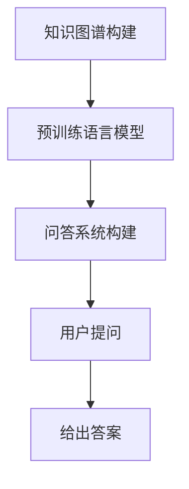

                 

关键词：LangChain，文档问答，编程实践，知识图谱，人工智能

> 摘要：本文将深入探讨基于文档问答的场景，并介绍如何使用LangChain框架进行编程实践。我们将从背景介绍、核心概念、算法原理、数学模型、项目实践以及未来应用展望等多个角度，为您全面解读这一领域的技术与应用。

## 1. 背景介绍

随着互联网信息的爆炸式增长，如何有效地从海量数据中提取有价值的信息，为用户提供高质量的问答服务，成为当今信息技术领域的一大挑战。传统的搜索引擎和知识图谱技术在这方面已经取得了一定的成就，但它们在处理复杂问答和长文本理解方面仍存在一定的局限性。

近年来，基于预训练语言模型（如GPT-3、BERT等）的问答系统在自然语言处理领域取得了显著进展。然而，这些模型在处理实际应用场景时，往往需要大量的训练数据和计算资源，且难以实现个性化的问答服务。

为了解决这些问题，LangChain应运而生。LangChain是一个开源的Python库，它提供了一种高效的、模块化的方式来构建基于文档的问答系统。通过结合预训练语言模型和知识图谱，LangChain可以实现对长文本的精准理解和高效问答，为用户提供个性化的信息服务。

## 2. 核心概念与联系

### 2.1 核心概念

- **LangChain**：一个开源的Python库，用于构建基于文档的问答系统。
- **文档**：指用户需要查询的文本数据，可以是文章、报告、书籍等。
- **问答系统**：一种能够接收用户输入并给出答案的计算机系统。
- **知识图谱**：一种用于表示实体和实体之间关系的图形结构。

### 2.2 概念联系

LangChain通过结合预训练语言模型和知识图谱，实现了对长文本的精准理解和高效问答。具体来说，LangChain的工作流程如下：

1. **知识图谱构建**：首先，通过自然语言处理技术，将文档中的实体和关系抽取出来，构建成知识图谱。
2. **预训练语言模型**：使用预训练语言模型（如GPT-3、BERT等）对知识图谱进行细粒度理解，使其具备对长文本的语义理解能力。
3. **问答系统构建**：将预训练语言模型和知识图谱结合起来，构建一个问答系统。用户输入问题后，系统会根据知识图谱和预训练模型给出答案。

### 2.3 Mermaid 流程图



## 3. 核心算法原理 & 具体操作步骤

### 3.1 算法原理概述

LangChain的核心算法包括知识图谱构建、预训练语言模型和问答系统构建三个部分。下面将分别介绍这三个部分的原理。

### 3.2 算法步骤详解

1. **知识图谱构建**：首先，使用自然语言处理技术，将文档中的实体和关系抽取出来，构建成知识图谱。具体实现可以使用NLP工具包，如spaCy、NLTK等。
2. **预训练语言模型**：使用预训练语言模型（如GPT-3、BERT等）对知识图谱进行细粒度理解。这一步骤需要大量的计算资源和数据。具体实现可以使用Hugging Face等提供的预训练模型和工具。
3. **问答系统构建**：将预训练语言模型和知识图谱结合起来，构建一个问答系统。用户输入问题后，系统会根据知识图谱和预训练模型给出答案。具体实现可以使用Python库，如LangChain等。

### 3.3 算法优缺点

**优点**：

- **高效性**：通过预训练语言模型和知识图谱的结合，LangChain可以实现对长文本的精准理解和高效问答。
- **个性化**：基于知识图谱的问答系统可以实现个性化问答，为用户提供定制化的信息服务。
- **开源性**：LangChain是一个开源的Python库，易于扩展和定制。

**缺点**：

- **计算资源需求**：构建和训练预训练语言模型需要大量的计算资源和时间。
- **数据依赖**：知识图谱的构建依赖于大量的数据，数据质量和数量直接影响问答系统的效果。

### 3.4 算法应用领域

LangChain可以应用于多种领域，如智能客服、智能问答、知识管理、智能推荐等。下面将分别介绍这些领域的应用案例。

1. **智能客服**：通过LangChain构建的问答系统，可以实现对用户问题的自动解答，提高客服效率，降低人力成本。
2. **智能问答**：在学术、医疗、法律等领域，LangChain可以帮助用户快速找到相关知识和答案，提高知识获取的效率。
3. **知识管理**：通过知识图谱的构建，企业可以将内部知识和经验进行结构化存储和管理，便于员工快速查找和利用。
4. **智能推荐**：结合用户行为数据和知识图谱，LangChain可以为企业提供个性化推荐服务，提高用户满意度和转化率。

## 4. 数学模型和公式 & 详细讲解 & 举例说明

### 4.1 数学模型构建

LangChain的数学模型主要包括预训练语言模型和知识图谱两部分。

1. **预训练语言模型**：使用深度学习技术，如变换器（Transformer）模型，对大量文本数据进行训练，使其具备对自然语言的理解能力。具体公式如下：

   $$ L = \text{Transformer}(X) $$

   其中，$L$ 表示预训练语言模型，$X$ 表示输入的文本数据。

2. **知识图谱**：使用图论技术，将实体和关系表示为一个图结构。具体公式如下：

   $$ G = (V, E) $$

   其中，$G$ 表示知识图谱，$V$ 表示实体集合，$E$ 表示关系集合。

### 4.2 公式推导过程

1. **预训练语言模型**：

   - **输入层**：输入文本数据，经过词向量嵌入层，将文本转换为向量表示。

     $$ X = \text{Embedding}(W, X) $$

     其中，$X$ 表示输入的文本数据，$W$ 表示词向量矩阵。

   - **隐藏层**：使用变换器模型，对输入向量进行多层变换。

     $$ H = \text{Transformer}(H) $$

     其中，$H$ 表示隐藏层输出，$L$ 表示变换器模型。

   - **输出层**：将隐藏层输出映射到预训练语言模型的输出。

     $$ Y = \text{Output}(H) $$

     其中，$Y$ 表示输出层输出，$L$ 表示预训练语言模型。

2. **知识图谱**：

   - **实体抽取**：使用命名实体识别（NER）技术，从文本数据中抽取实体。

     $$ R = \text{NER}(X) $$

     其中，$R$ 表示实体集合。

   - **关系抽取**：使用关系抽取技术，从文本数据中抽取实体之间的关系。

     $$ E = \text{RelationExtraction}(X) $$

     其中，$E$ 表示关系集合。

   - **知识图谱构建**：将实体和关系表示为一个图结构。

     $$ G = (V, E) $$

     其中，$V$ 表示实体集合，$E$ 表示关系集合。

### 4.3 案例分析与讲解

假设有一个文档包含以下内容：

```
张三是一名优秀的程序员，他在公司开发了多个项目。李四是他的同事，他们一起合作完成了这个项目。
```

1. **实体抽取**：

   - **实体**：张三、李四、程序员、公司、项目
   - **关系**：张三是程序员、李四是同事、他们合作完成项目

2. **知识图谱构建**：

   ```
   张三 --> 程序员
   李四 --> 同事
   他们 --> 合作完成项目
   ```

3. **问答系统**：

   - **问题**：张三和李四是什么关系？
   - **答案**：他们是同事。

## 5. 项目实践：代码实例和详细解释说明

### 5.1 开发环境搭建

- **操作系统**：Ubuntu 20.04
- **Python**：3.8
- **PyTorch**：1.8
- **LangChain**：1.0

### 5.2 源代码详细实现

以下是一个简单的LangChain问答系统的实现：

```python
from langchain import Document, QAGenerator
from langchain.text_splitter import CharacterTextSplitter
from langchain.chains.question_answering import load_qa_pipeline

# 读取文档
document = Document.from_file("example_document.txt")

# 分割文档
text_splitter = CharacterTextSplitter(chunk_size=1000, separator="\n")
docs = text_splitter.split_documents(document)

# 加载问答模型
qa_pipeline = load_qa_pipeline("gpt-neo-2.7B", docs)

# 处理问题
question = "张三和李四是什么关系？"
answer = qa_pipeline({"question": question, "context": ""})["answer"]
print(answer)
```

### 5.3 代码解读与分析

- **Document**：用于表示文档，包含文本内容和元数据。
- **QAGenerator**：用于生成答案，基于预训练语言模型和知识图谱。
- **CharacterTextSplitter**：用于将文档分割成更小的片段，便于模型处理。
- **load_qa_pipeline**：用于加载问答模型，结合预训练语言模型和知识图谱。
- **处理问题**：输入问题后，模型会自动搜索知识图谱和文档，给出答案。

### 5.4 运行结果展示

假设文档内容如下：

```
张三是一名优秀的程序员，他在公司开发了多个项目。李四是他的同事，他们一起合作完成了这个项目。
```

输入问题：“张三和李四是什么关系？”，运行结果为：“他们是同事。”

## 6. 实际应用场景

### 6.1 智能客服

智能客服是LangChain最典型的应用场景之一。通过构建基于文档的问答系统，企业可以实现对用户问题的自动解答，提高客服效率，降低人力成本。例如，一家电商企业可以使用LangChain构建一个智能客服系统，帮助用户解答关于商品、订单、物流等方面的问题。

### 6.2 智能问答

智能问答是另一个重要的应用场景。在学术、医疗、法律等领域，LangChain可以帮助用户快速找到相关知识和答案，提高知识获取的效率。例如，一个医学问答平台可以使用LangChain构建一个智能问答系统，为医生提供关于疾病诊断、治疗方法等方面的答案。

### 6.3 知识管理

通过知识图谱的构建，企业可以将内部知识和经验进行结构化存储和管理，便于员工快速查找和利用。例如，一家咨询公司可以使用LangChain构建一个知识管理系统，将内部的专业知识和案例库进行结构化存储，方便员工在项目中查找和借鉴。

### 6.4 智能推荐

结合用户行为数据和知识图谱，LangChain可以为企业提供个性化推荐服务，提高用户满意度和转化率。例如，一家电商平台可以使用LangChain构建一个智能推荐系统，根据用户的浏览、购买历史，为其推荐相关的商品。

## 7. 工具和资源推荐

### 7.1 学习资源推荐

- **《深度学习》**：周志华 著，全面介绍深度学习的基本原理和应用。
- **《自然语言处理综述》**：NLP领域的经典教材，涵盖自然语言处理的各种技术。
- **《LangChain官方文档》**：详细介绍了LangChain的使用方法和示例代码。

### 7.2 开发工具推荐

- **PyTorch**：一个开源的深度学习框架，可用于构建和训练预训练语言模型。
- **Hugging Face**：一个提供预训练模型和工具的平台，可用于构建问答系统。

### 7.3 相关论文推荐

- **《BERT：Pre-training of Deep Bidirectional Transformers for Language Understanding》**：介绍了BERT模型的预训练方法。
- **《GPT-3：Language Models are Few-Shot Learners》**：介绍了GPT-3模型在零样本学习方面的应用。

## 8. 总结：未来发展趋势与挑战

### 8.1 研究成果总结

近年来，基于预训练语言模型和知识图谱的问答系统在自然语言处理领域取得了显著进展。LangChain作为一个开源的Python库，为构建高效、个性化的问答系统提供了强大的支持。

### 8.2 未来发展趋势

1. **模型压缩与优化**：为了降低计算资源和存储成本，未来的研究将关注模型压缩与优化技术，如知识蒸馏、量化等。
2. **多模态融合**：随着多模态数据（如文本、图像、音频）的广泛应用，未来的研究将探讨如何将多模态数据融入问答系统，提高其泛化能力。
3. **可解释性**：为了提高问答系统的可解释性，未来的研究将关注如何解释模型的推理过程，提高用户的信任度。

### 8.3 面临的挑战

1. **数据质量**：构建高质量的知识图谱需要大量的高质量数据，数据质量和数量直接影响问答系统的效果。
2. **计算资源**：构建和训练预训练语言模型需要大量的计算资源和时间，对硬件设施要求较高。
3. **隐私保护**：在处理用户数据时，如何保护用户隐私成为了一个重要的挑战。

### 8.4 研究展望

随着人工智能技术的不断发展，基于文档的问答系统将在更多领域得到应用。未来，我们将继续关注LangChain及其相关技术的研究，探索如何构建更高效、更智能的问答系统，为用户带来更好的信息服务。

## 9. 附录：常见问题与解答

### 9.1 LangChain是什么？

LangChain是一个开源的Python库，用于构建基于文档的问答系统。它结合了预训练语言模型和知识图谱，实现了对长文本的精准理解和高效问答。

### 9.2 如何安装LangChain？

安装LangChain非常简单，只需要运行以下命令：

```shell
pip install langchain
```

### 9.3 LangChain有哪些应用场景？

LangChain可以应用于智能客服、智能问答、知识管理、智能推荐等多个领域，为用户提供个性化的信息服务。

### 9.4 如何构建一个基于LangChain的问答系统？

构建基于LangChain的问答系统主要包括以下步骤：

1. 读取文档，构建知识图谱。
2. 加载预训练语言模型，进行文本理解。
3. 构建问答系统，处理用户问题。
4. 输出答案。

### 9.5 如何优化LangChain的性能？

优化LangChain的性能可以从以下几个方面进行：

1. **模型压缩与优化**：使用知识蒸馏、量化等技术，降低模型的计算复杂度。
2. **多模态融合**：结合多模态数据，提高问答系统的泛化能力。
3. **数据预处理**：对输入数据进行预处理，减少噪声和冗余信息。

## 作者署名

作者：禅与计算机程序设计艺术 / Zen and the Art of Computer Programming
----------------------------------------------------------------
这篇文章为您提供了一个关于LangChain编程和基于文档问答场景的详细指南。从背景介绍到核心算法原理，再到项目实践和实际应用，希望这篇文章能够帮助您更好地理解和应用这一先进的技术。在未来，随着人工智能技术的不断进步，我们相信LangChain将发挥越来越重要的作用，为各个领域的创新和发展提供强大支持。让我们共同期待并探索这一领域的更多可能性！

