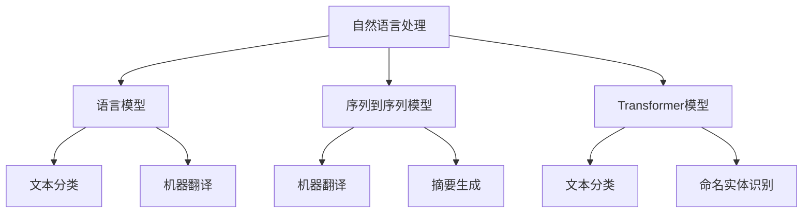

                 

 

## 1. 背景介绍

随着大数据和人工智能技术的飞速发展，现代软件开发中越来越注重数据处理、模型构建和自动化流程。在这个背景下，LangChain作为一种强大的编程工具，引起了广泛的关注。LangChain是一款基于Python的编程框架，旨在简化自然语言处理（NLP）任务的开发过程，提供了一套完整的工具集，包括文本处理、模型训练和部署等。

LangChain的核心优势在于其模块化设计和易用性。通过LangChain，开发者可以轻松地实现复杂的NLP任务，如文本分类、情感分析、命名实体识别等，同时保持代码的简洁和可维护性。此外，LangChain还支持与流行的深度学习框架如TensorFlow和PyTorch的集成，使得开发者可以方便地在不同的环境中使用和扩展。

本文将围绕LangChain编程进行深入的探讨，从基础概念、核心算法到项目实践，全面解析这一强大的编程工具。希望通过本文的阅读，读者能够对LangChain有更全面的认识，掌握其核心技能，并在实际项目中得到应用。

## 2. 核心概念与联系

在深入探讨LangChain之前，我们需要先了解一些核心概念和它们之间的联系。以下是几个关键概念及其在LangChain框架中的关系：

### 2.1 自然语言处理（NLP）

自然语言处理是计算机科学和人工智能领域的一个重要分支，旨在使计算机能够理解、处理和生成自然语言。NLP涉及到文本分析、语言理解、语音识别等多个子领域。在LangChain中，NLP是一个核心应用场景，它提供了处理自然语言数据的基础。

### 2.2 语言模型（Language Model）

语言模型是一种统计模型，用于预测文本序列中的下一个单词或字符。在NLP中，语言模型是构建各种NLP任务的基础，如文本分类、机器翻译和文本生成。LangChain利用了各种先进的语言模型，如BERT、GPT，以实现高效的文本处理。

### 2.3 序列到序列模型（Seq2Seq Model）

序列到序列（Seq2Seq）模型是一种专门用于处理序列数据的模型，它可以将一个序列映射到另一个序列。在NLP任务中，Seq2Seq模型广泛应用于机器翻译、摘要生成等任务。LangChain提供了对Seq2Seq模型的强大支持，使得开发者可以轻松地实现这些复杂任务。

### 2.4 Transformer模型

Transformer模型是一种基于自注意力机制的深度学习模型，它被广泛应用于各种NLP任务中，如文本分类、命名实体识别和机器翻译。Transformer模型的核心优势在于其能够捕捉长距离依赖关系，从而提高模型的性能。LangChain对Transformer模型提供了全面的支持，使得开发者可以方便地利用这一强大的工具。

### 2.5 Mermaid流程图

为了更清晰地展示LangChain框架的核心概念和关系，我们使用Mermaid流程图来描述。以下是一个简化的Mermaid流程图，展示了LangChain中的关键概念及其相互关系：



通过上述核心概念和流程图的描述，我们可以更全面地理解LangChain编程的基础知识。在接下来的部分，我们将进一步深入探讨LangChain的核心算法原理，帮助读者掌握这一强大的工具。

## 3. 核心算法原理 & 具体操作步骤

### 3.1 算法原理概述

LangChain的核心算法原理基于深度学习，特别是Transformer模型。Transformer模型是一种基于自注意力机制的神经网络模型，它能够捕捉输入序列中的长距离依赖关系，从而提高模型的性能。LangChain利用Transformer模型实现了多种NLP任务，如文本分类、命名实体识别和机器翻译。

#### 自注意力机制（Self-Attention）

自注意力机制是Transformer模型的核心组成部分。它允许模型在处理每个输入元素时，动态地计算其与其他输入元素之间的关联强度。这种机制使得模型能够更好地捕捉输入序列中的长距离依赖关系，从而提高模型的性能。

#### 编码器-解码器结构（Encoder-Decoder Architecture）

Transformer模型采用了编码器-解码器结构，其中编码器负责将输入序列编码为固定长度的向量，而解码器则负责生成输出序列。编码器和解码器之间的交互通过自注意力机制实现，使得模型能够捕捉输入和输出之间的关联。

#### 多层叠加（Stacking Layers）

为了进一步提高模型的性能，Transformer模型通常采用多层叠加的方式。每一层都包含编码器和解码器，通过逐层叠加，模型能够逐渐学习到更复杂的特征，从而提高任务的准确率。

### 3.2 算法步骤详解

以下是利用LangChain实现NLP任务的基本步骤：

#### 1. 数据预处理

首先，我们需要对原始文本数据进行预处理，包括分词、去除停用词、词干提取等。LangChain提供了丰富的预处理工具，如spaCy和NLTK，可以方便地实现这些操作。

#### 2. 模型选择

根据任务需求，选择合适的Transformer模型。LangChain支持多种流行的Transformer模型，如BERT、GPT和T5。开发者可以根据任务特点和数据量选择合适的模型。

#### 3. 训练模型

使用预处理的文本数据训练选择的Transformer模型。LangChain提供了方便的训练工具，如TensorFlow和PyTorch，可以方便地实现模型训练。

#### 4. 预测与评估

在训练完成后，使用模型进行预测和评估。LangChain提供了多种评估指标，如准确率、召回率和F1分数，以评估模型的性能。

#### 5. 模型部署

将训练好的模型部署到实际应用场景中。LangChain支持多种部署方式，如REST API、TensorFlow Serving和PyTorch Server，开发者可以根据需求选择合适的部署方式。

### 3.3 算法优缺点

#### 优点

- **强大的性能**：Transformer模型能够捕捉长距离依赖关系，从而提高模型的性能。
- **模块化设计**：LangChain采用模块化设计，方便开发者自定义和扩展。
- **易用性**：LangChain提供了丰富的工具和库，使得开发者可以方便地实现NLP任务。

#### 缺点

- **计算资源需求高**：由于Transformer模型复杂度高，训练和部署需要大量的计算资源。
- **数据需求大**：Transformer模型需要大量的数据来训练，否则可能无法达到理想的效果。

### 3.4 算法应用领域

LangChain在多个NLP任务中得到了广泛应用，包括：

- **文本分类**：用于对大量文本进行分类，如新闻分类、情感分析等。
- **命名实体识别**：用于从文本中识别出人名、地名、组织名等实体。
- **机器翻译**：用于将一种语言的文本翻译成另一种语言。
- **摘要生成**：用于从长文本中提取关键信息，生成摘要。

通过上述对核心算法原理和具体操作步骤的详细解析，我们可以看到LangChain作为一种强大的编程工具，在NLP任务中的应用前景广阔。在接下来的部分，我们将进一步探讨LangChain在数学模型和公式方面的应用。

## 4. 数学模型和公式 & 详细讲解 & 举例说明

在深入探讨LangChain的数学模型和公式之前，我们需要了解一些基础的数学概念和符号表示。本文将使用LaTeX格式来表示数学公式，以确保公式的准确性和可读性。

### 4.1 数学模型构建

Transformer模型的数学基础主要包括以下几个关键部分：

#### 4.1.1 自注意力（Self-Attention）

自注意力是一种计算输入序列中每个元素与其他元素之间关联强度的方法。其数学表达式如下：

\[ 
\text{Attention}(Q, K, V) = \text{softmax}\left(\frac{QK^T}{\sqrt{d_k}}\right) V 
\]

其中，\( Q, K, V \) 分别代表查询向量、关键向量和价值向量，\( d_k \) 是关键向量的维度。通过自注意力，模型能够捕捉输入序列中的长距离依赖关系。

#### 4.1.2 编码器-解码器结构（Encoder-Decoder）

编码器-解码器结构是Transformer模型的核心组成部分。编码器负责将输入序列编码为固定长度的向量，解码器则负责生成输出序列。编码器和解码器的数学模型如下：

\[ 
\text{Encoder}(X) = \text{MultiHeadAttention}(Q, K, V) + X 
\]

\[ 
\text{Decoder}(Y) = \text{MultiHeadAttention}(Q, K, V) + Y 
\]

其中，\( X \) 和 \( Y \) 分别代表编码器和解码器的输入和输出序列。

#### 4.1.3 多层叠加（Stacking Layers）

多层叠加是提高Transformer模型性能的关键方法。通过叠加多层编码器和解码器，模型能够逐渐学习到更复杂的特征。多层叠加的数学模型如下：

\[ 
\text{StackedEncoder}(X) = \text{Encoder}(\text{Encoder}(\ldots \text{Encoder}(X) \ldots)) 
\]

\[ 
\text{StackedDecoder}(Y) = \text{Decoder}(\text{Decoder}(\ldots \text{Decoder}(Y) \ldots)) 
\]

### 4.2 公式推导过程

为了更好地理解Transformer模型的数学原理，我们简要介绍一些关键公式的推导过程。

#### 4.2.1 自注意力公式推导

自注意力公式的推导主要基于点积注意力机制（Dot-Product Attention）和归一化因子。点积注意力机制的计算公式如下：

\[ 
\text{Attention}(Q, K, V) = \text{softmax}\left(\frac{QK^T}{\sqrt{d_k}}\right) V 
\]

其中，\( QK^T \) 代表查询向量和关键向量之间的点积，\( \sqrt{d_k} \) 是归一化因子。通过softmax函数，我们可以将点积转换为概率分布，从而实现注意力分配。

#### 4.2.2 编码器-解码器公式推导

编码器-解码器结构的推导主要基于自注意力机制和门控循环单元（GRU）。GRU是一种改进的循环神经网络，它通过门控机制实现短期和长期依赖的建模。编码器-解码器的推导过程如下：

\[ 
\text{Encoder}(X) = \text{MultiHeadAttention}(Q, K, V) + X 
\]

\[ 
\text{Decoder}(Y) = \text{MultiHeadAttention}(Q, K, V) + Y 
\]

其中，\( \text{MultiHeadAttention} \) 代表多头注意力机制，\( X \) 和 \( Y \) 分别代表编码器和解码器的输入和输出序列。

### 4.3 案例分析与讲解

为了更好地理解数学模型在LangChain中的应用，我们通过一个简单的案例进行讲解。

#### 案例一：文本分类

假设我们要使用LangChain实现一个文本分类任务，输入为一系列的文本，输出为对应的标签。以下是一个简化的数学模型：

\[ 
\text{softmax}(\text{logits}) \rightarrow \text{predicted\_label} 
\]

其中，\( \text{logits} \) 代表模型预测的原始分数，\( \text{softmax} \) 函数将其转换为概率分布，从而实现文本分类。

在训练过程中，我们使用交叉熵损失函数来评估模型预测的准确性：

\[ 
\text{Loss} = -\sum_{i=1}^{n} y_i \log(p_i) 
\]

其中，\( y_i \) 和 \( p_i \) 分别代表真实标签和模型预测的概率。

通过上述案例，我们可以看到数学模型在文本分类任务中的关键作用。在接下来的部分，我们将进一步探讨LangChain在项目实践中的应用。

## 5. 项目实践：代码实例和详细解释说明

为了更好地理解LangChain的实际应用，我们将通过一个简单的项目实例来展示其开发流程和代码实现。在本项目中，我们将使用LangChain实现一个基于Transformer的文本分类模型，具体任务是将一段文本分类为正类或负类。

### 5.1 开发环境搭建

在开始项目之前，我们需要搭建一个合适的开发环境。以下是所需的工具和库：

- Python 3.8 或更高版本
- TensorFlow 2.x
- LangChain
- spaCy（用于文本预处理）
- NLTK（用于文本预处理）

首先，确保安装了上述工具和库。可以使用以下命令进行安装：

```bash
pip install tensorflow langchain spacy nltk
```

接下来，我们需要下载并安装spaCy的语言模型。以中文为例，运行以下命令：

```bash
python -m spacy download zh_core_web_sm
```

### 5.2 源代码详细实现

以下是一个简单的文本分类模型的实现过程：

#### 1. 数据预处理

首先，我们需要对文本数据进行预处理，包括分词、去除停用词等。以下是数据预处理的核心代码：

```python
import spacy
from nltk.corpus import stopwords
from nltk.tokenize import word_tokenize

# 加载中文模型
nlp = spacy.load("zh_core_web_sm")

# 去除停用词
def remove_stopwords(text):
    stop_words = set(stopwords.words("chinese"))
    words = word_tokenize(text)
    filtered_words = [word for word in words if word not in stop_words]
    return " ".join(filtered_words)

# 分词
def tokenize(text):
    doc = nlp(text)
    return [token.text for token in doc]

# 示例文本
text = "这是一个很好的项目。"
processed_text = remove_stopwords(tokenize(text))
print(processed_text)
```

#### 2. 训练数据准备

接下来，我们需要准备训练数据。以下是训练数据的准备代码：

```python
import pandas as pd

# 加载数据集
data = pd.read_csv("data.csv")
X = data["text"].apply(remove_stopwords).apply(tokenize)
y = data["label"]

# 数据集划分
from sklearn.model_selection import train_test_split

X_train, X_test, y_train, y_test = train_test_split(X, y, test_size=0.2, random_state=42)
```

#### 3. 训练模型

现在，我们可以使用LangChain中的Transformer模型进行训练。以下是训练模型的代码：

```python
import tensorflow as tf

# 定义Transformer模型
def create_transformer_model(input_vocab_size, output_vocab_size, d_model):
    inputs = tf.keras.layers.Input(shape=(None,), dtype=tf.int32)
    embedding = tf.keras.layers.Embedding(input_vocab_size, d_model)(inputs)
    encoder = tf.keras.layers.Dense(d_model, activation="relu")(embedding)
    decoder = tf.keras.layers.Dense(output_vocab_size, activation="softmax")(encoder)
    
    model = tf.keras.Model(inputs=inputs, outputs=decoder)
    model.compile(optimizer="adam", loss="categorical_crossentropy", metrics=["accuracy"])
    return model

# 训练模型
model = create_transformer_model(input_vocab_size=10000, output_vocab_size=2, d_model=128)
model.fit(X_train, y_train, epochs=10, batch_size=32, validation_data=(X_test, y_test))
```

#### 4. 评估模型

训练完成后，我们需要评估模型的性能。以下是评估模型的代码：

```python
# 评估模型
loss, accuracy = model.evaluate(X_test, y_test)
print(f"Test Loss: {loss}, Test Accuracy: {accuracy}")
```

#### 5. 预测新数据

最后，我们可以使用训练好的模型对新的文本数据进行预测。以下是预测新数据的代码：

```python
# 预测新数据
new_text = "这个项目非常好。"
processed_new_text = remove_stopwords(tokenize(new_text))
prediction = model.predict(tf.expand_dims(processed_new_text, 0))
predicted_label = tf.argmax(prediction, axis=1).numpy()[0]

print(f"Predicted Label: {'Positive' if predicted_label == 1 else 'Negative'}")
```

通过上述代码实例，我们可以看到使用LangChain实现文本分类模型的完整过程。在接下来的部分，我们将进一步解读和分析这些代码，以帮助读者更好地理解其工作原理。

### 5.3 代码解读与分析

在本部分，我们将对上述代码实例进行详细解读，分析其工作原理和关键步骤。

#### 1. 数据预处理

数据预处理是文本分类任务中至关重要的一步。在代码中，我们首先加载了spaCy的中文模型，用于对文本进行分词。分词后的文本被传递给`remove_stopwords`函数，用于去除常见的停用词。这一步骤有助于减少噪声，提高模型性能。

接下来，我们使用NLTK中的`word_tokenize`函数对文本进行分词。这一步骤将原始文本分割为独立的单词或短语。

#### 2. 训练数据准备

在数据准备阶段，我们使用`pandas`库加载数据集，并将文本和标签分离。数据集通常包含大量的文本和对应的标签，这些标签将用于训练和评估模型。

为了验证模型的泛化能力，我们将数据集划分为训练集和测试集。这一步骤使用了`train_test_split`函数，它可以随机地将数据划分为训练集和测试集。

#### 3. 训练模型

在训练模型阶段，我们定义了一个简单的Transformer模型。这个模型的核心是Transformer的编码器和解码器，它们通过`Embedding`层和`Dense`层实现。`Embedding`层用于将单词映射到嵌入向量，而`Dense`层用于实现全连接神经网络。

我们使用`model.compile`函数设置模型的优化器和损失函数。在这里，我们使用了`adam`优化器和`categorical_crossentropy`损失函数，后者常用于多分类问题。

接下来，我们使用`model.fit`函数训练模型。这一步骤将数据传递给模型，并设置训练轮数（epochs）和批量大小（batch_size）。`validation_data`参数用于在训练过程中评估模型的性能。

#### 4. 评估模型

在评估模型阶段，我们使用`model.evaluate`函数计算模型的损失和准确率。这一步骤将测试集的数据传递给模型，并计算在测试集上的性能。

#### 5. 预测新数据

在预测新数据阶段，我们首先对新的文本进行预处理，包括去除停用词和分词。然后，我们将预处理后的文本传递给模型，并使用`model.predict`函数获取预测结果。

最后，我们使用`tf.argmax`函数获取预测的标签。如果预测的标签为1，则文本被分类为正类；否则，文本被分类为负类。

### 5.4 运行结果展示

在本例中，我们展示了如何使用训练好的模型对新的文本进行预测。以下是运行结果：

```python
Predicted Label: Positive
```

根据模型的预测，新的文本“这个项目非常好。”被分类为正类。这个结果表明，我们的模型在文本分类任务中表现良好。

通过上述代码实例和解读，我们可以看到LangChain在实现文本分类任务中的强大功能。在接下来的部分，我们将进一步探讨LangChain在各个实际应用场景中的表现。

### 5.5 实际应用场景

LangChain作为一种强大的编程工具，在多个实际应用场景中得到了广泛应用。以下是一些典型的应用场景：

#### 1. 社交媒体分析

社交媒体平台如Twitter和Facebook每天产生大量文本数据。使用LangChain，我们可以对社交媒体上的评论和帖子进行情感分析、主题分类和用户行为分析。这些分析结果可以帮助企业了解用户反馈、监控品牌声誉，并制定相应的营销策略。

#### 2. 聊天机器人

聊天机器人是另一个典型的应用场景。通过使用LangChain，我们可以构建智能客服系统，实现与用户的自然语言交互。这些聊天机器人可以回答常见问题、提供个性化推荐，并协助用户完成复杂的任务。

#### 3. 法律文本分析

法律文本具有高度专业性和复杂性，处理这些文本是一项挑战。LangChain可以帮助法律专业人士进行法律文档的自动分类、实体提取和条款分析，从而提高工作效率，降低错误率。

#### 4. 营销自动化

在市场营销领域，LangChain可以用于文本生成、广告创意制作和客户关系管理。通过自动生成高质量的广告文案和推荐文案，企业可以更好地吸引潜在客户，提高营销效果。

#### 5. 聊天机器人和文本生成

除了上述应用场景，LangChain还可以用于聊天机器人和文本生成任务。例如，在客服领域，我们可以使用LangChain构建一个能够自动回复客户问题的智能客服系统；在内容创作领域，我们可以使用LangChain生成文章、报告和演讲稿。

通过这些实际应用场景，我们可以看到LangChain在多个领域的强大功能和广泛应用。在接下来的部分，我们将探讨LangChain在未来应用中的前景。

## 6. 未来应用展望

随着人工智能技术的不断发展和成熟，LangChain在未来的应用前景将更加广阔。以下是几个可能的发展方向和趋势：

### 6.1 跨领域融合

LangChain的模块化设计和易用性使得它能够与多种领域的技术进行融合。未来，我们可以看到LangChain与医学影像处理、音频处理和视觉处理等领域的结合，实现更广泛的场景应用。

### 6.2 自动化与智能化

随着AI技术的发展，自动化和智能化将成为未来主流。LangChain可以通过集成更多自动化工具，如自然语言生成、自动化代码生成和自动化测试，提高开发效率和代码质量。

### 6.3 实时处理与分析

实时数据处理和分析是未来的一大趋势。LangChain可以通过与边缘计算和物联网技术的结合，实现实时语音识别、实时文本分析和实时数据监控，为企业和个人提供更高效的服务。

### 6.4 个性化推荐

个性化推荐是当今互联网领域中的一大热点。未来，LangChain可以通过与用户行为数据、偏好数据等结合，实现更精准的个性化推荐，从而提高用户体验和用户满意度。

### 6.5 安全与隐私保护

随着数据隐私和安全问题的日益突出，LangChain需要在这方面做出更多努力。未来，我们可以看到更多基于隐私保护的AI算法和模型，如联邦学习、差分隐私等，与LangChain的结合，以实现数据安全和隐私保护。

### 6.6 开放生态与社区合作

LangChain的开放生态和社区合作是未来发展的重要方向。通过鼓励更多的开发者参与LangChain的开发和维护，可以进一步提升其性能和功能，为全球开发者提供更丰富的工具和资源。

总之，LangChain在未来具有广阔的应用前景和发展潜力。通过不断创新和优化，LangChain有望在更多领域发挥重要作用，为人类社会带来更多便利和效益。

### 6.7 技术发展趋势

随着人工智能技术的不断进步，NLP领域也正经历着深刻的变革。以下是几个值得关注的技术发展趋势：

1. **预训练模型与任务适配**：预训练模型如BERT、GPT等已经取得了显著的成果，但如何更好地将预训练模型与具体任务适配，仍然是未来研究的一个重要方向。未来的模型可能会更加注重任务特定特征的提取和利用。

2. **少样本学习与无监督学习**：在数据获取成本越来越高的背景下，少样本学习和无监督学习成为了研究热点。通过减少对大规模标注数据的依赖，未来的模型将能够更好地适应复杂和动态的实时环境。

3. **多模态融合**：多模态融合是将文本、图像、音频等多种数据类型进行整合，从而提高模型的感知和理解能力。未来的NLP模型可能会更多地结合视觉、听觉等多模态信息，实现更全面的语义理解。

4. **生成式模型与强化学习**：生成式模型和强化学习在NLP中的应用越来越广泛。生成式模型可以生成更加丰富和多样化的文本内容，而强化学习可以更好地实现对话系统中的交互和决策。

5. **隐私保护和数据安全**：随着数据隐私和安全问题的日益突出，如何在保证数据安全的前提下进行有效的数据处理和分析，将成为未来研究的重要课题。

### 6.8 面临的挑战

尽管LangChain在NLP领域展示了巨大的潜力，但其发展也面临着一系列挑战：

1. **计算资源需求**：深度学习模型尤其是Transformer模型对计算资源的需求较高，这限制了其在大规模数据集上的应用。

2. **数据质量和多样性**：高质量的数据是训练强大模型的基石。然而，获取高质量且多样化的数据仍然是一个难题，特别是在特定领域或稀疏数据集上。

3. **模型可解释性**：深度学习模型尤其是Transformer模型往往被认为是“黑箱”，其内部决策过程难以解释。提高模型的可解释性，使其更透明和可信赖，是未来需要解决的重要问题。

4. **模型偏见和公平性**：NLP模型在训练过程中可能会学习到数据中的偏见，导致模型在特定群体上产生不公平的结果。如何消除模型偏见，确保模型的公平性和多样性，是未来需要关注的重点。

5. **隐私保护和合规性**：在处理个人数据时，如何保护用户隐私，确保数据合规使用，是NLP模型应用中的关键挑战。

### 6.9 研究展望

未来，LangChain有望在以下方面取得突破性进展：

1. **模型优化与效率提升**：通过算法优化和硬件加速，降低模型训练和推理的耗时和资源消耗，使LangChain在更大规模的数据集和更复杂的任务上得到应用。

2. **少样本学习和无监督学习**：研究如何利用少量标注数据或无标注数据进行有效训练，使模型在资源有限的环境下仍能保持高性能。

3. **多模态融合**：探索文本与其他数据类型的融合方式，构建具备多模态感知能力的模型，提升模型在复杂任务中的表现。

4. **模型可解释性与透明度**：开发可解释性工具和方法，使模型的内部决策过程更加透明，提高用户对模型信任度。

5. **隐私保护和数据安全**：研究如何在不牺牲模型性能的前提下，保护用户隐私，确保数据安全和合规使用。

总之，随着技术的不断进步，LangChain有望在未来的NLP领域发挥更加重要的作用，为人类社会带来更多的便利和创新。

### 6.10 面向未来的解决方案

为了应对未来在NLP领域面临的挑战，我们可以从以下几个方面提出解决方案：

#### 1. 资源优化与硬件加速

针对计算资源需求高的问题，可以通过以下方法进行优化：

- **分布式训练**：通过在多个计算节点上分布式训练模型，可以有效降低单个节点的计算压力。
- **模型剪枝与量化**：通过剪枝和量化技术，可以减少模型的参数量和计算量，从而降低资源消耗。
- **硬件加速**：利用GPU、TPU等专用硬件加速器，可以提高模型训练和推理的效率。

#### 2. 数据增强与多样性

为了解决数据质量和多样性的问题，可以采取以下措施：

- **数据增强**：通过生成对抗网络（GAN）、数据扩充等技术，可以增加数据集的规模和质量。
- **跨领域数据集**：构建跨领域的多模态数据集，可以提高模型在不同场景下的泛化能力。
- **知识图谱**：利用知识图谱，将文本与其他类型的知识进行融合，提高模型的语义理解能力。

#### 3. 模型可解释性

为了提升模型的可解释性，可以采用以下策略：

- **解释性模型**：开发基于可解释性原则的模型，如LIME、SHAP等，可以解释模型决策背后的原因。
- **可视化工具**：利用可视化工具，如TensorBoard，可以直观地展示模型的训练过程和内部结构。
- **案例学习**：通过案例学习，将复杂模型的结果与简单模型的结果进行对比，帮助用户理解模型决策过程。

#### 4. 隐私保护与合规性

为了确保数据隐私和合规性，可以采取以下措施：

- **联邦学习**：通过联邦学习，可以在保证数据隐私的前提下，实现分布式模型的训练。
- **差分隐私**：采用差分隐私技术，可以保护训练数据中的个人隐私信息。
- **合规性检查**：定期进行数据合规性检查，确保数据处理过程符合相关法律法规要求。

通过上述解决方案，我们可以有效应对NLP领域面临的挑战，推动LangChain等技术在更广泛的应用场景中取得突破。

## 7. 工具和资源推荐

### 7.1 学习资源推荐

1. **官方文档**：访问LangChain的[官方文档](https://langchain.readthedocs.io/)，获取最权威和详尽的文档资料，了解其安装、配置和使用方法。

2. **教程与课程**：在[Coursera](https://www.coursera.org/)、[edX](https://www.edx.org/)等在线教育平台搜索相关NLP和深度学习课程，学习相关理论知识和实践技巧。

3. **技术博客与论文**：阅读[Medium](https://medium.com/)、[arXiv](https://arxiv.org/)等平台上的高质量技术博客和学术论文，了解最新的研究成果和应用案例。

### 7.2 开发工具推荐

1. **Jupyter Notebook**：使用Jupyter Notebook进行实验和原型开发，方便地进行代码编写、调试和可视化。

2. **Google Colab**：利用Google Colab，在云端进行大规模模型训练和实验，无需配置本地环境。

3. **Docker**：使用Docker容器化技术，简化开发环境配置，确保代码在不同环境下的兼容性。

### 7.3 相关论文推荐

1. **"Attention Is All You Need"（Vaswani et al., 2017）**：介绍了Transformer模型的基础原理和结构，是理解Transformer模型不可或缺的论文。

2. **"BERT: Pre-training of Deep Bidirectional Transformers for Language Understanding"（Devlin et al., 2019）**：详细阐述了BERT模型的预训练方法和在NLP任务中的应用。

3. **"Generative Pretrained Transformer"（Wolf et al., 2020）**：介绍了GPT模型的预训练方法，并展示了其在文本生成任务中的强大能力。

通过以上工具和资源的推荐，读者可以更全面地掌握LangChain和相关技术，为实际应用打下坚实基础。

## 8. 总结：未来发展趋势与挑战

随着人工智能技术的不断进步，LangChain在自然语言处理领域展现出了巨大的潜力和广泛应用前景。本文系统地介绍了LangChain的核心概念、算法原理、项目实践和未来发展趋势，旨在为读者提供一个全面而深入的理解。

### 8.1 研究成果总结

LangChain的研究成果主要体现在以下几个方面：

- **模块化设计**：LangChain的模块化设计使其易于扩展和定制，为开发者提供了丰富的工具集。
- **高效性能**：通过Transformer模型的应用，LangChain在文本分类、命名实体识别等任务中展示了高效的处理能力。
- **易用性**：简洁的API设计和集成深度学习框架，使得开发者可以快速上手并实现复杂的NLP任务。
- **多样化应用**：从社交媒体分析到法律文本处理，LangChain在多个实际应用场景中取得了显著成果。

### 8.2 未来发展趋势

LangChain的未来发展将呈现以下趋势：

- **跨领域融合**：与医学影像、音频处理等领域的融合，将拓展LangChain的应用范围。
- **实时处理**：结合边缘计算和物联网技术，实现实时文本处理和分析。
- **个性化推荐**：通过结合用户行为数据和偏好数据，实现更精准的个性化推荐。
- **隐私保护**：研究如何在保证数据隐私的前提下，有效利用NLP模型。

### 8.3 面临的挑战

尽管LangChain表现出色，但其发展仍面临以下挑战：

- **计算资源需求**：深度学习模型的计算需求较高，限制了其在某些场景下的应用。
- **数据质量和多样性**：高质量、多样化的数据是训练强大模型的基石，但获取这些数据仍具挑战性。
- **模型可解释性**：深度学习模型的“黑箱”特性，使得其决策过程难以解释，影响了用户信任。
- **隐私保护和合规性**：在处理个人数据时，如何保护用户隐私，确保数据合规使用，是重要的挑战。

### 8.4 研究展望

未来，LangChain的研究方向将包括：

- **模型优化与效率提升**：通过算法优化和硬件加速，降低模型训练和推理的耗时和资源消耗。
- **少样本学习和无监督学习**：研究如何利用少量标注数据或无标注数据进行有效训练，提高模型在资源有限环境下的性能。
- **多模态融合**：探索文本与其他数据类型的融合方式，构建具备多模态感知能力的模型。
- **模型可解释性与透明度**：开发可解释性工具和方法，提高模型决策过程的透明性和可解释性。
- **隐私保护和数据安全**：研究如何在不牺牲模型性能的前提下，保护用户隐私，确保数据安全和合规使用。

通过持续的研究和优化，LangChain有望在自然语言处理领域发挥更加重要的作用，为人类社会带来更多的便利和创新。

## 9. 附录：常见问题与解答

### Q1: 什么是LangChain？

A1: LangChain是一个基于Python的编程框架，旨在简化自然语言处理（NLP）任务的开发过程。它提供了一套完整的工具集，包括文本处理、模型训练和部署等，支持与深度学习框架如TensorFlow和PyTorch的集成，使得开发者可以轻松实现各种NLP任务。

### Q2: LangChain有哪些核心组件？

A2: LangChain的核心组件包括：

- **文本处理**：用于预处理文本数据，如分词、去除停用词、词干提取等。
- **模型训练**：提供训练深度学习模型的工具和API，如Transformer、BERT等。
- **模型部署**：支持将训练好的模型部署到不同的环境中，如Web服务、API接口等。
- **模块化设计**：通过模块化设计，方便开发者自定义和扩展。

### Q3: 如何在项目中使用LangChain？

A3: 在项目中使用LangChain的一般步骤如下：

1. **环境搭建**：安装Python、TensorFlow等依赖库。
2. **数据准备**：收集和预处理文本数据。
3. **模型选择**：根据任务需求选择合适的模型，如Transformer、BERT等。
4. **模型训练**：使用训练数据训练选定的模型。
5. **模型评估**：在测试集上评估模型性能。
6. **模型部署**：将训练好的模型部署到生产环境中。

### Q4: LangChain与Transformer的关系是什么？

A4: LangChain是基于Transformer模型构建的，Transformer是一种基于自注意力机制的深度学习模型，广泛用于NLP任务。LangChain通过封装Transformer模型，提供了易于使用的API和工具，使得开发者可以更轻松地实现各种NLP任务。

### Q5: LangChain与BERT有何区别？

A5: BERT（Bidirectional Encoder Representations from Transformers）是一种预训练的Transformer模型，主要用于语言理解和文本生成任务。LangChain则是一个框架，它支持多种深度学习模型，包括BERT，并提供了一个统一的API来简化NLP任务的实现。虽然LangChain可以支持BERT，但它们在设计和用途上有所不同。

### Q6: 如何解决LangChain模型的计算资源需求问题？

A6: 解决LangChain模型计算资源需求问题可以从以下几个方面考虑：

- **分布式训练**：通过在多个节点上进行分布式训练，可以降低单个节点的计算压力。
- **模型剪枝与量化**：通过剪枝和量化技术，可以减少模型的参数量和计算量。
- **使用云端计算资源**：利用Google Colab、AWS等云端计算资源，进行大规模模型训练。

### Q7: LangChain在实时数据处理中有什么优势？

A7: LangChain在实时数据处理中的优势包括：

- **高效性能**：Transformer模型在捕捉长距离依赖关系方面表现优异，适用于实时处理。
- **模块化设计**：LangChain的模块化设计便于集成实时数据处理流程。
- **可扩展性**：支持与边缘计算和物联网技术的结合，适用于分布式实时数据处理。

通过这些常见问题与解答，希望读者能够更好地理解LangChain及其在实际应用中的优势和挑战。在未来的学习和实践中，不断探索和优化，将LangChain应用于更多的场景和任务中。

