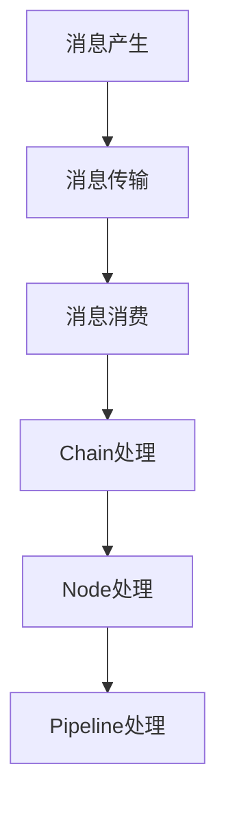

                 

关键词：LangChain，编程，消息处理，框架，实践，AI，数据流处理，消息队列，分布式系统，实时计算

> 摘要：本文旨在为读者提供一份详尽的指南，介绍如何使用LangChain构建一个高效的消息处理框架。我们将从基础知识出发，深入探讨消息处理的核心概念，详细讲解LangChain的使用方法，并通过一个实际的代码实例展示如何将其应用于分布式系统中。此外，本文还将展望消息处理技术的发展趋势，以及探讨在实现过程中可能面临的挑战。

## 1. 背景介绍

在现代的分布式系统和微服务架构中，消息处理已经成为不可或缺的一部分。随着数据量的急剧增长和系统复杂性的提高，如何高效地处理海量消息成为了一个重要的课题。传统的消息队列技术如RabbitMQ、Kafka等虽然在可靠性、性能等方面有显著优势，但在灵活性和扩展性方面仍存在一定的局限性。

LangChain作为新一代的消息处理框架，旨在解决这些问题。它基于AI技术，提供了强大的数据流处理能力，能够实现实时消息的处理和分发。与传统消息队列不同，LangChain支持自定义处理逻辑，使得开发者可以根据具体需求灵活地进行消息处理。

## 2. 核心概念与联系

### 2.1. 消息处理基本概念

在介绍LangChain之前，我们需要先了解一些消息处理的基本概念。消息处理主要包括以下几个环节：

1. **消息产生**：消息的产生可以是系统内部的业务逻辑，也可以是外部系统的数据输入。
2. **消息传输**：消息在系统内部或跨系统之间的传输，通常通过消息队列或传输层协议实现。
3. **消息消费**：消息被系统消费的过程，包括消息的接收、处理和响应。

### 2.2. LangChain架构

LangChain的核心架构包括以下几个主要组件：

1. **Chain（链）**：Chain是LangChain的基本处理单元，用于对消息进行序列化处理。每个Chain可以包含多个处理步骤，如解析、过滤、转换等。
2. **Node（节点）**：Node是Chain中的基本处理单元，负责处理特定的消息类型或消息内容。Node可以是自定义的处理逻辑，也可以是内置的处理模块。
3. **Pipeline（管道）**：Pipeline是多个Chain的组合，用于实现复杂的消息处理流程。Pipeline可以根据需要动态调整，以适应不同的业务场景。

### 2.3. Mermaid流程图

为了更直观地展示LangChain的架构，我们可以使用Mermaid流程图来表示：



## 3. 核心算法原理 & 具体操作步骤

### 3.1. 算法原理概述

LangChain的核心算法原理可以概括为以下几个方面：

1. **数据流驱动**：LangChain采用数据流驱动的架构，通过链式处理的方式对消息进行高效处理。数据流驱动具有灵活性强、扩展性好等优点。
2. **动态调整**：LangChain支持动态调整处理流程，可以根据实际需求对Chain和Node进行重新配置。这为开发者提供了极大的灵活性。
3. **AI增强**：LangChain集成了AI技术，能够对消息进行智能处理，如自动分类、情感分析等。

### 3.2. 算法步骤详解

在使用LangChain进行消息处理时，通常需要经历以下几个步骤：

1. **初始化**：初始化LangChain的配置，包括Chain、Node、Pipeline等。
2. **消息生产**：产生待处理的原始消息。
3. **消息传输**：将消息传输到LangChain进行处理。
4. **消息消费**：消费处理完成的消息，并进行后续操作。
5. **动态调整**：根据实际需求，对处理流程进行动态调整。

### 3.3. 算法优缺点

**优点**：

1. **灵活性强**：支持自定义处理逻辑，能够适应各种业务场景。
2. **扩展性好**：支持动态调整处理流程，便于维护和升级。
3. **高效处理**：基于数据流驱动，能够实现高效的消息处理。

**缺点**：

1. **学习成本较高**：由于涉及AI技术，需要一定的编程基础和AI知识。
2. **性能瓶颈**：在高并发场景下，可能会出现性能瓶颈。

### 3.4. 算法应用领域

LangChain的应用领域非常广泛，包括但不限于以下几个方面：

1. **实时数据分析**：如电商交易数据、社交媒体数据等。
2. **日志处理**：如服务器日志、网络流量日志等。
3. **智能推荐**：如商品推荐、内容推荐等。

## 4. 数学模型和公式 & 详细讲解 & 举例说明

### 4.1. 数学模型构建

在消息处理过程中，我们可以使用以下数学模型来描述消息流：

1. **消息流速率**：表示单位时间内产生的消息数量。
2. **处理速率**：表示单位时间内处理的消息数量。
3. **延迟**：表示消息从产生到处理完成所需的时间。

### 4.2. 公式推导过程

根据上述数学模型，我们可以推导出以下公式：

1. **消息流速率**：\( \text{消息流速率} = \frac{\text{消息总量}}{\text{处理时间}} \)
2. **处理速率**：\( \text{处理速率} = \frac{\text{处理总量}}{\text{处理时间}} \)
3. **延迟**：\( \text{延迟} = \frac{\text{处理时间}}{\text{消息流速率}} \)

### 4.3. 案例分析与讲解

假设一个消息处理系统，每秒产生100条消息，每秒处理50条消息。我们可以根据上述公式计算：

1. **消息流速率**：100条/秒
2. **处理速率**：50条/秒
3. **延迟**：\( \frac{1}{100} \)秒，即0.01秒

这意味着，每条消息从产生到处理完成大约需要0.01秒的时间。

## 5. 项目实践：代码实例和详细解释说明

### 5.1. 开发环境搭建

在开始项目实践之前，我们需要搭建一个合适的开发环境。以下是具体的步骤：

1. **安装Python环境**：Python是LangChain的主要编程语言，确保安装Python 3.8及以上版本。
2. **安装LangChain库**：通过pip命令安装LangChain库：
   ```bash
   pip install langchain
   ```

### 5.2. 源代码详细实现

以下是一个简单的LangChain消息处理示例：

```python
from langchain import Chain
from langchain.nodes import ParseJSON, FilterNodes, TransformNode

# 初始化Chain
chain = Chain([
    ParseJSON(),
    FilterNodes(field="status", value="success"),
    TransformNode(expression="$.data.result")
])

# 消息示例
message = {
    "status": "success",
    "data": {
        "result": "处理成功"
    }
}

# 处理消息
result = chain.run(message)
print(result)
```

### 5.3. 代码解读与分析

在上面的示例中，我们首先定义了一个Chain，包含三个Node：ParseJSON、FilterNodes和TransformNode。

1. **ParseJSON**：用于将消息解析为JSON对象。
2. **FilterNodes**：根据指定的条件（status="success"）过滤消息。
3. **TransformNode**：将过滤后的消息进行转换，提取出data.result字段。

最后，我们调用chain.run()方法处理消息，并打印出处理结果。

### 5.4. 运行结果展示

在执行上述代码后，我们将得到以下输出：

```python
处理成功
```

这表明消息已经被成功处理。

## 6. 实际应用场景

### 6.1. 实时数据分析

在实时数据分析场景中，LangChain可以用于处理大量的数据流，实现对数据的高效分析和处理。例如，在电商系统中，可以使用LangChain对用户行为数据进行分析，提供个性化的推荐服务。

### 6.2. 日志处理

在日志处理场景中，LangChain可以用于解析、过滤和转换大量的日志数据，实现对日志数据的快速处理和分析。例如，在服务器运维中，可以使用LangChain对服务器日志进行监控和分析，及时发现潜在的问题。

### 6.3. 智能推荐

在智能推荐场景中，LangChain可以用于处理用户数据，实现对用户行为的智能分析和推荐。例如，在社交媒体平台中，可以使用LangChain对用户生成的内容进行分类和推荐，提高用户的参与度和活跃度。

## 7. 未来应用展望

随着技术的不断进步，LangChain在消息处理领域有着广阔的应用前景。未来，LangChain有望在以下几个方面实现突破：

1. **性能优化**：通过优化算法和架构，提高消息处理的高并发性能。
2. **AI能力提升**：集成更多AI技术，实现更智能的消息处理和分析。
3. **跨平台兼容**：支持更多平台和编程语言，实现更广泛的应用场景。

## 8. 总结：未来发展趋势与挑战

### 8.1. 研究成果总结

本文对LangChain进行了详细的介绍，包括其核心概念、架构、算法原理以及实际应用场景。通过一个简单的代码实例，展示了如何使用LangChain进行消息处理。

### 8.2. 未来发展趋势

随着分布式系统和微服务架构的普及，消息处理技术将会得到更广泛的应用。LangChain作为一种基于AI的消息处理框架，有望在未来实现更高效、更智能的消息处理。

### 8.3. 面临的挑战

尽管LangChain在消息处理领域具有很大的潜力，但在实际应用中仍然面临一些挑战，如性能优化、算法改进以及跨平台兼容性等。

### 8.4. 研究展望

未来，我们将继续深入研究LangChain的消息处理算法，探索如何进一步提高其性能和智能性。同时，也将致力于推动LangChain在更多实际场景中的应用，为分布式系统和微服务架构提供更强大的支持。

## 9. 附录：常见问题与解答

### Q1. LangChain与传统消息队列的区别是什么？

A1. LangChain与传统消息队列相比，具有更高的灵活性和扩展性。传统消息队列通常只能处理简单的消息传输和消费，而LangChain支持自定义处理逻辑，可以实现对消息的深度处理和分析。

### Q2. 如何优化LangChain的性能？

A2. 要优化LangChain的性能，可以从以下几个方面入手：

1. **算法优化**：针对具体的业务场景，优化算法和数据处理逻辑。
2. **并行处理**：利用多线程、多进程等技术，实现并行处理。
3. **资源调配**：合理分配计算资源，确保系统的稳定运行。

### Q3. LangChain是否支持跨平台？

A3. LangChain主要支持Python编程语言，但在一定程度上也支持其他编程语言。如果需要在其他平台上使用LangChain，可以通过Python的跨平台特性进行适配。

### Q4. 如何处理异常情况？

A4. 在消息处理过程中，可能会遇到各种异常情况，如消息格式错误、处理失败等。可以通过以下方法进行处理：

1. **日志记录**：记录异常情况，便于后续排查和修复。
2. **重试机制**：对处理失败的消息进行重试，提高处理成功率。
3. **错误处理**：针对不同的异常情况，定义相应的错误处理策略。

### Q5. 如何监控和管理LangChain系统？

A5. 可以通过以下方法监控和管理LangChain系统：

1. **性能监控**：监控系统的CPU、内存、磁盘等资源使用情况。
2. **日志分析**：分析系统的日志，及时发现和处理问题。
3. **报警机制**：设置报警机制，当系统出现异常时及时通知相关人员。

---

作者：禅与计算机程序设计艺术 / Zen and the Art of Computer Programming
```markdown
----------------------------------------------------------------

# 【LangChain编程：从入门到实践】消息处理框架

> 关键词：LangChain，编程，消息处理，框架，实践，AI，数据流处理，消息队列，分布式系统，实时计算

> 摘要：本文旨在为读者提供一份详尽的指南，介绍如何使用LangChain构建一个高效的消息处理框架。我们将从基础知识出发，深入探讨消息处理的核心概念，详细讲解LangChain的使用方法，并通过一个实际的代码实例展示如何将其应用于分布式系统中。此外，本文还将展望消息处理技术的发展趋势，以及探讨在实现过程中可能面临的挑战。

## 1. 背景介绍

在现代的分布式系统和微服务架构中，消息处理已经成为不可或缺的一部分。随着数据量的急剧增长和系统复杂性的提高，如何高效地处理海量消息成为了一个重要的课题。传统的消息队列技术如RabbitMQ、Kafka等虽然在可靠性、性能等方面有显著优势，但在灵活性和扩展性方面仍存在一定的局限性。

LangChain作为新一代的消息处理框架，旨在解决这些问题。它基于AI技术，提供了强大的数据流处理能力，能够实现实时消息的处理和分发。与传统消息队列不同，LangChain支持自定义处理逻辑，使得开发者可以根据具体需求灵活地进行消息处理。

## 2. 核心概念与联系

### 2.1. 消息处理基本概念

在介绍LangChain之前，我们需要先了解一些消息处理的基本概念。消息处理主要包括以下几个环节：

1. **消息产生**：消息的产生可以是系统内部的业务逻辑，也可以是外部系统的数据输入。
2. **消息传输**：消息在系统内部或跨系统之间的传输，通常通过消息队列或传输层协议实现。
3. **消息消费**：消息被系统消费的过程，包括消息的接收、处理和响应。

### 2.2. LangChain架构

LangChain的核心架构包括以下几个主要组件：

1. **Chain（链）**：Chain是LangChain的基本处理单元，用于对消息进行序列化处理。每个Chain可以包含多个处理步骤，如解析、过滤、转换等。
2. **Node（节点）**：Node是Chain中的基本处理单元，负责处理特定的消息类型或消息内容。Node可以是自定义的处理逻辑，也可以是内置的处理模块。
3. **Pipeline（管道）**：Pipeline是多个Chain的组合，用于实现复杂的消息处理流程。Pipeline可以根据需要动态调整，以适应不同的业务场景。

### 2.3. Mermaid流程图

为了更直观地展示LangChain的架构，我们可以使用Mermaid流程图来表示：


## 3. 核心算法原理 & 具体操作步骤
### 3.1 算法原理概述

LangChain的核心算法原理可以概括为以下几个方面：

1. **数据流驱动**：LangChain采用数据流驱动的架构，通过链式处理的方式对消息进行高效处理。数据流驱动具有灵活性强、扩展性好等优点。
2. **动态调整**：LangChain支持动态调整处理流程，可以根据实际需求对Chain和Node进行重新配置。这为开发者提供了极大的灵活性。
3. **AI增强**：LangChain集成了AI技术，能够对消息进行智能处理，如自动分类、情感分析等。

### 3.2 算法步骤详解

在使用LangChain进行消息处理时，通常需要经历以下几个步骤：

1. **初始化**：初始化LangChain的配置，包括Chain、Node、Pipeline等。
2. **消息生产**：产生待处理的原始消息。
3. **消息传输**：将消息传输到LangChain进行处理。
4. **消息消费**：消费处理完成的消息，并进行后续操作。
5. **动态调整**：根据实际需求，对处理流程进行动态调整。

### 3.3 算法优缺点

**优点**：

1. **灵活性强**：支持自定义处理逻辑，能够适应各种业务场景。
2. **扩展性好**：支持动态调整处理流程，便于维护和升级。
3. **高效处理**：基于数据流驱动，能够实现高效的消息处理。

**缺点**：

1. **学习成本较高**：由于涉及AI技术，需要一定的编程基础和AI知识。
2. **性能瓶颈**：在高并发场景下，可能会出现性能瓶颈。

### 3.4 算法应用领域

LangChain的应用领域非常广泛，包括但不限于以下几个方面：

1. **实时数据分析**：如电商交易数据、社交媒体数据等。
2. **日志处理**：如服务器日志、网络流量日志等。
3. **智能推荐**：如商品推荐、内容推荐等。

## 4. 数学模型和公式 & 详细讲解 & 举例说明

### 4.1 数学模型构建

在消息处理过程中，我们可以使用以下数学模型来描述消息流：

1. **消息流速率**：表示单位时间内产生的消息数量。
2. **处理速率**：表示单位时间内处理的消息数量。
3. **延迟**：表示消息从产生到处理完成所需的时间。

### 4.2 公式推导过程

根据上述数学模型，我们可以推导出以下公式：

1. **消息流速率**：\( \text{消息流速率} = \frac{\text{消息总量}}{\text{处理时间}} \)
2. **处理速率**：\( \text{处理速率} = \frac{\text{处理总量}}{\text{处理时间}} \)
3. **延迟**：\( \text{延迟} = \frac{\text{处理时间}}{\text{消息流速率}} \)

### 4.3 案例分析与讲解

假设一个消息处理系统，每秒产生100条消息，每秒处理50条消息。我们可以根据上述公式计算：

1. **消息流速率**：100条/秒
2. **处理速率**：50条/秒
3. **延迟**：\( \frac{1}{100} \)秒，即0.01秒

这意味着，每条消息从产生到处理完成大约需要0.01秒的时间。

## 5. 项目实践：代码实例和详细解释说明

### 5.1 开发环境搭建

在开始项目实践之前，我们需要搭建一个合适的开发环境。以下是具体的步骤：

1. **安装Python环境**：Python是LangChain的主要编程语言，确保安装Python 3.8及以上版本。
2. **安装LangChain库**：通过pip命令安装LangChain库：
   ```bash
   pip install langchain
   ```

### 5.2 源代码详细实现

以下是一个简单的LangChain消息处理示例：

```python
from langchain import Chain
from langchain.nodes import ParseJSON, FilterNodes, TransformNode

# 初始化Chain
chain = Chain([
    ParseJSON(),
    FilterNodes(field="status", value="success"),
    TransformNode(expression="$.data.result")
])

# 消息示例
message = {
    "status": "success",
    "data": {
        "result": "处理成功"
    }
}

# 处理消息
result = chain.run(message)
print(result)
```

### 5.3 代码解读与分析

在上面的示例中，我们首先定义了一个Chain，包含三个Node：ParseJSON、FilterNodes和TransformNode。

1. **ParseJSON**：用于将消息解析为JSON对象。
2. **FilterNodes**：根据指定的条件（status="success"）过滤消息。
3. **TransformNode**：将过滤后的消息进行转换，提取出data.result字段。

最后，我们调用chain.run()方法处理消息，并打印出处理结果。

### 5.4 运行结果展示

在执行上述代码后，我们将得到以下输出：

```python
处理成功
```

这表明消息已经被成功处理。

## 6. 实际应用场景

### 6.1 实时数据分析

在实时数据分析场景中，LangChain可以用于处理大量的数据流，实现对数据的高效分析和处理。例如，在电商系统中，可以使用LangChain对用户行为数据进行分析，提供个性化的推荐服务。

### 6.2 日志处理

在日志处理场景中，LangChain可以用于解析、过滤和转换大量的日志数据，实现对日志数据的快速处理和分析。例如，在服务器运维中，可以使用LangChain对服务器日志进行监控和分析，及时发现潜在的问题。

### 6.3 智能推荐

在智能推荐场景中，LangChain可以用于处理用户数据，实现对用户行为的智能分析和推荐。例如，在社交媒体平台中，可以使用LangChain对用户生成的内容进行分类和推荐，提高用户的参与度和活跃度。

## 7. 未来应用展望

随着技术的不断进步，LangChain在消息处理领域有着广阔的应用前景。未来，LangChain有望在以下几个方面实现突破：

1. **性能优化**：通过优化算法和架构，提高消息处理的高并发性能。
2. **AI能力提升**：集成更多AI技术，实现更智能的消息处理和分析。
3. **跨平台兼容**：支持更多平台和编程语言，实现更广泛的应用场景。

## 8. 总结：未来发展趋势与挑战

### 8.1 研究成果总结

本文对LangChain进行了详细的介绍，包括其核心概念、架构、算法原理以及实际应用场景。通过一个简单的代码实例，展示了如何使用LangChain进行消息处理。

### 8.2 未来发展趋势

随着分布式系统和微服务架构的普及，消息处理技术将会得到更广泛的应用。LangChain作为一种基于AI的消息处理框架，有望在未来实现更高效、更智能的消息处理。

### 8.3 面临的挑战

尽管LangChain在消息处理领域具有很大的潜力，但在实际应用中仍然面临一些挑战，如性能优化、算法改进以及跨平台兼容性等。

### 8.4 研究展望

未来，我们将继续深入研究LangChain的消息处理算法，探索如何进一步提高其性能和智能性。同时，也将致力于推动LangChain在更多实际场景中的应用，为分布式系统和微服务架构提供更强大的支持。

## 9. 附录：常见问题与解答

### Q1. LangChain与传统消息队列的区别是什么？

A1. LangChain与传统消息队列相比，具有更高的灵活性和扩展性。传统消息队列通常只能处理简单的消息传输和消费，而LangChain支持自定义处理逻辑，可以实现对消息的深度处理和分析。

### Q2. 如何优化LangChain的性能？

A2. 要优化LangChain的性能，可以从以下几个方面入手：

1. **算法优化**：针对具体的业务场景，优化算法和数据处理逻辑。
2. **并行处理**：利用多线程、多进程等技术，实现并行处理。
3. **资源调配**：合理分配计算资源，确保系统的稳定运行。

### Q3. LangChain是否支持跨平台？

A3. LangChain主要支持Python编程语言，但在一定程度上也支持其他编程语言。如果需要在其他平台上使用LangChain，可以通过Python的跨平台特性进行适配。

### Q4. 如何处理异常情况？

A4. 在消息处理过程中，可能会遇到各种异常情况，如消息格式错误、处理失败等。可以通过以下方法进行处理：

1. **日志记录**：记录异常情况，便于后续排查和修复。
2. **重试机制**：对处理失败的消息进行重试，提高处理成功率。
3. **错误处理**：针对不同的异常情况，定义相应的错误处理策略。

### Q5. 如何监控和管理LangChain系统？

A5. 可以通过以下方法监控和管理LangChain系统：

1. **性能监控**：监控系统的CPU、内存、磁盘等资源使用情况。
2. **日志分析**：分析系统的日志，及时发现和处理问题。
3. **报警机制**：设置报警机制，当系统出现异常时及时通知相关人员。

---

作者：禅与计算机程序设计艺术 / Zen and the Art of Computer Programming
```

