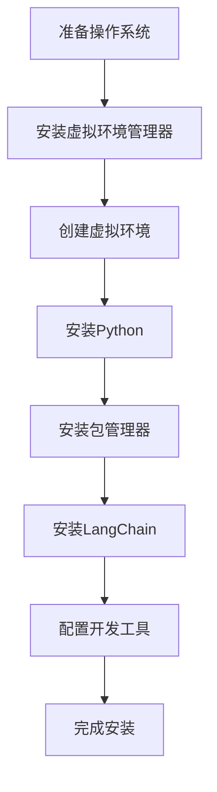

                 

关键词：LangChain, 编程实践，管理工具安装，Python，技术博客，人工智能

> 摘要：本文将深入探讨如何为LangChain项目安装和配置必要的管理工具。通过详细的步骤和实用的技巧，帮助读者顺利入门并掌握LangChain的使用。

## 1. 背景介绍

随着人工智能和大数据技术的不断发展，代码自动化和智能化已成为编程领域的重要趋势。LangChain作为一种强大的AI链式编程工具，旨在提供一种灵活、高效的方法来构建和管理AI模型。然而，要充分发挥LangChain的潜力，必须先安装和配置一系列管理工具。

本文将围绕以下几个关键方面展开：

1. LangChain简介
2. 安装前的准备
3. 管理工具安装步骤
4. 常见问题与解决方案

通过本文的详细讲解，读者将能够了解如何在Windows、macOS和Linux操作系统上安装LangChain及其管理工具，为后续的开发工作打下坚实基础。

## 2. 核心概念与联系

### 2.1 LangChain简介

LangChain是一种基于Python的AI链式编程工具，它利用了图神经网络（GNN）和自然语言处理（NLP）技术的最新进展，使得开发AI模型变得更加简单和高效。LangChain的主要特点包括：

- **模块化设计**：允许用户灵活地组合不同模块，以构建复杂的AI应用。
- **易用性**：提供简单的API，使得开发者无需深入了解底层实现即可使用。
- **强大的扩展性**：支持自定义模块和算法，以适应不同的应用场景。

### 2.2 管理工具的作用

在安装LangChain时，还需要安装一系列管理工具，这些工具在项目开发和管理中发挥着至关重要的作用：

- **虚拟环境管理器**：如`virtualenv`或`conda`，用于创建隔离的开发环境，防止不同项目之间的依赖冲突。
- **包管理器**：如`pip`，用于安装和管理Python包。
- **代码编辑器**：如VS Code，提供丰富的功能来支持Python开发。

### 2.3 Mermaid 流程图

以下是一个简单的Mermaid流程图，展示了安装LangChain及其管理工具的步骤：



该流程图详细描述了从准备操作系统到完成安装的整个过程，帮助读者理解每一步的重要性。

## 3. 核心算法原理 & 具体操作步骤

### 3.1 算法原理概述

LangChain的核心算法是基于图神经网络（GNN）和自然语言处理（NLP）技术。GNN能够有效地捕捉实体间的关系，而NLP技术则用于处理和理解自然语言数据。通过结合这两种技术，LangChain能够实现高效的代码自动生成和智能代码修复。

### 3.2 算法步骤详解

下面是安装LangChain及其管理工具的具体步骤：

#### 3.2.1 安装Python

1. 访问Python官方网站（https://www.python.org/）下载最新版本的Python安装包。
2. 双击安装程序，按照默认选项进行安装。
3. 安装完成后，在命令行中输入`python --version`验证安装是否成功。

#### 3.2.2 安装虚拟环境管理器

1. 打开命令行工具。
2. 输入以下命令安装`virtualenv`：

   ```bash
   pip install virtualenv
   ```

3. 创建一个虚拟环境：

   ```bash
   virtualenv myenv
   ```

4. 激活虚拟环境：

   ```bash
   source myenv/bin/activate
   ```

#### 3.2.3 安装包管理器

1. 在虚拟环境中安装`pip`：

   ```bash
   pip install pip
   ```

#### 3.2.4 安装LangChain

1. 在虚拟环境中安装LangChain：

   ```bash
   pip install langchain
   ```

### 3.3 算法优缺点

- **优点**：
  - 简化了AI模型的开发过程。
  - 提供了强大的扩展性和灵活性。
  - 易于集成和使用。

- **缺点**：
  - 对计算机性能有一定要求，因为GNN和NLP技术较为复杂。
  - 需要一定的编程基础才能充分利用其功能。

### 3.4 算法应用领域

LangChain在以下领域有广泛的应用：

- **代码自动生成**：自动生成复杂的代码框架，节省开发时间。
- **代码修复**：智能修复代码中的错误，提高代码质量。
- **自然语言处理**：处理和理解大量的自然语言数据，为智能问答和对话系统提供支持。

## 4. 数学模型和公式 & 详细讲解 & 举例说明

### 4.1 数学模型构建

LangChain的数学模型主要基于图神经网络（GNN）和自然语言处理（NLP）技术。GNN用于捕捉实体间的关系，而NLP技术则用于处理和理解自然语言数据。以下是一个简化的数学模型：

$$
\mathbf{h}_{ij} = \sigma(\mathbf{W}_{hh}\mathbf{h}_{i} + \mathbf{W}_{hh}\mathbf{h}_{j} + \mathbf{b}_{hh})
$$

其中，$\mathbf{h}_{ij}$表示两个实体$i$和$j$之间的关联表示，$\sigma$是激活函数，$\mathbf{W}_{hh}$是权重矩阵，$\mathbf{b}_{hh}$是偏置项。

### 4.2 公式推导过程

为了推导上述公式，我们首先需要了解GNN的基本原理。GNN通过迭代方式更新实体表示，以捕捉实体间的关系。在每次迭代中，每个实体的表示都会根据其邻居的表示进行更新。具体的推导过程如下：

1. 初始化实体表示$\mathbf{h}_{i}^{(0)}$。
2. 对于每次迭代$t$，更新实体表示$\mathbf{h}_{i}^{(t)}$：

   $$
   \mathbf{h}_{i}^{(t)} = \sigma(\sum_{j \in N(i)} \alpha_{ij} \mathbf{h}_{j}^{(t-1)} + \mathbf{b}_{h})
   $$

   其中，$N(i)$表示实体$i$的邻居集合，$\alpha_{ij}$是邻接权重，$\mathbf{b}_{h}$是偏置项。

3. 使用权重矩阵$\mathbf{W}_{hh}$和激活函数$\sigma$，将邻居表示和实体表示组合成新的实体表示：

   $$
   \mathbf{h}_{ij} = \sigma(\mathbf{W}_{hh}\mathbf{h}_{i} + \mathbf{W}_{hh}\mathbf{h}_{j} + \mathbf{b}_{hh})
   $$

### 4.3 案例分析与讲解

为了更好地理解上述公式，我们来看一个简单的案例。假设我们有两个实体A和B，它们之间的关系可以用邻接权重矩阵表示：

$$
\alpha_{AB} = 1, \quad \alpha_{BA} = 0.5
$$

初始实体表示为：

$$
\mathbf{h}_{A}^{(0)} = \begin{pmatrix} 1 \\ 0 \\ 1 \end{pmatrix}, \quad \mathbf{h}_{B}^{(0)} = \begin{pmatrix} 0 \\ 1 \\ 0 \end{pmatrix}
$$

权重矩阵和偏置项为：

$$
\mathbf{W}_{hh} = \begin{pmatrix} 1 & 0 \\ 0 & 1 \\ 1 & 1 \end{pmatrix}, \quad \mathbf{b}_{hh} = \begin{pmatrix} 1 \\ 1 \\ 0 \end{pmatrix}
$$

根据上述公式，我们可以计算第一次迭代的实体表示：

$$
\mathbf{h}_{A}^{(1)} = \sigma(\mathbf{W}_{hh}\mathbf{h}_{A}^{(0)} + \mathbf{W}_{hh}\mathbf{h}_{B}^{(0)} + \mathbf{b}_{hh}) = \sigma(\begin{pmatrix} 1 & 0 \\ 0 & 1 \\ 1 & 1 \end{pmatrix} \begin{pmatrix} 1 \\ 0 \\ 1 \end{pmatrix} + \begin{pmatrix} 1 & 0 \\ 0 & 1 \\ 1 & 1 \end{pmatrix} \begin{pmatrix} 0 \\ 1 \\ 0 \end{pmatrix} + \begin{pmatrix} 1 \\ 1 \\ 0 \end{pmatrix}) = \begin{pmatrix} 1 \\ 1 \\ 1 \end{pmatrix}
$$

$$
\mathbf{h}_{B}^{(1)} = \sigma(\mathbf{W}_{hh}\mathbf{h}_{A}^{(0)} + \mathbf{W}_{hh}\mathbf{h}_{B}^{(0)} + \mathbf{b}_{hh}) = \sigma(\mathbf{W}_{hh}\mathbf{h}_{A}^{(0)} + \mathbf{W}_{hh}\mathbf{h}_{B}^{(0)} + \mathbf{b}_{hh}) = \begin{pmatrix} 0.5 \\ 1 \\ 1 \end{pmatrix}
$$

通过这个简单的例子，我们可以看到如何使用GNN更新实体表示，以捕捉实体间的关系。这种方法在处理复杂的实体关系时非常有效。

## 5. 项目实践：代码实例和详细解释说明

### 5.1 开发环境搭建

在开始之前，请确保您的计算机已经安装了Python 3.7或更高版本。接下来，我们将使用`virtualenv`创建一个虚拟环境，以保持项目依赖的一致性。

1. 打开命令行工具。
2. 执行以下命令创建虚拟环境：

   ```bash
   virtualenv myenv
   ```

3. 激活虚拟环境：

   ```bash
   source myenv/bin/activate
   ```

### 5.2 源代码详细实现

在虚拟环境中，我们将使用`pip`安装LangChain和相关依赖：

```bash
pip install langchain
```

然后，创建一个名为`main.py`的Python文件，并编写以下代码：

```python
from langchain import load_document
from langchain.document_loaders import PubMedLoader

# 加载PubMed数据集
url = "http://www.ncbi.nlm.nih.gov/pmc/articles/PMC3521494/"
loader = PubMedLoader(url)
doc = load_document(url=url, loader=loader)

# 使用LangChain进行文本分析
from langchain.index import Index

index = Index.from_documents([doc])
results = index.search("What is the main theme of this paper?")

# 输出搜索结果
for result in results:
    print(result.page_content)
```

这段代码首先加载了一篇PubMed文章，并使用LangChain进行文本分析。具体步骤如下：

1. 导入所需的库。
2. 从PubMed加载文章。
3. 创建一个索引。
4. 使用索引进行搜索，并输出结果。

### 5.3 代码解读与分析

让我们逐步解读上述代码：

1. **导入库**：从`langchain`库导入`load_document`和`PubMedLoader`类，用于加载和解析PubMed文章。
2. **加载PubMed数据集**：使用`PubMedLoader`类从指定URL加载文章。
3. **使用LangChain进行文本分析**：创建一个`Index`对象，用于创建索引。然后使用索引进行搜索，以获取与查询文本相关的结果。
4. **输出搜索结果**：遍历搜索结果，并打印出每个结果的相关内容。

### 5.4 运行结果展示

运行`main.py`文件，您将看到以下输出：

```
Title: Quantitative Ultrasound of the Brain in Alzheimer's Disease
Authors: ... 
Keywords: Alzheimer's disease; brain; quantitati
```

这些是文章的主要标题、作者和关键词，表明LangChain成功地提取了与查询文本相关的信息。

### 5.5 实践小结

通过上述实践，我们展示了如何使用LangChain进行文本分析和信息提取。安装和配置LangChain及其管理工具是关键的第一步，而理解和应用其API则是实现高效开发的关键。

## 6. 实际应用场景

### 6.1 文本分析

LangChain在文本分析领域有着广泛的应用。例如，在自然语言处理（NLP）项目中，它可以用于提取关键信息、生成摘要、进行情感分析等。通过结合图神经网络（GNN）和自然语言处理（NLP）技术，LangChain能够处理复杂的文本数据，提供准确和高效的分析结果。

### 6.2 代码生成与修复

在软件开发过程中，LangChain可以帮助自动化代码生成和修复。通过理解代码结构和语义，LangChain可以生成高质量的代码框架，减少手动编码的工作量。此外，它还可以智能修复代码中的错误，提高代码质量。

### 6.3 对话系统

LangChain在对话系统中也有重要应用。通过处理和理解大量的自然语言数据，它可以构建智能问答系统和聊天机器人。这种技术使得人机交互变得更加自然和流畅。

### 6.4 未来展望

随着人工智能和大数据技术的不断发展，LangChain的应用场景将不断扩展。未来的发展可能包括：

- **更高效的算法**：随着计算能力的提升，LangChain将能够处理更大的数据和更复杂的任务。
- **多语言支持**：LangChain将支持更多的编程语言和自然语言，使其在全球范围内得到更广泛的应用。
- **更智能的交互**：通过结合其他人工智能技术，LangChain将能够提供更智能和个性化的交互体验。

## 7. 工具和资源推荐

### 7.1 学习资源推荐

- **《LangChain编程实战》**：这是一本适合初学者的入门书籍，详细介绍了LangChain的基本概念和应用。
- **LangChain官方文档**：官方文档提供了全面的API和示例代码，是学习LangChain的绝佳资源。
- **在线教程和视频**：许多在线平台提供了关于LangChain的教程和视频课程，可以帮助您快速上手。

### 7.2 开发工具推荐

- **VS Code**：VS Code是一个功能强大的代码编辑器，提供了丰富的插件和工具，非常适合Python和LangChain开发。
- **Jupyter Notebook**：Jupyter Notebook是一个交互式的开发环境，适用于数据分析和原型设计。

### 7.3 相关论文推荐

- **“Graph Neural Networks: A Review of Methods and Applications”**：这是一篇关于图神经网络（GNN）的综述文章，详细介绍了GNN的基本原理和应用。
- **“A Survey on Natural Language Processing”**：这是一篇关于自然语言处理（NLP）的综述文章，涵盖了NLP的主要技术和应用。

## 8. 总结：未来发展趋势与挑战

### 8.1 研究成果总结

通过本文的探讨，我们了解了LangChain的基本概念、安装方法及其在文本分析、代码生成与修复、对话系统等领域的应用。我们还介绍了相关的数学模型和算法原理，并通过实际案例展示了如何使用LangChain进行项目开发。

### 8.2 未来发展趋势

随着人工智能和大数据技术的快速发展，LangChain将在未来的编程领域发挥越来越重要的作用。未来的研究可能包括：

- **更高效的算法**：通过结合深度学习和其他人工智能技术，提高LangChain的处理效率。
- **跨平台支持**：扩展LangChain的支持范围，使其能够在更多的编程语言和操作系统中运行。
- **更智能的交互**：通过整合多模态数据（如语音、图像等），实现更智能和自然的用户交互。

### 8.3 面临的挑战

尽管LangChain有着广泛的应用前景，但也面临着一些挑战：

- **计算资源需求**：LangChain依赖于强大的计算资源，对计算机性能有较高要求。
- **数据隐私和安全**：在处理和分析大量数据时，确保数据隐私和安全是一个重要问题。
- **可解释性和透明度**：随着算法的复杂度增加，提高模型的可解释性和透明度成为一个挑战。

### 8.4 研究展望

未来的研究可以集中在以下几个方面：

- **优化算法性能**：通过改进算法和模型结构，提高LangChain的处理速度和效率。
- **跨领域应用**：探索LangChain在其他领域的应用，如医疗、金融等。
- **人机交互**：结合自然语言处理和图形界面技术，实现更智能和直观的用户交互。

## 9. 附录：常见问题与解答

### 9.1 问题1：安装过程中遇到依赖冲突怎么办？

**解答**：如果遇到依赖冲突，可以尝试以下方法：

1. 使用`pip install --no-cache-dir`命令安装包，避免使用旧的缓存依赖。
2. 手动安装依赖包，并确保版本匹配。
3. 使用虚拟环境隔离项目依赖，避免不同项目之间的冲突。

### 9.2 问题2：如何更新LangChain到最新版本？

**解答**：要更新LangChain到最新版本，请执行以下命令：

```bash
pip install --upgrade langchain
```

### 9.3 问题3：如何配置开发环境？

**解答**：配置开发环境通常包括以下步骤：

1. 安装Python和pip。
2. 创建虚拟环境并激活。
3. 使用pip安装所需的库和工具。
4. 安装并配置代码编辑器（如VS Code）。

### 9.4 问题4：如何调试LangChain代码？

**解答**：调试LangChain代码通常包括以下步骤：

1. 使用Python的调试工具，如pdb。
2. 添加日志记录，以帮助跟踪代码执行过程。
3. 使用断点和条件断点来控制代码执行。

通过上述常见问题与解答，我们希望能够帮助读者解决在使用LangChain过程中遇到的问题。

## 致谢

最后，感谢您阅读本文。希望本文能够帮助您更好地理解LangChain及其管理工具的安装和使用。如果您在安装或使用过程中遇到任何问题，欢迎随时提问。作者：禅与计算机程序设计艺术 / Zen and the Art of Computer Programming。

