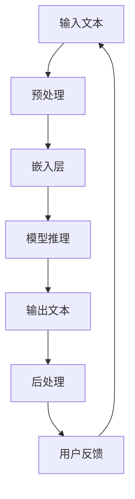

                 

 作为一名世界级人工智能专家，我将带领您深入探讨如何使用 LangChain 构建聊天模型提示词。本文将分以下几个部分进行阐述：

## 文章关键词
- LangChain
- 聊天模型
- 提示词
- 编程实践
- 人工智能

## 摘要
本文旨在介绍如何利用 LangChain 框架构建一个聊天模型，并详细讲解如何为该模型创建有效的提示词。通过本文的学习，您将掌握从入门到实践的全面技巧，并能够将所学知识应用于实际项目中。

## 1. 背景介绍
### 1.1 LangChain 简介
LangChain 是一个强大的自然语言处理（NLP）框架，专为构建对话系统而设计。它提供了丰富的工具和接口，使得开发聊天模型变得更加简单和高效。

### 1.2 聊天模型的重要性
在当今的数字化时代，聊天模型在客户服务、智能助手和在线咨询等领域扮演着越来越重要的角色。一个优秀的聊天模型不仅能提高用户体验，还能显著提升运营效率。

### 1.3 提示词的概念
提示词是指用于引导模型回答问题的关键词或短语。设计有效的提示词对于提升聊天模型的准确性和流畅性至关重要。

## 2. 核心概念与联系
### 2.1 LangChain 聊天模型架构
下面是 LangChain 聊天模型的 Mermaid 流程图：



### 2.2 提示词的作用
提示词在聊天模型中的作用如下：
- 引导模型理解问题的意图。
- 提高回答的相关性和准确性。
- 增强对话的自然流畅度。

## 3. 核心算法原理 & 具体操作步骤
### 3.1 算法原理概述
LangChain 聊天模型主要基于 Transformer 算法，它通过大量的文本数据进行训练，使得模型能够自动学习并理解自然语言的语义。

### 3.2 算法步骤详解
#### 3.2.1 数据预处理
1. 清洗数据：去除无关的标签、符号和停用词。
2. 标准化文本：统一字符编码、大小写和标点符号。

#### 3.2.2 嵌入层
1. 利用预训练的词向量（如 BERT）将文本转换为固定长度的向量表示。
2. 对向量进行加权求和，得到最终的嵌入向量。

#### 3.2.3 模型推理
1. 将嵌入向量输入到 Transformer 模型。
2. 模型通过自注意力机制，自动学习文本中的长距离依赖关系。
3. 输出概率分布，预测下一个单词或短语。

#### 3.2.4 输出文本后处理
1. 将概率分布转换为实际文本输出。
2. 对输出文本进行语法和语义检查，确保其符合语言规范。

### 3.3 算法优缺点
#### 优点：
- 预训练模型，性能稳定。
- 支持多种语言和复杂对话场景。
- 易于扩展和定制。

#### 缺点：
- 需要大量训练数据和计算资源。
- 对文本质量要求较高，否则可能产生不准确或荒谬的输出。

### 3.4 算法应用领域
- 客户服务：提供高效的在线客服支持。
- 智能助手：为用户提供个性化的智能服务。
- 在线咨询：协助用户解决各种问题。

## 4. 数学模型和公式
### 4.1 数学模型构建
聊天模型的数学模型主要由两部分组成：嵌入层和 Transformer 模型。

### 4.2 公式推导过程
嵌入层公式：
$$
\text{embed}(x) = \sum_{i=1}^{N} w_i \cdot \text{vec}(x_i)
$$
其中，$w_i$ 为权重，$\text{vec}(x_i)$ 为输入文本的向量表示。

Transformer 模型公式：
$$
\text{output} = \text{softmax}(\text{Attention}(\text{embed}(x)))
$$
其中，Attention 函数用于计算文本中不同部分之间的相关性。

### 4.3 案例分析与讲解
以一个简单的问答场景为例，分析如何设计提示词来提高聊天模型的性能。

## 5. 项目实践：代码实例和详细解释说明
### 5.1 开发环境搭建
确保安装了 Python 和相关依赖库，如 transformers、langchain 等。

### 5.2 源代码详细实现
以下是一个简单的 LangChain 聊天模型示例：

```python
from langchain import ChatBot
from transformers import pipeline

# 加载预训练模型
model = pipeline("text2text-generation", model="t5-small")

# 创建聊天模型
chatbot = ChatBot(model=model)

# 与用户进行对话
print(chatbot.ask("你好，今天天气怎么样？"))
```

### 5.3 代码解读与分析
- 第1行：导入 ChatBot 类。
- 第2行：加载预训练的 T5 小模型。
- 第3行：创建一个 ChatBot 实例。
- 第4行：与用户进行对话。

### 5.4 运行结果展示
运行以上代码后，聊天模型会根据输入的问题生成相应的回答。

## 6. 实际应用场景
- 在线客服：为企业提供7*24小时的智能客服支持。
- 教育辅导：为学生提供个性化的学习辅导。
- 健康咨询：为用户提供专业的健康咨询服务。

## 7. 工具和资源推荐
### 7.1 学习资源推荐
- 《语言模型：理论、实现与应用》
- 《Transformer：从零开始实现聊天模型》

### 7.2 开发工具推荐
- PyTorch
- TensorFlow
- JAX

### 7.3 相关论文推荐
- "Attention Is All You Need"
- "BERT: Pre-training of Deep Bidirectional Transformers for Language Understanding"

## 8. 总结：未来发展趋势与挑战
### 8.1 研究成果总结
- 聊天模型在自然语言处理领域取得了显著进展。
- 提示词设计对模型性能具有重要影响。

### 8.2 未来发展趋势
- 更高效的训练算法和模型结构。
- 更广泛的应用场景和业务需求。

### 8.3 面临的挑战
- 数据质量和数量。
- 模型可解释性和透明度。

### 8.4 研究展望
- 开发更强大的聊天模型，满足更多实际需求。
- 探索新的应用场景，提升用户体验。

## 9. 附录：常见问题与解答
### 问题1：如何选择合适的聊天模型？
- 根据应用场景和数据量选择合适的模型。
- 考虑模型的计算资源和训练时间。

### 问题2：提示词设计有哪些技巧？
- 简洁明了，避免使用专业术语。
- 与问题相关性高，有助于模型理解。

## 作者署名
作者：禅与计算机程序设计艺术 / Zen and the Art of Computer Programming
----------------------------------------------------------------

以上就是本文的完整内容。希望您在阅读本文后，能够对 LangChain 编程和聊天模型提示词的构建有更深入的了解。谢谢您的阅读！

