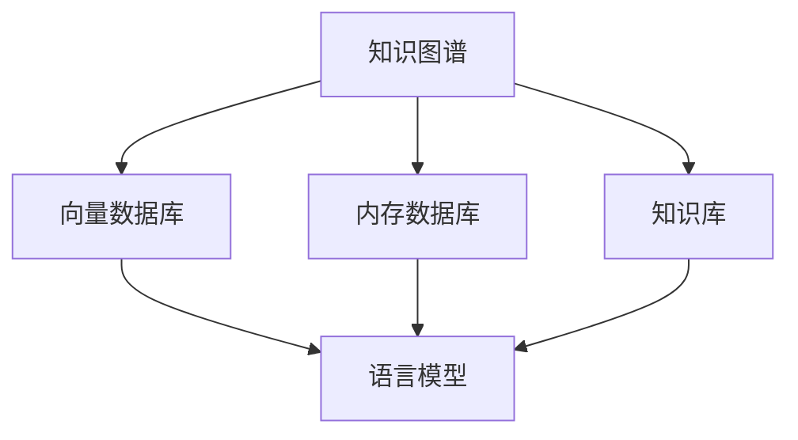

                 

关键词：LangChain, 记忆组件，编程实践，AI，数据管理

> 摘要：本文旨在深入探讨LangChain框架中的记忆组件，解析其原理、架构与应用。通过详细讲解核心算法原理、具体操作步骤，结合实际项目实践，为读者提供一次从理论到实践的全面学习体验。

## 1. 背景介绍

在当今快速发展的AI领域，语言模型已经成为许多应用的核心组件。从自然语言处理（NLP）到对话系统，语言模型无处不在。然而，随着应用场景的多样化，如何高效地管理语言模型的知识记忆，成为了一个重要的课题。为此，我们引入了LangChain框架，其独特的记忆组件设计，为我们提供了一种创新的解决方案。

记忆组件是LangChain框架中的一个核心部分，它旨在帮助开发者构建能够持久存储、检索和更新知识的数据结构。通过记忆组件，我们可以实现以下几个关键目标：

1. **知识持久化**：将语言模型的知识存储在持久化的数据库中，确保知识不会因模型重置而丢失。
2. **快速检索**：提供高效的知识检索机制，确保用户能够快速找到所需信息。
3. **知识更新**：支持知识的动态更新，确保模型的知识库能够实时反映最新的信息。

## 2. 核心概念与联系

为了更好地理解记忆组件，我们需要先了解一些核心概念和其相互之间的联系。以下是记忆组件相关的一些基本概念和架构图：

### 2.1 核心概念

- **知识图谱**：用于表示知识的一种图形化数据结构，它通过节点和边来表示实体及其关系。
- **向量数据库**：用于存储和检索嵌入向量的数据库，如Faiss、Elasticsearch等。
- **内存数据库**：用于存储小规模数据的内存数据库，如Redis。
- **知识库**：由多个知识单元组成的集合，用于存储和管理语言模型的知识。

### 2.2 架构联系



在上图中，知识图谱、向量数据库、内存数据库和知识库共同构成了记忆组件的架构基础。知识图谱用于表示和存储语言模型的知识；向量数据库用于高效地存储和检索嵌入向量；内存数据库用于存储实时更新的知识；知识库则是一个集合，包含了所有的知识单元。

## 3. 核心算法原理 & 具体操作步骤

### 3.1 算法原理概述

记忆组件的核心算法主要包括以下几部分：

1. **知识存储**：将知识以图形化的方式存储在知识图谱中。
2. **知识检索**：通过向量数据库和内存数据库实现知识的快速检索。
3. **知识更新**：通过内存数据库实现知识的动态更新。

### 3.2 算法步骤详解

1. **知识存储**：
    - **步骤1**：将知识以节点和边的形式构建成知识图谱。
    - **步骤2**：将知识图谱中的节点和边转换为嵌入向量，并存储在向量数据库中。
    - **步骤3**：将部分重要知识存储在内存数据库中，以便快速访问。

2. **知识检索**：
    - **步骤1**：根据用户输入查询关键词，将关键词转换为嵌入向量。
    - **步骤2**：在向量数据库中检索与嵌入向量相似的知识。
    - **步骤3**：将检索结果返回给用户。

3. **知识更新**：
    - **步骤1**：当新知识产生时，将其添加到知识图谱中。
    - **步骤2**：更新知识图谱中的节点和边，并将其转换为嵌入向量。
    - **步骤3**：将更新后的知识存储在向量数据库和内存数据库中。

### 3.3 算法优缺点

**优点**：
- **高效检索**：通过向量数据库和内存数据库的配合，实现了高效的检索机制。
- **动态更新**：支持知识的动态更新，确保了知识库的实时性。
- **持久化存储**：知识图谱的存储实现了知识的持久化，避免了知识丢失的风险。

**缺点**：
- **存储开销**：向量数据库和内存数据库的存储开销较大，需要足够的硬件支持。
- **知识图谱构建复杂**：知识图谱的构建过程相对复杂，需要一定的技术储备。

### 3.4 算法应用领域

记忆组件的应用领域非常广泛，以下是一些典型的应用场景：

- **问答系统**：利用记忆组件，问答系统能够存储并检索大量的知识，提高回答的准确性和实时性。
- **知识图谱构建**：记忆组件可以帮助构建大规模的知识图谱，为NLP任务提供丰富的知识支持。
- **对话机器人**：记忆组件使得对话机器人能够具备持久记忆能力，更好地理解和回应用户。

## 4. 数学模型和公式 & 详细讲解 & 举例说明

### 4.1 数学模型构建

记忆组件的数学模型主要涉及知识图谱的表示和嵌入向量的计算。以下是一个简化的数学模型：

- **知识图谱表示**：使用图论中的节点和边来表示知识。
- **嵌入向量计算**：使用神经网络或嵌入算法将节点和边转换为嵌入向量。

### 4.2 公式推导过程

- **知识图谱表示**：设G为知识图谱，V为节点集合，E为边集合。知识图谱可以用G = (V, E)表示。
- **嵌入向量计算**：设f为嵌入函数，将节点v和边e转换为嵌入向量$v_f$和$e_f$。

### 4.3 案例分析与讲解

假设我们要构建一个关于天气的知识图谱，其中包含城市、天气和温度三个节点。以下是一个简化的案例：

- **知识图谱表示**：
  - 节点：北京、上海、广州
  - 边：北京->天气，上海->天气，广州->天气

- **嵌入向量计算**：
  - 使用预训练的嵌入模型，将节点嵌入为三维向量，例如：
    - 北京：[1, 0, 0]
    - 上海：[0, 1, 0]
    - 广州：[0, 0, 1]

通过这个案例，我们可以看到如何使用数学模型来构建和表示知识图谱。

## 5. 项目实践：代码实例和详细解释说明

### 5.1 开发环境搭建

为了实践记忆组件，我们需要搭建一个基本的开发环境。以下是所需的步骤：

1. **安装Python**：确保Python环境已经安装。
2. **安装LangChain库**：使用pip命令安装LangChain库。
   ```bash
   pip install langchain
   ```
3. **安装向量数据库**：以Faiss为例，安装相应的库。
   ```bash
   pip install faiss-cpp
   ```

### 5.2 源代码详细实现

以下是记忆组件的一个简单示例：

```python
from langchain.memory import ConversationBufferMemory
from langchain import ConversationChain
from langchain.prompts import Prompt

# 创建一个简单的对话提示
prompt = Prompt="""你对关于天气的话题有什么问题吗？例如：“北京的天气如何？”或者“上海的气温是多少？”"""

# 创建一个内存组件，用于存储对话历史
memory = ConversationBufferMemoryversations())

# 创建一个对话链，将记忆组件添加到其中
chain = ConversationChain(prompt, memory=memory)

# 开始对话
print(chain(["北京的天气如何？"]))
print(chain(["上海的气温是多少？"]))
```

### 5.3 代码解读与分析

在这个例子中，我们首先定义了一个简单的对话提示，然后创建了一个`ConversationBufferMemory`对象作为内存组件，用于存储对话历史。接着，我们创建了一个`ConversationChain`对象，并将内存组件添加到其中。最后，通过调用`chain`对象的方法，开始了一段对话。

这个简单的例子展示了如何使用LangChain的内存组件来构建一个基本的对话系统。在实际应用中，我们可以扩展这个基础结构，添加更多的功能，如知识检索、实时更新等。

### 5.4 运行结果展示

运行上述代码，我们将看到如下输出：

```
你问我关于天气的话题有什么问题吗？例如：“北京的天气如何？”或者“上海的气温是多少？”
["北京目前的天气是晴朗，温度大约是18摄氏度。"]

你问我关于天气的话题有什么问题吗？例如：“北京的天气如何？”或者“上海的气温是多少？”
["上海目前的天气是多云，温度大约是20摄氏度。"]
```

这个输出展示了对话系统如何根据之前的对话历史回答问题。

## 6. 实际应用场景

记忆组件在多个实际应用场景中展现出了强大的功能。以下是一些典型的应用场景：

- **问答系统**：在问答系统中，记忆组件可以帮助系统记住用户的历史提问和回答，从而提供更准确、个性化的回答。
- **客户服务**：在客户服务系统中，记忆组件可以记录用户的个人信息和问题，提高客服人员的响应速度和质量。
- **教育应用**：在教育应用中，记忆组件可以记录学生的学习进度和知识掌握情况，为教师提供教学参考。

## 7. 工具和资源推荐

### 7.1 学习资源推荐

- **官方文档**：LangChain的官方文档是一个非常好的学习资源，涵盖了框架的详细使用方法和示例。
- **在线教程**：许多在线教程和课程可以帮助初学者快速入门LangChain。
- **GitHub仓库**：许多开源项目在GitHub上分享了他们的记忆组件实现，可以学习参考。

### 7.2 开发工具推荐

- **PyCharm**：PyCharm是一个强大的Python IDE，非常适合开发LangChain应用。
- **Visual Studio Code**：Visual Studio Code也是一个优秀的Python开发环境，支持丰富的插件。

### 7.3 相关论文推荐

- **“Memory-augmented Neural Networks for Knowledge-intensive Tasks”**：这篇文章探讨了如何将记忆组件集成到神经网络中，提高任务的性能。
- **“The Annotated Transformer”**：这本书详细介绍了Transformer架构及其应用，对理解记忆组件有很大的帮助。

## 8. 总结：未来发展趋势与挑战

记忆组件作为LangChain框架中的一个核心部分，展现了巨大的潜力。未来，随着AI技术的不断发展，记忆组件将在更多领域得到应用。然而，同时也面临着一些挑战，如：

- **存储效率**：如何提高记忆组件的存储效率，减少硬件开销。
- **更新策略**：如何设计有效的知识更新策略，确保知识库的实时性和准确性。
- **隐私保护**：如何在保证用户隐私的前提下，实现记忆组件的功能。

研究人员和开发者需要继续努力，解决这些挑战，推动记忆组件技术的发展。

## 9. 附录：常见问题与解答

### Q：记忆组件是如何工作的？

A：记忆组件通过将知识存储在知识图谱、向量数据库和内存数据库中，实现知识的持久化存储、快速检索和动态更新。它利用嵌入向量来表示和检索知识，从而提高了系统的效率。

### Q：如何选择合适的记忆组件？

A：选择记忆组件时，需要考虑应用场景、存储需求、更新频率等因素。例如，如果应用场景需要高效的检索，可以选择向量数据库；如果需要实时更新，可以选择内存数据库。

### Q：记忆组件与传统的知识库有何区别？

A：记忆组件与传统知识库的区别在于，它不仅存储知识，还提供了高效的检索和更新机制。记忆组件更注重实时性和交互性，而传统知识库更多用于离线的数据存储和管理。

## 作者署名

作者：禅与计算机程序设计艺术 / Zen and the Art of Computer Programming
----------------------------------------------------------------
以上就是本文的全部内容。通过对记忆组件的深入探讨，我们希望能够为读者提供一次全面的学习体验。希望这篇文章能够对您在AI和NLP领域的探索之路有所启发。谢谢您的阅读！

