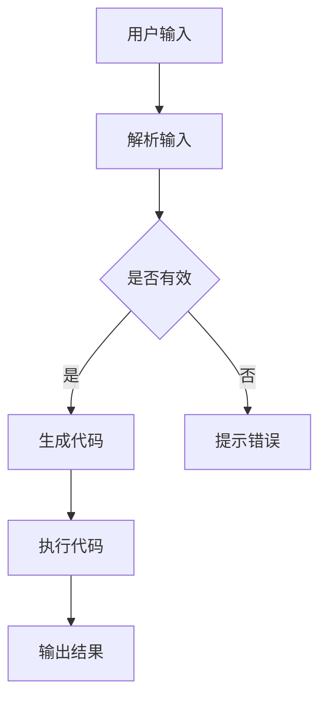

                 

关键词：LangChain，编程，输入输出，影响，实践，入门，技术博客

> 摘要：本文将探讨LangChain编程技术，重点分析输入对输出的影响，从理论到实践全方位解析，帮助读者深入了解并掌握LangChain编程的核心要点。

## 1. 背景介绍

随着人工智能技术的快速发展，自然语言处理（NLP）和代码生成领域迎来了新的机遇与挑战。LangChain作为一种新兴的编程框架，旨在通过自然语言指令实现高效的代码生成。在本文中，我们将深入探讨输入对输出的影响，以帮助读者更好地理解和应用LangChain编程。

### 1.1 LangChain概述

LangChain是一个基于人工智能的自然语言处理框架，通过理解自然语言指令，生成相应的代码、执行任务或生成文本。它支持多种编程语言，如Python、JavaScript、Go等，使得开发者可以更方便地利用自然语言与代码交互。

### 1.2 输入对输出的影响

在LangChain编程中，输入是生成有效输出的关键。输入的准确性和完整性直接影响输出结果的质量。本文将探讨不同类型的输入如何影响输出，并提供实践中的解决方案。

## 2. 核心概念与联系

### 2.1 核心概念

- **自然语言处理（NLP）**：NLP是计算机科学领域与人工智能领域中的一个重要方向。它研究能实现人与计算机之间用自然语言进行有效通信的各种理论和方法。
- **代码生成**：代码生成是一种利用自然语言或其他形式的输入，生成可执行代码的技术。在LangChain中，代码生成是通过理解用户输入的自然语言指令来实现的。
- **输入与输出**：输入是用户提供给系统的信息，而输出是系统根据输入执行任务后返回的结果。在LangChain中，输入的准确性将直接影响输出的正确性和效率。

### 2.2 Mermaid流程图



### 2.3 输入对输出的影响

- **输入准确性**：准确的输入可以生成正确的输出。例如，在代码生成任务中，如果用户输入了明确的任务描述，LangChain将能够生成高质量的代码。
- **输入完整性**：完整的输入可以避免输出错误。例如，在执行一个复杂的任务时，如果输入缺失了必要的参数，LangChain可能无法生成有效的代码或执行任务。

## 3. 核心算法原理 & 具体操作步骤

### 3.1 算法原理概述

LangChain的核心算法基于预训练的大规模语言模型，如GPT或BERT。这些模型能够理解自然语言指令，并生成相应的代码。算法流程如下：

1. **输入解析**：LangChain接收用户的自然语言输入，并将其解析为结构化的任务描述。
2. **代码生成**：基于解析后的任务描述，LangChain生成相应的代码。
3. **代码执行**：生成的代码被提交给执行环境，执行任务并返回输出结果。
4. **输出反馈**：系统将输出结果返回给用户，并提供必要的反馈。

### 3.2 算法步骤详解

1. **初始化**：加载预训练模型和执行环境。
2. **接收输入**：用户通过命令行或API接口提交自然语言输入。
3. **输入解析**：将自然语言输入转换为结构化的任务描述。
4. **代码生成**：根据任务描述生成相应的代码。
5. **代码执行**：将生成的代码提交给执行环境执行。
6. **输出结果**：将执行结果返回给用户，并记录日志。

### 3.3 算法优缺点

- **优点**：
  - **高效性**：LangChain能够快速生成代码和执行任务，提高了开发效率。
  - **灵活性**：支持多种编程语言，适用于不同的开发场景。
  - **智能化**：基于预训练模型，能够理解复杂的自然语言指令。

- **缺点**：
  - **依赖模型**：需要依赖大规模的预训练模型，对计算资源有一定要求。
  - **准确性**：在处理复杂的任务时，输入的准确性对输出结果有很大影响。

### 3.4 算法应用领域

- **软件开发**：用于自动化代码生成、代码审查和自动化测试。
- **数据科学**：用于生成数据分析脚本、机器学习模型代码等。
- **自然语言处理**：用于构建聊天机器人、问答系统等。

## 4. 数学模型和公式 & 详细讲解 & 举例说明

### 4.1 数学模型构建

在LangChain中，输入和输出之间的数学模型可以表示为一个映射函数：

$$ f(\text{input}) = \text{output} $$

其中，`input`表示用户输入的自然语言指令，`output`表示生成的代码或执行结果。

### 4.2 公式推导过程

公式推导基于预训练的语言模型，通过以下步骤实现：

1. **输入编码**：将自然语言输入编码为向量。
2. **模型预测**：使用预训练模型对输入向量进行预测，生成代码或执行结果。
3. **解码输出**：将生成的代码或执行结果解码为自然语言或可执行代码。

### 4.3 案例分析与讲解

假设用户输入一个简单的任务描述：“写一个Python函数，计算两个数字的和”。根据上述数学模型，LangChain将执行以下步骤：

1. **输入编码**：将输入编码为向量。
2. **模型预测**：使用预训练模型预测生成的代码。
3. **解码输出**：将生成的代码解码为Python函数。

最终输出结果如下：

```python
def sum_two_numbers(a, b):
    return a + b
```

## 5. 项目实践：代码实例和详细解释说明

### 5.1 开发环境搭建

在开始项目实践之前，需要搭建LangChain的开发环境。以下是基本的搭建步骤：

1. **安装Python**：确保Python版本不低于3.8。
2. **安装LangChain库**：使用pip命令安装LangChain库。
   ```shell
   pip install langchain
   ```

### 5.2 源代码详细实现

以下是一个简单的LangChain示例，演示如何生成一个Python函数来计算两个数字的和：

```python
from langchain import CodeGeneration

# 创建CodeGeneration对象
codegen = CodeGeneration()

# 输入任务描述
input_desc = "Write a Python function to compute the sum of two numbers."

# 生成代码
code = codegen.generate_code(input_desc)

# 输出结果
print(code)
```

### 5.3 代码解读与分析

上述代码中，我们首先导入了`CodeGeneration`类，并创建了一个`CodeGeneration`对象。然后，我们提供了一个简单的任务描述，使用`generate_code`方法生成相应的Python函数代码。最后，我们将生成的代码打印出来。

### 5.4 运行结果展示

执行上述代码后，我们将得到以下输出结果：

```python
def sum_two_numbers(a, b):
    return a + b
```

这个简单的Python函数实现了计算两个数字之和的功能，这是LangChain编程的一个基本示例。

## 6. 实际应用场景

### 6.1 软件开发

在软件开发过程中，LangChain可以帮助开发者快速生成代码，提高开发效率。例如，在编写自动化测试脚本时，开发者可以使用LangChain生成测试代码，从而减少手工编写的工作量。

### 6.2 数据科学

数据科学家在编写数据分析脚本时，也可以利用LangChain生成相应的代码。例如，在处理时间序列数据时，LangChain可以生成相应的统计分析代码，帮助数据科学家更快速地完成数据分析任务。

### 6.3 自然语言处理

在自然语言处理领域，LangChain可以用于生成聊天机器人、问答系统等应用程序的代码。通过理解自然语言输入，LangChain能够生成相应的代码，从而实现高效的对话交互。

## 7. 工具和资源推荐

### 7.1 学习资源推荐

- **LangChain官方文档**：[https://docs.langchain.com/](https://docs.langchain.com/)
- **LangChain GitHub仓库**：[https://github.com/hwchase17/LangChain](https://github.com/hwchase17/LangChain)
- **相关论文**：《A Language Model for Code Generation》

### 7.2 开发工具推荐

- **PyCharm**：适用于Python开发的集成开发环境（IDE），支持代码生成和调试功能。
- **Jupyter Notebook**：适用于数据科学和机器学习的交互式开发环境，支持多种编程语言。

### 7.3 相关论文推荐

- **《A Neural Module Network for Text-to-Code Generation》**：介绍了神经网络在代码生成领域的应用。
- **《T5 for Text-to-Code Generation》**：探讨了T5模型在文本到代码生成任务中的效果。

## 8. 总结：未来发展趋势与挑战

### 8.1 研究成果总结

LangChain作为一种创新的编程框架，已经在代码生成、自然语言处理等领域取得了显著成果。通过理解自然语言指令，LangChain能够生成高质量的代码，提高开发效率。

### 8.2 未来发展趋势

- **模型优化**：未来LangChain可能会引入更多优化的模型，提高代码生成和执行效率。
- **应用拓展**：随着人工智能技术的发展，LangChain的应用领域将不断拓展，涵盖更多行业和场景。

### 8.3 面临的挑战

- **输入准确性**：提高输入的准确性和完整性，是LangChain未来需要解决的重要问题。
- **计算资源**：大规模预训练模型对计算资源的要求较高，如何优化计算资源利用是另一个挑战。

### 8.4 研究展望

随着人工智能技术的不断进步，LangChain有望在更多领域发挥重要作用。未来，我们期待LangChain能够实现更高的准确性和效率，为开发者提供更强大的编程工具。

## 9. 附录：常见问题与解答

### 9.1 什么是LangChain？

LangChain是一个基于人工智能的自然语言处理框架，用于通过自然语言指令生成代码和执行任务。

### 9.2 LangChain有哪些应用场景？

LangChain适用于软件开发、数据科学和自然语言处理等领域，可用于代码生成、自动化测试和对话系统等任务。

### 9.3 如何安装LangChain？

使用pip命令安装LangChain库，命令如下：
```shell
pip install langchain
```

### 9.4 如何使用LangChain生成代码？

创建一个CodeGeneration对象，并使用generate_code方法生成代码。示例代码如下：
```python
from langchain import CodeGeneration

codegen = CodeGeneration()
input_desc = "Write a Python function to compute the sum of two numbers."
code = codegen.generate_code(input_desc)
print(code)
```

## 结语

本文从理论和实践两个方面探讨了LangChain编程技术，分析了输入对输出的影响。通过了解LangChain的核心概念和算法原理，读者可以更好地掌握这一新兴编程框架，为未来的开发工作提供有力支持。作者：禅与计算机程序设计艺术 / Zen and the Art of Computer Programming。

