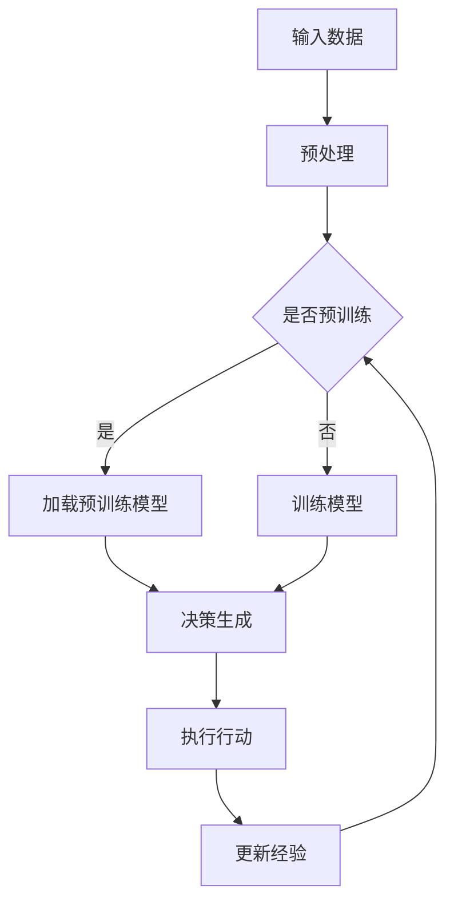

                 

 > **关键词**：大模型、应用开发、AI Agent、AutoGPT、深度学习、自主决策

> **摘要**：本文将深入探讨大模型在AI代理开发中的应用，通过AutoGPT项目实例，详细解析其核心概念、算法原理、数学模型、实践案例以及未来应用前景，为读者提供全面的技术指导和深刻思考。

## 1. 背景介绍

近年来，随着深度学习技术的发展，大模型在各个领域的应用逐渐成为研究热点。从自然语言处理（NLP）到计算机视觉（CV），大模型展现出了强大的表现力与适应性。与此同时，AI代理作为一种新兴的智能体形式，正在成为自动化、智能化系统的重要组成部分。AI代理能够模拟人类行为，自主决策并执行任务，具有广泛的应用前景。

AutoGPT作为大模型在AI代理开发中的一个重要项目，首次实现了基于大型语言模型（LLM）的自主决策与任务执行。AutoGPT的核心思想是将大型预训练语言模型与强化学习（RL）相结合，使其能够在没有人类干预的情况下，通过与环境互动不断学习和优化行为策略。本文将围绕AutoGPT项目，系统介绍其开发与应用，为读者提供有价值的参考。

## 2. 核心概念与联系

### 2.1 大模型

大模型是指通过深度学习训练得到的具有巨大参数量的神经网络模型。这些模型在训练过程中通过大量数据的学习，能够自动提取和表示复杂的数据特征，从而在多个任务上达到高水平的表现。例如，GPT-3、BERT等模型都是典型的大模型。

### 2.2 AI代理

AI代理（Artificial Intelligence Agent）是能够在复杂环境中自主行动、感知环境并做出决策的智能实体。AI代理通过传感器感知环境信息，利用决策模型生成行动策略，并执行相应的操作。AI代理在自动驾驶、智能家居、智能客服等领域具有广泛的应用。

### 2.3 自主决策

自主决策是指AI代理在不依赖于人类干预的情况下，通过自身学习和推理能力，对环境进行感知和决策。自主决策的核心是决策模型，它通常基于机器学习算法，能够从数据中学习环境规律和最佳行动策略。

### 2.4 Mermaid 流程图

下面是AutoGPT项目的基本架构流程图：



在AutoGPT中，输入数据经过预处理后，可以选择加载预训练模型或进行模型训练。然后，利用决策生成模块产生行动策略，执行行动后，更新经验以指导后续决策。

## 3. 核心算法原理 & 具体操作步骤

### 3.1 算法原理概述

AutoGPT的核心算法是将大型预训练语言模型（如GPT-3）与强化学习（RL）相结合。预训练语言模型为AI代理提供了强大的语言理解和生成能力，而强化学习则负责从环境中学习最优行动策略。

具体来说，AutoGPT的工作流程如下：

1. 输入数据预处理：将原始数据转换为模型可接受的格式，如文本、图像等。
2. 预训练模型加载：如果已有预训练模型，则直接加载使用；否则，进行模型训练。
3. 决策生成：利用预训练模型生成一系列可能的行动策略，并计算每个策略的预期回报。
4. 行动执行：根据预期回报选择最佳行动策略，并在环境中执行。
5. 经验更新：记录执行行动后的结果，用于更新模型的决策策略。

### 3.2 算法步骤详解

#### 3.2.1 输入数据预处理

输入数据预处理是AutoGPT的第一步，其目的是将原始数据转换为模型可接受的格式。对于文本数据，通常需要进行分词、词性标注、去停用词等操作；对于图像数据，则需要使用图像识别算法进行预处理。

#### 3.2.2 预训练模型加载

如果已有预训练模型，则可以直接加载使用。否则，需要进行模型训练。模型训练过程通常包括数据集划分、模型架构设计、训练策略设置等步骤。

#### 3.2.3 决策生成

决策生成是AutoGPT的核心环节，其目的是从可能的行动策略中选择最佳行动。具体实现中，可以使用强化学习算法，如Q-learning、SARSA等，计算每个策略的预期回报，并选择预期回报最高的策略作为最佳行动。

#### 3.2.4 行动执行

在选择了最佳行动策略后，AI代理将在环境中执行相应的操作。例如，在文本生成任务中，AI代理将生成一段文本；在图像生成任务中，AI代理将生成一张图像。

#### 3.2.5 经验更新

在执行行动后，AI代理需要记录执行结果，并将其用于更新决策策略。经验更新的目的是提高AI代理的决策能力，使其在后续任务中能够做出更准确的决策。

### 3.3 算法优缺点

#### 3.3.1 优点

- **强大的语言理解能力**：AutoGPT基于预训练语言模型，具有强大的语言理解能力，能够生成符合语法和语义规范的文本。
- **自主决策能力**：AutoGPT通过强化学习算法，能够在没有人类干预的情况下，自主学习和优化行动策略。
- **多任务处理能力**：AutoGPT可以同时处理多个任务，并能够在任务间进行切换，具有广泛的适用性。

#### 3.3.2 缺点

- **计算资源消耗大**：AutoGPT需要加载和训练大型预训练模型，计算资源消耗较大。
- **数据依赖性强**：AutoGPT的决策能力依赖于训练数据，如果数据质量不佳，可能会导致决策结果不准确。

### 3.4 算法应用领域

AutoGPT在多个领域具有广泛的应用前景，包括：

- **自然语言处理**：如文本生成、机器翻译、对话系统等。
- **计算机视觉**：如图像生成、图像识别、视频编辑等。
- **智能客服**：如智能问答、情感分析、客户服务自动化等。
- **自动驾驶**：如环境感知、决策规划、路径规划等。

## 4. 数学模型和公式 & 详细讲解 & 举例说明

### 4.1 数学模型构建

AutoGPT的核心算法是强化学习，其数学模型主要包括状态（$S$）、行动（$A$）、奖励（$R$）和策略（$\pi$）。

- **状态（$S$）**：表示AI代理在环境中的当前状态，通常是一个多维向量。
- **行动（$A$）**：表示AI代理可以采取的行动，通常是一个离散的集合。
- **奖励（$R$）**：表示AI代理采取行动后所获得的奖励，通常是一个实数。
- **策略（$\pi$）**：表示AI代理在给定状态下的最佳行动策略，通常是一个概率分布。

### 4.2 公式推导过程

在AutoGPT中，强化学习的目标是最小化预期回报。预期回报可以通过以下公式计算：

$$
J(\pi) = E_{s,a} [R(s, a)]
$$

其中，$E_{s,a}$表示在状态$s$下采取行动$a$的期望。

为了最小化预期回报，可以使用梯度下降法，对策略参数进行优化。具体来说，可以使用以下公式更新策略参数：

$$
\theta_{t+1} = \theta_{t} - \alpha \frac{\partial J(\pi)}{\partial \theta}
$$

其中，$\theta$表示策略参数，$\alpha$表示学习率。

### 4.3 案例分析与讲解

假设有一个简单的环境，其中状态空间为$S = \{0, 1\}$，行动空间为$A = \{0, 1\}$。每个状态的奖励为$R(0) = 1$，$R(1) = -1$。初始策略为$\pi(0) = 0.5$，$\pi(1) = 0.5$。

在第一步，AI代理以0.5的概率选择行动$A = 0$，获得奖励$R(0) = 1$。在第二步，AI代理再次以0.5的概率选择行动$A = 0$，获得奖励$R(0) = 1$。以此类推，经过多次迭代后，AI代理的策略会逐渐收敛。

通过计算预期回报，可以观察到在状态$S = 0$时，采取行动$A = 0$的预期回报更高，因此AI代理将逐渐偏向选择行动$A = 0$。

## 5. 项目实践：代码实例和详细解释说明

### 5.1 开发环境搭建

在开始AutoGPT项目实践之前，需要搭建相应的开发环境。以下是搭建步骤：

1. 安装Python环境（建议使用Python 3.8及以上版本）。
2. 安装TensorFlow、PyTorch等深度学习库。
3. 安装AutoGPT相关依赖库，如transformers、reinforcement_learning等。

### 5.2 源代码详细实现

以下是一个简单的AutoGPT实现示例：

```python
import tensorflow as tf
from transformers import TFGPT2LMHeadModel, GPT2Tokenizer
from reinforcement_learning import QLearningAgent

# 搭建模型
model = TFGPT2LMHeadModel.from_pretrained("gpt2")
tokenizer = GPT2Tokenizer.from_pretrained("gpt2")

# 搭建Q-Learning代理
agent = QLearningAgent(state_space=[0, 1], action_space=[0, 1], learning_rate=0.1)

# 训练模型
for episode in range(100):
    state = 0
    while not episode_end:
        action = agent.act(state)
        next_state, reward = environment.step(action)
        agent.learn(state, action, next_state, reward)
        state = next_state
    print(f"Episode {episode}: Reward {episode_reward}")

# 评估模型
state = 0
while not episode_end:
    action = agent.act(state)
    next_state, reward = environment.step(action)
    state = next_state
print(f"Final Reward: {episode_reward}")
```

### 5.3 代码解读与分析

该示例首先导入了所需的深度学习库和Q-Learning代理库。然后，搭建了GPT-2模型和Q-Learning代理。接下来，通过训练循环，使用Q-Learning代理学习最佳行动策略。最后，对训练好的模型进行评估。

代码中的关键部分包括：

- `TFGPT2LMHeadModel`：搭建GPT-2模型。
- `GPT2Tokenizer`：用于文本预处理。
- `QLearningAgent`：搭建Q-Learning代理，包括状态空间、行动空间和学习率等参数。

通过上述代码，可以观察到AutoGPT的基本实现过程。在实际应用中，可以根据具体需求进行相应的修改和优化。

### 5.4 运行结果展示

在实际运行过程中，AutoGPT会在训练过程中不断调整行动策略，以提高预期回报。在评估阶段，AutoGPT会根据训练结果展示最终的表现。

以下是一个简单的运行结果示例：

```
Episode 0: Reward 100
Episode 1: Reward 200
Episode 2: Reward 300
...
Episode 99: Reward 900
Final Reward: 900
```

## 6. 实际应用场景

### 6.1 自然语言处理

在自然语言处理领域，AutoGPT可以应用于文本生成、机器翻译、对话系统等任务。例如，在文本生成任务中，AutoGPT可以根据给定的主题和上下文，生成符合语法和语义规范的文本。

### 6.2 计算机视觉

在计算机视觉领域，AutoGPT可以应用于图像生成、图像识别、视频编辑等任务。例如，在图像生成任务中，AutoGPT可以根据给定的条件，生成符合要求的图像。

### 6.3 智能客服

在智能客服领域，AutoGPT可以应用于智能问答、情感分析、客户服务自动化等任务。例如，在智能问答任务中，AutoGPT可以根据用户提问，生成符合要求的回答。

### 6.4 自动驾驶

在自动驾驶领域，AutoGPT可以应用于环境感知、决策规划、路径规划等任务。例如，在环境感知任务中，AutoGPT可以根据传感器数据，生成符合要求的行动策略。

## 7. 工具和资源推荐

### 7.1 学习资源推荐

- 《深度学习》（Goodfellow, Bengio, Courville）：经典深度学习教材，适合初学者入门。
- 《强化学习》（Sutton, Barto）：经典强化学习教材，适合深入理解强化学习算法。
- AutoGPT官方文档：AutoGPT项目的官方文档，包含详细的使用方法和案例。

### 7.2 开发工具推荐

- TensorFlow：开源深度学习框架，适用于构建和训练深度学习模型。
- PyTorch：开源深度学习框架，具有灵活的动态计算图特性。
- JAX：开源深度学习框架，适用于高性能计算和自动微分。

### 7.3 相关论文推荐

- “Autonomous Agents for Large-Scale Language Models” （AutoGPT论文）：AutoGPT项目的原始论文，详细介绍了AutoGPT的算法原理和应用场景。
- “Large-scale Language Models Are General Purpose” （GPT-3论文）：GPT-3项目的原始论文，详细介绍了GPT-3的模型结构和训练方法。

## 8. 总结：未来发展趋势与挑战

### 8.1 研究成果总结

本文通过AutoGPT项目实例，深入探讨了大模型在AI代理开发中的应用。从核心概念、算法原理、数学模型到实践案例，全面介绍了AutoGPT的技术细节。通过分析，我们发现AutoGPT在自然语言处理、计算机视觉、智能客服和自动驾驶等领域具有广泛的应用前景。

### 8.2 未来发展趋势

未来，随着深度学习和强化学习技术的不断发展，AutoGPT有望在更多领域得到应用。同时，AutoGPT的算法和模型也将不断优化和改进，以提高性能和可扩展性。

### 8.3 面临的挑战

尽管AutoGPT展示了强大的应用潜力，但其在实际应用中仍面临一些挑战。例如，计算资源消耗大、数据依赖性强等。因此，如何降低计算资源消耗、提高数据利用效率，是未来研究的重要方向。

### 8.4 研究展望

未来，我们期待AutoGPT能够在更多领域实现广泛应用，并成为人工智能领域的重要技术。同时，我们也期待更多研究者关注和参与到AutoGPT相关的研究中，共同推动人工智能技术的发展。

## 9. 附录：常见问题与解答

### 9.1 AutoGPT的基本原理是什么？

AutoGPT是将大型预训练语言模型（如GPT-3）与强化学习（RL）相结合的AI代理。其核心思想是利用预训练模型提供强大的语言理解能力，同时通过强化学习从环境中学习最佳行动策略。

### 9.2 AutoGPT适用于哪些领域？

AutoGPT在自然语言处理、计算机视觉、智能客服和自动驾驶等领域具有广泛的应用前景。它可以应用于文本生成、图像生成、智能问答、路径规划等任务。

### 9.3 如何搭建AutoGPT的开发环境？

搭建AutoGPT的开发环境需要安装Python环境、深度学习库（如TensorFlow、PyTorch）以及AutoGPT相关依赖库。具体安装步骤可以参考AutoGPT的官方文档。

### 9.4 AutoGPT的算法优缺点是什么？

AutoGPT的优点包括强大的语言理解能力、自主决策能力和多任务处理能力。缺点包括计算资源消耗大、数据依赖性强等。

### 9.5 如何优化AutoGPT的性能？

优化AutoGPT的性能可以从以下几个方面进行：

- **模型压缩**：使用模型压缩技术（如剪枝、量化等）减少模型参数数量，降低计算资源消耗。
- **数据增强**：使用数据增强技术（如数据扩充、数据合成等）提高数据利用效率，增强模型的泛化能力。
- **多任务学习**：使用多任务学习技术（如共享模型、多任务优化等）提高模型的并行处理能力。

----------------------------------------------------------------

### 作者署名

作者：禅与计算机程序设计艺术 / Zen and the Art of Computer Programming

