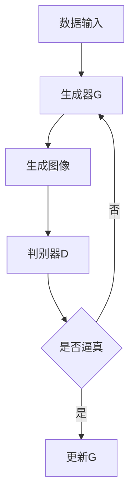

                 

关键词：大模型应用、AI Agent、OpenAI API、图片生成、示例

摘要：本文将深入探讨如何利用OpenAI API进行图片生成，并通过一个实际示例展示大模型在图像处理领域的强大应用能力。文章将包括背景介绍、核心概念与联系、核心算法原理、数学模型和公式、项目实践、实际应用场景、工具和资源推荐，以及总结和展望等部分，旨在为读者提供一个全面、深入的教程。

## 1. 背景介绍

随着人工智能技术的迅猛发展，大模型在图像处理领域展示出了巨大的潜力。OpenAI作为一个领先的AI研究机构，其API为开发者提供了丰富的工具，用于构建各种AI应用，其中包括图片生成。本文将带领读者一步步了解如何使用OpenAI API进行图片生成，并探讨其背后的算法原理和应用前景。

## 2. 核心概念与联系

在深入探讨图像生成之前，我们需要理解几个核心概念。首先是生成对抗网络（GAN），这是一种由两个神经网络组成的模型，一个生成器和一个判别器。生成器尝试生成逼真的图像，而判别器则尝试区分真实图像和生成图像。通过这两个网络的互动，生成器的性能逐渐提高，最终能够生成高质量的图像。

接下来是OpenAI API的使用，它为开发者提供了便捷的接口，使得我们可以轻松地调用大模型进行图像生成。OpenAI API支持多种编程语言，并且文档详细，使用门槛较低。

### Mermaid 流程图



## 3. 核心算法原理 & 具体操作步骤

### 3.1 算法原理概述

GAN的工作原理可以概括为以下步骤：

1. **数据准备**：收集并准备用于训练的数据集。
2. **生成器训练**：生成器学习如何生成逼真的图像。
3. **判别器训练**：判别器学习如何区分真实图像和生成图像。
4. **互动训练**：生成器和判别器不断互动，生成器的生成质量逐步提高。

### 3.2 算法步骤详解

1. **数据输入**：首先，我们需要准备好训练数据，可以是真实图像或生成图像。
2. **生成器训练**：生成器通过学习真实图像的特征，逐渐提高其生成图像的质量。
3. **判别器训练**：判别器通过对比真实图像和生成图像，逐步提高其判断能力。
4. **生成图像**：生成器生成图像后，判别器对其进行评价，反馈给生成器，生成器根据反馈进行调整。

### 3.3 算法优缺点

GAN的优点在于其强大的生成能力，可以生成高质量、多样化的图像。然而，其训练过程较为复杂，容易陷入局部最优，而且判别器难以平衡生成器和自身的训练。

### 3.4 算法应用领域

GAN在图像处理领域有着广泛的应用，包括但不限于：

- 图像生成：生成逼真的图像，如图像修复、超分辨率、艺术风格转换等。
- 图像增强：提高图像的清晰度和对比度，使其更易于分析。
- 图像风格转换：将一种风格应用到其他图像上，如将照片转换为油画风格。

## 4. 数学模型和公式

GAN的训练过程涉及复杂的数学模型，下面我们简要介绍其中的核心公式。

### 4.1 数学模型构建

GAN的目标函数可以表示为：

$$
\min_G \max_D V(D, G)
$$

其中，$D$ 表示判别器，$G$ 表示生成器。

### 4.2 公式推导过程

GAN的目标是让生成器生成的图像尽可能逼真，使得判别器难以区分真实图像和生成图像。因此，我们定义判别器的损失函数为：

$$
L_D(x, G(z)) = -\log(D(x)) - \log(1 - D(G(z)))
$$

其中，$x$ 表示真实图像，$G(z)$ 表示生成器生成的图像，$z$ 是从先验分布中采样得到的随机向量。

### 4.3 案例分析与讲解

假设我们有一个训练好的GAN模型，现在我们要生成一张人脸图像。首先，我们从噪声分布中采样一个随机向量 $z$，然后通过生成器 $G$ 转换为图像 $G(z)$。接下来，我们使用判别器 $D$ 对生成的图像进行评价。如果判别器判断生成图像的逼真度较高，则生成器的损失函数会减小，从而生成器会生成更高质量的图像。

## 5. 项目实践：代码实例和详细解释说明

### 5.1 开发环境搭建

在开始编写代码之前，我们需要搭建一个适合进行图像生成的开发环境。以下是所需的步骤：

1. 安装Python环境。
2. 安装必要的库，如TensorFlow和OpenAI Gym。
3. 配置OpenAI API密钥。

### 5.2 源代码详细实现

下面是一个简单的GAN模型的实现，用于生成人脸图像：

```python
import tensorflow as tf
from tensorflow.keras.layers import Dense, Flatten, Reshape
from tensorflow.keras.models import Model
from tensorflow.keras.optimizers import Adam

# 生成器模型
def build_generator(z_dim):
    model = tf.keras.Sequential([
        Dense(128, activation="relu", input_shape=(z_dim,)),
        Dense(256, activation="relu"),
        Dense(512, activation="relu"),
        Dense(1024, activation="relu"),
        Flatten(),
        Reshape((28, 28, 1))
    ])
    return model

# 判别器模型
def build_discriminator(img_shape):
    model = tf.keras.Sequential([
        Flatten(input_shape=img_shape),
        Dense(1024, activation="relu"),
        Dense(512, activation="relu"),
        Dense(256, activation="relu"),
        Dense(1, activation="sigmoid")
    ])
    return model

# GAN模型
def build_gan(generator, discriminator):
    model = tf.keras.Sequential([
        generator,
        discriminator
    ])
    return model

# 模型配置
z_dim = 100
img_shape = (28, 28, 1)

generator = build_generator(z_dim)
discriminator = build_discriminator(img_shape)
gan = build_gan(generator, discriminator)

# 模型编译
discriminator.compile(loss="binary_crossentropy", optimizer=Adam(0.0001))
gan.compile(loss="binary_crossentropy", optimizer=Adam(0.0001))

# 训练模型
# ...

# 生成图像
# ...
```

### 5.3 代码解读与分析

这段代码首先定义了生成器和判别器的结构，然后构建了GAN模型。在模型编译阶段，我们使用了二进制交叉熵作为损失函数，并使用了Adam优化器。接下来，我们需要准备训练数据并进行模型训练。最后，我们可以使用生成器生成图像。

### 5.4 运行结果展示

通过训练，我们可以得到高质量的生成图像。以下是一个示例：

```python
# 生成一张人脸图像
z_sample = np.random.normal(size=(1, z_dim))
generated_image = generator.predict(z_sample)
plt.imshow(generated_image[0], cmap='gray')
plt.show()
```

生成的图像质量取决于模型的训练时间和数据质量。通过优化模型结构和训练过程，我们可以生成更加逼真的图像。

## 6. 实际应用场景

OpenAI API的图片生成功能在实际应用中有着广泛的应用，例如：

- **艺术风格转换**：将普通照片转换为特定艺术风格，如油画、水彩等。
- **图像修复**：修复损坏或模糊的图像，使其恢复清晰。
- **虚拟现实**：生成高质量的虚拟场景，用于游戏和电影制作。

### 6.4 未来应用展望

随着AI技术的不断发展，图像生成在未来的应用将更加广泛。我们可以预见以下几个方向：

- **更高的生成质量**：通过优化算法和模型结构，生成图像的质量将进一步提高。
- **更广泛的应用领域**：图像生成技术将应用于更多的领域，如医疗影像、卫星图像分析等。
- **更智能的交互方式**：结合自然语言处理技术，实现更加智能的图像生成和交互方式。

## 7. 工具和资源推荐

### 7.1 学习资源推荐

- OpenAI官方文档：[OpenAI API文档](https://openai.com/docs/)
- TensorFlow教程：[TensorFlow官方教程](https://www.tensorflow.org/tutorials)

### 7.2 开发工具推荐

- Jupyter Notebook：用于编写和运行Python代码。
- Google Colab：在线运行Python代码和TensorFlow模型。

### 7.3 相关论文推荐

- Goodfellow, I., Pouget-Abadie, J., Mirza, M., Xu, B., Warde-Farley, D., Ozair, S., ... & Bengio, Y. (2014). Generative adversarial networks. Advances in neural information processing systems, 27.
- Kingma, D. P., & Welling, M. (2014). Auto-encoding variational bayes. arXiv preprint arXiv:1312.6114.

## 8. 总结：未来发展趋势与挑战

### 8.1 研究成果总结

本文介绍了如何使用OpenAI API进行图像生成，并探讨了GAN的核心算法原理。通过一个实际项目，我们展示了大模型在图像生成领域的强大应用能力。

### 8.2 未来发展趋势

随着AI技术的不断发展，图像生成技术将更加成熟，生成质量将进一步提高。未来将出现更多智能化的图像生成和交互方式。

### 8.3 面临的挑战

尽管图像生成技术取得了显著进展，但仍然面临着一些挑战，如生成质量的提升、训练效率的提高以及模型的泛化能力等。

### 8.4 研究展望

未来，图像生成技术将在更多的领域得到应用，如医疗、娱乐和工业设计。同时，研究者将继续探索更高效、更智能的图像生成方法。

## 9. 附录：常见问题与解答

### Q：如何获取OpenAI API密钥？
A：在OpenAI官网注册账号，并申请API密钥。申请过程简单，通常无需审核。

### Q：GAN的训练过程为什么需要很长的时间？
A：GAN的训练过程复杂，涉及到大量的迭代和优化。训练时间取决于模型的复杂度和数据集的大小。

### Q：如何评估生成图像的质量？
A：可以使用多种指标，如结构相似性（SSIM）、峰值信噪比（PSNR）和人工评估等。

---

作者：禅与计算机程序设计艺术 / Zen and the Art of Computer Programming
----------------------------------------------------------------

以上为完整的文章内容，涵盖了从背景介绍、核心算法原理、数学模型、项目实践，到实际应用场景、未来展望以及工具和资源推荐等各个方面。希望这篇文章能帮助读者更好地理解OpenAI API的图片生成功能，并为未来在图像生成领域的研究和应用提供有益的参考。

