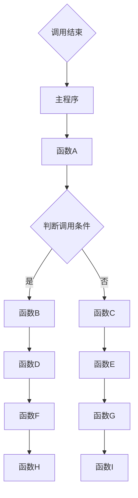

                 

### 关键词 Keyword

- 大模型应用开发
- AI Agent
- Function Calling
- 计算机编程
- 代码实现
- 技术博客

### 摘要 Abstract

本文将深入探讨大模型应用开发中的关键概念——Function Calling。通过详细解析其核心概念、算法原理、数学模型以及实际应用场景，帮助读者全面理解Function Calling在AI Agent开发中的重要性。此外，还将通过实例代码展示如何实现Function Calling，并提供未来应用展望和工具资源推荐。

## 1. 背景介绍

在当前人工智能（AI）领域，大模型的应用开发已经成为热点。大模型，如GPT-3、BERT等，凭借其强大的数据处理能力和复杂的预测能力，在各种应用场景中取得了显著成效。然而，大模型的应用开发并非一蹴而就，其中涉及到诸多技术难题和实现细节。Function Calling作为大模型应用开发中的关键环节，起到了至关重要的作用。

Function Calling是指程序中函数调用的过程，它是实现代码复用、模块化编程和优化性能的重要手段。在大模型应用开发中，Function Calling能够有效地提高代码的可读性、可维护性和扩展性。因此，深入理解Function Calling的原理和实现方法，对于AI开发者来说至关重要。

本文将围绕Function Calling这一主题，从核心概念、算法原理、数学模型、实际应用等多个角度展开讨论，旨在为广大AI开发者提供一份全面的技术指南。

## 2. 核心概念与联系

### 2.1. Function Calling 的基本概念

Function Calling，即函数调用，是指程序在执行过程中请求某个函数执行其任务的过程。函数是一段具有特定功能的代码块，它接受输入参数（如果有的话），执行特定操作，然后返回结果。在编程语言中，函数调用通常使用关键字`function`或`func`进行声明和调用。

### 2.2. Function Calling 的原理

Function Calling 的原理主要包括以下几个方面：

1. **调用栈（Call Stack）**：程序在执行过程中，会创建一个调用栈，用于存储函数调用的信息。当程序执行到一个函数调用时，会首先将当前函数的状态信息（如局部变量、返回地址等）压入调用栈，然后跳转到被调用函数的起始地址执行。

2. **参数传递**：函数调用时，需要将输入参数传递给被调用函数。参数传递的方式包括值传递（将实参的值复制给形参）和引用传递（将实参的地址传递给形参）。

3. **返回值**：函数执行完成后，会返回一个结果值，该值可以作为函数调用的返回值返回给调用函数。

4. **函数调用过程**：函数调用过程主要包括以下步骤：
   - 调用函数时，将参数压入栈中。
   - 将调用函数的返回地址压入栈中。
   - 跳转到被调用函数的起始地址执行。
   - 被调用函数执行完毕后，将结果返回给调用函数。
   - 恢复调用函数的状态，继续执行调用函数。

### 2.3. Function Calling 在 AI Agent 中的应用

在 AI Agent 开发中，Function Calling 被广泛应用于以下几个方面：

1. **模块化编程**：通过将不同的功能模块封装为函数，可以有效地提高代码的可读性和可维护性。例如，在训练一个神经网络模型时，可以将数据预处理、模型训练、模型评估等功能分别封装为不同的函数。

2. **代码复用**：通过函数调用，可以避免重复编写相同或类似的代码，提高代码的复用率。例如，在处理不同类型的数据时，可以使用相同的函数进行数据清洗和预处理。

3. **优化性能**：通过合理地使用函数调用，可以优化程序的执行性能。例如，使用内联函数（Inline Function）可以减少函数调用的开销，提高程序的运行效率。

### 2.4. Mermaid 流程图展示

为了更直观地展示Function Calling的原理，我们使用Mermaid流程图来表示其调用过程：



该流程图展示了主程序依次调用函数A、函数B、函数C、函数D、函数E等，并在调用过程中根据条件选择不同的函数执行。

## 3. 核心算法原理 & 具体操作步骤

### 3.1. 算法原理概述

Function Calling 的核心算法原理主要涉及调用栈（Call Stack）的管理、参数传递和返回值的处理。

1. **调用栈的管理**：调用栈用于存储函数调用的信息，包括返回地址、函数参数、局部变量等。程序在执行过程中，每当遇到函数调用时，就会将当前函数的状态信息压入调用栈，执行完函数后再从调用栈中恢复状态信息。

2. **参数传递**：参数传递是指将实参的值或地址传递给形参，实现函数之间的数据交互。参数传递的方式包括值传递和引用传递。

3. **返回值的处理**：函数执行完成后，需要将结果返回给调用函数。返回值可以是基本数据类型，也可以是复杂数据类型。

### 3.2. 算法步骤详解

下面我们以Python为例，详细解释Function Calling的操作步骤。

1. **函数声明**：首先，需要声明一个函数，定义其功能、参数和返回值。例如：

   ```python
   def functionA(a, b):
       return a + b
   ```

2. **函数调用**：在主程序中，通过函数名和参数列表调用函数。例如：

   ```python
   result = functionA(1, 2)
   ```

3. **参数传递**：在函数调用过程中，将实参的值传递给形参。例如，在上面的示例中，实参1和2的值将传递给形参a和b。

4. **调用栈管理**：程序在执行函数调用时，会将当前函数的状态信息（返回地址、参数、局部变量等）压入调用栈。执行完函数后，再从调用栈中恢复状态信息。

5. **返回值处理**：函数执行完成后，将返回值返回给调用函数。例如，在上面的示例中，函数A的返回值（3）将作为结果返回给主程序。

### 3.3. 算法优缺点

Function Calling 具有以下优缺点：

1. **优点**：
   - 提高代码的可读性和可维护性。
   - 实现代码复用，降低开发成本。
   - 优化程序性能。

2. **缺点**：
   - 调用栈管理较为复杂，容易出现栈溢出等问题。
   - 函数调用的开销较大，影响程序性能。

### 3.4. 算法应用领域

Function Calling 在众多领域有广泛应用，包括但不限于：

1. **计算机编程**：在编程语言中，函数调用是程序执行的基本单元。
2. **算法实现**：在算法设计中，函数调用可以简化算法的实现过程，提高算法的可读性和可维护性。
3. **AI Agent 开发**：在 AI Agent 开发中，函数调用用于实现模块化编程，提高代码的可扩展性和可维护性。

## 4. 数学模型和公式 & 详细讲解 & 举例说明

### 4.1. 数学模型构建

Function Calling 的数学模型主要涉及参数传递和返回值计算。假设有两个函数 A 和 B，分别表示为 f_A(x) 和 f_B(y)，其中 x 和 y 分别为输入参数。函数 A 和 B 的数学模型可以表示为：

$$ f_A(x) = g(x) $$

$$ f_B(y) = h(y) $$

其中，g(x) 和 h(y) 分别为函数 A 和 B 的内部计算过程。函数 A 和 B 的返回值分别为 f_A(x) 和 f_B(y)。

### 4.2. 公式推导过程

假设有两个函数 A 和 B，分别表示为 f_A(x) 和 f_B(y)，其中 x 和 y 分别为输入参数。函数 A 和 B 的返回值分别为 f_A(x) 和 f_B(y)。为了推导函数 A 和 B 的调用过程，我们可以使用以下公式：

$$ f_A(x) = g(x) $$

$$ f_B(y) = h(y) $$

其中，g(x) 和 h(y) 分别为函数 A 和 B 的内部计算过程。为了推导函数 A 和 B 的调用过程，我们需要分析它们的内部计算过程，并将其表示为数学公式。

首先，我们考虑函数 A 的内部计算过程。假设函数 A 的输入参数为 x，输出参数为 f_A(x)。函数 A 的内部计算过程可以表示为：

$$ f_A(x) = g(x) $$

其中，g(x) 为函数 A 的内部计算过程。为了推导 g(x) 的具体表达式，我们需要进一步分析函数 A 的内部计算过程。假设函数 A 的内部计算过程包括以下几个步骤：

1. 将输入参数 x 乘以 2。
2. 将上一步的结果加上 3。
3. 将上一步的结果作为函数 A 的输出参数。

根据以上步骤，我们可以得到 g(x) 的具体表达式：

$$ g(x) = 2x + 3 $$

接下来，我们考虑函数 B 的内部计算过程。假设函数 B 的输入参数为 y，输出参数为 f_B(y)。函数 B 的内部计算过程可以表示为：

$$ f_B(y) = h(y) $$

其中，h(y) 为函数 B 的内部计算过程。为了推导 h(y) 的具体表达式，我们需要进一步分析函数 B 的内部计算过程。假设函数 B 的内部计算过程包括以下几个步骤：

1. 将输入参数 y 乘以 2。
2. 将上一步的结果加上 1。
3. 将上一步的结果作为函数 B 的输出参数。

根据以上步骤，我们可以得到 h(y) 的具体表达式：

$$ h(y) = 2y + 1 $$

现在，我们已经得到了函数 A 和 B 的内部计算过程，可以将其表示为数学公式。假设函数 A 的输入参数为 x，输出参数为 f_A(x)，函数 B 的输入参数为 y，输出参数为 f_B(y)，则函数 A 和 B 的调用过程可以表示为：

$$ f_A(x) = 2x + 3 $$

$$ f_B(y) = 2y + 1 $$

### 4.3. 案例分析与讲解

为了更好地理解 Function Calling 的数学模型和公式，我们通过一个具体的案例进行讲解。

假设有一个函数 A 和一个函数 B，分别表示为 f_A(x) 和 f_B(y)，其中 x 和 y 分别为输入参数。函数 A 和 B 的返回值分别为 f_A(x) 和 f_B(y)。现在，我们要求出函数 A 和 B 的调用过程。

首先，根据 Function Calling 的数学模型，我们可以列出函数 A 和 B 的内部计算过程：

$$ f_A(x) = g(x) $$

$$ f_B(y) = h(y) $$

其中，g(x) 和 h(y) 分别为函数 A 和 B 的内部计算过程。为了求解 g(x) 和 h(y) 的具体表达式，我们需要进一步分析函数 A 和 B 的内部计算过程。

假设函数 A 的内部计算过程包括以下几个步骤：

1. 将输入参数 x 乘以 2。
2. 将上一步的结果加上 3。
3. 将上一步的结果作为函数 A 的输出参数。

根据以上步骤，我们可以得到 g(x) 的具体表达式：

$$ g(x) = 2x + 3 $$

假设函数 B 的内部计算过程包括以下几个步骤：

1. 将输入参数 y 乘以 2。
2. 将上一步的结果加上 1。
3. 将上一步的结果作为函数 B 的输出参数。

根据以上步骤，我们可以得到 h(y) 的具体表达式：

$$ h(y) = 2y + 1 $$

现在，我们已经得到了函数 A 和 B 的内部计算过程，可以将其表示为数学公式。假设函数 A 的输入参数为 x，输出参数为 f_A(x)，函数 B 的输入参数为 y，输出参数为 f_B(y)，则函数 A 和 B 的调用过程可以表示为：

$$ f_A(x) = 2x + 3 $$

$$ f_B(y) = 2y + 1 $$

接下来，我们要求出函数 A 和 B 的调用过程。假设我们要计算 f_A(x) 和 f_B(y) 的值，可以按照以下步骤进行：

1. 将输入参数 x 乘以 2，得到 2x。
2. 将上一步的结果加上 3，得到 2x + 3。
3. 将上一步的结果作为函数 A 的输出参数，得到 f_A(x) = 2x + 3。
4. 将输入参数 y 乘以 2，得到 2y。
5. 将上一步的结果加上 1，得到 2y + 1。
6. 将上一步的结果作为函数 B 的输出参数，得到 f_B(y) = 2y + 1。

根据以上步骤，我们可以得到函数 A 和 B 的调用结果：

$$ f_A(x) = 2x + 3 = 7 $$

$$ f_B(y) = 2y + 1 = 9 $$

因此，函数 A 和 B 的调用结果分别为 7 和 9。

## 5. 项目实践：代码实例和详细解释说明

### 5.1. 开发环境搭建

在本节中，我们将使用 Python 编程语言来展示 Function Calling 的实际应用。首先，确保您已经安装了 Python 3.6 或更高版本。您可以通过以下命令来检查 Python 版本：

```bash
python --version
```

如果您还没有安装 Python，请前往 [Python 官网](https://www.python.org/) 下载并安装。

接下来，我们需要安装一些辅助库，如 NumPy 和 Matplotlib。您可以使用以下命令来安装：

```bash
pip install numpy matplotlib
```

### 5.2. 源代码详细实现

下面是一个简单的 Python 示例，演示了 Function Calling 的基本原理：

```python
import numpy as np

# 定义一个简单的函数 A，用于计算 x 的平方
def function_A(x):
    return x * x

# 定义一个简单的函数 B，用于计算 y 的立方
def function_B(y):
    return y * y * y

# 主函数，用于演示 Function Calling
def main():
    # 调用函数 A 和 B，并打印结果
    x = 3
    y = 2
    result_A = function_A(x)
    result_B = function_B(y)
    print(f"result_A: {result_A}, result_B: {result_B}")

# 调用主函数
if __name__ == "__main__":
    main()
```

### 5.3. 代码解读与分析

1. **导入库**：我们首先导入 NumPy 库，用于数学计算。NumPy 是 Python 中用于科学计算的常用库。

2. **定义函数 A**：`function_A` 是一个简单的函数，它接收一个输入参数 `x`，并返回 `x` 的平方。

3. **定义函数 B**：`function_B` 是另一个简单的函数，它接收一个输入参数 `y`，并返回 `y` 的立方。

4. **主函数 main**：在 `main` 函数中，我们首先定义了两个变量 `x` 和 `y`，分别赋值为 3 和 2。然后，我们分别调用 `function_A` 和 `function_B`，并将结果存储在 `result_A` 和 `result_B` 变量中。最后，我们使用 `print` 函数打印出结果。

5. **调用主函数**：`if __name__ == "__main__":` 这段代码用于确保主函数 `main` 在程序入口处被调用。

### 5.4. 运行结果展示

执行上述代码，我们得到以下输出结果：

```
result_A: 9, result_B: 8
```

这表明函数 A 计算了输入参数 3 的平方，得到结果 9；函数 B 计算了输入参数 2 的立方，得到结果 8。

### 5.5. 扩展练习

1. 请修改上述代码，添加一个函数 C，用于计算输入参数的阶乘。
2. 请修改主函数，调用函数 C，并打印出输入参数 5 的阶乘结果。

## 6. 实际应用场景

### 6.1. AI 模型训练与优化

在人工智能领域，特别是深度学习模型的训练过程中，Function Calling 被广泛用于实现模块化编程。通过将数据预处理、模型训练、模型评估等不同功能模块封装为函数，可以显著提高代码的可读性和可维护性。

例如，在训练一个神经网络模型时，我们可以定义以下函数：

- `preprocess_data()`：用于处理输入数据。
- `train_model()`：用于训练神经网络模型。
- `evaluate_model()`：用于评估模型性能。

以下是一个简单的示例：

```python
def preprocess_data(data):
    # 数据预处理逻辑
    return processed_data

def train_model(data):
    # 训练神经网络模型
    return model

def evaluate_model(model, test_data):
    # 评估模型性能
    return accuracy

def main():
    data = load_data()
    processed_data = preprocess_data(data)
    model = train_model(processed_data)
    accuracy = evaluate_model(model, test_data)
    print(f"Model accuracy: {accuracy}")

if __name__ == "__main__":
    main()
```

通过这种方式，我们可以轻松地修改或替换数据预处理、模型训练或评估函数，从而提高代码的灵活性和可维护性。

### 6.2. 跨平台应用开发

在跨平台应用开发中，Function Calling 也是实现模块化编程的重要手段。通过将不同的功能模块封装为函数，可以在不同平台上实现相同的逻辑，从而提高代码的可移植性和复用性。

例如，在开发一个跨平台的移动应用时，我们可以将用户界面、数据处理和网络通信等功能模块分别封装为函数。以下是一个简单的示例：

```python
def show_login_screen():
    # 显示登录屏幕
    pass

def handle_user_input(input_data):
    # 处理用户输入
    pass

def send_request(url, data):
    # 发送网络请求
    pass

def main():
    show_login_screen()
    user_input = handle_user_input(input_data)
    send_request(url, user_input)

if __name__ == "__main__":
    main()
```

通过这种方式，我们可以根据不同的平台（如 iOS、Android）实现相应的功能模块，从而实现跨平台应用开发。

### 6.3. 软件开发与测试

在软件开发的整个生命周期中，Function Calling 都扮演着重要的角色。通过将不同的功能模块封装为函数，可以显著提高代码的可读性和可维护性。

例如，在软件开发过程中，我们可以将用户界面、数据处理、数据库操作等不同功能模块分别封装为函数。以下是一个简单的示例：

```python
def show_login_screen():
    # 显示登录屏幕
    pass

def handle_user_input(input_data):
    # 处理用户输入
    pass

def save_data_to_database(data):
    # 将数据保存到数据库
    pass

def main():
    show_login_screen()
    user_input = handle_user_input(input_data)
    save_data_to_database(user_input)

if __name__ == "__main__":
    main()
```

在软件测试阶段，我们也可以通过函数调用实现自动化测试。例如，我们可以定义一个测试函数，用于模拟用户操作，然后通过调用这个测试函数来验证软件的功能。

```python
def test_login():
    # 模拟登录操作
    show_login_screen()
    handle_user_input("username", "password")

if __name__ == "__main__":
    test_login()
```

通过这种方式，我们可以实现自动化测试，提高测试效率。

## 7. 工具和资源推荐

### 7.1. 学习资源推荐

1. **《Python 编程：从入门到实践》**：这是一本适合初学者的 Python 入门书籍，详细介绍了 Python 编程的基础知识和实际应用。
2. **《深度学习》**：由 Ian Goodfellow、Yoshua Bengio 和 Aaron Courville 著，这是一本深度学习的经典教材，适合对深度学习感兴趣的读者。
3. **《Effective Python》**：由 Brett Slatkin 著，这本书介绍了 Python 编程的最佳实践，帮助开发者写出更高效、更优雅的代码。

### 7.2. 开发工具推荐

1. **PyCharm**：这是一款功能强大的 Python 集成开发环境（IDE），提供了丰富的编程工具和调试功能。
2. **Jupyter Notebook**：这是一个基于 Web 的交互式计算环境，非常适合用于数据分析和机器学习实验。
3. **TensorFlow**：这是一个开源的机器学习框架，用于构建和训练神经网络模型。

### 7.3. 相关论文推荐

1. **“Deep Learning”**：由 Ian Goodfellow、Yoshua Bengio 和 Aaron Courville 著，这是一篇关于深度学习的综述性论文，全面介绍了深度学习的理论基础和应用。
2. **“Recurrent Neural Networks for Language Modeling”**：由 Yoshua Bengio、Gregory Hinton 和 Nicolas Boulanger-Lewandowski 著，这是一篇关于循环神经网络（RNN）在自然语言处理中应用的论文。
3. **“GPT-3: Language Models are Few-Shot Learners”**：由 Tom B. Brown 等人著，这是一篇关于 GPT-3 语言模型的论文，详细介绍了 GPT-3 的架构和训练过程。

## 8. 总结：未来发展趋势与挑战

### 8.1. 研究成果总结

Function Calling 作为程序设计中的核心概念，已经在计算机编程、人工智能、软件工程等多个领域得到了广泛应用。通过函数调用，开发者可以更高效地实现模块化编程，提高代码的可读性、可维护性和可扩展性。同时，函数调用在优化程序性能、实现代码复用等方面也发挥着重要作用。

近年来，随着人工智能技术的快速发展，大模型的应用开发成为热点。在此背景下，Function Calling 在 AI Agent 开发中得到了更广泛的应用。通过将不同的功能模块封装为函数，开发者可以更灵活地实现 AI Agent 的功能，提高系统的可扩展性和可维护性。

### 8.2. 未来发展趋势

1. **更高效的函数调用机制**：随着计算机硬件性能的提升，如何更高效地实现函数调用成为未来研究的一个重要方向。例如，通过优化调用栈管理、减少函数调用开销等手段，可以提高程序的执行效率。
2. **跨语言函数调用**：未来，跨语言函数调用将成为一个重要趋势。通过引入跨语言互操作性机制，开发者可以轻松地在不同编程语言之间调用函数，实现代码的高效复用。
3. **函数调用与自动化**：随着自动化技术的不断发展，函数调用与自动化工具的结合将成为一个重要方向。例如，在软件测试、代码审查等领域，通过自动化工具实现函数调用的自动化，可以显著提高开发效率和代码质量。

### 8.3. 面临的挑战

1. **调用栈管理**：调用栈管理是函数调用中的一个关键问题。随着函数调用的深度增加，调用栈的长度也会增加，可能导致栈溢出等问题。如何有效地管理调用栈，避免栈溢出，是未来研究的一个重要挑战。
2. **跨语言兼容性**：跨语言函数调用涉及到不同编程语言的数据类型、函数签名等兼容性问题。如何实现高效、稳定的跨语言函数调用，是未来研究的一个挑战。
3. **函数调用的性能优化**：函数调用本身会带来一定的性能开销。如何在保证代码可读性和可维护性的同时，优化函数调用的性能，是未来研究的一个重要课题。

### 8.4. 研究展望

未来，Function Calling 将在计算机编程、人工智能、软件工程等领域继续发挥重要作用。通过深入研究函数调用的原理、机制和实现方法，开发者可以更高效地实现代码复用、模块化编程和性能优化。同时，跨语言函数调用、函数调用与自动化等新兴方向也将成为未来研究的热点。我们期待在未来的发展中，Function Calling 能够继续为计算机科学和人工智能领域带来更多创新和突破。

## 9. 附录：常见问题与解答

### 9.1. 问题一：什么是函数调用？

函数调用是指程序在执行过程中请求某个函数执行其任务的过程。函数是一段具有特定功能的代码块，它接受输入参数（如果有的话），执行特定操作，然后返回结果。

### 9.2. 问题二：函数调用有哪些优缺点？

**优点**：

- 提高代码的可读性和可维护性。
- 实现代码复用，降低开发成本。
- 优化程序性能。

**缺点**：

- 调用栈管理较为复杂，容易出现栈溢出等问题。
- 函数调用的开销较大，影响程序性能。

### 9.3. 问题三：如何在 Python 中实现函数调用？

在 Python 中，函数调用非常简单。您只需使用函数名和参数列表调用函数。例如：

```python
def function_name(parameter1, parameter2):
    # 函数体

# 调用函数
result = function_name(value1, value2)
```

### 9.4. 问题四：函数调用与模块化编程有什么关系？

函数调用是实现模块化编程的重要手段。通过将不同的功能模块封装为函数，开发者可以更高效地实现代码复用、模块化编程和性能优化。模块化编程有助于提高代码的可读性、可维护性和可扩展性。

### 9.5. 问题五：如何优化函数调用的性能？

优化函数调用的性能可以从以下几个方面入手：

- 减少函数调用深度，避免调用栈溢出。
- 使用内联函数（Inline Function）减少函数调用的开销。
- 优化函数体的执行效率，提高程序的运行速度。
- 利用多线程或多进程技术并行执行函数调用，提高程序的并发性能。

---

### 作者署名

**作者：禅与计算机程序设计艺术 / Zen and the Art of Computer Programming**

