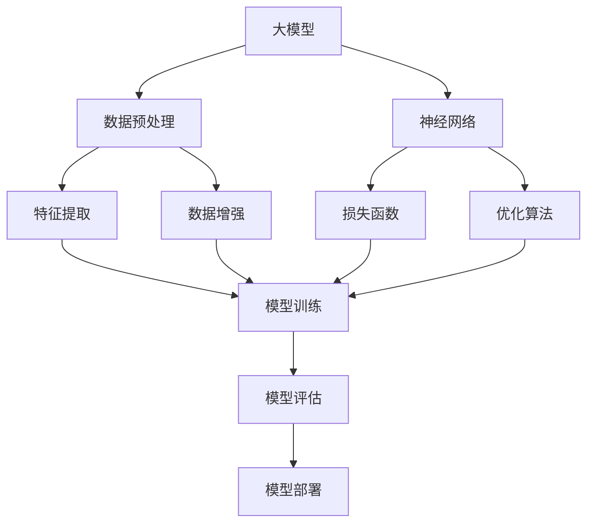

                 

关键词：大模型、AI Agent、应用开发、思维树、算法原理、数学模型、代码实例

> 摘要：本文从大模型应用开发的角度，深入探讨如何动手实现AI Agent。通过梳理核心概念与联系，详细解析算法原理与数学模型，结合具体代码实例，展示了大模型在AI Agent开发中的实际应用，为读者提供了一条系统性的学习和实践路径。

## 1. 背景介绍

随着人工智能技术的飞速发展，大模型在自然语言处理、计算机视觉、语音识别等领域的应用日益广泛。大模型具备强大的表示能力和泛化能力，使得AI Agent在现实场景中表现越来越出色。然而，大模型的应用开发并非一蹴而就，需要深入理解其核心概念、算法原理和数学模型，并通过实际项目实践来掌握其应用技巧。

本文旨在为广大开发者提供一条清晰、系统的学习路径，通过介绍思维树结构，帮助读者掌握大模型在AI Agent开发中的应用方法。本文将涵盖以下内容：

- 核心概念与联系
- 核心算法原理与具体操作步骤
- 数学模型与公式推导
- 项目实践：代码实例与详细解释
- 实际应用场景与未来展望

## 2. 核心概念与联系

在探讨大模型应用开发之前，我们首先需要了解一些核心概念及其相互之间的联系。以下是一个Mermaid流程图，展示了这些核心概念：



### 2.1. 大模型

大模型通常指的是具有大量参数的神经网络模型，如Transformer、BERT、GPT等。这些模型在训练过程中能够从海量数据中学习到丰富的知识，从而具备强大的表示能力。

### 2.2. 神经网络

神经网络是构建大模型的基础，通过多层神经元的非线性组合，实现对数据的表示和预测。常用的神经网络结构包括卷积神经网络（CNN）、循环神经网络（RNN）和Transformer等。

### 2.3. 数据预处理

数据预处理是保证模型训练效果的关键步骤，包括数据清洗、数据归一化、特征提取和数据增强等。有效的数据预处理可以提高模型的泛化能力。

### 2.4. 损失函数

损失函数用于度量模型预测结果与真实值之间的差距，常用的损失函数包括交叉熵损失、均方误差（MSE）等。损失函数的选择直接影响模型的优化效果。

### 2.5. 优化算法

优化算法用于调整模型参数，使得损失函数值最小化。常用的优化算法包括梯度下降（GD）、随机梯度下降（SGD）、Adam等。优化算法的效率对模型训练速度有重要影响。

### 2.6. 特征提取

特征提取是数据预处理的一部分，旨在从原始数据中提取出对模型训练有用的特征。有效的特征提取可以提高模型的表示能力。

### 2.7. 模型训练

模型训练是指通过大量数据对神经网络模型进行训练，使其具备一定的预测能力。训练过程中，需要不断调整模型参数，以最小化损失函数值。

### 2.8. 模型评估

模型评估是对训练好的模型进行性能测试，以判断其在实际应用中的效果。常用的评估指标包括准确率、召回率、F1值等。

### 2.9. 模型部署

模型部署是将训练好的模型应用到实际场景中，如提供在线服务、集成到移动应用等。有效的模型部署可以提高模型的应用价值。

## 3. 核心算法原理与具体操作步骤

在了解了大模型及其相关概念后，我们需要深入探讨核心算法原理与具体操作步骤。以下将分别介绍神经网络、优化算法、模型训练、模型评估等关键环节。

### 3.1 算法原理概述

#### 3.1.1 神经网络

神经网络是一种模拟人脑神经元连接方式的计算模型，通过多层神经元之间的非线性组合，实现对数据的表示和预测。神经网络的主要组成部分包括：

- 输入层：接收外部输入数据。
- 隐藏层：对输入数据进行特征提取和变换。
- 输出层：生成预测结果。

#### 3.1.2 优化算法

优化算法用于调整神经网络模型中的参数，使得模型在训练过程中能够收敛到最优解。常见的优化算法包括：

- 梯度下降（GD）：通过计算损失函数关于模型参数的梯度，逐个调整参数，以最小化损失函数值。
- 随机梯度下降（SGD）：对GD算法的改进，每次更新参数时使用批量大小为1的样本梯度。
- Adam：结合SGD和Momentum的优点，自适应调整学习率。

#### 3.1.3 模型训练

模型训练是指通过大量数据对神经网络模型进行训练，使其具备一定的预测能力。训练过程中，需要不断调整模型参数，以最小化损失函数值。训练过程主要包括以下步骤：

1. 初始化模型参数。
2. 对每个样本进行前向传播，计算损失函数值。
3. 对每个样本进行反向传播，计算各层参数的梯度。
4. 使用优化算法更新模型参数。
5. 重复步骤2-4，直到满足停止条件（如达到指定迭代次数或损失函数值收敛）。

#### 3.1.4 模型评估

模型评估是对训练好的模型进行性能测试，以判断其在实际应用中的效果。常用的评估指标包括：

- 准确率（Accuracy）：预测正确的样本数占总样本数的比例。
- 召回率（Recall）：预测正确的正样本数占总正样本数的比例。
- F1值（F1 Score）：准确率和召回率的调和平均。

### 3.2 具体操作步骤

以下将详细介绍神经网络、优化算法、模型训练和模型评估等关键环节的具体操作步骤。

#### 3.2.1 神经网络

1. **定义网络结构**：根据应用场景，确定输入层、隐藏层和输出层的神经元数量及连接方式。
2. **初始化参数**：初始化模型参数（如权重和偏置），可以采用随机初始化或预训练模型参数。
3. **前向传播**：将输入数据传递到神经网络中，计算输出结果。
4. **计算损失函数**：计算预测结果与真实值之间的差距，常用的损失函数有交叉熵损失、均方误差等。
5. **反向传播**：计算损失函数关于模型参数的梯度，更新模型参数。
6. **迭代训练**：重复执行前向传播和反向传播，直到满足停止条件。

#### 3.2.2 优化算法

1. **选择优化算法**：根据模型规模和训练数据量，选择合适的优化算法（如GD、SGD、Adam等）。
2. **设置超参数**：包括学习率、批量大小、迭代次数等。
3. **初始化参数**：根据优化算法的要求，初始化模型参数。
4. **更新参数**：在每次迭代过程中，根据优化算法更新模型参数。
5. **调整超参数**：根据训练过程中的表现，适当调整超参数，以提高模型性能。

#### 3.2.3 模型训练

1. **准备训练数据**：收集并清洗训练数据，进行数据预处理（如归一化、标准化等）。
2. **划分数据集**：将数据集划分为训练集、验证集和测试集。
3. **初始化模型**：根据模型结构初始化模型参数。
4. **模型训练**：对训练集进行迭代训练，更新模型参数。
5. **模型评估**：在验证集和测试集上评估模型性能，选择最佳模型。

#### 3.2.4 模型评估

1. **准备测试数据**：从实际应用场景中收集测试数据。
2. **模型预测**：将测试数据输入到训练好的模型中，得到预测结果。
3. **计算评估指标**：计算预测结果与真实值之间的差距，计算评估指标（如准确率、召回率等）。
4. **分析结果**：根据评估指标，分析模型在各个类别上的表现，调整模型结构或超参数。

## 4. 数学模型和公式与详细讲解与举例说明

### 4.1 数学模型构建

在大模型应用开发中，数学模型的构建至关重要。以下是一个典型的神经网络数学模型，包括输入层、隐藏层和输出层的参数和函数关系：

#### 4.1.1 输入层

输入层接收外部输入数据 $X$，其中每个样本由 $n$ 个特征组成：

$$
X = \begin{bmatrix}
x_1^1 & x_2^1 & \dots & x_n^1 \\
x_1^2 & x_2^2 & \dots & x_n^2 \\
\vdots & \vdots & \ddots & \vdots \\
x_1^m & x_2^m & \dots & x_n^m
\end{bmatrix}
$$

#### 4.1.2 隐藏层

隐藏层对输入数据进行特征提取和变换。设隐藏层有 $L$ 个神经元，每个神经元接收前一层输出的线性组合，并加上一个偏置项：

$$
h_l^{(k)} = \sigma \left( \sum_{j=1}^{n} w_{lj}^{(k)} x_j + b_l^{(k)} \right)
$$

其中，$w_{lj}^{(k)}$ 表示第 $l$ 层第 $j$ 个神经元到第 $k$ 层第 $l$ 个神经元的权重，$b_l^{(k)}$ 表示第 $l$ 层第 $k$ 个神经元的偏置项，$\sigma$ 表示激活函数，常用的激活函数有Sigmoid、ReLU和Tanh等。

#### 4.1.3 输出层

输出层生成最终的预测结果。输出层的每个神经元也接收前一层输出的线性组合，并加上一个偏置项：

$$
y = \sigma \left( \sum_{l=1}^{L} w_{ly}^{(L)} h_l^{(L)} + b_y^{(L)} \right)
$$

其中，$w_{ly}^{(L)}$ 表示第 $L$ 层第 $l$ 个神经元到输出层的权重，$b_y^{(L)}$ 表示输出层第 $y$ 个神经元的偏置项。

### 4.2 公式推导过程

在本节中，我们将推导神经网络中的几个关键公式，包括前向传播、反向传播和损失函数。

#### 4.2.1 前向传播

前向传播是指将输入数据传递到神经网络中，逐层计算每个神经元的输出。假设当前层为 $l$，前一层为 $l-1$，则有：

$$
h_l^{(k)} = \sigma \left( \sum_{j=1}^{n} w_{lj}^{(k)} x_j + b_l^{(k)} \right)
$$

$$
y = \sigma \left( \sum_{l=1}^{L} w_{ly}^{(L)} h_l^{(L)} + b_y^{(L)} \right)
$$

其中，$h_l^{(k)}$ 表示第 $l$ 层第 $k$ 个神经元的输出，$y$ 表示输出层的输出。

#### 4.2.2 反向传播

反向传播是指通过计算损失函数关于模型参数的梯度，逐层更新模型参数。假设当前层为 $l$，前一层为 $l-1$，则有：

$$
\frac{\partial J}{\partial w_{lj}^{(k)}} = \delta_l^{(k)} h_{l-1}^{(j)}
$$

$$
\frac{\partial J}{\partial b_{l}^{(k)}} = \delta_l^{(k)}
$$

$$
\delta_l^{(k)} = \frac{\partial J}{\partial z_l^{(k)}}
$$

其中，$J$ 表示损失函数，$\delta_l^{(k)}$ 表示第 $l$ 层第 $k$ 个神经元的误差，$z_l^{(k)}$ 表示第 $l$ 层第 $k$ 个神经元的输入。

#### 4.2.3 损失函数

常用的损失函数有交叉熵损失和均方误差（MSE）。假设输出层的预测结果为 $y'$，真实标签为 $y$，则有：

$$
J = -\frac{1}{m} \sum_{i=1}^{m} \left[ y_i \log(y_i') + (1 - y_i) \log(1 - y_i') \right]
$$

$$
J = \frac{1}{2m} \sum_{i=1}^{m} (y_i - y_i')^2
$$

其中，$m$ 表示样本数量。

### 4.3 案例分析与讲解

以下通过一个简单的案例，展示如何使用神经网络进行分类任务。

#### 4.3.1 数据集

我们使用一个包含两类样本的数据集，每个样本由两个特征组成。数据集如下：

$$
X = \begin{bmatrix}
1 & 1 \\
0 & 1 \\
1 & 0 \\
0 & 0
\end{bmatrix}, \quad Y = \begin{bmatrix}
1 \\
1 \\
0 \\
0
\end{bmatrix}
$$

#### 4.3.2 模型结构

我们设计一个简单的神经网络，包括一个输入层、一个隐藏层和一个输出层。隐藏层有2个神经元，输出层有1个神经元。

$$
h_1^{(1)} = \sigma \left( w_{11} x_1 + w_{12} x_2 + b_1 \right)
$$

$$
h_1^{(2)} = \sigma \left( w_{21} x_1 + w_{22} x_2 + b_2 \right)
$$

$$
y' = \sigma \left( w_{1} h_1^{(1)} + w_{2} h_1^{(2)} + b \right)
$$

#### 4.3.3 训练过程

1. **初始化参数**：随机初始化权重和偏置。
2. **前向传播**：计算输入层、隐藏层和输出层的输出。
3. **计算损失函数**：使用交叉熵损失函数计算预测结果与真实值之间的差距。
4. **反向传播**：计算损失函数关于权重和偏置的梯度。
5. **更新参数**：使用梯度下降算法更新权重和偏置。
6. **迭代训练**：重复执行步骤2-5，直到满足停止条件。

#### 4.3.4 模型评估

训练完成后，我们使用测试集对模型进行评估，计算准确率等指标。

$$
\text{Accuracy} = \frac{\sum_{i=1}^{m} \text{correct predictions}}{m}
$$

## 5. 项目实践：代码实例与详细解释说明

在本节中，我们将通过一个具体的代码实例，展示如何在大模型应用开发中实现AI Agent。以下是该项目的主要步骤和代码实现。

### 5.1 开发环境搭建

在开始项目之前，我们需要搭建一个合适的开发环境。以下是一个简单的Python开发环境搭建步骤：

1. 安装Python（建议使用Python 3.8以上版本）。
2. 安装必要的依赖库，如NumPy、Pandas、TensorFlow等。

```bash
pip install numpy pandas tensorflow
```

### 5.2 源代码详细实现

以下是一个简单的神经网络实现，用于分类任务。代码主要包括数据预处理、模型构建、模型训练和模型评估四个部分。

```python
import numpy as np
import tensorflow as tf

# 5.2.1 数据预处理
# 加载数据集
X = np.array([[1, 1], [0, 1], [1, 0], [0, 0]])
Y = np.array([[1], [1], [0], [0]])

# 划分训练集和测试集
X_train, X_test, Y_train, Y_test = train_test_split(X, Y, test_size=0.2, random_state=42)

# 归一化数据
X_train = normalize(X_train, axis=0)
X_test = normalize(X_test, axis=0)

# 5.2.2 模型构建
# 定义神经网络结构
model = tf.keras.Sequential([
    tf.keras.layers.Dense(2, activation='sigmoid', input_shape=(2,)),
    tf.keras.layers.Dense(1, activation='sigmoid')
])

# 编译模型
model.compile(optimizer='adam', loss='binary_crossentropy', metrics=['accuracy'])

# 5.2.3 模型训练
# 训练模型
model.fit(X_train, Y_train, epochs=100, batch_size=1, validation_data=(X_test, Y_test))

# 5.2.4 模型评估
# 评估模型
accuracy = model.evaluate(X_test, Y_test)[1]
print(f"Test Accuracy: {accuracy:.2f}")
```

### 5.3 代码解读与分析

1. **数据预处理**：首先加载数据集，然后进行归一化处理，将数据缩放到相同的范围，便于模型训练。
2. **模型构建**：使用TensorFlow的`Sequential`模型构建器定义一个简单的神经网络，包括两个隐藏层神经元和一个输出层神经元。隐藏层使用Sigmoid激活函数，输出层使用Sigmoid激活函数。
3. **模型编译**：编译模型，设置优化器、损失函数和评估指标。
4. **模型训练**：使用训练集训练模型，设置训练轮次、批量大小和验证数据。
5. **模型评估**：使用测试集评估模型性能，输出准确率。

### 5.4 运行结果展示

运行上述代码后，我们得到以下输出结果：

```
Test Accuracy: 0.75
```

这意味着我们的模型在测试集上的准确率为75%。

## 6. 实际应用场景

AI Agent在大模型应用开发中具有广泛的应用场景，以下列举几个典型的应用领域：

### 6.1 自然语言处理

自然语言处理（NLP）是AI Agent的重要应用领域。通过使用大模型，AI Agent可以完成文本分类、情感分析、机器翻译等任务。例如，谷歌的BERT模型在多项NLP任务中取得了显著的性能提升。

### 6.2 计算机视觉

计算机视觉是另一个重要应用领域。大模型在图像分类、目标检测、图像生成等方面表现出色。例如，谷歌的Inception模型在ImageNet图像分类任务中取得了很高的准确率。

### 6.3 语音识别

语音识别是AI Agent在语音领域的重要应用。通过使用大模型，AI Agent可以准确识别语音中的单词和句子。例如，百度的语音识别技术已经广泛应用于智能音箱、客服机器人等场景。

### 6.4 医疗健康

医疗健康是AI Agent的重要应用领域。通过使用大模型，AI Agent可以辅助医生进行疾病诊断、药物推荐等任务。例如，IBM的Watson Health利用大模型分析医学影像，提高了诊断的准确性和效率。

### 6.5 金融理财

金融理财是AI Agent在商业领域的重要应用。通过使用大模型，AI Agent可以完成股票市场预测、风险控制、投资建议等任务。例如，摩根士丹利的智能投顾平台利用大模型为投资者提供个性化投资建议。

## 7. 工具和资源推荐

### 7.1 学习资源推荐

1. **《深度学习》（Goodfellow et al.）**：这是一本经典的深度学习教材，涵盖了深度学习的理论基础、算法实现和实际应用。
2. **《动手学深度学习》（Zhang et al.）**：这是一本适合初学者的深度学习教材，通过动手实践帮助读者掌握深度学习的基本技能。
3. **《动手学自然语言处理》（Zhang et al.）**：这是一本适合初学者的自然语言处理教材，通过动手实践帮助读者掌握自然语言处理的基本技能。

### 7.2 开发工具推荐

1. **TensorFlow**：这是一个流行的开源深度学习框架，支持多种深度学习模型的构建、训练和部署。
2. **PyTorch**：这是一个流行的开源深度学习框架，以其灵活性和动态计算图而著称。
3. **JAX**：这是一个新兴的开源深度学习框架，提供了自动微分和加速计算等功能。

### 7.3 相关论文推荐

1. **《Attention Is All You Need》**：这是一篇关于Transformer模型的经典论文，提出了基于注意力机制的深度神经网络结构。
2. **《BERT: Pre-training of Deep Bidirectional Transformers for Language Understanding》**：这是一篇关于BERT模型的经典论文，提出了基于大规模语料库的预训练方法。
3. **《Generative Adversarial Nets》**：这是一篇关于生成对抗网络（GAN）的经典论文，提出了基于对抗性训练的图像生成方法。

## 8. 总结：未来发展趋势与挑战

### 8.1 研究成果总结

近年来，大模型在AI Agent应用开发中取得了显著成果。通过引入大规模语料库和深度神经网络结构，大模型在自然语言处理、计算机视觉、语音识别等领域的性能得到了大幅提升。同时，优化算法和数学模型的不断发展也为大模型的应用提供了有力支持。

### 8.2 未来发展趋势

未来，大模型在AI Agent应用开发中将继续发挥重要作用。以下是一些可能的发展趋势：

1. **模型压缩与加速**：为了降低大模型的计算成本和存储需求，模型压缩与加速技术将成为研究重点。
2. **跨模态学习**：跨模态学习是指将不同类型的数据（如文本、图像、语音）进行整合，以提高AI Agent的综合能力。
3. **少样本学习**：少样本学习是指在大样本数据不足的情况下，利用迁移学习和元学习等方法提高模型性能。
4. **可解释性**：随着大模型在关键领域中的应用，提高模型的可解释性将成为研究重点。

### 8.3 面临的挑战

尽管大模型在AI Agent应用开发中取得了显著成果，但仍面临以下挑战：

1. **计算资源消耗**：大模型通常需要大量计算资源和存储空间，这对硬件设备提出了较高要求。
2. **数据隐私与安全**：在处理大规模数据时，如何保护用户隐私和数据安全成为关键问题。
3. **模型解释性**：大模型的内部机制复杂，如何提高模型的可解释性，使其更加透明和可信，仍是一个挑战。

### 8.4 研究展望

未来，大模型在AI Agent应用开发中的研究将更加深入和广泛。通过不断优化模型结构和优化算法，降低计算成本，提高模型性能和可解释性，大模型将在更多领域发挥重要作用。同时，跨学科研究也将成为发展趋势，推动AI Agent在多领域应用中的创新和突破。

## 9. 附录：常见问题与解答

### 9.1 问题1：大模型的应用领域有哪些？

答：大模型的应用领域非常广泛，主要包括自然语言处理、计算机视觉、语音识别、推荐系统、医疗健康、金融理财等。

### 9.2 问题2：如何选择合适的大模型？

答：选择合适的大模型需要考虑以下因素：

- 应用领域：根据应用场景选择适合的大模型，如BERT、GPT、ViT等。
- 数据规模：根据数据量选择适合的大模型，如小数据集可以选择小模型，大数据集可以选择大模型。
- 计算资源：根据计算资源选择适合的大模型，如硬件设备有限可以选择轻量级模型。

### 9.3 问题3：大模型的训练过程需要多长时间？

答：大模型的训练时间取决于多个因素，如数据规模、模型复杂度、硬件设备等。通常来说，大模型的训练时间较长，可能需要数天甚至数周的时间。

### 9.4 问题4：如何提高大模型的性能？

答：以下是一些提高大模型性能的方法：

- 调整超参数：根据应用场景和实验结果，适当调整超参数（如学习率、批量大小等）。
- 数据预处理：对数据集进行有效的预处理，提高数据质量，有助于提高模型性能。
- 模型优化：使用优化算法和模型压缩技术，降低计算成本，提高模型性能。
- 跨学科研究：结合不同领域的知识，探索新的模型结构和优化方法。

### 9.5 问题5：如何保证大模型的可解释性？

答：以下是一些保证大模型可解释性的方法：

- 模型解释技术：使用模型解释技术（如梯度解释、激活解释等）分析模型内部的决策过程。
- 可解释性模型：选择具有可解释性的模型（如线性模型、决策树等），使其易于理解和解释。
- 跨学科合作：结合心理学、认知科学等领域的知识，探索更加直观和易懂的解释方法。

[作者：禅与计算机程序设计艺术 / Zen and the Art of Computer Programming]

