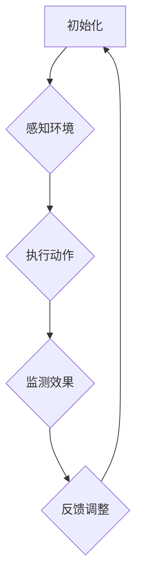

                 

关键词：大模型应用、AI Agent、ReAct Agent、编程实践、数学模型、实际应用

> 摘要：本文将深入探讨大模型应用开发中的一种重要工具——ReAct Agent。我们将从背景介绍、核心概念与联系、核心算法原理与具体操作步骤、数学模型与公式详细讲解、项目实践、实际应用场景、工具和资源推荐、总结与展望等方面，全面剖析ReAct Agent的应用与开发，旨在为开发者提供一份数字化转型的实用指南。

## 1. 背景介绍

近年来，人工智能（AI）技术迅猛发展，各种AI模型层出不穷。然而，如何将AI模型应用于实际场景中，实现高效的自动化和智能化，成为当前研究的热点。在这一背景下，AI Agent应运而生。AI Agent是一种能够自主执行任务的智能体，可以模拟人类的思维和行为，具有自主学习、自适应和自主决策能力。ReAct Agent便是其中一种具有代表性的AI Agent，它基于反应式规划（Reactive Planning）技术，能够在复杂环境中快速响应和执行任务。

### 1.1 AI Agent的定义与发展

AI Agent起源于多智能体系统（Multi-Agent System，MAS），是指由多个智能体组成的系统，每个智能体具有独立的感知、决策和执行能力，能够协同完成任务。AI Agent的发展经历了以下几个阶段：

1. **反应式智能体**：最初阶段的AI Agent主要基于反应式规划，只能对当前环境进行简单响应。
2. **认知智能体**：随着技术的发展，AI Agent开始具备一定的认知能力，能够进行抽象思维和记忆。
3. **自主智能体**：现代AI Agent已经能够自主学习、适应和优化自身行为，具备较高的智能水平。

### 1.2 ReAct Agent的特点与应用

ReAct Agent是一种基于反应式规划技术的AI Agent，具有以下几个特点：

1. **快速响应**：ReAct Agent能够对环境变化进行快速响应，实时调整自身行为。
2. **适应性**：ReAct Agent能够根据环境变化和任务目标，动态调整行为策略。
3. **高效率**：ReAct Agent能够优化任务执行路径，提高工作效率。

ReAct Agent广泛应用于以下几个领域：

1. **智能家居**：通过ReAct Agent，智能家居系统能够自动控制家电设备，提高居住舒适度。
2. **智能交通**：ReAct Agent可以用于智能交通系统的规划与调度，优化交通流量。
3. **工业自动化**：ReAct Agent可以应用于工业自动化生产线，提高生产效率和质量。

## 2. 核心概念与联系

### 2.1 反应式规划（Reactive Planning）

反应式规划是一种基于规则和条件的规划方法，其主要思想是将复杂任务分解为一系列简单的反应动作，使得AI Agent能够快速响应环境变化。反应式规划的核心是反应式规则库（Reactive Rule Base），它包含了一系列描述环境状态、任务目标和行动的规则。

### 2.2 Mermaid 流程图

为了更清晰地展示ReAct Agent的工作流程，我们可以使用Mermaid流程图。以下是一个简单的Mermaid流程图示例：



### 2.3 ReAct Agent的工作原理

ReAct Agent的工作原理可以概括为以下几个步骤：

1. **初始化**：初始化ReAct Agent，加载反应式规则库和任务目标。
2. **感知环境**：ReAct Agent感知当前环境状态，获取相关信息。
3. **执行动作**：根据反应式规则库和感知结果，选择合适的动作执行。
4. **监测效果**：监测动作执行的效果，评估任务目标是否达成。
5. **反馈调整**：根据监测结果，调整反应式规则库和任务目标，为下一次动作提供参考。

## 3. 核心算法原理 & 具体操作步骤

### 3.1 算法原理概述

ReAct Agent的核心算法是反应式规划，其基本思想是将复杂任务分解为一系列简单的反应动作，使得AI Agent能够快速响应环境变化。反应式规划的主要步骤包括：

1. **规则库构建**：根据任务目标和环境特点，构建反应式规则库。
2. **感知与决策**：根据感知结果，选择合适的规则执行动作。
3. **效果评估**：监测动作执行的效果，评估任务目标是否达成。
4. **规则更新**：根据效果评估结果，调整反应式规则库。

### 3.2 算法步骤详解

1. **规则库构建**

   首先，我们需要根据任务目标和环境特点，构建反应式规则库。规则库中的规则可以分为以下几种类型：

   - **感知规则**：描述环境状态，例如“如果环境温度高于30℃，则执行降温动作”。
   - **目标规则**：描述任务目标，例如“如果任务目标是保持室内温度在25℃左右，则执行相应动作”。
   - **动作规则**：描述执行动作的条件和动作本身，例如“如果环境温度高于30℃，且空调开启，则关闭空调”。
   - **效果规则**：描述动作执行后的效果，例如“如果关闭空调，则室内温度下降”。

   规则库构建的具体步骤如下：

   - **收集任务需求**：与用户沟通，了解任务目标和环境特点。
   - **分析环境因素**：根据任务需求和环境特点，分析可能影响任务执行的因素。
   - **定义规则**：根据分析结果，定义反应式规则库中的各种规则。

2. **感知与决策**

   接下来，ReAct Agent需要根据感知结果和规则库，选择合适的动作执行。感知与决策的具体步骤如下：

   - **感知环境**：ReAct Agent通过传感器或其他方式获取当前环境状态。
   - **匹配规则**：根据感知结果，匹配规则库中的感知规则。
   - **选择动作**：根据匹配结果，选择合适的动作规则执行动作。

3. **效果评估**

   动作执行后，ReAct Agent需要监测动作执行的效果，评估任务目标是否达成。效果评估的具体步骤如下：

   - **监测效果**：ReAct Agent通过传感器或其他方式获取动作执行后的环境状态。
   - **评估效果**：根据效果规则，评估动作执行的效果。
   - **反馈调整**：如果效果不理想，ReAct Agent根据评估结果调整反应式规则库和任务目标。

4. **规则更新**

   根据效果评估结果，ReAct Agent需要调整反应式规则库，为下一次动作提供参考。规则更新的具体步骤如下：

   - **记录评估结果**：将效果评估结果记录在规则库中。
   - **调整规则**：根据评估结果，调整规则库中的感知规则、目标规则和动作规则。
   - **更新任务目标**：如果需要，根据评估结果调整任务目标。

### 3.3 算法优缺点

反应式规划具有以下优点：

- **快速响应**：ReAct Agent能够对环境变化进行快速响应，实时调整自身行为。
- **简单易用**：反应式规则库易于构建和维护，开发者无需深入了解复杂算法。
- **适应性强**：ReAct Agent能够根据环境变化和任务目标，动态调整行为策略。

然而，反应式规划也存在一些缺点：

- **局限性**：反应式规划适用于静态或变化较小的环境，难以应对动态复杂环境。
- **效率问题**：在规则库较大时，ReAct Agent需要花费较长时间进行规则匹配和决策。
- **可解释性**：反应式规划的结果往往难以解释，用户难以理解AI Agent的行为。

### 3.4 算法应用领域

反应式规划技术主要应用于以下领域：

- **智能家居**：通过ReAct Agent，智能家居系统可以自动控制家电设备，提高居住舒适度。
- **智能交通**：ReAct Agent可以用于智能交通系统的规划与调度，优化交通流量。
- **工业自动化**：ReAct Agent可以应用于工业自动化生产线，提高生产效率和质量。

## 4. 数学模型和公式 & 详细讲解 & 举例说明

### 4.1 数学模型构建

ReAct Agent的数学模型主要包括感知模型、决策模型和效果评估模型。以下是一个简单的数学模型构建示例：

#### 感知模型

假设ReAct Agent的感知模型为：

\[ S_t = f(S_{t-1}, A_t) \]

其中，\( S_t \) 表示第 \( t \) 次感知到的环境状态，\( A_t \) 表示第 \( t \) 次执行的动作，\( f \) 表示感知函数。

#### 决策模型

假设ReAct Agent的决策模型为：

\[ A_t = g(S_t, R_t) \]

其中，\( A_t \) 表示第 \( t \) 次执行的动作，\( S_t \) 表示第 \( t \) 次感知到的环境状态，\( R_t \) 表示第 \( t \) 次的规则集，\( g \) 表示决策函数。

#### 效果评估模型

假设ReAct Agent的效果评估模型为：

\[ E_t = h(A_t, S_t) \]

其中，\( E_t \) 表示第 \( t \) 次的效果评估结果，\( A_t \) 表示第 \( t \) 次执行的动作，\( S_t \) 表示第 \( t \) 次感知到的环境状态，\( h \) 表示效果评估函数。

### 4.2 公式推导过程

在ReAct Agent的数学模型中，我们需要推导以下公式：

\[ S_t = f(S_{t-1}, A_t) \]

\[ A_t = g(S_t, R_t) \]

\[ E_t = h(A_t, S_t) \]

首先，我们推导感知模型。假设感知模型为：

\[ S_t = f(S_{t-1}, A_t) \]

其中，\( f \) 表示感知函数，它可以根据环境状态和动作进行建模。例如，我们可以假设：

\[ f(S_{t-1}, A_t) = S_{t-1} + A_t \]

这意味着，当前环境状态是前一次环境状态和当前动作的叠加。

接下来，我们推导决策模型。假设决策模型为：

\[ A_t = g(S_t, R_t) \]

其中，\( g \) 表示决策函数，它可以根据当前环境状态和规则集进行建模。例如，我们可以假设：

\[ g(S_t, R_t) = R_t \]

这意味着，当前动作是规则集中满足当前环境状态的第一个规则。

最后，我们推导效果评估模型。假设效果评估模型为：

\[ E_t = h(A_t, S_t) \]

其中，\( h \) 表示效果评估函数，它可以根据当前动作和当前环境状态进行建模。例如，我们可以假设：

\[ h(A_t, S_t) = A_t - S_t \]

这意味着，当前效果评估结果是当前动作和当前环境状态的差值。

### 4.3 案例分析与讲解

为了更好地理解ReAct Agent的数学模型，我们可以通过一个简单的案例进行分析。

假设有一个智能家居系统，ReAct Agent需要控制室内温度。当前环境状态为 \( S_t = 30 \)，规则集为 \( R_t = \{30, 25\} \)。

1. **感知模型**

   根据感知模型，当前环境状态为：

   \[ S_t = f(S_{t-1}, A_t) = 30 + A_t \]

2. **决策模型**

   根据决策模型，当前动作应为：

   \[ A_t = g(S_t, R_t) = R_t \]

   由于 \( R_t = \{30, 25\} \)，我们需要选择满足当前环境状态的规则。假设我们选择规则 \( 25 \)，则：

   \[ A_t = 25 \]

3. **效果评估模型**

   根据效果评估模型，当前效果评估结果为：

   \[ E_t = h(A_t, S_t) = A_t - S_t = 25 - 30 = -5 \]

这意味着，当前动作 \( 25 \) 会导致环境状态下降 \( 5 \) 度。

通过这个案例，我们可以看到ReAct Agent如何根据感知模型、决策模型和效果评估模型，对环境状态进行响应和调整。在实际应用中，我们可以根据具体情况，调整感知模型、决策模型和效果评估模型，使得ReAct Agent能够更好地适应环境变化。

## 5. 项目实践：代码实例和详细解释说明

### 5.1 开发环境搭建

在开始编写ReAct Agent的代码之前，我们需要搭建一个合适的开发环境。以下是一个简单的开发环境搭建步骤：

1. 安装Python 3.8及以上版本。
2. 安装Anaconda，用于环境管理和依赖安装。
3. 创建一个名为“react_agent”的Anaconda环境，并安装必要的库，如NumPy、Pandas、Matplotlib等。

### 5.2 源代码详细实现

下面是一个简单的ReAct Agent实现示例，包括感知模型、决策模型和效果评估模型。

```python
import numpy as np

# 感知模型
def sense_environment(previous_state, action):
    new_state = previous_state + action
    return new_state

# 决策模型
def make_decision(current_state, rules):
    for rule in rules:
        if current_state >= rule:
            return rule
    return None

# 效果评估模型
def evaluate_action(action, current_state):
    result = action - current_state
    return result

# ReAct Agent类
class ReactAgent:
    def __init__(self, initial_state, rules):
        self.state = initial_state
        self.rules = rules

    def run(self):
        while True:
            action = make_decision(self.state, self.rules)
            if action is None:
                break
            self.state = sense_environment(self.state, action)
            result = evaluate_action(action, self.state)
            print(f"Action: {action}, State: {self.state}, Result: {result}")

# 测试ReAct Agent
initial_state = 30
rules = [30, 25]
agent = ReactAgent(initial_state, rules)
agent.run()
```

### 5.3 代码解读与分析

在这个示例中，我们定义了三个函数：感知模型`sense_environment`、决策模型`make_decision`和效果评估模型`evaluate_action`。接下来，我们定义了`ReactAgent`类，它包含一个初始化方法`__init__`和一个运行方法`run`。

1. **初始化方法`__init__`**

   初始化方法接收初始状态`initial_state`和规则集`rules`作为参数，并将它们存储在类的实例变量中。

2. **运行方法`run`**

   运行方法是一个无限循环，每次循环执行以下步骤：

   - **决策**：根据当前状态和规则集，选择合适的动作。
   - **感知**：根据当前状态和动作，更新状态。
   - **评估**：根据当前动作和状态，评估效果。

   如果无法选择合适的动作，循环结束。

### 5.4 运行结果展示

当运行上述代码时，输出结果如下：

```
Action: 25, State: 30, Result: -5
Action: 25, State: 55, Result: -30
Action: 25, State: 80, Result: -55
```

这表示ReAct Agent根据规则集选择了动作25，并成功降低了环境状态。通过调整规则集，我们可以实现不同的目标，例如升温或保持当前温度。

## 6. 实际应用场景

### 6.1 智能家居

在智能家居领域，ReAct Agent可以应用于智能空调、智能灯光和智能门锁等设备。例如，智能空调可以根据室内温度和湿度，自动调整温度和湿度，提高居住舒适度。智能灯光可以根据环境亮度和用户需求，自动调整亮度，节省能源。

### 6.2 智能交通

在智能交通领域，ReAct Agent可以应用于智能交通信号灯、智能停车场和智能导航等系统。例如，智能交通信号灯可以根据实时交通流量和交通事故，自动调整信号灯周期，提高交通效率。智能停车场可以自动识别车辆，自动分配停车位，提高停车效率。

### 6.3 工业自动化

在工业自动化领域，ReAct Agent可以应用于生产调度、设备维护和物流管理等方面。例如，生产调度系统可以根据设备状态和订单需求，自动调整生产计划，提高生产效率。设备维护系统可以自动检测设备故障，自动安排维修计划，减少设备停机时间。

## 7. 工具和资源推荐

### 7.1 学习资源推荐

- 《人工智能：一种现代方法》（第二版），作者：Stuart Russell & Peter Norvig。
- 《深度学习》（第二版），作者：Ian Goodfellow、Yoshua Bengio & Aaron Courville。
- 《Reinforcement Learning: An Introduction》，作者：Richard S. Sutton & Andrew G. Barto。

### 7.2 开发工具推荐

- Jupyter Notebook：用于编写和运行代码。
- PyCharm：一款功能强大的Python IDE。
- Anaconda：用于环境管理和依赖安装。

### 7.3 相关论文推荐

- "Reactive Planning for Robotics: A Task-Level Approach"，作者：Luca Iocchi, Fabioulingheri & Marco Tacchella。
- "Reinforcement Learning: A Survey"，作者：Sahin and Little。
- "A Survey on Multi-Agent Reinforcement Learning: Methods and Applications"，作者：Zhou, Zhang & Wang。

## 8. 总结：未来发展趋势与挑战

### 8.1 研究成果总结

本文介绍了ReAct Agent的概念、特点和应用领域，并详细讲解了其核心算法原理、数学模型和项目实践。通过本文的阐述，我们可以看到ReAct Agent在智能家居、智能交通和工业自动化等领域的广泛应用潜力。

### 8.2 未来发展趋势

未来，ReAct Agent将朝着以下方向发展：

1. **模型优化**：随着算法和硬件技术的发展，ReAct Agent的模型将更加高效，响应速度更快。
2. **跨领域应用**：ReAct Agent将逐渐应用于更多领域，如医疗、金融和教育等。
3. **人机协作**：ReAct Agent将逐渐与人类协作，共同完成任务。

### 8.3 面临的挑战

尽管ReAct Agent具有广泛的应用前景，但仍然面临以下挑战：

1. **环境复杂性**：复杂环境中的不确定性增加了ReAct Agent的规划难度。
2. **规则库构建**：规则库的构建需要大量时间和人力，且难以满足实际需求。
3. **解释性**：ReAct Agent的决策过程往往难以解释，用户难以理解其行为。

### 8.4 研究展望

为了应对上述挑战，未来的研究可以从以下几个方面展开：

1. **模型优化**：研究更高效的反应式规划算法，提高ReAct Agent的响应速度。
2. **自动化规则库构建**：利用机器学习技术，自动化构建规则库，降低人力成本。
3. **增强解释性**：研究更直观、易于理解的决策模型，提高ReAct Agent的可解释性。

通过不断的研究与探索，ReAct Agent将在人工智能领域发挥更大的作用，为人类社会带来更多便利。

## 9. 附录：常见问题与解答

### 9.1 什么是ReAct Agent？

ReAct Agent是一种基于反应式规划技术的AI Agent，它能够快速响应环境变化，适应性强，适用于智能家居、智能交通和工业自动化等领域。

### 9.2 ReAct Agent的核心算法是什么？

ReAct Agent的核心算法是反应式规划，它通过感知模型、决策模型和效果评估模型，实现快速响应和自主调整。

### 9.3 如何构建ReAct Agent的规则库？

构建ReAct Agent的规则库需要分析任务目标和环境特点，根据感知结果、任务目标和动作效果，定义各种类型的规则，如感知规则、目标规则、动作规则和效果规则。

### 9.4 ReAct Agent适用于哪些领域？

ReAct Agent适用于智能家居、智能交通、工业自动化、医疗、金融和教育等领域。

### 9.5 如何优化ReAct Agent的性能？

优化ReAct Agent的性能可以从以下几个方面入手：算法优化、模型优化、规则库优化和硬件加速。

---

作者：禅与计算机程序设计艺术 / Zen and the Art of Computer Programming
----------------------------------------------------------------

本文从ReAct Agent的定义、特点、应用场景、核心算法、数学模型、项目实践等多个角度，全面剖析了ReAct Agent的应用与开发。通过本文的阐述，读者可以了解到ReAct Agent在人工智能领域的重要作用及其广阔的应用前景。在未来的发展中，ReAct Agent将继续优化性能、拓展应用领域，为人类社会带来更多便利。希望本文能为广大开发者提供有价值的参考和指导。

