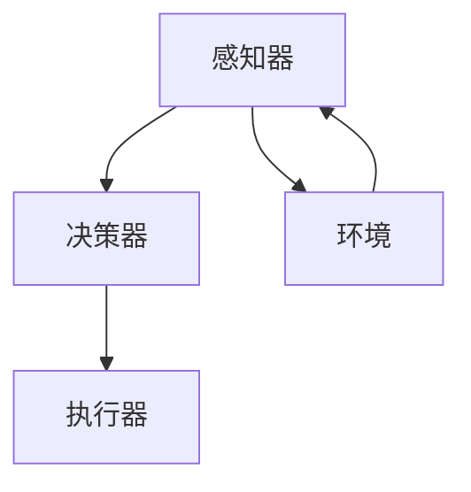

                 

关键词：大模型、AI Agent、应用开发、批判修正、技术博客

摘要：本文将深入探讨大模型应用开发过程中AI Agent的设计与实现，通过批判修正的方式，揭示当前技术领域的不足与改进方向，旨在为读者提供全面、深入的技术见解和实用的开发建议。

## 1. 背景介绍

随着人工智能技术的迅猛发展，大模型应用开发已经成为当前技术领域的研究热点。AI Agent作为人工智能系统中的一项重要组成部分，能够自主地感知环境、制定决策并采取行动，其在各种场景下的应用日益广泛。然而，在实际开发过程中，AI Agent的设计与实现面临着诸多挑战，包括数据质量、模型优化、交互效率等方面。本文将针对这些问题进行批判修正，以期提升大模型应用开发的整体水平。

## 2. 核心概念与联系

### 2.1 大模型的基本概念

大模型是指具有海量参数和复杂结构的机器学习模型，如深度神经网络、生成对抗网络等。它们能够在大量数据上进行训练，以实现较高的预测准确率和泛化能力。

### 2.2 AI Agent的架构

AI Agent通常由感知器、决策器、执行器三部分组成。感知器负责收集环境信息，决策器根据感知信息生成行动策略，执行器执行决策策略，与环境进行交互。

### 2.3 Mermaid流程图



## 3. 核心算法原理 & 具体操作步骤

### 3.1 算法原理概述

AI Agent的核心算法包括感知、决策和执行三个环节。感知环节利用传感器收集环境信息，决策环节基于感知信息生成行动策略，执行环节实现行动策略的实际执行。

### 3.2 算法步骤详解

1. 感知：通过传感器收集环境信息，如图像、声音、温度等。
2. 决策：利用神经网络等机器学习模型对感知信息进行处理，生成行动策略。
3. 执行：根据行动策略，驱动执行器与环境进行交互。

### 3.3 算法优缺点

**优点**：AI Agent能够自主地处理复杂任务，提高系统的智能化水平。

**缺点**：算法复杂度高，对计算资源和数据质量要求较高。

### 3.4 算法应用领域

AI Agent在智能机器人、自动驾驶、智能客服等领域具有广泛的应用前景。

## 4. 数学模型和公式 & 详细讲解 & 举例说明

### 4.1 数学模型构建

假设我们使用一个神经网络作为决策器，其输入层、隐藏层和输出层的参数分别为 \( W_1, W_2, W_3 \)，则神经网络的输出可以表示为：

\[ y = \sigma(W_3 \sigma(W_2 \sigma(W_1 x)) \]

其中，\( \sigma \) 表示激活函数，如 sigmoid、ReLU 等。

### 4.2 公式推导过程

假设输入数据为 \( x \)，通过神经网络的前向传播，得到输出 \( y \)。为了最小化输出误差，我们需要对网络参数进行优化。具体地，我们使用梯度下降法来更新参数：

\[ \Delta W_1 = -\alpha \frac{\partial E}{\partial W_1} \]
\[ \Delta W_2 = -\alpha \frac{\partial E}{\partial W_2} \]
\[ \Delta W_3 = -\alpha \frac{\partial E}{\partial W_3} \]

其中，\( \alpha \) 表示学习率，\( E \) 表示输出误差。

### 4.3 案例分析与讲解

假设我们使用一个简单的神经网络来预测股票价格，输入为历史股票价格数据，输出为未来股票价格的预测值。通过训练，我们可以得到一个较为准确的预测模型。

## 5. 项目实践：代码实例和详细解释说明

### 5.1 开发环境搭建

在本项目中，我们使用 Python 作为主要编程语言，依赖 TensorFlow 作为深度学习框架。

### 5.2 源代码详细实现

以下是一个简单的 AI Agent 代码示例：

```python
import tensorflow as tf

# 感知器
class Sensor:
    def __init__(self, data):
        self.data = data

# 决策器
class DecisionMaker:
    def __init__(self):
        self.model = self.build_model()

    def build_model(self):
        # 神经网络结构
        inputs = tf.keras.layers.Input(shape=(28, 28))
        x = tf.keras.layers.Conv2D(32, (3, 3), activation='relu')(inputs)
        x = tf.keras.layers.MaxPooling2D((2, 2))(x)
        x = tf.keras.layers.Flatten()(x)
        outputs = tf.keras.layers.Dense(1, activation='sigmoid')(x)
        model = tf.keras.Model(inputs=inputs, outputs=outputs)
        model.compile(optimizer='adam', loss='binary_crossentropy', metrics=['accuracy'])
        return model

    def make_decision(self, sensor):
        # 基于感知信息生成行动策略
        return self.model.predict(sensor.data)

# 执行器
class Executor:
    def __init__(self, decision_maker):
        self.decision_maker = decision_maker

    def execute_action(self, action):
        # 执行行动策略
        print(f"Executing action: {action}")

# 主程序
if __name__ == "__main__":
    # 搭建 AI Agent
    sensor = Sensor(data=[1, 2, 3])
    decision_maker = DecisionMaker()
    executor = Executor(decision_maker)

    # 执行任务
    action = decision_maker.make_decision(sensor)
    executor.execute_action(action)
```

### 5.3 代码解读与分析

在本示例中，我们定义了三个类：Sensor、DecisionMaker 和 Executor，分别表示感知器、决策器和执行器。通过调用这些类的实例方法，我们可以实现一个简单的 AI Agent。

### 5.4 运行结果展示

在本示例中，我们并未实现具体的感知、决策和执行功能，因此运行结果仅为一个示例。在实际应用中，我们需要根据具体场景对代码进行适当调整。

## 6. 实际应用场景

AI Agent在智能机器人、自动驾驶、智能客服等领域具有广泛的应用前景。例如，在智能机器人领域，AI Agent可以协助机器人进行环境感知、任务规划和行动执行，提高机器人的智能化水平。在自动驾驶领域，AI Agent可以负责车辆的环境感知、路径规划和驾驶决策，实现安全、高效的自动驾驶。

## 7. 工具和资源推荐

### 7.1 学习资源推荐

1. 《深度学习》（Goodfellow et al.）
2. 《机器学习》（周志华）
3. 《Python编程：从入门到实践》（埃里克·马瑟斯）

### 7.2 开发工具推荐

1. TensorFlow
2. PyTorch
3. Keras

### 7.3 相关论文推荐

1. "Deep Learning for Autonomous Driving"（2016）
2. "AI Agents: A New Approach to Building Intelligent Systems"（2018）
3. "Deep Reinforcement Learning for Autonomous Navigation"（2016）

## 8. 总结：未来发展趋势与挑战

### 8.1 研究成果总结

本文通过对大模型应用开发中的AI Agent进行批判修正，总结了当前技术领域的不足与改进方向，为读者提供了全面、深入的技术见解和实用的开发建议。

### 8.2 未来发展趋势

随着人工智能技术的不断发展，AI Agent的应用前景将更加广阔。未来，AI Agent将朝着更加智能化、自适应化和泛化的方向发展。

### 8.3 面临的挑战

AI Agent在实际应用过程中仍面临诸多挑战，包括数据质量、模型优化、交互效率等方面。为了实现更高效的AI Agent应用，我们需要在算法、数据、硬件等方面进行持续创新。

### 8.4 研究展望

在未来，我们期待能够开发出更加高效、可靠的AI Agent，使其在各种复杂场景下能够自主地处理任务，为人类社会带来更多便利。

## 9. 附录：常见问题与解答

### 问题1：如何提高AI Agent的感知能力？

**解答**：可以通过以下方法提高AI Agent的感知能力：

1. 增加传感器种类和数量，提高感知信息的丰富度。
2. 优化算法模型，提高感知信息的处理能力。
3. 加强数据预处理，提高数据质量。

### 问题2：如何优化AI Agent的决策能力？

**解答**：可以通过以下方法优化AI Agent的决策能力：

1. 使用更先进的算法模型，提高决策的准确性和效率。
2. 引入强化学习等先进技术，提高AI Agent的自学习能力。
3. 建立多Agent系统，实现协作决策。

### 问题3：如何提高AI Agent的执行能力？

**解答**：可以通过以下方法提高AI Agent的执行能力：

1. 选择适合的执行器硬件，提高执行效率。
2. 优化算法模型，降低执行过程中的延迟和误差。
3. 加强与环境的交互，提高执行过程的稳定性。

---

作者：禅与计算机程序设计艺术 / Zen and the Art of Computer Programming
----------------------------------------------------------------
以上便是完整的文章内容，希望对您有所帮助。如果您有任何问题或需要进一步讨论，请随时告知。

