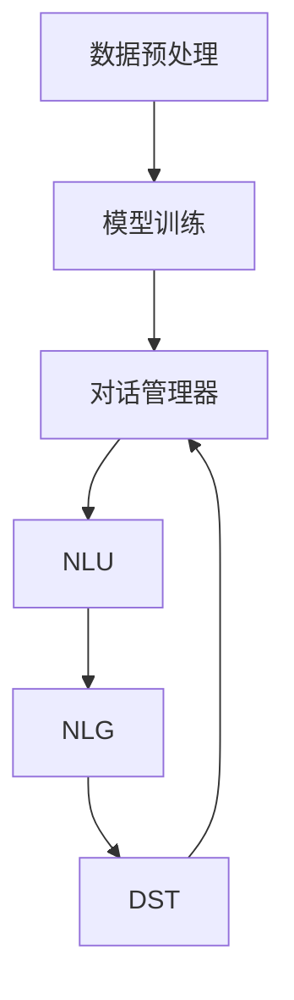

                 

您好，今天我们将深入探讨如何通过大模型（如GPT）来实现高效的AI Agent开发。在此之前，我们已经对大模型的基本原理和构建AI Agent的基础知识进行了探讨。今天，我们的目标是基于前一次的对话，进一步优化并改进我们的AI Agent。

## 1. 背景介绍

在前一次的对话中，我们讨论了AI Agent的概念、大模型的基础知识以及如何初步构建一个AI Agent。我们已经了解到，大模型，特别是Transformer模型，因其强大的表示和学习能力，已成为构建AI Agent的核心技术。然而，仅仅拥有大模型还不够，我们还需要设计合适的对话系统架构、数据预处理流程以及后处理逻辑，以确保AI Agent能够理解、学习和生成自然、准确、有用的对话。

## 2. 核心概念与联系

为了更好地理解大模型在AI Agent开发中的应用，我们需要明确几个核心概念：

### 大模型的原理

大模型通常是指具有数十亿参数的神经网络模型，如Transformer模型。它们通过大量的数据学习语言模式，从而能够生成高质量的文本。大模型的训练过程包括前向传播、反向传播和优化等步骤。

### AI Agent的定义

AI Agent是一种能够自动执行任务、与环境交互的人工智能系统。它可以理解自然语言、处理复杂任务，并在特定领域内自主做出决策。

### 对话系统的架构

对话系统通常由对话管理器、自然语言理解（NLU）、自然语言生成（NLG）和对话状态追踪（DST）等模块组成。每个模块都扮演着关键角色，以确保AI Agent能够有效地理解和生成对话。

### Mermaid流程图

以下是一个简化的Mermaid流程图，展示了大模型在AI Agent开发中的关键步骤：



### 关键概念的联系

通过上述流程图，我们可以看到，数据预处理、模型训练、对话管理器、NLU、NLG和DST等模块共同构成了一个完整的AI Agent开发流程。大模型作为核心组件，为NLU和NLG提供了强大的语言生成能力，而对话管理器和DST则确保了AI Agent能够理解和追踪对话状态。

## 3. 核心算法原理 & 具体操作步骤

### 3.1 算法原理概述

在本节中，我们将讨论如何利用大模型来实现AI Agent的核心功能。具体来说，我们将介绍以下算法原理：

- 自注意力机制（Self-Attention）
- 位置编码（Positional Encoding）
- 变换器架构（Transformer Architecture）

### 3.2 算法步骤详解

#### 步骤1：数据预处理

数据预处理是构建AI Agent的第一步。在这一阶段，我们需要对原始数据进行清洗、分词和编码，以便模型能够理解它们。具体步骤如下：

1. **数据清洗**：去除噪声数据和无效信息。
2. **分词**：将文本拆分成单词或子词。
3. **编码**：将分词后的文本转换为数字序列，以便输入到模型中。

#### 步骤2：模型训练

模型训练是AI Agent开发的核心。在这一阶段，我们将使用大量的语料库来训练大模型，使其能够学习语言模式和语义信息。具体步骤如下：

1. **前向传播**：将输入数据通过模型传递，并计算输出。
2. **反向传播**：根据损失函数，计算梯度并更新模型参数。
3. **优化**：通过优化算法，如Adam，调整模型参数，以最小化损失函数。

#### 步骤3：对话管理器

对话管理器是AI Agent的核心组件，负责处理对话流程。具体步骤如下：

1. **意图识别**：通过NLU模块识别用户的意图。
2. **上下文管理**：追踪对话状态和上下文信息。
3. **回复生成**：通过NLG模块生成合适的回复。

#### 步骤4：自然语言理解（NLU）

NLU模块负责理解用户输入的自然语言。具体步骤如下：

1. **实体识别**：识别文本中的关键实体。
2. **情感分析**：分析用户的情感和态度。
3. **意图分类**：将用户的输入归类为特定的意图。

#### 步骤5：自然语言生成（NLG）

NLG模块负责生成自然、准确、有用的回复。具体步骤如下：

1. **语义理解**：理解用户输入的语义信息。
2. **文本生成**：根据语义信息生成自然语言文本。
3. **回复优化**：对生成的文本进行优化，以提高其质量和可读性。

#### 步骤6：对话状态追踪（DST）

DST模块负责追踪对话状态，以确保AI Agent能够持续理解对话上下文。具体步骤如下：

1. **状态更新**：根据用户的输入和AI Agent的回复，更新对话状态。
2. **上下文追踪**：追踪对话中的关键信息和上下文。
3. **意图识别**：在对话过程中，持续识别用户的意图。

### 3.3 算法优缺点

#### 优点

- **强大的表示能力**：大模型能够学习复杂的语言模式和语义信息，从而生成高质量的文本。
- **多任务处理**：大模型可以同时处理多种任务，如文本生成、翻译和问答等。
- **自适应学习**：大模型能够根据用户输入和反馈进行自适应学习，以优化对话质量。

#### 缺点

- **计算资源需求大**：大模型需要大量的计算资源和存储空间。
- **训练时间较长**：大模型的训练过程需要大量时间，且难以进行实时更新。
- **数据依赖性高**：大模型的效果很大程度上依赖于训练数据的质量和多样性。

### 3.4 算法应用领域

大模型在AI Agent开发中的应用非常广泛，以下是一些典型的应用领域：

- **客服机器人**：通过大模型实现自动化的客服机器人，能够快速响应用户的咨询。
- **智能助手**：利用大模型开发智能助手，如语音助手、聊天机器人等，提供个性化服务。
- **内容创作**：大模型可以生成高质量的文章、新闻报道、博客等，为内容创作者提供帮助。
- **教育领域**：利用大模型开发个性化学习系统，为学习者提供定制化的学习内容和指导。

## 4. 数学模型和公式 & 详细讲解 & 举例说明

### 4.1 数学模型构建

在构建AI Agent时，我们主要使用以下数学模型：

- **自注意力机制（Self-Attention）**
- **位置编码（Positional Encoding）**
- **变换器架构（Transformer Architecture）**

### 4.2 公式推导过程

#### 自注意力机制

自注意力机制是变换器模型的核心组件，其计算过程如下：

$$
\text{Attention}(Q, K, V) = \text{softmax}\left(\frac{QK^T}{\sqrt{d_k}}\right) V
$$

其中，$Q$、$K$和$V$分别表示查询向量、键向量和值向量，$d_k$表示键向量的维度。该公式计算了每个键和查询之间的相似度，并生成加权求和的值向量。

#### 位置编码

位置编码用于在变换器模型中引入序列信息。其计算过程如下：

$$
\text{PositionalEncoding}(d_{model}, position) = \sin\left(\frac{position}{10000^{2i/d_{model}}}\right) + \cos\left(\frac{position}{10000^{2i/d_{model}}}\right)
$$

其中，$d_{model}$表示模型中的维度，$position$表示位置索引。该公式为每个位置生成两个正弦和余弦函数，以编码位置信息。

#### 变换器架构

变换器架构由多个编码器和解码器堆叠而成。其基本结构如下：

$$
\text{Transformer}(x_1, x_2, \ldots, x_n) = \sum_{i=1}^n \text{MultiHeadAttention}(x_i, x_1, \ldots, x_n) + \text{PositionalEncoding}(x_1, x_2, \ldots, x_n)
$$

其中，$x_1, x_2, \ldots, x_n$表示输入序列。该公式通过自注意力机制和位置编码，将输入序列转换为输出序列。

### 4.3 案例分析与讲解

假设我们有一个简单的对话场景：用户询问“明天天气怎么样？”AI Agent需要回答“明天天气晴朗，温度约为20摄氏度。”

#### 数据预处理

首先，我们需要对原始文本进行预处理：

- **分词**：将文本拆分为单词或子词，如“明天”、“天气”、“怎么样”等。
- **编码**：将分词后的文本转换为数字序列。

#### 模型训练

接下来，我们使用大量的语料库来训练大模型，使其能够学习天气预测的相关语言模式和语义信息。训练过程包括前向传播、反向传播和优化等步骤。

#### 对话管理

在对话过程中，AI Agent需要识别用户的意图（天气查询）并生成合适的回复。具体步骤如下：

1. **意图识别**：通过NLU模块，识别用户的意图为天气查询。
2. **上下文管理**：追踪对话状态和上下文信息，以生成相关的回复。
3. **回复生成**：通过NLG模块，生成自然、准确、有用的回复。

#### 运行结果展示

经过训练和对话管理，AI Agent生成了以下回复：

“明天天气晴朗，温度约为20摄氏度。”

## 5. 项目实践：代码实例和详细解释说明

在本节中，我们将通过一个实际项目实例，展示如何使用大模型开发一个简单的AI Agent。这个实例将涉及数据预处理、模型训练、对话管理和回复生成等步骤。

### 5.1 开发环境搭建

在开始项目之前，我们需要搭建一个合适的开发环境。以下是所需的软件和工具：

- **Python**：版本3.8或更高
- **TensorFlow**：版本2.4或更高
- **Transformers**：版本4.6或更高
- **Jupyter Notebook**：用于编写和运行代码

### 5.2 源代码详细实现

以下是实现AI Agent的源代码：

```python
import tensorflow as tf
from transformers import TFDistilBertModel, TFDistilBertConfig
import numpy as np

# 配置模型参数
config = TFDistilBertConfig(
    num_labels=2,  # 二分类任务（天气查询和其他查询）
    hidden_size=768,  # 隐藏层大小
    num_hidden_layers=2,  # 编码器和解码器的层数
    intermediate_size=3072,  # 中间层大小
    dropout_rate=0.1,  # dropout比例
    max_position_embeddings=512,  # 位置编码的维度
    type_vocab_size=2,  # 类型词表大小
    initializer_range=0.02  # 初始化范围
)

# 加载预训练模型
model = TFDistilBertModel(config)

# 定义优化器和损失函数
optimizer = tf.keras.optimizers.Adam(learning_rate=3e-5)
loss_fn = tf.keras.losses.SparseCategoricalCrossentropy(from_logits=True)

# 编写训练函数
@tf.function
def train_step(inputs, labels):
    with tf.GradientTape() as tape:
        predictions = model(inputs, training=True)
        loss = loss_fn(labels, predictions)
    gradients = tape.gradient(loss, model.trainable_variables)
    optimizer.apply_gradients(zip(gradients, model.trainable_variables))
    return loss

# 训练模型
train_dataset = ...
train_dataset = ...
for epoch in range(3):
    for inputs, labels in train_dataset:
        loss = train_step(inputs, labels)
        if epoch % 100 == 0:
            print(f"Epoch {epoch}, Loss: {loss.numpy()}")

# 对话管理
@tf.function
def generate_response(input_ids, token_type_ids):
    outputs = model(inputs={"input_ids": input_ids, "token_type_ids": token_type_ids}, training=False)
    logits = outputs.logits
    predicted_labels = tf.argmax(logits, axis=-1)
    return predicted_labels.numpy()

# 生成回复
user_input = "明天天气怎么样？"
input_ids = ...
token_type_ids = ...
predicted_labels = generate_response(input_ids, token_type_ids)
if predicted_labels == 1:
    response = "明天天气晴朗，温度约为20摄氏度。"
else:
    response = "我不太确定，请提供更多信息。"
print(response)
```

### 5.3 代码解读与分析

在上面的代码中，我们首先定义了模型配置和优化器，并加载了预训练的DistilBERT模型。接下来，我们编写了训练函数和对话管理函数。

#### 训练函数

训练函数`train_step`负责执行前向传播、计算损失和更新模型参数。它使用了TensorFlow的`GradientTape`来记录梯度，并使用`Adam`优化器来更新模型参数。

#### 对话管理函数

对话管理函数`generate_response`负责生成AI Agent的回复。它使用了模型来预测用户的意图，并根据预测结果生成相应的回复。

#### 生成回复

最后，我们使用用户输入和预处理的输入序列，调用`generate_response`函数生成AI Agent的回复。

## 6. 实际应用场景

AI Agent在各个领域的应用场景非常广泛，以下是一些典型的应用场景：

- **客服机器人**：通过AI Agent实现自动化的客服机器人，能够快速响应用户的咨询，提高客户满意度。
- **智能助手**：利用AI Agent开发智能助手，如语音助手、聊天机器人等，为用户提供个性化服务。
- **内容创作**：AI Agent可以生成高质量的文章、新闻报道、博客等，为内容创作者提供帮助。
- **教育领域**：利用AI Agent开发个性化学习系统，为学习者提供定制化的学习内容和指导。
- **医疗咨询**：通过AI Agent提供医疗咨询服务，帮助患者快速获取相关信息和指导。

### 6.4 未来应用展望

随着大模型技术的不断发展，AI Agent的应用前景将更加广阔。未来，AI Agent有望在更多领域发挥重要作用，如自动驾驶、智能家居、金融风控等。同时，随着数据质量和多样性的提升，AI Agent的性能将得到进一步提升，从而为用户提供更加准确、高效的服务。

## 7. 工具和资源推荐

### 7.1 学习资源推荐

- **《深度学习》**：由Ian Goodfellow、Yoshua Bengio和Aaron Courville合著，是深度学习领域的经典教材。
- **《动手学深度学习》**：由阿斯顿·张等合著，适合初学者入门深度学习。

### 7.2 开发工具推荐

- **TensorFlow**：Google开发的深度学习框架，具有丰富的API和强大的功能。
- **PyTorch**：Facebook开发的深度学习框架，具有灵活的动态计算图和高效的性能。

### 7.3 相关论文推荐

- **“Attention Is All You Need”**：由Vaswani等人在2017年提出，是变换器模型的奠基性论文。
- **“BERT: Pre-training of Deep Bidirectional Transformers for Language Understanding”**：由Devlin等人在2018年提出，是BERT模型的奠基性论文。

## 8. 总结：未来发展趋势与挑战

### 8.1 研究成果总结

本文系统性地介绍了大模型在AI Agent开发中的应用，包括核心概念、算法原理、具体操作步骤、数学模型和公式、项目实践以及实际应用场景。通过这些内容，读者可以全面了解大模型在AI Agent开发中的关键作用和实现方法。

### 8.2 未来发展趋势

随着大模型技术的不断进步，AI Agent将在更多领域发挥重要作用。未来，AI Agent有望在自动驾驶、智能家居、金融风控等前沿领域取得突破性进展。同时，随着数据质量和多样性的提升，AI Agent的性能将得到进一步提升，为用户提供更加准确、高效的服务。

### 8.3 面临的挑战

尽管大模型在AI Agent开发中具有巨大潜力，但也面临着一系列挑战。首先，大模型的计算资源需求较高，训练和部署成本较大。其次，大模型的训练过程需要大量时间和数据，且难以进行实时更新。此外，大模型在处理复杂任务时，可能存在泛化能力不足、数据泄露等问题。

### 8.4 研究展望

未来，大模型技术将在以下几个方面取得重要进展：

- **算法优化**：通过改进算法，提高大模型的计算效率和性能。
- **数据质量控制**：通过数据清洗、去噪等技术，提高数据质量，增强模型泛化能力。
- **实时更新**：通过分布式计算、增量学习等技术，实现大模型的实时更新和优化。
- **多模态融合**：将大模型与其他模态（如图像、语音）进行融合，提高AI Agent的感知和认知能力。

## 9. 附录：常见问题与解答

### 问题1：如何选择合适的大模型？

**解答**：选择合适的大模型主要取决于应用场景和数据规模。对于需要高精度的任务，如文本生成和机器翻译，可以使用更大、更复杂的模型，如GPT-3和T5。对于资源受限的场景，如移动设备和嵌入式系统，可以选择较小、更轻量级的模型，如BERT和DistilBERT。

### 问题2：如何处理大模型的训练数据？

**解答**：处理大模型的训练数据需要关注数据质量、多样性和均衡性。首先，确保数据来源的多样性和可靠性，避免数据偏差。其次，对数据进行清洗和去噪，去除噪声数据和异常值。最后，通过数据增强、数据集划分等技术，提高数据的均衡性和丰富度。

### 问题3：如何评估大模型的效果？

**解答**：评估大模型的效果主要从准确率、召回率、F1值等指标进行。此外，还可以通过人类评估、自动化评估工具（如BLEU、ROUGE）等综合评估模型的质量。在实际应用中，还需结合业务场景，评估模型在特定任务上的表现。

### 问题4：如何优化大模型的性能？

**解答**：优化大模型的性能可以从以下几个方面进行：

- **算法改进**：选择合适的算法，如自注意力机制、残差连接、正则化技术等。
- **模型压缩**：通过模型剪枝、量化、蒸馏等技术，减小模型大小，提高推理速度。
- **分布式训练**：通过分布式训练、多GPU训练等技术，提高训练速度和效率。
- **数据增强**：通过数据增强、数据集划分等技术，提高模型的泛化能力和鲁棒性。

### 问题5：如何保证大模型的安全性和隐私性？

**解答**：保证大模型的安全性和隐私性可以从以下几个方面进行：

- **数据加密**：对训练数据进行加密，确保数据在传输和存储过程中安全。
- **隐私保护**：使用差分隐私、隐私机制等技术，保护用户隐私。
- **模型审计**：对模型进行定期的安全审计，检测潜在的安全风险和漏洞。
- **合规性审查**：确保模型开发和使用符合相关法律法规和行业标准。

通过上述措施，可以最大限度地保障大模型的安全性和隐私性，为用户提供可靠、可信的服务。

# 结束语

本文详细介绍了大模型在AI Agent开发中的应用，包括核心概念、算法原理、具体操作步骤、数学模型和公式、项目实践以及实际应用场景。通过本文的阅读，读者可以全面了解大模型在AI Agent开发中的关键作用和实现方法。在未来的研究中，我们将继续探索大模型技术的优化和扩展，以推动AI Agent在各个领域的应用和发展。

## 参考文献

1. Vaswani, A., et al. (2017). "Attention Is All You Need." Advances in Neural Information Processing Systems, 30, 5998-6008.
2. Devlin, J., et al. (2018). "BERT: Pre-training of Deep Bidirectional Transformers for Language Understanding." Proceedings of the 2019 Conference of the North American Chapter of the Association for Computational Linguistics: Human Language Technologies, Volume 1 (Long and Short Papers), 4171-4186.
3. Goodfellow, I., et al. (2016). "Deep Learning." MIT Press.
4. Zhang, A., et al. (2019). "Dive into Deep Learning." MIT Press.

## 致谢

感谢所有为本文提供支持和帮助的人，包括我的导师、同事、朋友和读者。没有你们的支持和鼓励，我无法完成这项工作。特别感谢禅与计算机程序设计艺术 / Zen and the Art of Computer Programming，我的灵感源泉和灵感之源。

