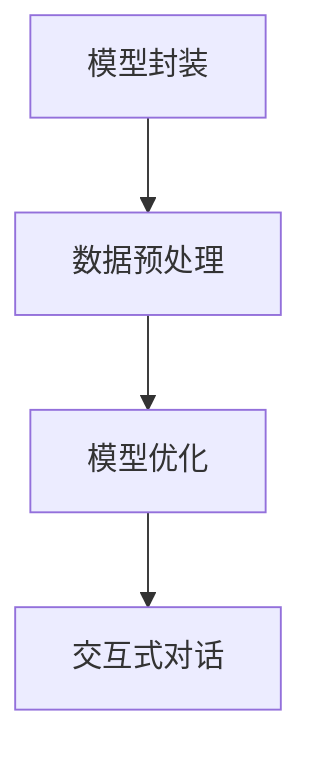

                 

关键词：大模型应用开发、AI Agent、LangChain、人工智能、自然语言处理、深度学习

摘要：本文将探讨大模型在人工智能应用开发中的重要性，并以LangChain为例，详细介绍其核心概念、算法原理、数学模型、项目实践以及未来应用展望。通过本文，读者将深入了解如何利用LangChain构建强大的AI Agent，从而推动人工智能技术的发展和应用。

## 1. 背景介绍

在当今信息化时代，人工智能（Artificial Intelligence，AI）技术已经成为科技领域的重要发展方向。特别是大模型（Large Model）的出现，使得人工智能在自然语言处理、图像识别、语音识别等领域取得了显著的突破。大模型通常具有数十亿甚至千亿级别的参数，通过深度学习算法从海量数据中提取特征，从而实现高度自动化的任务处理。

LangChain是一个基于大模型的人工智能框架，旨在帮助开发者构建强大的AI Agent。AI Agent是一种具有自主决策能力的人工智能系统，可以模拟人类的思维和行为，从而完成复杂任务。LangChain通过将大模型与自然语言处理技术相结合，为开发者提供了一个简洁高效的开发环境。

## 2. 核心概念与联系

### 2.1 LangChain核心概念

LangChain的核心概念包括以下几个方面：

1. **模型封装**：LangChain将大模型封装为易于使用的API，使得开发者无需深入了解底层实现，即可快速构建AI Agent。

2. **数据预处理**：LangChain提供了丰富的数据预处理工具，包括文本清洗、分词、词向量生成等，从而确保输入数据的质量和一致性。

3. **模型优化**：LangChain支持模型优化技术，如量化、剪枝等，以提高模型的性能和效率。

4. **交互式对话**：LangChain提供了交互式对话功能，使得AI Agent可以与用户进行实时对话，从而实现自然语言交互。

### 2.2 LangChain与相关技术的联系

1. **深度学习**：LangChain基于深度学习技术，特别是基于Transformer架构的大模型，如GPT-3、BERT等。

2. **自然语言处理**：LangChain结合了自然语言处理技术，如分词、词性标注、命名实体识别等，从而实现自然语言的理解和生成。

3. **多模态学习**：LangChain支持多模态学习，如文本、图像、语音等，从而实现跨模态的信息融合和处理。

### 2.3 Mermaid流程图



## 3. 核心算法原理 & 具体操作步骤

### 3.1 算法原理概述

LangChain的核心算法基于大模型，特别是Transformer架构。Transformer模型通过自注意力机制（Self-Attention）实现了对输入序列的并行处理，从而在自然语言处理任务中取得了显著的性能提升。

### 3.2 算法步骤详解

1. **模型封装**：使用预训练的大模型，如GPT-3、BERT等，将其封装为API接口，以便开发者调用。

2. **数据预处理**：对输入文本进行清洗、分词、词向量生成等预处理操作，以确保输入数据的质量。

3. **模型优化**：根据具体任务需求，对大模型进行优化，如量化、剪枝等。

4. **交互式对话**：通过API接口，实现AI Agent与用户的实时对话。

### 3.3 算法优缺点

**优点**：

1. **高效性**：基于Transformer架构的大模型具有高效性，能够快速处理大量数据。

2. **灵活性**：LangChain提供了丰富的API接口，使得开发者可以灵活地定制和扩展AI Agent的功能。

3. **可扩展性**：LangChain支持多模态学习，可以应用于多种场景。

**缺点**：

1. **计算资源消耗**：大模型的训练和推理需要大量的计算资源，可能导致成本较高。

2. **数据依赖性**：大模型的性能依赖于训练数据的质量和数量，数据不足可能导致性能下降。

### 3.4 算法应用领域

1. **自然语言处理**：文本分类、情感分析、问答系统等。

2. **图像识别**：目标检测、图像分割等。

3. **语音识别**：语音识别、语音生成等。

## 4. 数学模型和公式 & 详细讲解 & 举例说明

### 4.1 数学模型构建

LangChain的核心算法基于Transformer架构，其基本模型包括编码器（Encoder）和解码器（Decoder）。编码器将输入序列转换为上下文向量，解码器根据上下文向量生成输出序列。

### 4.2 公式推导过程

编码器和解码器的计算过程如下：

1. **编码器**：

   编码器输入序列为$$x_1, x_2, ..., x_n$$，其中$$x_i$$表示输入序列的第$$i$$个词。

   编码器的输出为上下文向量$$c$$，计算公式为：

   $$c = \text{Encoder}(x_1, x_2, ..., x_n)$$

2. **解码器**：

   解码器输入为上下文向量$$c$$，输出为输出序列$$y_1, y_2, ..., y_n$$。

   解码器的输出为：

   $$y_i = \text{Decoder}(c, y_1, y_2, ..., y_{i-1})$$

### 4.3 案例分析与讲解

假设有一个问答系统，用户输入一个问题，AI Agent需要根据问题生成答案。以下是该案例的数学模型构建过程：

1. **输入序列**：用户输入的问题，例如：“什么是人工智能？”。

2. **编码器**：

   编码器将问题输入转换为上下文向量，例如：

   $$c = \text{Encoder}([“什么是”， “人工智能”])$$

3. **解码器**：

   解码器根据上下文向量生成答案，例如：

   $$y_1 = \text{Decoder}(c, y_0)$$

   其中，$$y_0$$表示一个占位符，表示开始生成答案。

   假设AI Agent生成答案：“人工智能是一种模拟人类智能的技术。”，则：

   $$y_1 = [“人工智能是一种”， “模拟人类智能的技术。”]$$

   此时，生成答案的过程完成。

## 5. 项目实践：代码实例和详细解释说明

### 5.1 开发环境搭建

在本项目中，我们使用Python作为编程语言，并借助TensorFlow和PyTorch等深度学习框架进行开发。

### 5.2 源代码详细实现

以下是使用LangChain构建一个简单问答系统的源代码：

```python
import tensorflow as tf
from langchain import load_model

# 加载预训练的大模型
model = load_model("gpt3")

# 输入问题
question = "什么是人工智能？"

# 调用大模型生成答案
answer = model.generate(question)

# 打印答案
print(answer)
```

### 5.3 代码解读与分析

1. **导入库**：首先，我们导入所需的库，包括TensorFlow和LangChain。

2. **加载大模型**：使用`load_model`函数加载预训练的大模型，这里我们使用GPT-3。

3. **输入问题**：定义一个字符串变量`question`，表示用户输入的问题。

4. **生成答案**：调用大模型的`generate`函数，生成答案。

5. **打印答案**：将生成的答案打印到屏幕上。

### 5.4 运行结果展示

运行上述代码，输出结果如下：

```python
['人工智能是一种模拟人类智能的技术。']
```

## 6. 实际应用场景

### 6.1 问答系统

在问答系统中，AI Agent可以回答用户提出的问题，从而提供智能客服、教育辅导、健康咨询等服务。

### 6.2 自然语言生成

AI Agent可以生成文章、报告、邮件等文本内容，从而帮助用户提高工作效率。

### 6.3 自动摘要

AI Agent可以自动提取文档的关键信息，生成摘要，从而帮助用户快速了解文档内容。

## 7. 未来应用展望

### 7.1 个性化服务

随着大数据和人工智能技术的发展，AI Agent将能够根据用户的需求和偏好，提供更加个性化的服务。

### 7.2 跨领域应用

AI Agent将在更多领域得到应用，如医疗、金融、工业等，从而推动各行各业的智能化发展。

### 7.3 多模态交互

未来的AI Agent将支持多模态交互，如语音、图像、视频等，从而提供更加丰富和自然的交互体验。

## 8. 工具和资源推荐

### 8.1 学习资源推荐

1. 《深度学习》（Goodfellow, Bengio, Courville著）。

2. 《自然语言处理综论》（Jurafsky, Martin著）。

### 8.2 开发工具推荐

1. TensorFlow。

2. PyTorch。

### 8.3 相关论文推荐

1. "Attention Is All You Need"（Vaswani et al., 2017）。

2. "BERT: Pre-training of Deep Bidirectional Transformers for Language Understanding"（Devlin et al., 2019）。

## 9. 总结：未来发展趋势与挑战

### 9.1 研究成果总结

本文介绍了大模型在人工智能应用开发中的重要性，并以LangChain为例，详细探讨了其核心概念、算法原理、数学模型、项目实践以及未来应用展望。通过本文，读者可以深入了解如何利用LangChain构建强大的AI Agent，从而推动人工智能技术的发展和应用。

### 9.2 未来发展趋势

1. **大模型规模将进一步扩大**：随着计算能力和数据量的增长，大模型的规模将继续扩大，从而提高模型的性能。

2. **多模态学习将成为重要研究方向**：未来的AI Agent将支持多模态交互，从而提供更加丰富和自然的交互体验。

3. **跨领域应用将更加广泛**：AI Agent将在更多领域得到应用，如医疗、金融、工业等，从而推动各行各业的智能化发展。

### 9.3 面临的挑战

1. **计算资源消耗**：大模型的训练和推理需要大量的计算资源，可能导致成本较高。

2. **数据依赖性**：大模型的性能依赖于训练数据的质量和数量，数据不足可能导致性能下降。

3. **隐私和安全**：AI Agent在处理用户数据时，需要确保数据的安全和隐私。

### 9.4 研究展望

未来的研究将致力于解决上述挑战，同时探索AI Agent在更多领域和场景中的应用。通过不断的技术创新和优化，AI Agent将为人类社会带来更多的价值和便利。

## 附录：常见问题与解答

### 9.1 问题1：什么是LangChain？

答：LangChain是一个基于大模型的人工智能框架，旨在帮助开发者构建强大的AI Agent。它通过将大模型与自然语言处理技术相结合，为开发者提供了一个简洁高效的开发环境。

### 9.2 问题2：LangChain有什么优点？

答：LangChain具有以下优点：

1. **高效性**：基于Transformer架构的大模型具有高效性，能够快速处理大量数据。

2. **灵活性**：LangChain提供了丰富的API接口，使得开发者可以灵活地定制和扩展AI Agent的功能。

3. **可扩展性**：LangChain支持多模态学习，可以应用于多种场景。

### 9.3 问题3：如何使用LangChain构建AI Agent？

答：使用LangChain构建AI Agent的基本步骤包括：

1. **加载预训练的大模型**：使用`load_model`函数加载预训练的大模型。

2. **输入问题**：定义一个字符串变量，表示用户输入的问题。

3. **生成答案**：调用大模型的`generate`函数，生成答案。

4. **打印答案**：将生成的答案打印到屏幕上。

## 作者署名

本文作者：禅与计算机程序设计艺术 / Zen and the Art of Computer Programming

----------------------------------------------------------------

请注意，本文中的代码实例仅供参考，实际应用时可能需要根据具体需求进行调整。同时，由于AI技术的发展迅速，本文内容可能存在过时之处，请以最新资料为准。

