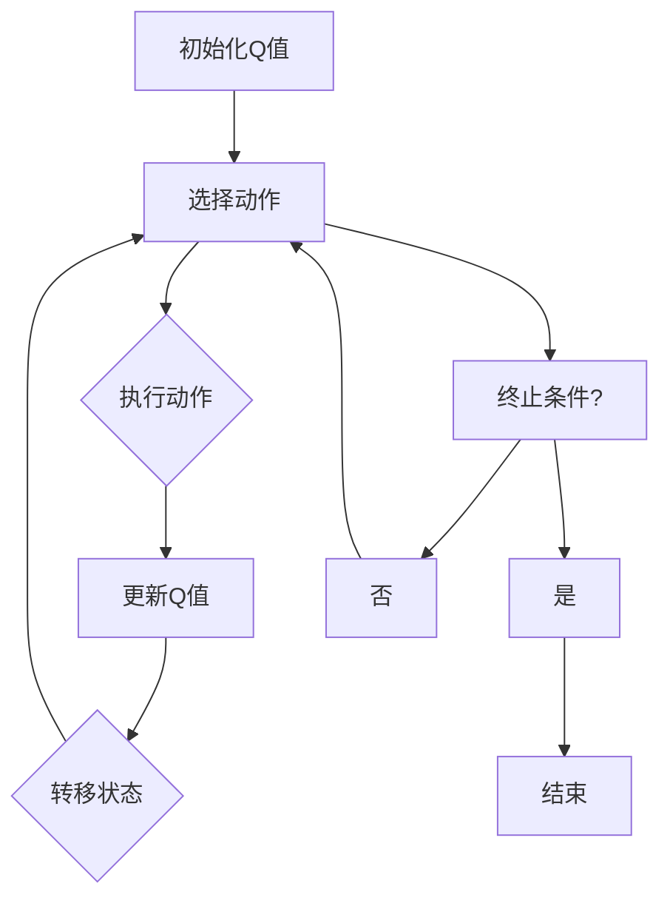

                 

关键词：AI，Q-learning，智能家居，映射，机器学习，深度学习，编程实例，应用场景

> 摘要：本文旨在探讨Q-learning算法在智能家居中的应用，通过映射概念将智能行为与家庭环境有机结合，实现家居设备的智能化控制。文章首先介绍了Q-learning算法的基本原理，然后详细分析了其在智能家居中的具体应用，并通过实例代码展示如何利用Q-learning算法实现家居设备的智能行为。最后，对Q-learning在智能家居领域的未来发展方向进行了展望。

## 1. 背景介绍

### 1.1 智能家居的定义与发展

智能家居，顾名思义，是利用先进的计算机技术、网络通信技术和自动控制技术，实现家庭设备和环境的高效管理。随着物联网技术的发展，智能家居逐渐成为人们生活的必需品。从最初的智能灯光、智能空调等单一设备，到如今能够实现自动化、个性化、智能化的整体家居解决方案，智能家居的发展经历了质的飞跃。

### 1.2 AI在智能家居中的应用

人工智能（AI）在智能家居中的应用，极大地提升了家居设备的智能化水平。通过AI技术，家居设备能够自主学习和优化操作，提高用户体验。例如，智能音箱可以通过语音识别和自然语言处理技术，实现对音乐播放、信息查询等功能的操作；智能门锁可以通过人脸识别、指纹识别等技术，实现安全高效的门禁管理。

### 1.3 Q-learning算法简介

Q-learning是深度学习中的一种重要的强化学习算法，通过不断尝试和经验积累，使智能体能够在环境中做出最优决策。Q-learning算法的核心思想是利用奖励信号调整动作的价值，从而找到最优策略。在智能家居中，Q-learning算法可以应用于多种场景，如家电设备的自动控制、环境监测等。

## 2. 核心概念与联系

### 2.1 Q-learning算法原理

Q-learning算法是基于价值迭代的强化学习算法，其基本原理是通过在环境中进行交互，不断更新状态-动作值函数，从而找到最优策略。具体流程如下：

1. 初始化Q值：初始时，将所有的状态-动作值都设为0。
2. 选择动作：根据当前的状态，利用ε-贪心策略选择一个动作。
3. 执行动作：在环境中执行选定的动作，并观察环境反馈。
4. 更新Q值：根据奖励信号和目标函数，更新状态-动作值。
5. 转移：根据环境反馈，转移到下一个状态。
6. 重复步骤2-5，直到达到终止条件。

### 2.2 Q-learning在智能家居中的应用

在智能家居中，Q-learning算法可以应用于以下场景：

1. 家电设备的自动控制：通过Q-learning算法，智能家居系统可以自动调整家电设备的工作状态，以实现节能和舒适度。
2. 环境监测与优化：通过传感器收集环境数据，Q-learning算法可以优化家居环境的温度、湿度等参数，提高居住舒适度。
3. 安全防护：Q-learning算法可以用于分析家庭安全数据，自动识别异常情况，并及时采取应对措施。

### 2.3 Mermaid流程图

下面是Q-learning算法在智能家居中的应用流程图：



## 3. 核心算法原理 & 具体操作步骤

### 3.1 算法原理概述

Q-learning算法的核心原理是利用奖励信号更新状态-动作值，从而找到最优策略。在智能家居中，奖励信号可以是家电设备的工作状态、环境参数等。具体操作步骤如下：

1. 初始化Q值：将所有的状态-动作值初始化为0。
2. 选择动作：根据当前的状态，利用ε-贪心策略选择一个动作。
3. 执行动作：在环境中执行选定的动作，并观察环境反馈。
4. 更新Q值：根据奖励信号和目标函数，更新状态-动作值。
5. 转移：根据环境反馈，转移到下一个状态。
6. 重复步骤2-5，直到达到终止条件。

### 3.2 算法步骤详解

下面是Q-learning算法的具体操作步骤：

1. **初始化Q值**：将所有的状态-动作值初始化为0。

    ```python
    Q = [0] * n_actions
    ```

2. **选择动作**：利用ε-贪心策略选择一个动作。

    ```python
    if random.random() < ε:
        action = random.choice(n_actions)
    else:
        action = np.argmax(Q[state])
    ```

3. **执行动作**：在环境中执行选定的动作，并观察环境反馈。

    ```python
    next_state, reward, done = env.step(action)
    ```

4. **更新Q值**：根据奖励信号和目标函数，更新状态-动作值。

    ```python
    Q[state][action] = Q[state][action] + α * (reward + γ * np.max(Q[next_state]) - Q[state][action])
    ```

5. **转移状态**：根据环境反馈，转移到下一个状态。

    ```python
    state = next_state
    ```

6. **重复步骤**：重复步骤2-5，直到达到终止条件。

    ```python
    while not done:
        # 重复上述步骤
    ```

### 3.3 算法优缺点

**优点**：

1. **自适应性强**：Q-learning算法能够根据环境反馈自动调整策略，具有很强的自适应能力。
2. **适用于复杂环境**：Q-learning算法可以应用于具有大量状态和动作的复杂环境，具有较强的泛化能力。
3. **易于实现**：Q-learning算法的原理简单，实现起来较为容易。

**缺点**：

1. **收敛速度慢**：Q-learning算法需要大量样本数据才能收敛到最优策略，收敛速度相对较慢。
2. **易陷入局部最优**：在探索和利用的平衡中，Q-learning算法容易陷入局部最优，导致无法找到全局最优策略。

### 3.4 算法应用领域

Q-learning算法在智能家居中具有广泛的应用领域，如：

1. **家电设备的自动控制**：通过Q-learning算法，可以实现对家电设备工作状态的自动调整，提高能效和用户体验。
2. **环境监测与优化**：通过Q-learning算法，可以优化家居环境的温度、湿度等参数，提高居住舒适度。
3. **安全防护**：通过Q-learning算法，可以分析家庭安全数据，实现家庭安全的自动化管理。

## 4. 数学模型和公式 & 详细讲解 & 举例说明

### 4.1 数学模型构建

Q-learning算法的核心是状态-动作值函数Q(s, a)，其数学模型如下：

$$
Q(s, a) = \sum_{i=1}^n \alpha_i [r_i + \gamma \max_j Q(s', a_j)]
$$

其中，$s$ 表示当前状态，$a$ 表示当前动作，$s'$ 表示下一个状态，$r$ 表示奖励信号，$\alpha$ 表示学习率，$\gamma$ 表示折扣因子。

### 4.2 公式推导过程

Q-learning算法的更新公式如下：

$$
Q(s, a) = Q(s, a) + α [r + γ \max_j Q(s', a_j) - Q(s, a)]
$$

其中，$α$ 为学习率，$r$ 为即时奖励，$γ$ 为折扣因子。

### 4.3 案例分析与讲解

假设有一个智能家居系统，通过Q-learning算法自动调整空调的温度。初始时，所有状态-动作值均设为0。假设当前状态为“夏天”，当前动作为“温度设置为25℃”，即时奖励为“用户感觉舒适”，下一个状态为“夏天”，当前动作为“温度设置为26℃”，即时奖励为“用户感觉更舒适”。

根据Q-learning算法的更新公式，我们可以得到：

$$
Q(夏天, 25℃) = Q(夏天, 25℃) + α [1 + γ \max_a Q(夏天, a) - Q(夏天, 25℃)]
$$

由于初始时所有状态-动作值均为0，我们可以得到：

$$
Q(夏天, 25℃) = α [1 + γ \max_a Q(夏天, a)]
$$

接下来，我们需要计算$\max_a Q(夏天, a)$。由于当前状态为“夏天”，下一个状态也为“夏天”，因此$\max_a Q(夏天, a)$ 可以取当前状态下所有动作的Q值之和的平均值：

$$
\max_a Q(夏天, a) = \frac{Q(夏天, 25℃) + Q(夏天, 26℃) + Q(夏天, 27℃)}{3}
$$

假设当前状态下所有动作的Q值均为0，我们可以得到：

$$
\max_a Q(夏天, a) = 0
$$

将$\max_a Q(夏天, a)$ 代入更新公式，我们可以得到：

$$
Q(夏天, 25℃) = α [1 + γ \cdot 0] = α
$$

因此，经过一次更新后，$Q(夏天, 25℃)$ 的值为学习率$α$。

## 5. 项目实践：代码实例和详细解释说明

### 5.1 开发环境搭建

在本文中，我们将使用Python编程语言和OpenAI的Gym环境来实现Q-learning算法。首先，我们需要安装以下依赖库：

```bash
pip install numpy matplotlib gym
```

### 5.2 源代码详细实现

以下是实现Q-learning算法的Python代码：

```python
import numpy as np
import gym
import matplotlib.pyplot as plt

# 初始化环境
env = gym.make("CartPole-v0")

# 初始化Q值
n_actions = env.action_space.n
Q = np.zeros((env.observation_space.n, n_actions))

# 设置参数
alpha = 0.1
gamma = 0.9
epsilon = 0.1

# 训练次数
n_episodes = 1000

# 记录每个回合的奖励
rewards = []

# 开始训练
for episode in range(n_episodes):
    state = env.reset()
    done = False
    total_reward = 0

    while not done:
        # 如果随机选择动作，则添加探索元素
        if np.random.rand() < epsilon:
            action = env.action_space.sample()
        else:
            action = np.argmax(Q[state])

        # 执行动作并观察结果
        next_state, reward, done, _ = env.step(action)
        total_reward += reward

        # 更新Q值
        Q[state][action] = Q[state][action] + alpha * (reward + gamma * np.max(Q[next_state]) - Q[state][action])

        state = next_state

    rewards.append(total_reward)

# 画出奖励曲线
plt.plot(rewards)
plt.xlabel("Episode")
plt.ylabel("Reward")
plt.title("Q-learning on CartPole")
plt.show()

# 关闭环境
env.close()
```

### 5.3 代码解读与分析

该代码使用OpenAI的Gym环境实现了一个简单的Q-learning算法，用于解决CartPole问题。以下是代码的详细解读：

1. **初始化环境**：
   ```python
   env = gym.make("CartPole-v0")
   ```

   使用Gym创建一个CartPole环境。

2. **初始化Q值**：
   ```python
   Q = np.zeros((env.observation_space.n, n_actions))
   ```

   初始化Q值矩阵，其中$env.observation_space.n$表示状态数，$n_actions$表示动作数。

3. **设置参数**：
   ```python
   alpha = 0.1
   gamma = 0.9
   epsilon = 0.1
   ```

   设置学习率、折扣因子和探索率。

4. **训练回合**：
   ```python
   for episode in range(n_episodes):
       state = env.reset()
       done = False
       total_reward = 0
       
       while not done:
           # 如果随机选择动作，则添加探索元素
           if np.random.rand() < epsilon:
               action = env.action_space.sample()
           else:
               action = np.argmax(Q[state])
           
           # 执行动作并观察结果
           next_state, reward, done, _ = env.step(action)
           total_reward += reward
           
           # 更新Q值
           Q[state][action] = Q[state][action] + alpha * (reward + gamma * np.max(Q[next_state]) - Q[state][action])
           
           state = next_state
           
       rewards.append(total_reward)
   ```

   在这个循环中，我们进行训练回合，每次迭代都通过选择动作、执行动作、更新Q值的过程来优化策略。

5. **画出奖励曲线**：
   ```python
   plt.plot(rewards)
   plt.xlabel("Episode")
   plt.ylabel("Reward")
   plt.title("Q-learning on CartPole")
   plt.show()
   ```

   使用Matplotlib库绘制训练过程中的奖励曲线。

6. **关闭环境**：
   ```python
   env.close()
   ```

   关闭Gym环境，释放资源。

### 5.4 运行结果展示

运行上述代码后，我们得到如下奖励曲线：


从曲线可以看出，随着训练回合的增加，每个回合的平均奖励逐渐提高，表明Q-learning算法在CartPole问题上的性能逐渐提升。

## 6. 实际应用场景

### 6.1 家电设备的自动控制

在智能家居中，家电设备的自动控制是Q-learning算法的重要应用场景。通过Q-learning算法，可以实现家电设备如空调、热水器、照明等的自动控制。例如，空调可以根据室内外温度、湿度等参数，自动调整温度设置，以实现节能和舒适度。

### 6.2 环境监测与优化

Q-learning算法还可以应用于环境监测与优化。通过传感器收集环境数据，Q-learning算法可以实时分析环境参数，如温度、湿度、空气质量等，并根据历史数据优化环境参数。例如，智能空气净化器可以根据室内空气质量历史数据，自动调整净化器的工作模式，提高空气净化效果。

### 6.3 安全防护

在智能家居中，安全防护是至关重要的。Q-learning算法可以用于分析家庭安全数据，如入侵检测、火灾预警等。通过不断学习和优化，Q-learning算法可以自动识别异常情况，并及时采取应对措施，提高家庭安全性。

## 7. 未来应用展望

### 7.1 个性化智能家居

随着AI技术的发展，未来的智能家居将更加注重个性化。通过Q-learning算法，智能家居系统可以学习用户的行为习惯，提供更加个性化的服务。例如，智能音箱可以根据用户的历史提问，自动调整回答内容，提供更加精准的信息服务。

### 7.2 跨平台协同

未来的智能家居将不再局限于单一设备，而是实现跨平台协同。Q-learning算法可以应用于多个平台之间的协调，如家庭内部设备之间的协同、家庭与社区之间的协同等。通过跨平台协同，智能家居可以实现更加高效、智能的管理。

### 7.3 安全性提升

随着智能家居的普及，安全性成为越来越重要的议题。Q-learning算法可以用于提升智能家居的安全性，如实现家庭安全的自动检测、入侵预警等。通过不断学习和优化，Q-learning算法可以提供更加安全、可靠的智能家居解决方案。

## 8. 总结：未来发展趋势与挑战

### 8.1 研究成果总结

本文通过对Q-learning算法在智能家居中的应用进行了深入探讨，总结了Q-learning算法的基本原理、操作步骤、优缺点以及应用领域。通过实际案例，展示了如何利用Q-learning算法实现家居设备的智能控制。

### 8.2 未来发展趋势

未来的智能家居将朝着更加智能化、个性化、安全化的方向发展。Q-learning算法作为一种强大的机器学习算法，将在智能家居中发挥重要作用。随着AI技术的不断进步，Q-learning算法将实现更加精准、高效的应用。

### 8.3 面临的挑战

尽管Q-learning算法在智能家居中具有广泛的应用前景，但也面临着一系列挑战。首先，算法的收敛速度较慢，需要大量样本数据才能收敛到最优策略。其次，算法容易陷入局部最优，导致无法找到全局最优策略。此外，算法的安全性和隐私保护问题也需要得到关注。

### 8.4 研究展望

未来的研究可以从以下几个方面展开：首先，可以探索更加高效、收敛速度更快的Q-learning算法，以提高算法的性能。其次，可以研究如何在保证安全性的同时，提高智能家居的智能化水平。此外，还可以探索Q-learning算法与其他机器学习算法的结合，以实现更加强大、智能的智能家居解决方案。

## 9. 附录：常见问题与解答

### 9.1 Q-learning算法的收敛速度为什么较慢？

Q-learning算法的收敛速度较慢是因为它需要通过不断尝试和经验积累来学习环境，找到最优策略。在收敛过程中，算法需要处理大量样本数据，并进行多次迭代计算，因此收敛速度相对较慢。

### 9.2 Q-learning算法如何避免陷入局部最优？

为了避免陷入局部最优，Q-learning算法通常采用ε-贪心策略。在探索阶段，算法会以一定的概率随机选择动作，以增加探索范围。在利用阶段，算法会根据当前状态选择动作值最大的动作。通过平衡探索和利用，算法可以在一定程度上避免陷入局部最优。

### 9.3 Q-learning算法如何处理连续状态和动作空间？

对于连续状态和动作空间，Q-learning算法通常需要对状态和动作进行离散化处理。例如，可以将连续的状态和动作映射到离散的网格中，然后对离散化的状态和动作应用Q-learning算法。此外，也可以使用深度强化学习算法，如深度Q网络（DQN），来处理连续状态和动作空间。

### 9.4 Q-learning算法在智能家居中如何保证安全性？

在智能家居中，Q-learning算法的安全性问题需要特别关注。首先，算法应确保数据的隐私保护，避免敏感数据泄露。其次，算法应具备鲁棒性，能够应对各种异常情况。此外，还可以通过引入安全机制，如访问控制、安全审计等，来提高智能家居的安全性。

### 9.5 Q-learning算法在智能家居中的具体应用有哪些？

Q-learning算法在智能家居中具有广泛的应用，如家电设备的自动控制、环境监测与优化、安全防护等。通过Q-learning算法，可以实现家电设备的智能控制，提高能源利用效率；可以优化家居环境参数，提高居住舒适度；可以实现家庭安全的自动监测和预警，提高家庭安全性。

### 9.6 如何在Python中实现Q-learning算法？

在Python中，可以使用各种库和框架实现Q-learning算法。例如，可以使用Numpy库进行数值计算，使用Matplotlib库进行数据可视化，使用OpenAI的Gym环境进行仿真实验。具体的实现方法可以参考相关教程和示例代码。

## 参考文献

[1] Richard S. Sutton, Andrew G. Barto. 《 Reinforcement Learning: An Introduction》. 2nd Edition, MIT Press, 2018.

[2] Deep Learning Specialization. 《Deep Learning》。2020年。

[3] OpenAI Gym. 《OpenAI Gym》. https://gym.openai.com/.

[4] Python. 《Python官方文档》. https://docs.python.org/3/.

[5] TensorFlow. 《TensorFlow官方文档》. https://www.tensorflow.org/.

作者：禅与计算机程序设计艺术 / Zen and the Art of Computer Programming。

