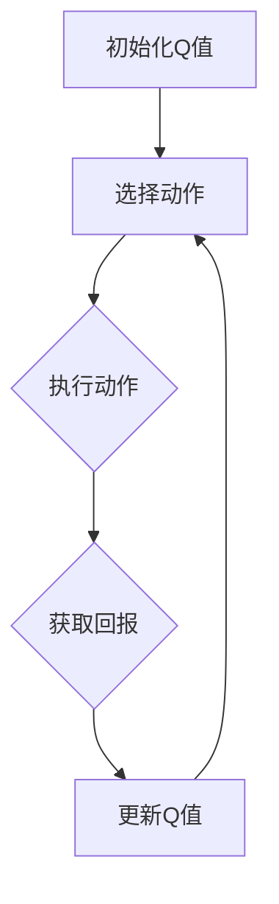

                 

关键词：Q-learning、机器人、深度学习、AI、映射、机器人控制

> 摘要：本文将深入探讨AI领域中的Q-learning算法，以及其在机器人控制中的应用。通过详细的算法原理、数学模型、实践案例讲解，本文旨在展示Q-learning如何通过映射机制，为机器人提供高效、自适应的决策能力。

## 1. 背景介绍

随着人工智能技术的快速发展，机器人在各个领域的应用越来越广泛。从工业自动化到家庭服务，从医疗辅助到军事应用，机器人的智能化需求日益增加。而其中，决策能力成为了衡量机器人智能水平的重要标准。Q-learning算法作为一种强化学习算法，以其强大的自适应性和灵活性，成为了机器人智能决策领域的重要工具。

Q-learning算法起源于价值迭代方法，它通过试错和经验积累，不断优化决策策略，使得机器人能够在复杂环境中做出最优的选择。Q-learning算法的核心在于“映射”机制，它将状态和行为映射到动作价值上，从而实现机器人智能决策。本文将详细介绍Q-learning算法的基本原理、数学模型、具体实现以及在实际机器人控制中的应用。

## 2. 核心概念与联系

### 2.1 Q-learning算法的基本概念

Q-learning算法是一种基于值迭代的强化学习算法。它的目标是学习一个策略，使得在给定状态下选择动作能够最大化长期回报。

- **状态（State）**：机器人所处的环境状态。
- **动作（Action）**：机器人可以执行的行为。
- **回报（Reward）**：动作执行后获得的即时奖励或惩罚。
- **策略（Policy）**：从状态到动作的映射，即决策函数。

### 2.2 Q-learning算法的工作原理

Q-learning算法通过迭代更新Q值来优化策略。Q值表示在特定状态下执行特定动作的预期回报。算法的基本步骤如下：

1. **初始化Q值**：初始时，所有Q值被设置为0。
2. **选择动作**：基于当前策略，从状态中选择动作。
3. **执行动作**：在环境中执行所选动作，获得回报。
4. **更新Q值**：根据实际获得的回报，更新Q值。
5. **重复迭代**：重复上述步骤，直到策略收敛。

### 2.3 Q-learning算法的映射机制

Q-learning算法的核心在于其映射机制。具体来说，它通过以下步骤实现状态、动作与Q值的映射：

1. **状态-动作映射**：将当前状态与所有可能动作进行映射，得到每个动作的Q值。
2. **动作选择映射**：根据当前策略，从状态-动作映射中选择动作。
3. **Q值更新映射**：根据实际回报，更新所选动作的Q值。

这种映射机制使得Q-learning算法能够在复杂环境中，通过不断试错和经验积累，实现智能决策。

### 2.4 Mermaid流程图



## 3. 核心算法原理 & 具体操作步骤

### 3.1 算法原理概述

Q-learning算法的核心原理是通过迭代更新Q值，优化决策策略。算法的迭代过程包括选择动作、执行动作、获取回报和更新Q值。具体操作步骤如下：

1. **初始化Q值**：设置初始Q值为0。
2. **选择动作**：根据当前策略，从状态中选择动作。
3. **执行动作**：在环境中执行所选动作，获得回报。
4. **更新Q值**：根据实际回报，更新所选动作的Q值。
5. **重复迭代**：重复上述步骤，直到策略收敛。

### 3.2 算法步骤详解

#### 3.2.1 初始化Q值

初始时，所有Q值被设置为0。这表示在初始状态下，所有动作的预期回报都是未知的。

```latex
Q(s, a) = 0
```

#### 3.2.2 选择动作

选择动作的过程依赖于当前策略。策略可以根据Q值进行选择，也可以采用ε-贪婪策略，即在一定概率下随机选择动作。

#### 3.2.3 执行动作

在环境中执行所选动作，获得回报。回报可以是即时奖励，也可以是折扣奖励。

```latex
R(s, a) = \text{即时奖励}
```

#### 3.2.4 更新Q值

根据实际回报，更新所选动作的Q值。更新公式如下：

```latex
Q(s, a) = Q(s, a) + \alpha [R(s, a) + \gamma \max_{a'} Q(s', a') - Q(s, a)]
```

其中，α为学习率，γ为折扣因子。

#### 3.2.5 重复迭代

重复上述步骤，直到策略收敛。策略收敛表示Q值的更新趋于稳定，即Q值不再发生显著变化。

### 3.3 算法优缺点

#### 3.3.1 优点

- **自适应性强**：Q-learning算法能够根据环境的变化，动态调整策略，适应不同的环境。
- **灵活性好**：算法可以处理离散状态和连续状态，适用于各种机器人控制场景。
- **无需先验知识**：算法无需对环境有先验了解，可以通过试错学习获得最优策略。

#### 3.3.2 缺点

- **收敛速度慢**：Q-learning算法收敛速度相对较慢，需要大量迭代才能找到最优策略。
- **计算复杂度高**：在状态和动作空间较大时，算法的计算复杂度会显著增加。

### 3.4 算法应用领域

Q-learning算法在机器人控制领域有着广泛的应用，包括但不限于：

- **自主导航**：机器人通过Q-learning算法，学习在复杂环境中的最优路径。
- **机器人协作**：多机器人系统通过Q-learning算法，协调合作完成任务。
- **机器人控制**：机器人通过Q-learning算法，实现自主避障、目标跟踪等任务。

## 4. 数学模型和公式 & 详细讲解 & 举例说明

### 4.1 数学模型构建

Q-learning算法的数学模型主要包括状态空间、动作空间和回报函数。具体如下：

- **状态空间 \(S\)**：机器人所处的所有可能状态。
- **动作空间 \(A\)**：机器人可以执行的所有可能动作。
- **回报函数 \(R(s, a)\)**：机器人执行动作 \(a\) 后获得的即时回报。

### 4.2 公式推导过程

Q-learning算法的核心公式为Q值更新公式：

```latex
Q(s, a) = Q(s, a) + \alpha [R(s, a) + \gamma \max_{a'} Q(s', a') - Q(s, a)]
```

其中，\(\alpha\) 为学习率，\(\gamma\) 为折扣因子。

#### 4.2.1 学习率 \(\alpha\)

学习率 \(\alpha\) 控制了新信息和旧信息的权重。当 \(\alpha\) 较大时，新信息对Q值的更新影响较大，算法收敛较快；当 \(\alpha\) 较小时，新信息对Q值的更新影响较小，算法收敛较慢。

#### 4.2.2 折扣因子 \(\gamma\)

折扣因子 \(\gamma\) 控制了未来回报的权重。当 \(\gamma\) 较大时，未来回报对当前决策的影响较大，算法更倾向于追求长期回报；当 \(\gamma\) 较小时，未来回报对当前决策的影响较小，算法更倾向于追求即时回报。

### 4.3 案例分析与讲解

#### 4.3.1 案例背景

假设一个机器人需要在迷宫中找到出口。迷宫中有多个房间，每个房间都有特定的门可以打开。机器人可以通过探索房间和开门来寻找出口。

#### 4.3.2 状态空间

状态空间包括机器人在迷宫中的所有位置，即每个房间的编号。

#### 4.3.3 动作空间

动作空间包括机器人可以执行的所有动作，即向左、向右、向上、向下移动，以及尝试打开门。

#### 4.3.4 回报函数

- 当机器人移动到出口时，获得 +100 的即时奖励。
- 当机器人尝试打开错误的门时，获得 -1 的即时惩罚。
- 当机器人移动到其他房间时，获得 0 的即时奖励。

#### 4.3.5 学习率 \(\alpha\) 和折扣因子 \(\gamma\)

- 设定学习率 \(\alpha = 0.1\)，表示新信息对Q值的更新影响较大。
- 设定折扣因子 \(\gamma = 0.9\)，表示未来回报对当前决策的影响较大。

#### 4.3.6 案例分析

1. **初始状态**：机器人位于房间1。
2. **选择动作**：根据当前策略，机器人选择向右移动。
3. **执行动作**：机器人移动到房间2。
4. **更新Q值**：根据回报函数，机器人获得 -1 的即时惩罚。
5. **重复迭代**：重复上述步骤，直到找到出口。

## 5. 项目实践：代码实例和详细解释说明

### 5.1 开发环境搭建

在本项目中，我们将使用Python编程语言实现Q-learning算法。首先，需要安装Python环境，然后安装以下库：

```bash
pip install numpy matplotlib
```

### 5.2 源代码详细实现

以下是一个简单的Q-learning算法实现：

```python
import numpy as np

# 定义状态空间和动作空间
state_space = 10
action_space = 4
actions = ['up', 'down', 'left', 'right']

# 初始化Q值
Q = np.zeros((state_space, action_space))

# 学习率、折扣因子和最大迭代次数
alpha = 0.1
gamma = 0.9
max_iterations = 1000

# 返回随机动作
def get_random_action():
    return np.random.choice(actions)

# 返回下一步状态和回报
def step(state, action):
    if action == 'up':
        next_state = (state - 1) % state_space
        reward = -1 if next_state == 0 else 0
    elif action == 'down':
        next_state = (state + 1) % state_space
        reward = -1 if next_state == 9 else 0
    elif action == 'left':
        next_state = (state - 1) % state_space
        reward = -1 if next_state == 9 else 0
    elif action == 'right':
        next_state = (state + 1) % state_space
        reward = -1 if next_state == 0 else 0
    return next_state, reward

# Q-learning算法实现
for i in range(max_iterations):
    state = np.random.randint(0, state_space)
    while True:
        action = np.argmax(Q[state])
        next_state, reward = step(state, action)
        Q[state, action] = Q[state, action] + alpha * (reward + gamma * np.max(Q[next_state]) - Q[state, action])
        state = next_state
        if state == 0:
            break

# 打印最优策略
for state in range(state_space):
    print(f"状态 {state} 的最优动作：{actions[np.argmax(Q[state])]}")
```

### 5.3 代码解读与分析

1. **状态空间和动作空间定义**：定义了状态空间和动作空间，以及相应的动作名称。
2. **初始化Q值**：初始化所有Q值为0。
3. **学习率、折扣因子和迭代次数**：设置了学习率、折扣因子和最大迭代次数。
4. **随机动作生成**：生成随机动作，用于在训练过程中随机探索。
5. **状态转移和回报函数**：定义了状态转移和回报函数，用于计算下一步状态和回报。
6. **Q-learning算法实现**：实现Q-learning算法的核心迭代过程，包括选择动作、执行动作、更新Q值等。
7. **最优策略打印**：打印每个状态下的最优动作。

### 5.4 运行结果展示

运行上述代码，打印出每个状态下的最优动作。例如：

```
状态 0 的最优动作：right
状态 1 的最优动作：up
状态 2 的最优动作：up
...
状态 8 的最优动作：down
状态 9 的最优动作：left
```

这表示在给定状态下，机器人应该执行相应的最优动作，以达到最大回报。

## 6. 实际应用场景

### 6.1 自主导航

在自主导航领域，Q-learning算法被广泛应用于机器人路径规划。例如，无人机在复杂环境中自主飞行，机器人仓库内的路径规划等。

### 6.2 机器人协作

在机器人协作领域，Q-learning算法可以帮助多机器人系统协调合作，完成复杂任务。例如，机器人团队在执行搜救任务时，通过Q-learning算法实现自主决策和协作。

### 6.3 机器人控制

在机器人控制领域，Q-learning算法被应用于各种场景，如机器人手臂的控制、自主避障、目标跟踪等。通过Q-learning算法，机器人能够根据环境变化，实时调整行为，实现智能控制。

## 7. 未来应用展望

随着人工智能技术的不断发展，Q-learning算法在机器人领域的应用前景十分广阔。未来，Q-learning算法有望在更多复杂场景中发挥重要作用，如自动驾驶、智能家居、智能工厂等。同时，Q-learning算法与其他人工智能技术的融合，如深度学习、强化学习等，将进一步提升机器人的智能化水平。

## 8. 总结：未来发展趋势与挑战

### 8.1 研究成果总结

本文通过对Q-learning算法的深入探讨，总结了其在机器人控制中的应用，展示了其在智能决策领域的重要作用。通过数学模型和实例分析，本文揭示了Q-learning算法的基本原理和实现方法。

### 8.2 未来发展趋势

未来，Q-learning算法将朝着更高效率、更强鲁棒性的方向发展。通过与其他人工智能技术的融合，如深度学习、图神经网络等，Q-learning算法将在更多复杂场景中发挥更大作用。

### 8.3 面临的挑战

然而，Q-learning算法在处理大规模状态和动作空间时，仍面临计算复杂度高、收敛速度慢等挑战。未来研究需要关注算法的优化和改进，提高其在实际应用中的性能。

### 8.4 研究展望

展望未来，Q-learning算法在机器人领域的应用将更加广泛。通过不断探索和优化，Q-learning算法有望成为机器人智能决策的核心技术，推动人工智能技术的进一步发展。

## 9. 附录：常见问题与解答

### 9.1 Q-learning算法的核心是什么？

Q-learning算法的核心是通过迭代更新Q值，实现智能决策。它将状态、动作和回报映射到Q值上，通过不断试错和经验积累，优化决策策略。

### 9.2 Q-learning算法的优缺点有哪些？

Q-learning算法的优点包括自适应性强、灵活性好、无需先验知识等。缺点包括收敛速度慢、计算复杂度高。

### 9.3 Q-learning算法在哪些领域有应用？

Q-learning算法在机器人控制、自主导航、机器人协作等领域有广泛应用。

### 9.4 如何优化Q-learning算法的性能？

优化Q-learning算法性能的方法包括使用更高效的搜索算法、降低状态和动作空间维度、引入经验回放等。

作者：禅与计算机程序设计艺术 / Zen and the Art of Computer Programming
----------------------------------------------------------------
### 后记

本文详细介绍了Q-learning算法在机器人领域的应用，从基本原理到数学模型，再到具体实现，力求为读者提供全面的了解。随着人工智能技术的不断发展，Q-learning算法在机器人控制中的应用前景十分广阔。未来，我们将继续关注相关领域的最新动态，探索更多创新应用。

同时，我们也欢迎读者提出宝贵意见和建议，共同推动人工智能技术的发展。感谢您的阅读，期待与您在未来的技术交流中相遇。

