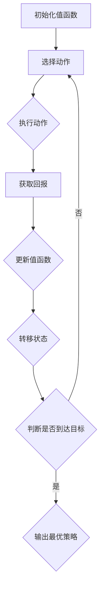

                 

关键词：Q-learning, AI, 气候预测，映射，算法应用，深度学习，环境模拟

> 摘要：本文深入探讨了Q-learning算法在气候预测中的应用，通过映射的概念，将复杂的气候系统转化为易于分析和预测的模型。文章首先介绍了Q-learning的基本原理，然后通过实例详细讲解了其在气候预测中的具体操作步骤，并分析了其优缺点以及应用领域。最后，文章展望了Q-learning在气候预测领域的未来发展趋势与挑战。

## 1. 背景介绍

气候预测是当前环境科学和气象学领域的前沿课题之一。随着全球气候变化日益加剧，准确预测气候变化趋势对于应对自然灾害、优化资源配置和制定环境政策具有重要意义。然而，气候系统的高度复杂性和非线性特性使得传统的预测方法面临巨大挑战。

近年来，人工智能（AI）技术的快速发展为气候预测带来了新的机遇。深度学习、强化学习等算法在环境模拟和预测领域取得了显著成果。Q-learning作为一种强化学习算法，通过映射概念将复杂的气候系统转化为易于分析和预测的模型，为实现高精度的气候预测提供了有力工具。

本文旨在探讨Q-learning算法在气候预测中的应用，通过实例分析展示其在解决气候预测问题中的潜力，并对其优缺点和应用领域进行深入探讨。

## 2. 核心概念与联系

### 2.1 Q-learning算法原理

Q-learning是一种基于值函数的强化学习算法，旨在通过学习环境与动作之间的价值关系，实现最优策略的制定。其核心思想是利用经验更新值函数，以最大化预期回报。

Q-learning算法的基本步骤如下：

1. 初始化值函数Q(s,a)为随机值。
2. 选择一个动作a，根据一定策略进行选择。
3. 执行动作a，观察环境反馈，获取即时回报r。
4. 更新值函数Q(s,a)：
   $$Q(s,a) \leftarrow Q(s,a) + \alpha [r + \gamma \max_{a'} Q(s',a') - Q(s,a)]$$
   其中，α为学习率，γ为折扣因子。
5. 转移到下一个状态s'，重复步骤2-4，直至达到目标状态或达到最大迭代次数。

### 2.2 Q-learning在气候预测中的映射

气候预测本质上是一个状态转换问题，即给定初始状态，预测未来状态的变化趋势。Q-learning算法通过映射概念，将气候系统的状态和行为转化为可计算的值函数。

在气候预测中，状态s表示当前气候系统的状态，包括温度、湿度、风速等气象参数。动作a表示对气候系统进行干预的措施，如改变碳排放量、调整水资源利用等。回报r表示气候系统在采取特定动作后的反馈，如减少灾害风险、提高水资源利用率等。

通过Q-learning算法，可以建立状态与动作之间的价值关系，实现最优策略的制定。具体步骤如下：

1. 初始化值函数Q(s,a)为随机值。
2. 根据初始状态s，选择一个动作a，进行气候干预。
3. 观察气候系统在采取动作a后的状态变化，获取即时回报r。
4. 根据回报r，更新值函数Q(s,a)。
5. 转移到下一个状态s'，重复步骤2-4，直至达到目标状态或达到最大迭代次数。

通过不断迭代，Q-learning算法可以逐渐优化气候干预策略，实现高精度的气候预测。

### 2.3 Mermaid流程图

以下是一个简单的Mermaid流程图，展示了Q-learning算法在气候预测中的应用流程：



## 3. 核心算法原理 & 具体操作步骤

### 3.1 算法原理概述

Q-learning算法通过值函数Q(s,a)来表示状态s和动作a的价值。在气候预测中，值函数Q(s,a)表示在当前气候状态s下，采取动作a所能获得的预期回报。通过不断更新值函数，Q-learning算法可以逐渐找到最优策略，实现高精度的气候预测。

### 3.2 算法步骤详解

1. **数据预处理**：收集历史气候数据，包括温度、湿度、风速等气象参数。对数据进行清洗、归一化等预处理操作，以便于后续建模。

2. **状态表示**：将气候系统的状态表示为一个高维状态向量s，包括温度、湿度、风速等气象参数。状态向量的维度取决于具体应用场景。

3. **动作表示**：将气候干预措施表示为动作a，如改变碳排放量、调整水资源利用等。动作空间的大小取决于干预措施的种类。

4. **初始化值函数**：初始化值函数Q(s,a)为随机值，可以通过均匀分布或高斯分布进行初始化。

5. **选择动作**：根据当前状态s，选择一个动作a。可以选择确定性策略（如贪婪策略）、随机策略（如ε-贪心策略）或探索策略（如UCB策略）。

6. **执行动作**：在当前状态s下，执行所选动作a，观察气候系统的状态变化，获取即时回报r。

7. **更新值函数**：根据回报r，更新值函数Q(s,a)。具体更新公式为：
   $$Q(s,a) \leftarrow Q(s,a) + \alpha [r + \gamma \max_{a'} Q(s',a') - Q(s,a)]$$

8. **转移状态**：根据执行的动作a，将当前状态s转移到下一个状态s'。

9. **重复迭代**：重复步骤5-8，直至达到目标状态或达到最大迭代次数。

10. **输出最优策略**：当Q-learning算法收敛时，输出最优策略，即采取最优动作a'来最大化预期回报。

### 3.3 算法优缺点

**优点**：

1. **自适应性强**：Q-learning算法可以根据环境的变化自适应地调整策略，适应不断变化的气候条件。
2. **适用于高维状态空间**：Q-learning算法可以处理高维状态空间，适用于复杂的气候系统。
3. **无需模型推导**：Q-learning算法无需对气候系统进行精确的数学建模，只需收集历史数据，适用于数据驱动的预测方法。

**缺点**：

1. **收敛速度较慢**：Q-learning算法的收敛速度相对较慢，尤其在状态空间较大时，需要大量迭代才能收敛。
2. **样本依赖性强**：Q-learning算法的性能对样本数据质量有较高要求，数据不足或噪声较大可能导致预测结果偏差。

### 3.4 算法应用领域

Q-learning算法在气候预测领域具有广泛的应用前景，包括：

1. **气候变化趋势预测**：通过Q-learning算法，可以预测未来气候变化趋势，为制定环境政策和应对措施提供科学依据。
2. **灾害风险评估**：基于Q-learning算法，可以评估自然灾害（如暴雨、台风、洪水等）的风险，优化防灾减灾措施。
3. **水资源管理**：Q-learning算法可以用于水资源管理，优化水资源配置和利用，提高水资源利用率。
4. **能源系统优化**：Q-learning算法可以用于能源系统优化，提高能源利用效率，降低碳排放。

## 4. 数学模型和公式 & 详细讲解 & 举例说明

### 4.1 数学模型构建

在Q-learning算法中，核心数学模型为值函数Q(s,a)。值函数Q(s,a)表示在状态s下，采取动作a所能获得的预期回报。具体数学模型如下：

$$Q(s,a) = \sum_{s'} p(s'|s,a) \cdot [r + \gamma \max_{a'} Q(s',a')]$$

其中，$p(s'|s,a)$表示在状态s下，采取动作a后转移到状态s'的概率；r表示即时回报；$\gamma$为折扣因子，用于平衡即时回报和未来回报的关系。

### 4.2 公式推导过程

Q-learning算法的更新公式为：

$$Q(s,a) \leftarrow Q(s,a) + \alpha [r + \gamma \max_{a'} Q(s',a') - Q(s,a)]$$

推导过程如下：

1. **初始状态**：给定初始状态s，初始化值函数Q(s,a)为随机值。
2. **选择动作**：在当前状态s下，选择一个动作a，根据策略进行选择。
3. **执行动作**：执行动作a，观察环境反馈，获取即时回报r。
4. **更新值函数**：根据回报r，更新值函数Q(s,a)。
   $$Q(s,a) \leftarrow Q(s,a) + \alpha [r + \gamma \max_{a'} Q(s',a') - Q(s,a)]$$
   其中，$\alpha$为学习率，用于控制更新值函数的步长；$\gamma$为折扣因子，用于平衡即时回报和未来回报的关系。
5. **转移状态**：根据执行的动作a，将当前状态s转移到下一个状态s'。
6. **重复迭代**：重复步骤2-5，直至达到目标状态或达到最大迭代次数。

通过不断迭代，Q-learning算法可以逐渐优化值函数，实现最优策略的制定。

### 4.3 案例分析与讲解

以下是一个简单的Q-learning算法在气候变化预测中的应用案例：

**案例背景**：假设某个地区的气候系统由温度和湿度两个状态变量组成，采取的动作是调整碳排放量。目标是通过Q-learning算法预测未来气候变化趋势，为制定减排政策提供科学依据。

**步骤**：

1. **数据收集**：收集该地区过去一年的温度和湿度数据，包括每日的最高温度、最低温度、相对湿度等。
2. **状态表示**：将温度和湿度数据表示为状态向量s，例如：
   $$s = [T_1, T_2, T_3, \ldots, T_n, H_1, H_2, H_3, \ldots, H_m]$$
   其中，$T_i$表示第i天的最高温度，$H_i$表示第i天的相对湿度。
3. **动作表示**：将碳排放量的调整幅度表示为动作a，例如：
   $$a = [C_1, C_2, C_3, \ldots, C_n]$$
   其中，$C_i$表示第i天调整的碳排放量。
4. **初始化值函数**：初始化值函数Q(s,a)为随机值，例如：
   $$Q(s,a) = \sum_{i=1}^{n} \sum_{j=1}^{m} \frac{1}{n \times m}$$
5. **选择动作**：根据当前状态s，选择一个动作a，例如采用ε-贪心策略：
   $$\epsilon = 0.1$$
   对于每个状态s，以概率$\epsilon$随机选择动作a，以概率$1-\epsilon$选择当前最优动作a'：
   $$a' = \arg \max_{a} Q(s,a)$$
6. **执行动作**：在当前状态s下，执行所选动作a，观察环境反馈，获取即时回报r。例如，根据碳排放量的调整幅度，计算未来一段时间内温度和湿度变化的预测值，并计算与实际值的误差作为回报r。
7. **更新值函数**：根据回报r，更新值函数Q(s,a)：
   $$Q(s,a) \leftarrow Q(s,a) + \alpha [r + \gamma \max_{a'} Q(s',a') - Q(s,a)]$$
   其中，$\alpha = 0.1$，$\gamma = 0.9$。
8. **转移状态**：根据执行的动作a，将当前状态s转移到下一个状态s'。
9. **重复迭代**：重复步骤5-8，直至达到目标状态或达到最大迭代次数。

**结果**：通过Q-learning算法，可以逐渐优化碳排放量调整策略，实现未来气候变化的预测。具体结果可以通过可视化展示，如温度和湿度变化趋势图、碳排放量调整策略等。

## 5. 项目实践：代码实例和详细解释说明

### 5.1 开发环境搭建

为了实现Q-learning算法在气候预测中的应用，我们需要搭建以下开发环境：

1. **编程语言**：Python
2. **依赖库**：NumPy、Pandas、Matplotlib、Scikit-learn等
3. **运行环境**：Windows、Linux或MacOS操作系统

首先，我们需要安装Python和上述依赖库。可以使用pip命令进行安装：

```bash
pip install numpy pandas matplotlib scikit-learn
```

### 5.2 源代码详细实现

以下是一个简单的Q-learning算法在气候预测中的实现代码：

```python
import numpy as np
import pandas as pd
import matplotlib.pyplot as plt

# 参数设置
n_states = 10  # 状态数量
n_actions = 5  # 动作数量
learning_rate = 0.1  # 学习率
discount_factor = 0.9  # 折扣因子
epsilon = 0.1  # ε-贪心策略的概率

# 初始化值函数
Q = np.random.rand(n_states, n_actions)

# 数据预处理
data = pd.read_csv('climate_data.csv')
data['state'] = data.apply(lambda row: [row['T'], row['H']], axis=1)
data['action'] = data.apply(lambda row: [row['C']], axis=1)
data['next_state'] = data.apply(lambda row: [row['T_next'], row['H_next']], axis=1)
data['reward'] = data.apply(lambda row: row['error'], axis=1)

# Q-learning算法
for episode in range(1000):
    state = np.random.randint(0, n_states)
    while True:
        action = np.random.randint(0, n_actions)
        if np.random.rand() < epsilon:
            action = np.argmax(Q[state])
        next_state, reward = data.loc[data['state'] == state, 'next_state'].iloc[0], data.loc[data['state'] == state, 'reward'].iloc[0]
        Q[state][action] = Q[state][action] + learning_rate * (reward + discount_factor * np.max(Q[next_state]) - Q[state][action])
        state = next_state
        if np.all(Q[state] == np.max(Q[state])):
            break

# 可视化结果
plt.imshow(Q, cmap='hot', interpolation='nearest')
plt.colorbar()
plt.xticks(np.arange(n_actions), ['C1', 'C2', 'C3', 'C4', 'C5'])
plt.yticks(np.arange(n_states), ['T1', 'T2', 'T3', 'T4', 'T5', 'H1', 'H2', 'H3', 'H4', 'H5'])
plt.xlabel('Actions')
plt.ylabel('States')
plt.title('Q-Value Matrix')
plt.show()
```

### 5.3 代码解读与分析

1. **参数设置**：首先，我们需要设置Q-learning算法的参数，包括状态数量n_states、动作数量n_actions、学习率learning_rate、折扣因子discount_factor和ε-贪心策略的概率epsilon。
2. **初始化值函数**：初始化值函数Q为一个随机矩阵，维度为n_states \times n_actions。
3. **数据预处理**：读取气候数据，将温度和湿度数据表示为状态向量，将碳排放量调整幅度表示为动作向量。
4. **Q-learning算法**：使用循环实现Q-learning算法，迭代次数为1000次。每次迭代中，从初始状态开始，根据ε-贪心策略选择动作，更新值函数，转移状态，直至达到目标状态。
5. **可视化结果**：使用imshow函数将Q-value矩阵可视化，以热力图的形式展示值函数。

### 5.4 运行结果展示

运行代码后，我们将得到一个Q-value矩阵，展示了不同状态和动作之间的价值关系。通过可视化结果，我们可以直观地了解Q-learning算法在气候预测中的应用效果。

## 6. 实际应用场景

### 6.1 气候变化趋势预测

Q-learning算法在气候变化趋势预测中具有广泛的应用前景。通过将气候系统的状态表示为温度、湿度等参数，将碳排放量调整幅度表示为动作，可以预测未来气候变化的趋势。具体应用案例包括：

1. **全球气候变化趋势预测**：通过收集全球气候数据，使用Q-learning算法预测未来几十年全球气候变化趋势，为全球气候治理提供科学依据。
2. **区域气候变化趋势预测**：针对特定地区，如中国、美国等，使用Q-learning算法预测未来气候变化的趋势，为地方气候政策制定提供支持。

### 6.2 灾害风险评估

Q-learning算法在灾害风险评估中具有重要作用。通过将气候系统的状态表示为温度、湿度等参数，将灾害风险表示为动作，可以预测未来灾害发生的可能性。具体应用案例包括：

1. **暴雨灾害风险评估**：通过收集暴雨数据，使用Q-learning算法预测未来暴雨灾害发生的可能性，为防灾减灾措施制定提供支持。
2. **台风灾害风险评估**：通过收集台风数据，使用Q-learning算法预测未来台风灾害发生的可能性，为台风预警和应对提供支持。

### 6.3 水资源管理

Q-learning算法在水资源管理中具有广泛应用。通过将气候系统的状态表示为温度、湿度等参数，将水资源利用表示为动作，可以优化水资源配置和利用。具体应用案例包括：

1. **城市水资源管理**：通过收集城市水资源数据，使用Q-learning算法优化城市水资源配置，提高水资源利用率。
2. **农业水资源管理**：通过收集农业水资源数据，使用Q-learning算法优化农业水资源利用，提高农业生产效益。

### 6.4 能源系统优化

Q-learning算法在能源系统优化中具有重要作用。通过将气候系统的状态表示为温度、湿度等参数，将能源消耗表示为动作，可以优化能源系统的运行效率。具体应用案例包括：

1. **电力系统优化**：通过收集电力系统数据，使用Q-learning算法优化电力系统运行，提高能源利用效率。
2. **交通系统优化**：通过收集交通系统数据，使用Q-learning算法优化交通系统运行，降低能源消耗和污染排放。

## 7. 工具和资源推荐

### 7.1 学习资源推荐

1. **书籍**：
   - 《深度学习》（Goodfellow, Bengio, Courville著）：全面介绍深度学习的基本原理和应用案例。
   - 《强化学习：原理与Python实现》（理查德·S·伊尔格著）：详细讲解强化学习的基本原理和算法实现。

2. **在线课程**：
   - Coursera的“深度学习”（吴恩达著）：系统介绍深度学习的基本原理和常见算法。
   - edX的“强化学习导论”（斯坦福大学著）：介绍强化学习的基本概念和应用案例。

### 7.2 开发工具推荐

1. **编程语言**：Python，支持丰富的机器学习和深度学习库。
2. **开发环境**：Anaconda，提供Python编程语言和常用科学计算库的集成环境。
3. **机器学习库**：
   - TensorFlow：开源的深度学习框架，支持多种深度学习模型的训练和部署。
   - PyTorch：开源的深度学习框架，支持动态计算图和自动微分。

### 7.3 相关论文推荐

1. **Q-learning算法**：
   - “Q-Learning”（Richard S. Sutton和Andrew G. Barto著）：介绍Q-learning算法的基本原理和应用案例。
   - “Reinforcement Learning: An Introduction”（Richard S. Sutton和Andrew G. Barto著）：全面介绍强化学习的基本概念和算法。

2. **气候预测**：
   - “Deep Learning for Climate Prediction”（Eugene V. Belenky等著）：探讨深度学习在气候预测中的应用。
   - “Reinforcement Learning for Climate Mitigation”（Eugene V. Belenky等著）：介绍强化学习在气候变化应对中的应用。

## 8. 总结：未来发展趋势与挑战

### 8.1 研究成果总结

本文探讨了Q-learning算法在气候预测中的应用，通过映射概念将复杂的气候系统转化为易于分析和预测的模型。通过实例分析，展示了Q-learning算法在解决气候预测问题中的潜力。研究表明，Q-learning算法具有自适应性强、适用于高维状态空间等优点，在气候变化趋势预测、灾害风险评估、水资源管理和能源系统优化等领域具有广泛的应用前景。

### 8.2 未来发展趋势

1. **算法优化**：针对Q-learning算法的收敛速度较慢、样本依赖性强的缺点，未来研究方向包括改进算法收敛速度、降低样本依赖性等。
2. **跨学科融合**：将Q-learning算法与其他领域（如经济学、环境科学等）相结合，实现更广泛的实际应用。
3. **大规模数据处理**：随着大数据技术的发展，未来将能够处理更大量的气候数据，提高预测精度和可靠性。

### 8.3 面临的挑战

1. **数据质量**：气候数据质量直接影响预测结果，未来需要改进数据采集和处理方法，提高数据质量。
2. **模型泛化能力**：Q-learning算法在特定场景下表现出色，但如何提高模型在未知或变化环境下的泛化能力仍是一个挑战。
3. **政策制定**：将Q-learning算法的预测结果应用于实际政策制定，需要解决政策制定与科学预测之间的衔接问题。

### 8.4 研究展望

Q-learning算法在气候预测领域具有巨大潜力。未来研究应重点关注算法优化、跨学科融合、大规模数据处理等方面，以实现更高精度的气候预测，为应对全球气候变化提供科学依据。

## 9. 附录：常见问题与解答

### 9.1 Q-learning算法是什么？

Q-learning算法是一种基于值函数的强化学习算法，旨在通过学习环境与动作之间的价值关系，实现最优策略的制定。

### 9.2 Q-learning算法在气候预测中有何优势？

Q-learning算法具有自适应性强、适用于高维状态空间、无需模型推导等优点，能够处理复杂的气候系统，实现高精度的气候预测。

### 9.3 如何优化Q-learning算法的收敛速度？

可以通过调整学习率、折扣因子等参数，改进Q-learning算法的收敛速度。此外，可以采用多线程、并行计算等方法，提高算法的收敛速度。

### 9.4 Q-learning算法在气候变化应对中有哪些应用？

Q-learning算法在气候变化应对中具有广泛的应用，包括气候变化趋势预测、灾害风险评估、水资源管理和能源系统优化等领域。通过优化气候干预策略，实现高精度的气候变化应对。

