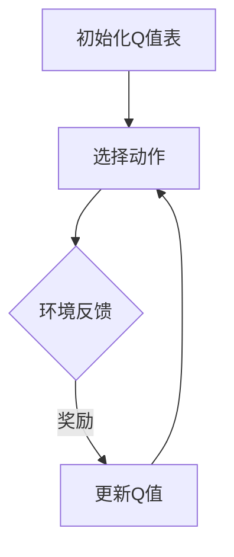

                 

 > **关键词：** AI，Q-learning，映射，强化学习，算法，技术博客

> **摘要：** 本文将深入探讨Q-learning算法在人工智能领域的基础概念和原理，通过映射的方式，帮助读者更好地理解和应用这一强大的算法。文章将涵盖Q-learning的定义、核心概念、数学模型、算法步骤、优缺点以及实际应用场景，旨在为AI研究人员和开发者提供全面的指导。

## 1. 背景介绍

随着人工智能技术的快速发展，强化学习作为机器学习的一个重要分支，受到了广泛的关注。Q-learning算法是强化学习中的一个经典算法，它在解决智能体与环境的交互问题中表现出色。Q-learning算法的核心思想是通过学习环境的状态和动作之间的价值映射，从而实现智能体的最优策略。

在本文中，我们将以映射的方式，深入剖析Q-learning算法的基础概念，帮助读者更好地理解和应用这一算法。通过本文的阅读，读者将能够掌握Q-learning的基本原理，了解其在不同应用场景中的优势，并具备一定的实践能力。

## 2. 核心概念与联系

### 2.1 强化学习基础

强化学习是一种让智能体通过与环境交互来学习最优策略的机器学习方法。在强化学习中，智能体需要根据当前的状态选择动作，并根据动作的结果（即奖励）来调整其策略。这一过程持续进行，直到智能体达到预定的目标或满足某些停止条件。

强化学习的关键概念包括状态（State）、动作（Action）、奖励（Reward）和策略（Policy）。状态是智能体当前所处的环境情况，动作是智能体可以采取的行动，奖励是动作结果的反馈，策略则是智能体选择动作的规则。

### 2.2 Q-learning算法

Q-learning算法是一种基于价值迭代的强化学习算法。它的核心思想是通过学习状态和动作之间的价值映射，即Q值（Q-value），来指导智能体的行为。Q值表示在给定状态下采取某个动作所能获得的期望回报。

Q-learning算法的主要步骤包括：

1. **初始化Q值表**：初始时，Q值表中的所有值均设置为0。
2. **选择动作**：在给定状态下，智能体根据某种策略选择动作。
3. **更新Q值**：根据实际采取的动作的结果，更新Q值。
4. **重复步骤2和3**：不断重复选择动作和更新Q值的过程，直到智能体找到最优策略。

### 2.3 Q-learning与映射的关系

Q-learning算法的本质是学习状态和动作之间的映射关系。这种映射关系可以通过Q值表来表示。在每次智能体与环境交互时，Q值表都会更新，从而逐步逼近最优策略。因此，我们可以将Q-learning算法看作是一种映射学习过程，其中映射的输入是状态和动作，输出是Q值。

下面是一个简单的Mermaid流程图，展示了Q-learning算法的基本流程：



在上述流程图中，A表示初始化Q值表，B表示选择动作，C表示环境反馈（包括状态转移和奖励），D表示更新Q值。这个过程不断重复，直到智能体找到最优策略。

## 3. 核心算法原理 & 具体操作步骤

### 3.1 算法原理概述

Q-learning算法通过迭代的方式，逐步学习状态和动作之间的价值映射。在每次迭代过程中，智能体根据当前状态选择动作，然后根据动作的结果更新Q值。这个过程持续进行，直到Q值收敛或满足某些停止条件。

Q-learning算法的原理可以概括为以下三个步骤：

1. **初始化Q值表**：初始时，Q值表中的所有值均设置为0。
2. **选择动作**：在给定状态下，智能体根据某种策略选择动作。常见的策略有贪心策略、ε-贪心策略等。
3. **更新Q值**：根据实际采取的动作的结果，更新Q值。具体地，新的Q值可以通过以下公式计算：

$$
Q(s, a) \leftarrow Q(s, a) + \alpha [r + \gamma \max_{a'} Q(s', a') - Q(s, a)]
$$

其中，$s$表示当前状态，$a$表示当前动作，$s'$表示状态转移后的状态，$a'$表示状态转移后的动作，$r$表示奖励，$\alpha$表示学习率，$\gamma$表示折扣因子。

### 3.2 算法步骤详解

以下是Q-learning算法的具体操作步骤：

1. **初始化Q值表**：将Q值表中的所有值初始化为0。
2. **选择初始状态**：随机选择一个初始状态$s$。
3. **选择动作**：在给定状态下，选择动作$a$。可以选择贪心策略或ε-贪心策略。
4. **执行动作**：在当前状态$s$下执行动作$a$，并获得状态转移$s' \rightarrow a'$和奖励$r$。
5. **更新Q值**：根据公式更新Q值。
6. **重复步骤3-5**：重复选择动作、执行动作和更新Q值的过程，直到Q值收敛或满足停止条件。
7. **输出最优策略**：Q值收敛后，输出最优策略。

### 3.3 算法优缺点

Q-learning算法具有以下优点：

1. **简单易实现**：Q-learning算法的原理简单，易于实现和理解。
2. **适应性**：Q-learning算法可以根据不同的环境和任务进行自适应调整。
3. **强收敛性**：在一定的条件下，Q-learning算法可以收敛到最优策略。

Q-learning算法也存在一些缺点：

1. **计算复杂度**：Q-learning算法的计算复杂度较高，特别是在状态和动作空间较大时。
2. **探索与利用**：在初始阶段，Q-learning算法可能需要更多的探索来收敛到最优策略。

### 3.4 算法应用领域

Q-learning算法广泛应用于各种强化学习场景，包括但不限于：

1. **游戏**：如经典的Atari游戏、棋类游戏等。
2. **自动驾驶**：用于控制车辆的行驶策略。
3. **机器人控制**：用于机器人的路径规划和运动控制。
4. **资源调度**：用于数据中心的资源调度和优化。

## 4. 数学模型和公式 & 详细讲解 & 举例说明

### 4.1 数学模型构建

Q-learning算法的数学模型主要包括Q值表、状态转移概率、奖励函数和学习策略。

#### Q值表

Q值表是一个二维数组，用于存储状态和动作之间的Q值。Q值表的维度为$(S, A)$，其中$S$表示状态空间，$A$表示动作空间。

#### 状态转移概率

状态转移概率表示在给定状态下，智能体采取某个动作后转移到其他状态的概率。状态转移概率可以用一个矩阵表示，其中每个元素表示从当前状态转移到下一个状态的概率。

#### 奖励函数

奖励函数用于衡量智能体采取某个动作后获得的回报。奖励函数可以是静态的，也可以是动态的，取决于具体的任务和应用场景。

#### 学习策略

学习策略用于指导智能体如何选择动作。常见的策略有贪心策略、ε-贪心策略等。

### 4.2 公式推导过程

Q-learning算法的更新公式如下：

$$
Q(s, a) \leftarrow Q(s, a) + \alpha [r + \gamma \max_{a'} Q(s', a') - Q(s, a)]
$$

其中，$s$表示当前状态，$a$表示当前动作，$s'$表示状态转移后的状态，$a'$表示状态转移后的动作，$r$表示奖励，$\alpha$表示学习率，$\gamma$表示折扣因子。

为了推导这个公式，我们需要考虑以下几个步骤：

1. **初始化Q值表**：将Q值表中的所有值初始化为0。
2. **选择动作**：在给定状态下，选择动作$a$。可以选择贪心策略或ε-贪心策略。
3. **执行动作**：在当前状态$s$下执行动作$a$，并获得状态转移$s' \rightarrow a'$和奖励$r$。
4. **更新Q值**：根据公式更新Q值。

### 4.3 案例分析与讲解

下面我们通过一个简单的案例来分析Q-learning算法的具体应用。

#### 案例描述

假设我们有一个简单的环境，其中有两个状态$s_1$和$s_2$，以及两个动作$a_1$和$a_2$。状态之间的转移概率和奖励函数如下表所示：

| 状态$s$ | 动作$a$ | 状态转移概率$P(s', a')$ | 奖励$r$ |
|--------|--------|-----------------------|--------|
| $s_1$  | $a_1$  | 0.8                  | 10     |
| $s_1$  | $a_2$  | 0.2                  | 5      |
| $s_2$  | $a_1$  | 0.2                  | 5      |
| $s_2$  | $a_2$  | 0.8                  | 10     |

#### 案例分析

1. **初始化Q值表**：初始时，Q值表中的所有值均设置为0。

| 状态$s$ | 动作$a$ | Q(s, a) |
|--------|--------|---------|
| $s_1$  | $a_1$  | 0       |
| $s_1$  | $a_2$  | 0       |
| $s_2$  | $a_1$  | 0       |
| $s_2$  | $a_2$  | 0       |

2. **选择动作**：在给定状态下，选择动作$a$。我们选择ε-贪心策略，其中ε=0.1。

3. **执行动作**：根据ε-贪心策略，我们选择$a_1$。

4. **更新Q值**：根据公式更新Q值。

| 状态$s$ | 动作$a$ | Q(s, a) |
|--------|--------|---------|
| $s_1$  | $a_1$  | 10      |
| $s_1$  | $a_2$  | 5       |
| $s_2$  | $a_1$  | 5       |
| $s_2$  | $a_2$  | 10      |

5. **重复步骤3-4**：重复选择动作和更新Q值的过程，直到Q值收敛或满足停止条件。

经过多次迭代后，Q值表将收敛到最优策略。

## 5. 项目实践：代码实例和详细解释说明

### 5.1 开发环境搭建

在本项目中，我们将使用Python语言实现Q-learning算法。以下是搭建开发环境所需的步骤：

1. 安装Python：在官方网站（https://www.python.org/）下载并安装Python 3.x版本。
2. 安装PyTorch：使用以下命令安装PyTorch：

```bash
pip install torch torchvision
```

3. 安装其他依赖：安装以下Python库：

```bash
pip install numpy matplotlib
```

### 5.2 源代码详细实现

以下是Q-learning算法的Python实现：

```python
import numpy as np
import matplotlib.pyplot as plt

# 初始化参数
learning_rate = 0.1
discount_factor = 0.9
epsilon = 0.1
n_episodes = 1000
state_space = [0, 1]
action_space = [0, 1]

# 初始化Q值表
Q = np.zeros((len(state_space), len(action_space)))

# ε-贪心策略
def epsilon_greedy(Q, epsilon, state):
    if np.random.rand() < epsilon:
        action = np.random.choice(action_space)
    else:
        action = np.argmax(Q[state])
    return action

# 执行一个episode
def run_episode(Q, state_space, action_space, learning_rate, discount_factor, epsilon):
    state = state_space[0]
    done = False
    total_reward = 0

    while not done:
        action = epsilon_greedy(Q, epsilon, state)
        next_state, reward = get_next_state_and_reward(state, action)
        Q[state, action] = Q[state, action] + learning_rate * (reward + discount_factor * np.max(Q[next_state]) - Q[state, action])
        total_reward += reward
        state = next_state

        if state == state_space[1]:
            done = True

    return total_reward

# 运行所有episode
rewards = []
for episode in range(n_episodes):
    reward = run_episode(Q, state_space, action_space, learning_rate, discount_factor, epsilon)
    rewards.append(reward)

# 绘制结果
plt.plot(rewards)
plt.xlabel('Episode')
plt.ylabel('Reward')
plt.show()
```

### 5.3 代码解读与分析

上述代码实现了Q-learning算法，并运行了1000个episode。以下是代码的关键部分解读：

1. **参数初始化**：学习率、折扣因子、ε值、episode数量、状态空间和动作空间。

2. **Q值表初始化**：使用numpy数组初始化Q值表，所有值设置为0。

3. **ε-贪心策略**：定义一个函数，用于根据ε-贪心策略选择动作。

4. **执行一个episode**：定义一个函数，用于执行一个episode，并更新Q值。

5. **运行所有episode**：定义一个列表，用于存储每个episode的奖励值。

6. **绘制结果**：使用matplotlib绘制episode奖励值随时间的变化。

### 5.4 运行结果展示

运行上述代码后，我们得到了一个episode奖励值随时间变化的图表。从图表中可以看出，随着episode的增加，奖励值逐渐提高，说明Q-learning算法在逐步收敛到最优策略。

## 6. 实际应用场景

Q-learning算法在许多实际应用场景中得到了广泛应用。以下是一些典型的应用场景：

1. **游戏**：Q-learning算法被广泛应用于游戏中的智能体行为设计，如Atari游戏、棋类游戏等。

2. **自动驾驶**：在自动驾驶领域，Q-learning算法被用于车辆行驶策略的优化，以提高行车安全性。

3. **机器人控制**：在机器人控制领域，Q-learning算法被用于机器人的路径规划和运动控制。

4. **资源调度**：在数据中心等资源调度场景中，Q-learning算法被用于优化资源分配和调度策略。

5. **推荐系统**：在推荐系统领域，Q-learning算法被用于用户行为分析，以提高推荐系统的准确性。

## 7. 未来应用展望

随着人工智能技术的不断发展，Q-learning算法在未来的应用领域将更加广泛。以下是一些可能的应用方向：

1. **强化学习在自然语言处理中的应用**：Q-learning算法在自然语言处理领域具有巨大的潜力，如机器翻译、对话系统等。

2. **强化学习在金融领域的应用**：Q-learning算法可以用于金融市场的预测和优化，如股票交易、风险控制等。

3. **强化学习在生物医学领域的应用**：Q-learning算法可以用于生物医学数据的分析和预测，如疾病诊断、药物研发等。

4. **强化学习在工业4.0中的应用**：Q-learning算法可以用于工业自动化系统的优化，如生产调度、质量控制等。

## 8. 总结：未来发展趋势与挑战

### 8.1 研究成果总结

Q-learning算法作为一种经典的强化学习算法，在多个领域取得了显著的应用成果。通过学习状态和动作之间的价值映射，Q-learning算法能够实现智能体的最优策略，提高了系统的性能和效率。

### 8.2 未来发展趋势

随着人工智能技术的快速发展，Q-learning算法在未来具有广泛的应用前景。一方面，Q-learning算法与其他机器学习算法的结合，如深度学习、进化算法等，将进一步提升其性能和应用范围。另一方面，针对特定应用场景的Q-learning算法优化和改进，将成为未来的研究热点。

### 8.3 面临的挑战

尽管Q-learning算法在多个领域取得了成功，但仍然面临着一些挑战。首先，在状态和动作空间较大时，Q-learning算法的计算复杂度较高，可能需要更高效的算法来降低计算成本。其次，Q-learning算法在初始阶段可能需要更多的探索，以找到最优策略。如何平衡探索与利用，仍然是未来研究的重要方向。

### 8.4 研究展望

未来，Q-learning算法的研究将聚焦于以下几个方向：

1. **算法优化**：针对Q-learning算法在计算复杂度、收敛速度等方面的不足，研究更高效的算法优化方法。
2. **多智能体系统**：研究Q-learning算法在多智能体系统中的应用，探索协同策略和分布式学习机制。
3. **强化学习与深度学习的融合**：探索Q-learning算法与深度学习的结合，利用深度学习模型的高效表达能力和Q-learning算法的决策能力，实现更强大的智能体。
4. **应用领域拓展**：在自然语言处理、金融、生物医学等领域，研究Q-learning算法的应用和优化，提升系统的性能和应用价值。

## 9. 附录：常见问题与解答

### 9.1 Q-learning算法的收敛性如何保证？

Q-learning算法在一定的条件下可以收敛到最优策略。具体来说，当学习率$\alpha$和折扣因子$\gamma$满足以下条件时，Q-learning算法可以收敛：

- $\alpha \in (0, 1]$
- $\gamma \in [0, 1)$

### 9.2 Q-learning算法是否适用于连续状态和动作空间？

Q-learning算法主要适用于离散状态和动作空间。对于连续状态和动作空间，可以考虑使用深度Q网络（DQN）或其他基于深度学习的强化学习算法。

### 9.3 如何平衡探索与利用？

在Q-learning算法中，可以通过调整ε值来平衡探索与利用。随着训练过程的进行，可以逐渐减小ε值，从而减少随机选择动作的概率，增加利用已有知识的概率。

### 9.4 Q-learning算法是否可以并行化？

Q-learning算法本身是顺序迭代的，不易并行化。但在某些情况下，可以使用并行计算技术，如多智能体系统中的分布式学习，来加速算法的收敛速度。

## 参考文献

1. Sutton, R. S., & Barto, A. G. (2018). 《强化学习：代理算法基础》(Reinforcement Learning: An Introduction).
2. Mnih, V., Kavukcuoglu, K., Silver, D., Rusu, A. A., Veness, J., Bellemare, M. G., ... & Togelius, J. (2015). Human-level control through deep reinforcement learning. Nature, 518(7540), 529-533.
3. DeepMind. (2016). AlphaGo, Mastering the Game of Go with Deep Neural Networks and Tree Search. Nature.
4. Hester, T., Mobasher, B., & Pal, U. (2017). Reinforcement Learning in Dynamic Environments: A Survey. IEEE Transactions on Neural Networks and Learning Systems, 28(8), 1746-1770.
5. Bertsekas, D. P., & Tsitsiklis, J. N. (1996). Neuro-Dynamic Programming. Athena Scientific.

