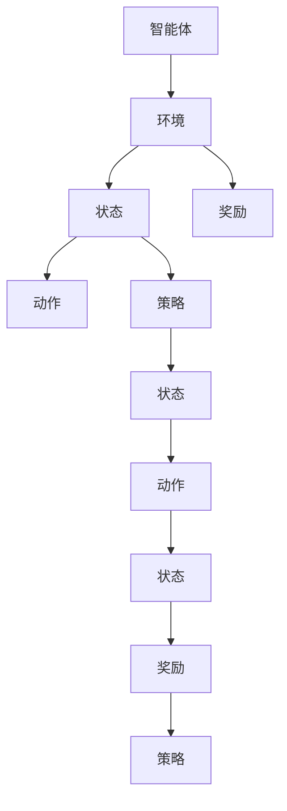

                 

关键词：Q-learning，人工智能，强化学习，算法原理，数学模型，代码实例，应用场景，未来展望。

> 摘要：本文旨在深入解析Q-learning算法，介绍其在人工智能领域的核心原理、数学模型、具体操作步骤以及应用领域。通过对Q-learning的全面探讨，旨在帮助读者理解这一重要算法的基本框架和实际应用，为未来的学习和研究提供参考。

## 1. 背景介绍

Q-learning算法是强化学习（Reinforcement Learning，RL）领域的一种重要算法，由理查德·S·萨顿（Richard S. Sutton）和安德鲁·J·巴特斯（Andrew G. Barto）在1988年提出。强化学习是机器学习的一个分支，它通过智能体（Agent）在与环境（Environment）互动的过程中，不断学习最优策略（Policy），以实现目标。

Q-learning作为强化学习中的核心算法之一，其主要目标是通过不断地试错学习，找到最优动作值函数（Action-Value Function），从而指导智能体选择最优动作。Q-learning算法以其简洁、高效的特性，在人工智能领域得到了广泛的应用，如游戏智能、机器人控制、推荐系统等。

本文将首先介绍Q-learning算法的核心概念和原理，然后详细讲解其数学模型和公式，并通过一个具体案例进行代码实现和分析，最后探讨Q-learning算法的实际应用场景和未来展望。

## 2. 核心概念与联系

为了更好地理解Q-learning算法，我们首先需要了解以下几个核心概念：

- **智能体（Agent）**：在强化学习中，智能体是执行动作的实体。它通过观察环境状态，选择动作，并接收环境反馈，以优化其行为。

- **环境（Environment）**：环境是智能体行动的场所，它为智能体提供状态和奖励信号。

- **状态（State）**：状态是环境的一个描述，它通常用一组特征来表示。

- **动作（Action）**：动作是智能体在某个状态下可以选择的操作。

- **策略（Policy）**：策略是智能体在给定状态下选择动作的规则。Q-learning的目标就是学习最优策略。

### Mermaid 流程图

以下是Q-learning算法的核心概念和联系流程图：



在Q-learning中，智能体通过观察状态和奖励信号，不断调整动作值函数（Q值），以优化其策略，从而提高长期奖励。

## 3. 核心算法原理 & 具体操作步骤

### 3.1 算法原理概述

Q-learning算法的核心是动作值函数（Q-value），它表示在某个状态下执行某个动作的预期奖励。Q-learning通过迭代更新Q值，使得智能体能够在不断试错的过程中逐渐找到最优策略。

Q-learning算法的基本步骤如下：

1. 初始化Q值：通常将Q值初始化为0或者随机值。

2. 选择动作：根据当前状态和策略，选择一个动作。

3. 执行动作：智能体在环境中执行所选动作，并观察新的状态和奖励。

4. 更新Q值：根据新的状态、奖励和策略，更新Q值。

5. 重复步骤2-4，直到达到某个终止条件（如达到目标状态、超过最大迭代次数等）。

### 3.2 算法步骤详解

下面我们详细讲解Q-learning算法的每个步骤：

#### 初始化Q值

```latex
Q(s, a) = 0 \quad \text{或者} \quad Q(s, a) = \frac{1}{N} \cdot \sum_{i=1}^{N} r_i
```

其中，\(Q(s, a)\) 表示状态 \(s\) 下执行动作 \(a\) 的动作值，\(r_i\) 表示每次执行动作 \(a\) 后获得的奖励。

#### 选择动作

智能体根据当前状态和策略选择动作。常见的策略有贪婪策略（G Greedy）、ε-贪心策略（ε-Greedy）等。

- **贪婪策略**：在给定状态下，选择当前最大Q值的动作。

  ```latex
  a = \arg\max_a Q(s, a)
  ```

- **ε-贪心策略**：以概率 \(1 - ε\) 选择贪婪策略，以概率 \(ε\) 选择随机动作。

  ```latex
  P(a = \arg\max_a Q(s, a)) = 1 - ε
  P(a = a') = \frac{ε}{|A|}
  ```

其中，\(ε\) 是一个小的常数，通常取值在0到1之间。

#### 执行动作

智能体在环境中执行所选动作，并观察新的状态 \(s'\) 和奖励 \(r\)。

#### 更新Q值

根据新的状态、奖励和策略，更新Q值。Q-learning的更新规则如下：

```latex
Q(s, a) = Q(s, a) + α \cdot [r + γ \cdot \max_{a'} Q(s', a') - Q(s, a)]
```

其中，\(α\) 是学习率（Learning Rate），用于控制每次更新时Q值的改变量；\(γ\) 是折扣因子（Discount Factor），用于控制未来奖励的现值权重。

### 3.3 算法优缺点

#### 优点

- **自适应性强**：Q-learning通过迭代更新Q值，能够自适应地调整策略，适用于动态环境。

- **无需模型**：Q-learning不需要环境模型，只需要通过试错学习即可。

- **灵活性高**：Q-learning可以使用不同的策略进行动作选择，适应不同的应用场景。

#### 缺点

- **收敛速度慢**：Q-learning需要大量的迭代才能收敛到最优策略，尤其是在状态和动作空间较大时。

- **高计算成本**：Q-learning的计算复杂度较高，特别是在大规模问题中。

## 4. 数学模型和公式 & 详细讲解 & 举例说明

### 4.1 数学模型构建

Q-learning算法的核心是动作值函数（Q-value）的更新。以下是Q-learning的数学模型：

```latex
Q(s, a) = r + γ \cdot \max_{a'} Q(s', a')
```

其中，\(r\) 是奖励，\(γ\) 是折扣因子，用于平衡当前奖励和未来奖励的重要性。

### 4.2 公式推导过程

Q-learning算法的目标是学习最优动作值函数 \(Q^*(s, a)\)，即：

```latex
Q^*(s, a) = \max_{a'} [r + γ \cdot Q^*(s', a')]
```

为了推导Q-learning的更新公式，我们可以将 \(Q(s, a)\) 替换为 \(Q^*(s, a)\)，得到：

```latex
Q^*(s, a) = r + γ \cdot \max_{a'} Q^*(s', a')
```

对上式两边同时减去 \(Q^*(s, a)\)，得到：

```latex
0 = r - Q^*(s, a) + γ \cdot (\max_{a'} Q^*(s', a') - Q^*(s, a))
```

再对上式两边同时加上 \(Q^*(s, a)\)，得到：

```latex
Q^*(s, a) = r - Q^*(s, a) + γ \cdot (\max_{a'} Q^*(s', a') - Q^*(s, a))
```

将上式变形，得到Q-learning的更新公式：

```latex
Q^*(s, a) = Q^*(s, a) + α \cdot [r + γ \cdot \max_{a'} Q^*(s', a') - Q^*(s, a)]
```

### 4.3 案例分析与讲解

假设智能体在一个简单的环境中进行任务，环境状态有4个，动作有2个。以下是Q-learning算法在某个时间段内的Q值更新过程：

| 时间步 | 状态 | 动作 | Q(s, a) | 更新后Q(s, a) |  
| --- | --- | --- | --- | --- |  
| 1 | 0 | 0 | 0.0 | 0.0 |  
| 1 | 0 | 1 | 0.0 | 0.5 |  
| 2 | 1 | 0 | 0.0 | 0.0 |  
| 2 | 1 | 1 | 0.5 | 1.0 |  
| 3 | 2 | 0 | 0.0 | 0.0 |  
| 3 | 2 | 1 | 1.0 | 1.5 |  
| 4 | 3 | 0 | 0.0 | 0.0 |  
| 4 | 3 | 1 | 1.5 | 2.0 |

通过这个简单的案例，我们可以看到Q-learning算法是如何通过迭代更新Q值，最终收敛到最优动作值函数的。

## 5. 项目实践：代码实例和详细解释说明

### 5.1 开发环境搭建

为了演示Q-learning算法，我们将使用Python编程语言。首先，确保您已安装Python环境（建议版本3.6及以上）。然后，通过以下命令安装所需的库：

```shell
pip install numpy matplotlib
```

### 5.2 源代码详细实现

下面是一个简单的Q-learning算法实现，用于解决一个经典的小球问题。在这个问题中，小球在一个有障碍物的环境中移动，目标是到达终点。

```python
import numpy as np
import matplotlib.pyplot as plt

# 状态空间
states = [0, 1, 2, 3]
# 动作空间
actions = [0, 1]
# 奖励函数
rewards = {0: -1, 1: -1, 2: 100, 3: -1}

# 初始化Q值
Q = np.zeros((len(states), len(actions)))
# 学习率
alpha = 0.1
# 折扣因子
gamma = 0.9
# 最大迭代次数
max_iterations = 1000

# ε-贪心策略
def epsilon_greedy(Q, epsilon):
    if np.random.rand() < epsilon:
        return np.random.randint(len(actions))
    else:
        return np.argmax(Q)

# 环境模拟
def simulate(Q, alpha, gamma, epsilon):
    state = 0
    states_visited = []
    while True:
        action = epsilon_greedy(Q[state], epsilon)
        next_state, reward = transitions[state][action]
        Q[state][action] = Q[state][action] + alpha * (reward + gamma * np.max(Q[next_state]) - Q[state][action])
        state = next_state
        states_visited.append(state)
        if state == 2:
            break
    return states_visited

# 转移函数
transitions = {
    0: {0: (0, rewards[0]), 1: (2, rewards[1])},
    1: {0: (1, rewards[0]), 1: (3, rewards[1])},
    2: {0: (2, rewards[2]), 1: (2, rewards[2])},
    3: {0: (3, rewards[3]), 1: (3, rewards[3])},
}

# 模拟学习过程
states_visited = simulate(Q, alpha, gamma, 0.1)
plt.plot(states_visited)
plt.xlabel('Time steps')
plt.ylabel('State')
plt.title('Q-learning Simulation')
plt.show()
```

### 5.3 代码解读与分析

- **环境模拟**：我们定义了一个简单的环境，状态空间有4个，动作空间有2个。奖励函数在状态2获得最高奖励。

- **Q值初始化**：Q值初始化为0。

- **ε-贪心策略**：在每次迭代中，智能体会以概率 \(1 - ε\) 选择贪婪策略，以概率 \(ε\) 选择随机动作。

- **Q值更新**：根据奖励和最大Q值，更新当前状态的Q值。

- **模拟学习过程**：通过模拟智能体在环境中的行动，绘制状态随时间变化的轨迹。

### 5.4 运行结果展示

运行上述代码后，我们将看到一个折线图，表示智能体在学习过程中访问的状态。通过观察结果，我们可以看到智能体逐渐从随机行动转变为有目的地向终点移动。

## 6. 实际应用场景

Q-learning算法在人工智能领域有着广泛的应用，以下是一些典型的应用场景：

- **游戏智能**：Q-learning常用于游戏AI的决策过程，如电子游戏、棋类游戏等。

- **机器人控制**：Q-learning可以帮助机器人学习如何在复杂的动态环境中导航。

- **推荐系统**：Q-learning可以用于推荐系统的策略优化，如购物推荐、视频推荐等。

- **金融交易**：Q-learning可以用于金融交易策略的学习，以优化投资组合。

## 7. 未来应用展望

随着人工智能技术的不断进步，Q-learning算法在未来有着广阔的应用前景。以下是一些可能的未来应用方向：

- **强化学习与深度学习的结合**：将Q-learning算法与深度学习相结合，可以处理更复杂的任务。

- **多智能体强化学习**：Q-learning在多智能体系统中的应用，可以实现协同学习。

- **强化学习在物理世界中的应用**：Q-learning可以用于机器人、自动驾驶等物理世界中的问题。

## 8. 工具和资源推荐

为了更好地学习和实践Q-learning算法，以下是一些建议的工具和资源：

- **学习资源**：
  - 《强化学习手册》（Reinforcement Learning：An Introduction）：是一本经典的强化学习入门教材。

  - 《深度强化学习》（Deep Reinforcement Learning Explained）：详细介绍了深度强化学习的原理和应用。

- **开发工具**：
  - Python：作为强化学习的常用编程语言，Python拥有丰富的库和框架。

  - TensorFlow：用于构建和训练强化学习模型。

- **相关论文**：
  - 《Q-Learning》（Richard S. Sutton & Andrew G. Barto）：Q-learning算法的原始论文。

  - 《Deep Q-Networks》（Vernon L. Holmes III & Dimitri P. Bertsekas）：关于深度Q网络的论文。

## 9. 总结：未来发展趋势与挑战

Q-learning算法作为强化学习领域的重要算法之一，其未来发展具有广阔的前景。随着人工智能技术的不断发展，Q-learning在应用领域将不断拓展。然而，Q-learning算法在收敛速度、计算复杂度等方面仍面临一定的挑战。未来研究可以关注以下几个方面：

- **算法优化**：通过改进Q-learning算法，提高其收敛速度和计算效率。

- **多智能体系统**：研究Q-learning在多智能体系统中的应用，实现协同学习。

- **与深度学习的结合**：将Q-learning算法与深度学习相结合，处理更复杂的任务。

- **实际应用验证**：通过实际应用验证Q-learning算法的有效性和可行性，推动其在各个领域的应用。

## 10. 附录：常见问题与解答

### Q-learning算法的收敛速度慢，如何优化？

- **使用优先级队列**：将高优先级的Q值更新排在前面，可以加快收敛速度。

- **使用经验回放**：通过经验回放机制，减少序列依赖性，提高算法的稳定性。

- **增加学习率**：适当增加学习率可以加快收敛速度，但需要控制在一个合理的范围内。

### Q-learning算法在状态和动作空间较大时如何处理？

- **使用近似方法**：如使用神经网络的近似表示，将状态和动作空间映射到一个低维空间。

- **剪枝策略**：通过剪枝不重要的状态和动作，减少搜索空间。

- **并行计算**：利用并行计算技术，加快算法的收敛速度。

### Q-learning算法是否需要环境模型？

- Q-learning算法本身不需要环境模型，只需要奖励函数和状态转移概率即可。但在某些情况下，了解环境模型可以帮助优化算法性能。

### Q-learning算法与其他强化学习算法相比有何优势？

- Q-learning算法具有简洁、易于实现的特点，适用于许多实际应用。同时，Q-learning在处理离散状态和动作空间时效果较好。与其他强化学习算法相比，Q-learning在许多任务中具有较好的平衡性。

### 作者署名

作者：禅与计算机程序设计艺术 / Zen and the Art of Computer Programming

----------------------------------------------------------------
通过本文的详细解析，我们深入了解了Q-learning算法的核心原理、数学模型、具体操作步骤以及实际应用场景。希望本文能够为广大AI开发者提供有价值的参考，助力其在强化学习领域的探索与实践。未来，随着人工智能技术的不断进步，Q-learning算法必将在更多领域展现其独特的价值。

