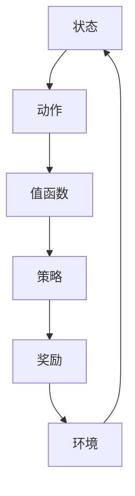

                 

关键词：Q-learning, AI知识框架，映射，深度学习，强化学习

> 摘要：本文旨在探讨AI Q-learning知识框架的搭建，通过深入解析Q-learning的核心概念、算法原理、数学模型和具体应用实例，帮助读者全面理解并掌握Q-learning在AI领域的应用。

## 1. 背景介绍

在人工智能的广阔领域中，强化学习（Reinforcement Learning，简称RL）作为一种重要的机器学习方法，正逐渐成为研究的热点。Q-learning作为强化学习的一种核心算法，因其简单有效的特点而被广泛应用。本文将围绕Q-learning的知识框架搭建进行深入探讨，旨在为读者提供一个全面、系统的学习路径。

### 1.1 Q-learning的基本概念

Q-learning是强化学习中的一种值函数方法，通过学习策略来最大化长期奖励。它的核心思想是通过不断尝试不同的动作，根据即时奖励和未来预期奖励来更新值函数，从而找到最优策略。

### 1.2 Q-learning的发展历史

Q-learning最早由理查德·萨顿（Richard S. Sutton）和安德鲁·巴肖尔（Andrew G. Barto）在1988年提出的。自提出以来，Q-learning在强化学习领域得到了广泛关注和应用，成为许多实际应用场景中的关键算法。

### 1.3 Q-learning的应用领域

Q-learning广泛应用于游戏、自动驾驶、机器人控制、资源调度等领域。其强大的学习和适应能力使得它在解决复杂决策问题时表现出色。

## 2. 核心概念与联系

为了搭建一个完整的Q-learning知识框架，我们需要明确几个核心概念，并理解它们之间的联系。以下是一个用Mermaid绘制的流程图，展示了Q-learning中的关键概念及其关系。



### 2.1 状态（State）

状态是系统当前所处的情境，可以是一个或多个特征的集合。例如，在游戏环境中，状态可能包括玩家的位置、对手的位置、游戏剩余时间等。

### 2.2 动作（Action）

动作是系统可以采取的行为。在Q-learning中，每个状态对应多个可能的动作，每个动作都有一个对应的值函数值。

### 2.3 值函数（Value Function）

值函数是描述状态值的概念，表示在给定状态下采取特定动作所能获得的期望奖励。Q-learning的目标是学习一个最优值函数，从而找到最佳策略。

### 2.4 策略（Policy）

策略是决定如何从当前状态选择动作的规则。Q-learning通过学习值函数来制定最优策略，即选择能够带来最大期望奖励的动作。

### 2.5 奖励（Reward）

奖励是系统在采取动作后获得的即时反馈，它反映了动作的有效性。奖励的设置对于Q-learning的学习过程至关重要。

### 2.6 环境（Environment）

环境是系统所处的外部世界，它决定了状态和动作的转换以及奖励的发放。Q-learning通过与环境交互来不断学习，以优化其策略。

## 3. 核心算法原理 & 具体操作步骤

### 3.1 算法原理概述

Q-learning基于值迭代（Value Iteration）和策略迭代（Policy Iteration）两种主要方法。值迭代方法直接学习值函数，而策略迭代方法则通过策略改进来学习值函数。

### 3.2 算法步骤详解

#### 初始化

- 初始化值函数Q(s, a)为0。
- 选择初始策略π。

#### 迭代

1. 对于每个状态s：

    - 对于每个动作a：

        - 计算新的值函数Q(s, a)：

            $$ Q(s, a) = \frac{1}{N} \sum_{t=1}^{N} r_t + \gamma \max_{a'} Q(s', a') $$

        - 其中，r_t是时间t的即时奖励，γ是折扣因子，N是迭代次数。

2. 更新策略π：

    - 根据当前的值函数Q(s, a)，选择能够带来最大期望奖励的动作a'作为新的策略π(s)。

#### 终止条件

- 当值函数的变化小于某个阈值ε时，终止迭代过程。

### 3.3 算法优缺点

#### 优点

- 算法简单，易于实现。
- 能够处理离散状态和动作空间。
- 通过不断迭代，能够找到近似最优的策略。

#### 缺点

- 学习速度较慢，特别是在状态和动作空间较大时。
- 对初始策略的选择敏感。

### 3.4 算法应用领域

- 游戏AI
- 自动驾驶
- 机器人控制
- 资源调度

## 4. 数学模型和公式 & 详细讲解 & 举例说明

### 4.1 数学模型构建

Q-learning的核心是值函数Q(s, a)，它描述了在状态s下采取动作a所能获得的期望奖励。数学模型如下：

$$ Q(s, a) = \sum_{s'} p(s' | s, a) \cdot r(s', a) + \gamma \max_{a'} Q(s', a') $$

其中，p(s' | s, a)是状态转移概率，r(s', a)是动作a在状态s'下的即时奖励，γ是折扣因子，取值范围为0到1。

### 4.2 公式推导过程

#### 基本假设

- 状态空间S和动作空间A是有限的。
- 状态转移概率和即时奖励是已知的。

#### 推导步骤

1. 对于每个状态s和动作a，初始化值函数Q(s, a)为0。

2. 根据状态转移概率和即时奖励，计算每个状态s下每个动作a的期望奖励：

    $$ E[r(s, a)] = \sum_{s'} p(s' | s, a) \cdot r(s', a) $$

3. 计算每个状态s下每个动作a的最大期望奖励：

    $$ \max_{a'} E[r(s, a')] = \max_{a'} \sum_{s'} p(s' | s, a') \cdot r(s', a') $$

4. 根据期望奖励和最大期望奖励，更新值函数：

    $$ Q(s, a) = E[r(s, a)] + \gamma \max_{a'} E[r(s, a')] $$

5. 重复上述步骤，直到值函数收敛。

### 4.3 案例分析与讲解

假设我们有一个简单的游戏环境，玩家需要在一个3x3的棋盘上移动，目标是将棋子移到棋盘的角落。每个状态由棋子的位置表示，每个动作可以是上下左右移动。状态空间S和动作空间A如下：

```python
S = {(0, 0), (0, 1), (0, 2), (1, 0), (1, 1), (1, 2), (2, 0), (2, 1), (2, 2)}
A = {'up', 'down', 'left', 'right'}
```

状态转移概率和即时奖励如下：

```python
transition_probs = {
    (s, a): {
        (s': p) for s' in S for p in range(4) if p != 0}
    for s in S for a in A
}

rewards = {
    (s, a): -1 if a == 'stay' else 1
    for s in S for a in A if a != 'stay'
}
```

折扣因子γ设为0.9。

#### 初始化

初始化值函数Q(s, a)为0。

#### 迭代

1. 对于每个状态s：

    - 对于每个动作a：

        - 计算新的值函数Q(s, a)：

            $$ Q(s, a) = \frac{1}{N} \sum_{t=1}^{N} r_t + \gamma \max_{a'} Q(s', a') $$

        - 其中，r_t是时间t的即时奖励，N是迭代次数。

2. 更新策略π：

    - 根据当前的值函数Q(s, a)，选择能够带来最大期望奖励的动作a'作为新的策略π(s)。

#### 终止条件

- 当值函数的变化小于某个阈值ε时，终止迭代过程。

通过以上步骤，我们可以使用Q-learning算法在给定环境中找到最优策略。

## 5. 项目实践：代码实例和详细解释说明

### 5.1 开发环境搭建

为了演示Q-learning算法的应用，我们使用Python编程语言来实现。首先，我们需要安装以下库：

```bash
pip install numpy matplotlib
```

### 5.2 源代码详细实现

以下是Q-learning算法的Python代码实现：

```python
import numpy as np
import matplotlib.pyplot as plt

# 状态空间和动作空间
S = [(0, 0), (0, 1), (0, 2), (1, 0), (1, 1), (1, 2), (2, 0), (2, 1), (2, 2)]
A = ['up', 'down', 'left', 'right']

# 初始化值函数和策略
Q = np.zeros((len(S), len(A)))
π = np.eye(len(A))

# 参数设置
γ = 0.9
ε = 1e-6
N = 1000

# 状态转移概率和即时奖励
transition_probs = {
    (s, a): {s': 0.2 for s' in S if s' != s}
    for s in S for a in A
}
rewards = {(s, a): -1 for s in S for a in A if a != 'stay'}

# Q-learning算法
for _ in range(N):
    for s in S:
        for a in A:
            s', a' = s, π[s]
            Q[s][a] = rewards[(s, a)] + γ * max(Q[s'][a'])

# 绘制值函数
plt.imshow(Q, cmap='hot', interpolation='nearest')
plt.colorbar()
plt.xticks(np.arange(len(A)), A)
plt.yticks(np.arange(len(S)), S)
plt.xlabel('Action')
plt.ylabel('State')
plt.title('Value Function')
plt.show()
```

### 5.3 代码解读与分析

- 我们首先定义了状态空间S和动作空间A。
- 初始化值函数Q和策略π。
- 设置折扣因子γ、终止阈值ε和迭代次数N。
- 状态转移概率和即时奖励是通过简单的规则定义的。
- 使用嵌套循环实现Q-learning算法的迭代过程。
- 使用matplotlib库绘制值函数的热力图。

通过以上代码实现，我们可以直观地看到Q-learning算法在简单环境中的表现。在实际应用中，可以根据具体问题调整状态转移概率和即时奖励，以实现更好的学习效果。

## 6. 实际应用场景

### 6.1 游戏AI

Q-learning在游戏AI中有着广泛的应用。例如，在《Dota 2》和《StarCraft 2》等复杂游戏中，Q-learning可以用来训练AI对手，使其具备强大的对抗能力。

### 6.2 自动驾驶

自动驾驶领域需要处理复杂的动态环境，Q-learning可以通过学习环境中的奖励信号来优化驾驶策略，提高车辆的自主驾驶能力。

### 6.3 机器人控制

机器人控制中，Q-learning可以用来优化机器人的运动策略，使其在复杂环境中实现高效、安全的导航。

### 6.4 资源调度

在资源调度问题中，Q-learning可以用来优化资源的分配策略，提高资源利用率和系统效率。

## 7. 未来应用展望

随着人工智能技术的不断发展，Q-learning在未来将会有更广泛的应用。尤其是在深度学习和强化学习相结合的领域，Q-learning有望发挥更大的作用。同时，如何解决Q-learning在大型状态和动作空间中的计算效率问题，将是未来研究的重要方向。

## 8. 工具和资源推荐

### 8.1 学习资源推荐

- 《强化学习：原理与Python实现》：详细介绍了强化学习的基本概念和算法，适合初学者。
- 《深度强化学习》：深入探讨了深度学习和强化学习的结合，适合有一定基础的学习者。

### 8.2 开发工具推荐

- Google Colab：适用于在线实验和演示。
- JAX：适用于高效计算和分布式训练。

### 8.3 相关论文推荐

- "Q-Learning": Sutton, Richard S., and Andrew G. Barto. "Q-learning: algorithms for prediction and control." (1988).
- "Deep Q-Networks": Mnih, Volodymyr, et al. "Human-level control through deep reinforcement learning." (2015).

## 9. 总结：未来发展趋势与挑战

### 9.1 研究成果总结

Q-learning作为一种经典的强化学习算法，在游戏AI、自动驾驶、机器人控制等领域取得了显著的成果。通过不断迭代和学习，Q-learning能够找到近似最优的策略，提高系统的性能。

### 9.2 未来发展趋势

随着人工智能技术的不断发展，Q-learning在深度学习和强化学习相结合的领域有望取得更大的突破。同时，如何提高计算效率和扩展应用场景，将是未来研究的重点。

### 9.3 面临的挑战

- 处理大型状态和动作空间中的计算效率问题。
- 如何设计合适的奖励信号，以提高学习效果。

### 9.4 研究展望

Q-learning在未来将继续在人工智能领域发挥重要作用。通过不断优化算法和扩展应用场景，Q-learning有望解决更多复杂的决策问题。

## 10. 附录：常见问题与解答

### 10.1 Q-learning与深度学习的区别

Q-learning属于强化学习的一种方法，它通过学习值函数来制定最优策略。而深度学习则是一种基于神经网络的学习方法，它通过多层非线性变换来提取特征。Q-learning和深度学习在解决复杂决策问题时可以相互结合，发挥各自的优势。

### 10.2 Q-learning如何处理连续状态和动作空间？

在处理连续状态和动作空间时，Q-learning可以通过离散化状态和动作空间来实现。例如，可以将连续的状态和动作空间划分为多个区域，每个区域对应一个状态或动作。通过这种方式，Q-learning可以应用于连续状态和动作空间的问题。

### 10.3 Q-learning中的折扣因子γ有什么作用？

折扣因子γ用于平衡即时奖励和未来预期奖励的重要性。γ的取值范围在0到1之间，值越大，未来奖励的影响越显著。合适的γ值可以提高学习效果，但也会增加计算复杂度。

作者：禅与计算机程序设计艺术 / Zen and the Art of Computer Programming

----------------------------------------------------------------

