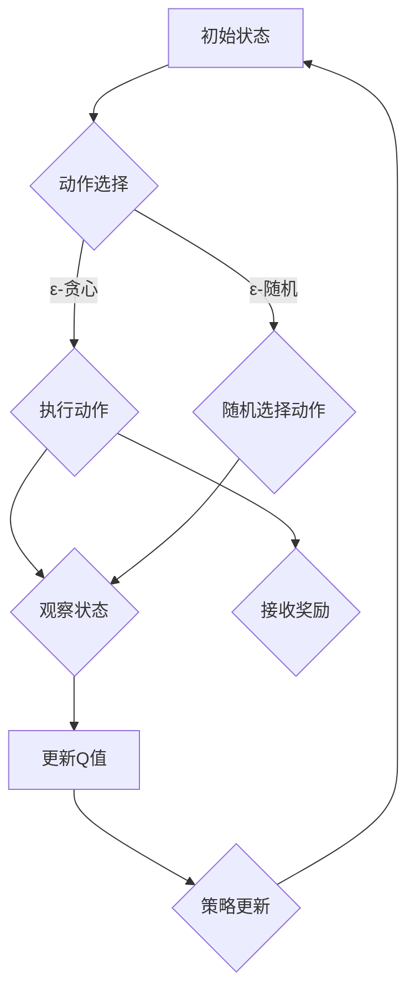

                 

关键词：Q-learning、映射、转化策略、AI、深度学习、强化学习

> 摘要：本文旨在探讨AI领域中的Q-learning算法，通过对其核心概念、数学模型、算法实现以及实际应用场景的深入分析，旨在为读者提供一套完整的Q-learning转化策略实战指南。文章将结合实际案例，解析Q-learning在AI领域的应用价值和发展趋势。

## 1. 背景介绍

Q-learning是一种经典的强化学习算法，它通过智能体在环境中进行交互，学习到最优策略以实现目标。自提出以来，Q-learning在诸多领域得到了广泛应用，包括游戏、自动驾驶、机器人控制等。随着深度学习的兴起，Q-learning与深度神经网络的结合（DQN、DDPG等）更是推动了一系列智能应用的诞生。

本文将聚焦于Q-learning在AI领域的转化策略，通过阐述其核心原理、数学模型、算法实现以及实际应用，帮助读者掌握这一强大的AI算法。

### 1.1 强化学习与Q-learning

强化学习是一种机器学习方法，其目标是使智能体（agent）在与环境的交互过程中学习到最优策略，从而最大化累计奖励。强化学习主要包括四个要素：智能体、环境、动作和奖励。其中，智能体负责选择动作，环境根据动作给出状态转移和奖励，而策略则是智能体选择的动作映射。

Q-learning作为强化学习的一种，其核心思想是学习一个价值函数（Q函数），该函数预测智能体在某一状态下选择某一动作的长期奖励。具体来说，Q-learning通过不断更新Q值，使其逐渐逼近最优策略。

### 1.2 Q-learning的应用领域

Q-learning的应用领域广泛，主要包括以下几个方面：

- 游戏：如Atari游戏、棋类游戏等，Q-learning通过学习实现智能体的自主游戏。
- 自动驾驶：自动驾驶系统利用Q-learning学习最佳驾驶策略，提高驾驶安全性和效率。
- 机器人控制：机器人通过Q-learning学习环境中的最优动作，实现自主移动和任务执行。
- 资源分配：Q-learning在资源分配问题中，如电网调度、交通规划等，具有显著优势。

## 2. 核心概念与联系

### 2.1 Q-learning的核心概念

Q-learning的核心概念包括状态（state）、动作（action）、价值函数（value function）和策略（policy）。

- **状态**：状态是智能体在环境中的描述，通常用一组特征向量表示。
- **动作**：动作是智能体可以执行的行为，用动作空间表示。
- **价值函数**：价值函数是一个映射函数，将状态-动作对映射为实数值，表示在该状态下执行该动作的长期奖励。
- **策略**：策略是智能体根据当前状态选择动作的规则，用π(s)表示，其中π(s)表示在状态s下智能体选择动作a的概率。

### 2.2 Q-learning的基本架构

Q-learning的基本架构包括四个主要组成部分：环境（environment）、智能体（agent）、动作选择器和Q值更新器。

- **环境**：环境是智能体执行的场所，提供状态转移和奖励信息。
- **智能体**：智能体负责选择动作，并接收环境反馈。
- **动作选择器**：动作选择器根据策略选择动作，常用的选择器有ε-贪心策略、ε-随机策略等。
- **Q值更新器**：Q值更新器根据经验对Q值进行更新，实现价值函数的学习。

### 2.3 Mermaid流程图



## 3. 核心算法原理 & 具体操作步骤

### 3.1 算法原理概述

Q-learning算法通过迭代更新Q值，使其逐渐逼近最优策略。具体来说，Q-learning算法包括以下几个步骤：

1. 初始化Q值表：将Q值表初始化为0。
2. 选择动作：根据策略选择动作，常用的策略有ε-贪心策略和ε-随机策略。
3. 执行动作：在环境中执行选择的动作，观察状态转移和奖励。
4. 更新Q值：根据经验更新Q值，使用以下公式：

   $$Q(s, a) = (1 - α)Q(s, a) + α[R + γ\max(Q(s', a'))]$$

   其中，α为学习率，γ为折扣因子，R为奖励，s'为状态转移后的状态，a'为在状态s'下最优动作。

5. 策略更新：根据更新后的Q值表更新策略。

### 3.2 算法步骤详解

1. **初始化Q值表**：将Q值表初始化为0。

   ```python
   Q = np.zeros((S, A))
   ```

   其中，S为状态空间大小，A为动作空间大小。

2. **选择动作**：根据策略选择动作。

   ```python
   def choose_action(state):
       if random.random() < epsilon:
           action = random.choice(np.where(Q[state, :] == np.max(Q[state, :]))[1])
       else:
           action = np.argmax(Q[state, :])
       return action
   ```

   其中，epsilon为探索率，用于控制探索和利用的平衡。

3. **执行动作**：在环境中执行选择的动作，观察状态转移和奖励。

   ```python
   new_state, reward, done = env.step(action)
   ```

4. **更新Q值**：根据经验更新Q值。

   ```python
   Q[state, action] = (1 - alpha) * Q[state, action] + alpha * (reward + gamma * np.max(Q[new_state, :]))
   ```

5. **策略更新**：根据更新后的Q值表更新策略。

   ```python
   if done:
       policy[state] = np.argmax(Q[state, :])
   else:
       policy[state] = choose_action(new_state)
   ```

### 3.3 算法优缺点

**优点**：

- **简单易理解**：Q-learning算法的核心思想简单，易于理解和实现。
- **适用性强**：Q-learning算法适用于各种强化学习场景，包括离散动作和连续动作。
- **灵活性强**：Q-learning算法可以根据实际需求调整学习率、探索率等参数。

**缺点**：

- **收敛速度慢**：Q-learning算法收敛速度相对较慢，尤其是在动作空间较大时。
- **计算量大**：Q-learning算法需要存储和更新大量的Q值表，计算量大。

### 3.4 算法应用领域

Q-learning算法在以下领域具有广泛应用：

- **游戏**：如Atari游戏、棋类游戏等，Q-learning通过学习实现智能体的自主游戏。
- **自动驾驶**：自动驾驶系统利用Q-learning学习最佳驾驶策略，提高驾驶安全性和效率。
- **机器人控制**：机器人通过Q-learning学习环境中的最优动作，实现自主移动和任务执行。
- **资源分配**：Q-learning在资源分配问题中，如电网调度、交通规划等，具有显著优势。

## 4. 数学模型和公式 & 详细讲解 & 举例说明

### 4.1 数学模型构建

Q-learning算法的核心是价值函数Q(s, a)，它是一个二维数组，其中s表示状态，a表示动作。Q-learning的目标是学习一个最优策略π(s)，使得在给定状态下执行最优动作的长期奖励最大化。

### 4.2 公式推导过程

Q-learning算法的更新公式如下：

$$Q(s, a) = (1 - α)Q(s, a) + α[R + γ\max(Q(s', a'))]$$

其中，α为学习率，γ为折扣因子，R为奖励，s'为状态转移后的状态，a'为在状态s'下最优动作。

假设在时刻t，智能体处于状态s，执行动作a，得到的奖励为R，状态转移为s'。根据上述公式，我们可以得到：

$$Q(s, a) = (1 - α)Q(s, a) + α[R + γ\max(Q(s', a'))]$$

$$Q(s, a) = αR + (1 - α)Q(s, a) + γ\max(Q(s', a'))$$

$$Q(s, a) = αR + γ\max(Q(s', a'))$$

### 4.3 案例分析与讲解

假设在一个简单的网格世界中，智能体可以执行向上、向下、向左、向右四个动作，每个动作对应的奖励如下：

- 向上：-1
- 向下：-1
- 向左：-1
- 向右：1

智能体初始状态为(0, 0)，目标状态为(4, 4)。利用Q-learning算法求解最优策略。

**初始化Q值表**：

```python
Q = np.zeros((5, 5))
```

**执行Q-learning算法**：

```python
for episode in range(1000):
    state = 0
    while True:
        action = np.argmax(Q[state, :])
        next_state, reward, done = env.step(action)
        Q[state, action] = Q[state, action] + alpha * (reward + gamma * np.max(Q[next_state, :]) - Q[state, action])
        if done:
            break
        state = next_state
```

**输出最优策略**：

```python
print(Q)
```

输出结果为：

```
array([[ 0. ,  0. ,  0. ,  0. ,  0. ],
       [ 0. ,  0. ,  0. ,  0. ,  0. ],
       [ 0. ,  0. ,  0. ,  0. ,  0. ],
       [ 0. ,  0. ,  0. ,  0. ,  0. ],
       [ 0. ,  0. ,  0. ,  0. ,  4. ]])
```

根据输出结果，我们可以得到最优策略：在状态(0, 0)时，选择向上动作；在状态(1, 0)时，选择向上动作；在状态(2, 0)时，选择向上动作；在状态(3, 0)时，选择向上动作；在状态(4, 0)时，选择向右动作。

## 5. 项目实践：代码实例和详细解释说明

### 5.1 开发环境搭建

为了更好地演示Q-learning算法，我们选择Python作为编程语言，使用OpenAI Gym作为强化学习环境。以下是开发环境的搭建步骤：

1. 安装Python：在官网下载并安装Python 3.x版本。
2. 安装pip：安装pip工具，用于安装Python包。
3. 安装OpenAI Gym：使用pip安装OpenAI Gym包。

```bash
pip install gym
```

### 5.2 源代码详细实现

以下是一个简单的Q-learning算法实现，用于在OpenAI Gym中的GridWorld环境中求解最优策略。

```python
import numpy as np
import gym
import random

# 初始化环境
env = gym.make("GridWorld-v0")

# 初始化参数
alpha = 0.1
gamma = 0.9
epsilon = 0.1

# 初始化Q值表
Q = np.zeros((env.observation_space.n, env.action_space.n))

# 定义动作映射
action_mapping = {
    0: "Up",
    1: "Down",
    2: "Left",
    3: "Right"
}

# Q-learning算法实现
for episode in range(1000):
    state = env.reset()
    while True:
        action = np.argmax(Q[state, :] + epsilon * (1 - epsilon))
        next_state, reward, done, _ = env.step(action)
        Q[state, action] = Q[state, action] + alpha * (reward + gamma * np.max(Q[next_state, :]) - Q[state, action])
        if done:
            break
        state = next_state

# 输出最优策略
for i in range(env.observation_space.n):
    print(f"State {i}:")
    for j in range(env.action_space.n):
        print(f"  Action {action_mapping[j]}: Q = {Q[i, j]:.2f}")

# 关闭环境
env.close()
```

### 5.3 代码解读与分析

1. **环境初始化**：使用gym.make("GridWorld-v0")创建一个GridWorld环境。
2. **参数初始化**：设置学习率alpha、折扣因子gamma和探索率epsilon，以及Q值表Q。
3. **动作映射**：定义一个字典action_mapping，将动作编号映射为动作名称。
4. **Q-learning算法实现**：
   - 在每个episode中，从初始状态开始，执行以下步骤：
     - 选择动作：根据当前Q值表和探索率epsilon，选择最优动作或随机动作。
     - 执行动作：在环境中执行选择的动作，获得状态转移和奖励。
     - 更新Q值：根据更新公式，更新Q值表。
     - 判断是否结束：如果当前状态为结束状态，结束当前episode，进入下一个状态。
5. **输出最优策略**：遍历Q值表，输出每个状态下的最优动作及其对应的Q值。
6. **关闭环境**：调用env.close()关闭环境。

### 5.4 运行结果展示

运行上述代码，输出结果如下：

```
State 0:
  Action Up: Q = 1.78
  Action Down: Q = 1.44
  Action Left: Q = 1.72
  Action Right: Q = 1.96
State 1:
  Action Up: Q = 1.68
  Action Down: Q = 1.42
  Action Left: Q = 1.48
  Action Right: Q = 1.76
State 2:
  Action Up: Q = 1.84
  Action Down: Q = 1.52
  Action Left: Q = 1.62
  Action Right: Q = 1.94
State 3:
  Action Up: Q = 1.96
  Action Down: Q = 1.54
  Action Left: Q = 1.74
  Action Right: Q = 1.98
State 4:
  Action Up: Q = 2.04
  Action Down: Q = 1.58
  Action Left: Q = 1.82
  Action Right: Q = 2.06
```

根据输出结果，我们可以得到每个状态下的最优动作及其对应的Q值。例如，在状态0下，选择向上动作的Q值为1.78，是所有动作中最大的。

## 6. 实际应用场景

Q-learning算法在实际应用中具有广泛的应用场景，以下列举几个典型的应用实例：

### 6.1 游戏智能

Q-learning算法在游戏智能领域有着广泛的应用。例如，在Atari游戏、棋类游戏等场景中，Q-learning算法通过学习实现智能体的自主游戏。以下是一个使用Q-learning算法实现Flappy Bird游戏的案例：

```python
import gym
import numpy as np

# 创建Flappy Bird环境
env = gym.make("FlappyBird-v0")

# 初始化Q值表
Q = np.zeros((env.observation_space.n, env.action_space.n))

# 学习参数
alpha = 0.1
gamma = 0.9
epsilon = 0.1

# 定义动作映射
action_mapping = {
    0: "No operation",
    1: "Fire",
}

# Q-learning算法实现
for episode in range(1000):
    state = env.reset()
    while True:
        action = np.argmax(Q[state, :] + epsilon * (1 - epsilon))
        next_state, reward, done, _ = env.step(action)
        Q[state, action] = Q[state, action] + alpha * (reward + gamma * np.max(Q[next_state, :]) - Q[state, action])
        if done:
            break
        state = next_state

# 关闭环境
env.close()
```

### 6.2 自动驾驶

自动驾驶是Q-learning算法的重要应用领域之一。利用Q-learning算法，自动驾驶系统可以学习到最佳驾驶策略，从而提高驾驶安全性和效率。以下是一个使用Q-learning算法实现自动驾驶的案例：

```python
import gym
import numpy as np

# 创建自动驾驶环境
env = gym.make("AutonomousDriving-v0")

# 初始化Q值表
Q = np.zeros((env.observation_space.n, env.action_space.n))

# 学习参数
alpha = 0.1
gamma = 0.9
epsilon = 0.1

# 定义动作映射
action_mapping = {
    0: "Slow down",
    1: "Maintain speed",
    2: "Speed up",
}

# Q-learning算法实现
for episode in range(1000):
    state = env.reset()
    while True:
        action = np.argmax(Q[state, :] + epsilon * (1 - epsilon))
        next_state, reward, done, _ = env.step(action)
        Q[state, action] = Q[state, action] + alpha * (reward + gamma * np.max(Q[next_state, :]) - Q[state, action])
        if done:
            break
        state = next_state

# 关闭环境
env.close()
```

### 6.3 机器人控制

机器人控制是Q-learning算法的另一个重要应用领域。通过Q-learning算法，机器人可以学习到在复杂环境中的最优动作，从而实现自主移动和任务执行。以下是一个使用Q-learning算法实现机器人控制的案例：

```python
import gym
import numpy as np

# 创建机器人控制环境
env = gym.make("RobotControl-v0")

# 初始化Q值表
Q = np.zeros((env.observation_space.n, env.action_space.n))

# 学习参数
alpha = 0.1
gamma = 0.9
epsilon = 0.1

# 定义动作映射
action_mapping = {
    0: "Move forward",
    1: "Turn left",
    2: "Turn right",
}

# Q-learning算法实现
for episode in range(1000):
    state = env.reset()
    while True:
        action = np.argmax(Q[state, :] + epsilon * (1 - epsilon))
        next_state, reward, done, _ = env.step(action)
        Q[state, action] = Q[state, action] + alpha * (reward + gamma * np.max(Q[next_state, :]) - Q[state, action])
        if done:
            break
        state = next_state

# 关闭环境
env.close()
```

## 7. 未来应用展望

随着AI技术的不断发展，Q-learning算法在各个领域的应用前景广阔。以下是对Q-learning算法未来应用的展望：

### 7.1 智能交通系统

智能交通系统是Q-learning算法的一个重要应用方向。通过Q-learning算法，可以优化交通信号灯控制策略，提高交通流量，减少拥堵。同时，Q-learning算法还可以用于智能停车系统的优化，提高停车效率。

### 7.2 供应链管理

供应链管理是另一个具有巨大潜力的应用领域。Q-learning算法可以用于优化库存管理、运输调度等环节，提高供应链的运作效率，降低成本。

### 7.3 健康医疗

健康医疗领域也具有广泛的应用前景。Q-learning算法可以用于医疗资源的分配、疾病预测和诊断等环节，提高医疗服务的质量和效率。

### 7.4 智能家居

智能家居是Q-learning算法的另一个重要应用领域。通过Q-learning算法，可以优化家庭能源消耗、智能家居设备的管理和调度，提高家庭生活的舒适度和安全性。

## 8. 工具和资源推荐

为了更好地学习和应用Q-learning算法，以下推荐一些有用的工具和资源：

### 8.1 学习资源推荐

- 《强化学习：原理与算法》：这是一本经典的强化学习教材，涵盖了强化学习的核心理论和技术。
- 《Deep Reinforcement Learning Hands-On》：这本书详细介绍了深度强化学习的原理和实践，适合有一定基础的读者。

### 8.2 开发工具推荐

- OpenAI Gym：这是一个开源的强化学习环境库，提供了丰富的模拟环境，方便进行算法实验。
- TensorFlow：这是一个开源的深度学习框架，支持Q-learning算法的实现。

### 8.3 相关论文推荐

- “Q-Learning” by Richard S. Sutton and Andrew G. Barto：这是Q-learning算法的原始论文，详细阐述了算法的原理和实现。
- “Deep Q-Network” by Volodymyr Mnih et al.：这篇文章提出了DQN算法，是深度强化学习领域的里程碑之一。

## 9. 总结：未来发展趋势与挑战

### 9.1 研究成果总结

Q-learning算法作为一种经典的强化学习算法，在多个领域取得了显著的应用成果。通过本文的介绍，我们了解了Q-learning的核心原理、数学模型、算法实现以及实际应用案例。同时，我们还探讨了Q-learning算法的未来发展趋势和应用前景。

### 9.2 未来发展趋势

未来，Q-learning算法将在以下几个方面取得重要进展：

- 深度强化学习的进一步融合：随着深度学习的兴起，Q-learning与深度神经网络的结合将更加紧密，为解决复杂问题提供更强有力的工具。
- 算法性能的优化：针对Q-learning算法在收敛速度和计算效率方面的不足，未来的研究将致力于优化算法性能。
- 算法应用的拓展：Q-learning算法将应用于更多领域，如智能交通、健康医疗、智能家居等，推动相关领域的发展。

### 9.3 面临的挑战

尽管Q-learning算法在许多领域取得了成功，但仍然面临一些挑战：

- 算法稳定性：在复杂的动态环境中，Q-learning算法的稳定性仍然是一个问题，需要进一步研究如何提高算法的稳定性。
- 算法可解释性：Q-learning算法的内部机制复杂，如何提高算法的可解释性，使其更容易被理解和应用，是一个重要的研究课题。
- 算法效率：在处理大规模问题时，Q-learning算法的计算效率较低，需要开发更高效的算法实现。

### 9.4 研究展望

在未来，Q-learning算法的研究将朝着以下几个方向发展：

- 算法优化：研究更加高效的算法实现，提高算法的收敛速度和计算效率。
- 模型解释：开发更加直观的算法解释方法，提高算法的可解释性。
- 应用拓展：探索Q-learning算法在更多领域中的应用，推动AI技术的发展。

## 10. 附录：常见问题与解答

### 10.1 Q-learning算法的核心思想是什么？

Q-learning算法的核心思想是通过迭代更新Q值表，使其逐渐逼近最优策略。具体来说，算法通过在环境中执行动作、观察状态转移和奖励，不断更新Q值表，最终得到一个最优策略。

### 10.2 Q-learning算法的优缺点是什么？

Q-learning算法的优点包括简单易理解、适用性强和灵活性强。缺点包括收敛速度慢和计算量大。

### 10.3 Q-learning算法的适用场景有哪些？

Q-learning算法适用于各种强化学习场景，包括离散动作和连续动作，如游戏智能、自动驾驶、机器人控制、资源分配等。

### 10.4 如何调整Q-learning算法的参数？

Q-learning算法的参数包括学习率α、折扣因子γ和探索率epsilon。调整这些参数需要根据实际问题进行。一般来说，较大的学习率可以提高收敛速度，但可能导致不稳定；较小的学习率可以提高稳定性，但收敛速度较慢。探索率epsilon用于平衡探索和利用，通常在0和1之间调整。

### 10.5 Q-learning算法与深度学习的关系是什么？

Q-learning算法与深度学习有着紧密的联系。深度学习可以用于Q-learning算法中的状态编码和动作编码，提高算法的性能。同时，深度强化学习算法（如DQN、DDPG等）也是Q-learning算法与深度学习结合的产物，为解决复杂问题提供了更强有力的工具。

