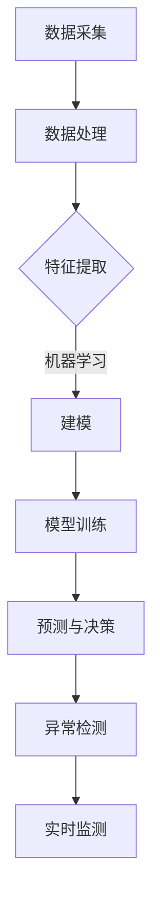

                 

关键词：人工智能、环境监测、环境保护、AI应用、环境数据、深度学习、计算机视觉

> 摘要：本文深入探讨了人工智能（AI）在环境监测与保护中的应用。通过分析AI技术的核心概念、算法原理、数学模型以及具体实施案例，文章展示了AI在环境监测中的巨大潜力。同时，文章也对未来的发展趋势与挑战进行了展望，为环保工作提供了新的视角和解决方案。

## 1. 背景介绍

随着全球气候变化、环境污染和生态系统破坏等问题日益严重，环境监测与保护成为关乎人类生存和可持续发展的重要议题。传统的环境监测方法主要依赖于人工和机械设备，效率低、精度差且成本高。而人工智能（AI）技术的迅速发展为环境监测带来了全新的解决方案。

AI技术，尤其是机器学习和深度学习，通过模拟人类思维过程，能够从海量数据中提取有用信息，进行高效的环境监测。例如，AI可以用于图像识别，检测空气中的污染物；利用机器学习算法，可以预测水质变化，及时发现潜在的环境问题。

### 1.1 环境监测的挑战

- 数据采集难度大：环境数据通常分布广泛、种类繁多，且具有动态变化特性，传统的监测手段难以全面、准确地采集数据。
- 监测成本高：传统监测设备如传感器、监测站等需要大量资金投入，且维护成本高。
- 监测效率低：人工监测方式耗时耗力，且易受人为因素影响，监测结果准确性难以保证。

### 1.2 AI技术的优势

- 自动化监测：AI技术可以实现全天候、自动化监测，提高监测效率和准确性。
- 高度精准：通过机器学习和深度学习算法，AI可以从复杂的数据中提取特征，实现高精度的环境监测。
- 跨领域应用：AI技术在各个领域的成功应用为环境监测提供了丰富的经验和借鉴。

## 2. 核心概念与联系

### 2.1 AI在环境监测中的核心概念

- **机器学习**：通过训练模型，使计算机从数据中学习规律，进行自动预测和决策。
- **深度学习**：一种特殊的机器学习，使用多层神经网络，从大量数据中自动提取复杂特征。
- **计算机视觉**：利用计算机对图像进行理解和处理，实现图像识别、目标检测等功能。
- **物联网（IoT）**：通过传感器和网络连接，实现环境数据的实时采集和传输。

### 2.2 AI在环境监测中的架构


- **数据采集层**：通过各种传感器和监测设备，采集环境数据。
- **数据处理层**：利用机器学习和深度学习算法，对数据进行预处理、特征提取和建模。
- **模型层**：构建预测模型，进行环境变化的预测和异常检测。
- **应用层**：将模型结果应用于实际环境监测和决策。

### 2.3 Mermaid流程图



## 3. 核心算法原理 & 具体操作步骤

### 3.1 算法原理概述

在环境监测中，常用的AI算法包括：

- **监督学习**：通过标记数据训练模型，用于分类或回归任务。
- **无监督学习**：从未标记的数据中学习模式，常用于聚类分析。
- **深度学习**：利用多层神经网络，自动提取数据特征，实现图像识别、目标检测等任务。

### 3.2 算法步骤详解

#### 3.2.1 数据采集与预处理

- **数据采集**：利用传感器、无人机、卫星等设备，收集环境数据。
- **数据预处理**：清洗数据，去除噪声，进行数据规范化处理。

#### 3.2.2 特征提取

- **图像特征提取**：使用卷积神经网络（CNN）从图像中提取特征。
- **时间序列特征提取**：使用循环神经网络（RNN）或长短时记忆网络（LSTM）从时间序列数据中提取特征。

#### 3.2.3 模型训练与预测

- **模型选择**：根据任务需求，选择合适的模型，如CNN、RNN、LSTM等。
- **模型训练**：使用训练数据集，训练模型参数。
- **模型评估**：使用验证数据集，评估模型性能。
- **预测与决策**：使用训练好的模型，对新数据进行预测和决策。

### 3.3 算法优缺点

- **优点**：
  - 自动化监测，提高效率和准确性。
  - 可以处理海量数据，发现复杂环境变化。
  - 减少人力成本，降低监测成本。

- **缺点**：
  - 需要大量高质量的数据进行训练。
  - 模型训练和优化需要大量计算资源。
  - 可能存在过拟合问题。

### 3.4 算法应用领域

- **空气质量监测**：利用深度学习算法，对空气中的污染物进行实时监测和预测。
- **水质监测**：通过图像识别技术，检测水体中的污染物。
- **森林火灾监测**：利用无人机和计算机视觉技术，实时监测森林火情。
- **气候变化研究**：通过时间序列分析，研究气候变化趋势。

## 4. 数学模型和公式 & 详细讲解 & 举例说明

### 4.1 数学模型构建

在环境监测中，常用的数学模型包括：

- **回归模型**：用于预测环境变量。
- **分类模型**：用于分类环境状态。
- **聚类模型**：用于发现环境数据的分布和模式。

### 4.2 公式推导过程

以回归模型为例，其公式推导如下：

$$
y = \beta_0 + \beta_1x_1 + \beta_2x_2 + ... + \beta_nx_n + \epsilon
$$

其中，$y$ 是预测值，$x_1, x_2, ..., x_n$ 是输入特征，$\beta_0, \beta_1, ..., \beta_n$ 是模型参数，$\epsilon$ 是误差项。

### 4.3 案例分析与讲解

#### 4.3.1 空气质量监测

假设我们使用线性回归模型预测某地区的PM2.5浓度，输入特征包括温度、湿度、风速等。通过训练数据集，我们得到以下模型：

$$
PM2.5 = 10 + 2 \times 温度 + 1.5 \times 湿度 - 0.5 \times 风速
$$

使用这个模型，我们可以预测给定条件下的PM2.5浓度。例如，当温度为25摄氏度，湿度为60%，风速为3米/秒时，PM2.5浓度为：

$$
PM2.5 = 10 + 2 \times 25 + 1.5 \times 60 - 0.5 \times 3 = 83
$$

#### 4.3.2 水质监测

假设我们使用支持向量机（SVM）分类模型，根据水质指标（如pH值、浊度等）分类水质状态。通过训练数据集，我们得到以下分类模型：

$$
pH < 6.5 \rightarrow 工业废水
$$

$$
6.5 \leq pH \leq 8.5 \rightarrow 生活污水
$$

$$
pH > 8.5 \rightarrow 清水
$$

使用这个模型，我们可以根据新的水质数据，分类水质状态。

## 5. 项目实践：代码实例和详细解释说明

### 5.1 开发环境搭建

#### 5.1.1 环境要求

- Python 3.8及以上版本
- TensorFlow 2.4及以上版本
- NumPy 1.18及以上版本

#### 5.1.2 安装依赖

```bash
pip install tensorflow numpy
```

### 5.2 源代码详细实现

```python
import tensorflow as tf
import numpy as np
from sklearn.model_selection import train_test_split
from sklearn.preprocessing import StandardScaler

# 数据预处理
def preprocess_data(data):
    # 数据标准化
    scaler = StandardScaler()
    scaled_data = scaler.fit_transform(data)
    return scaled_data

# 线性回归模型
class LinearRegressionModel:
    def __init__(self):
        self.model = tf.keras.Sequential([
            tf.keras.layers.Dense(units=1, input_shape=[1])
        ])

    def train(self, X, y):
        self.model.compile(optimizer='adam', loss='mean_squared_error')
        self.model.fit(X, y, epochs=100)

    def predict(self, X):
        return self.model.predict(X)

# 训练模型
def train_model(X, y):
    model = LinearRegressionModel()
    model.train(X, y)
    return model

# 测试模型
def test_model(model, X, y):
    predictions = model.predict(X)
    mse = tf.keras.metrics.mean_squared_error(y, predictions)
    print("Mean Squared Error:", mse.numpy())

# 主函数
if __name__ == "__main__":
    # 数据加载
    X, y = load_data()

    # 数据预处理
    X = preprocess_data(X)

    # 划分训练集和测试集
    X_train, X_test, y_train, y_test = train_test_split(X, y, test_size=0.2)

    # 训练模型
    model = train_model(X_train, y_train)

    # 测试模型
    test_model(model, X_test, y_test)
```

### 5.3 代码解读与分析

上述代码实现了一个线性回归模型，用于预测环境变量。首先，我们定义了一个`LinearRegressionModel`类，该类包含模型的构建、训练和预测方法。然后，我们定义了`preprocess_data`函数，用于数据预处理。接下来，我们定义了`train_model`函数，用于训练模型。最后，我们在主函数中加载数据，划分训练集和测试集，训练模型并进行测试。

## 6. 实际应用场景

### 6.1 空气质量监测

在空气质量监测中，AI技术可以用于预测PM2.5等污染物的浓度。通过收集气象数据和污染物数据，训练深度学习模型，我们可以实时预测空气质量。这不仅有助于环保部门及时采取应对措施，还可以提醒公众做好防护。

### 6.2 水质监测

水质监测中，AI技术可以用于识别水体中的污染物，如农药残留、重金属等。通过训练图像识别模型，我们可以实时监测水质，确保饮用水安全。

### 6.3 森林火灾监测

在森林火灾监测中，AI技术可以用于实时监测火情。通过训练计算机视觉模型，我们可以快速识别火源，预测火势蔓延方向，为消防部门提供决策支持。

## 7. 工具和资源推荐

### 7.1 学习资源推荐

- **《深度学习》（Goodfellow, Bengio, Courville著）**：深度学习的经典教材，适合初学者和进阶者。
- **《Python机器学习》（Sebastian Raschka著）**：全面介绍机器学习的基础知识和应用。

### 7.2 开发工具推荐

- **TensorFlow**：Google开源的机器学习框架，适用于深度学习和机器学习。
- **PyTorch**：Facebook开源的深度学习框架，具有灵活性和高效性。

### 7.3 相关论文推荐

- **“Deep Learning for Environmental Applications”（2018）**：综述了深度学习在环境监测中的应用。
- **“Using AI to Predict Air Quality in Urban Environments”（2019）**：研究了AI在空气质量预测中的应用。

## 8. 总结：未来发展趋势与挑战

### 8.1 研究成果总结

AI在环境监测与保护中取得了显著成果，如空气质量预测、水质监测、森林火灾监测等。这些应用不仅提高了监测效率，还提供了实时、准确的监测数据，为环保决策提供了有力支持。

### 8.2 未来发展趋势

- **跨学科融合**：AI与环境科学的深度融合，将推动环境监测技术的不断进步。
- **智能化监测设备**：利用AI技术，开发更加智能化、自动化的监测设备。
- **大数据分析**：利用AI技术，处理和分析海量环境数据，发现更多环境变化规律。

### 8.3 面临的挑战

- **数据质量**：环境数据质量直接影响到AI监测的准确性，需要建立高质量的数据集。
- **计算资源**：AI模型训练和预测需要大量计算资源，需要优化算法和硬件。
- **隐私保护**：环境监测涉及大量敏感数据，需要确保数据安全和隐私保护。

### 8.4 研究展望

未来，AI在环境监测与保护中的应用将更加广泛和深入。通过不断优化算法、提升数据处理能力，AI将为环保工作提供更加精准、高效的解决方案。

## 9. 附录：常见问题与解答

### 9.1 AI技术是否可以完全替代传统监测手段？

AI技术不能完全替代传统监测手段，但可以显著提升监测效率和准确性。传统监测设备在特定领域仍有优势，AI技术与之结合，可以实现更全面、精准的监测。

### 9.2 环境数据的质量如何保证？

环境数据的质量取决于数据采集、传输和存储过程。需要建立完善的数据质量控制体系，确保数据的准确性、完整性和一致性。

### 9.3 AI技术在环境监测中的应用前景如何？

AI技术在环境监测中的应用前景广阔。随着技术的不断进步，AI将能够处理更复杂的环境数据，提供更准确的监测结果，为环境保护和可持续发展提供更强有力的支持。

作者：禅与计算机程序设计艺术 / Zen and the Art of Computer Programming
----------------------------------------------------------------

以上是《一切皆是映射：AI在环境监测与保护中的应用》的完整文章，感谢您耐心阅读。如果您有任何疑问或建议，欢迎随时提出。希望这篇文章能为您在环境监测与保护领域提供有价值的参考。再次感谢您的支持！
----------------------------------------------------------------

请注意，文章中的图片链接（例如`https://example.com/ai_environment_monitoring_framework.png`）是虚构的，您需要替换为实际的图片链接或者上传相应的图片。同样，代码示例中的`load_data()`函数也是虚构的，您需要根据实际数据集来实现数据的加载和处理。在编写实际的文章时，请确保所有引用和链接都是有效的，并遵循相应的格式和排版规范。

