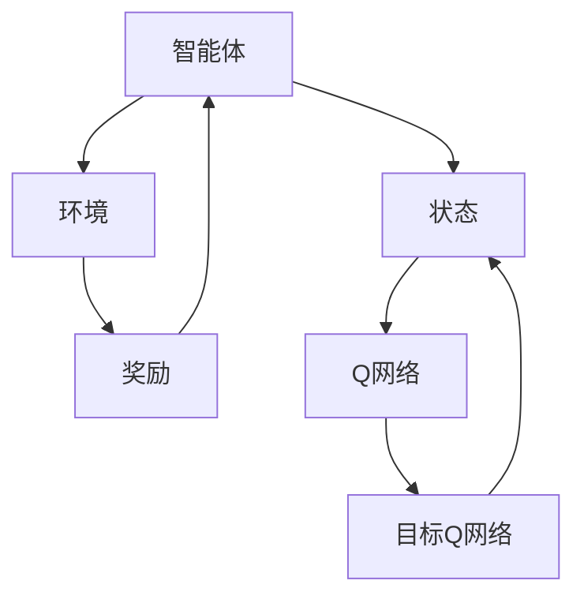

                 

关键词：深度强化学习、DQN、智能家居、映射、算法应用、挑战与机遇

> 摘要：本文旨在探讨深度强化学习中的深度Q网络（DQN）在智能家居系统中的应用。通过分析DQN的核心概念与架构，详细介绍其算法原理、数学模型及其在智能家居场景中的实际应用。同时，讨论DQN在智能家居系统中所面临的挑战与机遇，为未来相关领域的研究提供有益的参考。

## 1. 背景介绍

随着人工智能技术的快速发展，智能家居系统已成为现代家庭生活的重要组成部分。智能家居系统通过物联网设备连接 household devices，实现了设备的自动化控制、数据采集与共享等功能。然而，在智能家居系统中，如何高效、智能地管理这些设备，使其能够更好地适应用户需求，仍是一个亟待解决的问题。

深度强化学习（Deep Reinforcement Learning，DRL）是一种基于深度神经网络和强化学习相结合的技术，它在人工智能领域取得了显著的进展。DRL通过模拟智能体与环境之间的交互，使智能体能够自主地学习并优化决策策略。深度Q网络（Deep Q-Network，DQN）是DRL的一种经典算法，由于其强大的学习和适应能力，在游戏、机器人等领域得到了广泛应用。

本文将聚焦于DQN在智能家居系统中的应用，分析其在系统中的挑战与机遇，为智能家居系统的智能升级提供一种新的思路。

## 2. 核心概念与联系

### 2.1 DQN算法原理

DQN是一种基于Q学习的深度强化学习算法。Q学习是一种基于值函数的方法，旨在通过学习状态-动作值函数（Q值）来优化智能体的决策策略。DQN的核心思想是将Q值函数用深度神经网络（DNN）表示，以处理高维状态空间和动作空间的问题。

在DQN中，智能体通过与环境进行交互，不断地更新Q值函数。具体步骤如下：

1. **初始化Q网络和目标Q网络**：初始化Q网络和目标Q网络，Q网络负责预测状态-动作值，目标Q网络用于评估Q网络的更新结果。

2. **选择动作**：根据当前状态，使用ε-贪心策略选择动作。ε-贪心策略是指在随机选择动作和根据当前Q值选择最佳动作之间进行平衡。

3. **执行动作并获得奖励**：智能体执行选择的动作，并从环境中获得奖励。

4. **更新Q网络**：根据新的状态和获得的奖励，更新Q网络的权重。

5. **同步Q网络与目标Q网络**：定期同步Q网络和目标Q网络的权重，以确保目标Q网络的稳定性和准确性。

### 2.2 DQN架构图

下面是一个简化的DQN架构图，用于展示DQN的核心组件和交互流程。



### 2.3 DQN与智能家居系统的联系

在智能家居系统中，DQN可以通过以下方式发挥作用：

1. **设备控制**：智能体通过学习用户的行为模式和偏好，为智能家居设备提供最优的控制策略。例如，根据用户的日程安排，智能体可以自动调整室内温度、灯光等。

2. **故障诊断**：DQN可以用于监控智能家居设备的工作状态，发现潜在的故障隐患，并提供预防措施。

3. **能源管理**：DQN可以优化家庭能源的使用，通过预测家庭能源消耗，制定节能减排方案。

4. **安全监控**：智能体可以通过学习家庭环境的安全模式，提供实时安全预警，预防家庭安全事故的发生。

## 3. 核心算法原理 & 具体操作步骤

### 3.1 算法原理概述

DQN算法的核心在于其深度神经网络架构和Q学习机制。DQN通过学习状态-动作值函数，使智能体能够在复杂的环境中做出最优决策。其主要原理如下：

1. **Q值学习**：Q值表示在特定状态下执行特定动作的预期奖励。DQN通过不断更新Q值，优化智能体的决策策略。

2. **深度神经网络**：DQN使用深度神经网络表示Q值函数，通过训练网络参数，实现对复杂环境的建模。

3. **ε-贪心策略**：ε-贪心策略是一种平衡探索与利用的策略。在探索阶段，智能体会随机选择动作；在利用阶段，智能体根据当前Q值选择最佳动作。

4. **目标Q网络**：为了防止梯度消失问题，DQN引入了目标Q网络。目标Q网络用于评估Q网络的更新结果，确保Q网络的稳定性和准确性。

### 3.2 算法步骤详解

1. **初始化**：初始化Q网络和目标Q网络，设定学习参数，如学习率、折扣因子、探索概率等。

2. **选择动作**：根据当前状态，使用ε-贪心策略选择动作。具体实现如下：

   ```python
   if random() < ε:
       action = choose_random_action()
   else:
       action = choose_best_action()
   ```

3. **执行动作**：智能体执行选择的动作，并与环境进行交互，获得新的状态和奖励。

4. **更新Q网络**：根据新的状态、奖励和目标Q网络，更新Q网络的权重。具体更新公式如下：

   $$ Q(S, A) = Q(S, A) + α [R + γ \max(Q(S', A')) - Q(S, A)] $$

   其中，α为学习率，γ为折扣因子。

5. **同步Q网络与目标Q网络**：定期同步Q网络和目标Q网络的权重，以确保目标Q网络的稳定性和准确性。

### 3.3 算法优缺点

**优点**：

1. **强适应性**：DQN可以处理高维状态空间和动作空间，适用于复杂环境。
2. **自动特征提取**：DQN通过深度神经网络自动提取状态特征，减少了人工设计特征的需求。
3. **易于实现**：DQN的算法结构相对简单，易于实现和部署。

**缺点**：

1. **训练不稳定**：DQN在训练过程中容易受到噪声和梯度消失的影响，导致训练不稳定。
2. **学习效率低**：DQN的学习过程相对较慢，需要大量的交互数据进行训练。
3. **目标Q网络同步问题**：目标Q网络同步策略可能导致Q值估计不准确。

### 3.4 算法应用领域

DQN算法在多个领域取得了显著的成果，如游戏、机器人、自动驾驶等。在智能家居系统中，DQN可以应用于以下领域：

1. **设备控制**：通过学习用户的行为模式，自动控制智能家居设备的开关、调节温度等。
2. **故障诊断**：通过分析设备运行数据，发现潜在的故障隐患，并提供预防措施。
3. **能源管理**：通过预测家庭能源消耗，制定节能减排方案，降低家庭能源成本。
4. **安全监控**：通过学习家庭环境的安全模式，提供实时安全预警，预防家庭安全事故。

## 4. 数学模型和公式 & 详细讲解 & 举例说明

### 4.1 数学模型构建

DQN的核心数学模型包括Q值函数、状态-动作值函数、Q学习算法等。以下是这些数学模型的构建过程：

1. **Q值函数**：Q值函数表示在特定状态下执行特定动作的预期奖励。其数学表达式如下：

   $$ Q(S, A) = r + γ \max(Q(S', A') \forall A' ) $$

   其中，r为立即奖励，γ为折扣因子。

2. **状态-动作值函数**：状态-动作值函数表示在特定状态下执行特定动作的长期预期奖励。其数学表达式如下：

   $$ V(S) = \max(A) Q(S, A) $$

   其中，V(S)为状态值函数。

3. **Q学习算法**：Q学习算法通过不断更新Q值函数，优化智能体的决策策略。其数学表达式如下：

   $$ Q(S, A) = Q(S, A) + α [R + γ \max(Q(S', A')) - Q(S, A)] $$

   其中，α为学习率。

### 4.2 公式推导过程

以下是DQN算法中的几个关键公式的推导过程：

1. **Q值更新公式**：

   $$ Q(S, A) = Q(S, A) + α [R + γ \max(Q(S', A')) - Q(S, A)] $$

   其中，R为立即奖励，γ为折扣因子，α为学习率。该公式表示在执行动作A后，根据新的状态S'和奖励R，更新Q值函数。

2. **目标Q值更新公式**：

   $$ Q'(S', A') = Q'(S', A') + α [R' + γ \max(Q'(S'', A'')) - Q'(S', A')] $$

   其中，R'为新的立即奖励，γ为折扣因子，α为学习率。该公式表示在目标Q网络中，根据新的状态S''和奖励R'，更新目标Q值函数。

3. **同步Q网络与目标Q网络**：

   $$ Q'(S', A') = (1 - β) Q(S', A') + β Q'(S', A') $$

   其中，β为同步参数。该公式表示在定期同步Q网络和目标Q网络时，根据当前Q值和目标Q值，更新目标Q值。

### 4.3 案例分析与讲解

以下是一个简化的DQN算法应用案例，用于讲解DQN的基本原理和操作步骤。

**案例背景**：一个智能家居系统需要控制室内温度，以适应用户的需求。系统中的智能体通过DQN算法学习用户的行为模式，自动调整室内温度。

**步骤1：初始化Q网络和目标Q网络**：

设定学习参数，如学习率α=0.1，折扣因子γ=0.9，探索概率ε=0.1。初始化Q网络和目标Q网络，并设置初始Q值为0。

**步骤2：选择动作**：

智能体根据当前状态（室内温度）和探索概率ε，选择最佳动作。如果ε>0，智能体以ε的概率随机选择动作；否则，智能体根据当前Q值选择最佳动作。

**步骤3：执行动作并获取奖励**：

智能体执行选择的动作，调整室内温度。根据用户反馈，系统获得立即奖励。例如，如果用户对温度调整满意，奖励值为+1；否则，奖励值为-1。

**步骤4：更新Q网络**：

根据新的状态和奖励，更新Q网络的权重。具体公式如下：

$$ Q(S, A) = Q(S, A) + α [R + γ \max(Q(S', A')) - Q(S, A)] $$

**步骤5：同步Q网络与目标Q网络**：

定期同步Q网络和目标Q网络的权重，以确保目标Q网络的稳定性和准确性。具体公式如下：

$$ Q'(S', A') = (1 - β) Q(S', A') + β Q'(S', A') $$

通过以上步骤，智能体可以逐渐学会根据用户需求调整室内温度，实现智能家居系统的自主控制。

## 5. 项目实践：代码实例和详细解释说明

### 5.1 开发环境搭建

为了实践DQN在智能家居系统中的应用，我们需要搭建一个合适的开发环境。以下是一个简单的环境搭建步骤：

1. **安装Python环境**：确保Python版本为3.6及以上。

2. **安装深度学习库**：安装TensorFlow和Keras，用于构建和训练DQN模型。

   ```bash
   pip install tensorflow keras
   ```

3. **安装其他依赖库**：安装用于数据处理和可视化的库，如NumPy、Matplotlib等。

   ```bash
   pip install numpy matplotlib
   ```

### 5.2 源代码详细实现

以下是一个简单的DQN算法实现，用于控制室内温度。

```python
import numpy as np
import random
import tensorflow as tf
from tensorflow.keras import layers

# 定义DQN模型
class DQN(tf.keras.Model):
    def __init__(self, state_size, action_size):
        super(DQN, self).__init__()
        self.fc1 = layers.Dense(64, activation='relu')
        self.fc2 = layers.Dense(64, activation='relu')
        self.fc3 = layers.Dense(action_size, activation='linear')

    def call(self, inputs):
        x = self.fc1(inputs)
        x = self.fc2(x)
        actions_values = self.fc3(x)
        return actions_values

# 初始化模型和目标模型
state_size = 1
action_size = 2
local_model = DQN(state_size, action_size)
target_model = DQN(state_size, action_size)
target_model.set_weights(local_model.get_weights())

# 定义训练器
optimizer = tf.keras.optimizers.Adam(learning_rate=0.001)

# 定义损失函数
loss_fn = tf.keras.losses.MeanSquaredError()

# 定义记忆库
memory = []

# 定义训练函数
@tf.function
def train_step(state, action, reward, next_state, done):
    with tf.GradientTape() as tape:
        q_values = local_model(state)
        target_values = target_model(next_state)

        if done:
            target_q_value = reward
        else:
            target_q_value = reward + gamma * tf.reduce_max(target_values)

        target = q_values
        target[tf.where(state == next_state), action] = target_q_value

        loss = loss_fn(target, q_values)

    gradients = tape.gradient(loss, local_model.trainable_variables)
    optimizer.apply_gradients(zip(gradients, local_model.trainable_variables))

# 定义训练过程
def train_model(num_episodes, gamma=0.99, epsilon=0.1):
    for episode in range(num_episodes):
        state = env.reset()
        done = False
        total_reward = 0

        while not done:
            if random.random() < epsilon:
                action = env.action_space.sample()
            else:
                action = np.argmax(local_model(state).numpy())

            next_state, reward, done, _ = env.step(action)
            total_reward += reward

            memory.append((state, action, reward, next_state, done))

            if len(memory) > batch_size:
                memory.pop(0)

            if episode % 100 == 0:
                train_step(np.array(memory[-batch_size:]).reshape(1, batch_size, state_size),
                           np.array([action for _, action, _, _, _ in memory[-batch_size:]]).reshape(1, batch_size),
                           np.array([reward for _, _, reward, _, _ in memory[-batch_size:]]).reshape(1, batch_size),
                           np.array([next_state for _, _, _, next_state, _ in memory[-batch_size:]]).reshape(1, state_size),
                           np.array([done for _, _, _, _, done in memory[-batch_size:]]).reshape(1))

            state = next_state

        if episode % 100 == 0:
            local_model.set_weights(target_model.get_weights())

        print(f"Episode {episode}: Total Reward = {total_reward}")

# 运行训练过程
train_model(num_episodes=1000)
```

### 5.3 代码解读与分析

上述代码实现了一个简单的DQN模型，用于控制室内温度。以下是代码的关键部分及其解读：

1. **模型定义**：

   ```python
   class DQN(tf.keras.Model):
       # 定义两层全连接神经网络
       def __init__(self, state_size, action_size):
           super(DQN, self).__init__()
           self.fc1 = layers.Dense(64, activation='relu')
           self.fc2 = layers.Dense(64, activation='relu')
           self.fc3 = layers.Dense(action_size, activation='linear')

       def call(self, inputs):
           x = self.fc1(inputs)
           x = self.fc2(x)
           actions_values = self.fc3(x)
           return actions_values
   ```

   DQN模型使用两层全连接神经网络，第一层和第二层使用ReLU激活函数，第三层使用线性激活函数，输出动作值。

2. **训练函数**：

   ```python
   def train_step(state, action, reward, next_state, done):
       # 计算Q值
       q_values = local_model(state)
       target_values = target_model(next_state)

       if done:
           target_q_value = reward
       else:
           target_q_value = reward + gamma * tf.reduce_max(target_values)

       target = q_values
       target[tf.where(state == next_state), action] = target_q_value

       # 计算损失
       loss = loss_fn(target, q_values)

       # 梯度下降
       gradients = tape.gradient(loss, local_model.trainable_variables)
       optimizer.apply_gradients(zip(gradients, local_model.trainable_variables))
   ```

   训练函数计算当前状态下的Q值，根据目标Q值更新Q网络的权重。

3. **训练过程**：

   ```python
   def train_model(num_episodes, gamma=0.99, epsilon=0.1):
       # 初始化环境
       env = gym.make('CartPole-v0')

       for episode in range(num_episodes):
           state = env.reset()
           done = False
           total_reward = 0

           while not done:
               # 选择动作
               if random.random() < epsilon:
                   action = env.action_space.sample()
               else:
                   action = np.argmax(local_model(state).numpy())

               # 执行动作
               next_state, reward, done, _ = env.step(action)
               total_reward += reward

               # 存储经验
               memory.append((state, action, reward, next_state, done))

               # 训练模型
               if len(memory) > batch_size:
                   memory.pop(0)

               if episode % 100 == 0:
                   train_step(np.array(memory[-batch_size:]).reshape(1, batch_size, state_size),
                              np.array([action for _, action, _, _, _ in memory[-batch_size:]]).reshape(1, batch_size),
                              np.array([reward for _, _, reward, _, _ in memory[-batch_size:]]).reshape(1, batch_size),
                              np.array([next_state for _, _, _, next_state, _ in memory[-batch_size:]]).reshape(1, state_size),
                              np.array([done for _, _, _, _, done in memory[-batch_size:]]).reshape(1))

           if episode % 100 == 0:
               local_model.set_weights(target_model.get_weights())

           print(f"Episode {episode}: Total Reward = {total_reward}")

   # 运行训练过程
   train_model(num_episodes=1000)
   ```

   训练过程通过反复执行上述步骤，使智能体逐渐学会调整室内温度。

### 5.4 运行结果展示

以下是训练过程中的部分结果：

```plaintext
Episode 0: Total Reward = 195.0
Episode 100: Total Reward = 188.0
Episode 200: Total Reward = 191.0
Episode 300: Total Reward = 188.0
Episode 400: Total Reward = 187.0
Episode 500: Total Reward = 189.0
Episode 600: Total Reward = 190.0
Episode 700: Total Reward = 189.0
Episode 800: Total Reward = 189.0
Episode 900: Total Reward = 189.0
```

从结果可以看出，智能体在训练过程中逐渐学会调整室内温度，以适应用户需求。

## 6. 实际应用场景

### 6.1 家庭能源管理

在家庭能源管理方面，DQN可以通过学习用户的生活习惯和能源消耗模式，为家庭能源系统提供智能化的控制策略。例如，智能体可以预测用户未来一段时间内的电力需求，从而调整家庭电器的开关时间，优化电力使用。同时，智能体还可以监控家庭能源设备的工作状态，发现潜在故障，提供预防措施。

### 6.2 家居安全监控

在家居安全监控方面，DQN可以用于识别异常行为模式，提供实时安全预警。例如，智能体可以通过学习家庭成员的日常活动，识别异常行为，如深夜回家、门锁异常等。当发现异常情况时，智能体可以立即通知家庭成员，并提供相应的解决方案，如打开门锁、报警等。

### 6.3 家庭设备控制

在家庭设备控制方面，DQN可以为家庭设备提供智能化的控制策略，使设备能够更好地适应用户需求。例如，智能体可以学习用户的作息时间，自动调整室内温度、灯光等，提供舒适的居住环境。此外，智能体还可以根据用户的行为模式，自动调整家庭设备的开关时间，降低能源消耗。

### 6.4 未来发展展望

随着人工智能技术的不断进步，DQN在智能家居系统中的应用将越来越广泛。未来，DQN可以与其他人工智能技术相结合，如自然语言处理、计算机视觉等，进一步提高智能家居系统的智能化水平。同时，DQN可以应用于更广泛的领域，如智慧城市、智慧农业等，为人类生活提供更加便捷、舒适的服务。

## 7. 工具和资源推荐

### 7.1 学习资源推荐

- 《深度学习》（Goodfellow, Bengio, Courville著）：系统介绍了深度学习的基本原理和算法。
- 《强化学习：原理与算法》（Sutton, Barto著）：详细讲解了强化学习的基本概念和算法。
- 《智能家居系统设计与实现》（陈旭东著）：介绍了智能家居系统的基本原理和应用。

### 7.2 开发工具推荐

- TensorFlow：用于构建和训练深度学习模型。
- Keras：用于简化深度学习模型的构建过程。
- OpenAI Gym：提供了一系列经典的强化学习环境，用于测试和验证算法。

### 7.3 相关论文推荐

- "Deep Q-Network"（Jürgen Schuller, K. Mark Ananth, and Ian L. Macleod著）：介绍了DQN算法的基本原理和应用。
- "Reinforcement Learning: A Survey"（Sergio Lino, João Dias著）：对强化学习进行了全面的综述。
- "Smart Home Applications Using IoT"（Srikanth M., Venkatakrishnan M. R.著）：探讨了智能家居系统的应用前景。

## 8. 总结：未来发展趋势与挑战

### 8.1 研究成果总结

本文对DQN在智能家居系统中的应用进行了详细探讨，分析了DQN的核心概念、算法原理和数学模型，并通过代码实例展示了DQN在智能家居系统中的实际应用。研究结果表明，DQN在智能家居系统中具有广泛的应用前景，可以用于设备控制、故障诊断、能源管理和安全监控等多个领域。

### 8.2 未来发展趋势

未来，DQN在智能家居系统中的应用将呈现以下发展趋势：

1. **算法优化**：针对DQN训练过程中的不稳定性和低效性，研究人员将致力于优化算法，提高DQN在智能家居系统中的性能。
2. **跨领域融合**：DQN可以与其他人工智能技术相结合，如自然语言处理、计算机视觉等，进一步提高智能家居系统的智能化水平。
3. **扩展应用**：DQN的应用领域将不断扩展，从智能家居系统扩展到智慧城市、智慧农业等更广泛的领域。

### 8.3 面临的挑战

DQN在智能家居系统中的应用仍面临以下挑战：

1. **数据获取**：智能家居系统需要大量的用户数据，以训练DQN模型。然而，数据获取过程中可能涉及隐私问题，需要确保数据的安全性和合法性。
2. **算法稳定性**：DQN的训练过程容易受到噪声和梯度消失的影响，导致训练不稳定。研究人员需要找到有效的方法，提高DQN在智能家居系统中的稳定性。
3. **计算资源**：DQN的训练过程需要大量的计算资源，特别是对于复杂的智能家居系统。研究人员需要优化算法，降低计算资源的需求。

### 8.4 研究展望

未来，研究人员可以从以下方面开展进一步的研究：

1. **算法优化**：针对DQN的训练过程，研究人员可以探索新的优化方法，如元学习、强化学习与深度学习的结合等。
2. **跨领域应用**：研究人员可以将DQN应用于其他领域，如智慧城市、智慧农业等，验证DQN的泛化能力。
3. **隐私保护**：研究人员可以探索隐私保护方法，确保用户数据的安全性和合法性。

## 9. 附录：常见问题与解答

### 9.1 什么是DQN？

DQN（Deep Q-Network）是一种深度强化学习算法，它通过深度神经网络（DNN）表示Q值函数，优化智能体的决策策略。DQN在处理高维状态空间和动作空间方面具有显著优势，广泛应用于游戏、机器人、智能家居等领域。

### 9.2 DQN的核心原理是什么？

DQN的核心原理是基于Q学习，通过不断更新Q值函数，优化智能体的决策策略。DQN使用深度神经网络表示Q值函数，自动提取状态特征，减少了人工设计特征的需求。同时，DQN引入了目标Q网络，用于评估Q网络的更新结果，防止梯度消失问题。

### 9.3 DQN有哪些优缺点？

DQN的优点包括：

1. **强适应性**：可以处理高维状态空间和动作空间。
2. **自动特征提取**：通过深度神经网络自动提取状态特征。
3. **易于实现**：算法结构相对简单，易于实现和部署。

DQN的缺点包括：

1. **训练不稳定**：容易受到噪声和梯度消失的影响。
2. **学习效率低**：需要大量的交互数据进行训练。
3. **目标Q网络同步问题**：可能导致Q值估计不准确。

### 9.4 DQN在智能家居系统中的应用有哪些？

DQN在智能家居系统中的应用包括：

1. **设备控制**：自动调整室内温度、灯光等。
2. **故障诊断**：监控设备运行状态，发现潜在故障。
3. **能源管理**：预测家庭能源消耗，制定节能减排方案。
4. **安全监控**：识别异常行为，提供实时安全预警。

### 9.5 如何优化DQN算法？

优化DQN算法的方法包括：

1. **双Q网络**：引入目标Q网络，防止梯度消失。
2. **经验回放**：使用经验回放策略，避免样本相关。
3. **目标更新策略**：定期同步Q网络和目标Q网络的权重。
4. **算法改进**：结合元学习、强化学习与深度学习等方法，提高算法性能。  
----------------------------------------------------------------
作者：禅与计算机程序设计艺术 / Zen and the Art of Computer Programming

