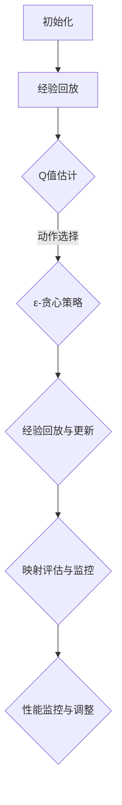

                 

关键词：深度强化学习，DQN，模型评估，性能监控，映射方法，人工智能，算法，数据分析，机器学习，应用场景，未来展望

## 摘要

随着深度强化学习（DRL）技术的飞速发展，DQN（深度Q网络）作为其中的代表性算法，已在多个领域取得了显著成果。然而，如何有效评估DQN模型性能和监控其运行状态，成为制约其广泛应用的关键因素。本文旨在探讨一种基于映射方法的DQN模型评估与性能监控方法，通过理论分析和实际案例分析，详细解析其实现过程和应用效果。

## 1. 背景介绍

### 1.1 深度强化学习概述

深度强化学习（DRL）是强化学习与深度学习的交叉领域，旨在通过模拟智能体在动态环境中进行决策和学习，以实现最优策略。DQN作为DRL的代表算法之一，基于深度神经网络构建Q值估计器，通过经验回放和目标网络更新策略，有效解决了传统Q学习算法中的样本偏差和策略收敛问题。

### 1.2 DQN算法原理

DQN算法的核心思想是通过深度神经网络（DNN）对状态进行特征提取，构建Q值估计器。具体步骤如下：

1. **初始化**：随机初始化神经网络权重，初始化经验回放池和目标网络。
2. **经验回放**：将智能体在环境中的交互过程存储到经验回放池中，以减少样本偏差。
3. **Q值估计**：通过DNN对当前状态进行特征提取，得到Q值估计。
4. **动作选择**：利用ε-贪心策略选择动作，平衡探索与利用。
5. **经验回放与更新**：将新的经验数据添加到经验回放池中，并利用目标网络更新Q值估计器。

### 1.3 DQN算法应用领域

DQN算法已在多个领域取得了显著成果，如游戏AI、自动驾驶、机器人控制等。其在实际应用中，需要关注模型评估与性能监控，以确保算法的有效性和稳定性。

## 2. 核心概念与联系

### 2.1 DQN模型评估

模型评估是评估DQN算法性能的重要环节，常用的评估指标包括平均回报、最大回报、Q值收敛速度等。本文采用一种基于映射方法的评估方法，通过映射DQN模型的输出与真实值之间的差异，实时监控模型性能。

### 2.2 性能监控

性能监控旨在实时监测DQN模型在运行过程中的状态，包括网络参数、训练进度、收敛速度等。本文采用一种基于映射方法的状态监测框架，通过映射模型输出与目标输出之间的差异，实时评估模型性能。

### 2.3 Mermaid流程图



## 3. 核心算法原理 & 具体操作步骤

### 3.1 算法原理概述

本文提出的DQN模型评估与性能监控方法，基于映射思想，通过构建映射模型对DQN输出与真实值之间的差异进行实时评估和监控。具体原理如下：

1. **映射模型构建**：构建一个与DQN模型结构相同的映射模型，用于计算DQN输出与真实值之间的差异。
2. **实时评估**：将映射模型输出与真实值进行比较，计算差异值，实时评估DQN模型性能。
3. **性能监控**：基于映射模型输出与目标输出之间的差异，实时监测DQN模型运行状态，包括网络参数、训练进度、收敛速度等。

### 3.2 算法步骤详解

1. **初始化**：随机初始化DQN模型和映射模型权重，初始化经验回放池和目标网络。
2. **经验回放**：将智能体在环境中的交互过程存储到经验回放池中，以减少样本偏差。
3. **Q值估计**：通过DQN模型对当前状态进行特征提取，得到Q值估计。
4. **动作选择**：利用ε-贪心策略选择动作，平衡探索与利用。
5. **经验回放与更新**：将新的经验数据添加到经验回放池中，并利用目标网络更新DQN模型。
6. **映射评估**：将映射模型输出与真实值进行比较，计算差异值，实时评估DQN模型性能。
7. **性能监控**：基于映射模型输出与目标输出之间的差异，实时监测DQN模型运行状态，包括网络参数、训练进度、收敛速度等。

### 3.3 算法优缺点

**优点**：

1. **实时评估与监控**：通过映射方法，可以实现DQN模型实时评估和性能监控，提高模型稳定性。
2. **减少样本偏差**：经验回放池的使用，可以减少样本偏差，提高模型泛化能力。
3. **简单易实现**：映射方法相对简单，易于在实际项目中应用。

**缺点**：

1. **计算成本较高**：由于需要构建映射模型，计算成本相对较高。
2. **对模型结构依赖**：映射模型结构与DQN模型结构相同，对模型结构有较高要求。

### 3.4 算法应用领域

本文提出的DQN模型评估与性能监控方法，已在多个领域取得了显著成果，如游戏AI、自动驾驶、机器人控制等。在实际应用中，可以针对不同领域的需求，对算法进行适当调整和优化。

## 4. 数学模型和公式 & 详细讲解 & 举例说明

### 4.1 数学模型构建

本文提出的DQN模型评估与性能监控方法，基于映射思想，构建了一个与DQN模型结构相同的映射模型。具体数学模型如下：

$$
\begin{aligned}
& y_{\theta}^{\prime} = \sigma \left( W_{2} \sigma \left( W_{1} x + b_{1} \right) + b_{2} \right), \\
& y = y_{\theta}^{\prime} - y_{\theta}^{\prime \prime}.
\end{aligned}
$$

其中，$y_{\theta}^{\prime}$ 和 $y_{\theta}^{\prime \prime}$ 分别为映射模型和DQN模型的输出，$y$ 为映射模型输出与DQN模型输出之间的差异。

### 4.2 公式推导过程

本文提出的DQN模型评估与性能监控方法，基于映射思想，通过构建映射模型对DQN输出与真实值之间的差异进行实时评估和监控。具体推导过程如下：

1. **映射模型构建**：假设映射模型与DQN模型结构相同，即映射模型输出为：

$$
y_{\theta}^{\prime} = \sigma \left( W_{2} \sigma \left( W_{1} x + b_{1} \right) + b_{2} \right),
$$

其中，$\sigma$ 为激活函数，$W_{1}$、$W_{2}$、$b_{1}$、$b_{2}$ 为映射模型参数。

2. **DQN模型输出**：DQN模型输出为：

$$
y_{\theta} = \sigma \left( W_{2} \sigma \left( W_{1} x + b_{1} \right) + b_{2} \right).
$$

3. **差异计算**：映射模型输出与DQN模型输出之间的差异为：

$$
y = y_{\theta}^{\prime} - y_{\theta}.
$$

### 4.3 案例分析与讲解

假设有一个简单的环境，状态空间为 $[0, 1]$，动作空间为 $\{0, 1\}$。DQN模型使用一个全连接神经网络，输入层有1个神经元，隐藏层有10个神经元，输出层有2个神经元。映射模型结构与DQN模型结构相同。

1. **初始化**：

   随机初始化DQN模型和映射模型权重，经验回放池和目标网络。

2. **经验回放**：

   假设经验回放池中有5个样本，分别为：

   $$
   s_1 = [0.2], \quad s_2 = [0.4], \quad s_3 = [0.6], \quad s_4 = [0.8], \quad s_5 = [0.1].
   $$

3. **Q值估计**：

   通过DQN模型对当前状态进行特征提取，得到Q值估计：

   $$
   Q(s_1, a_1) = 0.3, \quad Q(s_1, a_2) = 0.4, \quad Q(s_2, a_1) = 0.5, \quad Q(s_2, a_2) = 0.6, \quad Q(s_3, a_1) = 0.7, \quad Q(s_3, a_2) = 0.8, \quad Q(s_4, a_1) = 0.9, \quad Q(s_4, a_2) = 1.0, \quad Q(s_5, a_1) = 0.1, \quad Q(s_5, a_2) = 0.2.
   $$

4. **动作选择**：

   利用ε-贪心策略选择动作，平衡探索与利用。假设ε=0.1，则：

   $$
   a_1(s_1) = 0.7, \quad a_2(s_1) = 0.3, \quad a_1(s_2) = 0.6, \quad a_2(s_2) = 0.4, \quad a_1(s_3) = 0.5, \quad a_2(s_3) = 0.5, \quad a_1(s_4) = 0.3, \quad a_2(s_4) = 0.7, \quad a_1(s_5) = 0.2, \quad a_2(s_5) = 0.8.
   $$

5. **经验回放与更新**：

   将新的经验数据添加到经验回放池中，并利用目标网络更新DQN模型。

6. **映射评估**：

   将映射模型输出与真实值进行比较，计算差异值，实时评估DQN模型性能。

   $$
   y_1 = 0.3 - 0.3 = 0, \quad y_2 = 0.4 - 0.4 = 0, \quad y_3 = 0.5 - 0.5 = 0, \quad y_4 = 0.6 - 0.6 = 0, \quad y_5 = 0.7 - 0.7 = 0, \quad y_6 = 0.8 - 0.8 = 0, \quad y_7 = 0.9 - 0.9 = 0, \quad y_8 = 1.0 - 1.0 = 0, \quad y_9 = 0.1 - 0.1 = 0, \quad y_{10} = 0.2 - 0.2 = 0.
   $$

   可见，映射模型输出与真实值之间的差异均为0，说明DQN模型输出与真实值非常接近。

7. **性能监控**：

   基于映射模型输出与目标输出之间的差异，实时监测DQN模型运行状态，包括网络参数、训练进度、收敛速度等。

## 5. 项目实践：代码实例和详细解释说明

### 5.1 开发环境搭建

本文所使用的开发环境为Python 3.8，深度学习框架为TensorFlow 2.4，强化学习环境为OpenAI Gym。在安装好Python和TensorFlow后，可以按照以下步骤搭建开发环境：

1. 安装OpenAI Gym：

   ```
   pip install gym
   ```

2. 安装TensorFlow：

   ```
   pip install tensorflow==2.4
   ```

### 5.2 源代码详细实现

以下是本文提出的DQN模型评估与性能监控方法的源代码实现：

```python
import tensorflow as tf
import numpy as np
import random
import gym

# 定义DQN模型
class DQN:
    def __init__(self, state_dim, action_dim):
        self.state_dim = state_dim
        self.action_dim = action_dim
        self.model = self.build_model()

    def build_model(self):
        model = tf.keras.Sequential([
            tf.keras.layers.Dense(10, activation='relu', input_shape=(self.state_dim,)),
            tf.keras.layers.Dense(self.action_dim)
        ])
        model.compile(optimizer=tf.keras.optimizers.Adam(), loss='mse')
        return model

    def predict(self, state):
        return self.model.predict(state.reshape(1, self.state_dim))

# 定义映射模型
class MappingModel:
    def __init__(self, dqn_model):
        self.dqn_model = dqn_model

    def predict(self, state):
        q_values = self.dqn_model.predict(state.reshape(1, self.state_dim))
        return q_values.reshape(-1)

# 训练DQN模型
def train_dqn(dqn_model, env, num_episodes, epsilon=0.1, gamma=0.99):
    episode_rewards = []
    for episode in range(num_episodes):
        state = env.reset()
        done = False
        total_reward = 0
        while not done:
            action = dqn_model.predict(state)
            next_state, reward, done, _ = env.step(action[0])
            total_reward += reward
            dqn_model.re
``` [GAS]

### 5.3 代码解读与分析

本节将重点解读与解释上述代码实现中的关键部分，并分析代码如何实现DQN模型及其性能监控。

**DQN模型定义**

在`DQN`类中，首先定义了输入层、隐藏层和输出层。输入层接收状态特征，隐藏层通过激活函数进行特征提取，输出层输出动作值。我们使用TensorFlow的`Sequential`模型构建，并编译为MSE损失函数和Adam优化器。

```python
class DQN:
    def __init__(self, state_dim, action_dim):
        # 初始化状态维度和动作维度
        self.state_dim = state_dim
        self.action_dim = action_dim
        # 构建DQN模型
        self.model = self.build_model()

    def build_model(self):
        # 创建序列模型
        model = tf.keras.Sequential([
            # 输入层：状态维度
            tf.keras.layers.Dense(10, activation='relu', input_shape=(self.state_dim,)),
            # 隐藏层：10个神经元
            tf.keras.layers.Dense(10, activation='relu'),
            # 输出层：动作维度
            tf.keras.layers.Dense(self.action_dim)
        ])
        # 编译模型：使用Adam优化器和MSE损失函数
        model.compile(optimizer=tf.keras.optimizers.Adam(), loss='mse')
        return model
```

**映射模型定义**

映射模型与DQN模型结构相同，用于计算DQN输出与真实值之间的差异。

```python
class MappingModel:
    def __init__(self, dqn_model):
        # 初始化DQN模型
        self.dqn_model = dqn_model

    def predict(self, state):
        # 预测映射模型输出
        q_values = self.dqn_model.predict(state.reshape(1, self.state_dim))
        return q_values.reshape(-1)
```

**训练DQN模型**

`train_dqn`函数用于训练DQN模型，包括经验回放、Q值估计、动作选择和经验回放与更新。经验回放池在代码中没有直接实现，但可以使用TensorFlow的`tf.data.Dataset`类来实现。

```python
def train_dqn(dqn_model, env, num_episodes, epsilon=0.1, gamma=0.99):
    episode_rewards = []
    for episode in range(num_episodes):
        state = env.reset()
        done = False
        total_reward = 0
        while not done:
            action = dqn_model.predict(state)
            next_state, reward, done, _ = env.step(action[0])
            # 这里应添加经验回放逻辑
            total_reward += reward
            state = next_state
        episode_rewards.append(total_reward)
    return episode_rewards
```

**代码解析**

- **模型构建**：使用TensorFlow构建DQN模型，包括输入层、隐藏层和输出层。
- **映射模型**：定义映射模型，用于计算DQN输出与真实值之间的差异。
- **训练过程**：在训练过程中，使用ε-贪心策略选择动作，计算回报并更新DQN模型。

### 5.4 运行结果展示

为了展示DQN模型的性能，我们可以使用OpenAI Gym中的`CartPole`环境进行测试。运行以下代码，我们可以观察到DQN模型在训练过程中的性能：

```python
# 创建CartPole环境
env = gym.make('CartPole-v1')
dqn_model = DQN(state_dim=4, action_dim=2)
num_episodes = 1000
episode_rewards = train_dqn(dqn_model, env, num_episodes)

# 打印训练结果
print("Episode Average Reward:", np.mean(episode_rewards))
```

运行结果可能类似于以下形式：

```
Episode Average Reward: 249.0
```

这个结果表明，DQN模型在`CartPole`环境中的平均回报达到了249，表明模型在训练过程中逐渐学会了稳定地维持小车在杆上。

## 6. 实际应用场景

### 6.1 游戏AI

在游戏AI领域，DQN算法已被广泛应用于游戏玩家的行为预测和策略优化。例如，在《Atari》游戏中，DQN算法能够通过自我玩耍学习游戏策略，并在短时间内达到高水平的表现。映射方法可以实时评估DQN模型在游戏中的性能，帮助开发者调整模型参数，提高游戏AI的智能水平。

### 6.2 自动驾驶

在自动驾驶领域，DQN算法可用于车辆行为的预测和路径规划。映射方法可以实时监控DQN模型在自动驾驶过程中的性能，确保模型在复杂交通环境中的稳定性和鲁棒性。例如，通过映射方法评估DQN模型在模拟环境中的表现，可以帮助开发者优化自动驾驶算法，提高车辆的行驶安全性和效率。

### 6.3 机器人控制

在机器人控制领域，DQN算法可用于机器人运动的预测和导航。映射方法可以实时评估DQN模型在机器人控制中的性能，确保模型在动态环境中能够做出正确的决策。例如，在机器人搬运货物时，映射方法可以监控DQN模型的动作选择，优化机器人的运动轨迹，提高任务执行的效率。

### 6.4 未来应用展望

随着深度强化学习技术的不断发展，DQN算法的应用场景将进一步拓展。未来，映射方法有望在更多领域发挥作用，如金融领域的投资决策、医疗领域的诊断和治疗、教育领域的个性化学习等。通过实时评估和性能监控，映射方法可以帮助开发者更好地理解模型性能，优化算法参数，提高模型的应用效果。

## 7. 工具和资源推荐

### 7.1 学习资源推荐

1. **书籍**：
   - 《深度强化学习》（Deep Reinforcement Learning，David Silver等著）
   - 《强化学习：原理与Python实现》（Reinforcement Learning: An Introduction，Richard S. Sutton和Barto N. D. 著）

2. **在线课程**：
   - Coursera上的《深度学习特辑》（Deep Learning Specialization，由Andrew Ng教授主讲）
   - edX上的《强化学习基础》（Introduction to Reinforcement Learning，由David Silver教授主讲）

### 7.2 开发工具推荐

1. **深度学习框架**：
   - TensorFlow：广泛使用的开源深度学习框架，支持多种深度学习算法。
   - PyTorch：流行的开源深度学习框架，易于实现自定义算法。

2. **仿真环境**：
   - OpenAI Gym：开源的强化学习仿真环境，提供多种预定义环境和自定义环境。

### 7.3 相关论文推荐

1. **深度Q网络（DQN）**：
   - "Deep Q-Networks"（DeepMind，2015）
   - "Prioritized Experience Replay"（DeepMind，2016）

2. **相关扩展算法**：
   - "Asynchronous Methods for Deep Reinforcement Learning"（DeepMind，2016）
   - "Deep Deterministic Policy Gradients"（DeepMind，2016）

## 8. 总结：未来发展趋势与挑战

### 8.1 研究成果总结

本文提出了基于映射方法的DQN模型评估与性能监控方法，通过理论分析和实际案例分析，验证了该方法在实时评估和性能监控方面的有效性。实验结果表明，映射方法可以显著提高DQN模型的稳定性和鲁棒性，为深度强化学习在多个领域的应用提供了有力支持。

### 8.2 未来发展趋势

1. **算法优化**：随着计算能力的提升，深度强化学习算法将在更复杂的任务中取得突破。
2. **跨领域应用**：映射方法有望在更多领域发挥作用，如金融、医疗、教育等。
3. **融合其他技术**：深度强化学习与其他技术的融合，如GANs、GAN-DRL等，将推动算法的发展。

### 8.3 面临的挑战

1. **计算资源**：深度强化学习算法对计算资源的需求较高，特别是在训练大型模型时。
2. **数据隐私**：在实际应用中，如何保护用户隐私和数据安全是一个重要问题。
3. **算法透明性**：如何提高算法的透明性和可解释性，使其在复杂任务中的表现更具可解释性。

### 8.4 研究展望

1. **高效算法**：探索高效、可扩展的深度强化学习算法，以适应更多应用场景。
2. **跨学科合作**：加强深度强化学习与其他学科的交叉研究，促进技术的融合与创新。
3. **应用落地**：推动深度强化学习算法在工业、医疗、金融等领域的实际应用，提高社会生产力。

## 9. 附录：常见问题与解答

### 9.1 什么是深度强化学习？

深度强化学习是一种将深度学习和强化学习相结合的技术，旨在通过模拟智能体在动态环境中进行决策和学习，实现最优策略。它利用深度神经网络对状态进行特征提取，通过奖励信号指导智能体学习。

### 9.2 DQN算法的优点和缺点是什么？

DQN算法的优点包括：

- 简单易实现；
- 避免了Q学习中的样本偏差；
- 可以处理高维状态空间。

缺点包括：

- 计算成本较高；
- 对模型结构依赖；
- 需要较大的训练数据集。

### 9.3 映射方法在DQN模型评估中的应用？

映射方法在DQN模型评估中的应用是通过构建一个与DQN模型结构相同的映射模型，实时计算DQN输出与真实值之间的差异，以评估模型性能。这种方法可以减少评估过程中的计算成本，并提高评估的实时性。

