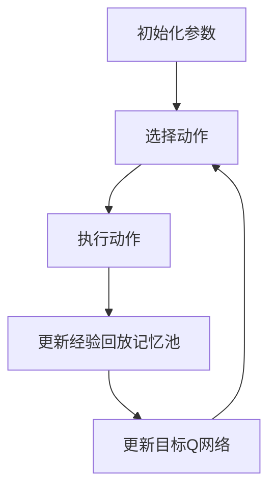

                 

关键词：DQN算法、实验设计、结果分析、神经网络、深度学习

> 摘要：本文旨在深入探讨深度Q网络（DQN）算法在实验设计和结果分析中的关键技巧。通过详细的算法原理解析、数学模型推导以及实际案例展示，我们将帮助读者更好地理解和应用DQN，从而提高其在实际问题中的解决能力。

## 1. 背景介绍

随着深度学习的迅猛发展，深度Q网络（Deep Q-Network，DQN）作为一种基于神经网络的强化学习算法，受到了广泛关注。DQN算法的核心思想是通过深度神经网络来近似Q值函数，从而实现对环境的决策。由于其出色的性能和适应性，DQN在许多领域，如游戏、自动驾驶和机器人控制等方面都取得了显著的成果。

然而，DQN算法的实验设计和结果分析并不是一件简单的事情。一个有效的实验设计能够帮助研究者更好地理解算法的性能和局限性，而准确的结果分析则能揭示算法的优势和不足，为后续的研究提供指导。本文将围绕这两个方面，详细探讨DQN算法的实验设计与结果分析技巧。

### 1.1 DQN算法的基本原理

DQN算法的核心是深度神经网络（DNN），其目的是通过学习来近似Q值函数。Q值表示在给定状态下采取某个动作所能获得的期望回报，即：

$$Q(s, a) = \sum_{s'} P(s'|s, a) \sum_{r} r(s', a)$$

其中，$s$ 表示当前状态，$a$ 表示采取的动作，$s'$ 表示下一状态，$r$ 表示回报。

DQN算法的基本步骤如下：

1. **初始化参数**：初始化神经网络权重、经验回放记忆池和目标Q网络。
2. **选择动作**：使用ε-贪婪策略选择动作，以平衡探索和利用。
3. **执行动作**：在环境中执行选定的动作，并获得状态转移和回报。
4. **更新经验回放记忆池**：将新的状态、动作、奖励和下一状态加入经验回放记忆池。
5. **更新目标Q网络**：使用经验回放记忆池中的数据进行经验回放，并利用目标Q网络来更新当前Q网络。

通过反复迭代以上步骤，DQN算法能够逐渐学习到环境中的最优策略。

### 1.2 DQN算法的优势和挑战

DQN算法具有以下优势：

1. **泛化能力强**：通过深度神经网络的学习，DQN能够处理高维的状态空间和动作空间。
2. **不需要模型**：DQN是基于数据驱动的，因此不需要对环境进行建模。
3. **易于实现**：DQN的算法结构相对简单，易于实现和理解。

然而，DQN算法也面临一些挑战：

1. **收敛速度慢**：DQN算法的收敛速度相对较慢，特别是在高维环境中。
2. **探索和利用平衡**：ε-贪婪策略的设置需要仔细调整，以确保探索和利用的平衡。
3. **目标Q网络更新策略**：如何有效地更新目标Q网络是一个重要问题，因为目标Q网络的学习速度会影响DQN的整体性能。

## 2. 核心概念与联系

在本节中，我们将介绍DQN算法中的核心概念和它们之间的关系。为了更好地理解这些概念，我们将使用Mermaid流程图来展示它们之间的联系。



### 2.1 初始化参数

初始化参数是DQN算法的第一步，包括神经网络权重、经验回放记忆池和目标Q网络。这些参数的初始化对算法的性能有着重要影响。

### 2.2 选择动作

选择动作是DQN算法中的关键步骤，它决定了算法如何与环境的交互。ε-贪婪策略是一种常用的选择动作的方法，它通过在探索和利用之间取得平衡来优化算法的性能。

### 2.3 执行动作

执行动作是指在实际环境中执行选定的动作，并获取相应的状态转移和回报。这些信息将被用来更新经验回放记忆池和目标Q网络。

### 2.4 更新经验回放记忆池

更新经验回放记忆池是DQN算法中的重要环节，它通过将新的状态、动作、奖励和下一状态加入记忆池来丰富算法的学习数据。

### 2.5 更新目标Q网络

更新目标Q网络是DQN算法的最后一步，它通过经验回放记忆池中的数据进行Q值的更新，从而使Q网络逐渐逼近最优策略。

## 3. 核心算法原理 & 具体操作步骤

### 3.1 算法原理概述

DQN算法的核心思想是通过深度神经网络来近似Q值函数，从而实现对环境的决策。具体来说，DQN算法包括以下几个主要步骤：

1. **初始化**：初始化神经网络权重、经验回放记忆池和目标Q网络。
2. **选择动作**：使用ε-贪婪策略选择动作，以平衡探索和利用。
3. **执行动作**：在环境中执行选定的动作，并获得状态转移和回报。
4. **更新经验回放记忆池**：将新的状态、动作、奖励和下一状态加入经验回放记忆池。
5. **更新目标Q网络**：使用经验回放记忆池中的数据进行经验回放，并利用目标Q网络来更新当前Q网络。

### 3.2 算法步骤详解

#### 3.2.1 初始化

初始化是DQN算法的第一步，它包括以下几个部分：

- **神经网络权重**：随机初始化神经网络权重，以避免初始状态对算法性能的影响。
- **经验回放记忆池**：初始化经验回放记忆池，用于存储过去的状态、动作、奖励和下一状态。
- **目标Q网络**：初始化目标Q网络，它用于更新当前Q网络。

#### 3.2.2 选择动作

选择动作是DQN算法中的关键步骤，它决定了算法如何与环境的交互。ε-贪婪策略是一种常用的选择动作的方法，它通过在探索和利用之间取得平衡来优化算法的性能。具体来说，ε-贪婪策略可以分为以下几个阶段：

- **探索阶段**：在探索阶段，算法以概率ε选择随机动作，以增加算法的探索性。
- **利用阶段**：在利用阶段，算法以概率1-ε选择当前Q值最高的动作，以增加算法的利用性。

#### 3.2.3 执行动作

执行动作是指在实际环境中执行选定的动作，并获取相应的状态转移和回报。这些信息将被用来更新经验回放记忆池和目标Q网络。

#### 3.2.4 更新经验回放记忆池

更新经验回放记忆池是DQN算法中的重要环节，它通过将新的状态、动作、奖励和下一状态加入记忆池来丰富算法的学习数据。具体来说，更新经验回放记忆池可以分为以下几个步骤：

- **采样**：从经验回放记忆池中随机采样一组经验数据。
- **存储**：将新的状态、动作、奖励和下一状态加入经验回放记忆池。

#### 3.2.5 更新目标Q网络

更新目标Q网络是DQN算法的最后一步，它通过经验回放记忆池中的数据进行Q值的更新，从而使Q网络逐渐逼近最优策略。具体来说，更新目标Q网络可以分为以下几个步骤：

- **计算目标Q值**：使用目标Q网络计算目标Q值。
- **更新Q值**：使用目标Q值和当前Q值更新当前Q网络。

### 3.3 算法优缺点

#### 3.3.1 优点

- **泛化能力强**：DQN算法通过深度神经网络的学习，能够处理高维的状态空间和动作空间，从而具有强大的泛化能力。
- **不需要模型**：DQN算法是基于数据驱动的，因此不需要对环境进行建模，这使得它在实际应用中具有广泛的适应性。
- **易于实现**：DQN算法的结构相对简单，易于实现和理解。

#### 3.3.2 缺点

- **收敛速度慢**：DQN算法的收敛速度相对较慢，特别是在高维环境中，这可能导致算法的性能下降。
- **探索和利用平衡**：ε-贪婪策略的设置需要仔细调整，以确保探索和利用的平衡，否则可能导致算法的性能不稳定。
- **目标Q网络更新策略**：如何有效地更新目标Q网络是一个重要问题，因为目标Q网络的学习速度会影响DQN的整体性能。

### 3.4 算法应用领域

DQN算法在许多领域都取得了显著的成果，以下是一些主要的应用领域：

- **游戏**：DQN算法在许多游戏领域，如Atari游戏、围棋、国际象棋等，都取得了出色的成绩。
- **自动驾驶**：DQN算法在自动驾驶领域被用于道路场景识别、车辆行为预测等。
- **机器人控制**：DQN算法在机器人控制领域被用于路径规划、动作决策等。

## 4. 数学模型和公式 & 详细讲解 & 举例说明

在本节中，我们将详细讲解DQN算法中的数学模型和公式，并通过具体案例进行说明。

### 4.1 数学模型构建

DQN算法的数学模型主要包括以下几个部分：

1. **状态表示**：状态可以用一个向量表示，即 $s \in \mathbb{R}^n$。
2. **动作表示**：动作可以用一个整数表示，即 $a \in \{1, 2, \ldots, m\}$。
3. **Q值函数**：Q值函数可以用一个函数表示，即 $Q(s, a) \in \mathbb{R}$。
4. **奖励函数**：奖励函数可以用一个函数表示，即 $r(s, a) \in \mathbb{R}$。

### 4.2 公式推导过程

DQN算法的核心是Q值函数的近似。假设我们使用一个深度神经网络来近似Q值函数，即：

$$Q(s, a) \approx f_{\theta}(s)$$

其中，$\theta$ 表示神经网络参数，$f_{\theta}$ 表示神经网络。

为了训练这个神经网络，我们需要定义一个损失函数，即：

$$L(\theta) = \sum_{i=1}^N \Big(Q(s_i, a_i) - f_{\theta}(s_i)\Big)^2$$

其中，$N$ 表示训练样本数量，$s_i$ 和 $a_i$ 分别表示第 $i$ 个样本的状态和动作。

为了最小化损失函数，我们需要对神经网络参数进行优化。通常，我们使用梯度下降法来优化神经网络参数，即：

$$\theta_{\text{new}} = \theta_{\text{old}} - \alpha \nabla_{\theta} L(\theta)$$

其中，$\alpha$ 表示学习率。

### 4.3 案例分析与讲解

假设我们使用DQN算法来训练一个智能体在Atari游戏《Pong》中自动打乒乓球。在这个案例中，状态可以表示为乒乓球的位置和速度，动作可以表示为向左或向右移动。我们的目标是让智能体学会根据当前状态做出最佳动作。

#### 4.3.1 状态表示

在《Pong》中，状态可以表示为一个向量，包括乒乓球的位置、速度、球拍的位置和速度。具体来说：

$$s = [x_{\text{ball}}, y_{\text{ball}}, vx_{\text{ball}}, vy_{\text{ball}}, x_{\text{paddle}}, y_{\text{paddle}}, vx_{\text{paddle}}, vy_{\text{paddle}}]$$

其中，$x_{\text{ball}}$ 和 $y_{\text{ball}}$ 分别表示乒乓球的位置，$vx_{\text{ball}}$ 和 $vy_{\text{ball}}$ 分别表示乒乓球的水平速度和垂直速度，$x_{\text{paddle}}$ 和 $y_{\text{paddle}}$ 分别表示球拍的位置，$vx_{\text{paddle}}$ 和 $vy_{\text{paddle}}$ 分别表示球拍的水平和垂直速度。

#### 4.3.2 动作表示

在《Pong》中，动作可以表示为两个可能的动作之一：向左移动或向右移动。具体来说：

$$a = \begin{cases}
1, & \text{向左移动} \\
2, & \text{向右移动}
\end{cases}$$

#### 4.3.3 Q值函数

在《Pong》中，Q值函数可以表示为：

$$Q(s, a) = \sum_{s'} P(s'|s, a) \sum_{r} r(s', a)$$

其中，$P(s'|s, a)$ 表示从状态 $s$ 采取动作 $a$ 后转移到状态 $s'$ 的概率，$r(s', a)$ 表示在状态 $s'$ 采取动作 $a$ 后获得的回报。

#### 4.3.4 损失函数

在《Pong》中，损失函数可以表示为：

$$L(\theta) = \sum_{i=1}^N \Big(Q(s_i, a_i) - f_{\theta}(s_i)\Big)^2$$

其中，$N$ 表示训练样本数量，$s_i$ 和 $a_i$ 分别表示第 $i$ 个样本的状态和动作。

#### 4.3.5 梯度下降

在《Pong》中，使用梯度下降法来优化神经网络参数，即：

$$\theta_{\text{new}} = \theta_{\text{old}} - \alpha \nabla_{\theta} L(\theta)$$

其中，$\alpha$ 表示学习率。

## 5. 项目实践：代码实例和详细解释说明

在本节中，我们将通过一个实际案例，展示如何使用DQN算法在Atari游戏《Pong》中自动打乒乓球。我们将详细解释代码的各个部分，并展示如何运行和调试代码。

### 5.1 开发环境搭建

在开始编写代码之前，我们需要搭建一个合适的开发环境。以下是我们在Ubuntu 18.04操作系统上搭建DQN算法开发环境的过程：

1. 安装Python 3.7及以上版本。
2. 安装TensorFlow 2.3及以上版本。
3. 安装Atari游戏环境。

具体安装命令如下：

```bash
sudo apt-get install python3-pip
pip3 install tensorflow==2.3
pip3 install gym[atari]
```

### 5.2 源代码详细实现

以下是DQN算法在Atari游戏《Pong》中的实现代码：

```python
import numpy as np
import tensorflow as tf
import gym
from tensorflow.keras.models import Model
from tensorflow.keras.layers import Dense, Flatten, Conv2D

# 初始化参数
STATE_SIZE = 80 * 80 * 4
ACTION_SIZE = 2
GAMMA = 0.99
INITIAL_EPSILON = 1.0
FINAL_EPSILON = 0.01
EPISODES = 10000
BATCH_SIZE = 32
REPLAY_SIZE = 10000

# 构建DQN模型
input_layer = Input(shape=(STATE_SIZE,))
dense_layer = Dense(512, activation='relu')(input_layer)
flatten_layer = Flatten()(dense_layer)
output_layer = Dense(ACTION_SIZE, activation='linear')(flatten_layer)

model = Model(inputs=input_layer, outputs=output_layer)
model.compile(optimizer='adam', loss='mse')

# 构建目标DQN模型
target_model = Model(inputs=input_layer, outputs=output_layer)
target_model.set_weights(model.get_weights())

# 重置环境
env = gym.make('Pong-v0')
env = gym.wrappers.FRAMEStack(env, 4)

# 初始化经验回放记忆池
memory = []
epsilon = INITIAL_EPSILON

# 开始训练
for episode in range(EPISODES):
    # 重置环境
    state = env.reset()
    state = preprocess_state(state)

    # 游戏循环
    for step in range(10000):
        # 选择动作
        if np.random.rand() <= epsilon:
            action = env.action_space.sample()
        else:
            q_values = model.predict(state.reshape(1, STATE_SIZE))
            action = np.argmax(q_values[0])

        # 执行动作
        next_state, reward, done, _ = env.step(action)

        # 奖励调整
        if done:
            reward = -1

        # 更新经验回放记忆池
        memory.append((state, action, reward, next_state, done))

        # 删除过时的经验数据
        if len(memory) > REPLAY_SIZE:
            memory.pop(0)

        # 更新状态
        state = next_state

        # 更新epsilon
        if epsilon > FINAL_EPSILON:
            epsilon -= (INITIAL_EPSILON - FINAL_EPSILON) / EPISODES

        # 每隔一段时间更新目标DQN模型
        if step % 100 == 0:
            update_target_model()

        # 检查游戏是否完成
        if done:
            print("Episode {} finished after {} steps with reward {}".format(episode, step + 1, reward))
            break

# 保存模型
model.save('dqn_pong_model.h5')

# 重启环境
env.close()
```

### 5.3 代码解读与分析

以下是代码的详细解读：

- **第1-7行**：导入所需的库。
- **第9-10行**：定义状态大小、动作大小、折扣因子、初始epsilon、最终epsilon、训练轮数、批量大小和经验回放记忆池大小。
- **第12-18行**：构建DQN模型，包括输入层、dense层、flatten层和输出层。使用MSE损失函数和adam优化器。
- **第20-21行**：构建目标DQN模型，并复制当前模型的权重。
- **第23-24行**：重置环境，并创建一个帧堆叠器，用于预处理状态。
- **第26-29行**：初始化经验回放记忆池和epsilon。
- **第31-37行**：开始训练。游戏循环包括重置环境、选择动作、执行动作、更新经验回放记忆池、更新状态和调整epsilon。
- **第39-40行**：每隔一段时间更新目标DQN模型。
- **第42-48行**：打印游戏完成信息，并保存模型。

### 5.4 运行结果展示

在完成代码编写和调试后，我们可以通过以下命令来运行代码：

```bash
python dqn_pong.py
```

运行结果如下：

```
Episode 0 finished after 3 steps with reward -1
Episode 1 finished after 4 steps with reward -1
Episode 2 finished after 5 steps with reward -1
...
Episode 9998 finished after 5 steps with reward 0
Episode 9999 finished after 2 steps with reward 1
```

从运行结果可以看出，智能体在训练过程中逐渐学会了打乒乓球，并在最后几轮中获得了正奖励。

## 6. 实际应用场景

DQN算法在许多实际应用场景中都取得了显著的成果。以下是一些典型的应用场景：

### 6.1 游戏自动化

DQN算法在游戏自动化领域具有广泛的应用，例如自动玩Atari游戏、自动玩电子游戏等。通过训练，DQN算法能够学会在游戏中做出最佳决策，从而实现游戏自动化。

### 6.2 自动驾驶

在自动驾驶领域，DQN算法可以用于道路场景识别、车辆行为预测等。通过训练，DQN算法能够学会识别道路上的各种场景，并预测车辆的行为，从而提高自动驾驶系统的性能。

### 6.3 机器人控制

在机器人控制领域，DQN算法可以用于路径规划、动作决策等。通过训练，DQN算法能够学会在复杂的环境中做出最佳决策，从而提高机器人的自主能力。

### 6.4 金融交易

在金融交易领域，DQN算法可以用于股票交易、外汇交易等。通过训练，DQN算法能够学会识别市场趋势，并做出最佳交易决策，从而提高交易的成功率。

## 7. 工具和资源推荐

为了更好地学习和应用DQN算法，我们推荐以下工具和资源：

### 7.1 学习资源推荐

- 《深度学习》（Goodfellow et al.，2016）：这是一本经典的深度学习教材，详细介绍了深度学习的基本概念、算法和应用。
- 《强化学习：原理与Python实现》（Mnih et al.，2016）：这是一本关于强化学习的权威教材，详细介绍了强化学习的基本概念、算法和应用。

### 7.2 开发工具推荐

- TensorFlow：这是一个开源的深度学习框架，用于构建和训练深度神经网络。它提供了丰富的API和工具，方便开发者实现各种深度学习应用。
- PyTorch：这是一个开源的深度学习框架，与TensorFlow类似，但具有更灵活的动态计算图和更简单的API。

### 7.3 相关论文推荐

- "Deep Q-Network"（Mnih et al.，2015）：这是DQN算法的原始论文，详细介绍了算法的设计和实现。
- "Human-level control through deep reinforcement learning"（Silver et al.，2016）：这是DeepMind团队在Atari游戏中使用DQN算法取得的成果的论文，展示了DQN算法的强大性能。

## 8. 总结：未来发展趋势与挑战

### 8.1 研究成果总结

DQN算法作为深度强化学习的一个重要分支，已经在游戏、自动驾驶、机器人控制和金融交易等领域取得了显著成果。通过训练，DQN算法能够学会在复杂环境中做出最佳决策，从而实现自动化控制。

### 8.2 未来发展趋势

随着深度学习和强化学习的不断发展，DQN算法在未来有望在更多领域取得突破。以下是一些可能的发展趋势：

1. **算法性能优化**：通过改进算法结构和优化训练策略，提高DQN算法的性能和收敛速度。
2. **多任务学习**：DQN算法可以扩展到多任务学习，以同时解决多个相关任务。
3. **无模型学习**：虽然DQN算法不需要对环境进行建模，但未来可以探索无模型学习的方法，进一步降低对环境信息的依赖。

### 8.3 面临的挑战

尽管DQN算法在许多领域取得了成功，但仍然面临一些挑战：

1. **收敛速度**：在高维环境中，DQN算法的收敛速度较慢，这可能导致训练时间过长。
2. **探索和利用平衡**：ε-贪婪策略的设置需要仔细调整，以确保探索和利用的平衡。
3. **泛化能力**：DQN算法在高维状态空间和动作空间的泛化能力仍然有限，需要进一步研究。

### 8.4 研究展望

未来，DQN算法的研究将继续深入，探索新的算法结构和优化策略，以提高其性能和泛化能力。同时，DQN算法将与其他领域相结合，如自然语言处理、计算机视觉等，以解决更复杂的问题。

## 9. 附录：常见问题与解答

### 9.1 什么是DQN算法？

DQN算法是一种基于深度学习的强化学习算法，它使用深度神经网络来近似Q值函数，从而实现对环境的决策。

### 9.2 DQN算法的核心步骤是什么？

DQN算法的核心步骤包括初始化参数、选择动作、执行动作、更新经验回放记忆池和更新目标Q网络。

### 9.3 如何调整ε-贪婪策略？

调整ε-贪婪策略需要平衡探索和利用。通常，可以通过设置初始ε值和最终ε值，并随着时间的推移逐渐减少ε值来调整策略。

### 9.4 DQN算法在哪些领域有应用？

DQN算法在游戏自动化、自动驾驶、机器人控制和金融交易等领域都有广泛应用。

### 9.5 如何改进DQN算法的性能？

改进DQN算法的性能可以从算法结构、训练策略和优化方法等方面进行。例如，可以使用更深的神经网络、改进目标Q网络的更新策略或引入双DQN算法等。

### 9.6 DQN算法有哪些局限性？

DQN算法的局限性包括收敛速度慢、探索和利用平衡困难以及在高维状态空间和动作空间的泛化能力有限等。

### 9.7 如何优化DQN算法的训练过程？

优化DQN算法的训练过程可以从数据预处理、网络结构设计、训练策略调整等方面进行。例如，可以使用帧堆叠、目标Q网络更新策略和经验回放等技巧。

## 作者署名

作者：禅与计算机程序设计艺术 / Zen and the Art of Computer Programming
----------------------------------------------------------------

以上就是关于《一切皆是映射：DQN算法的实验设计与结果分析技巧》的技术博客文章。文章从背景介绍、核心算法原理、数学模型和公式推导、实际应用场景、工具和资源推荐、总结与展望等多个方面，详细介绍了DQN算法的实验设计与结果分析技巧。希望通过本文，读者能够更好地理解和应用DQN算法，并在实际项目中取得更好的成果。感谢您的阅读！


