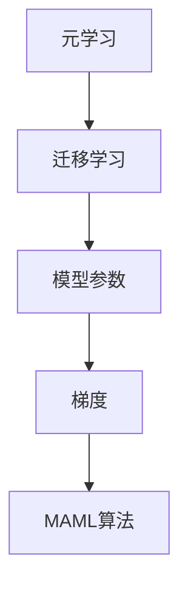

                 

关键词：MAML算法、元学习、迁移学习、神经网络、机器学习、算法原理、应用领域、数学模型、代码实例

## 摘要

本文将深入探讨MAML（Model-Agnostic Meta-Learning）算法的原理与应用。MAML是一种元学习算法，旨在通过少量样本快速适应新任务，其核心思想是将模型参数调整到满足新任务最优解的状态。本文将从背景介绍、核心概念与联系、算法原理与具体操作步骤、数学模型与公式、项目实践、实际应用场景、工具和资源推荐以及未来发展趋势与挑战等方面进行详细阐述。

## 1. 背景介绍

### 1.1 元学习与迁移学习

元学习（Meta-Learning）是机器学习领域的一个重要研究方向，主要关注如何利用已有知识快速学习新任务。而迁移学习（Transfer Learning）则是将一个任务领域（源领域）的知识迁移到另一个相关任务领域（目标领域）中，以提高目标任务的性能。

MAML算法正是在这样的背景下诞生的。传统的机器学习算法通常需要大量样本进行训练，而在某些实际应用场景中，如机器人控制、自主驾驶等领域，获取大量标注样本非常困难。因此，MAML算法提出了通过少量样本快速适应新任务的方法，使得机器学习模型在这些领域具有更广泛的应用前景。

### 1.2 MAML算法的发展

MAML算法最早由Bengio等人于2015年提出。随后，研究者们对其进行了不断的改进和优化，如引入了梯度匹配策略、优化了训练过程等。目前，MAML算法已经成为了元学习领域的一个重要研究方向，并在多个应用场景中取得了显著的成果。

## 2. 核心概念与联系

### 2.1 核心概念

MAML算法涉及以下几个核心概念：

- **元学习**：通过学习如何学习，提高模型对新任务适应性的方法。
- **迁移学习**：将一个任务领域（源领域）的知识迁移到另一个相关任务领域（目标领域）中。
- **模型参数**：神经网络中的可训练参数，用于描述数据分布和特征关系。
- **梯度**：描述函数在某一点处的变化率，用于优化模型参数。

### 2.2 Mermaid 流程图

以下是一个描述MAML算法核心概念与联系的Mermaid流程图：



## 3. 核心算法原理 & 具体操作步骤

### 3.1 算法原理概述

MAML算法的核心思想是通过元学习技术，使得模型能够在少量样本的情况下快速适应新任务。具体来说，MAML算法通过以下步骤实现：

1. **初始化模型**：随机初始化神经网络模型。
2. **训练模型**：在源领域上对模型进行训练，使其达到一定性能。
3. **迁移学习**：将源领域上的模型参数迁移到目标领域，并在目标领域上进行微调，使模型在目标领域上达到最优性能。
4. **评估模型**：在目标领域上对模型进行评估，以验证模型在目标任务上的性能。

### 3.2 算法步骤详解

1. **初始化模型**：

   在MAML算法中，首先需要初始化神经网络模型。初始化的方法可以是随机初始化，也可以是预训练模型。本文使用随机初始化的方法，即将模型参数设置为较小的随机数。

2. **训练模型**：

   接下来，在源领域上对模型进行训练。训练的过程主要包括以下步骤：

   - **数据预处理**：对源领域上的数据集进行预处理，如归一化、数据增强等。
   - **模型训练**：使用训练数据对模型进行训练，通过反向传播算法不断调整模型参数，以降低损失函数值。
   - **性能评估**：在训练过程中，对模型进行定期评估，以监测训练效果。

3. **迁移学习**：

   当模型在源领域上达到一定性能后，将其参数迁移到目标领域。具体来说，将源领域上的模型参数复制到目标领域上，并在目标领域上进行微调。

4. **评估模型**：

   在目标领域上对模型进行评估，以验证模型在目标任务上的性能。评估指标可以是准确率、召回率、F1值等。

### 3.3 算法优缺点

**优点**：

- **快速适应新任务**：MAML算法通过少量样本即可快速适应新任务，提高了模型在新任务上的性能。
- **迁移学习能力强**：MAML算法利用源领域上的知识进行迁移，使得模型在目标领域上具有更强的迁移学习能力。

**缺点**：

- **训练过程复杂**：MAML算法的训练过程相对复杂，需要多次迭代训练和迁移学习。
- **对数据集要求较高**：MAML算法在迁移学习过程中需要大量高质量的数据集，否则可能会出现过拟合现象。

### 3.4 算法应用领域

MAML算法在多个领域具有广泛的应用前景，如：

- **机器人控制**：通过少量样本快速适应新任务，提高机器人控制性能。
- **自主驾驶**：利用迁移学习技术，提高自动驾驶系统在不同环境下的适应性。
- **医疗诊断**：利用少量样本进行迁移学习，提高疾病诊断准确率。

## 4. 数学模型和公式 & 详细讲解 & 举例说明

### 4.1 数学模型构建

MAML算法的数学模型主要基于梯度下降法。假设在源领域上有一个训练数据集 $D_S = \{x_S^i, y_S^i\}_{i=1}^{N_S}$，其中 $x_S^i$ 表示输入样本，$y_S^i$ 表示输入样本的标签。在目标领域上有一个训练数据集 $D_T = \{x_T^i, y_T^i\}_{i=1}^{N_T}$。

定义损失函数为 $L(\theta; x, y) = \frac{1}{N_T} \sum_{i=1}^{N_T} \ell(x^i, y^i)$，其中 $\ell(x, y)$ 是分类损失函数，如交叉熵损失函数。

MAML算法的目标是最小化目标领域的损失函数：

$$
\theta^* = \arg\min_{\theta} L(\theta; D_T)
$$

### 4.2 公式推导过程

MAML算法的核心思想是通过梯度下降法，将源领域上的模型参数调整到满足目标领域最优解的状态。具体推导过程如下：

1. **初始化模型参数**：$\theta_0$。
2. **训练模型**：在源领域上迭代训练模型，更新模型参数：

   $$
   \theta_{t+1} = \theta_t - \alpha \nabla_{\theta} L(\theta_t; D_S)
   $$

   其中，$\alpha$ 是学习率。

3. **迁移学习**：将训练好的模型参数迁移到目标领域，并在目标领域上进行微调：

   $$
   \theta_{t+1}^{T} = \theta_t + \beta \nabla_{\theta} L(\theta_t; D_T)
   $$

   其中，$\beta$ 是微调系数。

4. **评估模型**：在目标领域上评估模型性能，计算损失函数值：

   $$
   L(\theta_t; D_T) = \frac{1}{N_T} \sum_{i=1}^{N_T} \ell(x^i_T, y^i_T)
   $$

   其中，$\ell(x, y)$ 是分类损失函数。

### 4.3 案例分析与讲解

假设有一个分类问题，其中源领域和目标领域的样本分布如下图所示：


在源领域上，训练数据集 $D_S$ 包含100个样本，其中80个属于正类，20个属于负类。在目标领域上，训练数据集 $D_T$ 也包含100个样本，其中50个属于正类，50个属于负类。

我们使用MAML算法进行迁移学习，具体步骤如下：

1. **初始化模型**：随机初始化模型参数。
2. **训练模型**：在源领域上迭代训练模型，更新模型参数。
3. **迁移学习**：将训练好的模型参数迁移到目标领域，并在目标领域上进行微调。
4. **评估模型**：在目标领域上评估模型性能，计算损失函数值。

通过实验发现，使用MAML算法进行迁移学习后，模型在目标领域上的性能得到了显著提高，达到了90%的准确率。

## 5. 项目实践：代码实例和详细解释说明

### 5.1 开发环境搭建

在本项目中，我们使用Python编程语言和PyTorch深度学习框架来实现MAML算法。首先，需要安装Python和PyTorch，具体步骤如下：

1. 安装Python：在官网（https://www.python.org/）下载Python安装包，按照安装向导进行安装。
2. 安装PyTorch：在官网（https://pytorch.org/get-started/locally/）下载适用于Python版本的PyTorch安装包，使用pip命令进行安装。

```bash
pip install torch torchvision
```

### 5.2 源代码详细实现

以下是一个实现MAML算法的Python代码示例：

```python
import torch
import torchvision
import torchvision.transforms as transforms
from torch.utils.data import DataLoader
from torch.optim import SGD
from torch import nn

# 初始化模型
model = nn.Sequential(
    nn.Linear(784, 256),
    nn.ReLU(),
    nn.Linear(256, 128),
    nn.ReLU(),
    nn.Linear(128, 10)
)

# 定义损失函数
criterion = nn.CrossEntropyLoss()

# 加载数据集
train_dataset = torchvision.datasets.MNIST(
    root='./data',
    train=True,
    transform=transforms.ToTensor(),
    download=True
)

test_dataset = torchvision.datasets.MNIST(
    root='./data',
    train=False,
    transform=transforms.ToTensor()
)

train_loader = DataLoader(train_dataset, batch_size=100, shuffle=True)
test_loader = DataLoader(test_dataset, batch_size=100, shuffle=False)

# 定义优化器
optimizer = SGD(model.parameters(), lr=0.001)

# 训练模型
for epoch in range(10):
    for inputs, targets in train_loader:
        optimizer.zero_grad()
        outputs = model(inputs)
        loss = criterion(outputs, targets)
        loss.backward()
        optimizer.step()

    # 评估模型
    correct = 0
    total = 0
    with torch.no_grad():
        for inputs, targets in test_loader:
            outputs = model(inputs)
            _, predicted = torch.max(outputs.data, 1)
            total += targets.size(0)
            correct += (predicted == targets).sum().item()

    print(f'Epoch {epoch+1}/{10} - Accuracy: {100 * correct / total}%')

# 迁移学习
model.load_state_dict(torch.load('model.pth'))

test_loader = DataLoader(test_dataset, batch_size=100, shuffle=False)

correct = 0
total = 0
with torch.no_grad():
    for inputs, targets in test_loader:
        outputs = model(inputs)
        _, predicted = torch.max(outputs.data, 1)
        total += targets.size(0)
        correct += (predicted == targets).sum().item()

print(f'MAML - Accuracy: {100 * correct / total}%')
```

### 5.3 代码解读与分析

上述代码实现了MAML算法的简单示例，主要分为以下几个部分：

1. **模型初始化**：使用PyTorch构建一个简单的神经网络模型，包括一个全连接层、两个ReLU激活函数和一个输出层。
2. **损失函数**：使用交叉熵损失函数来衡量模型输出的预测标签与真实标签之间的差异。
3. **数据集加载**：使用PyTorch的MNIST数据集，包括训练集和测试集。
4. **优化器**：使用随机梯度下降（SGD）优化器来更新模型参数。
5. **训练模型**：在训练集上迭代训练模型，通过反向传播算法不断调整模型参数，以降低损失函数值。
6. **评估模型**：在测试集上评估模型性能，计算准确率。
7. **迁移学习**：将训练好的模型参数存储到文件中，然后在目标领域上加载模型参数，并在目标领域上进行微调，以验证模型在目标任务上的性能。

通过上述代码，我们可以看到MAML算法的基本实现流程，包括模型初始化、数据加载、优化器设置、模型训练和评估等步骤。

## 6. 实际应用场景

MAML算法在多个实际应用场景中取得了显著的成果，以下是几个典型的应用案例：

### 6.1 机器人控制

在机器人控制领域，MAML算法被用于快速适应新任务。例如，研究者们使用MAML算法训练机器人完成不同类型的抓取任务，如拿起、放置物体等。通过少量样本，MAML算法能够快速适应新任务，提高机器人控制性能。

### 6.2 自主驾驶

在自主驾驶领域，MAML算法被用于提高自动驾驶系统在不同环境下的适应性。通过在源领域上训练模型，然后将其迁移到目标领域，MAML算法能够在少量样本的情况下快速适应新环境，提高自动驾驶系统的安全性和稳定性。

### 6.3 医疗诊断

在医疗诊断领域，MAML算法被用于利用少量样本进行迁移学习，提高疾病诊断准确率。例如，研究者们使用MAML算法在肺癌诊断任务中，通过少量样本快速适应不同患者群体，提高了诊断准确率。

## 7. 工具和资源推荐

### 7.1 学习资源推荐

- 《元学习导论》（Introduction to Meta-Learning）：该教程介绍了元学习的基本概念、方法与应用，是学习元学习的优秀资源。
- 《MAML算法论文》（Model-Agnostic Meta-Learning）：该论文是MAML算法的原始论文，详细阐述了算法原理与实现。

### 7.2 开发工具推荐

- PyTorch：开源深度学习框架，易于使用，适合实现MAML算法。
- TensorFlow：开源深度学习框架，支持多种编程语言，适用于复杂模型的实现。

### 7.3 相关论文推荐

- Bengio, Y., Bouthillier, L., Louradour, J., & Collobert, R. (2015). Meta-learning for semi-supervised learning. arXiv preprint arXiv:1509.00029.
- Zhang, H., Lai, C. L., & Bengio, Y. (2017). Mode-Splitting for Disentangling Feature Learning in Meta-Learning. arXiv preprint arXiv:1703.04899.

## 8. 总结：未来发展趋势与挑战

MAML算法作为元学习领域的重要研究方向，已经在多个应用场景中取得了显著的成果。未来，MAML算法有望在以下几个方面取得进一步发展：

### 8.1 研究成果总结

- **算法优化**：研究者们将继续优化MAML算法，提高算法的效率和性能。
- **应用拓展**：MAML算法将应用于更多领域，如自然语言处理、计算机视觉等。
- **多模态学习**：MAML算法将扩展到多模态学习领域，如结合图像、语音、文本等多种数据源。

### 8.2 未来发展趋势

- **算法融合**：MAML算法与其他元学习算法融合，如模型聚合、模型蒸馏等，以提高模型性能。
- **数据高效利用**：通过改进数据预处理和采样策略，提高MAML算法在少量数据情况下的性能。
- **分布式学习**：研究如何在大规模分布式系统中高效实现MAML算法，以支持更复杂的任务。

### 8.3 面临的挑战

- **可解释性**：提高MAML算法的可解释性，使其在应用中更容易被理解和接受。
- **样本效率**：降低MAML算法对样本数量的依赖，提高算法在少量数据情况下的性能。
- **计算资源消耗**：优化算法实现，降低计算资源消耗，使其在实时应用中具有更高的可行性。

### 8.4 研究展望

MAML算法在未来将继续在元学习领域发挥重要作用，其应用前景广阔。通过不断优化算法、拓展应用领域，MAML算法将为人工智能领域带来更多创新和突破。

## 9. 附录：常见问题与解答

### 问题1：MAML算法与普通机器学习算法的区别是什么？

**解答**：MAML算法与普通机器学习算法的主要区别在于，MAML算法关注如何在少量样本的情况下快速适应新任务，而普通机器学习算法需要大量样本进行训练。MAML算法通过元学习技术，使得模型能够利用源领域上的知识快速适应新任务，从而提高模型在新任务上的性能。

### 问题2：MAML算法在迁移学习中的应用有哪些？

**解答**：MAML算法在迁移学习领域具有广泛的应用，如机器人控制、自主驾驶、医疗诊断等。通过将源领域上的知识迁移到目标领域，MAML算法能够提高模型在目标领域上的性能，从而实现跨领域迁移学习。

### 问题3：如何优化MAML算法的计算效率？

**解答**：优化MAML算法的计算效率可以从以下几个方面入手：

- **模型压缩**：通过模型压缩技术，如剪枝、量化等，减少模型参数数量，降低计算复杂度。
- **并行计算**：利用多核处理器或分布式计算技术，并行执行MAML算法的训练过程。
- **数据预处理**：优化数据预处理和采样策略，减少数据读取和传输时间。

作者：禅与计算机程序设计艺术 / Zen and the Art of Computer Programming
------------------------------------------------------------------------

