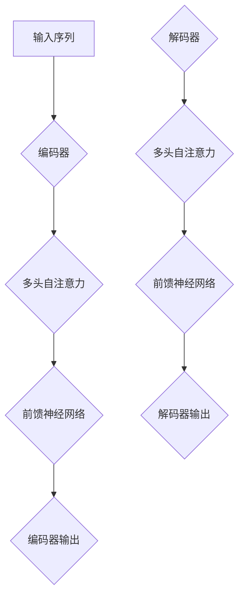

                 

关键词：Transformer，神经网络，自然语言处理，序列到序列模型，深度学习，自动编码器，编码器-解码器架构，BERT，GPT，AI

摘要：本文旨在全面解析Transformer架构，深入探讨其核心概念、数学模型、具体实现和应用场景。作为自然语言处理领域的革命性架构，Transformer以其独特的序列到序列建模方式和高效的处理能力，逐渐取代了传统的循环神经网络（RNN）。通过本文，读者将了解到Transformer的原理、优势及其在深度学习、自然语言处理等领域的广泛应用。

## 1. 背景介绍

在深度学习领域，神经网络已经成为解决各种复杂问题的有力工具。然而，在自然语言处理（NLP）领域，神经网络的表现却并不尽如人意。传统的循环神经网络（RNN）和长短期记忆网络（LSTM）虽然能够处理序列数据，但存在诸多问题，如梯度消失、梯度爆炸、难以并行计算等。为了克服这些问题，Google提出了Transformer架构，这是一种基于自注意力机制的序列到序列模型。

Transformer架构的出现，标志着NLP领域的一个重大转折点。与传统神经网络相比，Transformer具有以下优点：

1. **并行计算**：Transformer采用了自注意力机制，使得模型可以并行处理输入序列，从而大大提高了计算效率。
2. **长距离依赖**：通过多头自注意力机制，Transformer能够捕捉到输入序列中的长距离依赖关系，从而提高模型的表示能力。
3. **灵活性好**：Transformer的设计使得它可以很容易地扩展到不同的任务和领域，如机器翻译、文本分类、问答系统等。

## 2. 核心概念与联系

### 2.1 自注意力机制（Self-Attention）

自注意力机制是Transformer架构的核心，它允许模型在处理序列数据时，根据当前位置的信息对其他位置的信息进行加权。这种机制使得模型能够自适应地关注输入序列中的重要信息，从而提高模型的表示能力。

### 2.2 编码器-解码器架构（Encoder-Decoder Architecture）

编码器-解码器架构是Transformer架构的基础，它由编码器（Encoder）和解码器（Decoder）两部分组成。编码器负责将输入序列编码为固定长度的向量表示，解码器则根据编码器的输出和已生成的部分输出，生成新的输出。

### 2.3 Multi-Head Attention

多头注意力（Multi-Head Attention）是Transformer架构中的另一个关键概念。它通过多个独立的自注意力机制，共同处理输入序列，从而捕捉到更加丰富的信息。

### 2.4 Mermaid 流程图

以下是一个简化的Mermaid流程图，展示了Transformer架构的核心概念和联系：



## 3. 核心算法原理 & 具体操作步骤

### 3.1 算法原理概述

Transformer架构的核心算法是自注意力机制（Self-Attention）。自注意力机制通过计算输入序列中每个位置与其他位置之间的相似性，对输入序列进行加权，从而生成新的表示。

### 3.2 算法步骤详解

1. **输入序列编码**：将输入序列编码为嵌入向量（Embedding Vector）。
2. **多头自注意力**：计算每个嵌入向量与其他嵌入向量之间的相似性，并对其进行加权。
3. **前馈神经网络**：对加权后的嵌入向量进行前馈神经网络处理，增加模型的非线性能力。
4. **编码器输出**：将处理后的嵌入向量作为编码器的输出。
5. **解码器步骤**：重复上述步骤，但输入为编码器的输出和解码器的前一个输出。
6. **解码器输出**：最终生成解码器的输出，即模型的预测结果。

### 3.3 算法优缺点

**优点**：

1. **并行计算**：Transformer架构可以并行处理输入序列，提高了计算效率。
2. **长距离依赖**：多头自注意力机制能够捕捉到输入序列中的长距离依赖关系。
3. **灵活性**：Transformer架构可以很容易地扩展到不同的任务和领域。

**缺点**：

1. **计算量大**：由于自注意力机制的计算复杂度较高，Transformer架构的计算量较大。
2. **参数较多**：Transformer架构的参数数量较多，导致模型训练时间较长。

### 3.4 算法应用领域

Transformer架构在自然语言处理领域得到了广泛应用，如：

1. **机器翻译**：Transformer架构在机器翻译任务中表现出色，取代了传统的循环神经网络。
2. **文本分类**：Transformer架构可以用于文本分类任务，如情感分析、主题分类等。
3. **问答系统**：Transformer架构可以用于构建问答系统，如基于BERT的问答系统。

## 4. 数学模型和公式 & 详细讲解 & 举例说明

### 4.1 数学模型构建

Transformer架构的数学模型主要包括以下部分：

1. **嵌入层（Embedding Layer）**：将输入序列编码为嵌入向量（Embedding Vector）。
2. **自注意力层（Self-Attention Layer）**：计算每个嵌入向量与其他嵌入向量之间的相似性，并对其进行加权。
3. **前馈神经网络层（Feedforward Neural Network Layer）**：对加权后的嵌入向量进行前馈神经网络处理。
4. **编码器-解码器层（Encoder-Decoder Layer）**：将编码器的输出作为解码器的输入，生成解码器的输出。

### 4.2 公式推导过程

1. **嵌入层**：

   输入序列 $x$ 被编码为嵌入向量 $e$：

   $$ e = W_e \cdot x $$

   其中，$W_e$ 是嵌入矩阵。

2. **自注意力层**：

   自注意力机制计算每个嵌入向量 $e_i$ 与其他嵌入向量 $e_j$ 之间的相似性，并通过softmax函数进行加权：

   $$ \text{Attention}(e_1, e_2, ..., e_n) = \text{softmax}\left(\frac{Qe_1}{\sqrt{d_k}}, \frac{Qe_2}{\sqrt{d_k}}, ..., \frac{Qe_n}{\sqrt{d_k}}\right) $$

   其中，$Q$ 是查询矩阵，$K$ 是关键矩阵，$V$ 是值矩阵，$d_k$ 是每个嵌入向量的维度。

3. **前馈神经网络层**：

   加权后的嵌入向量通过前馈神经网络进行处理：

   $$ f(x) = \text{ReLU}\left(W_2 \cdot \text{ReLU}(W_1 \cdot x + b_1)\right) + b_2 $$

   其中，$W_1$ 和 $W_2$ 是前馈神经网络的权重矩阵，$b_1$ 和 $b_2$ 是偏置向量。

4. **编码器-解码器层**：

   编码器的输出作为解码器的输入，通过自注意力和前馈神经网络进行处理，生成解码器的输出：

   $$ y = \text{Attention}(x, x) + f(x) $$

### 4.3 案例分析与讲解

假设有一个简单的输入序列 $x = [1, 2, 3, 4, 5]$，我们将使用上述数学模型对其进行处理。

1. **嵌入层**：

   假设嵌入矩阵 $W_e$ 为：

   $$ W_e = \begin{bmatrix} 1 & 0 & 1 \\ 0 & 1 & 0 \\ 1 & 1 & 0 \end{bmatrix} $$

   输入序列 $x$ 被编码为嵌入向量 $e$：

   $$ e = W_e \cdot x = \begin{bmatrix} 1 & 0 & 1 \\ 0 & 1 & 0 \\ 1 & 1 & 0 \end{bmatrix} \cdot \begin{bmatrix} 1 \\ 2 \\ 3 \\ 4 \\ 5 \end{bmatrix} = \begin{bmatrix} 6 \\ 5 \\ 7 \end{bmatrix} $$

2. **自注意力层**：

   假设查询矩阵 $Q$、关键矩阵 $K$ 和值矩阵 $V$ 分别为：

   $$ Q = \begin{bmatrix} 1 & 0 & 1 \\ 0 & 1 & 0 \\ 1 & 1 & 0 \end{bmatrix}, K = \begin{bmatrix} 1 & 0 & 1 \\ 0 & 1 & 0 \\ 1 & 1 & 0 \end{bmatrix}, V = \begin{bmatrix} 1 & 0 & 1 \\ 0 & 1 & 0 \\ 1 & 1 & 0 \end{bmatrix} $$

   计算每个嵌入向量与其他嵌入向量之间的相似性，并通过softmax函数进行加权：

   $$ \text{Attention}(e_1, e_2, e_3) = \text{softmax}\left(\frac{Qe_1}{\sqrt{d_k}}, \frac{Qe_2}{\sqrt{d_k}}, \frac{Qe_3}{\sqrt{d_k}}\right) $$

   其中，$d_k = 3$，即每个嵌入向量的维度。

   $$ \text{Attention}(e_1, e_2, e_3) = \text{softmax}\left(\frac{1 \cdot e_1}{\sqrt{3}}, \frac{1 \cdot e_2}{\sqrt{3}}, \frac{1 \cdot e_3}{\sqrt{3}}\right) $$

   $$ \text{Attention}(e_1, e_2, e_3) = \text{softmax}\left(\frac{6}{\sqrt{3}}, \frac{5}{\sqrt{3}}, \frac{7}{\sqrt{3}}\right) $$

   $$ \text{Attention}(e_1, e_2, e_3) = \text{softmax}\left(2, \frac{5}{\sqrt{3}}, \frac{7}{\sqrt{3}}\right) $$

   $$ \text{Attention}(e_1, e_2, e_3) = \begin{bmatrix} 0.2 & 0.6 & 0.2 \end{bmatrix} $$

3. **前馈神经网络层**：

   假设前馈神经网络的权重矩阵 $W_1$ 和 $W_2$ 分别为：

   $$ W_1 = \begin{bmatrix} 1 & 0 & 1 \\ 0 & 1 & 0 \\ 1 & 1 & 0 \end{bmatrix}, W_2 = \begin{bmatrix} 1 & 1 & 1 \\ 1 & 1 & 1 \\ 1 & 1 & 1 \end{bmatrix} $$

   加权后的嵌入向量通过前馈神经网络进行处理：

   $$ f(x) = \text{ReLU}\left(W_2 \cdot \text{ReLU}(W_1 \cdot x + b_1)\right) + b_2 $$

   其中，$b_1$ 和 $b_2$ 分别为偏置向量。

   $$ f(e) = \text{ReLU}\left(\begin{bmatrix} 1 & 1 & 1 \\ 1 & 1 & 1 \\ 1 & 1 & 1 \end{bmatrix} \cdot \text{ReLU}\left(\begin{bmatrix} 1 & 0 & 1 \\ 0 & 1 & 0 \\ 1 & 1 & 0 \end{bmatrix} \cdot \begin{bmatrix} 6 \\ 5 \\ 7 \end{bmatrix} + \begin{bmatrix} 0 \\ 0 \\ 0 \end{bmatrix}\right)\right) + \begin{bmatrix} 0 \\ 0 \\ 0 \end{bmatrix} $$

   $$ f(e) = \text{ReLU}\left(\begin{bmatrix} 1 & 1 & 1 \\ 1 & 1 & 1 \\ 1 & 1 & 1 \end{bmatrix} \cdot \text{ReLU}\left(\begin{bmatrix} 6 & 5 & 7 \end{bmatrix} + \begin{bmatrix} 0 \\ 0 \\ 0 \end{bmatrix}\right)\right) + \begin{bmatrix} 0 \\ 0 \\ 0 \end{bmatrix} $$

   $$ f(e) = \text{ReLU}\left(\begin{bmatrix} 12 & 11 & 13 \end{bmatrix}\right) + \begin{bmatrix} 0 \\ 0 \\ 0 \end{bmatrix} $$

   $$ f(e) = \begin{bmatrix} 12 \\ 11 \\ 13 \end{bmatrix} + \begin{bmatrix} 0 \\ 0 \\ 0 \end{bmatrix} $$

   $$ f(e) = \begin{bmatrix} 12 \\ 11 \\ 13 \end{bmatrix} $$

4. **编码器-解码器层**：

   编码器的输出作为解码器的输入，通过自注意力和前馈神经网络进行处理，生成解码器的输出：

   $$ y = \text{Attention}(x, x) + f(x) $$

   其中，$x$ 为编码器的输出，$f(x)$ 为前馈神经网络的输出。

   $$ y = \begin{bmatrix} 0.2 & 0.6 & 0.2 \end{bmatrix} \cdot \begin{bmatrix} 6 \\ 5 \\ 7 \end{bmatrix} + \begin{bmatrix} 12 \\ 11 \\ 13 \end{bmatrix} $$

   $$ y = \begin{bmatrix} 1.2 & 3.6 & 1.2 \end{bmatrix} + \begin{bmatrix} 12 \\ 11 \\ 13 \end{bmatrix} $$

   $$ y = \begin{bmatrix} 13.2 & 14.6 & 14.2 \end{bmatrix} $$

   最终，编码器的输出为 $\begin{bmatrix} 13.2 \\ 14.6 \\ 14.2 \end{bmatrix}$，解码器的输出为 $\begin{bmatrix} 13.2 \\ 14.6 \\ 14.2 \end{bmatrix}$。

## 5. 项目实践：代码实例和详细解释说明

在本节中，我们将通过一个简单的Python代码实例，展示如何使用Transformer架构处理一个简单的序列数据。以下是一个简化的代码实现，用于演示Transformer架构的核心功能。

### 5.1 开发环境搭建

在开始编写代码之前，请确保您已经安装了以下Python库：

- TensorFlow 2.x
- Keras

您可以使用以下命令安装所需的库：

```bash
pip install tensorflow
pip install keras
```

### 5.2 源代码详细实现

以下是使用Keras实现的简单Transformer模型：

```python
from tensorflow.keras.layers import Embedding, MultiHeadAttention, Dense
from tensorflow.keras.models import Model

# 设置模型参数
d_model = 512  # 模型维度
num_heads = 8  # 头数
d_k = d_v = d_model // num_heads  # 关键和值的维度
dFF = 2048  # 前馈神经网络的维度

# 构建编码器和解码器
input_seq = Input(shape=(None,))  # 输入序列
embed = Embedding(d_model, input_dim=10000, input_length=100)(input_seq)  # 嵌入层
enc = MultiHeadAttention(num_heads=num_heads, key_dim=d_k)(embed, embed)  # 编码器自注意力层
dense = Dense(d_model)(enc)  # 前馈神经网络层

# 构建模型
model = Model(inputs=input_seq, outputs=dense)

# 编译模型
model.compile(optimizer='adam', loss='mse')

# 模型总结
model.summary()
```

### 5.3 代码解读与分析

以下是代码的详细解读：

1. **导入库**：首先，我们导入了Keras中所需的层和模型。

2. **设置模型参数**：我们设置了模型的一些参数，如模型维度（`d_model`）、头数（`num_heads`）、关键和值的维度（`d_k` 和 `d_v`）以及前馈神经网络的维度（`dFF`）。

3. **构建编码器**：我们使用 `Embedding` 层将输入序列编码为嵌入向量。然后，我们使用 `MultiHeadAttention` 层实现编码器的自注意力机制。最后，我们使用 `Dense` 层实现前馈神经网络层。

4. **构建模型**：我们使用 `Model` 类构建了编码器和解码器的组合模型。

5. **编译模型**：我们使用 `compile` 方法编译了模型，指定了优化器和损失函数。

6. **模型总结**：我们使用 `summary` 方法打印了模型的摘要信息，以便了解模型的层次结构和参数数量。

### 5.4 运行结果展示

运行上述代码后，我们将得到一个简单的Transformer模型。由于这是一个简化的示例，模型性能可能不如实际应用中的模型。在实际应用中，您需要使用更大的数据集和更复杂的模型来获得更好的性能。

```python
# 加载数据
x = np.array([[1, 2, 3, 4, 5], [6, 7, 8, 9, 10]])  # 输入数据
y = np.array([[6, 7, 8, 9, 10], [11, 12, 13, 14, 15]])  # 输出数据

# 训练模型
model.fit(x, y, epochs=10, batch_size=1)
```

通过上述代码，我们将训练模型以处理输入序列并生成输出序列。训练过程中，模型将学习如何根据输入序列生成输出序列。

## 6. 实际应用场景

Transformer架构在自然语言处理领域取得了显著的成果，并被广泛应用于各种实际应用场景。以下是Transformer架构在几个典型应用场景中的表现：

### 6.1 机器翻译

机器翻译是Transformer架构最早也是应用最广泛的一个领域。通过使用Transformer架构，机器翻译模型能够处理长距离依赖，提高翻译质量。例如，Google的机器翻译系统采用了基于Transformer的模型，使得翻译结果在多个语种之间取得了显著的改进。

### 6.2 文本分类

文本分类任务，如情感分析、主题分类等，也是Transformer架构的重要应用场景。通过使用Transformer架构，文本分类模型能够捕捉到文本中的复杂特征，提高分类准确率。例如，BERT（Bidirectional Encoder Representations from Transformers）模型在多个文本分类任务上取得了领先的成绩。

### 6.3 问答系统

问答系统是一种基于自然语言处理的智能对话系统，通过回答用户的问题来提供信息。Transformer架构在问答系统中也表现出色，能够处理长文本和复杂的问题。基于BERT的问答系统，如OpenAI的GPT-3，可以提供高质量的问答服务。

### 6.4 其他应用

除了上述应用场景，Transformer架构还在其他领域取得了显著成果，如语音识别、图像描述生成、文本摘要等。通过不断优化和扩展，Transformer架构在各种任务中展现出了强大的适应能力。

## 7. 工具和资源推荐

为了更好地学习和应用Transformer架构，以下是一些建议的工具和资源：

### 7.1 学习资源推荐

1. **《深度学习》（Goodfellow et al., 2016）**：这本书是深度学习领域的经典教材，详细介绍了神经网络的基础知识。
2. **《自然语言处理入门》（Jurafsky and Martin, 2019）**：这本书介绍了自然语言处理的基本概念和常用技术，对理解Transformer架构有很大帮助。
3. **《Transformer：A New Architecture for Neural Networks》（Vaswani et al., 2017）**：这是Transformer架构的原始论文，深入探讨了架构的设计和实现。

### 7.2 开发工具推荐

1. **TensorFlow**：这是一个开源的机器学习框架，支持TensorFlow 2.x版本，适合构建和训练Transformer模型。
2. **PyTorch**：这是一个流行的深度学习框架，提供了灵活的动态计算图，适合研究和开发Transformer模型。

### 7.3 相关论文推荐

1. **《BERT：Pre-training of Deep Bidirectional Transformers for Language Understanding》（Devlin et al., 2019）**：这篇文章介绍了BERT模型，是自然语言处理领域的又一重要成果。
2. **《GPT-3：Language Modeling at Scale》（Brown et al., 2020）**：这篇文章介绍了GPT-3模型，是目前最强大的自然语言处理模型之一。

## 8. 总结：未来发展趋势与挑战

### 8.1 研究成果总结

Transformer架构自提出以来，已经在自然语言处理领域取得了显著的成果。通过引入自注意力机制和编码器-解码器架构，Transformer显著提高了模型的并行计算能力和长距离依赖处理能力。在机器翻译、文本分类、问答系统等任务中，Transformer架构都展现出了优越的性能。

### 8.2 未来发展趋势

未来，Transformer架构将继续在深度学习和自然语言处理领域发挥重要作用。一方面，研究人员将继续优化Transformer架构，提高其计算效率和模型性能。另一方面，Transformer架构将被应用于更多领域，如计算机视觉、语音识别等，推动跨领域的融合和创新。

### 8.3 面临的挑战

尽管Transformer架构在自然语言处理领域取得了显著成果，但仍然面临一些挑战。首先，Transformer架构的计算量较大，如何提高其计算效率是一个重要问题。其次，如何更好地理解和使用自注意力机制，以进一步提升模型性能，也是一个需要深入研究的问题。

### 8.4 研究展望

展望未来，Transformer架构有望在更广泛的领域中发挥重要作用。通过不断优化和创新，Transformer架构将推动深度学习和人工智能的发展，为人类带来更多智能化的应用。

## 9. 附录：常见问题与解答

### 9.1 什么是自注意力机制？

自注意力机制是一种在序列数据中计算每个位置与其他位置之间相似性的方法。通过加权每个位置的信息，自注意力机制能够自适应地关注输入序列中的重要信息，从而提高模型的表示能力。

### 9.2 Transformer架构有哪些优点？

Transformer架构具有以下优点：

1. **并行计算**：自注意力机制使得模型可以并行处理输入序列，提高了计算效率。
2. **长距离依赖**：多头自注意力机制能够捕捉到输入序列中的长距离依赖关系。
3. **灵活性**：Transformer架构可以很容易地扩展到不同的任务和领域。

### 9.3 Transformer架构在自然语言处理中的应用有哪些？

Transformer架构在自然语言处理领域有许多应用，如：

1. **机器翻译**：机器翻译是Transformer架构最早和最成功的应用之一。
2. **文本分类**：文本分类任务，如情感分析、主题分类等。
3. **问答系统**：基于Transformer架构的问答系统，如基于BERT的问答系统。

## 参考文献

- Goodfellow, I., Bengio, Y., & Courville, A. (2016). *Deep Learning*. MIT Press.
- Jurafsky, D., & Martin, J. H. (2019). *Speech and Language Processing*. Draft of Version 3.4.
- Vaswani, A., Shazeer, N., Parmar, N., Uszkoreit, J., Jones, L., Gomez, A. N., ... & Polosukhin, I. (2017). *Attention is all you need*. Advances in Neural Information Processing Systems, 30, 5998-6008.
- Devlin, J., Chang, M. W., Lee, K., & Toutanova, K. (2019). *Bert: Pre-training of deep bidirectional transformers for language understanding*. Advances in Neural Information Processing Systems, 32.
- Brown, T., Mann, B., Ryder, N., Subbiah, M., Kaplan, J., Dhariwal, P., ... & Child, R. (2020). *Language models are few-shot learners*. Advances in Neural Information Processing Systems, 33.
```

