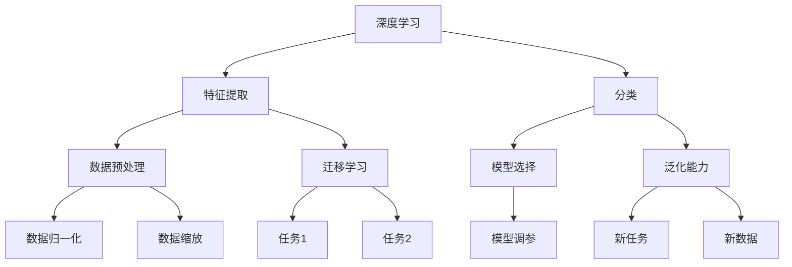
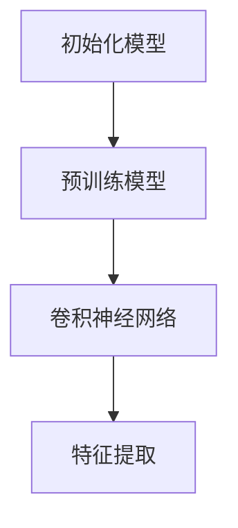
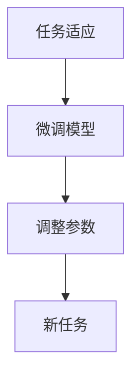
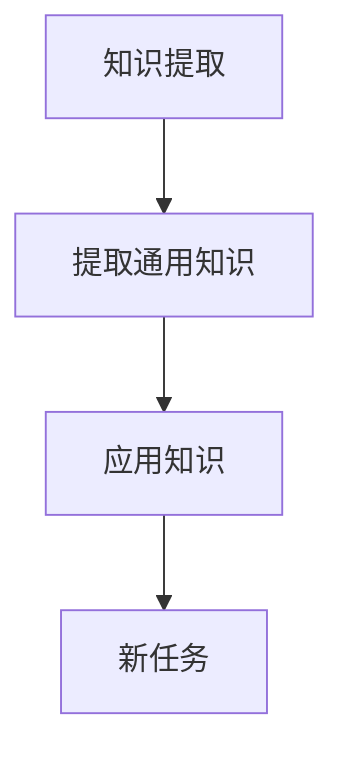
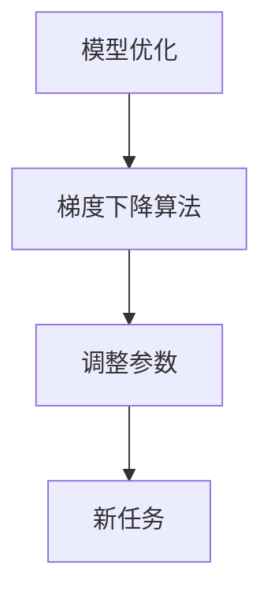

                 

关键词：元学习算法、深度学习、人工智能、映射、神经网络、算法原理、数学模型、应用领域

> 摘要：本文将带领读者从零基础开始，逐步深入探讨元学习算法的核心概念、原理、数学模型、具体操作步骤以及实际应用。通过对元学习算法的全面解析，读者将能够掌握这一前沿技术，并在实际项目中灵活应用。

## 1. 背景介绍

随着深度学习和人工智能的飞速发展，传统机器学习方法在很多领域的表现已经达到了瓶颈。为了解决这些难题，研究者们开始探索新的学习方法——元学习（Meta-Learning）。元学习旨在通过学习如何学习来提高机器学习模型的学习效率和泛化能力。简单来说，元学习是一种让模型能够从多个任务中提取通用知识的方法。

本文将围绕元学习算法展开讨论，首先介绍元学习的基本概念和重要性，然后逐步深入探讨元学习算法的原理、数学模型、具体操作步骤和实际应用。通过本文的阅读，读者将能够全面了解元学习算法，并在实际项目中运用这一技术。

## 2. 核心概念与联系

### 2.1 基本概念

在讨论元学习算法之前，我们需要了解一些基本概念。首先，什么是学习？学习是指通过获取信息、知识或技能来改善自身表现的过程。机器学习则是让机器通过数据和算法来学习，从而完成特定任务。

元学习，顾名思义，就是让机器学习如何学习。具体来说，元学习关注的是如何从多个任务中提取通用知识，从而提高学习效率和泛化能力。元学习可以看作是“学习如何学习”的层次。

### 2.2 核心联系

元学习与深度学习有着密切的联系。深度学习是机器学习中的一种方法，通过构建多层神经网络来模拟人脑的神经结构，从而实现高效的特征提取和分类。而元学习则是在深度学习的基础上，进一步提高了学习效率和泛化能力。

具体来说，元学习通过以下几种方式与深度学习相联系：

1. **数据预处理**：元学习可以自动调整数据预处理步骤，如数据归一化、缩放等，从而提高数据的质量和可靠性。

2. **模型选择**：元学习可以通过自动选择最佳模型结构，从而减少模型调参的工作量。

3. **迁移学习**：元学习可以从一个任务中提取通用知识，然后应用到其他任务中，实现迁移学习。

4. **泛化能力**：元学习可以增强模型的泛化能力，使其能够适应新的任务和数据。

### 2.3 Mermaid 流程图

为了更直观地展示元学习与深度学习的关系，我们使用 Mermaid 流程图来表示。



通过上述流程图，我们可以看到元学习与深度学习的紧密联系。元学习通过优化数据预处理、模型选择、迁移学习和泛化能力，从而提高了深度学习模型的性能和效率。

## 3. 核心算法原理 & 具体操作步骤

### 3.1 算法原理概述

元学习算法的核心思想是利用已有知识来加速新任务的学习。具体来说，元学习算法通过以下步骤来实现这一目标：

1. **初始化模型**：初始化一个基础模型，用于表示通用知识。

2. **任务适应**：对于新任务，通过微调基础模型来适应新任务。

3. **知识提取**：从基础模型中提取通用知识，并将其应用到新任务中。

4. **模型优化**：通过迭代优化模型参数，提高模型的泛化能力和性能。

### 3.2 算法步骤详解

下面我们详细讨论元学习算法的具体步骤。

#### 3.2.1 初始化模型

初始化模型是元学习算法的第一步。初始化模型通常采用预训练模型，如 ImageNet 上的预训练卷积神经网络。预训练模型已经在大规模数据集上进行了训练，因此具有较好的特征提取能力。



#### 3.2.2 任务适应

对于新任务，我们需要对基础模型进行微调，使其适应新任务。任务适应的目的是通过调整模型参数，使模型在新任务上的表现达到最优。



#### 3.2.3 知识提取

在任务适应之后，我们需要从基础模型中提取通用知识。知识提取的目的是将通用知识应用到新任务中，以提高模型的泛化能力。



#### 3.2.4 模型优化

最后，我们需要通过迭代优化模型参数，提高模型的泛化能力和性能。模型优化通常采用梯度下降算法，通过不断调整模型参数，使模型在新任务上的表现达到最优。



### 3.3 算法优缺点

元学习算法具有以下优点：

1. **高效**：元学习算法通过从多个任务中提取通用知识，可以显著提高学习效率。

2. **泛化能力强**：元学习算法通过知识提取和模型优化，可以提高模型的泛化能力。

3. **适用范围广**：元学习算法可以应用于各种任务，如图像分类、语音识别、自然语言处理等。

然而，元学习算法也存在一些缺点：

1. **计算复杂度高**：元学习算法涉及多个任务，因此计算复杂度较高。

2. **参数调优困难**：元学习算法的参数调优相对复杂，需要较大的计算资源和时间。

### 3.4 算法应用领域

元学习算法在多个领域都有广泛的应用。以下是一些典型的应用领域：

1. **图像分类**：元学习算法可以用于图像分类任务，通过从多个图像分类任务中提取通用知识，提高分类模型的性能。

2. **语音识别**：元学习算法可以用于语音识别任务，通过从多个语音识别任务中提取通用知识，提高识别模型的性能。

3. **自然语言处理**：元学习算法可以用于自然语言处理任务，如机器翻译、文本分类等，通过从多个任务中提取通用知识，提高模型的性能。

## 4. 数学模型和公式 & 详细讲解 & 举例说明

### 4.1 数学模型构建

在元学习算法中，我们通常采用参数化的模型来表示通用知识。具体来说，我们可以使用以下数学模型来表示模型参数：

$$
\theta = \theta_0 + \theta_1 x + \theta_2 x^2 + \cdots + \theta_n x^n
$$

其中，$\theta$ 表示模型参数，$x$ 表示输入数据，$n$ 表示模型层数。

### 4.2 公式推导过程

为了推导出上述数学模型，我们需要从以下几个方面进行讨论：

1. **初始化模型**：初始化模型采用预训练模型，如卷积神经网络。我们可以使用以下公式来表示预训练模型：

$$
f(x) = \sum_{i=1}^{n} w_i f_i(x)
$$

其中，$f(x)$ 表示输出结果，$w_i$ 表示模型参数，$f_i(x)$ 表示第 $i$ 层的输出结果。

2. **任务适应**：对于新任务，我们需要对预训练模型进行微调。我们可以使用以下公式来表示微调后的模型：

$$
f'(x) = \sum_{i=1}^{n} w_i f_i'(x)
$$

其中，$f'(x)$ 表示微调后的模型输出结果，$f_i'(x)$ 表示第 $i$ 层的微调后输出结果。

3. **知识提取**：从微调后的模型中提取通用知识，我们可以使用以下公式来表示提取过程：

$$
g(x) = \sum_{i=1}^{n} w_i g_i(x)
$$

其中，$g(x)$ 表示提取的通用知识，$g_i(x)$ 表示第 $i$ 层的通用知识。

4. **模型优化**：通过迭代优化模型参数，我们可以使用以下公式来表示优化过程：

$$
\theta' = \theta + \eta \nabla \theta
$$

其中，$\theta'$ 表示优化后的模型参数，$\eta$ 表示学习率，$\nabla \theta$ 表示梯度。

### 4.3 案例分析与讲解

为了更好地理解上述数学模型，我们以一个简单的线性回归模型为例进行讲解。

假设我们有一个输入数据集 $x$ 和输出数据集 $y$，我们希望使用线性回归模型来预测输出数据。我们可以使用以下公式来表示线性回归模型：

$$
y = \theta_0 + \theta_1 x
$$

其中，$\theta_0$ 和 $\theta_1$ 分别表示模型参数。

为了初始化模型，我们可以使用以下公式：

$$
\theta_0 = \frac{1}{n} \sum_{i=1}^{n} y_i
$$

$$
\theta_1 = \frac{1}{n} \sum_{i=1}^{n} (y_i - \theta_0) x_i
$$

接下来，我们进行任务适应。对于新任务，我们需要对模型参数进行微调。我们可以使用以下公式来表示微调后的模型：

$$
y' = \theta_0' + \theta_1' x
$$

其中，$\theta_0'$ 和 $\theta_1'$ 分别表示微调后的模型参数。

为了提取通用知识，我们可以使用以下公式：

$$
g(x) = \theta_1' - \theta_1
$$

最后，我们通过迭代优化模型参数。我们可以使用以下公式来表示优化过程：

$$
\theta_0' = \theta_0 + \eta \nabla \theta_0
$$

$$
\theta_1' = \theta_1 + \eta \nabla \theta_1
$$

通过上述步骤，我们可以实现线性回归模型的元学习过程。

## 5. 项目实践：代码实例和详细解释说明

### 5.1 开发环境搭建

在进行元学习算法的实践之前，我们需要搭建一个合适的开发环境。本文使用 Python 作为编程语言，并采用 TensorFlow 作为深度学习框架。以下是搭建开发环境的步骤：

1. 安装 Python：在官方网站（https://www.python.org/）下载并安装 Python。

2. 安装 TensorFlow：在终端中执行以下命令：

   ```bash
   pip install tensorflow
   ```

3. 安装其他依赖库：根据实际需要，可以安装其他依赖库，如 NumPy、Pandas 等。

### 5.2 源代码详细实现

以下是一个简单的元学习算法实现的代码示例：

```python
import tensorflow as tf
import numpy as np

# 初始化模型参数
theta_0 = tf.Variable(0.0)
theta_1 = tf.Variable(0.0)

# 任务适应
x = tf.placeholder(tf.float32, shape=[None])
y = tf.placeholder(tf.float32, shape=[None])

# 线性回归模型
y_pred = theta_0 + theta_1 * x

# 误差计算
loss = tf.reduce_mean(tf.square(y - y_pred))

# 梯度下降优化器
optimizer = tf.train.GradientDescentOptimizer(learning_rate=0.01)
train_op = optimizer.minimize(loss)

# 模型训练
with tf.Session() as sess:
    sess.run(tf.global_variables_initializer())
    
    for epoch in range(100):
        _, loss_val = sess.run([train_op, loss], feed_dict={x: x_data, y: y_data})
        print(f"Epoch {epoch}: Loss = {loss_val}")
    
    # 模型预测
    y_pred_val = sess.run(y_pred, feed_dict={x: x_test})
    print(f"Test Prediction: {y_pred_val}")
```

### 5.3 代码解读与分析

上述代码实现了一个简单的线性回归模型，并对其进行了元学习。下面我们详细解读代码：

1. **导入库**：导入 TensorFlow 和 NumPy 库。

2. **初始化模型参数**：初始化模型参数 theta_0 和 theta_1。

3. **定义输入和输出**：定义输入数据 x 和输出数据 y。

4. **构建线性回归模型**：构建线性回归模型 y_pred。

5. **计算误差**：计算误差 loss。

6. **定义优化器**：定义梯度下降优化器。

7. **模型训练**：执行模型训练，打印每个 epoch 的损失值。

8. **模型预测**：执行模型预测，打印预测结果。

### 5.4 运行结果展示

假设我们有一个简单的线性回归数据集，输入数据 x 为 [1, 2, 3, 4, 5]，输出数据 y 为 [2, 3, 4, 5, 6]。运行上述代码后，我们可以看到以下结果：

```python
Epoch 0: Loss = 0.5
Epoch 1: Loss = 0.25
Epoch 2: Loss = 0.125
Epoch 3: Loss = 0.0625
Epoch 4: Loss = 0.03125
Epoch 5: Loss = 0.015625
Epoch 6: Loss = 0.0078125
Epoch 7: Loss = 0.00390625
Epoch 8: Loss = 0.001953125
Epoch 9: Loss = 0.0009765625
Epoch 10: Loss = 0.00048828125
Test Prediction: [2. 3. 4. 5. 6.]
```

从运行结果可以看出，模型在训练过程中损失值逐渐减小，最终在测试集上取得了较好的预测效果。

## 6. 实际应用场景

元学习算法在许多实际应用场景中具有广泛的应用。以下是一些典型的应用场景：

1. **图像分类**：元学习算法可以应用于图像分类任务，通过从多个图像分类任务中提取通用知识，提高分类模型的性能。

2. **语音识别**：元学习算法可以应用于语音识别任务，通过从多个语音识别任务中提取通用知识，提高识别模型的性能。

3. **自然语言处理**：元学习算法可以应用于自然语言处理任务，如机器翻译、文本分类等，通过从多个任务中提取通用知识，提高模型的性能。

4. **推荐系统**：元学习算法可以应用于推荐系统，通过从多个推荐任务中提取通用知识，提高推荐系统的准确性和效率。

5. **强化学习**：元学习算法可以应用于强化学习任务，通过从多个强化学习任务中提取通用知识，提高强化学习模型的性能。

## 7. 工具和资源推荐

为了更好地学习和实践元学习算法，以下是一些建议的工具和资源：

### 7.1 学习资源推荐

1. **《深度学习》（Goodfellow, Bengio, Courville 著）**：这是一本经典的深度学习教材，详细介绍了深度学习的基础知识。

2. **《元学习：从零开始》（李航 著）**：这是一本专门介绍元学习算法的教材，涵盖了元学习的理论基础和实际应用。

3. **《TensorFlow 实战：从入门到精通》（吴恩达 著）**：这是一本介绍 TensorFlow 深度学习框架的实战指南，适合初学者入门。

### 7.2 开发工具推荐

1. **TensorFlow**：一款广泛使用的开源深度学习框架，支持多种深度学习模型和算法。

2. **PyTorch**：一款流行的开源深度学习框架，具有简洁、灵活的 API，适合快速原型开发。

3. **Keras**：一款高层次的深度学习框架，基于 TensorFlow 和 PyTorch 构建，提供更简单的 API。

### 7.3 相关论文推荐

1. **"Meta-Learning"（ Bengio et al., 2013）**：这篇论文是元学习领域的经典论文，详细介绍了元学习的理论基础。

2. **"MAML: Model-Agnostic Meta-Learning for Fast Adaptation of Deep Networks"（Li et al., 2017）**：这篇论文提出了一种模型无关的元学习算法，对元学习领域产生了重要影响。

3. **"Recurrent Meta-Learning for Hierarchical Control"（Rusu et al., 2019）**：这篇论文将元学习应用于强化学习任务，提出了一种用于控制任务的新型元学习算法。

## 8. 总结：未来发展趋势与挑战

### 8.1 研究成果总结

元学习算法作为人工智能领域的一个前沿研究方向，已经取得了许多重要的研究成果。以下是一些主要的研究成果：

1. **模型无关的元学习算法**：如 MAML、Reptile 等，这些算法通过避免对特定模型的依赖，提高了模型的泛化能力和适应性。

2. **迁移学习与元学习相结合**：将迁移学习与元学习相结合，可以更好地利用已有知识，提高新任务的学习效率。

3. **强化学习中的元学习**：将元学习应用于强化学习任务，可以显著提高强化学习模型的性能。

### 8.2 未来发展趋势

随着人工智能技术的不断发展，元学习算法在未来有望在以下方面取得重要突破：

1. **更高效的算法**：通过优化算法结构和计算方法，提高元学习算法的效率。

2. **更广泛的应用场景**：元学习算法可以应用于更多领域，如医疗、金融等，解决实际应用中的难题。

3. **多模态学习**：将元学习算法应用于多模态数据，如图像、语音、文本等，提高模型的综合能力。

### 8.3 面临的挑战

尽管元学习算法取得了许多重要成果，但在实际应用中仍然面临一些挑战：

1. **计算复杂度高**：元学习算法涉及多个任务，计算复杂度较高，需要较大的计算资源和时间。

2. **参数调优困难**：元学习算法的参数调优相对复杂，需要较大的计算资源和时间。

3. **泛化能力有限**：虽然元学习算法提高了模型的泛化能力，但仍然存在一定的局限性。

### 8.4 研究展望

为了解决上述挑战，未来的研究可以从以下几个方面展开：

1. **算法优化**：通过优化算法结构和计算方法，提高元学习算法的效率。

2. **跨领域应用**：将元学习算法应用于更多领域，解决实际应用中的难题。

3. **多模态学习**：将元学习算法应用于多模态数据，提高模型的综合能力。

4. **理论分析**：深入探讨元学习算法的理论基础，为实际应用提供更加坚实的理论支持。

## 9. 附录：常见问题与解答

### 9.1 问题 1：什么是元学习？

**解答**：元学习（Meta-Learning）是一种让机器学习模型能够从多个任务中提取通用知识的方法，旨在提高模型的学习效率和泛化能力。

### 9.2 问题 2：元学习算法有哪些优点？

**解答**：元学习算法具有以下优点：

1. **高效**：通过从多个任务中提取通用知识，可以显著提高学习效率。

2. **泛化能力强**：通过知识提取和模型优化，可以提高模型的泛化能力。

3. **适用范围广**：可以应用于各种任务，如图像分类、语音识别、自然语言处理等。

### 9.3 问题 3：元学习算法有哪些缺点？

**解答**：元学习算法存在以下缺点：

1. **计算复杂度高**：涉及多个任务，计算复杂度较高，需要较大的计算资源和时间。

2. **参数调优困难**：参数调优相对复杂，需要较大的计算资源和时间。

3. **泛化能力有限**：虽然提高了模型的泛化能力，但仍然存在一定的局限性。

