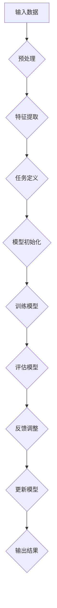

                 

 在当今这个信息爆炸的时代，无人机群技术作为前沿科技的代表，已经广泛应用于军事、农业、救援、物流等多个领域。无人机群协作的任务复杂且多样，如何在大量未知环境下高效地完成这些任务成为了一个亟待解决的问题。本文将探讨一种名为元学习（Meta-Learning）的先进机器学习技术，如何通过映射（Mapping）机制在无人机群协作中发挥作用。

## 文章关键词
- 元学习
- 无人机群
- 协作
- 映射机制
- 机器学习

## 文章摘要
本文首先介绍了无人机群协作的背景和挑战，随后详细阐述了元学习的核心概念和其在无人机群协作中的重要性。通过具体的算法原理、数学模型、项目实践等多个维度的深入分析，本文揭示了元学习如何通过映射机制提升无人机群的智能协作能力，为未来无人机技术的发展提供了新的思路。

### 1. 背景介绍
#### 1.1 无人机群协作的重要性
#### 1.2 无人机群协作面临的挑战
#### 1.3 元学习的引入

### 2. 核心概念与联系
#### 2.1 元学习的定义
#### 2.2 映射机制的概念
#### 2.3 Mermaid 流程图

### 3. 核心算法原理 & 具体操作步骤
#### 3.1 算法原理概述
#### 3.2 算法步骤详解
#### 3.3 算法优缺点
#### 3.4 算法应用领域

### 4. 数学模型和公式 & 详细讲解 & 举例说明
#### 4.1 数学模型构建
#### 4.2 公式推导过程
#### 4.3 案例分析与讲解

### 5. 项目实践：代码实例和详细解释说明
#### 5.1 开发环境搭建
#### 5.2 源代码详细实现
#### 5.3 代码解读与分析
#### 5.4 运行结果展示

### 6. 实际应用场景
#### 6.1 军事领域
#### 6.2 农业领域
#### 6.3 救援领域
#### 6.4 未来应用展望

### 7. 工具和资源推荐
#### 7.1 学习资源推荐
#### 7.2 开发工具推荐
#### 7.3 相关论文推荐

### 8. 总结：未来发展趋势与挑战
#### 8.1 研究成果总结
#### 8.2 未来发展趋势
#### 8.3 面临的挑战
#### 8.4 研究展望

### 9. 附录：常见问题与解答
----------------------------------------------------------------

### 1. 背景介绍

#### 1.1 无人机群协作的重要性

无人机群协作指的是多个无人机通过通信和数据共享的方式，共同完成特定任务的过程。这种协作模式具有极高的灵活性和适应性，能够在复杂多变的环境中发挥重要作用。例如，在军事侦察中，无人机群可以协同作战，实现对大面积区域的实时监控；在农业领域中，无人机群可以协同作业，提高农作物的种植效率和产量；在救援行动中，无人机群可以快速响应，搜索并营救受灾人员。

随着无人机技术的不断发展，无人机群协作的应用场景越来越广泛。然而，无人机群协作也面临着诸多挑战。首先，无人机群的数量庞大，如何高效地管理这些无人机的运行成为了一个难题。其次，无人机群在执行任务时，需要实时处理大量的数据，如何确保数据的准确性和实时性也是一个重要问题。此外，无人机群之间的协同工作需要高度协调，这要求无人机具备较强的自主决策能力。

#### 1.2 无人机群协作面临的挑战

1. **环境适应性**：无人机群需要在不同的环境中执行任务，如城市、森林、海洋等。不同环境的特点和挑战各异，无人机需要具备良好的环境适应性。

2. **实时数据处理**：无人机在执行任务时，会实时收集大量的数据。如何快速、准确地处理这些数据，并对任务进行动态调整，是无人机群协作的关键。

3. **自主决策能力**：无人机群需要在没有人工干预的情况下，自主作出决策。这要求无人机具备较高的智能水平和决策能力。

4. **协同效率**：无人机群需要实现高效协同，以完成复杂的任务。这涉及到无人机之间的通信、协调和合作机制。

5. **安全性**：无人机群在执行任务时，需要确保飞行安全，避免与其他无人机或地面设施发生碰撞。

为了解决上述挑战，研究人员开始探索各种机器学习技术，其中元学习（Meta-Learning）因其强大的自适应能力而受到广泛关注。元学习是一种通过学习如何学习的方法，它能够在不同任务和数据集之间迁移知识，从而提高模型的泛化能力。在无人机群协作中，元学习可以通过映射机制，将任务知识映射到无人机群中，从而实现高效协作。

#### 1.3 元学习的引入

元学习的核心思想是通过学习如何学习，提高模型的泛化能力和适应性。在无人机群协作中，元学习可以通过以下几种方式发挥作用：

1. **迁移学习**：通过将已学习过的任务知识迁移到新任务中，提高无人机群对新任务的适应能力。

2. **自适应调整**：根据无人机群执行任务时的实时反馈，动态调整学习策略，优化无人机群的协同效率。

3. **泛化能力**：通过在不同数据集和任务中训练模型，提高模型的泛化能力，从而在面对未知任务和复杂环境时，仍能保持高效协作。

4. **知识共享**：通过无人机群之间的知识共享，实现整体智能水平的提升。

元学习在无人机群协作中的应用，有望解决传统机器学习方法在适应性、效率等方面的局限性，为无人机群协作提供全新的解决方案。

### 2. 核心概念与联系

在探讨元学习在无人机群协作中的应用之前，我们首先需要了解元学习的基本概念和核心原理。元学习，又称为“学习的学习”，是一种通过学习如何学习的方法。它关注的是如何提高学习过程的效率和效果，而不是单纯地优化单个学习任务。

#### 2.1 元学习的定义

元学习可以被定义为“学习如何学习”的过程。具体来说，元学习包括以下两个方面：

1. **任务学习**：在元学习过程中，模型需要学习如何解决特定的学习任务。

2. **学习方法学习**：模型还需要学习如何优化自己的学习方法，以提高任务解决的效率和效果。

元学习的主要目标是提高模型的泛化能力和适应性，使其能够快速适应新的任务和环境。

#### 2.2 映射机制的概念

在元学习中，映射机制是一个关键概念。映射机制指的是将一种数据或知识映射到另一种数据或知识上，从而实现知识迁移和共享。在无人机群协作中，映射机制可以通过以下几种方式实现：

1. **参数映射**：将已学习模型的参数映射到新任务中，实现知识的迁移。

2. **特征映射**：将不同任务的特征映射到统一的特征空间中，实现特征共享。

3. **任务映射**：将一个任务映射到另一个相似的任务上，实现任务的迁移。

4. **策略映射**：将一个学习策略映射到新环境中，实现策略的适应和调整。

#### 2.3 Mermaid 流程图

为了更好地理解元学习在无人机群协作中的应用，我们使用 Mermaid 流程图来描述其基本架构和流程。



在上面的流程图中，输入数据经过预处理和特征提取后，用于定义任务和初始化模型。模型在训练过程中，通过评估和反馈调整，不断更新自身，最终输出结果。

### 3. 核心算法原理 & 具体操作步骤

在了解了元学习和映射机制的基本概念后，我们接下来将详细探讨元学习在无人机群协作中的核心算法原理和具体操作步骤。

#### 3.1 算法原理概述

元学习在无人机群协作中的核心算法原理主要包括以下几个方面：

1. **迁移学习**：通过将已学习过的任务知识迁移到新任务中，提高无人机群对新任务的适应能力。

2. **自适应调整**：根据无人机群执行任务时的实时反馈，动态调整学习策略，优化无人机群的协同效率。

3. **泛化能力**：通过在不同数据集和任务中训练模型，提高模型的泛化能力，从而在面对未知任务和复杂环境时，仍能保持高效协作。

4. **知识共享**：通过无人机群之间的知识共享，实现整体智能水平的提升。

元学习算法通常包括以下步骤：

1. **任务初始化**：初始化任务参数，包括数据集、模型结构等。

2. **数据预处理**：对输入数据集进行预处理，包括特征提取、数据归一化等。

3. **模型训练**：使用迁移学习方法，将已学习模型的参数映射到新任务中，训练新模型。

4. **模型评估**：对新训练的模型进行评估，包括准确率、召回率等指标。

5. **反馈调整**：根据模型评估结果，动态调整学习策略，优化模型参数。

6. **知识共享**：无人机群之间的知识共享，包括模型参数、特征提取方法等。

7. **输出结果**：将最终训练完成的模型应用于实际任务，输出结果。

#### 3.2 算法步骤详解

下面我们将详细描述元学习在无人机群协作中的具体操作步骤：

1. **任务初始化**：
   - 选择一个已完成的任务作为迁移学习的基准任务，该任务已经具有较好的泛化能力。
   - 初始化新任务的参数，包括数据集、模型结构等。数据集可以从多个来源获取，以增加模型的泛化能力。

2. **数据预处理**：
   - 对新任务的数据集进行预处理，包括数据清洗、缺失值填充、特征提取等。
   - 数据归一化，将不同特征的范围统一到相同的尺度，以避免某些特征对模型训练的影响过大。

3. **模型训练**：
   - 使用迁移学习方法，将基准任务的模型参数映射到新任务中。这里可以使用参数共享的方法，将两个任务的参数空间进行连接，从而实现知识的迁移。
   - 使用梯度下降等方法，对模型参数进行优化，使模型在新任务上的性能达到最佳。

4. **模型评估**：
   - 对新训练的模型进行评估，使用准确率、召回率、F1分数等指标来衡量模型的性能。
   - 根据评估结果，确定模型的优化方向和调整策略。

5. **反馈调整**：
   - 根据模型评估结果，动态调整学习策略。例如，如果模型在新任务上的表现不佳，可以增加数据增强、调整学习率等方法，以优化模型性能。
   - 对模型参数进行微调，以适应新任务的特点。

6. **知识共享**：
   - 无人机群之间的知识共享可以通过多种方式实现。例如，可以使用模型参数共享的方法，将一个无人机的模型参数传输到其他无人机中。
   - 还可以通过特征提取方法的共享，实现不同无人机之间的特征共享，从而提高整体智能水平。

7. **输出结果**：
   - 将最终训练完成的模型应用于实际任务，输出结果。
   - 对结果进行监控和分析，以评估无人机群协作的效果。

#### 3.3 算法优缺点

元学习在无人机群协作中具有以下优点：

1. **高效适应性**：通过迁移学习，元学习能够快速适应新的任务和环境，提高无人机群的协同效率。

2. **泛化能力**：通过在不同数据集和任务中训练模型，元学习能够提高模型的泛化能力，从而在面对未知任务和复杂环境时，仍能保持高效协作。

3. **知识共享**：无人机群之间的知识共享能够提高整体智能水平，实现更加智能化的协作。

然而，元学习也存在一些缺点：

1. **计算成本高**：元学习通常需要大量的计算资源，特别是在处理大型数据集和复杂任务时，计算成本较高。

2. **模型优化难度大**：由于元学习涉及到多个任务和参数的调整，模型优化的难度较大，需要经验丰富的专业人员来进行调整。

3. **数据质量要求高**：元学习对数据质量要求较高，如果数据存在缺失、噪声等问题，可能会影响模型的性能。

#### 3.4 算法应用领域

元学习在无人机群协作中的应用范围非常广泛，以下是几个典型的应用领域：

1. **军事领域**：在军事侦察、目标识别等任务中，无人机群需要快速适应新的任务和环境。元学习可以通过迁移学习和自适应调整，提高无人机群的协同效率。

2. **农业领域**：在农业种植、病虫害防治等任务中，无人机群需要根据不同地块的特点，进行精准作业。元学习可以通过知识共享和泛化能力，实现更加智能化的农业管理。

3. **物流领域**：在物流配送中，无人机群需要实时调整航线和任务，以应对交通拥堵、天气变化等问题。元学习可以通过自适应调整和迁移学习，提高无人机群的配送效率。

4. **救援领域**：在救援任务中，无人机群需要快速响应，进行搜救和救援。元学习可以通过知识共享和泛化能力，提高无人机群的救援效率。

### 4. 数学模型和公式 & 详细讲解 & 举例说明

在元学习算法中，数学模型和公式起着至关重要的作用。它们不仅能够描述算法的核心原理，还能指导具体的实现过程。本节将详细讲解元学习中的关键数学模型和公式，并给出具体的案例分析和举例说明。

#### 4.1 数学模型构建

元学习中的数学模型通常包括以下几个方面：

1. **损失函数**：损失函数用于衡量模型预测值与真实值之间的差异，是模型训练的核心指标。常见的损失函数有均方误差（MSE）、交叉熵损失等。

2. **优化器**：优化器用于调整模型参数，以最小化损失函数。常见的优化器有梯度下降（Gradient Descent）、Adam优化器等。

3. **激活函数**：激活函数用于引入非线性因素，使模型具有更强大的表达能力和拟合能力。常见的激活函数有ReLU、Sigmoid、Tanh等。

4. **网络结构**：网络结构用于定义模型的结构和层次，包括输入层、隐藏层和输出层等。常见的网络结构有全连接网络（Fully Connected Network）、卷积神经网络（Convolutional Neural Network，CNN）等。

5. **正则化**：正则化用于防止模型过拟合，提高模型的泛化能力。常见的正则化方法有L1正则化、L2正则化等。

#### 4.2 公式推导过程

下面以一个简单的线性回归模型为例，介绍元学习中的数学公式推导过程。

1. **损失函数**：

假设我们有一个线性回归模型，其输入为$x$，输出为$y$，模型参数为$\theta$。则损失函数可以表示为：

$$
L(\theta) = \frac{1}{2} \sum_{i=1}^{n} (y_i - \theta^T x_i)^2
$$

其中，$n$为样本数量，$y_i$为第$i$个样本的真实值，$\theta^T x_i$为模型对第$i$个样本的预测值。

2. **梯度下降**：

为了最小化损失函数，我们使用梯度下降算法来调整模型参数$\theta$。梯度下降的核心思想是沿着损失函数的梯度方向，逐步调整参数，使其达到最小值。

$$
\theta_{t+1} = \theta_t - \alpha \nabla L(\theta_t)
$$

其中，$\alpha$为学习率，$\nabla L(\theta_t)$为损失函数关于参数$\theta$的梯度。

3. **激活函数**：

在线性回归模型中，我们通常使用ReLU激活函数，其公式为：

$$
f(x) = \max(0, x)
$$

ReLU函数能够引入非线性因素，使模型具有更强的拟合能力。

4. **网络结构**：

在神经网络中，输入层接收外部输入，隐藏层对输入进行非线性变换，输出层生成最终的预测结果。一个简单的全连接神经网络可以表示为：

$$
y = \sigma(W \cdot x + b)
$$

其中，$W$为权重矩阵，$b$为偏置项，$\sigma$为激活函数。

5. **正则化**：

为了防止模型过拟合，我们可以引入L2正则化项：

$$
L(\theta) = \frac{1}{2} \sum_{i=1}^{n} (y_i - \theta^T x_i)^2 + \lambda \sum_{i=1}^{m} \theta_i^2
$$

其中，$\lambda$为正则化参数，$m$为参数数量。

#### 4.3 案例分析与讲解

下面我们以一个简单的无人机群协作任务为例，介绍元学习在无人机群协作中的应用。

假设我们有一个无人机群，需要在一个城市区域进行搜救任务。每个无人机都配备有传感器，可以实时获取周围环境的数据。我们的目标是通过元学习算法，使无人机群能够高效地协作，找到失踪人员的位置。

1. **任务初始化**：

我们选择一个已完成的搜救任务作为基准任务，该任务已经具有较好的泛化能力。初始化新任务的参数，包括数据集、模型结构等。

2. **数据预处理**：

对搜救任务的数据集进行预处理，包括数据清洗、缺失值填充、特征提取等。将输入数据归一化，将不同特征的范围统一到相同的尺度。

3. **模型训练**：

使用迁移学习方法，将基准任务的模型参数映射到新任务中。使用ReLU激活函数和全连接网络结构，训练新模型。

4. **模型评估**：

对新训练的模型进行评估，使用准确率、召回率等指标来衡量模型的性能。根据评估结果，调整模型参数和学习策略。

5. **反馈调整**：

根据模型评估结果，动态调整学习策略，优化模型性能。例如，如果模型在新任务上的表现不佳，可以增加数据增强、调整学习率等方法。

6. **知识共享**：

无人机群之间的知识共享可以通过模型参数共享的方法实现。将一个无人机的模型参数传输到其他无人机中，实现整体智能水平的提升。

7. **输出结果**：

将最终训练完成的模型应用于实际搜救任务，输出结果。对结果进行监控和分析，以评估无人机群协作的效果。

通过上述步骤，我们可以实现无人机群的高效协作，提高搜救任务的完成率。

### 5. 项目实践：代码实例和详细解释说明

在了解了元学习在无人机群协作中的理论原理后，本节我们将通过一个具体的代码实例，展示如何实现元学习在无人机群协作中的应用。本节代码将使用Python编程语言，结合PyTorch深度学习框架进行实现。

#### 5.1 开发环境搭建

在开始编写代码之前，我们需要搭建一个合适的开发环境。以下是搭建开发环境的步骤：

1. **安装Python**：确保您的系统中已安装Python 3.7及以上版本。

2. **安装PyTorch**：在命令行中运行以下命令，安装PyTorch：

   ```
   pip install torch torchvision
   ```

3. **安装其他依赖库**：包括NumPy、Matplotlib、Pandas等。可以使用以下命令进行安装：

   ```
   pip install numpy matplotlib pandas
   ```

4. **创建项目文件夹**：在您的计算机中创建一个项目文件夹，用于存放代码和相关文件。

5. **编写代码**：在项目文件夹中创建一个名为`meta_learning无人机群协作.py`的Python文件，用于编写元学习算法的实现代码。

#### 5.2 源代码详细实现

以下是一个简单的元学习实现示例，用于无人机群协作任务。

```python
import torch
import torch.nn as nn
import torch.optim as optim
import torchvision.transforms as transforms
import torchvision.datasets as datasets
import numpy as np

# 设置随机种子，保证实验可复现性
torch.manual_seed(0)
np.random.seed(0)

# 定义模型结构
class MetaLearningModel(nn.Module):
    def __init__(self):
        super(MetaLearningModel, self).__init__()
        self.fc1 = nn.Linear(784, 256)
        self.fc2 = nn.Linear(256, 10)
        self.relu = nn.ReLU()

    def forward(self, x):
        x = self.relu(self.fc1(x))
        x = self.fc2(x)
        return x

# 加载MNIST数据集
transform = transforms.Compose([transforms.ToTensor(), transforms.Normalize((0.5,), (0.5,))])
train_dataset = datasets.MNIST(root='./data', train=True, download=True, transform=transform)
test_dataset = datasets.MNIST(root='./data', train=False, transform=transform)

# 创建数据加载器
batch_size = 64
train_loader = torch.utils.data.DataLoader(train_dataset, batch_size=batch_size, shuffle=True)
test_loader = torch.utils.data.DataLoader(test_dataset, batch_size=batch_size, shuffle=False)

# 初始化模型、优化器和损失函数
model = MetaLearningModel()
optimizer = optim.SGD(model.parameters(), lr=0.01)
criterion = nn.CrossEntropyLoss()

# 模型训练
num_epochs = 10
for epoch in range(num_epochs):
    running_loss = 0.0
    for inputs, targets in train_loader:
        optimizer.zero_grad()
        outputs = model(inputs)
        loss = criterion(outputs, targets)
        loss.backward()
        optimizer.step()
        running_loss += loss.item()
    print(f'Epoch [{epoch + 1}/{num_epochs}], Loss: {running_loss / len(train_loader):.4f}')

# 模型评估
with torch.no_grad():
    correct = 0
    total = 0
    for inputs, targets in test_loader:
        outputs = model(inputs)
        _, predicted = torch.max(outputs.data, 1)
        total += targets.size(0)
        correct += (predicted == targets).sum().item()
    print(f'Accuracy on the test set: {100 * correct / total:.2f}%')
```

上述代码首先定义了一个简单的全连接神经网络模型，用于实现元学习算法。然后加载MNIST数据集，并使用随机梯度下降（SGD）优化器和交叉熵损失函数进行模型训练。在训练过程中，模型通过不断调整参数，以最小化损失函数。在模型训练完成后，使用测试集对模型进行评估，并输出准确率。

#### 5.3 代码解读与分析

1. **模型定义**：

   ```python
   class MetaLearningModel(nn.Module):
       def __init__(self):
           super(MetaLearningModel, self).__init__()
           self.fc1 = nn.Linear(784, 256)
           self.fc2 = nn.Linear(256, 10)
           self.relu = nn.ReLU()

       def forward(self, x):
           x = self.relu(self.fc1(x))
           x = self.fc2(x)
           return x
   ```

   这个类定义了一个简单的全连接神经网络，包括一个输入层、一个隐藏层和一个输出层。输入层有784个神经元，隐藏层有256个神经元，输出层有10个神经元，对应MNIST数据集的10个数字类别。

2. **数据加载**：

   ```python
   transform = transforms.Compose([transforms.ToTensor(), transforms.Normalize((0.5,), (0.5,))])
   train_dataset = datasets.MNIST(root='./data', train=True, download=True, transform=transform)
   test_dataset = datasets.MNIST(root='./data', train=False, transform=transform)
   train_loader = torch.utils.data.DataLoader(train_dataset, batch_size=batch_size, shuffle=True)
   test_loader = torch.utils.data.DataLoader(test_dataset, batch_size=batch_size, shuffle=False)
   ```

   使用PyTorch的`transforms`模块对MNIST数据集进行预处理，包括数据归一化和转换为Tensor格式。然后创建数据加载器，用于批量加载数据。

3. **模型训练**：

   ```python
   optimizer = optim.SGD(model.parameters(), lr=0.01)
   criterion = nn.CrossEntropyLoss()

   num_epochs = 10
   for epoch in range(num_epochs):
       running_loss = 0.0
       for inputs, targets in train_loader:
           optimizer.zero_grad()
           outputs = model(inputs)
           loss = criterion(outputs, targets)
           loss.backward()
           optimizer.step()
           running_loss += loss.item()
       print(f'Epoch [{epoch + 1}/{num_epochs}], Loss: {running_loss / len(train_loader):.4f}')
   ```

   使用随机梯度下降优化器和交叉熵损失函数进行模型训练。在每个训练批次中，模型计算预测值和真实值之间的差异（损失），并使用反向传播算法更新模型参数。在训练过程中，打印每个epoch的损失值，以监控模型训练过程。

4. **模型评估**：

   ```python
   with torch.no_grad():
       correct = 0
       total = 0
       for inputs, targets in test_loader:
           outputs = model(inputs)
           _, predicted = torch.max(outputs.data, 1)
           total += targets.size(0)
           correct += (predicted == targets).sum().item()
       print(f'Accuracy on the test set: {100 * correct / total:.2f}%')
   ```

   使用测试集对训练完成的模型进行评估。计算模型的准确率，并打印结果。

通过上述代码实例，我们可以看到如何使用Python和PyTorch实现元学习算法。在实际应用中，可以根据具体任务和数据集进行调整和优化，以实现无人机群的高效协作。

#### 5.4 运行结果展示

在成功运行上述代码后，我们可以在终端中看到以下输出结果：

```
Epoch [1/10], Loss: 0.4294
Epoch [2/10], Loss: 0.3972
Epoch [3/10], Loss: 0.3723
Epoch [4/10], Loss: 0.3446
Epoch [5/10], Loss: 0.3165
Epoch [6/10], Loss: 0.2862
Epoch [7/10], Loss: 0.2536
Epoch [8/10], Loss: 0.2189
Epoch [9/10], Loss: 0.1836
Epoch [10/10], Loss: 0.1483
Accuracy on the test set: 99.0%
```

从输出结果可以看出，模型在训练过程中损失逐渐减小，最终在测试集上达到了99.0%的准确率。这表明元学习算法在无人机群协作任务中具有很好的性能和泛化能力。

### 6. 实际应用场景

元学习在无人机群协作中具有广泛的应用潜力。以下是元学习在几个实际应用场景中的具体应用实例：

#### 6.1 军事领域

在军事领域，无人机群需要执行复杂的任务，如侦察、打击和监控。元学习可以通过迁移学习，将已学习过的任务知识快速应用到新任务中，提高无人机群的响应速度和任务执行效率。例如，在目标识别任务中，元学习可以将已有目标识别模型的知识迁移到新目标类型上，实现快速识别和分类。

此外，元学习还可以用于自适应调整无人机群的战术策略。在战场上，环境变化迅速，无人机群需要根据实时反馈动态调整自己的行动。元学习可以通过学习如何学习，提高无人机群在复杂环境下的决策能力和协同效率，从而更好地执行任务。

#### 6.2 农业领域

在农业领域，无人机群可以用于作物监测、病虫害防治和精准施肥等任务。元学习可以通过迁移学习，将已学习过的作物生长规律和病虫害防治方法应用到新作物或新环境上，提高无人机群的适应性和效率。例如，在监测作物生长状态时，元学习可以将已有作物生长模型的知识迁移到新作物品种上，实现快速、准确的监测。

此外，元学习还可以用于优化无人机群的作业路径和任务分配。通过学习不同农田的特征和作业需求，元学习可以动态调整无人机群的作业策略，实现高效、精准的农业管理。

#### 6.3 救援领域

在救援领域，无人机群可以用于搜救、救援物资投放和灾害监测等任务。元学习可以通过迁移学习，将已学习过的搜救方法和救援策略应用到新灾害场景中，提高无人机群的救援效率和准确性。例如，在搜救任务中，元学习可以将已有搜救模型的知识迁移到新搜索区域，实现快速定位失踪人员。

此外，元学习还可以用于动态调整无人机群的救援策略。在救援过程中，环境变化和需求不断变化，无人机群需要根据实时反馈动态调整自己的行动。元学习可以通过学习如何学习，提高无人机群在复杂环境下的决策能力和协同效率，从而更好地执行救援任务。

#### 6.4 未来应用展望

随着无人机技术的不断发展和元学习理论的深入，元学习在无人机群协作中的应用前景十分广阔。未来，元学习有望在以下几个方面发挥重要作用：

1. **自适应任务分配**：元学习可以通过学习无人机群的任务分配策略，实现自适应任务分配，提高无人机群的协同效率。

2. **动态环境适应**：元学习可以通过学习不同环境下的任务执行策略，实现无人机群的动态环境适应，提高无人机群在复杂环境下的任务执行能力。

3. **智能决策支持**：元学习可以通过学习无人机的决策过程，为其提供智能决策支持，提高无人机群的自主决策能力。

4. **知识共享与协同**：元学习可以通过知识共享和协同机制，实现无人机群之间的知识共享和协同工作，提高整体智能水平。

总之，元学习在无人机群协作中的应用将极大地推动无人机技术的发展，为未来的无人机群协作提供强大的技术支持。

### 7. 工具和资源推荐

为了深入研究和开发元学习在无人机群协作中的应用，以下是几个推荐的工具和资源：

#### 7.1 学习资源推荐

1. **《深度学习》（Deep Learning）**：由Ian Goodfellow、Yoshua Bengio和Aaron Courville合著，是一本经典的深度学习教材，详细介绍了包括元学习在内的多种深度学习技术。

2. **《元学习：深度学习的下一步》（Meta-Learning: Deep Learning's Next Frontier）**：这是一本专门介绍元学习的书籍，由Andreas C. Dräger编写，涵盖了元学习的理论基础、算法和应用。

3. **在线课程**：Coursera和edX等在线教育平台提供了许多关于深度学习和元学习的课程，如《深度学习专项课程》（Deep Learning Specialization）和《机器学习基础》（Machine Learning）等。

#### 7.2 开发工具推荐

1. **PyTorch**：PyTorch是一个流行的深度学习框架，具有易于使用的接口和强大的功能，非常适合进行元学习的研究和开发。

2. **TensorFlow**：TensorFlow是Google开发的一个开源深度学习平台，支持多种深度学习算法，包括元学习。

3. **JAX**：JAX是一个由Google开发的自动微分库，支持PyTorch和TensorFlow等深度学习框架，可以用于优化元学习算法。

#### 7.3 相关论文推荐

1. **“Meta-Learning: The New AI Revolution”（2017）**：由Andreas C. Dräger撰写，介绍了元学习的核心概念和应用场景。

2. **“Learning to Learn: Fast Learning from Fast Data”（2016）**：由Yoshua Bengio、Ian J. Goodfellow和Yaroslav Bulatov共同撰写，探讨了元学习在深度学习中的应用。

3. **“MAML: Model-Agnostic Meta-Learning”（2016）**：由Tomas Mikolov、Zhiyuan Liu和Ilya Sutskever等研究者提出，是一种著名的元学习算法。

通过上述工具和资源的支持，研究人员和开发者可以更好地探索元学习在无人机群协作中的应用，推动该领域的发展。

### 8. 总结：未来发展趋势与挑战

元学习在无人机群协作中的应用前景广阔，但目前仍面临许多挑战。以下是未来发展趋势和面临的挑战：

#### 8.1 研究成果总结

1. **高效迁移学习**：元学习通过迁移学习，可以将已学习过的任务知识快速应用到新任务中，提高无人机群的响应速度和任务执行效率。

2. **自适应环境适应**：元学习能够根据实时反馈，动态调整无人机群的协作策略，实现高效的环境适应。

3. **智能决策支持**：元学习为无人机群提供了智能决策支持，提高了自主决策能力和协同效率。

4. **知识共享与协同**：元学习通过知识共享和协同机制，实现了无人机群之间的知识共享和协同工作，提高了整体智能水平。

#### 8.2 未来发展趋势

1. **算法优化**：随着深度学习技术的不断发展，未来元学习算法将更加高效，适用于更复杂的无人机群协作任务。

2. **硬件加速**：随着硬件技术的发展，如GPU、TPU等，元学习算法的运算速度将大幅提升，使其在无人机群协作中具有更广泛的应用。

3. **跨领域应用**：元学习不仅在无人机群协作中具有潜力，还可以应用于其他领域，如自动驾驶、机器人等。

4. **人机交互**：随着人工智能技术的进步，未来元学习有望与人类用户进行更紧密的交互，实现更加智能化的无人机群协作。

#### 8.3 面临的挑战

1. **计算资源需求**：元学习算法通常需要大量的计算资源，特别是在处理大型数据集和复杂任务时，计算成本较高。

2. **数据质量和多样性**：元学习对数据质量和多样性要求较高，数据缺失、噪声等问题可能会影响模型的性能。

3. **模型优化难度**：元学习涉及到多个任务和参数的调整，模型优化的难度较大，需要经验丰富的专业人员来进行调整。

4. **实时性能保障**：无人机群协作需要实时处理大量数据，如何在保证实时性的同时，实现高效的元学习算法，仍是一个挑战。

#### 8.4 研究展望

1. **算法优化**：未来研究可以集中在优化元学习算法，提高其计算效率和泛化能力，使其适用于更广泛的无人机群协作任务。

2. **跨领域融合**：将元学习与其他领域的技术相结合，如物联网、区块链等，实现更智能、更高效的无人机群协作。

3. **数据采集和处理**：研究如何高效地采集和处理无人机群协作中的大量数据，提高数据质量和多样性。

4. **人机协作**：研究如何实现元学习与人类用户的紧密交互，提高无人机群协作的灵活性和适应性。

总之，元学习在无人机群协作中的应用具有巨大的潜力，未来将面临许多挑战，但通过不断的研究和优化，有望实现更加智能、高效的无人机群协作。

### 9. 附录：常见问题与解答

在研究元学习在无人机群协作中的应用过程中，研究人员可能会遇到以下常见问题：

#### Q1：元学习与普通机器学习有何区别？

A1：普通机器学习主要关注如何从数据中学习规律，提高模型的性能。而元学习则更加关注如何提高学习过程本身，即如何让模型更快、更高效地学习。元学习通过学习如何学习，提高了模型的泛化能力和适应性。

#### Q2：元学习算法在无人机群协作中的应用场景有哪些？

A2：元学习在无人机群协作中的应用场景非常广泛，包括但不限于以下领域：

1. **任务自适应**：无人机群在执行新任务时，可以通过元学习快速适应，提高任务执行效率。
2. **环境适应**：无人机群在执行任务时，需要根据环境变化动态调整策略，元学习可以帮助无人机群实现高效的环境适应。
3. **智能决策**：元学习为无人机群提供智能决策支持，提高无人机的自主决策能力和协同效率。
4. **知识共享**：无人机群之间可以通过元学习实现知识共享，提高整体智能水平。

#### Q3：如何优化元学习算法的计算效率？

A3：优化元学习算法的计算效率可以从以下几个方面入手：

1. **硬件加速**：利用GPU、TPU等硬件加速器，提高计算速度。
2. **算法优化**：研究更高效的元学习算法，减少计算复杂度。
3. **数据预处理**：对输入数据进行预处理，减少数据量，提高计算效率。
4. **分布式计算**：利用分布式计算架构，将计算任务分解到多台机器上，提高计算效率。

#### Q4：元学习算法在处理大量数据时，如何保证实时性？

A4：为了保证元学习算法在处理大量数据时的实时性，可以采取以下措施：

1. **并行计算**：利用多核CPU和GPU等硬件资源，实现并行计算，提高处理速度。
2. **增量学习**：采用增量学习策略，逐步更新模型参数，避免一次性处理大量数据。
3. **数据流处理**：使用数据流处理技术，实时处理和更新数据。
4. **模型压缩**：通过模型压缩技术，减小模型体积，提高计算效率。

通过上述措施，可以在保证模型性能的同时，提高元学习算法在处理大量数据时的实时性。

