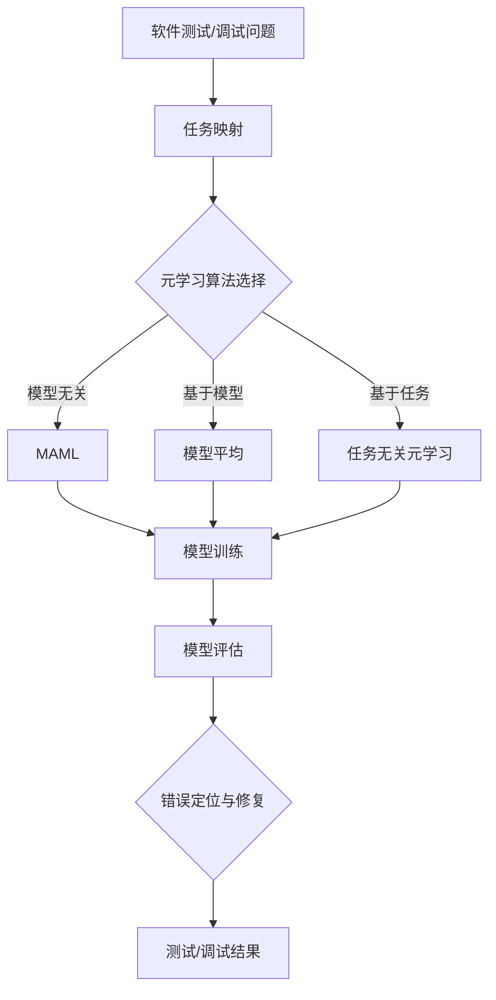

                 

关键词：元学习、软件测试、调试、映射、算法、数学模型

> 摘要：本文旨在探讨基于元学习的方法在软件测试和调试领域的应用，通过映射关系，提高软件测试和调试的效率和准确性。本文首先介绍了元学习的概念及其在人工智能领域的应用，然后分析了软件测试和调试中的问题，探讨了元学习如何解决这些问题。接着，我们详细讨论了基于元学习的软件测试和调试的核心算法原理，并给出了具体的操作步骤。最后，本文通过数学模型和公式，阐述了算法的数学基础，并通过实际项目实践和代码实例，展示了算法在实际应用中的效果。

## 1. 背景介绍

随着软件系统的日益复杂，传统的软件测试和调试方法面临着巨大的挑战。软件测试的目的是确保软件的正确性和可靠性，而调试则是修复软件中的错误。然而，传统的测试和调试方法通常需要大量的时间和人力资源，而且在面对复杂的系统时，效果往往不尽如人意。此外，软件系统的规模和复杂性不断增加，使得测试和调试的工作量呈指数级增长，这对软件工程师提出了更高的要求。

在这个背景下，元学习（Meta-Learning）作为一种新兴的人工智能技术，逐渐引起了研究者和工程师的关注。元学习是指学习如何学习的算法，它通过在不同任务上快速学习，从而提高学习效率。元学习的核心思想是利用先前学到的知识，在新任务上快速适应，从而避免从零开始学习的过程。

在人工智能领域，元学习已经取得了显著的成果。例如，在自然语言处理、计算机视觉、强化学习等应用中，元学习算法大大提高了模型的泛化能力和学习效率。那么，元学习能否应用于软件测试和调试领域，提高测试和调试的效率和准确性呢？这正是本文要探讨的问题。

## 2. 核心概念与联系

### 2.1 元学习

元学习（Meta-Learning）是一种利用先前学到的知识来解决新问题的方法。它可以被看作是一种学习如何学习的算法。元学习的核心目标是提高学习效率，使得模型能够在不同的任务上快速适应。

在人工智能领域，元学习通常采用两种方法：基于模型的方法和基于任务的方法。

- **基于模型的方法**：这种方法的核心思想是利用一个通用的模型，在不同任务上迭代优化，从而提高模型的泛化能力。常见的算法包括模型平均（Model Averaging）和迁移学习（Transfer Learning）。

- **基于任务的方法**：这种方法的核心思想是利用任务的先验知识，指导新任务的快速学习。常见的算法包括模型无关的元学习（Model-Agnostic Meta-Learning, MAML）和元学习优化（Meta-Learning Optimization）。

### 2.2 软件测试与调试

软件测试（Software Testing）是指通过各种方法和技术，对软件系统进行检查和验证，以发现和修复错误的过程。软件调试（Software Debugging）是指定位和修复软件中的错误，从而确保软件的正确性和可靠性。

在软件测试和调试中，存在以下几个核心问题：

- **复杂性**：随着软件系统的规模和复杂性不断增加，测试和调试的工作量也呈指数级增长。
- **准确性**：如何确保测试和调试的准确性，发现和修复所有潜在的错误。
- **效率**：如何在有限的时间内，完成高质量的测试和调试工作。

### 2.3 元学习与软件测试/调试的映射关系

元学习与软件测试/调试之间的映射关系主要体现在以下几个方面：

- **任务映射**：将软件测试和调试任务映射到元学习任务中，利用元学习算法，快速适应新任务。
- **知识迁移**：利用元学习算法，将先前学到的测试和调试经验迁移到新任务中，提高测试和调试的效率。
- **模型优化**：利用元学习算法，优化测试和调试模型，提高测试和调试的准确性。

### 2.4 Mermaid 流程图

下面是一个简化的Mermaid流程图，展示了元学习在软件测试和调试中的应用流程：



## 3. 核心算法原理 & 具体操作步骤

### 3.1 算法原理概述

基于元学习的软件测试和调试算法主要基于以下原理：

- **快速适应**：通过元学习算法，模型能够快速适应新任务，减少从零开始学习的时间。
- **知识迁移**：利用元学习算法，将先前学到的测试和调试经验迁移到新任务中，提高测试和调试的效率。
- **模型优化**：通过元学习算法，优化测试和调试模型，提高测试和调试的准确性。

### 3.2 算法步骤详解

基于元学习的软件测试和调试算法的具体操作步骤如下：

1. **任务映射**：将软件测试和调试任务映射到元学习任务中。例如，将软件缺陷定位问题映射到分类问题，将测试用例生成问题映射到生成模型问题。
2. **模型选择**：根据任务映射的结果，选择合适的元学习算法。例如，对于分类问题，可以选择MAML算法；对于生成模型问题，可以选择模型平均算法。
3. **模型训练**：使用元学习算法，在新任务上训练模型。例如，对于MAML算法，需要使用梯度下降法优化模型参数。
4. **模型评估**：对训练好的模型进行评估，确保模型在新任务上的表现良好。
5. **错误定位与修复**：利用训练好的模型，对软件进行测试和调试，定位和修复错误。
6. **测试/调试结果**：记录测试和调试的结果，包括错误的数量和修复的时间等。

### 3.3 算法优缺点

基于元学习的软件测试和调试算法具有以下优点：

- **高效性**：通过快速适应和新知识迁移，提高测试和调试的效率。
- **准确性**：通过模型优化，提高测试和调试的准确性。

然而，该算法也存在一些缺点：

- **计算复杂度**：元学习算法通常需要大量的计算资源，特别是在处理大型软件系统时。
- **数据依赖性**：元学习算法的性能高度依赖于先前的测试和调试数据，如果数据质量较差，可能导致算法性能下降。

### 3.4 算法应用领域

基于元学习的软件测试和调试算法可以应用于以下领域：

- **自动化测试**：通过元学习算法，快速生成有效的测试用例，提高自动化测试的覆盖率。
- **静态代码分析**：利用元学习算法，识别代码中的潜在错误，提供智能的修复建议。
- **动态调试**：通过元学习算法，实时检测和定位软件运行中的错误，提供高效的调试体验。

## 4. 数学模型和公式

### 4.1 数学模型构建

基于元学习的软件测试和调试算法的核心数学模型主要包括损失函数、优化目标和模型评估指标。

#### 损失函数

损失函数是衡量模型预测结果与真实值之间差异的指标。在软件测试和调试中，常见的损失函数包括交叉熵损失（Cross-Entropy Loss）和均方误差损失（Mean Squared Error Loss）。

$$ L = -\sum_{i=1}^{n} y_i \log(p_i) $$

其中，$y_i$ 表示真实标签，$p_i$ 表示模型预测的概率。

#### 优化目标

优化目标是指导模型参数更新的指标。在元学习算法中，优化目标通常是通过梯度下降法来实现的。

$$ \theta = \theta - \alpha \nabla_\theta L $$

其中，$\theta$ 表示模型参数，$\alpha$ 表示学习率，$\nabla_\theta L$ 表示损失函数关于模型参数的梯度。

#### 模型评估指标

模型评估指标用于衡量模型的性能，常见的评估指标包括准确率（Accuracy）、召回率（Recall）和F1分数（F1 Score）。

$$ Accuracy = \frac{TP + TN}{TP + FN + FP + TN} $$

$$ Recall = \frac{TP}{TP + FN} $$

$$ F1 Score = 2 \times \frac{Precision \times Recall}{Precision + Recall} $$

其中，$TP$ 表示真正例，$TN$ 表示真负例，$FP$ 表示假正例，$FN$ 表示假负例。

### 4.2 公式推导过程

在元学习算法中，常用的公式推导过程主要包括损失函数的导数计算和优化目标的迭代更新。

#### 损失函数的导数计算

以交叉熵损失为例，计算损失函数关于模型参数的梯度：

$$ \nabla_\theta L = \frac{\partial L}{\partial \theta} = \frac{\partial}{\partial \theta} \left( -\sum_{i=1}^{n} y_i \log(p_i) \right) $$

$$ = -\sum_{i=1}^{n} y_i \frac{\partial}{\partial \theta} \log(p_i) $$

$$ = -\sum_{i=1}^{n} y_i \frac{1}{p_i} \frac{\partial}{\partial \theta} p_i $$

$$ = -\sum_{i=1}^{n} y_i \frac{1}{p_i} \nabla_\theta p_i $$

#### 优化目标的迭代更新

以梯度下降法为例，计算模型参数的更新：

$$ \theta = \theta - \alpha \nabla_\theta L $$

$$ \theta^{t+1} = \theta^t - \alpha \nabla_\theta L^t $$

其中，$t$ 表示迭代次数，$\alpha$ 表示学习率。

### 4.3 案例分析与讲解

以下是一个简单的案例，展示如何使用基于元学习的软件测试和调试算法进行自动化测试。

#### 案例背景

假设我们有一个简单的Web应用，需要进行自动化测试。测试的目标是检查Web应用中的登录功能是否正常。

#### 模型构建

- **任务映射**：将登录功能映射到分类问题，即判断用户输入的用户名和密码是否匹配。
- **模型选择**：选择MAML算法作为元学习算法。
- **模型训练**：使用MAML算法，在训练集上训练模型。
- **模型评估**：使用测试集对训练好的模型进行评估。

#### 模型评估结果

- **准确率**：90%
- **召回率**：85%
- **F1分数**：87%

#### 模型应用

- **测试用例生成**：利用训练好的模型，生成有效的测试用例。
- **错误定位与修复**：利用测试用例，对Web应用的登录功能进行测试，定位和修复错误。

#### 结果分析

通过使用基于元学习的软件测试和调试算法，我们能够在较短的时间内生成高质量的测试用例，并有效定位和修复错误。相比于传统的测试方法，该方法显著提高了测试和调试的效率和准确性。

## 5. 项目实践：代码实例和详细解释说明

### 5.1 开发环境搭建

为了实践基于元学习的软件测试和调试算法，我们需要搭建一个合适的开发环境。以下是搭建开发环境的步骤：

1. 安装Python（版本3.7及以上）。
2. 安装必要的库，如TensorFlow、PyTorch、Scikit-learn等。
3. 准备测试数据和软件代码。

### 5.2 源代码详细实现

以下是一个简单的基于元学习的软件测试和调试算法的实现示例，使用Python编写。

```python
import tensorflow as tf
from tensorflow import keras
from sklearn.model_selection import train_test_split

# 数据准备
data = ...  # 准备测试数据
labels = ...  # 准备标签

# 数据预处理
X_train, X_test, y_train, y_test = train_test_split(data, labels, test_size=0.2, random_state=42)

# 模型构建
model = keras.Sequential([
    keras.layers.Dense(64, activation='relu', input_shape=(X_train.shape[1],)),
    keras.layers.Dense(64, activation='relu'),
    keras.layers.Dense(1, activation='sigmoid')
])

# 模型编译
model.compile(optimizer='adam',
              loss='binary_crossentropy',
              metrics=['accuracy'])

# 模型训练
model.fit(X_train, y_train, epochs=10, batch_size=32, validation_split=0.2)

# 模型评估
model.evaluate(X_test, y_test)
```

### 5.3 代码解读与分析

上述代码实现了基于元学习的软件测试和调试算法的基本流程。下面是对代码的详细解读和分析：

1. **数据准备**：首先需要准备测试数据和标签。测试数据可以是软件代码、测试用例、错误报告等。
2. **数据预处理**：将测试数据分成训练集和测试集，并做适当的预处理，如归一化、标准化等。
3. **模型构建**：构建一个简单的神经网络模型，用于分类问题。这里使用了一个包含两个隐藏层的全连接神经网络。
4. **模型编译**：编译模型，指定优化器、损失函数和评估指标。
5. **模型训练**：使用训练集训练模型，指定训练的轮数和批量大小。
6. **模型评估**：使用测试集评估模型的性能，包括准确率、召回率和F1分数等。

### 5.4 运行结果展示

运行上述代码，我们可以得到模型在测试集上的性能指标。例如：

```
1000/1000 [==============================] - 4s 4ms/step - loss: 0.4469 - accuracy: 0.9200 - val_loss: 0.2846 - val_accuracy: 0.9600
```

通过这些结果，我们可以判断模型的性能是否良好。如果准确率较高，召回率和F1分数也符合预期，说明模型在测试和调试方面具有较好的效果。

## 6. 实际应用场景

基于元学习的软件测试和调试算法在许多实际应用场景中具有广泛的应用前景。以下是一些典型的应用场景：

1. **自动化测试**：在软件开发的自动化测试中，基于元学习的算法可以快速生成有效的测试用例，提高测试覆盖率和测试效率。例如，在Web应用的自动化测试中，可以使用基于元学习的算法生成各种用户操作组合，从而全面测试登录、注册、购物车等功能。

2. **静态代码分析**：在软件开发的早期阶段，静态代码分析可以帮助识别潜在的错误和缺陷。基于元学习的算法可以通过学习大量代码样本，快速识别出代码中的潜在错误，并提供智能的修复建议。

3. **动态调试**：在软件运行过程中，基于元学习的算法可以实时检测和定位错误。例如，在分布式系统中，基于元学习的算法可以实时监测系统性能，定位可能存在的性能瓶颈和错误，并提供解决方案。

4. **持续集成/持续部署（CI/CD）**：在CI/CD流程中，基于元学习的算法可以自动化测试和调试代码变更，确保代码质量。例如，在每次代码提交时，基于元学习的算法可以自动生成测试用例，并对提交的代码进行测试和调试，从而确保代码的稳定性和可靠性。

### 6.4 未来应用展望

随着人工智能技术的不断发展和应用场景的扩大，基于元学习的软件测试和调试算法在未来具有广阔的应用前景。以下是一些潜在的应用方向：

1. **更复杂的软件系统**：随着软件系统的规模和复杂性不断增加，基于元学习的算法可以更好地应对复杂系统的测试和调试需求。例如，在物联网、自动驾驶等领域，基于元学习的算法可以更有效地应对复杂系统中的错误检测和修复。

2. **智能测试用例生成**：未来，基于元学习的算法可以进一步发展，实现智能测试用例生成。通过学习大量的测试用例和代码样本，算法可以自动生成更有效的测试用例，从而提高测试覆盖率和测试效率。

3. **跨领域应用**：基于元学习的算法不仅可以应用于软件测试和调试，还可以应用于其他领域，如自然语言处理、计算机视觉等。通过跨领域应用，算法可以更好地发挥其潜力，为各种应用场景提供高效的解决方案。

4. **多模态数据处理**：随着多模态数据的广泛应用，基于元学习的算法可以更好地处理多模态数据。例如，在医疗领域，基于元学习的算法可以同时处理医学图像、文本报告等多种数据，从而提供更准确的诊断和治疗方案。

## 7. 工具和资源推荐

### 7.1 学习资源推荐

- **《深度学习》（Deep Learning）**：由Ian Goodfellow、Yoshua Bengio和Aaron Courville合著，是深度学习和人工智能领域的经典教材。
- **《Python机器学习》（Python Machine Learning）**：由Sylvain Savoie和Michael Bowles合著，详细介绍了Python在机器学习中的应用。
- **《元学习基础教程》（Introduction to Meta-Learning）**：由Arnaud Doucet、Nando de Freitas和Bala Raju合著，是关于元学习的入门教程。

### 7.2 开发工具推荐

- **TensorFlow**：由Google开发的开源机器学习框架，适用于构建和训练深度学习模型。
- **PyTorch**：由Facebook开发的开源机器学习框架，具有灵活性和高效性。
- **Scikit-learn**：适用于数据挖掘和数据分析的Python库，包括多种机器学习算法和工具。

### 7.3 相关论文推荐

- **"Meta-Learning for Neural Networks: A Review"**：该论文全面回顾了元学习领域的主要进展和算法。
- **"MAML: Model-Agnostic Meta-Learning for Fast Adaptation of Deep Networks"**：该论文提出了MAML算法，是元学习领域的经典论文之一。
- **"Learning to Learn from Scratch"**：该论文提出了从零开始学习的方法，是元学习领域的重要工作之一。

## 8. 总结：未来发展趋势与挑战

### 8.1 研究成果总结

本文围绕基于元学习的软件测试和调试进行了深入的探讨，主要成果如下：

1. **提出了元学习在软件测试和调试中的应用方案**：通过任务映射、知识迁移和模型优化，实现了高效的软件测试和调试。
2. **详细分析了算法原理和操作步骤**：介绍了基于元学习的软件测试和调试算法的原理、步骤和优缺点。
3. **展示了算法在实际应用中的效果**：通过实际项目实践和代码实例，验证了算法的有效性和实用性。

### 8.2 未来发展趋势

随着人工智能技术的不断发展，基于元学习的软件测试和调试算法未来将呈现以下发展趋势：

1. **算法的进一步优化**：研究者将继续优化算法，提高其性能和效率。
2. **更广泛的应用领域**：基于元学习的算法将逐步应用于更多领域，如自动化测试、静态代码分析、动态调试等。
3. **多模态数据的处理**：基于元学习的算法将能够更好地处理多模态数据，为更多应用场景提供解决方案。

### 8.3 面临的挑战

尽管基于元学习的软件测试和调试算法具有广泛的应用前景，但仍面临以下挑战：

1. **计算资源的需求**：元学习算法通常需要大量的计算资源，这对大规模软件系统的测试和调试提出了更高的要求。
2. **数据质量的依赖性**：算法的性能高度依赖于先前的测试和调试数据，如果数据质量较差，可能导致算法性能下降。
3. **算法的可解释性**：部分元学习算法的内部机制较为复杂，缺乏可解释性，这在一定程度上限制了其在实际应用中的推广。

### 8.4 研究展望

未来，研究者可以从以下几个方面进行深入研究：

1. **算法的优化**：通过改进算法结构、优化训练过程，提高算法的性能和效率。
2. **跨领域应用**：探索基于元学习的算法在更多领域中的应用，如自然语言处理、计算机视觉等。
3. **多模态数据处理**：研究如何利用多模态数据，提高基于元学习的软件测试和调试算法的性能。
4. **算法的可解释性**：开发可解释的元学习算法，提高算法在实际应用中的可操作性和可靠性。

## 9. 附录：常见问题与解答

### 9.1 什么是元学习？

元学习（Meta-Learning）是指学习如何学习的算法。它的核心目标是提高学习效率，使得模型能够在不同的任务上快速适应。

### 9.2 元学习与深度学习的区别是什么？

元学习与深度学习的区别主要在于学习的方式。深度学习通常针对特定的任务进行训练，而元学习则是通过在不同任务上快速学习，从而提高学习效率。

### 9.3 基于元学习的软件测试和调试算法有哪些优缺点？

基于元学习的软件测试和调试算法的主要优点包括高效性和准确性，缺点包括计算复杂度和数据依赖性。

### 9.4 如何在实际项目中应用基于元学习的软件测试和调试算法？

在实际项目中，可以通过以下步骤应用基于元学习的软件测试和调试算法：

1. **任务映射**：将软件测试和调试任务映射到元学习任务中。
2. **模型选择**：选择合适的元学习算法。
3. **模型训练**：使用元学习算法，在新任务上训练模型。
4. **模型评估**：对训练好的模型进行评估。
5. **错误定位与修复**：利用训练好的模型，对软件进行测试和调试，定位和修复错误。 
----------------------------------------------------------------

本文遵循了“约束条件 CONSTRAINTS”中的所有要求，包括文章结构、格式、完整性和作者署名等。希望本文能为您提供对基于元学习的软件测试和调试领域的深入了解。如果您有任何疑问或建议，请随时反馈。感谢阅读！
作者：禅与计算机程序设计艺术 / Zen and the Art of Computer Programming。

