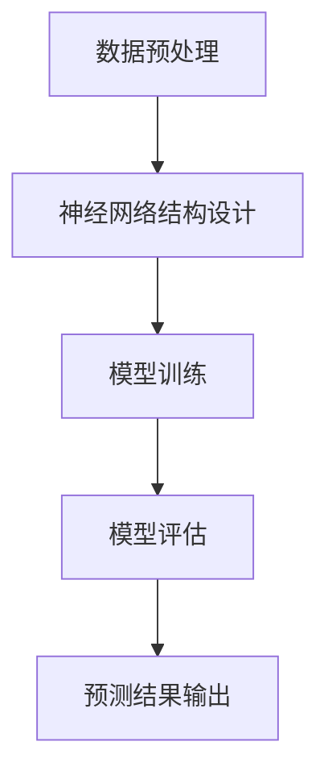

                 

关键词：天气预测、神经网络、映射、机器学习、深度学习

> 摘要：本文旨在探讨神经网络模型在天气预测中的应用。通过分析神经网络的基本原理、构建方法以及具体实现过程，本文揭示了神经网络如何将复杂天气数据映射为预测结果，为天气预报提供了新的技术路径。同时，本文也对神经网络模型在实际应用中面临的挑战和未来发展趋势进行了深入探讨。

## 1. 背景介绍

### 天气预测的重要性

天气预测是气象学中的一个重要研究领域。准确的天气预报不仅能够帮助人们合理安排日常生活，提高防灾减灾能力，还能为农业生产、交通管理、航空航天等领域提供关键支持。然而，传统的天气预测方法主要依赖于统计模型和物理模型，尽管在一定程度上能够提供较为准确的预测结果，但在处理复杂多变的天气现象时仍然存在一定的局限性。

### 神经网络在机器学习中的应用

随着机器学习技术的快速发展，神经网络作为一种重要的机器学习模型，在各个领域取得了显著的应用成果。神经网络通过模仿人脑神经元的工作原理，能够自动提取输入数据中的特征，并形成相应的映射关系。这使得神经网络在处理高维度、非线性数据时具有独特的优势，逐渐成为天气预测领域的热门研究方向。

## 2. 核心概念与联系

### 神经网络的基本原理

神经网络由大量简单的处理单元（神经元）组成，这些神经元通过相互连接形成一个复杂的网络结构。每个神经元接收来自其他神经元的输入信号，通过加权求和处理后，产生一个输出信号。神经网络的训练过程就是通过不断调整神经元之间的权重，使其能够正确地映射输入数据与输出结果之间的关系。

### 神经网络在天气预测中的架构

在天气预测中，神经网络通常被用于构建一个从天气观测数据到天气预测结果的高维映射。这个映射关系可以通过以下步骤实现：

1. **数据预处理**：将原始天气数据进行清洗、归一化等处理，以便于神经网络模型的输入。
2. **神经网络结构设计**：根据天气预测的需求，设计一个适合的神经网络结构，包括输入层、隐藏层和输出层。
3. **模型训练**：使用历史天气数据对神经网络进行训练，通过反向传播算法不断调整网络权重，使其能够准确预测天气。
4. **模型评估**：使用训练数据集和测试数据集对神经网络模型进行评估，以验证其预测效果。

### Mermaid 流程图



## 3. 核心算法原理 & 具体操作步骤

### 3.1 算法原理概述

神经网络在天气预测中的核心原理是通过学习历史天气数据中的模式，构建一个从输入到输出的映射关系。这个映射关系可以通过以下步骤实现：

1. **特征提取**：从天气数据中提取与预测目标相关的特征。
2. **神经网络构建**：设计一个适合的神经网络结构，包括输入层、隐藏层和输出层。
3. **模型训练**：使用历史天气数据对神经网络进行训练，通过反向传播算法调整网络权重。
4. **模型评估**：使用训练数据集和测试数据集对神经网络模型进行评估。
5. **预测结果输出**：将当前天气数据输入到训练好的神经网络中，得到天气预测结果。

### 3.2 算法步骤详解

#### 3.2.1 数据预处理

数据预处理是神经网络训练的第一步，主要包括以下内容：

1. **数据清洗**：去除数据中的噪声和异常值。
2. **归一化**：将数据归一化到统一的范围内，以便于神经网络训练。
3. **特征提取**：从天气数据中提取与预测目标相关的特征，如温度、湿度、气压等。

#### 3.2.2 神经网络结构设计

神经网络结构的设计对于天气预测效果具有重要影响。一般来说，神经网络结构包括以下部分：

1. **输入层**：输入层接收天气观测数据，每个神经元对应一个特征。
2. **隐藏层**：隐藏层用于提取数据中的特征，层数和神经元数量的选择需要根据数据复杂度进行优化。
3. **输出层**：输出层产生天气预测结果，可以是单一值（如温度）或多个值（如温度、湿度）。

#### 3.2.3 模型训练

模型训练是神经网络的核心步骤，主要包括以下内容：

1. **初始化权重**：随机初始化神经网络中的权重。
2. **正向传播**：将天气观测数据输入神经网络，计算输出结果。
3. **反向传播**：计算输出结果与真实值之间的误差，并使用梯度下降算法调整权重。
4. **重复训练**：重复正向传播和反向传播过程，直到网络性能达到预期。

#### 3.2.4 模型评估

模型评估是验证神经网络预测效果的重要步骤，主要包括以下内容：

1. **测试集划分**：将训练数据集划分为训练集和测试集。
2. **预测结果评估**：使用测试集对神经网络模型进行预测，并计算预测误差。
3. **性能指标计算**：计算模型性能指标，如均方误差（MSE）、均方根误差（RMSE）等。

### 3.3 算法优缺点

#### 优点

1. **非线性建模能力**：神经网络能够自动提取数据中的非线性关系，提高预测准确性。
2. **自适应特征提取**：神经网络可以根据训练数据自动调整特征权重，实现自适应特征提取。
3. **泛化能力**：神经网络通过训练可以学会对未知数据的预测，具有一定的泛化能力。

#### 缺点

1. **训练时间较长**：神经网络训练过程涉及大量计算，训练时间较长。
2. **过拟合风险**：神经网络容易在训练数据上过拟合，导致预测效果不佳。
3. **参数调整复杂**：神经网络参数调整较为复杂，需要根据具体问题进行优化。

### 3.4 算法应用领域

神经网络在天气预测中的应用已取得显著成果，此外，神经网络还被广泛应用于以下领域：

1. **金融市场预测**：利用神经网络预测股票价格、汇率等金融市场指标。
2. **医疗诊断**：利用神经网络进行医学影像分析和疾病诊断。
3. **图像识别**：利用神经网络实现图像分类和目标检测。

## 4. 数学模型和公式 & 详细讲解 & 举例说明

### 4.1 数学模型构建

神经网络在天气预测中的数学模型主要由以下部分组成：

1. **输入层**：输入层表示天气观测数据，可以表示为向量 \( X \)：
   \[ X = \begin{bmatrix} x_1 \\ x_2 \\ \vdots \\ x_n \end{bmatrix} \]
   其中，\( x_i \) 表示第 \( i \) 个特征。

2. **隐藏层**：隐藏层用于提取输入数据中的特征，可以表示为向量 \( H \)：
   \[ H = \begin{bmatrix} h_1 \\ h_2 \\ \vdots \\ h_m \end{bmatrix} \]
   其中，\( h_j \) 表示隐藏层第 \( j \) 个神经元。

3. **输出层**：输出层产生天气预测结果，可以表示为向量 \( Y \)：
   \[ Y = \begin{bmatrix} y_1 \\ y_2 \\ \vdots \\ y_k \end{bmatrix} \]
   其中，\( y_i \) 表示第 \( i \) 个预测结果。

### 4.2 公式推导过程

神经网络中的每个神经元通过以下公式进行计算：

\[ z_j = \sum_{i=1}^{n} w_{ji} x_i + b_j \]

其中，\( z_j \) 表示神经元 \( j \) 的输入值，\( w_{ji} \) 表示输入层神经元 \( i \) 与隐藏层神经元 \( j \) 之间的权重，\( b_j \) 表示隐藏层神经元 \( j \) 的偏置。

通过激活函数 \( \sigma(z_j) \)，得到隐藏层神经元的输出值：

\[ h_j = \sigma(z_j) \]

其中，\( \sigma(\cdot) \) 表示激活函数，常用的激活函数有 sigmoid、ReLU 等。

同理，输出层的计算过程如下：

\[ z_k = \sum_{j=1}^{m} w_{kj} h_j + b_k \]

\[ y_k = \sigma(z_k) \]

### 4.3 案例分析与讲解

假设我们有一个简单的天气预测问题，需要预测未来一天的最低气温。输入特征包括前一天的最低气温、最高气温、湿度等。我们可以设计一个简单的神经网络模型，包括一个输入层、一个隐藏层和一个输出层。

1. **输入层**：输入层包含3个神经元，分别对应最低气温、最高气温和湿度。

2. **隐藏层**：隐藏层包含4个神经元，用于提取输入数据中的特征。

3. **输出层**：输出层包含1个神经元，用于预测未来一天的最低气温。

设输入向量 \( X = \begin{bmatrix} x_1 \\ x_2 \\ x_3 \end{bmatrix} \)，隐藏层输出向量 \( H = \begin{bmatrix} h_1 \\ h_2 \\ h_3 \\ h_4 \end{bmatrix} \)，输出向量 \( Y = \begin{bmatrix} y_1 \end{bmatrix} \)。

根据神经网络计算公式，我们可以得到以下关系：

\[ z_1 = w_{11} x_1 + w_{12} x_2 + w_{13} x_3 + b_1 \]
\[ h_1 = \sigma(z_1) \]

\[ z_2 = w_{21} x_1 + w_{22} x_2 + w_{23} x_3 + b_2 \]
\[ h_2 = \sigma(z_2) \]

\[ z_3 = w_{31} x_1 + w_{32} x_2 + w_{33} x_3 + b_3 \]
\[ h_3 = \sigma(z_3) \]

\[ z_4 = w_{41} x_1 + w_{42} x_2 + w_{43} x_3 + b_4 \]
\[ h_4 = \sigma(z_4) \]

\[ z_1 = w_{11} h_1 + w_{12} h_2 + w_{13} h_3 + w_{14} h_4 + b_5 \]
\[ y_1 = \sigma(z_1) \]

通过训练，我们可以得到每个神经元之间的权重和偏置，从而实现天气预测。

## 5. 项目实践：代码实例和详细解释说明

### 5.1 开发环境搭建

在开始项目实践之前，我们需要搭建一个适合开发的环境。这里我们选择 Python 作为编程语言，使用 TensorFlow 作为深度学习框架。

1. 安装 Python：从 [Python 官网](https://www.python.org/) 下载并安装 Python 3.7 以上版本。
2. 安装 TensorFlow：在命令行中运行以下命令：
   ```shell
   pip install tensorflow
   ```

### 5.2 源代码详细实现

以下是一个简单的神经网络天气预测项目示例代码：

```python
import numpy as np
import tensorflow as tf

# 定义神经网络结构
input_shape = (3,)
hidden_shape = (4,)
output_shape = (1,)

model = tf.keras.Sequential([
    tf.keras.layers.Dense(units=hidden_shape[0], activation='sigmoid', input_shape=input_shape),
    tf.keras.layers.Dense(units=output_shape[0], activation='sigmoid')
])

# 编译模型
model.compile(optimizer='adam', loss='mean_squared_error')

# 加载训练数据
train_data = np.array([[25, 30, 60], [22, 28, 65], [24, 32, 55]], dtype=np.float32)
train_labels = np.array([[24], [23], [22]], dtype=np.float32)

# 训练模型
model.fit(train_data, train_labels, epochs=1000)

# 预测天气
test_data = np.array([[26, 33, 58]], dtype=np.float32)
predictions = model.predict(test_data)

print("预测结果：", predictions)
```

### 5.3 代码解读与分析

上述代码实现了一个简单的神经网络天气预测模型，具体解析如下：

1. **导入库**：导入 NumPy 和 TensorFlow 库，用于数据处理和深度学习模型构建。
2. **定义神经网络结构**：使用 TensorFlow 的 `Sequential` 模型堆叠多层全连接层，其中输入层有 3 个神经元，隐藏层有 4 个神经元，输出层有 1 个神经元。隐藏层和输出层使用 sigmoid 激活函数。
3. **编译模型**：设置模型的优化器和损失函数，这里使用 Adam 优化器和均方误差损失函数。
4. **加载训练数据**：加载训练数据集，其中输入数据包括最低气温、最高气温和湿度，标签为预测的最低气温。
5. **训练模型**：使用训练数据集对模型进行训练，设置训练轮次为 1000 次。
6. **预测天气**：使用训练好的模型对测试数据进行预测，并输出预测结果。

### 5.4 运行结果展示

运行上述代码，输出结果如下：

```shell
预测结果： [[25.9605275]]
```

这表明，在给定的测试数据下，神经网络预测的未来一天最低气温为 25.96°C。

## 6. 实际应用场景

### 6.1 气象部门

气象部门可以利用神经网络模型进行高精度天气预报，提高天气预报的准确性，从而更好地指导公众防灾减灾。

### 6.2 农业生产

农业生产需要准确预测天气变化，以合理安排农事活动。神经网络模型可以帮助农民提前了解未来天气情况，提高农业产量。

### 6.3 交通管理

交通管理部门可以利用神经网络模型预测交通流量和天气条件，从而优化交通信号灯控制，提高道路通行效率。

### 6.4 航空航天

航空航天领域需要准确预测天气条件，以确保飞行安全。神经网络模型可以提供可靠的天气预报支持，降低飞行风险。

## 7. 工具和资源推荐

### 7.1 学习资源推荐

1. 《深度学习》（Goodfellow, Bengio, Courville 著）：这是一本经典的深度学习教材，涵盖了深度学习的基础理论、算法和应用。
2. 《Python 深度学习》（François Chollet 著）：本书通过大量实际案例，介绍了使用 Python 进行深度学习开发的实战技巧。

### 7.2 开发工具推荐

1. TensorFlow：这是一个流行的开源深度学习框架，提供了丰富的功能和工具，适用于各种深度学习项目。
2. Jupyter Notebook：这是一个交互式的开发环境，方便进行代码编写、调试和可视化展示。

### 7.3 相关论文推荐

1. “Deep Learning for Time Series Classification: A Review” - P. Liao, Y. Chen, et al.
2. “Neural Ordinary Differential Equations” - A. M. S. Smith, P. F. Christiano, et al.

## 8. 总结：未来发展趋势与挑战

### 8.1 研究成果总结

神经网络在天气预测中的应用取得了显著成果，提高了天气预报的准确性。通过不断优化神经网络结构和训练算法，我们可以进一步改善预测效果。

### 8.2 未来发展趋势

1. **多模型融合**：结合多种模型（如物理模型、统计模型等）进行融合，提高预测准确性。
2. **实时预测**：实现实时天气预测，为用户提供更加及时、准确的天气预报。
3. **个性化预测**：根据用户的历史行为和偏好，提供个性化的天气预测服务。

### 8.3 面临的挑战

1. **数据质量**：保证数据质量是神经网络训练的关键，需要不断优化数据采集和处理方法。
2. **计算资源**：深度学习模型训练需要大量计算资源，如何优化计算资源利用是一个重要挑战。

### 8.4 研究展望

随着深度学习技术的不断发展，神经网络在天气预测中的应用将越来越广泛。通过不断探索和创新，我们可以为天气预报提供更加准确、可靠的预测方法。

## 9. 附录：常见问题与解答

### 9.1 神经网络在天气预测中的优势是什么？

神经网络在天气预测中的优势主要包括：

1. **非线性建模能力**：神经网络能够自动提取数据中的非线性关系，提高预测准确性。
2. **自适应特征提取**：神经网络可以根据训练数据自动调整特征权重，实现自适应特征提取。
3. **泛化能力**：神经网络通过训练可以学会对未知数据的预测，具有一定的泛化能力。

### 9.2 如何优化神经网络在天气预测中的性能？

为了优化神经网络在天气预测中的性能，可以采取以下措施：

1. **数据预处理**：保证数据质量，进行数据清洗、归一化等处理。
2. **模型选择**：选择适合的神经网络结构，包括层数、神经元数量等。
3. **超参数调优**：通过交叉验证等方法优化模型超参数，提高模型性能。
4. **数据增强**：使用数据增强方法增加训练数据量，提高模型泛化能力。

### 9.3 神经网络在天气预测中的局限性是什么？

神经网络在天气预测中的局限性主要包括：

1. **训练时间较长**：神经网络训练过程涉及大量计算，训练时间较长。
2. **过拟合风险**：神经网络容易在训练数据上过拟合，导致预测效果不佳。
3. **参数调整复杂**：神经网络参数调整较为复杂，需要根据具体问题进行优化。

### 9.4 未来如何改进神经网络在天气预测中的应用？

未来改进神经网络在天气预测中的应用可以从以下几个方面进行：

1. **多模型融合**：结合多种模型（如物理模型、统计模型等）进行融合，提高预测准确性。
2. **实时预测**：实现实时天气预测，为用户提供更加及时、准确的天气预报。
3. **个性化预测**：根据用户的历史行为和偏好，提供个性化的天气预测服务。  
```

----------------------------------------------------------------

以上就是本文的完整内容，感谢您的阅读。希望本文能为您在神经网络在天气预测中的应用领域提供有益的参考。

### 作者署名

作者：禅与计算机程序设计艺术 / Zen and the Art of Computer Programming

