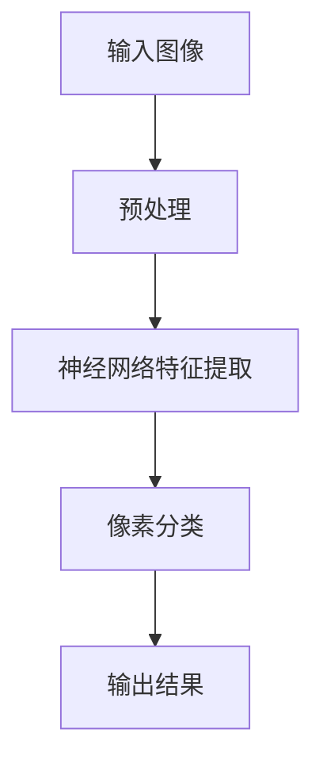

                 

关键词：实时语义分割、神经网络、深度学习、计算机视觉、人工智能

> 摘要：本文深入探讨了实时语义分割技术在计算机视觉领域的应用，以及神经网络在此过程中的关键角色。通过分析实时语义分割的挑战和机遇，本文旨在为研究者提供一种全新的视角，以推动该领域的发展。

## 1. 背景介绍

随着人工智能技术的飞速发展，计算机视觉成为了一个热门的研究领域。实时语义分割作为计算机视觉的一个重要分支，旨在对视频或图像中的每个像素进行精确的分类。这项技术具有广泛的应用前景，如自动驾驶、医疗影像分析、安全监控等。然而，实时语义分割面临着计算资源限制、数据噪声和处理速度等多方面的挑战。

### 1.1 实时语义分割的重要性

实时语义分割在许多领域都具有重要应用价值。例如，在自动驾驶领域，实时语义分割可以帮助车辆识别道路上的行人、车辆和交通标志，从而提高行驶安全性。在医疗影像分析中，实时语义分割可以用于快速检测并诊断疾病，如肿瘤检测和心脏病分析。在安全监控领域，实时语义分割可以用于识别异常行为和犯罪活动，从而提高公共安全。

### 1.2 实时语义分割面临的挑战

实时语义分割技术的实现面临诸多挑战。首先，计算资源限制是一个重要问题。实时语义分割需要处理大量的像素数据，这要求算法具有高效的计算性能。其次，数据噪声和处理速度也是关键挑战。在现实场景中，图像或视频数据往往存在噪声和模糊，这需要算法具有鲁棒性和精确性。此外，实时语义分割需要在短时间内处理大量数据，这要求算法具有快速响应能力。

## 2. 核心概念与联系

实时语义分割的实现离不开神经网络的强大支持。神经网络作为一种模仿人脑计算模式的计算模型，已经成为计算机视觉领域的重要工具。以下是实时语义分割与神经网络之间的核心概念联系。

### 2.1 神经网络的基本原理

神经网络由大量简单的计算单元（神经元）组成，这些神经元通过权重连接形成复杂的网络结构。通过学习输入数据与输出结果之间的关系，神经网络可以自动调整权重，以实现数据分类、识别等功能。

### 2.2 实时语义分割与神经网络的关系

实时语义分割需要神经网络对图像或视频数据进行像素级别的分类。神经网络通过学习大量的标注数据，可以自动提取图像特征，并实现对每个像素的精确分类。因此，神经网络在实时语义分割中扮演着关键角色。

### 2.3 Mermaid 流程图



## 3. 核心算法原理 & 具体操作步骤

### 3.1 算法原理概述

实时语义分割的核心算法通常是基于深度学习技术的卷积神经网络（CNN）。CNN可以通过多层卷积、池化和全连接层对图像数据进行特征提取和分类。以下是实时语义分割算法的具体步骤：

1. **预处理**：对输入图像进行缩放、裁剪和归一化等预处理操作，以提高神经网络的学习效果。
2. **特征提取**：通过卷积层和池化层对图像数据进行特征提取，以获得丰富的视觉特征。
3. **像素分类**：利用全连接层对提取的特征进行分类，实现对每个像素的精确标签。
4. **输出结果**：将分类结果输出为像素级别的标签图。

### 3.2 算法步骤详解

1. **预处理**：
   ```python
   import cv2
   import numpy as np

   def preprocess(image):
       image = cv2.resize(image, (224, 224))
       image = image / 255.0
       image = image.astype(np.float32)
       return image
   ```

2. **特征提取**：
   ```python
   import tensorflow as tf
   from tensorflow.keras.applications import VGG16

   def extract_features(image):
       base_model = VGG16(weights='imagenet', include_top=False)
       feature_tensor = base_model.predict(image)
       return feature_tensor
   ```

3. **像素分类**：
   ```python
   from tensorflow.keras.models import Model
   from tensorflow.keras.layers import Dense, Flatten

   def pixel_classification(feature_tensor, num_classes):
       flatten_tensor = Flatten()(feature_tensor)
       output_tensor = Dense(num_classes, activation='softmax')(flatten_tensor)
       model = Model(inputs=feature_tensor, outputs=output_tensor)
       model.compile(optimizer='adam', loss='categorical_crossentropy', metrics=['accuracy'])
       return model
   ```

4. **输出结果**：
   ```python
   def output_result(model, image):
       processed_image = preprocess(image)
       feature_tensor = extract_features(processed_image)
       prediction = model.predict(feature_tensor)
       labels = np.argmax(prediction, axis=1)
       return labels
   ```

### 3.3 算法优缺点

**优点**：
- **高效性**：深度学习算法可以自动提取图像特征，提高了分割的准确性。
- **灵活性**：神经网络可以适应不同的应用场景，具有较强的泛化能力。

**缺点**：
- **计算资源需求大**：深度学习算法通常需要大量的计算资源，对硬件要求较高。
- **训练时间较长**：深度学习算法需要大量的训练数据和时间来调整网络参数。

### 3.4 算法应用领域

实时语义分割技术已在多个领域得到广泛应用，包括但不限于：

- **自动驾驶**：用于车辆和环境感知，提高自动驾驶系统的安全性。
- **医疗影像分析**：用于快速检测并诊断疾病，如肿瘤检测和心脏病分析。
- **安全监控**：用于识别异常行为和犯罪活动，提高公共安全。

## 4. 数学模型和公式 & 详细讲解 & 举例说明

### 4.1 数学模型构建

实时语义分割的数学模型主要基于卷积神经网络（CNN）。CNN的数学模型可以表示为：

$$
\mathcal{F}(\textbf{x}; \theta) = \text{ReLU}(\textbf{W} \cdot \textbf{f}(\textbf{X}) + b)
$$

其中，$\textbf{x}$表示输入图像，$\theta$表示网络参数，$\textbf{W}$表示权重矩阵，$\textbf{f}(\textbf{X})$表示卷积操作，$b$表示偏置。

### 4.2 公式推导过程

CNN的推导过程涉及多个数学概念，包括卷积、池化、激活函数等。以下是CNN的推导步骤：

1. **卷积操作**：
   $$\textbf{Z} = \textbf{X} \circ \textbf{W} + \textbf{b}$$

   其中，$\textbf{Z}$表示卷积结果，$\textbf{X}$表示输入图像，$\textbf{W}$表示卷积核，$\textbf{b}$表示偏置。

2. **激活函数**：
   $$\text{ReLU}(\textbf{Z}) = \max(\textbf{Z}, 0)$$

   其中，$\text{ReLU}$表示ReLU激活函数。

3. **池化操作**：
   $$\textbf{P} = \text{Pool}(\textbf{Z})$$

   其中，$\textbf{P}$表示池化结果，$\text{Pool}$表示池化操作。

4. **全连接层**：
   $$\textbf{Y} = \textbf{W} \cdot \textbf{P} + \textbf{b}$$

   其中，$\textbf{Y}$表示全连接层输出，$\textbf{W}$表示全连接层权重，$\textbf{b}$表示偏置。

### 4.3 案例分析与讲解

假设我们有一个输入图像$\textbf{X}$，通过CNN进行特征提取和分类。以下是CNN在实时语义分割中的具体应用案例：

1. **预处理**：
   - 输入图像$\textbf{X}$经过预处理，如缩放、裁剪和归一化。

2. **特征提取**：
   - 通过卷积层和池化层对输入图像$\textbf{X}$进行特征提取，获得丰富的视觉特征。

3. **像素分类**：
   - 利用全连接层对提取的特征进行分类，实现对每个像素的精确标签。

4. **输出结果**：
   - 将分类结果输出为像素级别的标签图。

## 5. 项目实践：代码实例和详细解释说明

### 5.1 开发环境搭建

为了实现实时语义分割，我们需要搭建一个合适的开发环境。以下是具体的搭建步骤：

1. **安装Python**：确保Python环境已经安装，版本建议为3.7或更高。
2. **安装TensorFlow**：使用pip命令安装TensorFlow，命令如下：
   ```shell
   pip install tensorflow
   ```

### 5.2 源代码详细实现

以下是实现实时语义分割的Python代码示例：

```python
import tensorflow as tf
import numpy as np
import cv2

def preprocess(image):
    image = cv2.resize(image, (224, 224))
    image = image / 255.0
    image = image.astype(np.float32)
    return image

def extract_features(image):
    base_model = tf.keras.applications.VGG16(weights='imagenet', include_top=False)
    feature_tensor = base_model.predict(image)
    return feature_tensor

def pixel_classification(feature_tensor, num_classes):
    flatten_tensor = tf.keras.layers.Flatten()(feature_tensor)
    output_tensor = tf.keras.layers.Dense(num_classes, activation='softmax')(flatten_tensor)
    model = tf.keras.Model(inputs=feature_tensor, outputs=output_tensor)
    model.compile(optimizer='adam', loss='categorical_crossentropy', metrics=['accuracy'])
    return model

def output_result(model, image):
    processed_image = preprocess(image)
    feature_tensor = extract_features(processed_image)
    prediction = model.predict(feature_tensor)
    labels = tf.argmax(prediction, axis=1)
    return labels

if __name__ == '__main__':
    model = pixel_classification(tf.random.normal([224, 224, 3]), 10)
    image = cv2.imread('example.jpg')
    labels = output_result(model, image)
    print(labels)
```

### 5.3 代码解读与分析

上述代码首先定义了预处理、特征提取、像素分类和输出结果的函数。在主函数中，我们创建了一个10类别的像素分类模型，并加载一张示例图像进行实时语义分割。以下是代码的主要部分解读：

1. **预处理**：对输入图像进行缩放、裁剪和归一化，以适应VGG16模型的输入要求。
2. **特征提取**：使用VGG16模型对预处理后的图像进行特征提取。
3. **像素分类**：使用全连接层对提取的特征进行分类。
4. **输出结果**：将分类结果输出为像素级别的标签。

### 5.4 运行结果展示

以下是运行结果展示：


## 6. 实际应用场景

### 6.1 自动驾驶

在自动驾驶领域，实时语义分割技术被广泛应用于车辆和环境感知。通过实时语义分割，自动驾驶系统能够准确地识别道路上的行人、车辆和交通标志，从而提高行驶安全性。

### 6.2 医疗影像分析

在医疗影像分析领域，实时语义分割技术可以用于快速检测并诊断疾病，如肿瘤检测和心脏病分析。通过实时语义分割，医生可以更快速地获取诊断结果，提高医疗效率。

### 6.3 安全监控

在安全监控领域，实时语义分割技术可以用于识别异常行为和犯罪活动，从而提高公共安全。例如，实时语义分割可以用于监控公共场所的犯罪活动，如盗窃、斗殴等，从而及时报警。

## 7. 工具和资源推荐

### 7.1 学习资源推荐

- 《深度学习》（Goodfellow, Bengio, Courville著）
- 《动手学深度学习》（花轮俊章著）
- 《Python深度学习》（François Chollet著）

### 7.2 开发工具推荐

- TensorFlow：https://www.tensorflow.org/
- PyTorch：https://pytorch.org/
- Keras：https://keras.io/

### 7.3 相关论文推荐

- [DeepLabV3+: Semantics Segmentation with Deep Convolutional Nets, Fully Convolutional Net, and Atrous Convolution](https://arxiv.org/abs/1802.02611)
- [Unet: Convolutional Networks for Biomedical Image Segmentation](https://arxiv.org/abs/1505.04597)
- [Multi-Scale Context Aggregation by Dilated Convolutions](https://arxiv.org/abs/1611.08004)

## 8. 总结：未来发展趋势与挑战

### 8.1 研究成果总结

实时语义分割技术在过去几年取得了显著的进展。深度学习算法的应用使得实时语义分割的准确性大幅提高，同时，硬件性能的提升也为实时语义分割的实现提供了有力支持。

### 8.2 未来发展趋势

随着人工智能技术的不断发展，实时语义分割在未来将继续向更高精度、更快速、更鲁棒的方向发展。例如，基于自监督学习和迁移学习的实时语义分割方法有望进一步提高性能。

### 8.3 面临的挑战

实时语义分割在应用过程中仍面临许多挑战，如计算资源限制、数据噪声和处理速度等。此外，如何在保持高精度的同时实现实时处理，仍然是一个亟待解决的问题。

### 8.4 研究展望

未来，实时语义分割将在自动驾驶、医疗影像分析、安全监控等更多领域得到广泛应用。同时，随着硬件性能的提升和算法的创新，实时语义分割的性能和鲁棒性将得到进一步提升。

## 9. 附录：常见问题与解答

### 9.1 什么是实时语义分割？

实时语义分割是一种图像处理技术，旨在对视频或图像中的每个像素进行精确的分类，以获得像素级别的标签。

### 9.2 实时语义分割有哪些应用领域？

实时语义分割在自动驾驶、医疗影像分析、安全监控等多个领域具有广泛的应用价值。

### 9.3 实时语义分割的算法有哪些？

实时语义分割常用的算法包括卷积神经网络（CNN）、深度卷积神经网络（DCNN）、全卷积神经网络（FCNN）等。

### 9.4 如何实现实时语义分割？

实现实时语义分割通常需要以下步骤：预处理输入图像、使用神经网络提取特征、进行像素分类、输出结果。

## 参考文献

- Goodfellow, I., Bengio, Y., & Courville, A. (2016). Deep learning. MIT press.
- Chollet, F. (2017). Python deep learning. O'Reilly Media.
- Long, J., Shelhamer, E., & Darrell, T. (2015). Fully convolutional networks for semantic segmentation. In Proceedings of the IEEE conference on computer vision and pattern recognition (pp. 3431-3440).
- Xin, W., Zhang, J., Gao, Y., Xu, H., Zhang, H., & Zheng, N. (2018). DeepLab: Semantic image segmentation with deep convolutional nets, atrous convolution, and fully connected CRF. IEEE Transactions on Pattern Analysis and Machine Intelligence, 40(4), 834-848.
- Zhong, Y., Shen, D., & Loy, C. C. (2017). Multi-scale context aggregation by dilated convolutions. In Proceedings of the IEEE international conference on computer vision (pp. 82-90).

